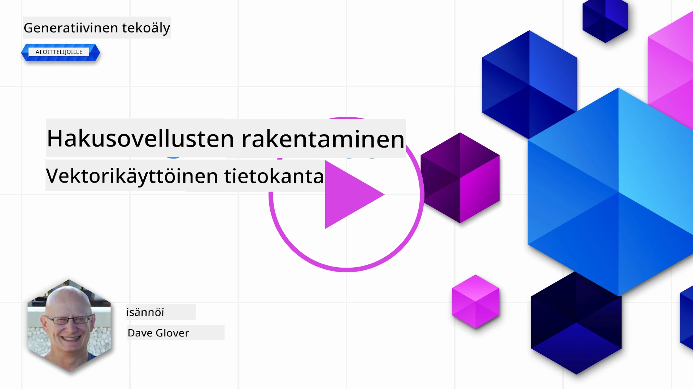
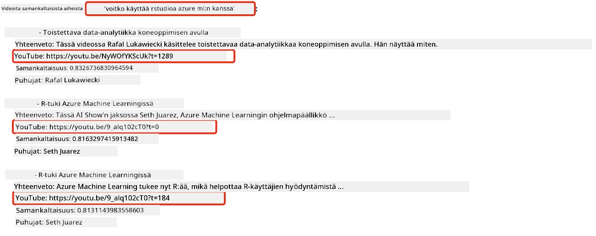
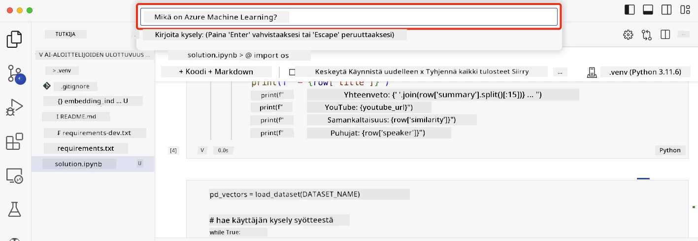

# Hakusovellusten rakentaminen

[](https://youtu.be/W0-nzXjOjr0?si=GcsqiTTvd7RKbo7V)

> > _Napsauta yllä olevaa kuvaa nähdäksesi tämän oppitunnin videon_

Suurissa kielimalleissa (LLM) on enemmän kuin vain chatbotit ja tekstintuotanto. On myös mahdollista rakentaa hakusovelluksia käyttäen upotuksia (Embeddings). Upotukset ovat numeerisia datan esityksiä, joita kutsutaan myös vektoreiksi, ja niitä voidaan käyttää semanttiseen hakuun datalle.

Tässä oppitunnissa rakennat hakusovelluksen koulutusstartupillemme. Startupimme on voittoa tavoittelematon järjestö, joka tarjoaa ilmaista koulutusta kehitysmaiden opiskelijoille. Startupillamme on suuri määrä YouTube-videoita, joita opiskelijat voivat käyttää oppiakseen tekoälystä. Startupimme haluaa rakentaa hakusovelluksen, joka mahdollistaa opiskelijoille YouTube-videon hakemisen kirjoittamalla kysymyksen.

Esimerkiksi opiskelija voi kirjoittaa 'Mitä ovat Jupyter Notebookit?' tai 'Mikä on Azure ML' ja hakusovellus palauttaa listan YouTube-videoista, jotka liittyvät kysymykseen, ja vielä parempaa, hakusovellus palauttaa linkin kohtaan videota, jossa vastaus kysymykseen sijaitsee.

## Johdanto

Tässä oppitunnissa käsittelemme:

- Semanttisen haun ja avainsanahaun erot.
- Mitä tekstin upotukset ovat.
- Tekstiupotusten indeksin luominen.
- Tekstiupotusten indeksin hakeminen.

## Oppimistavoitteet

Oppitunnin suorittamisen jälkeen osaat:

- Eritellä semanttinen haku ja avainsanahaku.
- Selittää, mitä tekstin upotukset ovat.
- Luoda sovelluksen käyttäen upotuksia datan hakuun.

## Miksi rakentaa hakusovellus?

Hakusovelluksen rakentaminen auttaa sinua ymmärtämään, miten upotuksia käytetään datan hakuun. Opit myös rakentamaan hakusovelluksen, jota opiskelijat voivat käyttää löytääkseen tiedot nopeasti.

Oppitunnin mukana tulee upotusten indeksi YouTube-käsikirjoituksista Microsoftin [AI Show](https://www.youtube.com/playlist?list=PLlrxD0HtieHi0mwteKBOfEeOYf0LJU4O1) YouTube-kanavalle. AI Show on YouTube-kanava, joka opettaa sinulle tekoälystä ja koneoppimisesta. Upotusten indeksi sisältää upotukset kaikista YouTube-käsikirjoituksista lokakuuhun 2023 saakka. Käytät tätä upotusten indeksiä rakentaaksesi hakusovelluksen startupillemme. Hakusovellus palauttaa linkin kohtaan videota, jossa vastaus kysymykseen sijaitsee. Tämä on loistava tapa opiskelijoille löytää tarvitsemansa tiedot nopeasti.

Seuraavassa on esimerkki semanttisesta hausta kysymykseen 'voinko käyttää RStudioa Azure ML:n kanssa?'. Katsokaa YouTube-url:ia, näette url sisältää aikaleiman, joka vie teidät suoraan kohtaan videota, jossa vastaus kysymykseen sijaitsee.



## Mitä on semanttinen haku?

Saatat miettiä, mitä semanttinen haku on? Semanttinen haku on hakutekniikka, joka käyttää hakulauseen sanojen merkitystä tuottaakseen asiaankuuluvia tuloksia.

Tässä on esimerkki semanttisesta hausta. Oletetaan, että etsit ostettavaa autoa, saatat hakea 'unelma-autoni'. Semanttinen haku ymmärtää, ettet `unelmoi` autosta vaan etsit `ihanteellista` autoasi. Semanttinen haku ymmärtää aikomuksesi ja palauttaa asiaankuuluvat tulokset. Vaihtoehto on `avainsanahaku`, joka etsisi kirjaimellisesti unelmia autoista ja usein palauttaisi epäolennaisia tuloksia.

## Mitä ovat tekstin upotukset?

[Tekstin upotukset](https://en.wikipedia.org/wiki/Word_embedding?WT.mc_id=academic-105485-koreyst) ovat tekstin esitystekniikka, jota käytetään [luonnollisen kielen käsittelyssä](https://en.wikipedia.org/wiki/Natural_language_processing?WT.mc_id=academic-105485-koreyst). Tekstin upotukset ovat tekstin semanttisia numeerisia esityksiä. Upotuksia käytetään datan esittämiseen tavalla, joka on koneelle helppo ymmärtää. On olemassa monia malleja tekstin upotusten luomiseen, tässä oppitunnissa keskitymme OpenAI:n upotusmallin käyttöön.

Tässä esimerkki, kuvittele, että seuraava teksti on käsikirjoituksesta yhdestä AI Show -YouTube-kanavan jaksosta:

```text
Today we are going to learn about Azure Machine Learning.
```

Lähetämme tekstin OpenAI Embedding API:lle, ja se palauttaa seuraavan upotuksen, joka koostuu 1536 luvusta eli vektorista. Jokainen vektorin luku kuvaa eri tekstin aspektia. Lyhyyden vuoksi tässä on vektorin ensimmäiset 10 lukua.

```python
[-0.006655829958617687, 0.0026128944009542465, 0.008792596869170666, -0.02446001023054123, -0.008540431968867779, 0.022071078419685364, -0.010703742504119873, 0.003311325330287218, -0.011632772162556648, -0.02187200076878071, ...]
```

## Miten upotusten indeksi luodaan?

Tämä oppitunti käyttää upotusten indeksiä, joka on luotu sarjalla Python-skriptejä. Löydät skriptit ja ohjeet [README](./scripts/README.md?WT.mc_id=academic-105485-koreyst) -tiedostosta tämän oppitunnin 'scripts'-kansiossa. Sinun ei tarvitse suorittaa näitä skriptejä oppitunnin suorittamiseksi, koska upotusten indeksi on valmiina.

Skriptit suorittavat seuraavat toiminnot:

1. Jokaisen AI Show -soittolistan [YouTube-videon](https://www.youtube.com/playlist?list=PLlrxD0HtieHi0mwteKBOfEeOYf0LJU4O1) käsikirjoitus ladataan.
2. Käyttäen [OpenAI Functions](https://learn.microsoft.com/azure/ai-foundry/openai/how-to/function-calling?WT.mc_id=academic-105485-koreyst), yritetään poimia puhujan nimi YouTube-käsikirjoituksen ensimmäisistä 3 minuutista. Jokaisen videon puhujan nimi tallennetaan upotusten indeksiin nimeltä `embedding_index_3m.json`.
3. Käsikirjoitusteksti pilkotaan sitten **3 minuutin tekstinpaloihin**. Jakso sisältää noin 20 sanan päällekkäisyyden seuraavasta jaksosta, jotta jaksosta luotu upotus ei katkea ja hakukonteksti paranee.
4. Jokainen tekstijakso lähetetään OpenAI Chat -API:lle tiivistettäväksi 60 sanaan. Tiivistelmä tallennetaan myös upotusten indeksiin `embedding_index_3m.json`.
5. Lopuksi jakson teksti lähetetään OpenAI Embedding -API:lle. Upotus-API palauttaa 1536-numeroisen vektorin, joka kuvaa jakson semanttista merkitystä. Jakso ja OpenAI:n upotusvektori tallennetaan upotusten indeksiin `embedding_index_3m.json`.

### Vektoripohjaiset tietokannat

Oppitunnin yksinkertaisuuden vuoksi upotusten indeksi tallennetaan JSON-tiedostoon nimeltä `embedding_index_3m.json` ja ladataan Pandas DataFrameen. Tuotantokäytössä upotusten indeksi tallennettaisiin vektorihakemistoon, kuten [Azure Cognitive Searchiin](https://learn.microsoft.com/training/modules/improve-search-results-vector-search?WT.mc_id=academic-105485-koreyst), [Redisiin](https://cookbook.openai.com/examples/vector_databases/redis/readme?WT.mc_id=academic-105485-koreyst), [Pineconeen](https://cookbook.openai.com/examples/vector_databases/pinecone/readme?WT.mc_id=academic-105485-koreyst), [Weaviateen](https://cookbook.openai.com/examples/vector_databases/weaviate/readme?WT.mc_id=academic-105485-koreyst) ja moniin muihin.

## Kosinilikeisyyden ymmärtäminen

Olemme oppineet tekstin upotuksista, seuraava vaihe on oppia käyttämään tekstin upotuksia datan hakuun ja erityisesti löytämään eniten vastaavat upotukset annettuun kyselyyn kosinilikeisyyden avulla.

### Mitä on kosinilikeisyys?

Kosinilikeisyys mittaa kahden vektorin välistä samankaltaisuutta, tätä kutsutaan myös `lähimmän naapurin hauksi`. Suorittaaksesi kosinilikeisyyshakua sinun täytyy _muuttaa_ _kyselyteksti_ vektoriksi OpenAI Embedding API:n avulla. Sitten lasketaan _kosinilikeisyys_ kyselyvektorin ja jokaisen upotusvektorin välillä indeksissä. Muista, että upotusindeksissä on vektori jokaiselle YouTube-käsikirjoituksen tekstijaksolle. Lopuksi lajittelet tulokset kosinilikeisyyden mukaan, ja tekstijaksot, joiden kosinilikeisyys on korkein, ovat samankaltaisimpia kyselyn kanssa.

Matemaattisesta näkökulmasta kosinilikeisyys mittaa kahden vektorin välistä kulmaa monidimensionaliassa avaruudessa. Tämä mittaus on hyödyllinen, koska jos kaksi dokumenttia ovat Euclidean etäisyyden mukaan kaukana toisistaan esimerkiksi koon takia, ne voivat silti olla lähempänä toisiaan suorassa kulmassa, jolloin kosinilikeisyys on korkeampi. Lisätietoja kosinilikeisyysta löytyy artikkelista [Kosinilikeisyys](https://en.wikipedia.org/wiki/Cosine_similarity?WT.mc_id=academic-105485-koreyst).

## Ensimmäisen hakusovelluksen rakentaminen

Seuraavaksi opit rakentamaan hakusovelluksen käyttäen upotuksia. Hakusovellus antaa opiskelijoiden hakea videoita kirjoittamalla kysymyksen. Hakusovellus palauttaa listan videoista, jotka ovat kyselyn kannalta relevantteja. Hakusovellus palauttaa myös linkin kohdalle videota, jossa vastaus kysymykseen sijaitsee.

Tämä ratkaisu on rakennettu ja testattu Windows 11:llä, macOS:llä ja Ubuntu 22.04:llä käyttäen Python 3.10 tai uudempaa. Voit ladata Pythonin osoitteesta [python.org](https://www.python.org/downloads/?WT.mc_id=academic-105485-koreyst).

## Tehtävä – hakusovelluksen rakentaminen opiskelijoiden tueksi

Esittelimme startupimme tämän oppitunnin alussa. Nyt on aika antaa opiskelijoille mahdollisuus rakentaa hakusovellus omiin tehtäviinsä.

Tässä tehtävässä luot Azure OpenAI -palvelut, joita käytetään hakusovelluksen rakentamiseen. Luot seuraavat Azure OpenAI -palvelut. Sinulla tulee olla Azure-tilaus tämän tehtävän suorittamiseksi.

### Käynnistä Azure Cloud Shell

1. Kirjaudu sisään [Azure-portaaliin](https://portal.azure.com/?WT.mc_id=academic-105485-koreyst).
2. Valitse Cloud Shell -kuvake Azure-portaalin oikeasta yläkulmasta.
3. Valitse ympäristötyypiksi **Bash**.

#### Luo resurssiryhmä

> Näissä ohjeissa käytämme resurssiryhmää nimeltä "semantic-video-search" East US -alueella.
> Voit vaihtaa resurssiryhmän nimeä, mutta kun muutat resurssien sijaintia,
> tarkista [mallien saatavuustaulu](https://aka.ms/oai/models?WT.mc_id=academic-105485-koreyst).

```shell
az group create --name semantic-video-search --location eastus
```

#### Luo Azure OpenAI -palveluresurssi

Azure Cloud Shellistä suorita seuraava komento luodaksesi Azure OpenAI -palveluresurssin.

```shell
az cognitiveservices account create --name semantic-video-openai --resource-group semantic-video-search \
    --location eastus --kind OpenAI --sku s0
```

#### Hanki päätepiste ja avaimet sovelluksen käyttöä varten

Azure Cloud Shellistä suorita seuraavat komennot saadaksesi Azure OpenAI -palveluresurssin päätepisteen ja avaimet.

```shell
az cognitiveservices account show --name semantic-video-openai \
   --resource-group  semantic-video-search | jq -r .properties.endpoint
az cognitiveservices account keys list --name semantic-video-openai \
   --resource-group semantic-video-search | jq -r .key1
```

#### Ota käyttöön OpenAI Embedding -malli

Azure Cloud Shellistä suorita seuraava komento ottaaksesi käyttöön OpenAI Embedding -mallin.

```shell
az cognitiveservices account deployment create \
    --name semantic-video-openai \
    --resource-group  semantic-video-search \
    --deployment-name text-embedding-ada-002 \
    --model-name text-embedding-ada-002 \
    --model-version "2"  \
    --model-format OpenAI \
    --sku-capacity 100 --sku-name "Standard"
```

## Ratkaisu

Avaa [ratkaisun muistikirja](./python/aoai-solution.ipynb?WT.mc_id=academic-105485-koreyst) GitHub Codespacesissa ja seuraa ohjeita Jupyter-muistikirjassa.

Muistikirjaa ajaessasi sinua pyydetään syöttämään kysely. Syöttökenttä näyttää tältä:



## Hienoa työtä! Jatka oppimista

Oppitunnin suorittamisen jälkeen tutustu [Generatiivisen tekoälyn oppimiskokoelmaamme](https://aka.ms/genai-collection?WT.mc_id=academic-105485-koreyst) kehittääksesi entisestään generatiivisen tekoälyn osaamistasi!

Siirry Oppitunnille 9, jossa tarkastelemme, miten [rakentaa kuvanluontisovelluksia](../09-building-image-applications/README.md?WT.mc_id=academic-105485-koreyst)!

---

<!-- CO-OP TRANSLATOR DISCLAIMER START -->
**Vastuuvapauslauseke**:
Tämä asiakirja on käännetty käyttämällä tekoälypohjaista käännöspalvelua [Co-op Translator](https://github.com/Azure/co-op-translator). Vaikka pyrimme tarkkuuteen, otathan huomioon, että automaattiset käännökset saattavat sisältää virheitä tai epätarkkuuksia. Alkuperäinen asiakirja sen alkuperäiskielellä on virallinen lähde. Tärkeissä asioissa suositellaan ammattimaista ihmiskäännöstä. Emme ole vastuussa tämän käännöksen käytöstä aiheutuvista väärinymmärryksistä tai tulkinnoista.
<!-- CO-OP TRANSLATOR DISCLAIMER END -->