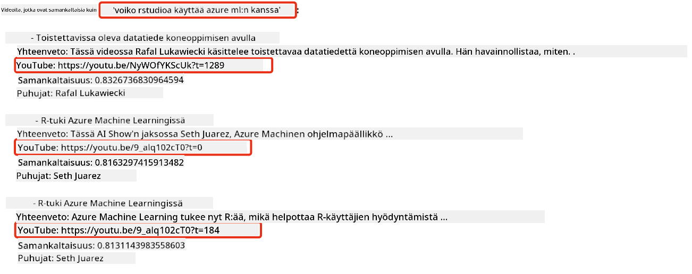
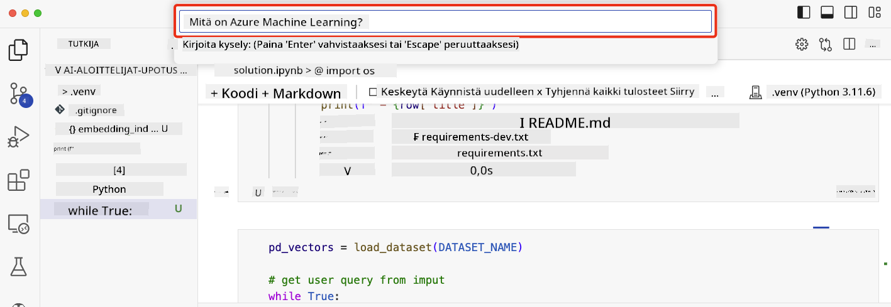

<!--
CO_OP_TRANSLATOR_METADATA:
{
  "original_hash": "d46aad0917a1a342d613e2c13d457da5",
  "translation_date": "2025-07-09T12:57:25+00:00",
  "source_file": "08-building-search-applications/README.md",
  "language_code": "fi"
}
-->
# Hakusovellusten rakentaminen

[](https://aka.ms/gen-ai-lesson8-gh?WT.mc_id=academic-105485-koreyst)

> > _Klikkaa yllä olevaa kuvaa nähdäksesi tämän oppitunnin videon_

LLM-mallit eivät rajoitu pelkästään chatbotteihin ja tekstin generointiin. On myös mahdollista rakentaa hakusovelluksia käyttämällä Embeddingeja. Embeddingit ovat numeerisia esityksiä datasta, joita kutsutaan myös vektoreiksi, ja niitä voidaan käyttää semanttiseen hakuun.

Tässä oppitunnissa rakennat hakusovelluksen koulutusstartupillemme. Startupimme on voittoa tavoittelematon organisaatio, joka tarjoaa ilmaista koulutusta kehitysmaiden opiskelijoille. Startupillamme on suuri määrä YouTube-videoita, joita opiskelijat voivat käyttää tekoälyn oppimiseen. Startup haluaa rakentaa hakusovelluksen, jonka avulla opiskelijat voivat etsiä YouTube-videoita kirjoittamalla kysymyksen.

Esimerkiksi opiskelija saattaa kirjoittaa 'Mitä ovat Jupyter Notebookit?' tai 'Mikä on Azure ML' ja hakusovellus palauttaa listan YouTube-videoista, jotka liittyvät kysymykseen. Vielä parempaa, hakusovellus palauttaa linkin kohtaan videossa, jossa kysymykseen löytyy vastaus.

## Johdanto

Tässä oppitunnissa käsittelemme:

- Semanttinen haku vs avainsanahaku.
- Mitä ovat tekstin embeddingit.
- Tekstien embedding-indeksin luominen.
- Tekstien embedding-indeksin hakeminen.

## Oppimistavoitteet

Oppitunnin suorittamisen jälkeen osaat:

- Erottaa semanttisen haun ja avainsanahaun toisistaan.
- Selittää, mitä tekstin embeddingit ovat.
- Luoda sovelluksen, joka käyttää embeddingeja datan hakemiseen.

## Miksi rakentaa hakusovellus?

Hakusovelluksen rakentaminen auttaa ymmärtämään, miten embeddingeja käytetään datan hakemiseen. Opit myös rakentamaan hakusovelluksen, jota opiskelijat voivat käyttää löytääkseen tietoa nopeasti.

Oppitunnissa on mukana embedding-indeksi Microsoftin [AI Show](https://www.youtube.com/playlist?list=PLlrxD0HtieHi0mwteKBOfEeOYf0LJU4O1) YouTube-kanavan tekstityksistä. AI Show on YouTube-kanava, joka opettaa tekoälystä ja koneoppimisesta. Embedding-indeksi sisältää embeddingit jokaisesta YouTube-videoiden tekstityksestä lokakuuhun 2023 asti. Käytät tätä embedding-indeksiä rakentaaksesi hakusovelluksen startupillemme. Hakusovellus palauttaa linkin kohtaan videossa, jossa kysymykseen löytyy vastaus. Tämä on erinomainen tapa opiskelijoille löytää tarvitsemansa tieto nopeasti.

Alla on esimerkki semanttisesta hausta kysymykselle 'voiko rstudiota käyttää Azure ML:n kanssa?'. Katso YouTube-URL:ia, huomaat, että URL sisältää aikaleiman, joka vie sinut kohtaan videossa, jossa vastaus kysymykseen löytyy.



## Mitä on semanttinen haku?

Saatat miettiä, mitä semanttinen haku tarkoittaa? Semanttinen haku on hakutekniikka, joka käyttää hakulauseen sanojen merkitystä eli semantiikkaa palauttaakseen relevantteja tuloksia.

Tässä esimerkki semanttisesta hausta. Oletetaan, että haluat ostaa auton ja haet 'unelma-autoani'. Semanttinen haku ymmärtää, ettet unelmoi autosta vaan etsit ihanteellista autoasi. Semanttinen haku ymmärtää aikomuksesi ja palauttaa asiaankuuluvat tulokset. Vaihtoehtona on avainsanahaku, joka etsisi kirjaimellisesti unelmia autoista ja palauttaisi usein epäolennaisia tuloksia.

## Mitä ovat tekstin embeddingit?

[Text embeddings](https://en.wikipedia.org/wiki/Word_embedding?WT.mc_id=academic-105485-koreyst) ovat tekstin esitystekniikka, jota käytetään [luonnollisen kielen käsittelyssä](https://en.wikipedia.org/wiki/Natural_language_processing?WT.mc_id=academic-105485-koreyst). Tekstin embeddingit ovat semanttisia numeerisia esityksiä tekstistä. Embeddingeja käytetään esittämään dataa koneen ymmärrettävässä muodossa. On olemassa monia malleja tekstin embeddingien luomiseen, tässä oppitunnissa keskitymme OpenAI Embedding -mallin käyttöön.

Tässä esimerkki: kuvittele, että seuraava teksti on AI Show -kanavan jakson tekstityksessä:

```text
Today we are going to learn about Azure Machine Learning.
```

Syötämme tekstin OpenAI Embedding API:lle, joka palauttaa seuraavan embeddingin, joka koostuu 1536 numerosta eli vektorista. Jokainen vektorin luku kuvaa eri puolta tekstistä. Tiiviyden vuoksi tässä ovat vektorin ensimmäiset 10 lukua.

```python
[-0.006655829958617687, 0.0026128944009542465, 0.008792596869170666, -0.02446001023054123, -0.008540431968867779, 0.022071078419685364, -0.010703742504119873, 0.003311325330287218, -0.011632772162556648, -0.02187200076878071, ...]
```

## Miten embedding-indeksi luodaan?

Tämän oppitunnin embedding-indeksi on luotu sarjalla Python-skriptejä. Löydät skriptit ja ohjeet [README-tiedostosta](./scripts/README.md?WT.mc_id=academic-105485-koreyst) tämän oppitunnin 'scripts'-kansiosta. Sinun ei tarvitse ajaa näitä skriptejä oppitunnin suorittamiseksi, sillä embedding-indeksi on valmiina.

Skriptit suorittavat seuraavat toiminnot:

1. Jokaisen [AI Show](https://www.youtube.com/playlist?list=PLlrxD0HtieHi0mwteKBOfEeOYf0LJU4O1) -soittolistan YouTube-videon tekstitys ladataan.
2. Käyttäen [OpenAI Functions](https://learn.microsoft.com/azure/ai-services/openai/how-to/function-calling?WT.mc_id=academic-105485-koreyst) yritetään poimia puhujan nimi YouTube-tekstityksen ensimmäisen 3 minuutin ajalta. Puhujan nimi tallennetaan embedding-indeksiin nimeltä `embedding_index_3m.json`.
3. Tekstitys jaetaan **3 minuutin tekstipätkiin**. Pätkissä on noin 20 sanan päällekkäisyys seuraavan pätkän kanssa, jotta embedding ei katkea ja haku toimii paremmin.
4. Jokainen tekstipätkä lähetetään OpenAI Chat API:lle, joka tiivistää tekstin 60 sanaan. Tiivistelmä tallennetaan myös embedding-indeksiin `embedding_index_3m.json`.
5. Lopuksi tekstipätkä lähetetään OpenAI Embedding API:lle. Embedding API palauttaa 1536-numeroisen vektorin, joka kuvaa pätkän semanttista merkitystä. Pätkä ja vektori tallennetaan embedding-indeksiin `embedding_index_3m.json`.

### Vektoripohjaiset tietokannat

Oppitunnin yksinkertaisuuden vuoksi embedding-indeksi tallennetaan JSON-tiedostoon nimeltä `embedding_index_3m.json` ja ladataan Pandas DataFrameen. Tuotantoympäristössä embedding-indeksi tallennettaisiin vektoripohjaiseen tietokantaan, kuten [Azure Cognitive Search](https://learn.microsoft.com/training/modules/improve-search-results-vector-search?WT.mc_id=academic-105485-koreyst), [Redis](https://cookbook.openai.com/examples/vector_databases/redis/readme?WT.mc_id=academic-105485-koreyst), [Pinecone](https://cookbook.openai.com/examples/vector_databases/pinecone/readme?WT.mc_id=academic-105485-koreyst), [Weaviate](https://cookbook.openai.com/examples/vector_databases/weaviate/readme?WT.mc_id=academic-105485-koreyst) ja moniin muihin.

## Kosiniläisyyden ymmärtäminen

Olemme oppineet tekstin embeddingeistä, seuraava askel on oppia käyttämään niitä datan hakemiseen ja erityisesti löytämään kyselyä lähimpänä olevat embeddingit kosiniläisyyden avulla.

### Mitä on kosiniläisyys?

Kosiniläisyys mittaa kahden vektorin samankaltaisuutta, tätä kutsutaan myös `lähimmän naapurin hauksi`. Kosiniläisyyshaku tehdään vektorisoimalla _kyselyteksti_ OpenAI Embedding API:lla. Sitten lasketaan _kosiniläisyys_ kyselyvektorin ja jokaisen embedding-indeksin vektorin välillä. Muista, että embedding-indeksissä on vektori jokaiselle YouTube-tekstipätkälle. Lopuksi tulokset järjestetään kosiniläisyyden mukaan, ja suurimman kosiniläisyyden omaavat tekstipätkät ovat lähimpänä kyselyä.

Matemaattisesti kosiniläisyys mittaa kahden vektorin välisen kulman kosinia monidimensionaalisessa avaruudessa. Tämä on hyödyllistä, koska vaikka kaksi dokumenttia olisivat kaukana toisistaan euklidisessa etäisyydessä koon vuoksi, niillä voi silti olla pieni kulma ja siten korkea kosiniläisyys. Lisätietoja kosiniläisyyskaavoista löytyy [Cosine similarity](https://en.wikipedia.org/wiki/Cosine_similarity?WT.mc_id=academic-105485-koreyst) -artikkelista.

## Ensimmäisen hakusovelluksesi rakentaminen

Seuraavaksi opimme rakentamaan hakusovelluksen embeddingeja käyttäen. Hakusovellus antaa opiskelijoille mahdollisuuden hakea videoita kirjoittamalla kysymyksen. Hakusovellus palauttaa listan videoista, jotka liittyvät kysymykseen. Lisäksi se palauttaa linkin kohtaan videossa, jossa kysymykseen löytyy vastaus.

Tämä ratkaisu on rakennettu ja testattu Windows 11:llä, macOS:llä ja Ubuntu 22.04:llä käyttäen Python 3.10 tai uudempaa. Voit ladata Pythonin osoitteesta [python.org](https://www.python.org/downloads/?WT.mc_id=academic-105485-koreyst).

## Tehtävä – hakusovelluksen rakentaminen opiskelijoille

Esittelimme startupimme tämän oppitunnin alussa. Nyt on aika antaa opiskelijoille mahdollisuus rakentaa hakusovellus omiin tehtäviinsä.

Tässä tehtävässä luot Azure OpenAI -palvelut, joita käytetään hakusovelluksen rakentamiseen. Luot seuraavat Azure OpenAI -palvelut. Tarvitset Azure-tilauksen tehtävän suorittamiseen.

### Käynnistä Azure Cloud Shell

1. Kirjaudu sisään [Azure-portaaliin](https://portal.azure.com/?WT.mc_id=academic-105485-koreyst).
2. Valitse Cloud Shell -kuvake Azure-portaalin oikeasta yläkulmasta.
3. Valitse ympäristöksi **Bash**.

#### Luo resurssiryhmä

> Näissä ohjeissa käytämme "semantic-video-search" -nimistä resurssiryhmää East US -alueella.
> Voit vaihtaa resurssiryhmän nimeä, mutta kun vaihdat resurssien sijaintia,
> tarkista [mallien saatavuustaulukko](https://aka.ms/oai/models?WT.mc_id=academic-105485-koreyst).

```shell
az group create --name semantic-video-search --location eastus
```

#### Luo Azure OpenAI Service -resurssi

Azure Cloud Shellissä suorita seuraava komento luodaksesi Azure OpenAI Service -resurssin.

```shell
az cognitiveservices account create --name semantic-video-openai --resource-group semantic-video-search \
    --location eastus --kind OpenAI --sku s0
```

#### Hanki päätepiste ja avaimet sovelluksen käyttöä varten

Azure Cloud Shellissä suorita seuraavat komennot saadaksesi päätepisteen ja avaimet Azure OpenAI Service -resurssille.

```shell
az cognitiveservices account show --name semantic-video-openai \
   --resource-group  semantic-video-search | jq -r .properties.endpoint
az cognitiveservices account keys list --name semantic-video-openai \
   --resource-group semantic-video-search | jq -r .key1
```

#### Ota käyttöön OpenAI Embedding -malli

Azure Cloud Shellissä suorita seuraava komento ottaaksesi käyttöön OpenAI Embedding -mallin.

```shell
az cognitiveservices account deployment create \
    --name semantic-video-openai \
    --resource-group  semantic-video-search \
    --deployment-name text-embedding-ada-002 \
    --model-name text-embedding-ada-002 \
    --model-version "2"  \
    --model-format OpenAI \
    --sku-capacity 100 --sku-name "Standard"
```

## Ratkaisu

Avaa [ratkaisun Jupyter Notebook](../../../08-building-search-applications/python/aoai-solution.ipynb) GitHub Codespacesissa ja seuraa ohjeita.

Kun ajat notebookin, sinulta kysytään hakukyselyä. Syöttökenttä näyttää tältä:



## Hienoa työtä! Jatka oppimista

Oppitunnin suorittamisen jälkeen tutustu [Generative AI Learning -kokoelmaamme](https://aka.ms/genai-collection?WT.mc_id=academic-105485-koreyst) jatkaaksesi generatiivisen tekoälyn osaamisesi kehittämistä!

Siirry oppitunnille 9, jossa tutustumme siihen, miten [rakentaa kuvageneraattorisovelluksia](../09-building-image-applications/README.md?WT.mc_id=academic-105485-koreyst)!

**Vastuuvapauslauseke**:  
Tämä asiakirja on käännetty käyttämällä tekoälypohjaista käännöspalvelua [Co-op Translator](https://github.com/Azure/co-op-translator). Vaikka pyrimme tarkkuuteen, huomioithan, että automaattikäännöksissä saattaa esiintyä virheitä tai epätarkkuuksia. Alkuperäistä asiakirjaa sen alkuperäiskielellä tulee pitää virallisena lähteenä. Tärkeissä asioissa suositellaan ammattimaista ihmiskäännöstä. Emme ole vastuussa tämän käännöksen käytöstä aiheutuvista väärinymmärryksistä tai tulkinnoista.