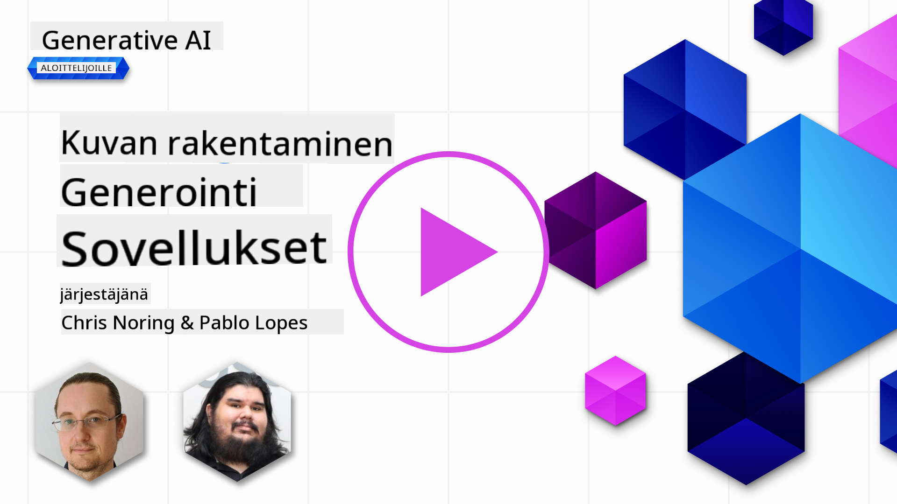

<!--
CO_OP_TRANSLATOR_METADATA:
{
  "original_hash": "ef74ad58fc01f7ad80788f79505f9816",
  "translation_date": "2025-08-26T17:47:15+00:00",
  "source_file": "09-building-image-applications/README.md",
  "language_code": "fi"
}
-->
# Kuvien generointisovellusten rakentaminen

[](https://aka.ms/gen-ai-lesson9-gh?WT.mc_id=academic-105485-koreyst)

LLM-malleilla voi tehdä muutakin kuin tuottaa tekstiä. On myös mahdollista luoda kuvia tekstikuvauksista. Kuvien käyttö voi olla erittäin hyödyllistä monilla aloilla, kuten terveydenhuollossa, arkkitehtuurissa, matkailussa, pelikehityksessä ja monessa muussa. Tässä luvussa tutustumme kahteen suosituimpaan kuvageneraattoriin: DALL-E ja Midjourney.

## Johdanto

Tässä oppitunnissa käsitellään:

- Kuvien generointi ja miksi se on hyödyllistä.
- DALL-E ja Midjourney, mitä ne ovat ja miten ne toimivat.
- Miten rakennetaan kuvagenerointisovellus.

## Oppimistavoitteet

Kun olet suorittanut tämän oppitunnin, osaat:

- Rakentaa kuvagenerointisovelluksen.
- Määritellä sovelluksellesi rajat metapromptien avulla.
- Työskennellä DALL-E:n ja Midjourneyn kanssa.

## Miksi rakentaa kuvagenerointisovellus?

Kuvagenerointisovellukset ovat erinomainen tapa tutkia generatiivisen tekoälyn mahdollisuuksia. Niitä voi käyttää esimerkiksi:

- **Kuvien muokkaus ja synteesi**. Voit luoda kuvia monenlaisiin käyttötarkoituksiin, kuten kuvien muokkaukseen ja synteesiin.

- **Sovellettavissa monille aloille**. Niillä voi tuottaa kuvia eri aloille, kuten terveydenhuoltoon, matkailuun, pelikehitykseen ja moneen muuhun.

## Tilanne: Edu4All

Tässä oppitunnissa jatkamme työskentelyä startup-yrityksemme Edu4Allin kanssa. Oppilaat luovat kuvia arviointejaan varten, ja he saavat itse päättää, millaisia kuvia tekevät. Ne voivat olla esimerkiksi kuvituksia omaan satuun, uuden hahmon luomista tarinaan tai apua ideoiden ja käsitteiden visualisointiin.

Tässä esimerkki siitä, mitä Edu4Allin oppilaat voisivat tuottaa, jos he työskentelevät luokassa monumenttien parissa:


käyttäen esimerkiksi tällaista promptia

> "Koira Eiffel-tornin vieressä varhaisen aamun auringonvalossa"

## Mitä ovat DALL-E ja Midjourney?

[DALL-E](https://openai.com/dall-e-2?WT.mc_id=academic-105485-koreyst) ja [Midjourney](https://www.midjourney.com/?WT.mc_id=academic-105485-koreyst) ovat kaksi suosituimmista kuvagenerointimalleista, joiden avulla voit luoda kuvia antamalla tekstipromptin.

### DALL-E

Aloitetaan DALL-E:sta, joka on generatiivinen tekoälymalli, joka tuottaa kuvia tekstikuvauksista.

> [DALL-E yhdistää kaksi mallia, CLIP ja diffused attention](https://towardsdatascience.com/openais-dall-e-and-clip-101-a-brief-introduction-3a4367280d4e?WT.mc_id=academic-105485-koreyst).

- **CLIP** on malli, joka tuottaa upotuksia eli numeerisia esityksiä datasta kuvista ja tekstistä.

- **Diffused attention** on malli, joka tuottaa kuvia upotuksista. DALL-E on koulutettu kuvien ja tekstin aineistolla ja sitä voi käyttää kuvien tuottamiseen tekstikuvauksista. Esimerkiksi DALL-E:lla voi luoda kuvan kissasta hattu päässä tai koirasta irokeesilla.

### Midjourney

Midjourney toimii samankaltaisesti kuin DALL-E, eli se tuottaa kuvia tekstipromptien perusteella. Midjourney:lla voi myös luoda kuvia esimerkiksi promptilla “kissa hattu päässä” tai “koira irokeesilla”.


_Kuvan lähde Wikipedia, kuva luotu Midjourneyllä_

## Miten DALL-E ja Midjourney toimivat

Ensiksi [DALL-E](https://arxiv.org/pdf/2102.12092.pdf?WT.mc_id=academic-105485-koreyst). DALL-E on generatiivinen tekoälymalli, joka perustuu transformer-arkkitehtuuriin ja _autoregressiiviseen transformer-malliin_.

_Autoregressiivinen transformer_ määrittelee, miten malli tuottaa kuvia tekstikuvauksista: se luo yhden pikselin kerrallaan ja käyttää jo luotuja pikseleitä seuraavan pikselin tuottamiseen. Prosessi kulkee useiden neuroverkkokerrosten läpi, kunnes kuva on valmis.

Tämän prosessin avulla DALL-E hallitsee kuvan ominaisuuksia, objekteja, piirteitä ja muuta. DALL-E 2 ja 3 tarjoavat vielä enemmän kontrollia luotuun kuvaan.

## Ensimmäisen kuvagenerointisovelluksen rakentaminen

Mitä tarvitset kuvagenerointisovelluksen rakentamiseen? Tarvitset seuraavat kirjastot:

- **python-dotenv**, tätä kirjastoa suositellaan vahvasti, jotta salaisuudet pysyvät _.env_-tiedostossa erillään koodista.
- **openai**, tällä kirjastolla kommunikoit OpenAI:n API:n kanssa.
- **pillow**, kuvien käsittelyyn Pythonissa.
- **requests**, HTTP-pyyntöjen tekemiseen.

## Luo ja ota käyttöön Azure OpenAI -malli

Jos et ole vielä tehnyt sitä, seuraa ohjeita [Microsoft Learn](https://learn.microsoft.com/azure/ai-foundry/openai/how-to/create-resource?pivots=web-portal) -sivulla
luodaksesi Azure OpenAI -resurssin ja mallin. Valitse malliksi DALL-E 3.  

## Sovelluksen luominen

1. Luo _.env_-tiedosto, jossa on seuraava sisältö:

   ```text
   AZURE_OPENAI_ENDPOINT=<your endpoint>
   AZURE_OPENAI_API_KEY=<your key>
   AZURE_OPENAI_DEPLOYMENT="dall-e-3"
   ```

   Löydät nämä tiedot Azure OpenAI Foundry Portaalista resurssisi "Deployments"-osiosta.

1. Kerää yllä mainitut kirjastot _requirements.txt_-tiedostoon näin:

   ```text
   python-dotenv
   openai
   pillow
   requests
   ```

1. Seuraavaksi luo virtuaaliympäristö ja asenna kirjastot:

   ```bash
   python3 -m venv venv
   source venv/bin/activate
   pip install -r requirements.txt
   ```

   Windowsissa käytä seuraavia komentoja virtuaaliympäristön luomiseen ja aktivointiin:

   ```bash
   python3 -m venv venv
   venv\Scripts\activate.bat
   ```

1. Lisää seuraava koodi tiedostoon _app.py_:

    ```python
    import openai
    import os
    import requests
    from PIL import Image
    import dotenv
    from openai import OpenAI, AzureOpenAI
    
    # import dotenv
    dotenv.load_dotenv()
    
    # configure Azure OpenAI service client 
    client = AzureOpenAI(
      azure_endpoint = os.environ["AZURE_OPENAI_ENDPOINT"],
      api_key=os.environ['AZURE_OPENAI_API_KEY'],
      api_version = "2024-02-01"
      )
    try:
        # Create an image by using the image generation API
        generation_response = client.images.generate(
                                prompt='Bunny on horse, holding a lollipop, on a foggy meadow where it grows daffodils',
                                size='1024x1024', n=1,
                                model=os.environ['AZURE_OPENAI_DEPLOYMENT']
                              )

        # Set the directory for the stored image
        image_dir = os.path.join(os.curdir, 'images')

        # If the directory doesn't exist, create it
        if not os.path.isdir(image_dir):
            os.mkdir(image_dir)

        # Initialize the image path (note the filetype should be png)
        image_path = os.path.join(image_dir, 'generated-image.png')

        # Retrieve the generated image
        image_url = generation_response.data[0].url  # extract image URL from response
        generated_image = requests.get(image_url).content  # download the image
        with open(image_path, "wb") as image_file:
            image_file.write(generated_image)

        # Display the image in the default image viewer
        image = Image.open(image_path)
        image.show()

    # catch exceptions
    except openai.InvalidRequestError as err:
        print(err)
   ```

Selitetään tämä koodi:

- Ensin tuodaan tarvittavat kirjastot, mukaan lukien OpenAI, dotenv, requests ja Pillow.

  ```python
  import openai
  import os
  import requests
  from PIL import Image
  import dotenv
  ```

- Seuraavaksi ladataan ympäristömuuttujat _.env_-tiedostosta.

  ```python
  # import dotenv
  dotenv.load_dotenv()
  ```

- Tämän jälkeen konfiguroidaan Azure OpenAI -palvelun asiakas

  ```python
  # Get endpoint and key from environment variables
  client = AzureOpenAI(
      azure_endpoint = os.environ["AZURE_OPENAI_ENDPOINT"],
      api_key=os.environ['AZURE_OPENAI_API_KEY'],
      api_version = "2024-02-01"
      )
  ```

- Sitten generoidaan kuva:

  ```python
  # Create an image by using the image generation API
  generation_response = client.images.generate(
                        prompt='Bunny on horse, holding a lollipop, on a foggy meadow where it grows daffodils',
                        size='1024x1024', n=1,
                        model=os.environ['AZURE_OPENAI_DEPLOYMENT']
                      )
  ```

  Yllä oleva koodi palauttaa JSON-objektin, joka sisältää luodun kuvan URL-osoitteen. Voimme käyttää URL:ia kuvan lataamiseen ja tallentamiseen tiedostoon.

- Lopuksi avataan kuva ja näytetään se tavallisella kuvankatseluohjelmalla:

  ```python
  image = Image.open(image_path)
  image.show()
  ```

### Lisätietoja kuvan generoinnista

Katsotaan tarkemmin koodia, joka generoi kuvan:

    ```python
      generation_response = client.images.generate(
                                prompt='Bunny on horse, holding a lollipop, on a foggy meadow where it grows daffodils',
                                size='1024x1024', n=1,
                                model=os.environ['AZURE_OPENAI_DEPLOYMENT']
                            )
    ```

- **prompt** on tekstiprompti, jolla kuva luodaan. Tässä käytetään promptia "Pupu hevosen selässä, pitää tikkaria, sumuisella niityllä jossa kasvaa narsisseja".
- **size** määrittää luotavan kuvan koon. Tässä luodaan 1024x1024 pikselin kuva.
- **n** on luotavien kuvien määrä. Tässä luodaan kaksi kuvaa.
- **temperature** on parametri, joka säätelee generatiivisen tekoälymallin tuottaman sisällön satunnaisuutta. Arvo on välillä 0–1, missä 0 tarkoittaa determinististä ja 1 satunnaista tulosta. Oletusarvo on 0.7.

Kuvien kanssa voi tehdä paljon muutakin, joista lisää seuraavassa osiossa.

## Kuvageneroinnin lisäominaisuudet

Olet nähnyt, miten kuvan voi luoda muutamalla Python-rivillä. Kuvien kanssa voi kuitenkin tehdä paljon muutakin.

Voit esimerkiksi:

- **Muokata kuvia**. Antamalla olemassa olevan kuvan, maskin ja promptin, voit muuttaa kuvaa. Voit esimerkiksi lisätä jotakin kuvan osaan. Kuvitellaan pupukuvaa: voit lisätä pupulle hatun. Tämä tehdään antamalla kuva, maski (joka määrittää muokattavan alueen) ja tekstiprompti, joka kertoo mitä tehdään.
> Huom: tämä ei ole tuettu DALL-E 3:ssa.

Tässä esimerkki GPT Image -mallilla:

    ```python
    response = client.images.edit(
        model="gpt-image-1",
        image=open("sunlit_lounge.png", "rb"),
        mask=open("mask.png", "rb"),
        prompt="A sunlit indoor lounge area with a pool containing a flamingo"
    )
    image_url = response.data[0].url
    ```

  Peruskuvassa olisi vain lounge ja uima-allas, mutta lopullisessa kuvassa olisi myös flamingo:

<div style="display: flex; justify-content: space-between; align-items: center; margin: 20px 0;">
  
  
  
</div>


- **Luo variaatioita**. Ideana on, että otat olemassa olevan kuvan ja pyydät luomaan siitä variaatioita. Variaation luomiseen annetaan kuva, tekstiprompti ja koodi esimerkiksi näin:

  ```python
  response = openai.Image.create_variation(
    image=open("bunny-lollipop.png", "rb"),
    n=1,
    size="1024x1024"
  )
  image_url = response['data'][0]['url']
  ```

  > Huom, tämä on tuettu vain OpenAI:ssa

## Temperature

Temperature on parametri, joka säätelee generatiivisen tekoälymallin tuottaman sisällön satunnaisuutta. Arvo on välillä 0–1, missä 0 tarkoittaa determinististä ja 1 satunnaista tulosta. Oletusarvo on 0.7.

Katsotaan esimerkkiä, miten temperature toimii, ajamalla tämä prompti kahdesti:

> Prompti: "Pupu hevosen selässä, pitää tikkaria, sumuisella niityllä jossa kasvaa narsisseja"


Ajetaan sama prompti uudestaan ja huomataan, ettei kuva ole sama:


Kuten näet, kuvat ovat samankaltaisia, mutta eivät identtisiä. Kokeillaan muuttaa temperature-arvoa arvoon 0.1 ja katsotaan mitä tapahtuu:

```python
 generation_response = client.images.create(
        prompt='Bunny on horse, holding a lollipop, on a foggy meadow where it grows daffodils',    # Enter your prompt text here
        size='1024x1024',
        n=2
    )
```

### Temperature-arvon muuttaminen

Yritetään tehdä vastauksesta deterministisempi. Huomasimme kahdesta kuvasta, että ensimmäisessä kuvassa on pupu ja toisessa hevonen, joten kuvat eroavat paljon toisistaan.

Muutetaan siis koodia ja asetetaan temperature-arvoksi 0 näin:

```python
generation_response = client.images.create(
        prompt='Bunny on horse, holding a lollipop, on a foggy meadow where it grows daffodils',    # Enter your prompt text here
        size='1024x1024',
        n=2,
        temperature=0
    )
```

Kun ajat tämän koodin, saat nämä kaksi kuvaa:

- 
- 

Tässä näet selvästi, miten kuvat muistuttavat toisiaan enemmän.

## Miten määritellä sovellukselle rajat metapromptien avulla

Demoa käyttäen voimme jo luoda kuvia asiakkaillemme. Meidän täytyy kuitenkin asettaa sovellukselle tietyt rajat.

Esimerkiksi emme halua tuottaa kuvia, jotka eivät sovi työympäristöön tai eivät ole lapsille sopivia.

Tämä onnistuu _metapromptien_ avulla. Metapromptit ovat tekstipromptteja, joilla ohjataan generatiivisen tekoälymallin tuottamaa sisältöä. Voimme käyttää metapromptia varmistamaan, että tuotetut kuvat ovat esimerkiksi työympäristöön sopivia tai lapsille sopivia.

### Miten se toimii?

Miten metapromptit siis toimivat?

Metapromptit ovat tekstipromptteja, joilla ohjataan generatiivisen tekoälymallin tuottamaa sisältöä. Ne sijoitetaan varsinaisen tekstipromptin eteen ja niiden avulla ohjataan mallin tuottamaa sisältöä. Sovelluksissa metaprompti ja varsinainen prompti yhdistetään yhdeksi tekstipromptiksi.

Yksi esimerkki metapromptista voisi olla seuraava:

```text
You are an assistant designer that creates images for children.

The image needs to be safe for work and appropriate for children.

The image needs to be in color.

The image needs to be in landscape orientation.

The image needs to be in a 16:9 aspect ratio.

Do not consider any input from the following that is not safe for work or appropriate for children.

(Input)

```

Katsotaan nyt, miten voimme käyttää metapromptia demossamme.

```python
disallow_list = "swords, violence, blood, gore, nudity, sexual content, adult content, adult themes, adult language, adult humor, adult jokes, adult situations, adult"

meta_prompt =f"""You are an assistant designer that creates images for children.

The image needs to be safe for work and appropriate for children.

The image needs to be in color.

The image needs to be in landscape orientation.

The image needs to be in a 16:9 aspect ratio.

Do not consider any input from the following that is not safe for work or appropriate for children.
{disallow_list}
"""

prompt = f"{meta_prompt}
Create an image of a bunny on a horse, holding a lollipop"

# TODO add request to generate image
```

Yllä olevasta promptista näet, miten kaikki luotavat kuvat ottavat metapromptin huomioon.

## Tehtävä – mahdollistetaan oppilaille kuvien luominen

Esittelimme Edu4Allin oppitunnin alussa. Nyt on aika mahdollistaa oppilaille kuvien luominen arviointejaan varten.

Oppilaat luovat kuvia arviointeihinsa, joissa on monumentteja, ja he saavat itse päättää, mitä monumentteja käyttävät. Oppilaita pyydetään käyttämään luovuuttaan ja sijoittamaan monumentit erilaisiin konteksteihin.

## Ratkaisu

Tässä yksi mahdollinen ratkaisu:

```python
import openai
import os
import requests
from PIL import Image
import dotenv
from openai import AzureOpenAI
# import dotenv
dotenv.load_dotenv()

# Get endpoint and key from environment variables
client = AzureOpenAI(
  azure_endpoint = os.environ["AZURE_OPENAI_ENDPOINT"],
  api_key=os.environ['AZURE_OPENAI_API_KEY'],
  api_version = "2024-02-01"
  )


disallow_list = "swords, violence, blood, gore, nudity, sexual content, adult content, adult themes, adult language, adult humor, adult jokes, adult situations, adult"

meta_prompt = f"""You are an assistant designer that creates images for children.

The image needs to be safe for work and appropriate for children.

The image needs to be in color.

The image needs to be in landscape orientation.

The image needs to be in a 16:9 aspect ratio.

Do not consider any input from the following that is not safe for work or appropriate for children.
{disallow_list}
"""

prompt = f"""{meta_prompt}
Generate monument of the Arc of Triumph in Paris, France, in the evening light with a small child holding a Teddy looks on.
""""

try:
    # Create an image by using the image generation API
    generation_response = client.images.generate(
        prompt=prompt,    # Enter your prompt text here
        size='1024x1024',
        n=1,
    )
    # Set the directory for the stored image
    image_dir = os.path.join(os.curdir, 'images')

    # If the directory doesn't exist, create it
    if not os.path.isdir(image_dir):
        os.mkdir(image_dir)

    # Initialize the image path (note the filetype should be png)
    image_path = os.path.join(image_dir, 'generated-image.png')

    # Retrieve the generated image
    image_url = generation_response.data[0].url  # extract image URL from response
    generated_image = requests.get(image_url).content  # download the image
    with open(image_path, "wb") as image_file:
        image_file.write(generated_image)

    # Display the image in the default image viewer
    image = Image.open(image_path)
    image.show()

# catch exceptions
except openai.BadRequestError as err:
    print(err)
```

## Hienoa työtä! Jatka oppimista
Kun olet suorittanut tämän oppitunnin, tutustu [Generative AI Learning -kokoelmaamme](https://aka.ms/genai-collection?WT.mc_id=academic-105485-koreyst) jatkaaksesi generatiivisen tekoälyn osaamisesi kehittämistä!

Siirry oppituntiin 10, jossa tarkastelemme, miten [rakennetaan tekoälysovelluksia vähäkoodisilla ratkaisuilla](../10-building-low-code-ai-applications/README.md?WT.mc_id=academic-105485-koreyst)

---

**Vastuuvapauslauseke**:  
Tämä asiakirja on käännetty käyttämällä tekoälypohjaista käännöspalvelua [Co-op Translator](https://github.com/Azure/co-op-translator). Vaikka pyrimme tarkkuuteen, automaattiset käännökset saattavat sisältää virheitä tai epätarkkuuksia. Alkuperäistä asiakirjaa sen omalla kielellä tulee pitää ensisijaisena lähteenä. Kriittisissä tapauksissa suositellaan ammattimaista ihmiskääntäjää. Emme ole vastuussa tämän käännöksen käytöstä mahdollisesti aiheutuvista väärinkäsityksistä tai tulkintavirheistä.