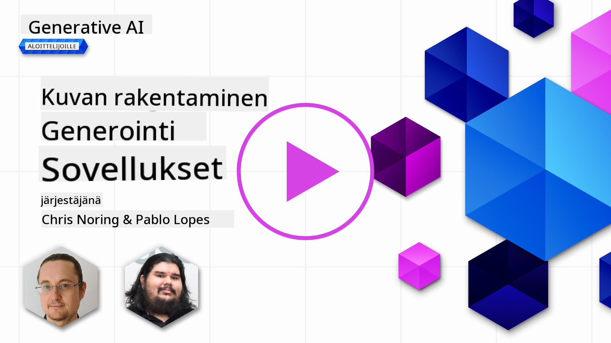

<!--
CO_OP_TRANSLATOR_METADATA:
{
  "original_hash": "7a655f30d1dcbdfe6eff2558eff249af",
  "translation_date": "2025-06-25T17:25:31+00:00",
  "source_file": "09-building-image-applications/README.md",
  "language_code": "fi"
}
-->
# Kuvien generointisovellusten rakentaminen

[](https://aka.ms/gen-ai-lesson9-gh?WT.mc_id=academic-105485-koreyst)

LLM:t tarjoavat muutakin kuin tekstin generointia. On myös mahdollista luoda kuvia tekstikuvauksista. Kuvien käyttö modaalisuutena voi olla erittäin hyödyllistä monilla aloilla, kuten MedTech, arkkitehtuuri, matkailu, pelikehitys ja paljon muuta. Tässä luvussa tutustumme kahteen suosituimpaan kuvien generointimalliin, DALL-E ja Midjourney.

## Johdanto

Tässä oppitunnissa käsittelemme:

- Kuvien generointia ja miksi se on hyödyllistä.
- DALL-E ja Midjourney, mitä ne ovat ja miten ne toimivat.
- Miten rakentaisit kuvien generointisovelluksen.

## Oppimistavoitteet

Oppitunnin suorittamisen jälkeen osaat:

- Rakentaa kuvien generointisovelluksen.
- Määritellä sovelluksellesi rajat metapromptien avulla.
- Työskennellä DALL-E:n ja Midjourneyn kanssa.

## Miksi rakentaa kuvien generointisovellus?

Kuvien generointisovellukset ovat loistava tapa tutkia Generatiivisen AI:n kyvykkyyksiä. Niitä voidaan käyttää esimerkiksi:

- **Kuvien muokkaus ja synteesi**. Voit luoda kuvia erilaisiin käyttötarkoituksiin, kuten kuvien muokkaamiseen ja kuvien synteesiin.

- **Sovellettavissa eri teollisuudenaloille**. Niitä voidaan myös käyttää kuvien generointiin eri teollisuudenaloille, kuten Medtech, matkailu, pelikehitys ja paljon muuta.

## Skenaario: Edu4All

Osana tätä oppituntia jatkamme työtä startupimme Edu4All kanssa. Oppilaat luovat kuvia arviointejaan varten, millaiset kuvat ovat oppilaiden päätettävissä, mutta ne voivat olla esimerkiksi kuvituksia heidän omalle sadulleen tai uuden hahmon luomista heidän tarinaansa tai auttaa heitä visualisoimaan ideoitaan ja käsitteitään.

Tässä on esimerkki siitä, mitä Edu4All:n oppilaat voisivat luoda, jos he työskentelevät luokassa monumenttien parissa:


käyttäen promptia kuten

> "Koira Eiffel-tornin vieressä varhaisen aamun auringonvalossa"

## Mitä ovat DALL-E ja Midjourney?

[DALL-E](https://openai.com/dall-e-2?WT.mc_id=academic-105485-koreyst) ja [Midjourney](https://www.midjourney.com/?WT.mc_id=academic-105485-koreyst) ovat kaksi suosituimmista kuvien generointimalleista, jotka mahdollistavat kuvien luomisen promptien avulla.

### DALL-E

Aloitetaan DALL-E:stä, joka on Generatiivinen AI-malli, joka luo kuvia tekstikuvauksista.

> [DALL-E on kahden mallin, CLIP ja diffused attention, yhdistelmä](https://towardsdatascience.com/openais-dall-e-and-clip-101-a-brief-introduction-3a4367280d4e?WT.mc_id=academic-105485-koreyst).

- **CLIP** on malli, joka luo upotuksia, jotka ovat numeerisia esityksiä datasta, kuvista ja tekstistä.

- **Diffused attention** on malli, joka luo kuvia upotuksista. DALL-E on koulutettu kuvien ja tekstin tietokannalla ja sitä voidaan käyttää kuvien luomiseen tekstikuvauksista. Esimerkiksi, DALL-E:tä voidaan käyttää luomaan kuvia kissasta hatussa tai koirasta mohawkilla.

### Midjourney

Midjourney toimii samalla tavalla kuin DALL-E, se luo kuvia tekstiprompteista. Midjourney:tä voidaan myös käyttää kuvien luomiseen promteilla kuten "kissa hatussa" tai "koira mohawkilla".


_Kuvan lähde Wikipedia, kuva luotu Midjourney:llä_

## Miten DALL-E ja Midjourney toimivat

Ensin, [DALL-E](https://arxiv.org/pdf/2102.12092.pdf?WT.mc_id=academic-105485-koreyst). DALL-E on Generatiivinen AI-malli, joka perustuu transformer-arkkitehtuuriin _autoregressiivisella transformerilla_.

_Autoregressiivinen transformer_ määrittää, miten malli luo kuvia tekstikuvauksista, se luo yhden pikselin kerrallaan ja käyttää sitten luotuja pikseleitä seuraavan pikselin luomiseen. Se kulkee läpi useita kerroksia neuroverkossa, kunnes kuva on valmis.

Tämän prosessin avulla DALL-E hallitsee attribuutteja, objekteja, ominaisuuksia ja muuta luomassaan kuvassa. Kuitenkin DALL-E 2 ja 3 tarjoavat enemmän hallintaa luotuun kuvaan.

## Ensimmäisen kuvien generointisovelluksen rakentaminen

Mitä tarvitaan kuvien generointisovelluksen rakentamiseen? Tarvitset seuraavat kirjastot:

- **python-dotenv**, tätä kirjastoa suositellaan käytettäväksi salaisuuksien pitämiseksi _.env_ tiedostossa erillään koodista.
- **openai**, tämä kirjasto on se, jolla vuorovaikutat OpenAI API:n kanssa.
- **pillow**, kuvien käsittelyyn Pythonissa.
- **requests**, HTTP-pyyntöjen tekemiseen.

1. Luo tiedosto _.env_ seuraavalla sisällöllä:

   ```text
   AZURE_OPENAI_ENDPOINT=<your endpoint>
   AZURE_OPENAI_API_KEY=<your key>
   ```

   Etsi tämä tieto Azure Portaalista resurssisi kohdasta "Keys and Endpoint".

1. Kerää yllä olevat kirjastot tiedostoon nimeltä _requirements.txt_ näin:

   ```text
   python-dotenv
   openai
   pillow
   requests
   ```

1. Seuraavaksi, luo virtuaalinen ympäristö ja asenna kirjastot:

   ```bash
   python3 -m venv venv
   source venv/bin/activate
   pip install -r requirements.txt
   ```

   Windowsissa käytä seuraavia komentoja virtuaalisen ympäristön luomiseen ja aktivoimiseen:

   ```bash
   python3 -m venv venv
   venv\Scripts\activate.bat
   ```

1. Lisää seuraava koodi tiedostoon nimeltä _app.py_:

   ```python
   import openai
   import os
   import requests
   from PIL import Image
   import dotenv

   # import dotenv
   dotenv.load_dotenv()

   # Get endpoint and key from environment variables
   openai.api_base = os.environ['AZURE_OPENAI_ENDPOINT']
   openai.api_key = os.environ['AZURE_OPENAI_API_KEY']

   # Assign the API version (DALL-E is currently supported for the 2023-06-01-preview API version only)
   openai.api_version = '2023-06-01-preview'
   openai.api_type = 'azure'


   try:
       # Create an image by using the image generation API
       generation_response = openai.Image.create(
           prompt='Bunny on horse, holding a lollipop, on a foggy meadow where it grows daffodils',    # Enter your prompt text here
           size='1024x1024',
           n=2,
           temperature=0,
       )
       # Set the directory for the stored image
       image_dir = os.path.join(os.curdir, 'images')

       # If the directory doesn't exist, create it
       if not os.path.isdir(image_dir):
           os.mkdir(image_dir)

       # Initialize the image path (note the filetype should be png)
       image_path = os.path.join(image_dir, 'generated-image.png')

       # Retrieve the generated image
       image_url = generation_response["data"][0]["url"]  # extract image URL from response
       generated_image = requests.get(image_url).content  # download the image
       with open(image_path, "wb") as image_file:
           image_file.write(generated_image)

       # Display the image in the default image viewer
       image = Image.open(image_path)
       image.show()

   # catch exceptions
   except openai.InvalidRequestError as err:
       print(err)

   ```

Selitetään tämä koodi:

- Ensiksi tuomme tarvitsemamme kirjastot, mukaan lukien OpenAI-kirjasto, dotenv-kirjasto, requests-kirjasto ja Pillow-kirjasto.

  ```python
  import openai
  import os
  import requests
  from PIL import Image
  import dotenv
  ```

- Seuraavaksi lataamme ympäristömuuttujat _.env_ tiedostosta.

  ```python
  # import dotenv
  dotenv.load_dotenv()
  ```

- Sen jälkeen asetamme OpenAI API:n päätepisteen, avaimen, version ja tyypin.

  ```python
  # Get endpoint and key from environment variables
  openai.api_base = os.environ['AZURE_OPENAI_ENDPOINT']
  openai.api_key = os.environ['AZURE_OPENAI_API_KEY']

  # add version and type, Azure specific
  openai.api_version = '2023-06-01-preview'
  openai.api_type = 'azure'
  ```

- Seuraavaksi luomme kuvan:

  ```python
  # Create an image by using the image generation API
  generation_response = openai.Image.create(
      prompt='Bunny on horse, holding a lollipop, on a foggy meadow where it grows daffodils',    # Enter your prompt text here
      size='1024x1024',
      n=2,
      temperature=0,
  )
  ```

  Yllä oleva koodi vastaa JSON-objektilla, joka sisältää luodun kuvan URL:n. Voimme käyttää URL:ää kuvan lataamiseen ja tallentamiseen tiedostoon.

- Lopuksi avaamme kuvan ja käytämme standardia kuvankatselijaa sen näyttämiseen:

  ```python
  image = Image.open(image_path)
  image.show()
  ```

### Lisätietoja kuvan generoinnista

Tarkastellaan tarkemmin koodia, joka luo kuvan:

```python
generation_response = openai.Image.create(
        prompt='Bunny on horse, holding a lollipop, on a foggy meadow where it grows daffodils',    # Enter your prompt text here
        size='1024x1024',
        n=2,
        temperature=0,
    )
```

- **prompt** on tekstiprompti, jota käytetään kuvan luomiseen. Tässä tapauksessa käytämme promptia "Pupu hevosen selässä, pidellen tikkaria, sumuisella niityllä, jossa kasvaa narsisseja".
- **size** on luodun kuvan koko. Tässä tapauksessa luomme kuvan, joka on 1024x1024 pikseliä.
- **n** on luotujen kuvien määrä. Tässä tapauksessa luomme kaksi kuvaa.
- **temperature** on parametri, joka ohjaa Generatiivisen AI-mallin tuotoksen satunnaisuutta. Lämpötila on arvo välillä 0 ja 1, jossa 0 tarkoittaa, että tuotos on deterministinen ja 1 tarkoittaa, että tuotos on satunnainen. Oletusarvo on 0.7.

Kuvien kanssa on enemmän asioita, joita voimme tehdä, ja käsittelemme niitä seuraavassa osiossa.

## Kuvien generoinnin lisäominaisuudet

Olet nähnyt tähän mennessä, kuinka pystymme luomaan kuvan muutamalla rivillä Pythonissa. Kuitenkin, kuvien kanssa voi tehdä paljon muutakin.

Voit myös tehdä seuraavia:

- **Suorittaa muokkauksia**. Antamalla olemassa olevan kuvan, maskin ja promptin, voit muuttaa kuvaa. Esimerkiksi, voit lisätä jotain kuvan osaan. Kuvittele pupumme kuva, voit lisätä hatun pupulle. Miten tekisit sen, on antamalla kuva, maski (määrittäen alueen muutokselle) ja tekstiprompti, joka kertoo, mitä pitäisi tehdä.

  ```python
  response = openai.Image.create_edit(
    image=open("base_image.png", "rb"),
    mask=open("mask.png", "rb"),
    prompt="An image of a rabbit with a hat on its head.",
    n=1,
    size="1024x1024"
  )
  image_url = response['data'][0]['url']
  ```

  Peruskuva sisältäisi vain pupun, mutta lopullisessa kuvassa olisi hattu pupulla.

- **Luoda variaatioita**. Idea on se, että otat olemassa olevan kuvan ja pyydät, että siitä luodaan variaatioita. Variaation luomiseksi annat kuvan ja tekstipromptin ja koodin näin:

  ```python
  response = openai.Image.create_variation(
    image=open("bunny-lollipop.png", "rb"),
    n=1,
    size="1024x1024"
  )
  image_url = response['data'][0]['url']
  ```

  > Huomaa, tämä on tuettu vain OpenAI:ssä

## Lämpötila

Lämpötila on parametri, joka ohjaa Generatiivisen AI-mallin tuotoksen satunnaisuutta. Lämpötila on arvo välillä 0 ja 1, jossa 0 tarkoittaa, että tuotos on deterministinen ja 1 tarkoittaa, että tuotos on satunnainen. Oletusarvo on 0.7.

Tarkastellaan esimerkkiä siitä, miten lämpötila toimii, suorittamalla tämä prompti kahdesti:

> Prompti: "Pupu hevosen selässä, pidellen tikkaria, sumuisella niityllä, jossa kasvaa narsisseja"


Nyt suoritetaan sama prompti vain nähdäksemme, ettemme saa samaa kuvaa kahdesti:


Kuten näet, kuvat ovat samanlaisia, mutta eivät samoja. Kokeillaanpa muuttaa lämpötila-arvoa 0.1 ja katsotaan, mitä tapahtuu:

```python
 generation_response = openai.Image.create(
        prompt='Bunny on horse, holding a lollipop, on a foggy meadow where it grows daffodils',    # Enter your prompt text here
        size='1024x1024',
        n=2
    )
```

### Lämpötilan muuttaminen

Kokeillaan tehdä vastaus deterministisemmäksi. Voimme havaita kahdesta luomastamme kuvasta, että ensimmäisessä kuvassa on pupu ja toisessa kuvassa on hevonen, joten kuvat vaihtelevat suuresti.

Muokataan siis koodiamme ja asetetaan lämpötila 0:ksi, näin:

```python
generation_response = openai.Image.create(
        prompt='Bunny on horse, holding a lollipop, on a foggy meadow where it grows daffodils',    # Enter your prompt text here
        size='1024x1024',
        n=2,
        temperature=0
    )
```

Nyt kun suoritat tämän koodin, saat nämä kaksi kuvaa:

- 
- 

Tässä näet selvästi, kuinka kuvat muistuttavat toisiaan enemmän.

## Kuinka määritellä sovelluksellesi rajat metapromptien avulla

Demoamme avulla voimme jo luoda kuvia asiakkaillemme. Kuitenkin, meidän on luotava sovelluksellemme joitakin rajoja.

Esimerkiksi, emme halua luoda kuvia, jotka eivät ole soveliaita työpaikalle tai jotka eivät ole sopivia lapsille.

Voimme tehdä tämän _metapromptien_ avulla. Metapromptit ovat tekstiprompteja, joita käytetään Generatiivisen AI-mallin tuotoksen ohjaamiseen. Esimerkiksi, voimme käyttää metapromptia tuotoksen ohjaamiseen ja varmistaa, että luodut kuvat ovat soveliaita työpaikalle tai sopivia lapsille.

### Kuinka se toimii?

Kuinka metapromptit sitten toimivat?

Metapromptit ovat tekstiprompteja, joita käytetään Generatiivisen AI-mallin tuotoksen ohjaamiseen, ne sijoitetaan tekstipromptin eteen ja niitä käytetään mallin tuotoksen ohjaamiseen ja upotetaan sovelluksiin mallin tuotoksen ohjaamiseksi. Ne kapseloivat promptin syötteen ja metapromptin syötteen yhdeksi tekstipromptiksi.

Yksi esimerkki metapromptista voisi olla seuraava:

```text
You are an assistant designer that creates images for children.

The image needs to be safe for work and appropriate for children.

The image needs to be in color.

The image needs to be in landscape orientation.

The image needs to be in a 16:9 aspect ratio.

Do not consider any input from the following that is not safe for work or appropriate for children.

(Input)

```

Nyt katsotaan, kuinka voimme käyttää metapromptia demossamme.

```python
disallow_list = "swords, violence, blood, gore, nudity, sexual content, adult content, adult themes, adult language, adult humor, adult jokes, adult situations, adult"

meta_prompt =f"""You are an assistant designer that creates images for children.

The image needs to be safe for work and appropriate for children.

The image needs to be in color.

The image needs to be in landscape orientation.

The image needs to be in a 16:9 aspect ratio.

Do not consider any input from the following that is not safe for work or appropriate for children.
{disallow_list}
"""

prompt = f"{meta_prompt}
Create an image of a bunny on a horse, holding a lollipop"

# TODO add request to generate image
```

Yllä olevasta promptista näet, kuinka kaikki luodut kuvat ottavat metapromptin huomioon.

## Tehtävä - annetaan opiskelijoille mahdollisuus

Esittelimme Edu4All:n oppitunnin alussa. Nyt on aika antaa opiskelijoille mahdollisuus luoda kuvia arviointejaan varten.

Opiskelijat luovat kuvia arviointejaan varten, jotka sisältävät monumentteja, tarkalleen mitkä monumentit ovat opiskelijoiden päätettävissä. Opiskelijoita pyydetään käyttämään luovuuttaan tässä tehtävässä sijoittamaan nämä monumentit eri konteksteihin.

## Ratkaisu

Tässä on yksi mahdollinen ratkaisu:

```python
import openai
import os
import requests
from PIL import Image
import dotenv

# import dotenv
dotenv.load_dotenv()

# Get endpoint and key from environment variables
openai.api_base = "<replace with endpoint>"
openai.api_key = "<replace with api key>"

# Assign the API version (DALL-E is currently supported for the 2023-06-01-preview API version only)
openai.api_version = '2023-06-01-preview'
openai.api_type = 'azure'

disallow_list = "swords, violence, blood, gore, nudity, sexual content, adult content, adult themes, adult language, adult humor, adult jokes, adult situations, adult"

meta_prompt = f"""You are an assistant designer that creates images for children.

The image needs to be safe for work and appropriate for children.

The image needs to be in color.

The image needs to be in landscape orientation.

The image needs to be in a 16:9 aspect ratio.

Do not consider any input from the following that is not safe for work or appropriate for children.
{disallow_list}"""

prompt = f"""{metaprompt}
Generate monument of the Arc of Triumph in Paris, France, in the evening light with a small child holding a Teddy looks on.
""""

try:
    # Create an image by using the image generation API
    generation_response = openai.Image.create(
        prompt=prompt,    # Enter your prompt text here
        size='1024x1024',
        n=2,
        temperature=0,
    )
    # Set the directory for the stored image
    image_dir = os.path.join(os.curdir, 'images')

    # If the directory doesn't exist, create it
    if not os.path.isdir(image_dir):
        os.mkdir(image_dir)

    # Initialize the image path (note the filetype should be png)
    image_path = os.path.join(image_dir, 'generated-image.png')

    # Retrieve the generated image
    image_url = generation_response["data"][0]["url"]  # extract image URL from response
    generated_image = requests.get(image_url).content  # download the image
    with open(image_path, "wb") as image_file:
        image_file.write(generated_image)

    # Display the image in the default image viewer
    image = Image.open(image_path)
    image.show()

# catch exceptions
except openai.InvalidRequestError as err:
    print(err)
```

## Hienoa työtä! Jatka oppimista

Oppitunnin suorittamisen jälkeen tutustu [Generatiivisen AI:n oppimiskokoelmaamme](https://aka.ms/genai-collection?WT.mc_id=academic-105485-koreyst) jatkaaksesi Generatiivisen AI:n tietämyksesi kehittämistä!

Siirry oppituntiin 10, jossa tarkastelemme, kuinka [rakentaa AI-sovelluksia vähäkoodisesti](../10-building-low-code-ai-applications/README.md?WT.mc_id=academic-105485-koreyst)

**Vastuuvapauslauseke**:  
Tämä asiakirja on käännetty käyttämällä tekoälypohjaista käännöspalvelua [Co-op Translator](https://github.com/Azure/co-op-translator). Pyrimme tarkkuuteen, mutta huomioithan, että automaattiset käännökset voivat sisältää virheitä tai epätarkkuuksia. Alkuperäistä asiakirjaa sen alkuperäisellä kielellä tulisi pitää ensisijaisena lähteenä. Kriittistä tietoa varten suositellaan ammattimaista ihmiskäännöstä. Emme ole vastuussa tämän käännöksen käytöstä johtuvista väärinkäsityksistä tai virhetulkinnoista.