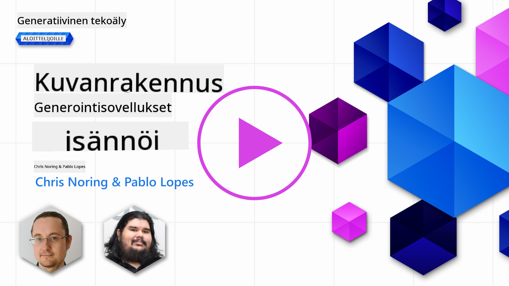
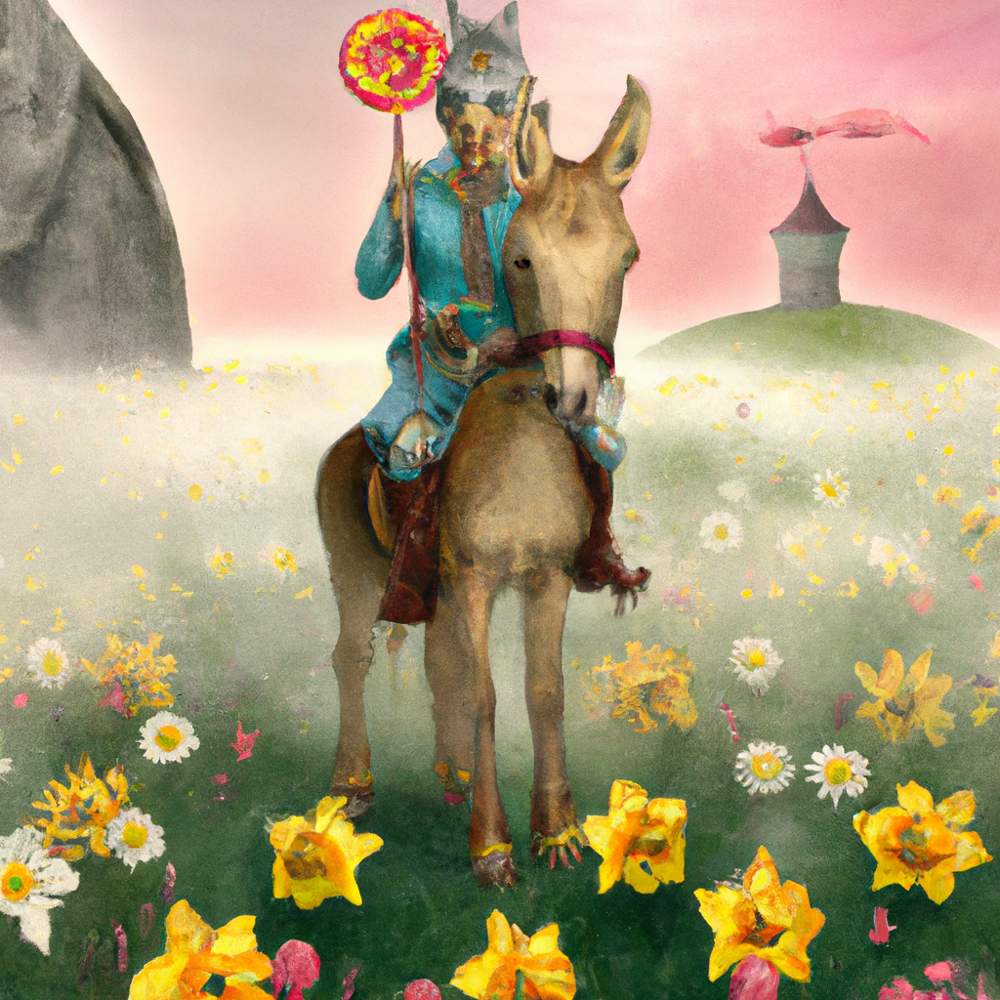

<!--
CO_OP_TRANSLATOR_METADATA:
{
  "original_hash": "1a7fd0f95f9eb673b79da47c0814f4d4",
  "translation_date": "2025-07-09T13:28:03+00:00",
  "source_file": "09-building-image-applications/README.md",
  "language_code": "fi"
}
-->
# Kuvageneraattorisovellusten rakentaminen

[](https://aka.ms/gen-ai-lesson9-gh?WT.mc_id=academic-105485-koreyst)

LLM-mallit eivät rajoitu pelkkään tekstin generointiin. Niillä on myös mahdollista luoda kuvia tekstikuvauksista. Kuvien käyttäminen modaliteettina voi olla erittäin hyödyllistä monilla aloilla, kuten MedTechissä, arkkitehtuurissa, matkailussa, pelikehityksessä ja monessa muussa. Tässä luvussa tutustumme kahteen suosituimpaan kuvageneraattorimalliin, DALL-E:hen ja Midjourneyhin.

## Johdanto

Tässä oppitunnissa käsittelemme:

- Kuvagenerointia ja sen hyötyjä.
- DALL-E:tä ja Midjourneyta, mitä ne ovat ja miten ne toimivat.
- Kuinka rakentaa kuvageneraattorisovellus.

## Oppimistavoitteet

Oppitunnin jälkeen osaat:

- Rakentaa kuvageneraattorisovelluksen.
- Määritellä sovelluksesi rajat metaprompteilla.
- Työskennellä DALL-E:n ja Midjourneyn kanssa.

## Miksi rakentaa kuvageneraattorisovellus?

Kuvageneraattorisovellukset ovat erinomainen tapa tutkia Generatiivisen tekoälyn mahdollisuuksia. Niitä voi käyttää esimerkiksi:

- **Kuvien muokkaamiseen ja synteesiin**. Voit luoda kuvia monenlaisiin käyttötarkoituksiin, kuten kuvien muokkaukseen ja synteesiin.

- **Soveltamiseen eri toimialoilla**. Niitä voidaan käyttää myös kuvien luomiseen eri aloille, kuten Medtechiin, matkailuun, pelikehitykseen ja muihin.

## Tilannekuva: Edu4All

Tämän oppitunnin osana jatkamme startup-yrityksemme Edu4Allin kanssa työskentelyä. Oppilaat luovat kuvia arviointeihinsa; millaisia kuvia, sen oppilaat päättävät itse. Kuvina voi olla esimerkiksi omien satujen kuvituksia, uusia hahmoja tarinoihin tai apua ideoiden ja konseptien visualisointiin.

Tässä esimerkki siitä, mitä Edu4Allin oppilaat voisivat luoda, jos he työstävät luokassa monumentteja:


käyttäen kehotetta

> "Koira Eiffel-tornin vieressä aamun varhaisessa auringonvalossa"

## Mitä ovat DALL-E ja Midjourney?

[DALL-E](https://openai.com/dall-e-2?WT.mc_id=academic-105485-koreyst) ja [Midjourney](https://www.midjourney.com/?WT.mc_id=academic-105485-koreyst) ovat kaksi suosituimmista kuvageneraattorimalleista, joiden avulla voit käyttää kehotteita kuvien luomiseen.

### DALL-E

Aloitetaan DALL-E:stä, joka on Generatiivinen tekoälymalli, joka luo kuvia tekstikuvauksista.

> [DALL-E on kahden mallin, CLIPin ja diffused attentionin, yhdistelmä](https://towardsdatascience.com/openais-dall-e-and-clip-101-a-brief-introduction-3a4367280d4e?WT.mc_id=academic-105485-koreyst).

- **CLIP** on malli, joka luo upotuksia eli numeerisia esityksiä datasta kuvista ja tekstistä.

- **Diffused attention** on malli, joka luo kuvia upotuksista. DALL-E on koulutettu kuvien ja tekstin datasetillä, ja sitä voi käyttää kuvien luomiseen tekstikuvauksista. Esimerkiksi DALL-E voi luoda kuvia kissasta hatussa tai koirasta, jolla on mohikaani.

### Midjourney

Midjourney toimii samankaltaisesti kuin DALL-E, se luo kuvia tekstikehotteiden perusteella. Midjourneyllä voi myös luoda kuvia kehotteilla kuten ”kissa hatussa” tai ”koira mohikaanilla”.


_Kuvan lähde Wikipedia, kuva luotu Midjourneyllä_

## Miten DALL-E ja Midjourney toimivat

Aloitetaan [DALL-E:stä](https://arxiv.org/pdf/2102.12092.pdf?WT.mc_id=academic-105485-koreyst). DALL-E on Generatiivinen tekoälymalli, joka perustuu transformer-arkkitehtuuriin ja käyttää _autoregressiivista transformeria_.

Autoregressiivinen transformer määrittelee, miten malli luo kuvia tekstikuvauksista: se generoi kuvan pikseli kerrallaan ja käyttää jo luotuja pikseleitä seuraavan pikselin luomiseen. Prosessi kulkee useiden neuroverkon kerrosten läpi, kunnes kuva on valmis.

Tämän prosessin avulla DALL-E hallitsee kuvan ominaisuuksia, kohteita ja piirteitä. DALL-E 2 ja 3 tarjoavat vielä tarkemman hallinnan luotuihin kuviin.

## Ensimmäisen kuvageneraattorisovelluksen rakentaminen

Mitä tarvitaan kuvageneraattorisovelluksen rakentamiseen? Tarvitset seuraavat kirjastot:

- **python-dotenv**, tätä kirjastoa suositellaan vahvasti, jotta salaisuudet voi pitää _.env_-tiedostossa erillään koodista.
- **openai**, tätä kirjastoa käytetään OpenAI API:n kanssa kommunikointiin.
- **pillow**, kuvien käsittelyyn Pythonissa.
- **requests**, HTTP-pyyntöjen tekemiseen.

1. Luo tiedosto _.env_, jonka sisältö on seuraava:

   ```text
   AZURE_OPENAI_ENDPOINT=<your endpoint>
   AZURE_OPENAI_API_KEY=<your key>
   ```

   Löydät nämä tiedot Azure-portaalista resurssisi "Keys and Endpoint" -osiosta.

1. Kerää yllä mainitut kirjastot tiedostoon _requirements.txt_ näin:

   ```text
   python-dotenv
   openai
   pillow
   requests
   ```

1. Luo virtuaaliympäristö ja asenna kirjastot:

   ```bash
   python3 -m venv venv
   source venv/bin/activate
   pip install -r requirements.txt
   ```

   Windowsilla käytä seuraavia komentoja virtuaaliympäristön luomiseen ja aktivointiin:

   ```bash
   python3 -m venv venv
   venv\Scripts\activate.bat
   ```

1. Lisää seuraava koodi tiedostoon _app.py_:

   ```python
   import openai
   import os
   import requests
   from PIL import Image
   import dotenv

   # import dotenv
   dotenv.load_dotenv()

   # Get endpoint and key from environment variables
   openai.api_base = os.environ['AZURE_OPENAI_ENDPOINT']
   openai.api_key = os.environ['AZURE_OPENAI_API_KEY']

   # Assign the API version (DALL-E is currently supported for the 2023-06-01-preview API version only)
   openai.api_version = '2023-06-01-preview'
   openai.api_type = 'azure'


   try:
       # Create an image by using the image generation API
       generation_response = openai.Image.create(
           prompt='Bunny on horse, holding a lollipop, on a foggy meadow where it grows daffodils',    # Enter your prompt text here
           size='1024x1024',
           n=2,
           temperature=0,
       )
       # Set the directory for the stored image
       image_dir = os.path.join(os.curdir, 'images')

       # If the directory doesn't exist, create it
       if not os.path.isdir(image_dir):
           os.mkdir(image_dir)

       # Initialize the image path (note the filetype should be png)
       image_path = os.path.join(image_dir, 'generated-image.png')

       # Retrieve the generated image
       image_url = generation_response["data"][0]["url"]  # extract image URL from response
       generated_image = requests.get(image_url).content  # download the image
       with open(image_path, "wb") as image_file:
           image_file.write(generated_image)

       # Display the image in the default image viewer
       image = Image.open(image_path)
       image.show()

   # catch exceptions
   except openai.InvalidRequestError as err:
       print(err)

   ```

Selitetään tämä koodi:

- Ensin tuodaan tarvittavat kirjastot, mukaan lukien OpenAI-kirjasto, dotenv, requests ja Pillow.

  ```python
  import openai
  import os
  import requests
  from PIL import Image
  import dotenv
  ```

- Seuraavaksi ladataan ympäristömuuttujat _.env_-tiedostosta.

  ```python
  # import dotenv
  dotenv.load_dotenv()
  ```

- Tämän jälkeen asetetaan OpenAI API:n endpoint, avain, versio ja tyyppi.

  ```python
  # Get endpoint and key from environment variables
  openai.api_base = os.environ['AZURE_OPENAI_ENDPOINT']
  openai.api_key = os.environ['AZURE_OPENAI_API_KEY']

  # add version and type, Azure specific
  openai.api_version = '2023-06-01-preview'
  openai.api_type = 'azure'
  ```

- Seuraavaksi generoidaan kuva:

  ```python
  # Create an image by using the image generation API
  generation_response = openai.Image.create(
      prompt='Bunny on horse, holding a lollipop, on a foggy meadow where it grows daffodils',    # Enter your prompt text here
      size='1024x1024',
      n=2,
      temperature=0,
  )
  ```

  Yllä oleva koodi vastaa JSON-objektilla, joka sisältää luodun kuvan URL-osoitteen. Voimme käyttää URL:ia kuvan lataamiseen ja tallentamiseen tiedostoon.

- Lopuksi avataan kuva ja näytetään se tavallisella kuvan katseluohjelmalla:

  ```python
  image = Image.open(image_path)
  image.show()
  ```

### Tarkempi katsaus kuvan generointiin

Katsotaan tarkemmin koodia, joka generoi kuvan:

```python
generation_response = openai.Image.create(
        prompt='Bunny on horse, holding a lollipop, on a foggy meadow where it grows daffodils',    # Enter your prompt text here
        size='1024x1024',
        n=2,
        temperature=0,
    )
```

- **prompt** on tekstikehote, jota käytetään kuvan luomiseen. Tässä tapauksessa käytämme kehotetta "Jänis hevosella, pitää tikkaria, sumuisella niityllä, jossa kasvaa narsisseja".
- **size** on generoidun kuvan koko. Tässä luodaan kuva, jonka koko on 1024x1024 pikseliä.
- **n** on generoitavien kuvien määrä. Tässä luodaan kaksi kuvaa.
- **temperature** on parametri, joka säätelee Generatiivisen tekoälyn mallin satunnaisuutta. Arvo on välillä 0–1, jossa 0 tarkoittaa determinististä eli ennustettavaa tulosta ja 1 satunnaista tulosta. Oletusarvo on 0.7.

Seuraavassa osiossa käymme läpi lisää kuviin liittyviä toimintoja.

## Kuvageneroinnin lisäominaisuudet

Olet nähnyt, miten kuvan voi luoda muutamalla Python-rivillä. Kuvilla voi kuitenkin tehdä paljon muutakin.

Voit myös:

- **Muokata kuvia**. Antamalla olemassa olevan kuvan, maskin ja kehotteen, voit muuttaa kuvaa. Esimerkiksi voit lisätä jotain kuvan osaan. Kuvittele jänis-kuvamme, voit lisätä jänikselle hatun. Tämä tehdään antamalla kuva, maski (joka määrittää muutettavan alueen) ja tekstikehote, joka kertoo, mitä tehdään.

  ```python
  response = openai.Image.create_edit(
    image=open("base_image.png", "rb"),
    mask=open("mask.png", "rb"),
    prompt="An image of a rabbit with a hat on its head.",
    n=1,
    size="1024x1024"
  )
  image_url = response['data'][0]['url']
  ```

  Peruskuvassa on vain jänis, mutta lopullisessa kuvassa jäniksellä on hattu.

- **Luoda variaatioita**. Ajatuksena on ottaa olemassa oleva kuva ja pyytää siitä variaatioita. Variaation luomiseksi annetaan kuva ja tekstikehote, ja koodi toimii näin:

  ```python
  response = openai.Image.create_variation(
    image=open("bunny-lollipop.png", "rb"),
    n=1,
    size="1024x1024"
  )
  image_url = response['data'][0]['url']
  ```

  > Huomaa, että tämä ominaisuus on tuettu vain OpenAI:ssa.

## Temperature

Temperature on parametri, joka säätelee Generatiivisen tekoälyn mallin satunnaisuutta. Arvo on välillä 0–1, jossa 0 tarkoittaa determinististä tulosta ja 1 satunnaista. Oletusarvo on 0.7.

Katsotaan esimerkki temperature-arvon vaikutuksesta ajamalla sama kehotte kahdesti:

> Kehote: "Jänis hevosella, pitää tikkaria, sumuisella niityllä, jossa kasvaa narsisseja"


Ajetaan sama kehotte uudelleen, jotta näemme, ettei saatu kuva ole täsmälleen sama:


Kuten näet, kuvat ovat samankaltaisia, mutta eivät identtisiä. Kokeillaan muuttaa temperature-arvo 0.1:een ja katsotaan, mitä tapahtuu:

```python
 generation_response = openai.Image.create(
        prompt='Bunny on horse, holding a lollipop, on a foggy meadow where it grows daffodils',    # Enter your prompt text here
        size='1024x1024',
        n=2
    )
```

### Temperature-arvon muuttaminen

Yritetään tehdä vastauksesta deterministisempi. Huomasimme kahdesta generoidusta kuvasta, että ensimmäisessä kuvassa on jänis ja toisessa hevonen, joten kuvat eroavat paljon.

Muutetaan siis koodia ja asetetaan temperature-arvoksi 0 näin:

```python
generation_response = openai.Image.create(
        prompt='Bunny on horse, holding a lollipop, on a foggy meadow where it grows daffodils',    # Enter your prompt text here
        size='1024x1024',
        n=2,
        temperature=0
    )
```

Kun ajat tämän koodin, saat nämä kaksi kuvaa:

- 
- 

Tässä näet selvästi, että kuvat muistuttavat toisiaan enemmän.

## Kuinka määritellä sovelluksesi rajat metaprompteilla

Demossamme voimme jo luoda kuvia asiakkaillemme. Tarvitsemme kuitenkin sovelluksellemme rajoja.

Esimerkiksi emme halua luoda kuvia, jotka eivät ole työpaikalle sopivia tai eivät sovi lapsille.

Tämän voi tehdä _metaprompteilla_. Metapromptit ovat tekstikehotteita, joita käytetään Generatiivisen tekoälyn mallin tuloksen ohjaamiseen. Voimme esimerkiksi käyttää metaprompteja varmistamaan, että luodut kuvat ovat työpaikalle sopivia tai lapsille turvallisia.

### Miten metapromptit toimivat?

Miten metapromptit toimivat?

Metapromptit ovat tekstikehotteita, jotka ohjaavat Generatiivisen tekoälyn mallin tulosta. Ne sijoitetaan varsinaisen tekstikehotteen eteen ja ne upotetaan sovelluksiin ohjaamaan mallin tuottamaa sisältöä. Näin metapromptin ja varsinaisen kehotteen yhdistelmä muodostaa yhden tekstikehotteen.

Esimerkki metapromptista voisi olla seuraava:

```text
You are an assistant designer that creates images for children.

The image needs to be safe for work and appropriate for children.

The image needs to be in color.

The image needs to be in landscape orientation.

The image needs to be in a 16:9 aspect ratio.

Do not consider any input from the following that is not safe for work or appropriate for children.

(Input)

```

Katsotaan nyt, miten voimme käyttää metaprompteja demossamme.

```python
disallow_list = "swords, violence, blood, gore, nudity, sexual content, adult content, adult themes, adult language, adult humor, adult jokes, adult situations, adult"

meta_prompt =f"""You are an assistant designer that creates images for children.

The image needs to be safe for work and appropriate for children.

The image needs to be in color.

The image needs to be in landscape orientation.

The image needs to be in a 16:9 aspect ratio.

Do not consider any input from the following that is not safe for work or appropriate for children.
{disallow_list}
"""

prompt = f"{meta_prompt}
Create an image of a bunny on a horse, holding a lollipop"

# TODO add request to generate image
```

Yllä olevasta kehotteesta näet, miten kaikki luodut kuvat ottavat metapromptin huomioon.

## Tehtävä – annetaan opiskelijoille mahdollisuus

Esittelimme Edu4Allin tämän oppitunnin alussa. Nyt on aika antaa opiskelijoille mahdollisuus luoda kuvia arviointeihinsa.

Opiskelijat luovat kuvia arviointeihinsa, jotka sisältävät monumentteja. Tarkat monumentit ovat opiskelijoiden päätettävissä. Heitä pyydetään käyttämään luovuuttaan ja sijoittamaan monumentit erilaisiin konteksteihin.

## Ratkaisu

Tässä yksi mahdollinen ratkaisu:

```python
import openai
import os
import requests
from PIL import Image
import dotenv

# import dotenv
dotenv.load_dotenv()

# Get endpoint and key from environment variables
openai.api_base = "<replace with endpoint>"
openai.api_key = "<replace with api key>"

# Assign the API version (DALL-E is currently supported for the 2023-06-01-preview API version only)
openai.api_version = '2023-06-01-preview'
openai.api_type = 'azure'

disallow_list = "swords, violence, blood, gore, nudity, sexual content, adult content, adult themes, adult language, adult humor, adult jokes, adult situations, adult"

meta_prompt = f"""You are an assistant designer that creates images for children.

The image needs to be safe for work and appropriate for children.

The image needs to be in color.

The image needs to be in landscape orientation.

The image needs to be in a 16:9 aspect ratio.

Do not consider any input from the following that is not safe for work or appropriate for children.
{disallow_list}"""

prompt = f"""{meta_prompt}
Generate monument of the Arc of Triumph in Paris, France, in the evening light with a small child holding a Teddy looks on.
""""

try:
    # Create an image by using the image generation API
    generation_response = openai.Image.create(
        prompt=prompt,    # Enter your prompt text here
        size='1024x1024',
        n=2,
        temperature=0,
    )
    # Set the directory for the stored image
    image_dir = os.path.join(os.curdir, 'images')

    # If the directory doesn't exist, create it
    if not os.path.isdir(image_dir):
        os.mkdir(image_dir)

    # Initialize the image path (note the filetype should be png)
    image_path = os.path.join(image_dir, 'generated-image.png')

    # Retrieve the generated image
    image_url = generation_response["data"][0]["url"]  # extract image URL from response
    generated_image = requests.get(image_url).content  # download the image
    with open(image_path, "wb") as image_file:
        image_file.write(generated_image)

    # Display the image in the default image viewer
    image = Image.open(image_path)
    image.show()

# catch exceptions
except openai.InvalidRequestError as err:
    print(err)
```

## Hienoa työtä! Jatka oppimista

Oppitunnin jälkeen tutustu [Generative AI Learning -kokoelmaamme](https://aka.ms/genai-collection?WT.mc_id=academic-105485-koreyst) ja jatka Generatiivisen tekoälyn osaamisesi kehittämistä!

Siirry oppitunnille 10, jossa tarkastelemme, miten [rakentaa tekoälysovelluksia low-code-työkaluilla](../10-building-low-code-ai-applications/README.md?WT.mc_id=academic-105485-koreyst)

**Vastuuvapauslauseke**:  
Tämä asiakirja on käännetty käyttämällä tekoälypohjaista käännöspalvelua [Co-op Translator](https://github.com/Azure/co-op-translator). Vaikka pyrimme tarkkuuteen, huomioithan, että automaattikäännöksissä saattaa esiintyä virheitä tai epätarkkuuksia. Alkuperäistä asiakirjaa sen alkuperäiskielellä tulee pitää virallisena lähteenä. Tärkeissä tiedoissa suositellaan ammattimaista ihmiskäännöstä. Emme ole vastuussa tämän käännöksen käytöstä aiheutuvista väärinymmärryksistä tai tulkinnoista.