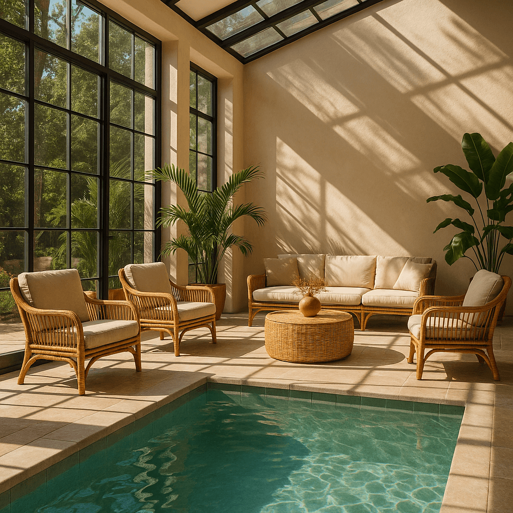

<!--
CO_OP_TRANSLATOR_METADATA:
{
  "original_hash": "063a2ac57d6b71bea0eaa880c68770d2",
  "translation_date": "2025-09-29T21:47:24+00:00",
  "source_file": "09-building-image-applications/README.md",
  "language_code": "fi"
}
-->
# Rakennetaan sovelluksia kuvien luomiseen

[](https://aka.ms/gen-ai-lesson9-gh?WT.mc_id=academic-105485-koreyst)

LLM-malleilla voi tehdä muutakin kuin tekstin luomista. On myös mahdollista luoda kuvia tekstikuvauksista. Kuvien käyttö voi olla erittäin hyödyllistä monilla aloilla, kuten lääketeknologiassa, arkkitehtuurissa, matkailussa, pelikehityksessä ja muilla aloilla. Tässä luvussa tutustumme kahteen suosituimpaan kuvien luomiseen tarkoitettuun malliin, DALL-E ja Midjourney.

## Johdanto

Tässä oppitunnissa käsitellään:

- Kuvien luominen ja miksi se on hyödyllistä.
- DALL-E ja Midjourney: mitä ne ovat ja miten ne toimivat.
- Kuinka rakentaa sovellus kuvien luomiseen.

## Oppimistavoitteet

Tämän oppitunnin jälkeen osaat:

- Rakentaa sovelluksen kuvien luomiseen.
- Määritellä sovelluksesi rajat metapromptien avulla.
- Työskennellä DALL-E:n ja Midjourneyn kanssa.

## Miksi rakentaa sovellus kuvien luomiseen?

Kuvien luomiseen tarkoitetut sovellukset ovat erinomainen tapa tutkia generatiivisen tekoälyn mahdollisuuksia. Niitä voidaan käyttää esimerkiksi:

- **Kuvien muokkaus ja synteesi**. Voit luoda kuvia monenlaisiin käyttötarkoituksiin, kuten kuvien muokkaamiseen ja synteesiin.

- **Soveltaminen eri toimialoille**. Niitä voidaan käyttää myös kuvien luomiseen eri toimialoille, kuten lääketeknologiaan, matkailuun, pelikehitykseen ja muuhun.

## Tilanne: Edu4All

Osana tätä oppituntia jatkamme työskentelyä startupin, Edu4Allin, kanssa. Oppilaat luovat kuvia arviointejaan varten. Millaisia kuvia he luovat, on heidän päätettävissään, mutta ne voivat olla esimerkiksi kuvituksia heidän omalle sadulleen, uuden hahmon luomista tarinaansa tai heidän ideoidensa ja käsitteidensä visualisointia.

Tässä esimerkki siitä, mitä Edu4Allin oppilaat voisivat luoda, jos he työskentelevät luokassa monumenttien parissa:


käyttäen tällaista promptia:

> "Koira Eiffel-tornin vieressä varhaisen aamun auringonvalossa"

## Mitä ovat DALL-E ja Midjourney?

[DALL-E](https://openai.com/dall-e-2?WT.mc_id=academic-105485-koreyst) ja [Midjourney](https://www.midjourney.com/?WT.mc_id=academic-105485-koreyst) ovat kaksi suosituimpaa kuvien luomiseen tarkoitettua mallia, jotka mahdollistavat kuvien luomisen tekstipromptien avulla.

### DALL-E

Aloitetaan DALL-E:stä, joka on generatiivinen tekoälymalli, joka luo kuvia tekstikuvauksista.

> [DALL-E yhdistää kaksi mallia, CLIP ja diffused attention](https://towardsdatascience.com/openais-dall-e-and-clip-101-a-brief-introduction-3a4367280d4e?WT.mc_id=academic-105485-koreyst).

- **CLIP** on malli, joka luo upotuksia, eli numeerisia esityksiä datasta, kuvista ja tekstistä.

- **Diffused attention** on malli, joka luo kuvia upotuksista. DALL-E on koulutettu kuvien ja tekstin datasetillä, ja sitä voidaan käyttää kuvien luomiseen tekstikuvauksista. Esimerkiksi DALL-E:llä voidaan luoda kuvia kissasta hatussa tai koirasta mohawk-kampauksella.

### Midjourney

Midjourney toimii samalla tavalla kuin DALL-E: se luo kuvia tekstipromptien avulla. Midjourney:tä voidaan myös käyttää kuvien luomiseen promptien avulla, kuten "kissa hatussa" tai "koira mohawk-kampauksella".


_Kuvan lähde Wikipedia, kuva luotu Midjourney:llä_

## Miten DALL-E ja Midjourney toimivat?

Ensiksi, [DALL-E](https://arxiv.org/pdf/2102.12092.pdf?WT.mc_id=academic-105485-koreyst). DALL-E on generatiivinen tekoälymalli, joka perustuu transformer-arkkitehtuuriin ja _autoregressiiviseen transformeriin_.

_Autoregressiivinen transformeri_ määrittää, miten malli luo kuvia tekstikuvauksista: se luo yhden pikselin kerrallaan ja käyttää luotuja pikseleitä seuraavan pikselin luomiseen. Tämä prosessi kulkee useiden kerrosten läpi neuroverkossa, kunnes kuva on valmis.

Tämän prosessin avulla DALL-E hallitsee kuvan ominaisuuksia, objekteja, piirteitä ja muuta. DALL-E 2 ja 3 tarjoavat kuitenkin enemmän hallintaa luotuun kuvaan.

## Ensimmäisen kuvien luomiseen tarkoitetun sovelluksen rakentaminen

Mitä tarvitaan kuvien luomiseen tarkoitetun sovelluksen rakentamiseen? Tarvitset seuraavat kirjastot:

- **python-dotenv**, tätä kirjastoa suositellaan vahvasti salaisuuksien säilyttämiseen _.env_-tiedostossa erillään koodista.
- **openai**, tämä kirjasto mahdollistaa OpenAI:n API:n käytön.
- **pillow**, kuvien käsittelyyn Pythonissa.
- **requests**, HTTP-pyyntöjen tekemiseen.

## Luo ja ota käyttöön Azure OpenAI -malli

Jos et ole vielä tehnyt tätä, seuraa [Microsoft Learn](https://learn.microsoft.com/azure/ai-foundry/openai/how-to/create-resource?pivots=web-portal) -sivun ohjeita
luodaksesi Azure OpenAI -resurssin ja mallin. Valitse malliksi DALL-E 3.

## Sovelluksen luominen

1. Luo _.env_-tiedosto seuraavalla sisällöllä:

   ```text
   AZURE_OPENAI_ENDPOINT=<your endpoint>
   AZURE_OPENAI_API_KEY=<your key>
   AZURE_OPENAI_DEPLOYMENT="dall-e-3"
   ```

   Löydät nämä tiedot Azure OpenAI Foundry -portaalista resurssisi "Deployments"-osiosta.

1. Kerää yllä mainitut kirjastot tiedostoon _requirements.txt_ seuraavasti:

   ```text
   python-dotenv
   openai
   pillow
   requests
   ```

1. Luo virtuaaliympäristö ja asenna kirjastot:

   ```bash
   python3 -m venv venv
   source venv/bin/activate
   pip install -r requirements.txt
   ```

   Windowsissa käytä seuraavia komentoja virtuaaliympäristön luomiseen ja aktivoimiseen:

   ```bash
   python3 -m venv venv
   venv\Scripts\activate.bat
   ```

1. Lisää seuraava koodi tiedostoon _app.py_:

    ```python
    import openai
    import os
    import requests
    from PIL import Image
    import dotenv
    from openai import OpenAI, AzureOpenAI
    
    # import dotenv
    dotenv.load_dotenv()
    
    # configure Azure OpenAI service client 
    client = AzureOpenAI(
      azure_endpoint = os.environ["AZURE_OPENAI_ENDPOINT"],
      api_key=os.environ['AZURE_OPENAI_API_KEY'],
      api_version = "2024-02-01"
      )
    try:
        # Create an image by using the image generation API
        generation_response = client.images.generate(
                                prompt='Bunny on horse, holding a lollipop, on a foggy meadow where it grows daffodils',
                                size='1024x1024', n=1,
                                model=os.environ['AZURE_OPENAI_DEPLOYMENT']
                              )

        # Set the directory for the stored image
        image_dir = os.path.join(os.curdir, 'images')

        # If the directory doesn't exist, create it
        if not os.path.isdir(image_dir):
            os.mkdir(image_dir)

        # Initialize the image path (note the filetype should be png)
        image_path = os.path.join(image_dir, 'generated-image.png')

        # Retrieve the generated image
        image_url = generation_response.data[0].url  # extract image URL from response
        generated_image = requests.get(image_url).content  # download the image
        with open(image_path, "wb") as image_file:
            image_file.write(generated_image)

        # Display the image in the default image viewer
        image = Image.open(image_path)
        image.show()

    # catch exceptions
    except openai.InvalidRequestError as err:
        print(err)
   ```

Selitetään tämä koodi:

- Ensiksi tuodaan tarvittavat kirjastot, mukaan lukien OpenAI-kirjasto, dotenv-kirjasto, requests-kirjasto ja Pillow-kirjasto.

  ```python
  import openai
  import os
  import requests
  from PIL import Image
  import dotenv
  ```

- Seuraavaksi ladataan ympäristömuuttujat _.env_-tiedostosta.

  ```python
  # import dotenv
  dotenv.load_dotenv()
  ```

- Tämän jälkeen konfiguroidaan Azure OpenAI -palvelun asiakas.

  ```python
  # Get endpoint and key from environment variables
  client = AzureOpenAI(
      azure_endpoint = os.environ["AZURE_OPENAI_ENDPOINT"],
      api_key=os.environ['AZURE_OPENAI_API_KEY'],
      api_version = "2024-02-01"
      )
  ```

- Seuraavaksi luodaan kuva:

  ```python
  # Create an image by using the image generation API
  generation_response = client.images.generate(
                        prompt='Bunny on horse, holding a lollipop, on a foggy meadow where it grows daffodils',
                        size='1024x1024', n=1,
                        model=os.environ['AZURE_OPENAI_DEPLOYMENT']
                      )
  ```

  Yllä oleva koodi vastaa JSON-objektilla, joka sisältää luodun kuvan URL-osoitteen. URL-osoitetta voidaan käyttää kuvan lataamiseen ja tallentamiseen tiedostoon.

- Lopuksi avataan kuva ja käytetään standardia kuvien katseluohjelmaa sen näyttämiseen:

  ```python
  image = Image.open(image_path)
  image.show()
  ```

### Lisätietoja kuvan luomisesta

Tarkastellaan kuvan luomiseen käytettyä koodia tarkemmin:

   ```python
     generation_response = client.images.generate(
                               prompt='Bunny on horse, holding a lollipop, on a foggy meadow where it grows daffodils',
                               size='1024x1024', n=1,
                               model=os.environ['AZURE_OPENAI_DEPLOYMENT']
                           )
   ```

- **prompt** on tekstiprompti, jota käytetään kuvan luomiseen. Tässä tapauksessa käytämme promptia "Pupu hevosen selässä, pitelee tikkaria, sumuisella niityllä, jossa kasvaa narsisseja".
- **size** on luodun kuvan koko. Tässä tapauksessa luomme kuvan, jonka koko on 1024x1024 pikseliä.
- **n** on luotavien kuvien määrä. Tässä tapauksessa luomme kaksi kuvaa.
- **temperature** on parametri, joka ohjaa generatiivisen tekoälymallin tuottaman sisällön satunnaisuutta. Temperature-arvo on välillä 0–1, missä 0 tarkoittaa determinististä ja 1 satunnaista tulosta. Oletusarvo on 0.7.

Kuvien kanssa voi tehdä paljon muutakin, mitä käsittelemme seuraavassa osiossa.

## Kuvien luomisen lisäominaisuudet

Olet nähnyt, kuinka pystyimme luomaan kuvan muutamalla Python-rivillä. Kuvien kanssa voi kuitenkin tehdä paljon muutakin.

Voit myös tehdä seuraavaa:

- **Muokata kuvia**. Antamalla olemassa olevan kuvan, maskin ja promptin, voit muokata kuvaa. Esimerkiksi voit lisätä jotain osaan kuvaa. Kuvittele pupukuvaamme: voit lisätä pupulle hatun. Tämä tehdään antamalla kuva, maski (muutettavan alueen tunnistamiseksi) ja tekstiprompti, joka kertoo, mitä pitäisi tehdä.
> Huom: tämä ei ole tuettu DALL-E 3:ssa.

Tässä esimerkki GPT Image -mallilla:

   ```python
   response = client.images.edit(
       model="gpt-image-1",
       image=open("sunlit_lounge.png", "rb"),
       mask=open("mask.png", "rb"),
       prompt="A sunlit indoor lounge area with a pool containing a flamingo"
   )
   image_url = response.data[0].url
   ```

  Peruskuva sisältäisi vain loungen ja uima-altaan, mutta lopullisessa kuvassa olisi flamingo:

<div style="display: flex; justify-content: space-between; align-items: center; margin: 20px 0;">
  
  
  
</div>

- **Luoda variaatioita**. Idea on, että otat olemassa olevan kuvan ja pyydät luomaan variaatioita. Variaation luomiseksi annat kuvan ja tekstipromptin sekä koodin seuraavasti:

  ```python
  response = openai.Image.create_variation(
    image=open("bunny-lollipop.png", "rb"),
    n=1,
    size="1024x1024"
  )
  image_url = response['data'][0]['url']
  ```

  > Huom, tämä on tuettu vain OpenAI:ssa.

## Temperature

Temperature on parametri, joka ohjaa generatiivisen tekoälymallin tuottaman sisällön satunnaisuutta. Temperature-arvo on välillä 0–1, missä 0 tarkoittaa determinististä ja 1 satunnaista tulosta. Oletusarvo on 0.7.

Tarkastellaan esimerkkiä siitä, miten temperature toimii, ajamalla tämä prompti kahdesti:

> Prompt : "Pupu hevosen selässä, pitelee tikkaria, sumuisella niityllä, jossa kasvaa narsisseja"


Nyt ajetaan sama prompti uudelleen ja katsotaan, ettei saatu kuva ole sama:


Kuten näet, kuvat ovat samankaltaisia, mutta eivät identtisiä. Kokeillaan nyt muuttaa temperature-arvo 0.1:ksi ja katsotaan, mitä tapahtuu:

```python
 generation_response = client.images.create(
        prompt='Bunny on horse, holding a lollipop, on a foggy meadow where it grows daffodils',    # Enter your prompt text here
        size='1024x1024',
        n=2
    )
```

### Temperature-arvon muuttaminen

Kokeillaan tehdä vastauksesta deterministisempi. Voimme havaita kahdesta luodusta kuvasta, että ensimmäisessä kuvassa on pupu ja toisessa kuvassa hevonen, joten kuvat eroavat suuresti.

Muutetaan siis koodiamme ja asetetaan temperature-arvo 0:ksi, seuraavasti:

```python
generation_response = client.images.create(
        prompt='Bunny on horse, holding a lollipop, on a foggy meadow where it grows daffodils',    # Enter your prompt text here
        size='1024x1024',
        n=2,
        temperature=0
    )
```

Kun ajat tämän koodin, saat nämä kaksi kuvaa:

- 
- 

Tässä näet selvästi, kuinka kuvat muistuttavat toisiaan enemmän.

## Kuinka määritellä sovelluksesi rajat metapromptien avulla

Demonstraatiomme avulla voimme jo luoda kuvia asiakkaillemme. Meidän on kuitenkin luotava sovelluksellemme joitakin rajoja.

Esimerkiksi emme halua luoda kuvia, jotka eivät ole soveliaita työympäristöön tai jotka eivät ole lapsille sopivia.

Voimme tehdä tämän _metapromptien_ avulla. Metapromptit ovat tekstipromptit, joita käytetään generatiivisen tekoälymallin tuottaman sisällön ohjaamiseen. Esimerkiksi voimme käyttää metapromptia varmistamaan, että luodut kuvat ovat soveliaita työympäristöön tai lapsille sopivia.

### Miten se toimii?

Miten metapromptit sitten toimivat?

Metapromptit ovat tekstipromptit, joita käytetään generatiivisen tekoälymallin tuottaman sisällön ohjaamiseen. Ne sijoitetaan ennen tekstipromptia ja niitä käytetään mallin tuottaman sisällön ohjaamiseen. Ne upotetaan sovelluksiin mallin tuottaman sisällön ohjaamiseksi. Ne yhdistävät promptin ja metapromptin yhdeksi tekstipromptiksi.

Yksi esimerkki metapromptista voisi olla seuraava:

```text
You are an assistant designer that creates images for children.

The image needs to be safe for work and appropriate for children.

The image needs to be in color.

The image needs to be in landscape orientation.

The image needs to be in a 16:9 aspect ratio.

Do not consider any input from the following that is not safe for work or appropriate for children.

(Input)

```

Katsotaan nyt, kuinka voimme käyttää metapromptia demossamme.

```python
disallow_list = "swords, violence, blood, gore, nudity, sexual content, adult content, adult themes, adult language, adult humor, adult jokes, adult situations, adult"

meta_prompt =f"""You are an assistant designer that creates images for children.

The image needs to be safe for work and appropriate for children.

The image needs to be in color.

The image needs to be in landscape orientation.

The image needs to be in a 16:9 aspect ratio.

Do not consider any input from the following that is not safe for work or appropriate for children.
{disallow_list}
"""

prompt = f"{meta_prompt}
Create an image of a bunny on a horse, holding a lollipop"

# TODO add request to generate image
```

Yllä olevasta promptista näet, kuinka kaikki luodut kuvat ottavat metapromptin huomioon.

## Tehtävä - mahdollistetaan oppilaiden työskentely

Esittelimme Edu4Allin oppitunnin alussa. Nyt on aika mahdollistaa oppilaiden kuvien luominen heidän arviointejaan varten.

Oppilaat luovat kuvia arviointejaan varten, jotka sisältävät monumentteja. Mitkä monumentit he valitsevat, on heidän päätettävissään. Oppilaita pyydetään käyttämään luovuuttaan tässä tehtävässä ja sijoittamaan monumentit erilaisiin konteksteihin.

## Ratkaisu

Tässä yksi mahdollinen ratkaisu:
```python
import openai
import os
import requests
from PIL import Image
import dotenv
from openai import AzureOpenAI
# import dotenv
dotenv.load_dotenv()

# Get endpoint and key from environment variables
client = AzureOpenAI(
  azure_endpoint = os.environ["AZURE_OPENAI_ENDPOINT"],
  api_key=os.environ['AZURE_OPENAI_API_KEY'],
  api_version = "2024-02-01"
  )


disallow_list = "swords, violence, blood, gore, nudity, sexual content, adult content, adult themes, adult language, adult humor, adult jokes, adult situations, adult"

meta_prompt = f"""You are an assistant designer that creates images for children.

The image needs to be safe for work and appropriate for children.

The image needs to be in color.

The image needs to be in landscape orientation.

The image needs to be in a 16:9 aspect ratio.

Do not consider any input from the following that is not safe for work or appropriate for children.
{disallow_list}
"""

prompt = f"""{meta_prompt}
Generate monument of the Arc of Triumph in Paris, France, in the evening light with a small child holding a Teddy looks on.
""""

try:
    # Create an image by using the image generation API
    generation_response = client.images.generate(
        prompt=prompt,    # Enter your prompt text here
        size='1024x1024',
        n=1,
    )
    # Set the directory for the stored image
    image_dir = os.path.join(os.curdir, 'images')

    # If the directory doesn't exist, create it
    if not os.path.isdir(image_dir):
        os.mkdir(image_dir)

    # Initialize the image path (note the filetype should be png)
    image_path = os.path.join(image_dir, 'generated-image.png')

    # Retrieve the generated image
    image_url = generation_response.data[0].url  # extract image URL from response
    generated_image = requests.get(image_url).content  # download the image
    with open(image_path, "wb") as image_file:
        image_file.write(generated_image)

    # Display the image in the default image viewer
    image = Image.open(image_path)
    image.show()

# catch exceptions
except openai.BadRequestError as err:
    print(err)
```

## Hienoa työtä! Jatka oppimista

Tämän oppitunnin jälkeen tutustu [Generative AI Learning -kokoelmaamme](https://aka.ms/genai-collection?WT.mc_id=academic-105485-koreyst) jatkaaksesi Generative AI -tietämyksesi kehittämistä!

Siirry oppituntiin 10, jossa tarkastelemme, kuinka [rakentaa tekoälysovelluksia vähäkoodisilla ratkaisuilla](../10-building-low-code-ai-applications/README.md?WT.mc_id=academic-105485-koreyst)

---

**Vastuuvapauslauseke**:  
Tämä asiakirja on käännetty käyttämällä tekoälypohjaista käännöspalvelua [Co-op Translator](https://github.com/Azure/co-op-translator). Vaikka pyrimme tarkkuuteen, huomioithan, että automaattiset käännökset voivat sisältää virheitä tai epätarkkuuksia. Alkuperäinen asiakirja sen alkuperäisellä kielellä tulisi pitää ensisijaisena lähteenä. Kriittisen tiedon osalta suositellaan ammattimaista ihmiskäännöstä. Emme ole vastuussa väärinkäsityksistä tai virhetulkinnoista, jotka johtuvat tämän käännöksen käytöstä.