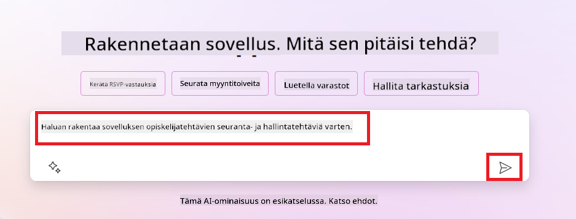
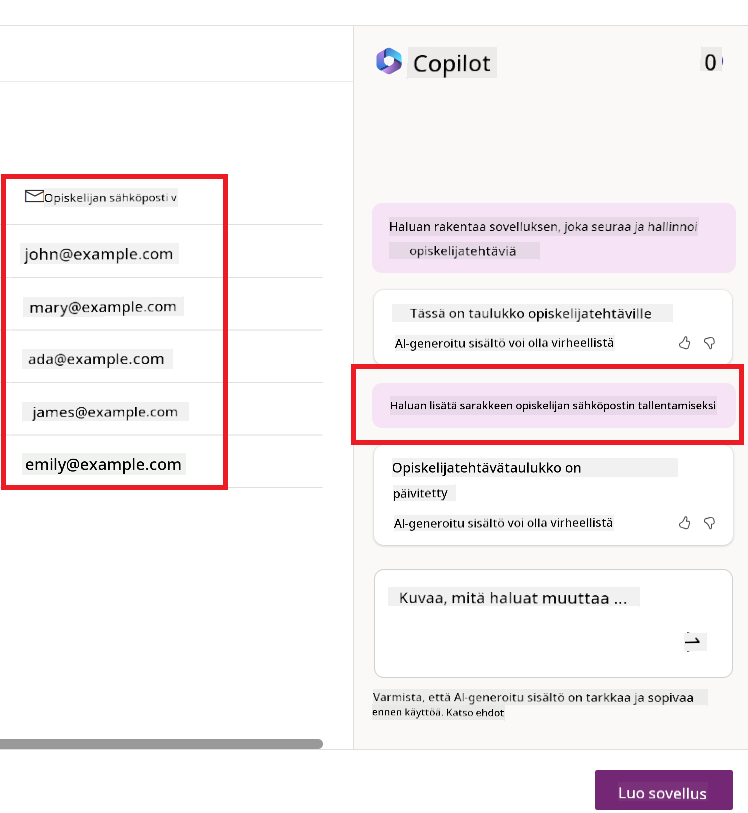
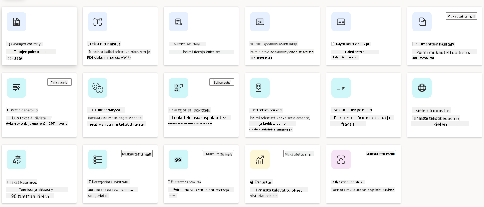
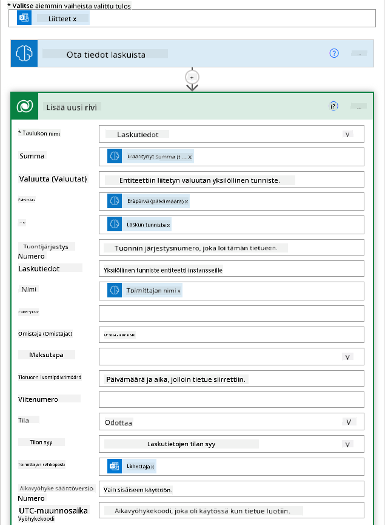
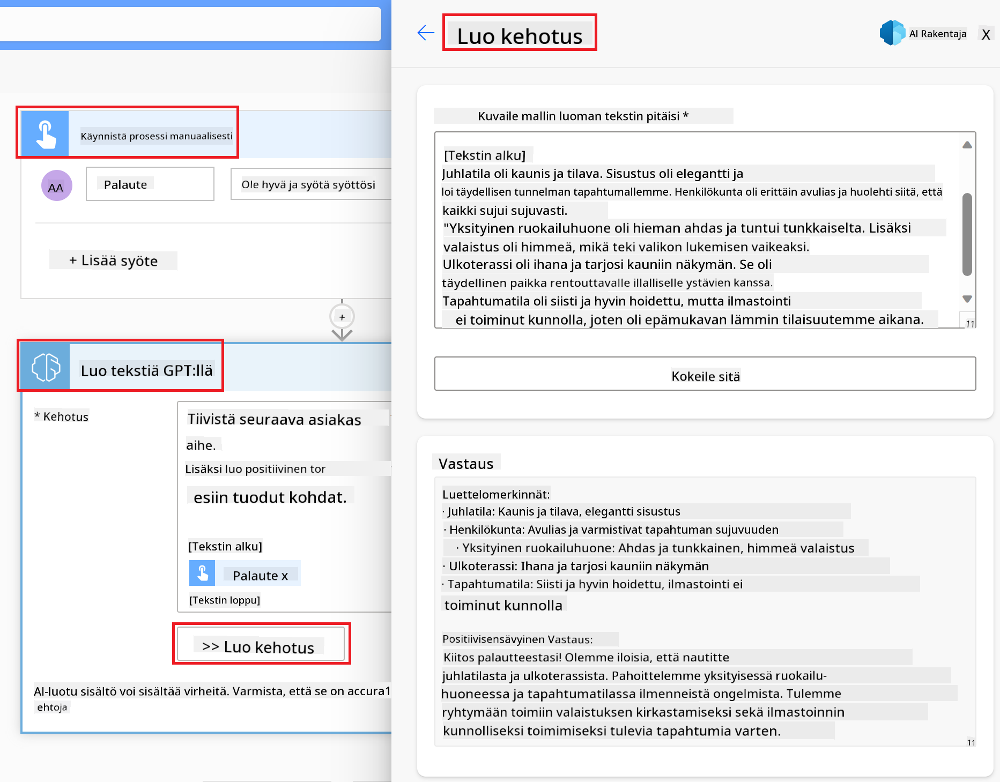

<!--
CO_OP_TRANSLATOR_METADATA:
{
  "original_hash": "f5ff3b6204a695a117d6f452403c95f7",
  "translation_date": "2025-05-19T20:36:03+00:00",
  "source_file": "10-building-low-code-ai-applications/README.md",
  "language_code": "fi"
}
-->
# Rakentamassa Low Code AI -sovelluksia

> _(Klikkaa yllä olevaa kuvaa nähdäksesi videon tästä oppitunnista)_

## Johdanto

Nyt kun olemme oppineet rakentamaan kuvien luomiseen tarkoitettuja sovelluksia, puhutaanpa low codesta. Generatiivista AI:ta voidaan käyttää monilla eri alueilla, mukaan lukien low code, mutta mitä low code oikeastaan on ja miten voimme lisätä siihen AI:n?

Sovellusten ja ratkaisujen rakentaminen on tullut helpommaksi perinteisille kehittäjille ja ei-kehittäjille Low Code Development Platforms -alustojen avulla. Low Code Development Platforms -alustat mahdollistavat sovellusten ja ratkaisujen rakentamisen vähäisellä tai olemattomalla koodilla. Tämä saavutetaan tarjoamalla visuaalinen kehitysympäristö, joka mahdollistaa komponenttien vetämisen ja pudottamisen sovellusten ja ratkaisujen rakentamiseksi. Tämä mahdollistaa sovellusten ja ratkaisujen nopeamman rakentamisen vähemmillä resursseilla. Tässä oppitunnissa sukellamme syvälle siihen, miten käyttää Low Code -alustaa ja miten parantaa low code -kehitystä AI:n avulla Power Platformin kautta.

Power Platform tarjoaa organisaatioille mahdollisuuden antaa tiimeilleen voimaa rakentaa omia ratkaisujaan intuitiivisessa low-code- tai no-code-ympäristössä. Tämä ympäristö auttaa yksinkertaistamaan ratkaisujen rakentamisen prosessia. Power Platformin avulla ratkaisuja voidaan rakentaa päivissä tai viikoissa kuukausien tai vuosien sijaan. Power Platform koostuu viidestä keskeisestä tuotteesta: Power Apps, Power Automate, Power BI, Power Pages ja Copilot Studio.

Tämä oppitunti kattaa:

- Johdanto generatiiviseen AI:hin Power Platformissa
- Johdanto Copilotiin ja sen käyttöön
- Generatiivisen AI:n käyttö sovellusten ja virtausten rakentamisessa Power Platformissa
- AI-mallien ymmärtäminen Power Platformissa AI Builderin avulla

## Oppimistavoitteet

Oppitunnin lopussa osaat:

- Ymmärtää, miten Copilot toimii Power Platformissa.

- Rakentaa opiskelijan tehtävien seurantaan tarkoitettu sovellus koulutusstartupillemme.

- Rakentaa laskujen käsittelyvirta, joka käyttää AI:ta tietojen poimimiseen laskuista.

- Soveltaa parhaita käytäntöjä GPT AI -mallin tekstin luomisessa.

Tässä oppitunnissa käytettävät työkalut ja teknologiat ovat:

- **Power Apps**, opiskelijan tehtävien seurantaan tarkoitettu sovellus, joka tarjoaa low-code-kehitysympäristön sovellusten rakentamiseen tietojen seuraamiseen, hallintaan ja vuorovaikutukseen.

- **Dataverse**, opiskelijan tehtävien seurantaan tarkoitetun sovelluksen tietojen tallentamiseen, jossa Dataverse tarjoaa low-code-tietojen tallennusalustan sovelluksen tietojen tallentamiseen.

- **Power Automate**, laskujen käsittelyvirtaan, jossa sinulla on low-code-kehitysympäristö työnkulkujen rakentamiseen laskujen käsittelyprosessin automatisoimiseksi.

- **AI Builder**, laskujen käsittelyyn tarkoitettuun AI-malliin, jossa käytät valmiita AI-malleja laskujen käsittelyyn startupillemme.

## Generatiivinen AI Power Platformissa

Low-code-kehityksen ja sovellusten parantaminen generatiivisella AI:lla on keskeinen painopiste Power Platformissa. Tavoitteena on mahdollistaa kaikille AI:lla tehostettujen sovellusten, sivustojen, kojelautojen rakentaminen ja prosessien automatisointi _ilman datatieteen asiantuntemusta_. Tämä tavoite saavutetaan integroimalla generatiivinen AI low-code-kehityskokemukseen Power Platformissa Copilotin ja AI Builderin muodossa.

### Miten tämä toimii?

Copilot on AI-avustaja, joka mahdollistaa Power Platform -ratkaisujen rakentamisen kuvailemalla vaatimuksesi sarjassa keskustelullisia vaiheita luonnollisella kielellä. Voit esimerkiksi ohjeistaa AI-avustajaasi kertomaan, mitä kenttiä sovelluksesi käyttää, ja se luo sekä sovelluksen että sen taustalla olevan tietomallin tai voit määrittää, miten asettaa virta Power Automateen.

Voit käyttää Copilot-ohjattuja toimintoja sovelluksesi näytöissä, jotta käyttäjät voivat löytää oivalluksia keskustelullisten vuorovaikutusten kautta.

AI Builder on Power Platformissa saatavilla oleva low-code AI-ominaisuus, joka mahdollistaa AI-mallien käytön prosessien automatisoimiseen ja tulosten ennustamiseen. AI Builderin avulla voit tuoda AI:n sovelluksiisi ja virtoihisi, jotka yhdistyvät Dataverse-tietoihisi tai eri pilvitietolähteisiin, kuten SharePoint, OneDrive tai Azure.

Copilot on saatavilla kaikissa Power Platformin tuotteissa: Power Apps, Power Automate, Power BI, Power Pages ja Power Virtual Agents. AI Builder on saatavilla Power Appsissa ja Power Automatessa. Tässä oppitunnissa keskitymme siihen, miten käyttää Copilotia ja AI Builderia Power Appsissa ja Power Automatessa rakentaaksemme ratkaisun koulutusstartupillemme.

### Copilot Power Appsissa

Osana Power Platformia Power Apps tarjoaa low-code-kehitysympäristön sovellusten rakentamiseen tietojen seuraamiseen, hallintaan ja vuorovaikutukseen. Se on sovelluskehityspalveluiden paketti, jossa on skaalautuva tietojen tallennusalusta ja kyky yhdistyä pilvipalveluihin ja paikallisiin tietoihin. Power Apps mahdollistaa sovellusten rakentamisen, jotka toimivat selaimissa, tableteissa ja puhelimissa, ja joita voidaan jakaa työkavereiden kanssa. Power Apps helpottaa käyttäjiä sovelluskehitykseen yksinkertaisella käyttöliittymällä, jotta jokainen liiketoiminnan käyttäjä tai ammattikehittäjä voi rakentaa mukautettuja sovelluksia. Sovelluskehityskokemusta parannetaan myös Generatiivisella AI:lla Copilotin kautta.

Copilot AI-avustajaominaisuus Power Appsissa mahdollistaa sen, että kuvailet millaisen sovelluksen tarvitset ja mitä tietoja haluat sovelluksesi seuraavan, keräävän tai näyttävän. Copilot luo sitten reagoivan Canvas-sovelluksen kuvauksesi perusteella. Voit sitten mukauttaa sovelluksen vastaamaan tarpeitasi. AI Copilot myös luo ja ehdottaa Dataverse-taulukkoa, jossa on kentät, joita tarvitset tietojen tallentamiseen, ja esimerkkitietoja. Tarkastelemme myöhemmin tässä oppitunnissa, mitä Dataverse on ja miten voit käyttää sitä Power Appsissa. Voit sitten mukauttaa taulukkoa vastaamaan tarpeitasi käyttämällä AI Copilot -avustajatoimintoa keskustelullisten vaiheiden kautta. Tämä ominaisuus on helposti saatavilla Power Apps -aloitusnäytöstä.

### Copilot Power Automatessa

Osana Power Platformia Power Automate antaa käyttäjille mahdollisuuden luoda automatisoituja työnkulkuja sovellusten ja palveluiden välillä. Se auttaa automatisoimaan toistuvia liiketoimintaprosesseja, kuten viestintää, tietojen keräämistä ja päätösten hyväksymistä. Sen yksinkertainen käyttöliittymä mahdollistaa käyttäjille, joilla on kaikenlainen tekninen osaaminen (aloittelijoista kokeneisiin kehittäjiin), työntehtävien automatisoinnin. Työnkulun kehityskokemusta parannetaan myös Generatiivisella AI:lla Copilotin kautta.

Copilot AI-avustajaominaisuus Power Automatessa mahdollistaa sen, että kuvailet millaisen virran tarvitset ja mitä toimintoja haluat virran suorittavan. Copilot luo sitten virran kuvauksesi perusteella. Voit sitten mukauttaa virran vastaamaan tarpeitasi. AI Copilot myös luo ja ehdottaa toimintoja, joita tarvitset tehtävän automatisoimiseksi. Tarkastelemme myöhemmin tässä oppitunnissa, mitä virtaukset ovat ja miten voit käyttää niitä Power Automatessa. Voit sitten mukauttaa toimintoja vastaamaan tarpeitasi käyttämällä AI Copilot -avustajatoimintoa keskustelullisten vaiheiden kautta. Tämä ominaisuus on helposti saatavilla Power Automate -aloitusnäytöstä.

## Tehtävä: Hallitse opiskelijoiden tehtäviä ja laskuja startupillemme Copilotin avulla

Startupimme tarjoaa verkkokursseja opiskelijoille. Startup on kasvanut nopeasti ja kamppailee nyt kurssiensa kysynnän kanssa. Startup on palkannut sinut Power Platform -kehittäjäksi auttamaan heitä rakentamaan low code -ratkaisun, joka auttaa heitä hallitsemaan opiskelijoiden tehtäviä ja laskuja. Ratkaisun tulisi auttaa heitä seuraamaan ja hallitsemaan opiskelijoiden tehtäviä sovelluksen kautta ja automatisoimaan laskujen käsittelyprosessin työnkulun kautta. Sinua on pyydetty käyttämään generatiivista AI:ta ratkaisun kehittämiseen.

Kun aloitat Copilotin käytön, voit käyttää [Power Platform Copilot Prompt Library](https://github.com/pnp/powerplatform-prompts?WT.mc_id=academic-109639-somelezediko) -kirjastoa aloittaaksesi kehotteiden kanssa. Tämä kirjasto sisältää luettelon kehotteista, joita voit käyttää sovellusten ja virtausten rakentamiseen Copilotilla. Voit myös käyttää kirjaston kehotteita saadaksesi käsityksen siitä, miten kuvailla vaatimuksiasi Copilotille.

### Rakennetaan opiskelijan tehtävien seurantaan tarkoitettu sovellus startupillemme

Startupimme opettajat ovat kamppailleet opiskelijoiden tehtävien seuraamisen kanssa. He ovat käyttäneet laskentataulukkoa tehtävien seuraamiseen, mutta tämä on tullut vaikeaksi hallita opiskelijoiden määrän kasvaessa. He ovat pyytäneet sinua rakentamaan sovelluksen, joka auttaa heitä seuraamaan ja hallitsemaan opiskelijoiden tehtäviä. Sovelluksen tulisi mahdollistaa uusien tehtävien lisääminen, tehtävien tarkastelu, tehtävien päivittäminen ja tehtävien poistaminen. Sovelluksen tulisi myös mahdollistaa opettajien ja opiskelijoiden tarkastella arvioituja ja arvioimattomia tehtäviä.

Rakennat sovelluksen käyttämällä Copilotia Power Appsissa seuraavien vaiheiden mukaan:

1. Siirry [Power Apps](https://make.powerapps.com?WT.mc_id=academic-105485-koreyst) -aloitusnäyttöön.

1. Käytä aloitusnäytön tekstialuetta kuvaamaan sovellusta, jonka haluat rakentaa. Esimerkiksi, **_Haluan rakentaa sovelluksen opiskelijoiden tehtävien seuraamiseen ja hallintaan_**. Klikkaa **Lähetä**-painiketta lähettääksesi kehotteen AI Copilotille.

1. AI Copilot ehdottaa Dataverse-taulukkoa, jossa on kentät, joita tarvitset tietojen tallentamiseen, ja esimerkkitietoja. Voit sitten mukauttaa taulukkoa vastaamaan tarpeitasi käyttämällä AI Copilot -avustajatoimintoa keskustelullisten vaiheiden kautta.

   > **Tärkeää**: Dataverse on Power Platformin taustalla oleva tietojen tallennusalusta. Se on low-code-tietojen tallennusalusta sovelluksen tietojen tallentamiseen. Se on täysin hallittu palvelu, joka tallentaa tiedot turvallisesti Microsoft Cloudissa ja on käytettävissä Power Platform -ympäristössäsi. Siinä on sisäänrakennetut tietojen hallintakyvyt, kuten tietojen luokittelu, tietojen alkuperä, hienojakoiset käyttöoikeudet ja paljon muuta. Voit oppia lisää Dataversesta [täältä](https://docs.microsoft.com/powerapps/maker/data-platform/data-platform-intro?WT.mc_id=academic-109639-somelezediko).

   

1. Opettajat haluavat lähettää sähköpostia opiskelijoille, jotka ovat palauttaneet tehtävänsä, pitääkseen heidät ajan tasalla tehtäviensä edistymisestä. Voit käyttää Copilotia lisätäksesi uuden kentän taulukkoon opiskelijan sähköpostin tallentamista varten. Esimerkiksi, voit käyttää seuraavaa kehotetta lisätäksesi uuden kentän taulukkoon: **_Haluan lisätä sarakkeen opiskelijan sähköpostin tallentamista varten_**. Klikkaa **Lähetä**-painiketta lähettääksesi kehotteen AI Copilotille.

1. AI Copilot luo uuden kentän, ja voit sitten mukauttaa kentän vastaamaan tarpeitasi.

1. Kun olet valmis taulukon kanssa, klikkaa **Luo sovellus** -painiketta luodaksesi sovelluksen.

1. AI Copilot luo reagoivan Canvas-sovelluksen kuvauksesi perusteella. Voit sitten mukauttaa sovelluksen vastaamaan tarpeitasi.

1. Jotta opettajat voivat lähettää sähköpostia opiskelijoille, voit käyttää Copilotia lisätäksesi uuden näytön sovellukseen. Esimerkiksi, voit käyttää seuraavaa kehotetta lisätäksesi uuden näytön sovellukseen: **_Haluan lisätä näytön sähköpostien lähettämiseksi opiskelijoille_**. Klikkaa **Lähetä**-painiketta lähettääksesi kehotteen AI Copilotille.

1. AI Copilot luo uuden näytön, ja voit sitten mukauttaa näytön vastaamaan tarpeitasi.

1. Kun olet valmis sovelluksen kanssa, klikkaa **Tallenna**-painiketta tallentaaksesi sovelluksen.

1. Jotta voit jakaa sovelluksen opettajille, klikkaa **Jaa**-painiketta ja sitten klikkaa **Jaa**-painiketta uudelleen. Voit sitten jakaa sovelluksen opettajille syöttämällä heidän sähköpostiosoitteensa.

> **Kotitehtäväsi**: Juuri rakentamasi sovellus on hyvä alku, mutta sitä voidaan parantaa. Sähköpostiominaisuuden avulla opettajat voivat lähettää sähköpostia opiskelijoille vain manuaalisesti kirjoittamalla heidän sähköpostinsa. Voitko käyttää Copilotia rakentaaksesi automaation, joka mahdollistaa opettajien lähettää sähköpostia opiskelijoille automaattisesti, kun he palauttavat tehtävänsä? Vihjeesi on, että oikealla kehotteella voit käyttää Copilotia Power Automatessa tämän rakentamiseen.

### Rakennetaan laskujen tietotaulukko startupillemme

Startupimme taloustiimi on kamppailut laskujen seuraamisen kanssa. He ovat käyttäneet laskentataulukkoa laskujen seuraamiseen, mutta tämä on tullut vaikeaksi hallita laskujen määrän kasvaessa. He ovat pyytäneet sinua rakentamaan taulukon, joka auttaa heitä tallentamaan, seuraamaan ja hallitsemaan vastaanotettujen laskujen tietoja. Taulukkoa tulisi käyttää automaation rakentamiseen, joka poimii kaikki laskujen tiedot ja tallentaa ne taulukkoon. Taulukon tulisi myös mahdollistaa taloustiimin tarkastella maksettuja ja maksamattomia laskuja.

Power Platformilla on taustalla oleva tietojen tallennusalusta nimeltä Dataverse, joka mahdollistaa sovellustesi ja ratkaisujesi tietojen tallentamisen. Dataverse tarjoaa low-code-tietojen tallennusalustan sovelluksen tietojen tallentamiseen. Se on täysin hallittu palvelu, joka tallentaa tiedot turvallisesti Microsoft Cloudissa ja on käytettävissä Power Platform -ympäristössäsi. Siinä on sisäänrakennetut tietojen hallintakyvyt, kuten tietojen luokittelu, tietojen alkuperä, hienojakoiset käyttöoikeudet ja paljon muuta. Voit oppia lisää [Dataversesta täältä](https://docs.microsoft.com/powerapps/maker/data-platform/data-platform-intro?WT.mc_id=academic-109639-somelezediko).

Miksi meidän pitäisi käyttää Dataverseä startupillemme? Dataversen vakio- ja mukautetut taulukot tarjoavat turvallisen ja pilvipohjaisen tallennusvaihtoehdon tiedoillesi. Taulukot mahdollistavat erilaisten tietojen tallentamisen, kuten käyttäisit useita laskentataulukoita yhdessä Excel-työkirjassa. Voit käyttää taulukoita tallentamaan tietoja, jotka ovat erityisiä organisaatiosi tai liiketoimintatarpeidesi kannalta. Joitakin etuja, joita startupimme saa Dataversen käytöstä, ovat muun muassa:

- **Helppo hallita**: Sekä metadata että tiedot tallennetaan pilveen, joten sinun ei tarvitse huolehtia niiden tallennus- tai hallintatiedoista. Voit keskittyä sovellustesi ja ratkaisujesi rakentamiseen.

- **Turvallinen**: Dataverse tarjoaa turvallisen ja pilvipohjaisen tallennusvaihtoehdon tiedoillesi. Voit hallita, kenellä on pääsy taulukoidesi
teksti. - **Tunneanalyysi**: Tämä malli tunnistaa positiivisen, negatiivisen, neutraalin tai sekoitetun tunteen tekstistä. - **Käyntikortin lukija**: Tämä malli poimii tietoa käyntikorteista. - **Tekstin tunnistus**: Tämä malli poimii tekstiä kuvista. - **Objektin tunnistus**: Tämä malli tunnistaa ja poimii objekteja kuvista. - **Asiakirjojen käsittely**: Tämä malli poimii tietoa lomakkeista. - **Laskujen käsittely**: Tämä malli poimii tietoa laskuista. Custom AI Models -mallien avulla voit tuoda oman mallisi AI Builderiin, jotta se voi toimia kuten mikä tahansa AI Builderin mukautettu malli, jolloin voit kouluttaa mallia omalla datallasi. Voit käyttää näitä malleja prosessien automatisointiin ja tulosten ennustamiseen sekä Power Appsissa että Power Automatessa. Kun käytät omaa malliasi, tietyt rajoitukset koskevat sen käyttöä. Lue lisää näistä [rajoituksista](https://learn.microsoft.com/ai-builder/byo-model#limitations?WT.mc_id=academic-105485-koreyst).  ## Tehtävä #2 - Rakenna laskujen käsittelyprosessi startupillemme Taloustiimi on kamppaillut laskujen käsittelyn kanssa. He ovat käyttäneet laskujen seuraamiseen taulukkoa, mutta tämän hallitseminen on käynyt vaikeaksi laskujen määrän kasvaessa. He ovat pyytäneet sinua rakentamaan työnkulun, joka auttaa heitä käsittelemään laskuja AI:n avulla. Työnkulun tulisi mahdollistaa laskujen tietojen poimiminen ja tallentaminen Dataverse-taulukkoon. Työnkulun tulisi myös mahdollistaa sähköpostin lähettäminen taloustiimille poimituilla tiedoilla. Nyt kun tiedät, mitä AI Builder on ja miksi sitä kannattaa käyttää, tarkastellaan, kuinka voit käyttää AI Builderin laskujen käsittelymallia, jota käsittelimme aiemmin, rakentaaksesi työnkulun, joka auttaa taloustiimiä laskujen käsittelyssä. Rakentaaksesi työnkulun, joka auttaa taloustiimiä laskujen käsittelyssä AI Builderin laskujen käsittelymallin avulla, noudata alla olevia ohjeita: 1. Siirry [Power Automate](https://make.powerautomate.com?WT.mc_id=academic-105485-koreyst) -etusivulle. 2. Käytä etusivun tekstialuetta kuvaamaan työnkulku, jonka haluat rakentaa. Esimerkiksi, **_Käsittele lasku, kun se saapuu postilaatikkooni_**. Klikkaa **Lähetä**-painiketta lähettääksesi kehotteen AI Copilotille.  3. AI Copilot ehdottaa toimia, joita sinun on tehtävä haluamasi tehtävän automatisoimiseksi. Voit klikata **Seuraava**-painiketta siirtyäksesi seuraaviin vaiheisiin. 4. Seuraavassa vaiheessa Power Automate kehottaa sinua määrittämään virran vaaditut yhteydet. Kun olet valmis, klikkaa **Luo virta**-painiketta luodaksesi virran. 5. AI Copilot luo virran, ja voit sitten mukauttaa virtaa tarpeidesi mukaan. 6. Päivitä virran käynnistin ja aseta **Kansio** kansioon, johon laskut tallennetaan. Esimerkiksi voit asettaa kansion **Saapuneet**. Klikkaa **Näytä lisäasetukset** ja aseta **Vain liitteillä** kohtaan **Kyllä**. Tämä varmistaa, että virta käynnistyy vain, kun kansioon saapuu sähköposti liitteen kanssa. 7. Poista seuraavat toiminnot virrasta: **HTML to text**, **Compose**, **Compose 2**, **Compose 3** ja **Compose 4**, koska et käytä niitä. 8. Poista **Ehto**-toiminto virrasta, koska et käytä sitä. Sen tulisi näyttää seuraavalta kuvakaappaukselta:  9. Klikkaa **Lisää toiminto**-painiketta ja etsi **Dataverse**. Valitse **Lisää uusi rivi**-toiminto. 10. **Poimi tietoa laskuista**-toiminnossa päivitä **Laskutiedosto** osoittamaan sähköpostin **Liitteen sisältö**-kohtaan. Tämä varmistaa, että virta poimii tietoa laskuliitteestä. 11. Valitse aiemmin luomasi **Taulukko**. Esimerkiksi voit valita **Laskutiedot**-taulukon. Valitse aiemman toiminnon dynaaminen sisältö täyttääksesi seuraavat kentät: - ID - Summa - Päivämäärä - Nimi - Tila - Aseta **Tila** kohtaan **Odottava**. - Toimittajan sähköposti - Käytä **Lähettäjä**-dynaamista sisältöä **Kun uusi sähköposti saapuu**-käynnistimestä.  12. Kun olet valmis virran kanssa, klikkaa **Tallenna**-painiketta tallentaaksesi virran. Voit sitten testata virtaa lähettämällä sähköpostin laskun kanssa kansioon, jonka määritit käynnistimessä. > **Kotitehtäväsi**: Virta, jonka juuri rakensit, on hyvä alku, nyt sinun tulee miettiä, kuinka voit rakentaa automaation, joka mahdollistaa taloustiimimme lähettämään sähköpostin toimittajalle päivittääkseen heidät laskunsa nykyisestä tilasta. Vihjeesi: virran tulee käynnistyä, kun laskun tila muuttuu.

## Käytä tekstin generointia AI-mallilla Power Automatessa

Luo tekstiä GPT AI-mallilla AI Builderissa mahdollistaa tekstin generoinnin kehotteen perusteella ja toimii Microsoft Azure OpenAI -palvelun avulla. Tämän ominaisuuden avulla voit sisällyttää GPT (Generative Pre-Trained Transformer) -teknologian sovelluksiisi ja virtoihisi rakentaaksesi monenlaisia automatisoituja virtoja ja oivaltavia sovelluksia.

GPT-mallit käyvät läpi laajaa koulutusta valtavilla tietomäärillä, mikä mahdollistaa tekstin tuottamisen, joka muistuttaa läheisesti ihmiskieltä kehotteen perusteella. Kun ne yhdistetään työnkulkuautomaatioon, AI-malleja kuten GPT:tä voidaan hyödyntää monenlaisten tehtävien tehostamiseen ja automatisointiin.

Esimerkiksi voit rakentaa virtoja, jotka automaattisesti generoivat tekstiä monenlaisiin käyttötarkoituksiin, kuten: sähköpostiluonnoksia, tuotekuvauksia ja muuta. Voit myös käyttää mallia tekstin generointiin monenlaisissa sovelluksissa, kuten chatboteissa ja asiakaspalvelusovelluksissa, jotka mahdollistavat asiakaspalveluedustajien vastaamisen tehokkaasti ja sujuvasti asiakaskyselyihin.

Oppiaksesi käyttämään tätä AI-mallia Power Automatessa, käy läpi [Lisää älykkyyttä AI Builderilla ja GPT:llä](https://learn.microsoft.com/training/modules/ai-builder-text-generation/?WT.mc_id=academic-109639-somelezediko) -moduuli.

## Hyvää työtä! Jatka oppimistasi

Kun olet suorittanut tämän oppitunnin, tutustu [Generatiivisen AI:n oppimiskokoelmaan](https://aka.ms/genai-collection?WT.mc_id=academic-105485-koreyst) jatkaaksesi generatiivisen AI:n osaamisen kehittämistä!

Siirry oppituntiin 11, jossa tarkastelemme, kuinka [integroida generatiivinen AI funktiokutsujen kanssa](../11-integrating-with-function-calling/README.md?WT.mc_id=academic-105485-koreyst)!

**Vastuuvapauslauseke**:  
Tämä asiakirja on käännetty käyttämällä tekoälypohjaista käännöspalvelua [Co-op Translator](https://github.com/Azure/co-op-translator). Vaikka pyrimme tarkkuuteen, ole tietoinen, että automaattiset käännökset voivat sisältää virheitä tai epätarkkuuksia. Alkuperäistä asiakirjaa sen alkuperäisellä kielellä tulisi pitää auktoritatiivisena lähteenä. Kriittisten tietojen kohdalla suositellaan ammattimaista ihmiskäännöstä. Emme ole vastuussa väärinkäsityksistä tai virhetulkinnoista, jotka johtuvat tämän käännöksen käytöstä.