# Low Code -tekoälysovellusten rakentaminen

> _(Napsauta yllä olevaa kuvaa katsellaksesi tämän oppitunnin videota)_

## Johdanto

Nyt kun olemme oppineet rakentamaan kuvia generoivia sovelluksia, puhutaanpa low codesta. Generatiivista tekoälyä voidaan käyttää monilla eri alueilla, mukaan lukien low code, mutta mitä low code oikeastaan on ja kuinka voimme lisätä tekoälyä siihen?

Sovellusten ja ratkaisujen rakentamisesta on tullut helpompaa sekä perinteisille kehittäjille että ei-kehittäjille Low Code Development Platforms -alustojen avulla. Low Code Development Platforms mahdollistavat sovellusten ja ratkaisujen rakentamisen vähän tai ilman koodausta. Tämä saavutetaan tarjoamalla visuaalinen kehitysympäristö, joka mahdollistaa komponenttien vetämisen ja pudottamisen sovellusten ja ratkaisujen rakentamiseen. Tämä mahdollistaa sovellusten ja ratkaisujen nopeamman rakentamisen vähemmillä resursseilla. Tässä oppitunnissa sukellamme syvälle siihen, miten low coden käyttö onnistuu ja miten low code -kehitystä voidaan tehostaa tekoälyllä Power Platformin avulla.

Power Platform tarjoaa organisaatioille mahdollisuuden voimaannuttaa tiiminsä rakentamaan omia ratkaisujaan intuitiivisen low-code- tai no-code-ympäristön avulla. Tämä ympäristö auttaa yksinkertaistamaan ratkaisujen rakentamisprosessia. Power Platformin avulla ratkaisut voidaan rakentaa päivissä tai viikoissa kuukausien tai vuosien sijaan. Power Platform koostuu viidestä keskeisestä tuotteesta: Power Apps, Power Automate, Power BI, Power Pages ja Copilot Studio.

Tämä oppitunti käsittelee:

- Johdanto generatiiviseen tekoälyyn Power Platformissa
- Johdanto Copilotiin ja sen käyttöön
- Generatiivinen tekoäly sovellusten ja työnkulkujen rakentamisessa Power Platformissa
- Power Platformin tekoälymallien ymmärtäminen AI Builderin avulla
- Älykkäiden agenttien rakentaminen Microsoft Copilot Studiolla

## Oppimistavoitteet

Tämän oppitunnin lopussa osaat:

- Ymmärtää, miten Copilot toimii Power Platformissa.

- Rakentaa opiskelijatehtävien seurantasovelluksen koulutusstartupllemme.

- Rakentaa laskujen käsittelytyönkulun, joka käyttää tekoälyä tietojen poimimiseen laskuista.

- Soveltaa parhaita käytäntöjä Create Text with GPT -tekoälymallin käytössä.

- Ymmärtää, mitä Microsoft Copilot Studio on ja miten rakennat älykkäitä agenteja sen avulla.

Oppitunnissa käytettävät työkalut ja teknologiat ovat:

- **Power Apps**, opiskelijatehtävien seurantasovellukseen, joka tarjoaa low-code-kehitysympäristön sovellusten rakentamiseen, joiden avulla hallitaan, seurataan ja käsitellään tietoja.

- **Dataverse**, opiskelijatehtävien seurantasovelluksen tietojen tallentamiseen, jossa Dataverse tarjoaa low-code-tietoplatformin sovelluksen tietojen tallentamiseen.

- **Power Automate**, laskujen käsittelytyönkulkuun, jossa on low-code-kehitysympäristö työnkulkujen rakentamiseen laskujen käsittelyprosessin automatisoimiseksi.

- **AI Builder**, laskujen käsittelyn tekoälymalliin, jossa käytät valmiita tekoälymalleja laskujen käsittelemiseen startupissamme.

## Generatiivinen tekoäly Power Platformissa

Low-code-kehityksen ja sovellusten tehostaminen generatiivisella tekoälyllä on keskeinen painopiste Power Platformissa. Tavoitteena on mahdollistaa kaikkien rakentaa tekoälyllä toimivia sovelluksia, verkkosivustoja, koontinäyttöjä ja automatisoida prosesseja tekoälyllä _ilman, että tarvitaan data-analyysin osaamista_. Tämä tavoite saavutetaan integroimalla generatiivinen tekoäly low-code-kehityskokemukseen Power Platformissa Copilotin ja AI Builderin muodossa.

### Miten tämä toimii?

Copilot on tekoälyavustaja, jonka avulla voit rakentaa Power Platform -ratkaisuja kuvailemalla vaatimuksiasi sarjassa keskustelumuotoisia vaiheita luonnollisella kielellä. Voit esimerkiksi ohjeistaa tekoälyavustajaasi mainitsemaan, mitä kenttiä sovelluksesi käyttää, jolloin se luo sekä sovelluksen että taustalla olevan tietomallin, tai voit määritellä, miten työnkulku Power Automatessa asetetaan.

Voit käyttää Copilot-ohjattuja toimintoja ominaisuutena sovelluksesi näytöissä auttaaksesi käyttäjiä löytämään oivalluksia keskustelupohjaisten vuorovaikutusten kautta.

AI Builder on low-code-tekoälyominaisuus Power Platformissa, joka mahdollistaa tekoälymallien käytön prosessien automatisointiin ja tulosten ennustamiseen. AI Builderin avulla voit tuoda tekoälyn sovelluksiisi ja työnkulkuihisi, jotka yhdistävät dataan Dataversessa tai erilaisissa pilvitietolähteissä kuten SharePoint, OneDrive tai Azure.

Copilot on saatavilla kaikissa Power Platform -tuotteissa: Power Apps, Power Automate, Power BI, Power Pages ja Copilot Studio (entinen Power Virtual Agents). AI Builder on saatavilla Power Appsissa ja Power Automatessa. Tässä oppitunnissa keskitymme siihen, miten Copilotia ja AI Builderia käytetään Power Appsissa ja Power Automatessa rakentamaan ratkaisu koulutusstartupllemme.

### Copilot Power Appsissa

Osana Power Platformia Power Apps tarjoaa low-code-kehitysympäristön sovellusten rakentamiseen tietojen seurantaan, hallintaan ja käsittelyyn. Se on sovelluskehityspalvelujen kokonaisuus, jossa on skaalautuva tietoplatform ja kyky yhdistää pilvipalveluihin ja paikallisiin tietoihin. Power Appsilla voit rakentaa sovelluksia, jotka toimivat selaimissa, tableteissa ja puhelimissa, ja ne voidaan jakaa kollegoille. Power Apps helpottaa käyttäjiä aloittamaan sovelluskehityksen yksinkertaisella käyttöliittymällä, jotta jokainen liiketoimintakäyttäjä tai kokenut kehittäjä voi rakentaa räätälöityjä sovelluksia. Sovelluskehityskokemusta parantaa myös generatiivinen tekoäly Copilotin kautta.

Power Appsissa oleva Copilot AI -avustajaominaisuus mahdollistaa tarpeesi kuvaamisen siitä, millaisen sovelluksen haluat ja mitä tietoja sovelluksesi seuraa, kerää tai näyttää. Copilot luo kuvauksesi perusteella responsiivisen Canvas-sovelluksen. Voit sitten mukauttaa sovelluksen tarpeidesi mukaan. AI Copilot myös luo ja ehdottaa Dataverse-taulukon, jossa on kentät, joihin tarvitset tallentaa seuraamasi tiedot, sekä esimerkkitietoja. Tässä oppitunnissa perehdymme myöhemmin Dataverseen ja sen käyttöön Power Appsissa. Voit mukauttaa taulukkoa tarpeidesi mukaan käyttämällä AI Copilot -avustajan ominaisuutta keskustelupohjaisten vaiheiden avulla. Tämä ominaisuus on helposti käytettävissä Power Appsin kotinäkymästä.

### Copilot Power Automatessa

Osana Power Platformia Power Automate mahdollistaa käyttäjille automaattisten työnkulkujen luomisen sovellusten ja palveluiden välille. Se auttaa automatisoimaan toistuvia liiketoimintaprosesseja kuten viestintää, tiedonkeruuta ja päätösten hyväksymistä. Sen yksinkertainen käyttöliittymä mahdollistaa erilaisten teknisten taitotasojen käyttäjien (aloittelijoista kokeneisiin kehittäjiin) työtehtävien automatisoinnin. Työnkulkujen kehityskokemusta parantaa myös generatiivinen tekoäly Copilotin kautta.

Power Automatessa oleva Copilot AI -avustajaominaisuus antaa sinun kuvata, millaisen työnkulun tarvitset ja mitä toimintoja työnkulun tulee suorittaa. Copilot luo kuvauksesi perusteella työnkulun. Voit sitten mukauttaa työnkulun tarpeidesi mukaan. AI Copilot myös luo ja ehdottaa toimintoja, joita tarvitset automaattisen tehtävän suorittamiseen. Tässä oppitunnissa perehdymme myöhemmin siihen, mitä työnkulut ovat ja miten niitä käytetään Power Automatessa. Voit mukauttaa toimintoja tarpeidesi mukaan käyttämällä AI Copilot -avustajan ominaisuutta keskustelupohjaisten vaiheiden avulla. Tämä ominaisuus on helposti käytettävissä Power Automaten kotinäkymästä.

## Älykkäiden agenttien rakentaminen Microsoft Copilot Studiolla

[Microsoft Copilot Studio](https://learn.microsoft.com/microsoft-copilot-studio/fundamentals-what-is-copilot-studio?WT.mc_id=academic-105485-koreyst) (entinen Power Virtual Agents) on low-code-jäsen Power Platformissa **tekoälyagenttien** rakentamiseen — keskustelevia copiloteja, jotka voivat vastata kysymyksiin, suorittaa toimintoja ja automatisoida tehtäviä käyttäjiesi puolesta. Kuten muu Power Platform, rakennat nämä agentit visuaalisessa, luonnolliskielisessä kokemuksessa: kuvailet, mitä haluat agentin tekevän, ja Copilot Studio auttaa rakentamaan sen ohjeet, tiedot ja toiminnot.

Koulutusstartupllemme voisit rakentaa agentin, joka vastaa opiskelijoiden opiskelukysymyksiin, tarkistaa tehtävien määräajat ja jopa lähettää sähköpostia opettajalle — kaikki ilman koodin kirjoittamista.

Tässä on joitakin viimeisimpiä ominaisuuksia, jotka tekevät Copilot Studiosta tehokkaan:

- **Generatiiviset vastaukset tiedoistasi**. Sen sijaan, että kirjoittaisit jokaisen keskustelun käsin, voit yhdistää **tietolähteitä** — julkisia verkkosivustoja, SharePointia, OneDrivea, Dataverseta, ladattuja tiedostoja tai yritystietoja liittimien kautta — ja agentti luo niistä perusteltuja vastauksia.

- **Generatiivinen orkestrointi**. Sen sijaan, että luotattaisiin jäykkiin laukaisulauseisiin, agentti käyttää tekoälyä ymmärtämään pyynnön ja päättämään dynaamisesti, mitkä tiedot, aiheet ja toiminnot yhdistetään pyynnön toteuttamiseksi, mukaan lukien monivaiheisten toimintojen ketjutus.

- **Toiminnot ja liittimet**. Agentit voivat *tehdä* asioita, eivät vain keskustella. Voit antaa agentille toimintoja, joita tukevat yli 1 500 valmiina oleva Power Platform -liitin, Power Automate -työnkulut, mukautetut REST API:t, kehotteet tai **Model Context Protocol (MCP)** -palvelimet.

- **Autonomiset agentit**. Agentit eivät ole rajoittuneet vastaamaan chat-ikkunassa. Voit rakentaa **autonomisia agenteja**, joita laukaisevat tapahtumat — kuten uusi sähköposti, uusi tietue Dataversessa tai tiedoston lataus — ja jotka toimivat taustalla tehtävän suorittamiseksi.

- **Moni-agenttien orkestrointi**. Agentit voivat kutsua muita agenteja. Copilot Studio -agentti voi siirtää tehtävän toiselle agentille tai laajentua muilla agenteilla, mukaan lukien Microsoft 365 Copilotissa julkaistut agentit ja Microsoft Foundryssä rakennetut agentit.

- **Mallin valinta**. Sisäänrakennettujen mallien lisäksi voit tuoda malleja Microsoft Foundryn mallikatalogista räätälöidäksesi agenttisi päättelyä ja vastauksia.

- **Julkaise missä tahansa**. Kun agentti on rakennettu, sen voi julkaista useisiin kanaviin — Microsoft Teamsiin, Microsoft 365 Copilotiin, verkkosivustolle tai mukautettuun sovellukseen ja muihin — turvallisuus, todennus ja analytiikka hallitaan Power Platformin hallintakokemuksen kautta.

Voit aloittaa ensimmäisen agenttisi rakentamisen osoitteessa [copilotstudio.microsoft.com](https://copilotstudio.microsoft.com?WT.mc_id=academic-105485-koreyst) ja oppia lisää [Microsoft Copilot Studion dokumentaatiosta](https://learn.microsoft.com/microsoft-copilot-studio/?WT.mc_id=academic-105485-koreyst).

## Tehtävä: Hallitse opiskelijatehtäviä ja laskuja startupillemme Copilotia käyttäen

Startupimme tarjoaa opiskelijoille verkkokursseja. Startup on kasvanut nopeasti ja sen on nyt vaikea vastata kurssien kysyntään. Startup on palkannut sinut Power Platform -kehittäjäksi auttamaan rakentamaan low code -ratkaisun opiskelijatehtävien ja laskujen hallintaan. Ratkaisun tulisi auttaa seuraamaan ja hallitsemaan opiskelijatehtäviä sovelluksen avulla sekä automatisoimaan laskujen käsittely työnkulun kautta. Sinua on pyydetty käyttämään generatiivista tekoälyä ratkaisun kehittämiseen.

Kun aloitat Copilotin käytön, voit käyttää [Power Platform Copilot Prompt Librarya](https://github.com/pnp/powerplatform-prompts?WT.mc_id=academic-109639-somelezediko) aloittaaksesi kehotteilla. Tämä kirjasto sisältää listan kehotteista, joita voit käyttää sovellusten ja työnkulkujen rakentamisessa Copilotin kanssa. Voit myös käyttää kirjaston kehotteita saadaksesi idean siitä, miten kuvata vaatimuksesi Copilotille.

### Rakenna opiskelijatehtävien seurantasovellus startupillemme

Startupimme kouluttajat ovat kamppailleet opiskelijatehtävien seurannassa. He ovat käyttäneet tehtävien seuraamiseen taulukkolaskentaohjelmaa, mutta se on muuttunut vaikeaksi hallita opiskelijoiden määrän kasvaessa. He ovat pyytäneet sinua rakentamaan sovelluksen, joka auttaa heitä seuraamaan ja hallitsemaan opiskelijatehtäviä. Sovelluksen tulisi mahdollistaa uusien tehtävien lisääminen, tehtävien katselu, päivitys ja poistaminen. Sovelluksen tulisi myös antaa kouluttajille ja opiskelijoille mahdollisuus nähdä arvostellut tehtävät ja ne, joita ei ole vielä arvosteltu.

Rakennat sovelluksen käyttämällä Copilotia Power Appsissa seuraavien vaiheiden mukaisesti:

1. Siirry [Power Apps](https://make.powerapps.com?WT.mc_id=academic-105485-koreyst) kotisivulle.

1. Käytä kotisivun tekstialuetta kuvataksesi sovelluksen, jonka haluat rakentaa. Esimerkiksi, **_Haluan rakentaa sovelluksen opiskelijatehtävien seuraamiseen ja hallintaan_**. Napsauta **Lähetä**-painiketta lähettääksesi kehotteen AI Copilotille.

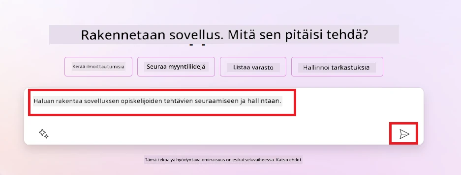

1. AI Copilot ehdottaa Dataverse-taulukon, jossa on kentät, joita tarvitset seurataksesi haluamaasi dataa, sekä esimerkkitiedot. Voit sitten mukauttaa taulukkoa tarpeidesi mukaan AI Copilot -avustajan keskusteluvaiheiden avulla.

   > **Tärkeää**: Dataverse on Power Platformin taustalla oleva tietoplatform. Se on low-code-tietoplatform sovelluksen tietojen tallentamiseen. Se on täysin hallittu palvelu, joka tallentaa tiedot turvallisesti Microsoftin pilveen ja on provisionoitu Power Platform -ympäristöösi. Siihen kuuluu sisäänrakennetut tietohallinnan ominaisuudet, kuten tietojen luokittelu, datan jäljitettävyys, hienojakoinen käyttöoikeuksien hallinta ja muuta. Voit oppia lisää Dataversesta [täältä](https://learn.microsoft.com/power-apps/maker/data-platform/data-platform-intro?WT.mc_id=academic-109639-somelezediko).

   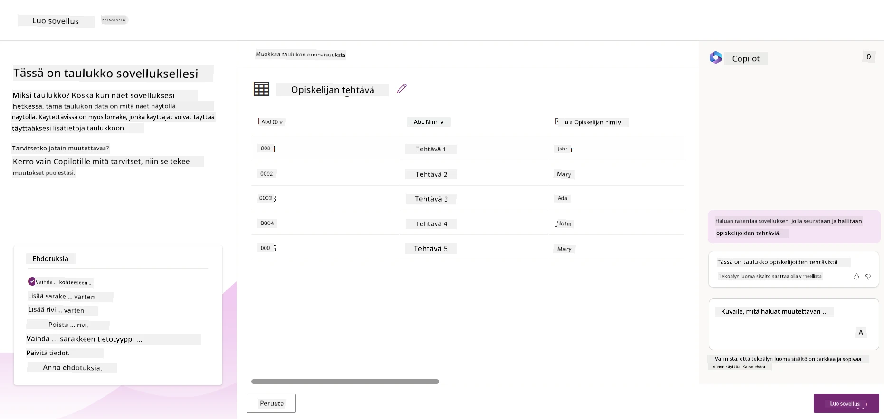

1. Kouluttajat haluavat lähettää sähköposteja opiskelijoille, jotka ovat palauttaneet tehtävänsä, pitääkseen heidät ajan tasalla tehtävien edistymisestä. Voit käyttää Copilotia lisätäksesi uuden kentän taulukkoon opiskelijan sähköpostin tallentamista varten. Esimerkiksi voit käyttää seuraavaa kehotetta lisätäksesi uuden sarakkeen taulukkoon: **_Haluan lisätä sarakkeen opiskelijoiden sähköpostin tallentamiseen_**. Napsauta **Lähetä**-painiketta lähettääksesi kehotteen AI Copilotille.

1. AI Copilot luo uuden kentän, ja voit sitten mukauttaa kentän tarpeidesi mukaiseksi.

1. Kun olet valmis taulukon kanssa, klikkaa **Luo sovellus** -painiketta luodaksesi sovelluksen.

1. AI Copilot luo reagoivan Canvas-sovelluksen kuvaustasi perusteella. Voit sitten mukauttaa sovelluksen tarpeidesi mukaan.

1. Opettajille, jotka haluavat lähettää sähköposteja opiskelijoille, voit käyttää Copilotia lisätäksesi uuden näytön sovellukseen. Voit esimerkiksi käyttää seuraavaa kehotetta lisätäksesi uuden näytön sovellukseen: **_Haluan lisätä näytön, jolla voi lähettää sähköposteja opiskelijoille_**. Klikkaa **Lähetä** -painiketta lähettääksesi kehotteen AI Copilotille.

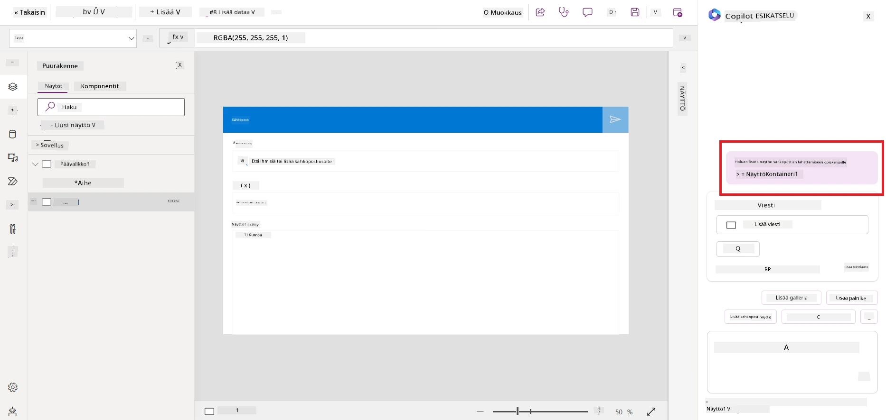

1. AI Copilot luo uuden näytön, jonka jälkeen voit mukauttaa näytön tarpeidesi mukaan.

1. Kun olet valmis sovelluksen kanssa, klikkaa **Tallenna** -painiketta tallentaaksesi sovelluksen.

1. Jaaaksesi sovelluksen opettajille, klikkaa **Jaa** -painiketta ja sitten vielä kerran **Jaa** -painiketta. Voit sitten jakaa sovelluksen opettajille syöttämällä heidän sähköpostiosoitteensa.

> **Kotitehtäväsi**: juuri rakentamasi sovellus on hyvä alku, mutta sitä voidaan parantaa. Sähköpostiominaisuudella opettajat voivat lähettää sähköposteja opiskelijoille vain manuaalisesti kirjoittamalla heidän sähköpostiosoitteensa. Voitko käyttää Copilotia rakentaaksesi automaation, joka mahdollistaa opettajien lähettää sähköposteja opiskelijoille automaattisesti, kun he palauttavat tehtävänsä? Vihjeesi: oikealla kehotteella voit käyttää Copilotia Power Automatessa tämän rakentamiseen.

### Luo laskutustietotaulukko startupillemme

Startupimme taloustiimi on kamppaillut laskujen seuraamisessa. He ovat käyttäneet taulukkolaskentaa laskujen seuraamiseen, mutta se on käynyt vaikeaksi hallita laskujen määrän kasvaessa. He ovat pyytäneet sinua rakentamaan taulukon, joka auttaa tallentamaan, seuraamaan ja hallitsemaan vastaanotettujen laskujen tietoja. Taulukkoa tulisi käyttää automaation rakentamiseen, joka poimii kaikki laskutiedot ja tallentaa ne taulukkoon. Taulukon tulisi myös antaa taloustiimille mahdollisuus tarkastella maksettuja ja maksamattomia laskuja.

Power Platformilla on taustalla tietovarasto nimeltä Dataverse, joka mahdollistaa datan tallentamisen sovelluksiisi ja ratkaisuihisi. Dataverse tarjoaa matalan koodin tietovaraston sovellusten datan tallentamiseen. Se on täysin hallinnoitu palvelu, joka tallentaa tietoa turvallisesti Microsoftin pilvessä ja on määritetty Power Platform -ympäristöösi. Siihen sisältyy sisäänrakennetut tiedonhallintamahdollisuudet, kuten tietojen luokittelu, tietojen jäljitettävyys, tarkka käyttöoikeuksien hallinta ja muuta. Voit oppia lisää [Dataversesta täältä](https://learn.microsoft.com/power-apps/maker/data-platform/data-platform-intro?WT.mc_id=academic-109639-somelezediko).

Miksi meidän pitäisi käyttää Dataversea startupissamme? Dataversen oletus- ja mukautetut taulukot tarjoavat turvallisen ja pilvipohjaisen tallennusvaihtoehdon datallesi. Taulukot mahdollistavat erilaisten tietotyyppien tallentamisen, kuten monen laskentataulukon käyttäminen yhdellä Excel-työkirjalla. Voit käyttää taulukkoja tallentaaksesi dataa, joka on organisaatiosi tai liiketoimintasi tarpeisiin sopivaa. Joitakin hyötyjä, joita startupimme saa Dataversen käytöstä, ovat muun muassa:

- **Helppo hallita**: Sekä metadata että data tallennetaan pilveen, joten sinun ei tarvitse huolehtia tallennuksen tai hallinnan yksityiskohdista. Voit keskittyä sovellustesi ja ratkaisujesi rakentamiseen.

- **Turvallinen**: Dataverse tarjoaa turvallisen ja pilvipohjaisen tallennusvaihtoehdon datallesi. Voit hallita, kuka pääsee käsiksi taulukoidesi tietoihin ja miten he voivat niitä käyttää roolipohjaisen tietoturvan avulla.

- **Rikas metadata**: Tietotyyppejä ja suhteita käytetään suoraan Power Appsissa.

- **Logiikka ja validointi**: Voit käyttää liiketoimintasääntöjä, laskettuja kenttiä ja validointisääntöjä liiketoimintalogiikan noudattamiseen ja datan oikeellisuuden ylläpitämiseen.

Nyt kun tiedät, mitä Dataverse on ja miksi sitä pitäisi käyttää, katsotaan kuinka voit käyttää Copilotia luodaksesi taulukon Dataverseen taloustiimimme vaatimuksia varten.

> **Huom:** Käytät tätä taulukkoa seuraavassa osassa rakentaaksesi automaation, joka poimii kaikki laskutiedot ja tallentaa ne taulukkoon.

Luo taulukko Dataverseen Copilotin avulla seuraamalla alla olevia ohjeita:

1. Siirry [Power Apps](https://make.powerapps.com?WT.mc_id=academic-105485-koreyst) kotinäkymään.

2. Vasemmasta navigointipalkista valitse **Taulukot** ja sitten napsauta **Kuvaile uutta taulukkoa**.

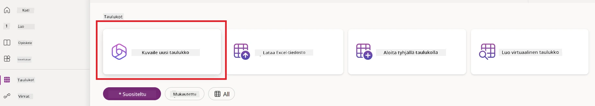

1. **Kuvaile uusi taulukko** -näytöllä käytä tekstialuetta kuvaillaksesi haluamaasi luotavaa taulukkoa. Esimerkiksi: **_Haluan luoda taulukon laskutietojen tallentamista varten_**. Klikkaa **Lähetä** -painiketta lähettääksesi kehotteen AI Copilotille.

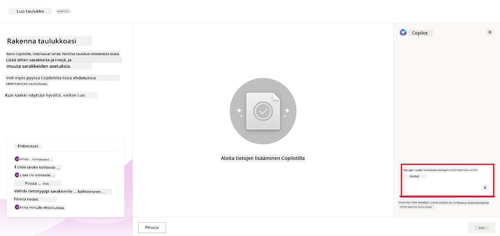

1. AI Copilot ehdottaa Dataverse-taulukkoa tarvittavine kenttineen datan tallentamiseen seurattavaa tietoa varten ja lisää myös esimerkkidataa. Voit mukauttaa taulukkoa tarpeidesi mukaan käyttämällä AI Copilot -avustajan ominaisuutta keskustelumaisissa vaiheissa.

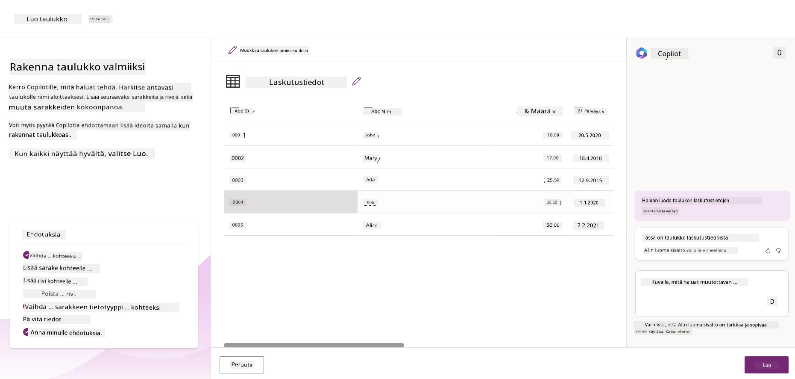

1. Taloustiimi haluaa lähettää sähköpostin toimittajalle päivittääkseen heille laskun nykytilan. Voit käyttää Copilotia lisätäksesi uuden kentän taulukkoon toimittajan sähköpostin tallentamista varten. Voit käyttää seuraavaa kehotetta lisätäksesi uuden kentän taulukkoon: **_Haluan lisätä sarakkeen toimittajan sähköpostin tallentamista varten_**. Klikkaa **Lähetä** -painiketta lähettääksesi kehotteen AI Copilotille.

1. AI Copilot luo uuden kentän, jonka voit sitten mukauttaa tarpeidesi mukaan.

1. Kun olet valmis taulukon kanssa, klikkaa **Luo** -painiketta luodaksesi taulukon.

## AI-mallit Power Platformissa AI Builderin kanssa

AI Builder on matalan koodin tekoälyominaisuus Power Platformissa, joka mahdollistaa AI-mallien käytön prosessien automatisoinnissa ja tulosten ennustamisessa. AI Builderin avulla voit tuoda tekoälyn sovelluksiisi ja työnkulkuihisi, jotka yhdistyvät tietoihin Dataversessa tai erilaisista pilvidatalähteistä, kuten SharePointista, OneDrivesta tai Azuresta.

## Valmiit AI-mallit vs Mukautetut AI-mallit

AI Builder tarjoaa kahta tyyppiä AI-malleja: Valmiit AI-mallit ja Mukautetut AI-mallit. Valmiit AI-mallit ovat Microsoftin kouluttamia käyttövalmiita malleja, jotka ovat saatavilla Power Platformissa. Ne auttavat lisäämään älyä sovelluksiisi ja työnkulkuihin ilman, että sinun tarvitsee kerätä dataa ja rakentaa, kouluttaa ja julkaista omia mallejasi. Näitä malleja voit käyttää prosessien automatisointiin ja tulosten ennustamiseen.

Joitakin Power Platformin valmiista AI-malleista ovat:

- **Avainsanojen poiminta**: Tämä malli poimii avainsanoja tekstistä.
- **Kielentunnistus**: Tämä malli tunnistaa tekstin kielen.
- **Tunneanalyysi**: Tämä malli tunnistaa tekstistä positiivisen, negatiivisen, neutraalin tai sekoitetun tunteen.
- **Käyntikorttien lukija**: Tämä malli poimii tietoja käyntikorteista.
- **Tekstin tunnistus**: Tämä malli tunnistaa tekstiä kuvista.
- **Kohteiden tunnistus**: Tämä malli tunnistaa ja poimii kohteita kuvista.
- **Asiakirjojen käsittely**: Tämä malli poimii tietoja lomakkeista.
- **Laskujen käsittely**: Tämä malli poimii tietoja laskuista.

Mukautettujen AI-mallien avulla voit tuoda oman mallisi AI Builderiin, jolloin se toimii kuten mikä tahansa AI Builderin mukautettu malli ja voit kouluttaa mallin omalla datallasi. Näitä malleja voit käyttää prosessien automatisointiin ja tulosten ennustamiseen sekä Power Appsissa että Power Automatessa. Oman mallin käytössä on rajoituksia, joista voit lukea lisää näistä [rajoituksista](https://learn.microsoft.com/ai-builder/byo-model#limitations?WT.mc_id=academic-105485-koreyst).

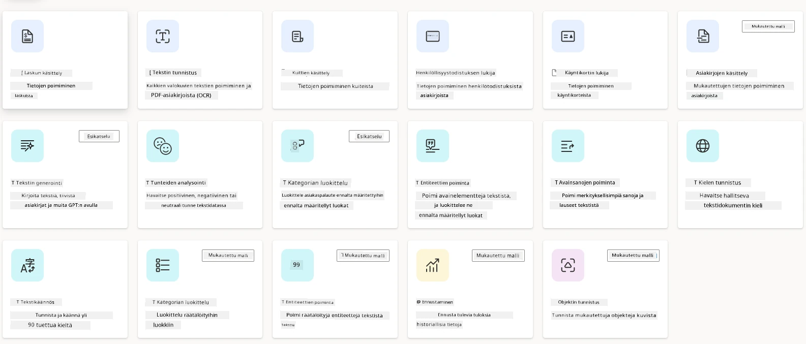

## Tehtävä #2 – Rakenna laskujen käsittelytyönkulku startupillemme

Taloustiimi on kamppaillut laskujen käsittelyssä. He ovat käyttäneet laskujen seuraamiseen taulukkolaskentaa, mutta se on käynyt vaikeaksi hallita laskujen määrän kasvaessa. He ovat pyytäneet sinua rakentamaan työnkulun, joka auttaa heitä käsittelemään laskuja tekoälyn avulla. Työnkulun tulisi mahdollistaa tietojen poimiminen laskuista ja tietojen tallentaminen Dataverse-taulukkoon. Työnkulun tulisi myös mahdollistaa sähköpostin lähettäminen taloustiimille poimituista tiedoista.

Nyt kun tiedät, mitä AI Builder on ja miksi sitä tulisi käyttää, katsotaan kuinka voit käyttää Laskujen käsittely -AI-mallia AI Builderissa rakentaaksesi työnkulun, joka auttaa taloustiimiä käsittelemään laskuja.

Rakentaaksesi työnkulun, joka auttaa taloustiimiä käsittelemään laskuja Laskujen käsittely -AI-mallilla AI Builderissa, toimi seuraavasti:

1. Siirry [Power Automate](https://make.powerautomate.com?WT.mc_id=academic-105485-koreyst) kotinäkymään.

2. Käytä kotinäkymän tekstialuetta kuvaamaan työnkulkua, jonka haluat rakentaa. Esimerkiksi: **_Käsittele lasku, kun se saapuu sähköpostilaatikkooni_**. Klikkaa **Lähetä** -painiketta lähettääksesi kehotteen AI Copilotille.

   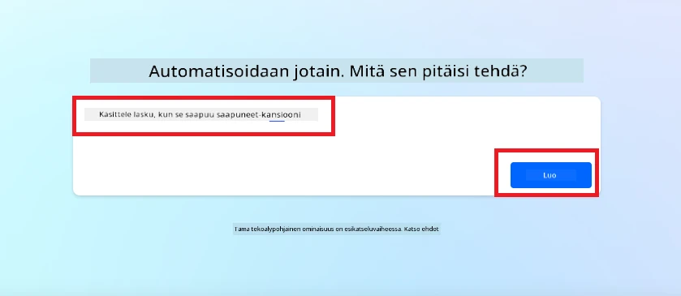

3. AI Copilot ehdottaa toimenpiteitä, jotka tarvitset haluamasi tehtävän automatisointiin. Voit klikata **Seuraava** -painiketta edetäksesi seuraaviin vaiheisiin.

4. Seuraavassa vaiheessa Power Automate pyytää sinua määrittämään työnkulun tarvitsemat yhteydet. Kun olet valmis, klikkaa **Luo työnkulku** -painiketta luodaksesi työnkulun.

5. AI Copilot luo työnkulun, jonka voit mukauttaa tarpeidesi mukaan.

6. Päivitä työnkulun laukeaja ja aseta **Kansio** kansioksi, johon laskut tulevat tallentaa. Esimerkiksi voit asettaa kansion **Saapuneet**. Klikkaa **Näytä lisäasetukset** ja aseta **Vain liitteellisille** arvoon **Kyllä**. Tämä varmistaa, että työnkulku käynnistyy vain silloin, kun kansioon tulee liitteellinen sähköposti.

7. Poista työnkulusta seuraavat toimenpiteet: **HTML tekstiksi**, **Muodosta**, **Muodosta 2**, **Muodosta 3** ja **Muodosta 4**, koska et tarvitse niitä.

8. Poista työnkulusta **Ehto**-toimenpide, koska et tarvitse sitä. Sen tulisi näyttää seuraavan kuvan mukaiselta:

   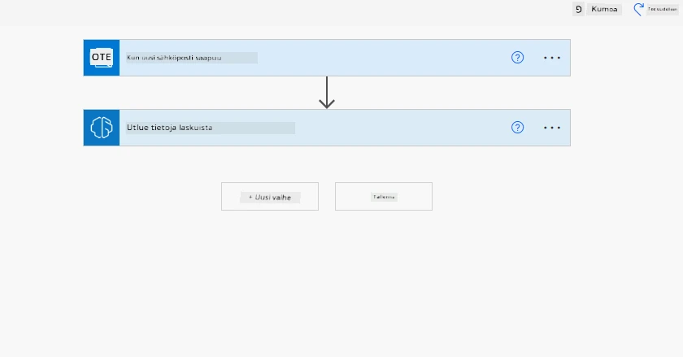

9. Klikkaa **Lisää toimenpide** -painiketta ja etsi **Dataverse**. Valitse toimenpiteeksi **Lisää uusi rivi**.

10. Toimenpiteessä **Poimi tiedot laskuista** päivitä **Laskun tiedosto** osoittamaan sähköpostin **Liitteen sisältö**-kenttään. Tämä varmistaa, että työnkulku poimii tiedot laskuliitteestä.

11. Valitse aiemmin luomasi **Taulukko**. Esimerkiksi voit valita **Laskutustiedot** -taulukon. Valitse edellisen toimenpiteen dynaaminen sisältö täyttämään seuraavat kentät:

    - ID
    - Määrä
    - Päivämäärä
    - Nimi
    - Tila - Aseta **Tila** arvoksi **Odottava**.
    - Toimittajan sähköposti - Käytä **Lähettäjä**-dynaamista sisältöä **Kun uusi sähköposti saapuu** -laukaisijasta.

    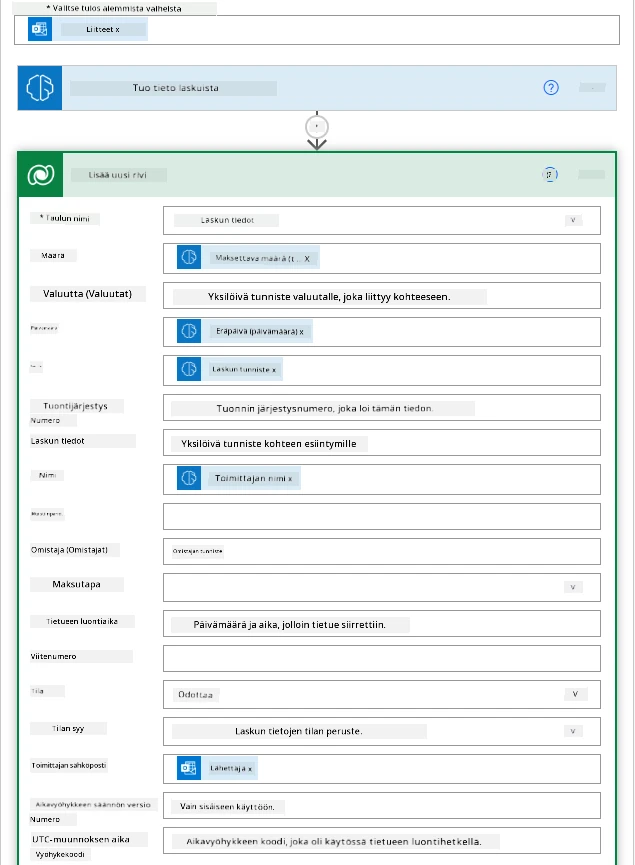

12. Kun olet valmis työnkulun kanssa, klikkaa **Tallenna** tallentaaksesi työnkulun. Voit testata työnkulun lähettämällä sähköpostin laskun kanssa valitsemaasi kansioon.

> **Kotitehtäväsi**: juuri rakentamasi työnkulku on hyvä alku, nyt sinun täytyy ajatella, kuinka voit rakentaa automaation, joka mahdollistaa taloustiimimme lähettää sähköposti toimittajalle ja päivittää heitä laskunsa nykytilanteesta. Vihjeesi: työnkulun tulee käynnistyä, kun laskun tila muuttuu.

## Käytä tekstinluontiin tarkoitettua AI-mallia Power Automatessa

Luo teksti GPT AI-malli AI Builderissa mahdollistaa tekstin generoinnin annetun kehotteen perusteella, ja se käyttää Microsoft Azure OpenAI -palvelua. Tämän ominaisuuden avulla voit sisällyttää GPT-teknologiaa (Generative Pre-Trained Transformer) sovelluksiisi ja työnkulkuihisi rakentaaksesi erilaisia automatisoituja työnkulkuja ja älykkäitä sovelluksia.

GPT-mallit käyvät läpi kattavan koulutuksen valtavilla tietomäärillä, jotka mahdollistavat hyvin inhimillisen kaltaisen tekstin tuottamisen annettuun kehotteeseen perustuen. Kun ne on yhdistetty työnkulkuautomaatioon, tekoälymallit kuten GPT voivat auttaa tehostamaan ja automatisoimaan laajaa valikoimaa tehtäviä.

Voit esimerkiksi rakentaa työnkulkuja, jotka luovat automaattisesti tekstiä eri käyttötarkoituksiin, kuten sähköpostiluonnokset, tuotekuvaukset ja muuta. Mallia voit myös käyttää tekstin luomiseen monenlaisissa sovelluksissa, kuten chatboteissa ja asiakaspalvelusovelluksissa, jotka auttavat asiakaspalvelijoita vastaamaan tehokkaasti ja sujuvasti asiakkaiden kyselyihin.

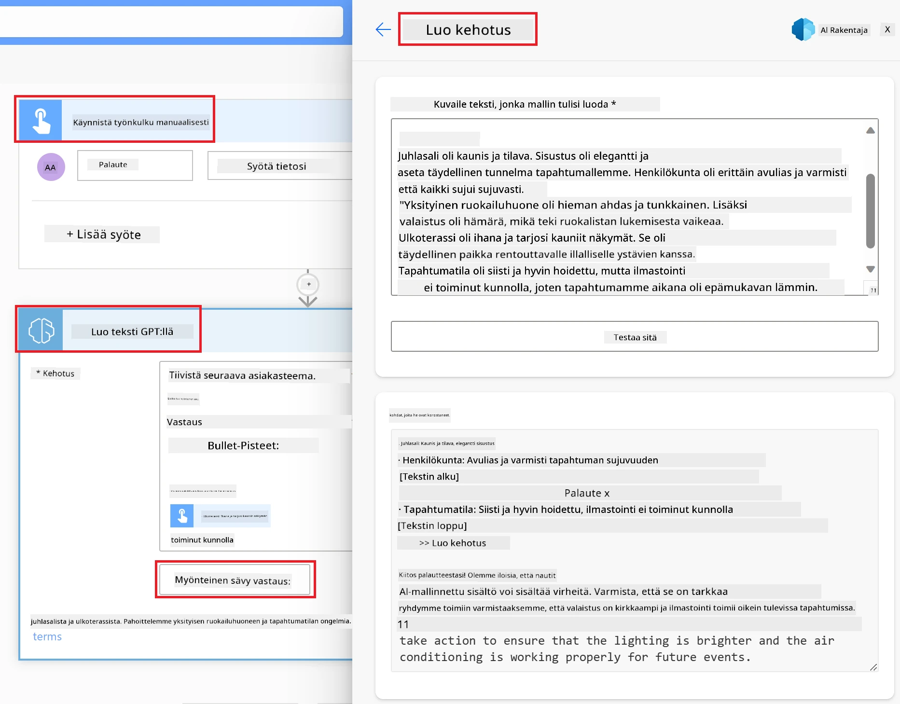

Jos haluat oppia, miten käyttää tätä tekoälymallia Power Automatessa, käy läpi [Lisää älykkyyttä AI Builderilla ja GPT:llä](https://learn.microsoft.com/training/modules/ai-builder-text-generation/?WT.mc_id=academic-109639-somelezediko) -moduuli.

## Hienoa työtä! Jatka oppimista

Tämän oppitunnin jälkeen tutustu [Generatiivisen tekoälyn oppimiskokoelmaamme](https://aka.ms/genai-collection?WT.mc_id=academic-105485-koreyst) jatkaaksesi generatiivisen tekoälyn osaamisesi kehittämistä!

Haluatko mukauttaa ja saada enemmän irti Copilotista? Tutustu [Awesome Copilot](https://github.com/github/awesome-copilot?WT.mc_id=academic-105485-koreyst) — yhteisön toimittamaan kokoelmaan ohjeita, agentteja, taitoja ja asetuksia, jotka auttavat sinua hyödyntämään GitHub Copilotin parhaalla mahdollisella tavalla.

Siirry Oppitunnille 11, jossa tarkastelemme, miten [integroida generatiivinen tekoäly funktion kutsumisen kanssa](../11-integrating-with-function-calling/README.md?WT.mc_id=academic-105485-koreyst)!

---

<!-- CO-OP TRANSLATOR DISCLAIMER START -->
**Vastuuvapauslauseke**:
Tämä asiakirja on käännetty käyttämällä tekoälypohjaista käännöspalvelua [Co-op Translator](https://github.com/Azure/co-op-translator). Vaikka pyrimme tarkkuuteen, otathan huomioon, että automaattiset käännökset saattavat sisältää virheitä tai epätarkkuuksia. Alkuperäinen asiakirja sen alkuperäiskielellä on virallinen lähde. Tärkeissä asioissa suositellaan ammattimaista ihmiskäännöstä. Emme ole vastuussa tämän käännöksen käytöstä aiheutuvista väärinymmärryksistä tai tulkinnoista.
<!-- CO-OP TRANSLATOR DISCLAIMER END -->