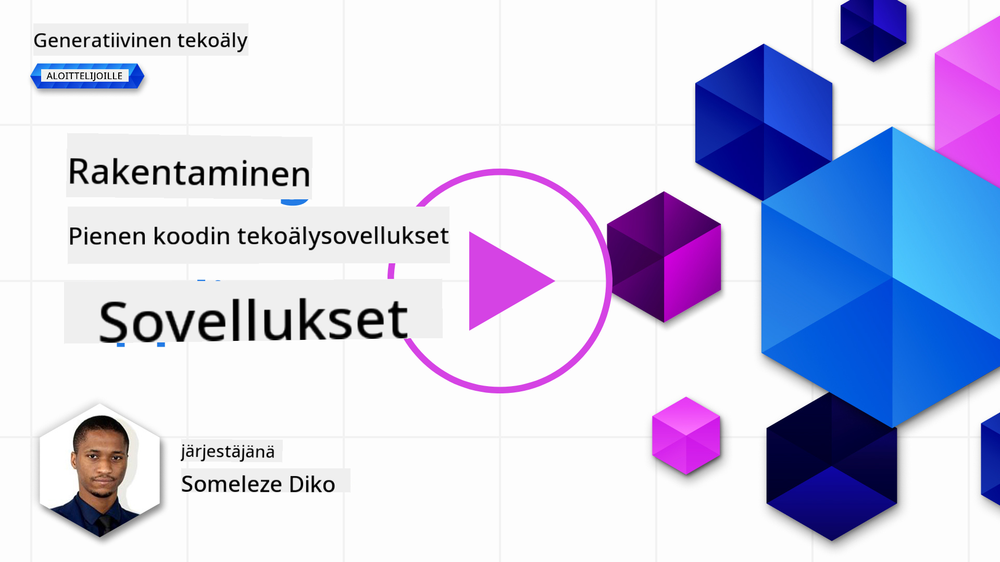
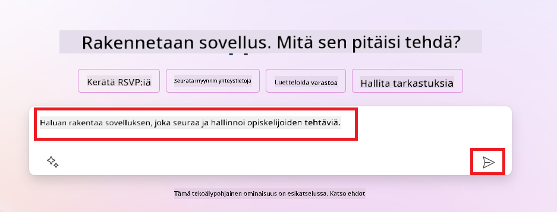
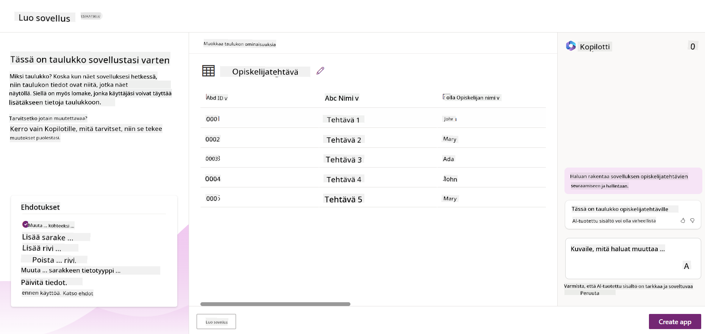
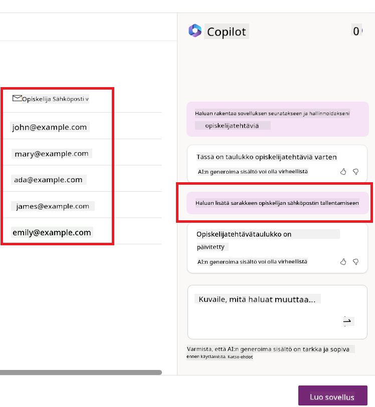
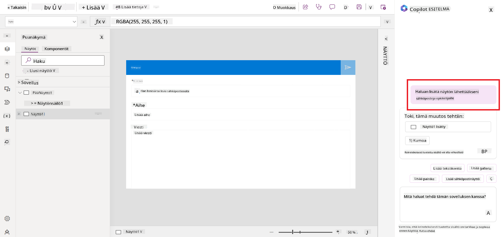
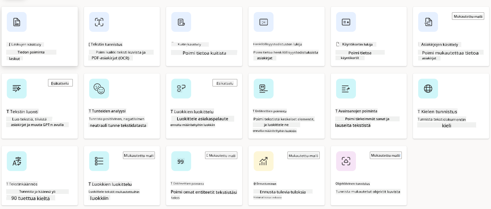
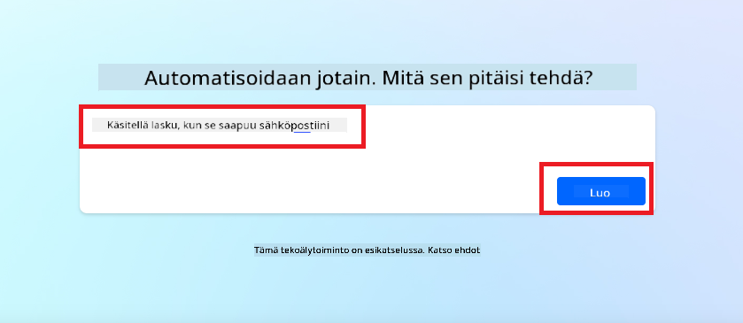
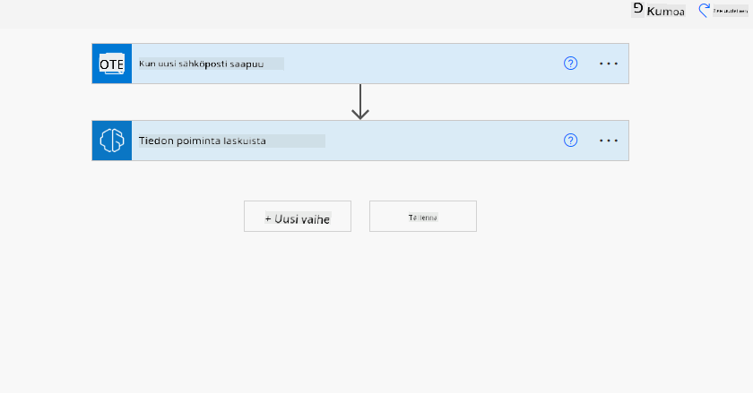
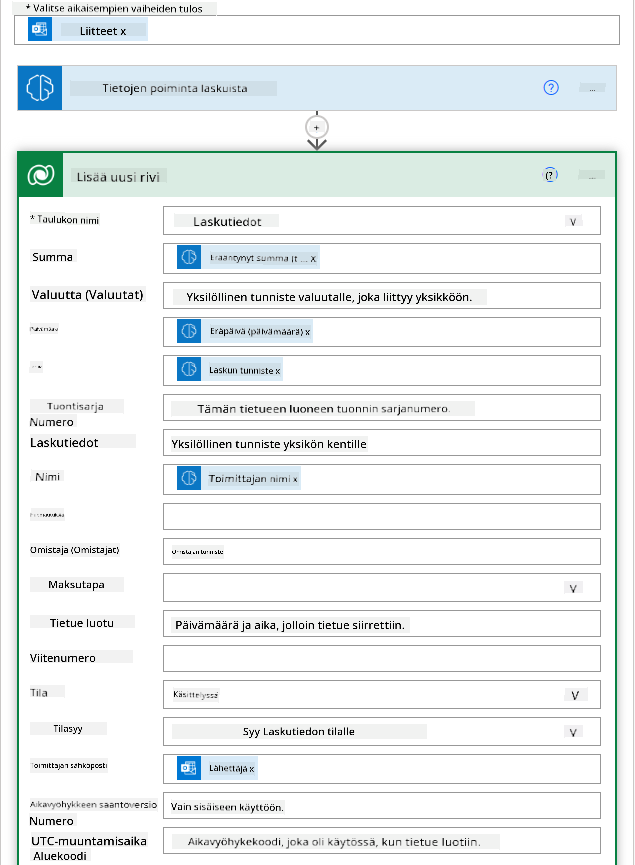
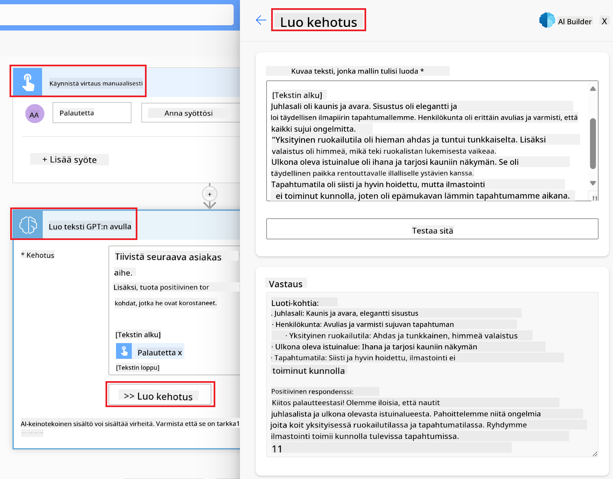

<!--
CO_OP_TRANSLATOR_METADATA:
{
  "original_hash": "f5ff3b6204a695a117d6f452403c95f7",
  "translation_date": "2025-06-25T18:56:41+00:00",
  "source_file": "10-building-low-code-ai-applications/README.md",
  "language_code": "fi"
}
-->
# Rakennetaan Low Code AI -sovelluksia

> _(Klikkaa yllä olevaa kuvaa nähdäksesi tämän oppitunnin videon)_

## Johdanto

Nyt kun olemme oppineet rakentamaan kuvagenerointisovelluksia, puhutaanpa low codesta. Generatiivista AI:ta voidaan käyttää monilla eri alueilla, mukaan lukien low code, mutta mitä on low code ja miten voimme lisätä siihen AI:n?

Sovellusten ja ratkaisujen rakentaminen on tullut helpommaksi perinteisille kehittäjille ja ei-kehittäjille Low Code Development Platformien avulla. Low Code Development Platformit mahdollistavat sovellusten ja ratkaisujen rakentamisen vähäisellä tai olemattomalla koodilla. Tämä saavutetaan tarjoamalla visuaalinen kehitysympäristö, joka mahdollistaa komponenttien raahaamisen ja pudottamisen sovellusten ja ratkaisujen rakentamiseksi. Tämä mahdollistaa sovellusten ja ratkaisujen rakentamisen nopeammin ja vähemmillä resursseilla. Tässä oppitunnissa sukellamme syvälle siihen, miten käyttää Low Codea ja miten parantaa low code -kehitystä AI:n avulla Power Platformissa.

Power Platform tarjoaa organisaatioille mahdollisuuden antaa tiimeilleen voimaa rakentaa omia ratkaisujaan intuitiivisessa low-code- tai no-code-ympäristössä. Tämä ympäristö auttaa yksinkertaistamaan ratkaisujen rakentamisprosessia. Power Platformin avulla ratkaisuja voidaan rakentaa päivissä tai viikoissa kuukausien tai vuosien sijaan. Power Platform koostuu viidestä keskeisestä tuotteesta: Power Apps, Power Automate, Power BI, Power Pages ja Copilot Studio.

Tässä oppitunnissa käsitellään:

- Generatiivisen AI:n esittely Power Platformissa
- Copilotin esittely ja sen käyttö
- Generatiivisen AI:n käyttö sovellusten ja virtausten rakentamisessa Power Platformissa
- AI-mallien ymmärtäminen Power Platformissa AI Builderin avulla

## Oppimistavoitteet

Tämän oppitunnin lopussa osaat:

- Ymmärtää, miten Copilot toimii Power Platformissa.

- Rakentaa Opiskelijan Tehtävien Seuranta -sovelluksen koulutusstartupillemme.

- Rakentaa Laskujen Käsittelyvirtaus, joka käyttää AI:ta tietojen poimimiseen laskuista.

- Soveltaa parhaita käytäntöjä Create Text with GPT AI Model -mallin käytössä.

Tässä oppitunnissa käytettävät työkalut ja teknologiat ovat:

- **Power Apps**, Opiskelijan Tehtävien Seuranta -sovellukselle, joka tarjoaa low-code-kehitysympäristön sovellusten rakentamiseen, joiden avulla voidaan seurata, hallita ja olla vuorovaikutuksessa tietojen kanssa.

- **Dataverse**, Opiskelijan Tehtävien Seuranta -sovelluksen tietojen tallentamiseen, jossa Dataverse tarjoaa low-code-tietokannan sovelluksen tietojen tallentamiseen.

- **Power Automate**, Laskujen Käsittelyvirtausta varten, jossa on low-code-kehitysympäristö työnkulkujen rakentamiseen laskujen käsittelyn automatisoimiseksi.

- **AI Builder**, Laskujen Käsittely AI Model -mallia varten, jossa käytät valmiiksi rakennettuja AI-malleja laskujen käsittelyyn startupillemme.

## Generatiivinen AI Power Platformissa

Low-code-kehityksen ja sovellusten parantaminen generatiivisella AI:lla on keskeinen painopiste Power Platformissa. Tavoitteena on mahdollistaa kaikille AI-tehostettujen sovellusten, sivustojen, kojelautojen rakentaminen ja prosessien automatisointi AI:lla, _ilman että tarvitaan data science -osaamista_. Tämä tavoite saavutetaan integroimalla generatiivinen AI low-code-kehityskokemukseen Power Platformissa Copilotin ja AI Builderin muodossa.

### Miten tämä toimii?

Copilot on AI-assistentti, joka mahdollistaa Power Platform -ratkaisujen rakentamisen kuvailemalla vaatimuksesi sarjassa keskustelunomaisia vaiheita luonnollisella kielellä. Voit esimerkiksi ohjeistaa AI-assistenttia määrittelemään, mitä kenttiä sovelluksesi käyttää, ja se luo sekä sovelluksen että taustalla olevan tietomallin, tai voit määrittää, miten virtaus asetetaan Power Automateen.

Voit käyttää Copilot-ohjattuja toimintoja ominaisuutena sovelluksesi näytöillä, jotta käyttäjät voivat paljastaa oivalluksia keskustelunomaisen vuorovaikutuksen kautta.

AI Builder on low-code AI-ominaisuus, joka on saatavilla Power Platformissa ja joka mahdollistaa AI-mallien käytön prosessien automatisoimiseen ja tulosten ennustamiseen. AI Builderin avulla voit tuoda AI:n sovelluksiisi ja virtausiin, jotka yhdistyvät tietoihisi Dataversessa tai eri pilvitietolähteissä, kuten SharePointissa, OneDrivessa tai Azuren kanssa.

Copilot on saatavilla kaikissa Power Platform -tuotteissa: Power Apps, Power Automate, Power BI, Power Pages ja Power Virtual Agents. AI Builder on saatavilla Power Appsissa ja Power Automatessa. Tässä oppitunnissa keskitymme siihen, miten käyttää Copilotia ja AI Builderia Power Appsissa ja Power Automatessa rakentaaksemme ratkaisun koulutusstartupillemme.

### Copilot Power Appsissa

Osana Power Platformia Power Apps tarjoaa low-code-kehitysympäristön sovellusten rakentamiseen, joiden avulla voidaan seurata, hallita ja olla vuorovaikutuksessa tietojen kanssa. Se on sovelluskehityspalveluiden kokonaisuus, jossa on skaalautuva tietokanta ja kyky yhdistyä pilvipalveluihin ja paikallisiin tietoihin. Power Apps mahdollistaa sovellusten rakentamisen, jotka toimivat selaimissa, tableteissa ja puhelimissa, ja joita voidaan jakaa työtovereiden kanssa. Power Apps helpottaa käyttäjiä sovelluskehitykseen yksinkertaisella käyttöliittymällä, jotta jokainen liiketoimintakäyttäjä tai ammattilaiskehittäjä voi rakentaa räätälöityjä sovelluksia. Sovelluskehityskokemus paranee myös Generatiivisella AI:lla Copilotin kautta.

Copilot AI -assistenttiominaisuus Power Appsissa mahdollistaa kuvailemaan, millaista sovellusta tarvitset ja mitä tietoja haluat sovelluksesi seuraavan, keräävän tai näyttävän. Copilot sitten luo responsiivisen Canvas-sovelluksen kuvauksesi perusteella. Voit sitten muokata sovellusta vastaamaan tarpeitasi. AI Copilot myös luo ja ehdottaa Dataverse-taulukkoa kenttien kanssa, joita tarvitset tallentaaksesi haluamasi seurattavat tiedot ja joitain esimerkkitietoja. Katsomme myöhemmin tässä oppitunnissa, mitä Dataverse on ja miten voit käyttää sitä Power Appsissa. Voit sitten muokata taulukkoa vastaamaan tarpeitasi AI Copilot -assistenttiominaisuuden kautta keskustelunomaisilla askelilla. Tämä ominaisuus on helposti saatavilla Power Appsin aloitusnäytöltä.

### Copilot Power Automatessa

Osana Power Platformia Power Automate antaa käyttäjille mahdollisuuden luoda automatisoituja työnkulkuja sovellusten ja palveluiden välillä. Se auttaa automatisoimaan toistuvia liiketoimintaprosesseja, kuten viestintää, tiedonkeruuta ja päätösten hyväksyntää. Sen yksinkertainen käyttöliittymä mahdollistaa käyttäjille kaikilla teknisillä osaamisilla (aloittelijoista kokeneisiin kehittäjiin) työtehtävien automatisoinnin. Työnkulun kehityskokemus paranee myös Generatiivisella AI:lla Copilotin kautta.

Copilot AI -assistenttiominaisuus Power Automatessa mahdollistaa kuvailemaan, millaista virtausta tarvitset ja mitä toimintoja haluat virtaasi suorittavan. Copilot sitten luo virtauksen kuvauksesi perusteella. Voit sitten muokata virtausta vastaamaan tarpeitasi. AI Copilot myös luo ja ehdottaa toimintoja, joita tarvitset tehtävän automatisoimiseksi. Katsomme myöhemmin tässä oppitunnissa, mitä virtaukset ovat ja miten voit käyttää niitä Power Automatessa. Voit sitten muokata toimintoja vastaamaan tarpeitasi AI Copilot -assistenttiominaisuuden kautta keskustelunomaisilla askelilla. Tämä ominaisuus on helposti saatavilla Power Automaten aloitusnäytöltä.

## Tehtävä: Hallitse opiskelijoiden tehtäviä ja laskuja startupillemme Copilotin avulla

Startupimme tarjoaa verkkokursseja opiskelijoille. Startup on kasvanut nopeasti ja kamppailee nyt kurssien kysynnän kanssa. Startup on palkannut sinut Power Platform -kehittäjäksi auttamaan heitä rakentamaan low code -ratkaisun, joka auttaa heitä hallitsemaan opiskelijoiden tehtäviä ja laskuja. Ratkaisun tulisi auttaa heitä seuraamaan ja hallitsemaan opiskelijoiden tehtäviä sovelluksen kautta ja automatisoimaan laskujen käsittelyprosessin työnkulun kautta. Sinua on pyydetty käyttämään Generatiivista AI:ta ratkaisun kehittämiseen.

Kun aloitat Copilotin käytön, voit käyttää [Power Platform Copilot Prompt Library](https://github.com/pnp/powerplatform-prompts?WT.mc_id=academic-109639-somelezediko) -kirjastoa aloittaaksesi kehotteiden kanssa. Tämä kirjasto sisältää luettelon kehotteista, joita voit käyttää sovellusten ja virtausten rakentamiseen Copilotilla. Voit myös käyttää kirjaston kehotteita saadaksesi käsityksen siitä, miten kuvailla vaatimuksesi Copilotille.

### Rakenna Opiskelijan Tehtävien Seuranta -sovellus startupillemme

Startupimme opettajat ovat kamppailleet opiskelijoiden tehtävien seuraamisen kanssa. He ovat käyttäneet laskentataulukkoa tehtävien seuraamiseen, mutta tämä on tullut vaikeaksi hallita opiskelijoiden määrän kasvaessa. He ovat pyytäneet sinua rakentamaan sovelluksen, joka auttaa heitä seuraamaan ja hallitsemaan opiskelijoiden tehtäviä. Sovelluksen tulisi mahdollistaa uusien tehtävien lisääminen, tehtävien katselu, tehtävien päivittäminen ja tehtävien poistaminen. Sovelluksen tulisi myös mahdollistaa opettajien ja opiskelijoiden nähdä tehtävät, jotka on arvioitu ja jotka eivät ole arvioitu.

Rakennat sovelluksen Copilotilla Power Appsissa seuraavien vaiheiden mukaisesti:

1. Siirry [Power Apps](https://make.powerapps.com?WT.mc_id=academic-105485-koreyst) -aloitusnäyttöön.

1. Käytä aloitusnäytön tekstialuetta kuvaamaan sovellusta, jonka haluat rakentaa. Esimerkiksi, **_Haluan rakentaa sovelluksen opiskelijoiden tehtävien seuraamiseen ja hallintaan_**. Klikkaa **Lähetä**-painiketta lähettääksesi kehotteen AI Copilotille.

1. AI Copilot ehdottaa Dataverse-taulukkoa kenttien kanssa, joita tarvitset tallentaaksesi haluamasi seurattavat tiedot ja joitain esimerkkitietoja. Voit sitten muokata taulukkoa vastaamaan tarpeitasi AI Copilot -assistenttiominaisuuden kautta keskustelunomaisilla askelilla.

   > **Tärkeää**: Dataverse on Power Platformin taustalla oleva tietokanta. Se on low-code-tietokanta sovelluksen tietojen tallentamiseen. Se on täysin hallinnoitu palvelu, joka tallentaa tietoja turvallisesti Microsoftin pilvessä ja provisioidaan Power Platform -ympäristössäsi. Siinä on sisäänrakennetut tietojen hallintakyvyt, kuten tietojen luokittelu, tietojen alkuperä, hienorakeinen pääsynhallinta ja paljon muuta. Voit oppia lisää Dataversestä [täällä](https://docs.microsoft.com/powerapps/maker/data-platform/data-platform-intro?WT.mc_id=academic-109639-somelezediko).

   

1. Opettajat haluavat lähettää sähköposteja opiskelijoille, jotka ovat palauttaneet tehtävänsä, pitääkseen heidät ajan tasalla tehtäviensä edistymisestä. Voit käyttää Copilotia lisätäksesi uuden kentän taulukkoon opiskelijan sähköpostin tallentamiseksi. Esimerkiksi, voit käyttää seuraavaa kehotetta lisätäksesi uuden kentän taulukkoon: **_Haluan lisätä sarakkeen opiskelijan sähköpostin tallentamiseksi_**. Klikkaa **Lähetä**-painiketta lähettääksesi kehotteen AI Copilotille.

1. AI Copilot luo uuden kentän ja voit sitten muokata kenttää vastaamaan tarpeitasi.

1. Kun olet valmis taulukon kanssa, klikkaa **Luo sovellus** -painiketta luodaksesi sovelluksen.

1. AI Copilot luo responsiivisen Canvas-sovelluksen kuvauksesi perusteella. Voit sitten muokata sovellusta vastaamaan tarpeitasi.

1. Opettajien lähettääkseen sähköposteja opiskelijoille, voit käyttää Copilotia lisätäksesi uuden näytön sovellukseen. Esimerkiksi, voit käyttää seuraavaa kehotetta lisätäksesi uuden näytön sovellukseen: **_Haluan lisätä näytön lähettääkseni sähköposteja opiskelijoille_**. Klikkaa **Lähetä**-painiketta lähettääksesi kehotteen AI Copilotille.

1. AI Copilot luo uuden näytön ja voit sitten muokata näyttöä vastaamaan tarpeitasi.

1. Kun olet valmis sovelluksen kanssa, klikkaa **Tallenna**-painiketta tallentaaksesi sovelluksen.

1. Jotta voit jakaa sovelluksen opettajille, klikkaa **Jaa**-painiketta ja sitten klikkaa **Jaa**-painiketta uudelleen. Voit sitten jakaa sovelluksen opettajille syöttämällä heidän sähköpostiosoitteensa.

> **Kotitehtäväsi**: Rakentamasi sovellus on hyvä alku, mutta sitä voidaan parantaa. Sähköpostiominaisuudella opettajat voivat lähettää sähköposteja opiskelijoille vain manuaalisesti kirjoittamalla heidän sähköpostinsa. Voitko käyttää Copilotia rakentaaksesi automaation, joka mahdollistaa opettajien lähettämään sähköposteja opiskelijoille automaattisesti, kun he palauttavat tehtävänsä? Vihjeesi on oikealla kehotteella voit käyttää Copilotia Power Automatessa tämän rakentamiseen.

### Rakenna Laskujen Tietotaulukko startupillemme

Startupimme taloustiimi on kamppaillut laskujen seuraamisen kanssa. He ovat käyttäneet laskentataulukkoa laskujen seuraamiseen, mutta tämä on tullut vaikeaksi hallita laskujen määrän kasvaessa. He ovat pyytäneet sinua rakentamaan taulukon, joka auttaa heitä tallentamaan, seuraamaan ja hallitsemaan saamansa laskujen tietoja. Taulukkoa tulisi käyttää automaation rakentamiseen, joka poimii kaikki laskutiedot ja tallentaa ne taulukkoon. Taulukon tulisi myös mahdollistaa taloustiimin katsella laskuja, jotka on maksettu ja jotka eivät ole maksettu.

Power Platformissa on taustalla oleva tietokanta nimeltä Dataverse, joka mahdollistaa tietojen tallentamisen sovelluksillesi ja ratkaisuille. Dataverse tarjoaa low-code-tietokannan sovelluksen tietojen tallentamiseen. Se on täysin hallinnoitu palvelu, joka tallentaa tietoja turvallisesti Microsoftin pilvessä ja provisioidaan Power Platform -ympäristössäsi. Siinä on sisäänrakennetut tietojen hallintakyvyt, kuten tietojen luokittelu, tietojen alkuperä, hienorakeinen pääsynhallinta ja paljon muuta. Voit oppia lisää [Dataversestä täällä](https://docs.microsoft.com/powerapps/maker/data-platform/data-platform-intro?WT.mc_id=academic-109639-somelezediko).

Miksi meidän pitäisi käyttää Dataverseä startupillemme? Dataversen vakio- ja mukautetut taulukot tarjoavat turvallisen ja pilvipohjaisen tallennusvaihtoehdon tiedoillesi. Taulukot mahdollistavat erilaisten tietojen tallentamisen, samanlailla kuin voisit käyttää useita laskentataulukoita yhdessä Excel-työkirjassa. Voit käyttää taulukoita tallentamaan tietoja, jotka ovat erityisiä organisaatiollesi tai liiketoimintatarpeillesi. Joitakin etuja, joita startupimme saa Dataversen käytöstä, ovat muun muassa:

- **Helppo hallita**: Sekä metatiedot että tiedot tallennetaan pilveen, joten sinun ei tarvitse huolehtia siitä, miten ne tallennetaan tai hallitaan. Voit keskittyä sovellusten ja ratkaisujen rakentamiseen.

- **Turvallinen**: Dataverse tarjoaa turvallisen ja
teksti. - **Tunneanalyysi**: Tämä malli tunnistaa positiivisen, negatiivisen, neutraalin tai sekavan tunteen tekstistä. - **Käyntikortin lukija**: Tämä malli poimii tietoja käyntikorteista. - **Tekstin tunnistus**: Tämä malli poimii tekstiä kuvista. - **Objektin tunnistus**: Tämä malli tunnistaa ja poimii kohteita kuvista. - **Asiakirjojen käsittely**: Tämä malli poimii tietoja lomakkeista. - **Laskujen käsittely**: Tämä malli poimii tietoja laskuista. Custom AI -malleilla voit tuoda oman mallisi AI Builderiin, jotta se voi toimia kuten mikä tahansa AI Builderin mukautettu malli, jolloin voit kouluttaa mallin omilla tiedoillasi. Voit käyttää näitä malleja automatisoimaan prosesseja ja ennustamaan tuloksia sekä Power Appsissa että Power Automatessa. Oman mallin käytössä on kuitenkin rajoituksia. Lue lisää näistä [rajoituksista](https://learn.microsoft.com/ai-builder/byo-model#limitations?WT.mc_id=academic-105485-koreyst). 

## Tehtävä #2 - Rakenna laskujen käsittelyprosessi startupillemme

Talousosastolla on ollut vaikeuksia käsitellä laskuja. He ovat käyttäneet laskujen seurantaan taulukkoa, mutta laskujen määrän kasvaessa hallinta on vaikeutunut. He ovat pyytäneet sinua rakentamaan työnkulun, joka auttaa heitä käsittelemään laskuja AI:n avulla. Työnkulun tulisi mahdollistaa laskujen tietojen poimiminen ja tietojen tallentaminen Dataverse-taulukkoon. Työnkulun tulisi myös mahdollistaa sähköpostin lähettäminen talousosastolle poimituilla tiedoilla.

Nyt kun tiedät, mitä AI Builder on ja miksi sinun pitäisi käyttää sitä, katsotaan, kuinka voit käyttää laskujen käsittelyn AI-mallia AI Builderissa, jota käsittelimme aiemmin, rakentaaksesi työnkulun, joka auttaa talousosastoa käsittelemään laskuja.

Rakentaaksesi työnkulun, joka auttaa talousosastoa käsittelemään laskuja AI Builderin laskujen käsittelyn AI-mallin avulla, noudata seuraavia ohjeita:

1. Siirry [Power Automate](https://make.powerautomate.com?WT.mc_id=academic-105485-koreyst) aloitusnäyttöön.
2. Käytä aloitusnäytön tekstialuetta kuvaamaan työnkulku, jonka haluat rakentaa. Esimerkiksi **_Käsittele lasku, kun se saapuu postilaatikkooni_**. Klikkaa **Lähetä**-painiketta lähettääksesi kehotteen AI Copilotille. 
3. AI Copilot ehdottaa toimintoja, joita tarvitset tehtävän automatisoimiseksi. Voit klikata **Seuraava**-painiketta siirtyäksesi seuraaviin vaiheisiin.
4. Seuraavassa vaiheessa Power Automate kehottaa sinua määrittämään työnkulun vaatimien yhteyksien asetukset. Kun olet valmis, klikkaa **Luo työnkulku**-painiketta luodaksesi työnkulun.
5. AI Copilot luo työnkulun, ja voit sitten mukauttaa työnkulun tarpeisiisi.
6. Päivitä työnkulun käynnistin ja aseta **Kansio** kansioksi, johon laskut tallennetaan. Esimerkiksi voit asettaa kansion **Saapuneet**. Klikkaa **Näytä lisäasetukset** ja aseta **Vain liitteillä** **Kyllä**. Tämä varmistaa, että työnkulku käynnistyy vain, kun kansioon saapuu sähköposti liitteellä.
7. Poista työnkulusta seuraavat toiminnot: **HTML tekstiksi**, **Compose**, **Compose 2**, **Compose 3** ja **Compose 4**, koska et käytä niitä.
8. Poista työnkulusta **Ehto**-toiminto, koska et käytä sitä. Sen tulisi näyttää seuraavalta kuvakaappaukselta: 
9. Klikkaa **Lisää toiminto**-painiketta ja etsi **Dataverse**. Valitse **Lisää uusi rivi**-toiminto.
10. **Poimi tietoja laskuista**-toiminnossa päivitä **Laskutiedosto** osoittamaan sähköpostin **Liitteen sisältöön**. Tämä varmistaa, että työnkulku poimii tiedot laskuliitteestä.
11. Valitse aiemmin luomasi **Taulukko**. Esimerkiksi voit valita **Laskutiedot**-taulukon. Valitse edellisen toiminnon dynaaminen sisältö seuraavien kenttien täyttämiseksi: 
    - ID
    - Summa
    - Päivämäärä
    - Nimi
    - Tila
    - Aseta **Tila** **Odottaa**.
    - Toimittajan sähköposti
    - Käytä **Lähettäjä**-dynaamista sisältöä **Kun uusi sähköposti saapuu**-käynnistimestä. 
12. Kun olet valmis työnkulun kanssa, klikkaa **Tallenna**-painiketta tallentaaksesi työnkulun. Voit sitten testata työnkulun lähettämällä sähköpostin laskun kanssa kansioon, jonka määritit käynnistimessä.

> **Kotitehtäväsi**: Työnkulku, jonka juuri rakensit, on hyvä alku, nyt sinun täytyy miettiä, kuinka voit rakentaa automaation, joka mahdollistaa talousosastomme lähettämään sähköpostin toimittajalle päivittääkseen heidät laskunsa nykyisestä tilasta. Vihjeesi: työnkulku täytyy käynnistyä, kun laskun tila muuttuu.

## Käytä tekstin generointia AI-mallissa Power Automatessa

Luo teksti GPT AI-mallilla AI Builderissa, mikä mahdollistaa tekstin generoinnin kehotteen perusteella ja hyödyntää Microsoft Azure OpenAI -palvelua. Tämän ominaisuuden avulla voit sisällyttää GPT (Generative Pre-Trained Transformer) -teknologian sovelluksiisi ja työnkulkuihisi rakentaaksesi erilaisia automatisoituja työnkulkuja ja oivaltavia sovelluksia.

GPT-mallit käyvät läpi laajan koulutuksen valtavilla tietomäärillä, mikä mahdollistaa niiden tuottavan tekstiä, joka muistuttaa läheisesti ihmiskieltä, kun niille annetaan kehotus. Kun ne integroidaan työnkulkuautomaatioon, AI-malleja kuten GPT:tä voidaan hyödyntää monenlaisten tehtävien virtaviivaistamiseen ja automatisointiin.

Esimerkiksi voit rakentaa työnkulkuja, jotka automaattisesti generoivat tekstiä erilaisiin käyttötapauksiin, kuten sähköpostiluonnoksiin, tuotekuvauksiin ja muihin. Voit myös käyttää mallia generoimaan tekstiä erilaisiin sovelluksiin, kuten chatbotteihin ja asiakaspalvelusovelluksiin, jotka mahdollistavat asiakaspalveluagenttien vastaamaan tehokkaasti ja sujuvasti asiakaskyselyihin.

Oppiaksesi käyttämään tätä AI-mallia Power Automatessa, käy läpi [Lisää älykkyyttä AI Builderilla ja GPT:llä](https://learn.microsoft.com/training/modules/ai-builder-text-generation/?WT.mc_id=academic-109639-somelezediko) -moduuli.

## Hienoa työtä! Jatka oppimistasi

Kun olet suorittanut tämän oppitunnin, tutustu [Generatiivisen AI:n oppimiskokoelmaamme](https://aka.ms/genai-collection?WT.mc_id=academic-105485-koreyst) jatkaaksesi generatiivisen AI:n tietämyksesi kehittämistä!

Siirry oppituntiin 11, jossa tarkastelemme, kuinka [integroida Generatiivinen AI funktiokutsujen kanssa](../11-integrating-with-function-calling/README.md?WT.mc_id=academic-105485-koreyst)!

**Vastuuvapauslauseke**:  
Tämä asiakirja on käännetty käyttämällä AI-käännöspalvelua [Co-op Translator](https://github.com/Azure/co-op-translator). Vaikka pyrimme tarkkuuteen, huomaa, että automaattiset käännökset voivat sisältää virheitä tai epätarkkuuksia. Alkuperäistä asiakirjaa sen alkuperäisellä kielellä tulisi pitää auktoritatiivisena lähteenä. Kriittisen tiedon osalta suositellaan ammattimaista ihmiskäännöstä. Emme ole vastuussa väärinkäsityksistä tai virhetulkinnoista, jotka johtuvat tämän käännöksen käytöstä.