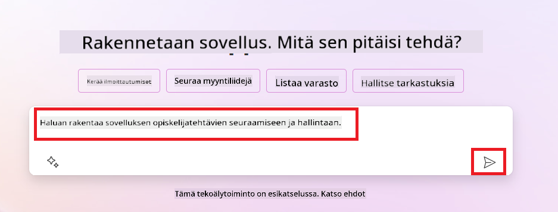
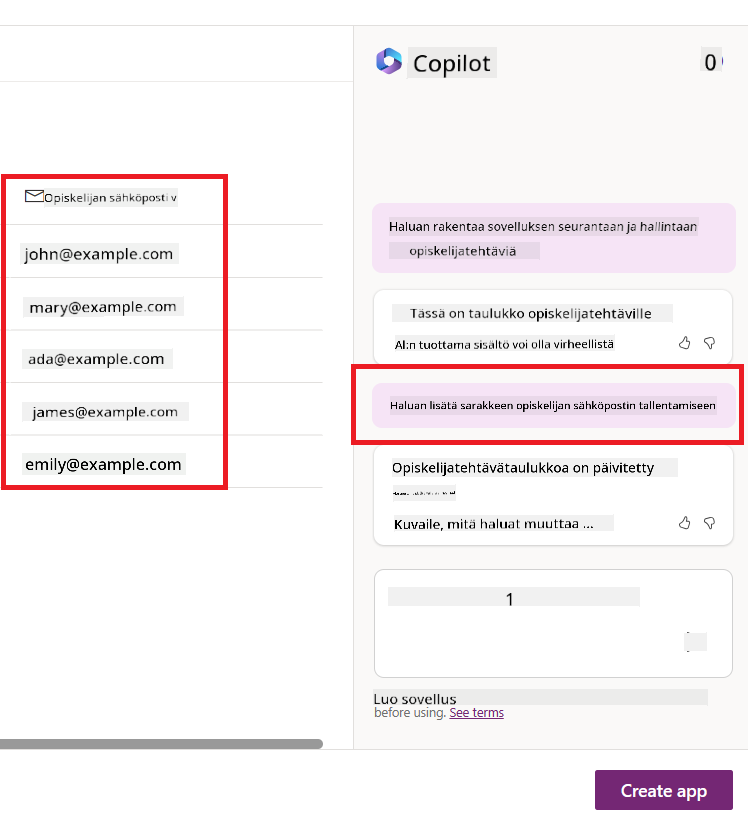
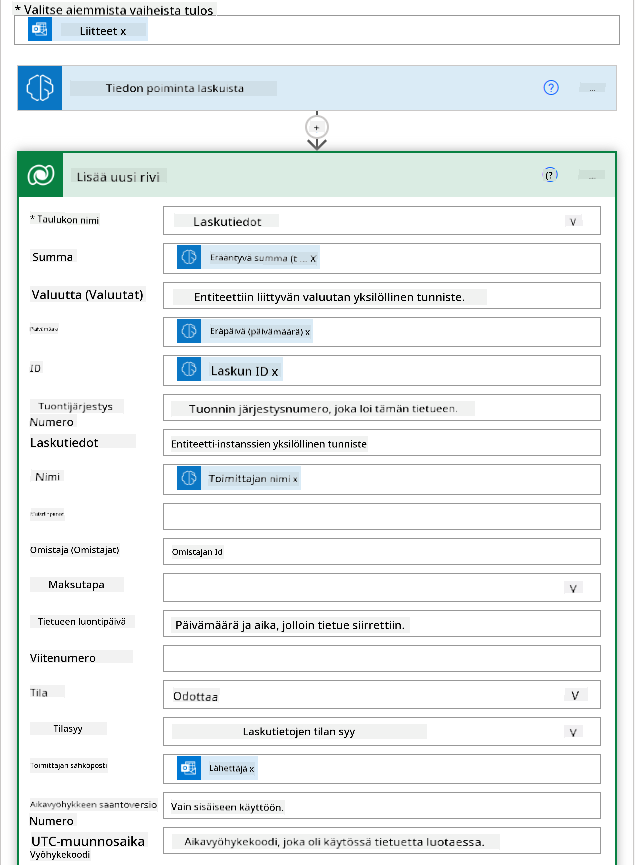
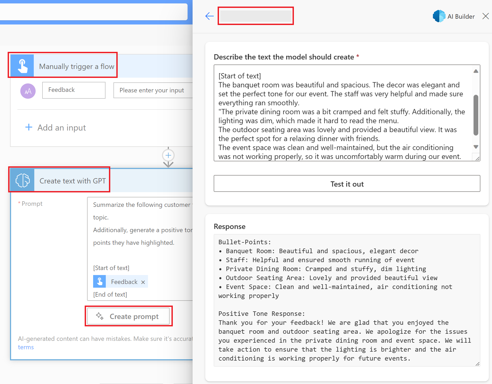

<!--
CO_OP_TRANSLATOR_METADATA:
{
  "original_hash": "846ac8e3b7dcfb697d3309fec05f0fea",
  "translation_date": "2025-10-17T19:43:29+00:00",
  "source_file": "10-building-low-code-ai-applications/README.md",
  "language_code": "fi"
}
-->
# Rakentaminen vähäkoodisia tekoälysovelluksia

> _(Klikkaa yllä olevaa kuvaa nähdäksesi tämän oppitunnin videon)_

## Johdanto

Nyt kun olemme oppineet rakentamaan kuvien luomiseen tarkoitettuja sovelluksia, puhutaan vähäkoodisuudesta. Generatiivista tekoälyä voidaan käyttää monilla eri alueilla, mukaan lukien vähäkoodisuus, mutta mitä vähäkoodisuus tarkoittaa ja miten voimme lisätä tekoälyä siihen?

Sovellusten ja ratkaisujen rakentaminen on tullut helpommaksi perinteisille kehittäjille ja ei-kehittäjille vähäkoodisten kehitysalustojen avulla. Vähäkoodiset kehitysalustat mahdollistavat sovellusten ja ratkaisujen rakentamisen vähäisellä tai olemattomalla koodauksella. Tämä saavutetaan tarjoamalla visuaalinen kehitysympäristö, jossa komponentteja voi vetää ja pudottaa sovellusten ja ratkaisujen rakentamiseksi. Tämä mahdollistaa sovellusten ja ratkaisujen nopeamman rakentamisen ja vähemmillä resursseilla. Tässä oppitunnissa syvennymme siihen, miten vähäkoodisuutta käytetään ja miten tekoälyä voidaan hyödyntää vähäkoodisessa kehityksessä Power Platformin avulla.

Power Platform tarjoaa organisaatioille mahdollisuuden antaa tiimeilleen valtuudet rakentaa omia ratkaisujaan intuitiivisessa vähäkoodisessa tai koodittomassa ympäristössä. Tämä ympäristö yksinkertaistaa ratkaisujen rakentamisen prosessia. Power Platformin avulla ratkaisuja voidaan rakentaa päivissä tai viikoissa kuukausien tai vuosien sijaan. Power Platform koostuu viidestä keskeisestä tuotteesta: Power Apps, Power Automate, Power BI, Power Pages ja Copilot Studio.

Tämä oppitunti kattaa:

- Johdannon generatiiviseen tekoälyyn Power Platformissa
- Johdannon Copilotiin ja sen käyttöön
- Generatiivisen tekoälyn käyttö sovellusten ja työnkulkujen rakentamiseen Power Platformissa
- Tekoälymallien ymmärtäminen Power Platformissa AI Builderin avulla

## Oppimistavoitteet

Oppitunnin lopussa osaat:

- Ymmärtää, miten Copilot toimii Power Platformissa.

- Rakentaa opiskelijatehtävien seurantaan tarkoitetun sovelluksen koulutusstartupillemme.

- Rakentaa laskujen käsittelytyönkulun, joka käyttää tekoälyä tietojen poimimiseen laskuista.

- Soveltaa parhaita käytäntöjä GPT-tekoälymallin tekstin luomiseen.

Oppitunnissa käytettävät työkalut ja teknologiat ovat:

- **Power Apps**, opiskelijatehtävien seurantaan tarkoitettu sovellus, joka tarjoaa vähäkoodisen kehitysympäristön sovellusten rakentamiseen tietojen seuraamiseksi, hallitsemiseksi ja käsittelemiseksi.

- **Dataverse**, opiskelijatehtävien seurantaan tarkoitetun sovelluksen tietojen tallentamiseen. Dataverse tarjoaa vähäkoodisen tietojen tallennusalustan.

- **Power Automate**, laskujen käsittelytyönkulkuun, jossa on vähäkoodinen kehitysympäristö työnkulkujen rakentamiseen laskujen käsittelyprosessin automatisoimiseksi.

- **AI Builder**, laskujen käsittelyyn tarkoitettuun tekoälymalliin, jossa käytetään valmiita tekoälymalleja startupimme laskujen käsittelyyn.

## Generatiivinen tekoäly Power Platformissa

Vähäkoodisen kehityksen ja sovellusten parantaminen generatiivisella tekoälyllä on Power Platformin keskeinen painopistealue. Tavoitteena on mahdollistaa kaikille tekoälypohjaisten sovellusten, verkkosivustojen, raporttien ja prosessien automatisointi tekoälyn avulla, _ilman datatieteen asiantuntemusta_. Tämä tavoite saavutetaan integroimalla generatiivinen tekoäly vähäkoodiseen kehityskokemukseen Power Platformissa Copilotin ja AI Builderin muodossa.

### Miten tämä toimii?

Copilot on tekoälyavustaja, joka mahdollistaa Power Platform -ratkaisujen rakentamisen kuvailemalla vaatimuksesi sarjassa keskusteluvaiheita luonnollisella kielellä. Voit esimerkiksi ohjeistaa tekoälyavustajaa kertomaan, mitä kenttiä sovelluksesi käyttää, ja se luo sekä sovelluksen että taustalla olevan tietomallin, tai voit määrittää, miten työnkulku asetetaan Power Automateen.

Voit käyttää Copilotin ohjaamia toimintoja sovelluksesi näytöissä, jotta käyttäjät voivat löytää oivalluksia keskustelujen kautta.

AI Builder on Power Platformissa saatavilla oleva vähäkoodinen tekoälyominaisuus, joka mahdollistaa tekoälymallien käytön prosessien automatisoimiseksi ja tulosten ennustamiseksi. AI Builderin avulla voit tuoda tekoälyä sovelluksiisi ja työnkulkuihisi, jotka yhdistyvät Dataversen tai eri pilvitietolähteiden, kuten SharePointin, OneDriven tai Azuren, tietoihin.

Copilot on saatavilla kaikissa Power Platformin tuotteissa: Power Apps, Power Automate, Power BI, Power Pages ja Power Virtual Agents. AI Builder on saatavilla Power Appsissa ja Power Automatessa. Tässä oppitunnissa keskitymme siihen, miten Copilotia ja AI Builderia käytetään Power Appsissa ja Power Automatessa ratkaisun rakentamiseen koulutusstartupillemme.

### Copilot Power Appsissa

Osana Power Platformia Power Apps tarjoaa vähäkoodisen kehitysympäristön sovellusten rakentamiseen tietojen seuraamiseksi, hallitsemiseksi ja käsittelemiseksi. Se on sovelluskehityspalveluiden kokonaisuus, jossa on skaalautuva tietojen tallennusalusta ja kyky yhdistää pilvipalveluihin ja paikallisiin tietoihin. Power Apps mahdollistaa sovellusten rakentamisen, jotka toimivat selaimissa, tableteissa ja puhelimissa, ja joita voidaan jakaa työtovereiden kanssa. Power Apps helpottaa käyttäjiä sovelluskehitykseen yksinkertaisella käyttöliittymällä, jotta jokainen liiketoimintakäyttäjä tai ammattikehittäjä voi rakentaa räätälöityjä sovelluksia. Sovelluskehityskokemusta parannetaan myös generatiivisella tekoälyllä Copilotin avulla.

Copilotin tekoälyavustajatoiminto Power Appsissa mahdollistaa sen, että voit kuvailla, millaisen sovelluksen tarvitset ja mitä tietoja haluat sovelluksesi seuraavan, keräävän tai näyttävän. Copilot luo sitten responsiivisen Canvas-sovelluksen kuvauksesi perusteella. Voit sen jälkeen mukauttaa sovellusta tarpeidesi mukaan. Tekoäly-Copilot luo ja ehdottaa myös Dataverse-taulukon, jossa on tarvittavat kentät tietojen tallentamiseen ja joitakin esimerkkitietoja. Tarkastelemme myöhemmin tässä oppitunnissa, mitä Dataverse on ja miten voit käyttää sitä Power Appsissa. Voit sen jälkeen mukauttaa taulukkoa tarpeidesi mukaan käyttämällä tekoäly-Copilotin avustajatoimintoa keskusteluvaiheiden kautta. Tämä toiminto on helposti saatavilla Power Appsin aloitusnäytöstä.

### Copilot Power Automatessa

Osana Power Platformia Power Automate antaa käyttäjille mahdollisuuden luoda automatisoituja työnkulkuja sovellusten ja palveluiden välillä. Se auttaa automatisoimaan toistuvia liiketoimintaprosesseja, kuten viestintää, tiedonkeruuta ja päätösten hyväksyntää. Sen yksinkertainen käyttöliittymä mahdollistaa työtehtävien automatisoinnin kaikentasoisille käyttäjille (aloittelijoista kokeneisiin kehittäjiin). Työnkulkujen kehityskokemusta parannetaan myös generatiivisella tekoälyllä Copilotin avulla.

Copilotin tekoälyavustajatoiminto Power Automatessa mahdollistaa sen, että voit kuvailla, millaisen työnkulun tarvitset ja mitä toimintoja haluat työnkulun suorittavan. Copilot luo työnkulun kuvauksesi perusteella. Voit sen jälkeen mukauttaa työnkulkua tarpeidesi mukaan. Tekoäly-Copilot luo ja ehdottaa myös tarvittavat toiminnot tehtävän automatisoimiseksi. Tarkastelemme myöhemmin tässä oppitunnissa, mitä työnkulut ovat ja miten voit käyttää niitä Power Automatessa. Voit sen jälkeen mukauttaa toimintoja tarpeidesi mukaan käyttämällä tekoäly-Copilotin avustajatoimintoa keskusteluvaiheiden kautta. Tämä toiminto on helposti saatavilla Power Automaten aloitusnäytöstä.

## Tehtävä: Hallitse opiskelijatehtäviä ja laskuja startupillemme Copilotin avulla

Startupimme tarjoaa verkkokursseja opiskelijoille. Startup on kasvanut nopeasti ja kamppailee nyt kurssien kysynnän kanssa. Startup on palkannut sinut Power Platform -kehittäjäksi auttamaan vähäkoodisen ratkaisun rakentamisessa, joka auttaa hallitsemaan opiskelijatehtäviä ja laskuja. Ratkaisun tulisi auttaa seuraamaan ja hallitsemaan opiskelijatehtäviä sovelluksen avulla sekä automatisoimaan laskujen käsittelyprosessi työnkulun avulla. Sinua on pyydetty käyttämään generatiivista tekoälyä ratkaisun kehittämiseen.

Kun aloitat Copilotin käytön, voit käyttää [Power Platform Copilot Prompt Library](https://github.com/pnp/powerplatform-prompts?WT.mc_id=academic-109639-somelezediko) -kirjastoa aloittaaksesi kehotteiden kanssa. Tämä kirjasto sisältää luettelon kehotteista, joita voit käyttää sovellusten ja työnkulkujen rakentamiseen Copilotin avulla. Voit myös käyttää kirjaston kehotteita saadaksesi käsityksen siitä, miten kuvata vaatimuksesi Copilotille.

### Rakenna opiskelijatehtävien seurantaan tarkoitettu sovellus startupillemme

Startupimme opettajat ovat kamppailleet opiskelijatehtävien seuraamisen kanssa. He ovat käyttäneet laskentataulukkoa tehtävien seuraamiseen, mutta tämä on käynyt vaikeaksi hallita opiskelijoiden määrän kasvaessa. He ovat pyytäneet sinua rakentamaan sovelluksen, joka auttaa heitä seuraamaan ja hallitsemaan opiskelijatehtäviä. Sovelluksen tulisi mahdollistaa uusien tehtävien lisääminen, tehtävien tarkastelu, tehtävien päivittäminen ja tehtävien poistaminen. Sovelluksen tulisi myös mahdollistaa opettajien ja opiskelijoiden tarkastella tehtäviä, jotka on arvioitu ja niitä, joita ei ole arvioitu.

Rakennat sovelluksen Copilotin avulla Power Appsissa seuraamalla alla olevia vaiheita:

1. Siirry [Power Apps](https://make.powerapps.com?WT.mc_id=academic-105485-koreyst) -aloitusnäyttöön.

1. Käytä aloitusnäytön tekstikenttää kuvaamaan sovellusta, jonka haluat rakentaa. Esimerkiksi **_Haluan rakentaa sovelluksen opiskelijatehtävien seuraamiseen ja hallintaan_**. Klikkaa **Lähetä**-painiketta lähettääksesi kehotteen tekoäly-Copilotille.

1. Tekoäly-Copilot ehdottaa Dataverse-taulukkoa, jossa on tarvittavat kentät tietojen tallentamiseen ja joitakin esimerkkitietoja. Voit sen jälkeen mukauttaa taulukkoa tarpeidesi mukaan käyttämällä tekoäly-Copilotin avustajatoimintoa keskusteluvaiheiden kautta.

   > **Tärkeää**: Dataverse on Power Platformin taustalla oleva tietojen tallennusalusta. Se on vähäkoodinen tietojen tallennusalusta sovelluksen tietojen tallentamiseen. Se on täysin hallinnoitu palvelu, joka tallentaa tiedot turvallisesti Microsoftin pilveen ja otetaan käyttöön Power Platform -ympäristössäsi. Siinä on sisäänrakennetut tietojen hallintatoiminnot, kuten tietojen luokittelu, tietojen alkuperä, hienojakoiset käyttöoikeudet ja paljon muuta. Voit oppia lisää Dataversestä [täältä](https://docs.microsoft.com/powerapps/maker/data-platform/data-platform-intro?WT.mc_id=academic-109639-somelezediko).

   

1. Opettajat haluavat lähettää sähköposteja opiskelijoille, jotka ovat palauttaneet tehtävänsä, pitääkseen heidät ajan tasalla tehtäviensä etenemisestä. Voit käyttää Copilotia lisätäksesi uuden kentän taulukkoon opiskelijan sähköpostin tallentamista varten. Esimerkiksi voit käyttää seuraavaa kehotetta lisätäksesi uuden kentän taulukkoon: **_Haluan lisätä sarakkeen opiskelijan sähköpostin tallentamista varten_**. Klikkaa **Lähetä**-painiketta lähettääksesi kehotteen tekoäly-Copilotille.

1. Tekoäly-Copilot luo uuden kentän, ja voit sen jälkeen mukauttaa kenttää tarpeidesi mukaan.

1. Kun olet valmis taulukon kanssa, klikkaa **Luo sovellus** -painiketta luodaksesi sovelluksen.

1. Tekoäly-Copilot luo responsiivisen Canvas-sovelluksen kuvauksesi perusteella. Voit sen jälkeen mukauttaa sovellusta tarpeidesi mukaan.

1. Jotta opettajat voivat lähettää sähköposteja opiskelijoille, voit käyttää Copilotia lisätäksesi uuden näytön sovellukseen. Esimerkiksi voit käyttää seuraavaa kehotetta lisätäksesi uuden näytön sovellukseen: **_Haluan lisätä näytön sähköpostien lähettämiseksi opiskelijoille_**. Klikkaa **Lähetä**-painiketta lähettääksesi kehotteen tekoäly-Copilotille.

1. Tekoäly-Copilot luo uuden näytön, ja voit sen jälkeen mukauttaa näyttöä tarpeidesi mukaan.

1. Kun olet valmis sovelluksen kanssa, klikkaa **Tallenna**-painiketta tallentaaksesi sovelluksen.

1. Jaa sovellus opettajille klikkaamalla **Jaa**-painiketta ja sitten uudelleen **Jaa**-painiketta. Voit sen jälkeen jakaa sovelluksen opettajille syöttämällä heidän sähköpostiosoitteensa.

> **Kotitehtäväsi**: Juuri rakentamasi sovellus on hyvä alku, mutta sitä voidaan parantaa. Sähköpostiominaisuuden avulla opettajat voivat lähettää sähköposteja opiskelijoille vain manuaalisesti kirjoittamalla heidän sähköpostiosoitteensa. Voitko käyttää Copilotia rakentamaan automaation, joka mahdollistaa opettajien lähettää sähköposteja opiskelijoille automaattisesti, kun he palauttavat tehtävänsä? Vihjeesi: oikealla kehotteella voit käyttää Copilotia Power Automatessa tämän rakentamiseen.

### Rakenna laskutietotaulukko startupillemme

Startupimme taloustiimi on kamppaillut laskujen seuraamisen kanssa. He ovat käyttäneet laskentataulukkoa laskujen seuraamiseen, mutta tämä on käynyt vaikeaksi hallita laskujen määrän kasvaessa. He ovat pyytäneet sinua rakentamaan taulukon, joka auttaa heitä tallentamaan, seuraamaan ja hallitsemaan laskujen tietoja. Taulukkoa tulisi käyttää automaation rakentamiseen, joka poimii kaikki laskutiedot ja tallentaa ne taulukkoon. Taulukon tulisi myös mahdollistaa taloustiimin tarkastella maksettuja ja maksamattomia laskuja.

Power Platformilla on taustalla oleva tietojen tallennusalusta nimeltä Dataverse, joka mahdollistaa sovellusten ja ratkaisujen tietojen tallentamisen. Dataverse tarjoaa vähäkoodisen tietojen tallennusalustan sovelluksen tietojen tallentamiseen. Se on täysin hallinnoitu palvelu, joka tallentaa tiedot turvallisesti Microsoftin pilveen ja otetaan käyttöön Power Platform -ympäristössäsi. Siinä on sisäänrakennetut tietojen hallintatoiminnot, kuten tietojen luokittelu, tietojen alkuperä, hienojakoiset käyttöoikeudet ja paljon muuta. Voit oppia lisää [Dataversestä täältä](https://docs.microsoft.com/powerapps/maker/data-platform/data-platform-intro?WT.mc_id=academic-109639-somelezediko).
Miksi meidän pitäisi käyttää Dataversea startupissamme? Dataversen vakio- ja mukautetut taulukot tarjoavat turvallisen ja pilvipohjaisen tallennusvaihtoehdon datallesi. Taulukot mahdollistavat erilaisten tietojen tallentamisen, aivan kuten käyttäisit useita Excel-työkirjan laskentataulukoita. Voit käyttää taulukoita tallentaaksesi tietoja, jotka ovat erityisiä organisaatiollesi tai liiketoimintatarpeillesi. Joitakin etuja, joita startupimme saa Dataversen käytöstä, ovat muun muassa:

- **Helppo hallita**: Sekä metadata että data tallennetaan pilveen, joten sinun ei tarvitse huolehtia siitä, miten ne tallennetaan tai hallitaan. Voit keskittyä sovellusten ja ratkaisujen rakentamiseen.

- **Turvallinen**: Dataverse tarjoaa turvallisen ja pilvipohjaisen tallennusvaihtoehdon datallesi. Voit hallita, kuka pääsee käsiksi taulukoiden tietoihin ja miten he voivat käyttää niitä roolipohjaisen turvallisuuden avulla.

- **Rikas metadata**: Tietotyypit ja suhteet ovat suoraan käytettävissä Power Appsissa.

- **Logiikka ja validointi**: Voit käyttää liiketoimintasääntöjä, laskettuja kenttiä ja validointisääntöjä liiketoimintalogiikan toteuttamiseen ja datan tarkkuuden ylläpitämiseen.

Nyt kun tiedät, mitä Dataverse on ja miksi sinun pitäisi käyttää sitä, katsotaan, miten voit käyttää Copilotia luodaksesi taulukon Dataversessa taloustiimimme tarpeisiin.

> **Note**: Käytät tätä taulukkoa seuraavassa osiossa rakentaaksesi automaation, joka poimii kaikki laskutiedot ja tallentaa ne taulukkoon.

Taulukon luominen Dataversessa Copilotin avulla:

1. Siirry [Power Apps](https://make.powerapps.com?WT.mc_id=academic-105485-koreyst) -aloitusnäyttöön.

2. Valitse vasemman navigointipalkin **Tables** ja napsauta **Describe the new Table**.

3. **Describe the new Table** -näytössä käytä tekstialuetta kuvaamaan taulukkoa, jonka haluat luoda. Esimerkiksi **_Haluan luoda taulukon laskutietojen tallentamista varten_**. Napsauta **Send**-painiketta lähettääksesi kehotteen AI Copilotille.

4. AI Copilot ehdottaa Dataverse-taulukkoa, jossa on kentät, joita tarvitset haluamasi datan tallentamiseen, sekä esimerkkidataa. Voit mukauttaa taulukkoa tarpeidesi mukaan käyttämällä AI Copilotin avustajatoimintoa keskusteluvaiheiden kautta.

5. Taloustiimi haluaa lähettää sähköpostin toimittajalle päivittääkseen heidät laskunsa nykyisestä tilasta. Voit käyttää Copilotia lisätäksesi uuden kentän taulukkoon toimittajan sähköpostin tallentamista varten. Esimerkiksi voit käyttää seuraavaa kehotetta lisätäksesi uuden kentän taulukkoon: **_Haluan lisätä sarakkeen toimittajan sähköpostin tallentamista varten_**. Napsauta **Send**-painiketta lähettääksesi kehotteen AI Copilotille.

6. AI Copilot luo uuden kentän, ja voit mukauttaa kenttää tarpeidesi mukaan.

7. Kun olet valmis taulukon kanssa, napsauta **Create**-painiketta luodaksesi taulukon.

## AI-mallit Power Platformissa AI Builderin avulla

AI Builder on matalan koodin AI-ominaisuus, joka on saatavilla Power Platformissa. Sen avulla voit käyttää AI-malleja prosessien automatisointiin ja tulosten ennustamiseen. AI Builderin avulla voit tuoda tekoälyn sovelluksiisi ja työnkulkuihisi, jotka yhdistyvät Dataversen dataan tai erilaisiin pilvidatalähteisiin, kuten SharePointiin, OneDriveen tai Azureen.

## Valmiit AI-mallit vs. Mukautetut AI-mallit

AI Builder tarjoaa kahta tyyppiä AI-malleja: Valmiit AI-mallit ja Mukautetut AI-mallit. Valmiit AI-mallit ovat käyttövalmiita AI-malleja, jotka Microsoft on kouluttanut ja jotka ovat saatavilla Power Platformissa. Näiden avulla voit lisätä älykkyyttä sovelluksiisi ja työnkulkuihisi ilman, että sinun tarvitsee kerätä dataa ja sitten rakentaa, kouluttaa ja julkaista omia mallejasi. Voit käyttää näitä malleja prosessien automatisointiin ja tulosten ennustamiseen.

Joihinkin Power Platformin valmiisiin AI-malleihin kuuluvat:

- **Avainfraasien poiminta**: Tämä malli poimii avainfraaseja tekstistä.
- **Kielen tunnistus**: Tämä malli tunnistaa tekstin kielen.
- **Tunneanalyysi**: Tämä malli tunnistaa tekstin positiivisen, negatiivisen, neutraalin tai sekamuotoisen tunteen.
- **Käyntikortin lukija**: Tämä malli poimii tietoja käyntikorteista.
- **Tekstin tunnistus**: Tämä malli poimii tekstiä kuvista.
- **Objektien tunnistus**: Tämä malli tunnistaa ja poimii objekteja kuvista.
- **Asiakirjojen käsittely**: Tämä malli poimii tietoja lomakkeista.
- **Laskujen käsittely**: Tämä malli poimii tietoja laskuista.

Mukautettujen AI-mallien avulla voit tuoda oman mallisi AI Builderiin, jolloin se voi toimia kuten mikä tahansa AI Builderin mukautettu malli. Tämä mahdollistaa mallin kouluttamisen omalla datallasi. Voit käyttää näitä malleja prosessien automatisointiin ja tulosten ennustamiseen sekä Power Appsissa että Power Automatessa. Omien mallien käytössä on kuitenkin rajoituksia. Lue lisää näistä [rajoituksista](https://learn.microsoft.com/ai-builder/byo-model#limitations?WT.mc_id=academic-105485-koreyst).

## Tehtävä #2 - Rakenna laskujen käsittelytyönkulku startupillemme

Taloustiimillä on ollut vaikeuksia käsitellä laskuja. He ovat käyttäneet laskentataulukkoa laskujen seuraamiseen, mutta tämä on käynyt vaikeaksi hallita laskujen määrän kasvaessa. He ovat pyytäneet sinua rakentamaan työnkulun, joka auttaa heitä käsittelemään laskuja AI:n avulla. Työnkulun tulisi mahdollistaa laskutietojen poimiminen ja tallentaminen Dataverse-taulukkoon. Työnkulun tulisi myös mahdollistaa sähköpostin lähettäminen taloustiimille poimituilla tiedoilla.

Nyt kun tiedät, mitä AI Builder on ja miksi sinun pitäisi käyttää sitä, katsotaan, miten voit käyttää AI Builderin laskujen käsittelyyn tarkoitettua AI-mallia, jota käsittelimme aiemmin, rakentaaksesi työnkulun, joka auttaa taloustiimiä laskujen käsittelyssä.

Työnkulun rakentaminen laskujen käsittelyyn AI Builderin laskujen käsittelymallin avulla:

1. Siirry [Power Automate](https://make.powerautomate.com?WT.mc_id=academic-105485-koreyst) -aloitusnäyttöön.

2. Käytä aloitusnäytön tekstialuetta kuvaamaan työnkulku, jonka haluat rakentaa. Esimerkiksi **_Käsittele lasku, kun se saapuu postilaatikkooni_**. Napsauta **Send**-painiketta lähettääksesi kehotteen AI Copilotille.

   

3. AI Copilot ehdottaa toimintoja, joita tarvitset haluamasi tehtävän automatisointiin. Voit napsauttaa **Next**-painiketta siirtyäksesi seuraaviin vaiheisiin.

4. Seuraavassa vaiheessa Power Automate kehottaa sinua määrittämään työnkulun vaaditut yhteydet. Kun olet valmis, napsauta **Create flow**-painiketta luodaksesi työnkulun.

5. AI Copilot luo työnkulun, ja voit mukauttaa työnkulkua tarpeidesi mukaan.

6. Päivitä työnkulun käynnistin ja aseta **Folder** kansioon, jossa laskut tallennetaan. Esimerkiksi voit asettaa kansion **Inbox**. Napsauta **Show advanced options** ja aseta **Only with Attachments** arvoon **Yes**. Tämä varmistaa, että työnkulku käynnistyy vain, kun kansioon saapuu sähköposti liitteen kanssa.

7. Poista seuraavat toiminnot työnkulusta: **HTML to text**, **Compose**, **Compose 2**, **Compose 3** ja **Compose 4**, koska et käytä niitä.

8. Poista **Condition**-toiminto työnkulusta, koska et käytä sitä. Sen pitäisi näyttää seuraavalta kuvakaappaukselta:

   

9. Napsauta **Add an action**-painiketta ja etsi **Dataverse**. Valitse **Add a new row**-toiminto.

10. **Extract Information from invoices**-toiminnossa päivitä **Invoice File** osoittamaan sähköpostin **Attachment Content**. Tämä varmistaa, että työnkulku poimii tiedot laskuliitteestä.

11. Valitse aiemmin luomasi **Table**. Esimerkiksi voit valita **Invoice Information**-taulukon. Valitse aiemman toiminnon dynaaminen sisältö täyttääksesi seuraavat kentät:

    - ID
    - Amount
    - Date
    - Name
    - Status - Aseta **Status** arvoon **Pending**.
    - Supplier Email - Käytä **From**-dynaamista sisältöä **When a new email arrives**-käynnistimestä.

    

12. Kun olet valmis työnkulun kanssa, napsauta **Save**-painiketta tallentaaksesi työnkulun. Voit testata työnkulkua lähettämällä sähköpostin laskun kanssa kansioon, jonka määritit käynnistimessä.

> **Kotitehtäväsi**: Työnkulku, jonka juuri rakensit, on hyvä alku. Nyt sinun täytyy miettiä, miten voit rakentaa automaation, joka mahdollistaa taloustiimin lähettämään sähköpostin toimittajalle päivittääkseen heidät laskunsa nykyisestä tilasta. Vihjeesi: työnkulun täytyy käynnistyä, kun laskun tila muuttuu.

## Käytä tekstin generointiin tarkoitettua AI-mallia Power Automatessa

AI Builderin Create Text with GPT AI Model mahdollistaa tekstin generoinnin kehotteen perusteella ja perustuu Microsoft Azure OpenAI Serviceen. Tämän ominaisuuden avulla voit sisällyttää GPT-teknologian (Generative Pre-Trained Transformer) sovelluksiisi ja työnkulkuihisi rakentaaksesi monenlaisia automatisoituja työnkulkuja ja oivaltavia sovelluksia.

GPT-mallit käyvät läpi laajamittaista koulutusta valtavilla datamäärillä, mikä mahdollistaa tekstin tuottamisen, joka muistuttaa ihmisen kieltä, kun niille annetaan kehotus. Kun nämä AI-mallit integroidaan työnkulkujen automatisointiin, niitä voidaan hyödyntää monenlaisten tehtävien virtaviivaistamiseen ja automatisointiin.

Esimerkiksi voit rakentaa työnkulkuja, jotka automaattisesti generoivat tekstiä erilaisiin käyttötarkoituksiin, kuten sähköpostiluonnoksiin, tuotekuvauksiin ja muuhun. Voit myös käyttää mallia tekstin generointiin erilaisissa sovelluksissa, kuten chatbotit ja asiakaspalvelusovellukset, jotka mahdollistavat asiakaspalvelijoiden vastaamisen tehokkaasti ja sujuvasti asiakaskyselyihin.

Jos haluat oppia käyttämään tätä AI-mallia Power Automatessa, käy läpi [Add intelligence with AI Builder and GPT](https://learn.microsoft.com/training/modules/ai-builder-text-generation/?WT.mc_id=academic-109639-somelezediko) -moduuli.

## Hienoa työtä! Jatka oppimista

Kun olet suorittanut tämän oppitunnin, tutustu [Generative AI Learning collection](https://aka.ms/genai-collection?WT.mc_id=academic-105485-koreyst) -kokoelmaan jatkaaksesi Generative AI -osaamisesi kehittämistä!

Siirry oppituntiin 11, jossa tarkastelemme, miten [integroida Generative AI Function Callingin kanssa](../11-integrating-with-function-calling/README.md?WT.mc_id=academic-105485-koreyst)!

---

**Vastuuvapauslauseke**:  
Tämä asiakirja on käännetty käyttämällä tekoälypohjaista käännöspalvelua [Co-op Translator](https://github.com/Azure/co-op-translator). Vaikka pyrimme tarkkuuteen, huomioithan, että automaattiset käännökset voivat sisältää virheitä tai epätarkkuuksia. Alkuperäinen asiakirja sen alkuperäisellä kielellä tulisi pitää ensisijaisena lähteenä. Kriittisen tiedon osalta suositellaan ammattimaista ihmiskäännöstä. Emme ole vastuussa väärinkäsityksistä tai virhetulkinnoista, jotka johtuvat tämän käännöksen käytöstä.