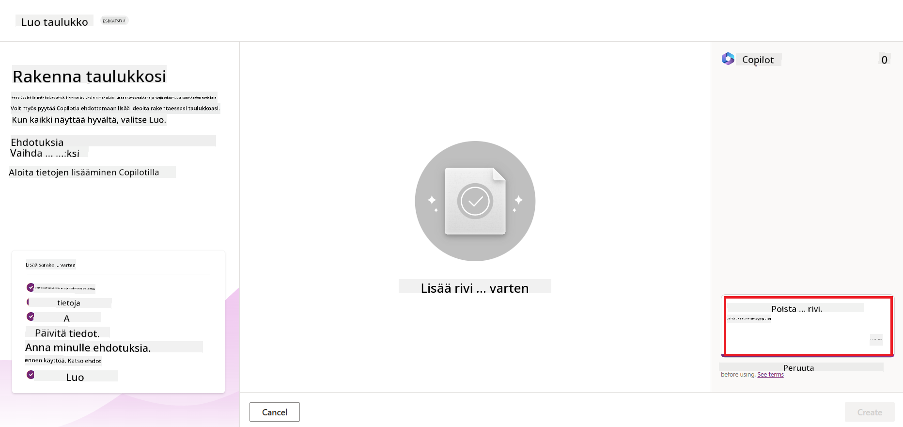
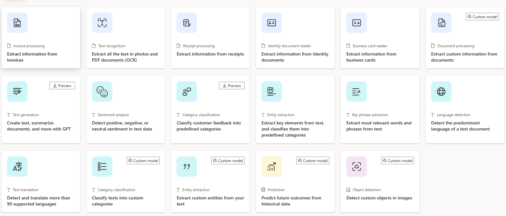

<!--
CO_OP_TRANSLATOR_METADATA:
{
  "original_hash": "f5ff3b6204a695a117d6f452403c95f7",
  "translation_date": "2025-07-09T14:03:57+00:00",
  "source_file": "10-building-low-code-ai-applications/README.md",
  "language_code": "fi"
}
-->
# Low Code -tekoälysovellusten rakentaminen

> _(Klikkaa yllä olevaa kuvaa nähdäksesi tämän oppitunnin videon)_

## Johdanto

Nyt kun olemme oppineet rakentamaan kuvia generoivia sovelluksia, puhutaan low codesta. Generatiivista tekoälyä voidaan hyödyntää monilla eri alueilla, myös low codessa, mutta mitä low code oikeastaan on ja miten tekoäly voidaan siihen lisätä?

Sovellusten ja ratkaisujen rakentaminen on helpottunut perinteisille kehittäjille ja ei-kehittäjille Low Code -kehitysalustojen avulla. Low Code -kehitysalustat mahdollistavat sovellusten ja ratkaisujen rakentamisen vähällä tai ilman koodia. Tämä saavutetaan tarjoamalla visuaalinen kehitysympäristö, jossa komponentteja voi vetää ja pudottaa sovellusten ja ratkaisujen rakentamiseksi. Näin sovelluksia ja ratkaisuja voidaan rakentaa nopeammin ja vähemmillä resursseilla. Tässä oppitunnissa sukellamme syvälle low coden käyttöön ja siihen, miten tekoälyllä voidaan tehostaa low code -kehitystä Power Platformin avulla.

Power Platform tarjoaa organisaatioille mahdollisuuden antaa tiimeilleen valtuudet rakentaa omia ratkaisujaan intuitiivisessa low-code- tai no-code-ympäristössä. Tämä ympäristö yksinkertaistaa ratkaisujen rakentamisen prosessia. Power Platformilla ratkaisut voidaan rakentaa päivissä tai viikoissa kuukausien tai vuosien sijaan. Power Platform koostuu viidestä keskeisestä tuotteesta: Power Apps, Power Automate, Power BI, Power Pages ja Copilot Studio.

Tässä oppitunnissa käsitellään:

- Johdanto generatiiviseen tekoälyyn Power Platformissa
- Johdanto Copilotiin ja sen käyttöön
- Generatiivisen tekoälyn hyödyntäminen sovellusten ja työnkulkujen rakentamisessa Power Platformissa
- AI-mallien ymmärtäminen Power Platformissa AI Builderin avulla

## Oppimistavoitteet

Oppitunnin lopussa osaat:

- Ymmärtää, miten Copilot toimii Power Platformissa.

- Rakentaa opiskelijoiden tehtävien seurantasovelluksen koulutusstartupillemme.

- Rakentaa laskujen käsittelytyönkulun, joka käyttää tekoälyä laskujen tietojen poimimiseen.

- Soveltaa parhaita käytäntöjä Create Text with GPT -tekoälymallin käytössä.

Tässä oppitunnissa käytettävät työkalut ja teknologiat ovat:

- **Power Apps**, opiskelijoiden tehtävien seurantasovellukseen, joka tarjoaa low-code-kehitysympäristön sovellusten rakentamiseen tietojen seuraamiseksi, hallitsemiseksi ja vuorovaikutukseen.

- **Dataverse**, opiskelijoiden tehtävien seurantasovelluksen tietojen tallentamiseen, joka tarjoaa low-code-tietoplatformin sovelluksen datan säilytykseen.

- **Power Automate**, laskujen käsittelytyönkulkuun, jossa on low-code-kehitysympäristö työnkulkujen rakentamiseen laskujen käsittelyprosessin automatisoimiseksi.

- **AI Builder**, laskujen käsittelyyn käytettävään tekoälymalliin, jossa hyödynnetään valmiita tekoälymalleja startupimme laskujen käsittelyssä.

## Generatiivinen tekoäly Power Platformissa

Low-code-kehityksen ja sovellusten parantaminen generatiivisella tekoälyllä on Power Platformin keskeinen painopistealue. Tavoitteena on mahdollistaa kaikkien rakentaa tekoälyllä tehostettuja sovelluksia, sivustoja, koontinäyttöjä ja automatisoida prosesseja tekoälyn avulla _ilman tarvetta datatieteen asiantuntemukselle_. Tämä tavoite saavutetaan integroimalla generatiivinen tekoäly low-code-kehityskokemukseen Power Platformissa Copilotin ja AI Builderin muodossa.

### Miten tämä toimii?

Copilot on tekoälyavustaja, joka mahdollistaa Power Platform -ratkaisujen rakentamisen kuvailemalla vaatimuksesi luonnollisella kielellä sarjassa keskustelumuotoisia vaiheita. Voit esimerkiksi ohjeistaa tekoälyavustajaa kertomaan, mitä kenttiä sovelluksesi käyttää, jolloin se luo sekä sovelluksen että taustalla olevan tietomallin, tai voit määritellä, miten työnkulku Power Automatessa asetetaan.

Voit käyttää Copilotin ohjaamia toimintoja sovelluksesi näytöillä, jotta käyttäjät voivat löytää oivalluksia keskustelupohjaisen vuorovaikutuksen kautta.

AI Builder on Power Platformissa saatavilla oleva low-code-tekoälyominaisuus, joka mahdollistaa tekoälymallien käytön prosessien automatisointiin ja tulosten ennustamiseen. AI Builderin avulla voit tuoda tekoälyn sovelluksiisi ja työnkulkuihisi, jotka yhdistyvät dataan Dataversessa tai erilaisissa pilvitietolähteissä, kuten SharePointissa, OneDrivessa tai Azurella.

Copilot on saatavilla kaikissa Power Platformin tuotteissa: Power Apps, Power Automate, Power BI, Power Pages ja Power Virtual Agents. AI Builder on saatavilla Power Appsissa ja Power Automatessa. Tässä oppitunnissa keskitymme Copilotin ja AI Builderin käyttöön Power Appsissa ja Power Automatessa ratkaisun rakentamiseksi koulutusstartupillemme.

### Copilot Power Appsissa

Power Platformin osana Power Apps tarjoaa low-code-kehitysympäristön sovellusten rakentamiseen, joiden avulla voidaan seurata, hallita ja olla vuorovaikutuksessa datan kanssa. Se on sovelluskehityspalveluiden kokonaisuus, jossa on skaalautuva tietoplatform ja kyky yhdistää pilvipalveluihin ja paikallisiin tietoihin. Power Appsilla voit rakentaa sovelluksia, jotka toimivat selaimissa, tableteissa ja puhelimissa, ja joita voi jakaa työkavereille. Power Apps helpottaa käyttäjiä sovelluskehityksessä yksinkertaisen käyttöliittymän avulla, jotta jokainen liiketoiminnan käyttäjä tai ammattilaiskehittäjä voi rakentaa räätälöityjä sovelluksia. Sovelluskehityskokemusta parantaa myös generatiivinen tekoäly Copilotin kautta.

Power Appsissa Copilot-tekoälyavustajaominaisuus mahdollistaa sovelluksen tarpeiden kuvaamisen ja sen, mitä tietoja sovelluksen tulee seurata, kerätä tai näyttää. Copilot luo kuvauksesi perusteella responsiivisen Canvas-sovelluksen. Voit sitten muokata sovellusta tarpeidesi mukaan. AI Copilot luo ja ehdottaa myös Dataverse-taulua, jossa on kentät, joita tarvitset tallentaaksesi haluamasi seurattavat tiedot, sekä esimerkkidataa. Tarkastelemme myöhemmin tässä oppitunnissa, mitä Dataverse on ja miten sitä voi käyttää Power Appsissa. Voit muokata taulua tarpeidesi mukaan AI Copilot -avustajan avulla keskusteluvaiheiden kautta. Tämä ominaisuus on helposti saatavilla Power Appsin aloitusnäytöltä.

### Copilot Power Automatessa

Power Platformin osana Power Automate antaa käyttäjille mahdollisuuden luoda automatisoituja työnkulkuja sovellusten ja palveluiden välille. Se auttaa automatisoimaan toistuvia liiketoimintaprosesseja, kuten viestintää, tiedonkeruuta ja päätösten hyväksyntää. Sen yksinkertainen käyttöliittymä mahdollistaa käyttäjille kaikilla teknisillä taidoilla (aloittelijoista kokeneisiin kehittäjiin) työtehtävien automatisoinnin. Työnkulkujen kehityskokemusta parantaa myös generatiivinen tekoäly Copilotin kautta.

Power Automatessa Copilot-tekoälyavustajaominaisuus mahdollistaa työnkulun tarpeiden kuvaamisen ja haluttujen toimintojen määrittämisen. Copilot luo kuvauksesi perusteella työnkulun. Voit sitten muokata työnkulkua tarpeidesi mukaan. AI Copilot luo ja ehdottaa myös toimintoja, joita tarvitset haluamasi tehtävän automatisoimiseksi. Tarkastelemme myöhemmin tässä oppitunnissa, mitä työnkulut ovat ja miten niitä voi käyttää Power Automatessa. Voit muokata toimintoja tarpeidesi mukaan AI Copilot -avustajan avulla keskusteluvaiheiden kautta. Tämä ominaisuus on helposti saatavilla Power Automaten aloitusnäytöltä.

## Tehtävä: Hallitse opiskelijoiden tehtäviä ja laskuja startupillemme Copilotin avulla

Startupimme tarjoaa opiskelijoille verkkokursseja. Startup on kasvanut nopeasti ja kamppailee nyt kurssien kysynnän kanssa. Startup on palkannut sinut Power Platform -kehittäjäksi auttamaan heitä rakentamaan low code -ratkaisun opiskelijoiden tehtävien ja laskujen hallintaan. Ratkaisun tulisi auttaa seuraamaan ja hallitsemaan opiskelijoiden tehtäviä sovelluksen avulla sekä automatisoimaan laskujen käsittelyprosessi työnkulun avulla. Sinua on pyydetty käyttämään generatiivista tekoälyä ratkaisun kehittämiseen.

Kun aloitat Copilotin käytön, voit käyttää [Power Platform Copilot Prompt Libraryä](https://github.com/pnp/powerplatform-prompts?WT.mc_id=academic-109639-somelezediko) aloittaaksesi kehotteiden kanssa. Tämä kirjasto sisältää listan kehotteista, joita voit käyttää sovellusten ja työnkulkujen rakentamiseen Copilotin avulla. Voit myös käyttää kirjaston kehotteita saadaksesi idean siitä, miten kuvata vaatimuksesi Copilotille.

### Rakenna opiskelijoiden tehtävien seurantasovellus startupillemme

Startupimme kouluttajat ovat kamppailleet opiskelijoiden tehtävien seuraamisessa. He ovat käyttäneet tehtävien seurantaan taulukkolaskentaa, mutta opiskelijoiden määrän kasvaessa sen hallinta on vaikeutunut. He pyysivät sinua rakentamaan sovelluksen, joka auttaa heitä seuraamaan ja hallitsemaan opiskelijoiden tehtäviä. Sovelluksen tulisi mahdollistaa uusien tehtävien lisääminen, tehtävien katselu, päivittäminen ja poistaminen. Sovelluksen tulisi myös antaa kouluttajien ja opiskelijoiden nähdä arvioidut ja arvioimattomat tehtävät.

Rakennat sovelluksen Copilotin avulla Power Appsissa seuraavien vaiheiden mukaisesti:

1. Siirry [Power Apps](https://make.powerapps.com?WT.mc_id=academic-105485-koreyst) aloitusnäyttöön.

1. Käytä aloitusnäytön tekstialuetta kuvataksesi sovelluksen, jonka haluat rakentaa. Esimerkiksi **_Haluan rakentaa sovelluksen opiskelijoiden tehtävien seuraamiseen ja hallintaan_**. Klikkaa **Lähetä**-painiketta lähettääksesi kehotteen AI Copilotille.

1. AI Copilot ehdottaa Dataverse-taulua kenttineen, joita tarvitset tallentaaksesi haluamasi seurattavat tiedot, sekä esimerkkidataa. Voit muokata taulua tarpeidesi mukaan AI Copilot -avustajan avulla keskusteluvaiheiden kautta.

   > **Tärkeää**: Dataverse on Power Platformin taustalla oleva tietoplatform. Se on low-code-tietoplatform sovelluksen datan tallentamiseen. Se on täysin hallinnoitu palvelu, joka tallentaa tiedot turvallisesti Microsoftin pilveen ja on provisionoitu Power Platform -ympäristöösi. Se sisältää sisäänrakennettuja tietohallinnan ominaisuuksia, kuten tietojen luokittelun, tietojen jäljitettävyyden, hienojakoisen käyttöoikeuksien hallinnan ja muuta. Voit oppia lisää Dataversesta [täältä](https://docs.microsoft.com/powerapps/maker/data-platform/data-platform-intro?WT.mc_id=academic-109639-somelezediko).

   

1. Kouluttajat haluavat lähettää sähköposteja opiskelijoille, jotka ovat palauttaneet tehtävänsä, jotta he pysyvät ajan tasalla tehtävien etenemisestä. Voit käyttää Copilotia lisätäksesi uuden kentän tauluun opiskelijoiden sähköpostiosoitteiden tallentamista varten. Esimerkiksi voit käyttää seuraavaa kehotetta lisätäksesi uuden kentän: **_Haluan lisätä sarakkeen opiskelijoiden sähköpostiosoitteiden tallentamista varten_**. Klikkaa **Lähetä**-painiketta lähettääksesi kehotteen AI Copilotille.

1. AI Copilot luo uuden kentän, jonka voit muokata tarpeidesi mukaan.

1. Kun taulu on valmis, klikkaa **Luo sovellus** -painiketta luodaksesi sovelluksen.

1. AI Copilot luo kuvauksesi perusteella responsiivisen Canvas-sovelluksen. Voit muokata sovellusta tarpeidesi mukaan.

1. Kouluttajien sähköpostien lähettämistä varten voit käyttää Copilotia lisätäksesi uuden näytön sovellukseen. Esimerkiksi voit käyttää seuraavaa kehotetta lisätäksesi uuden näytön: **_Haluan lisätä näytön sähköpostien lähettämistä varten opiskelijoille_**. Klikkaa **Lähetä**-painiketta lähettääksesi kehotteen AI Copilotille.

1. AI Copilot luo uuden näytön, jonka voit muokata tarpeidesi mukaan.

1. Kun sovellus on valmis, klikkaa **Tallenna**-painiketta tallentaaksesi sovelluksen.

1. Jaa sovellus kouluttajille klikkaamalla **Jaa**-painiketta ja sen jälkeen uudelleen **Jaa**-painiketta. Voit jakaa sovelluksen kouluttajille syöttämällä heidän sähköpostiosoitteensa.

> **Kotitehtäväsi**: Rakentamasi sovellus on hyvä alku, mutta sitä voi parantaa. Sähköpostiominaisuudella kouluttajat voivat lähettää sähköposteja opiskelijoille vain manuaalisesti kirjoittamalla heidän sähköpostinsa. Voitko käyttää Copilotia rakentaaksesi automaation, joka mahdollistaa kouluttajien lähettää sähköposteja opiskelijoille automaattisesti, kun he palauttavat tehtävänsä? Vihjeesi on, että oikealla kehotteella voit käyttää Copilotia Power Automatessa tämän rakentamiseen.

### Rakenna laskujen tietotaulu startupillemme

Startupimme taloustiimi on kamppaillut laskujen seuraamisessa. He ovat käyttäneet taulukkolaskentaa laskujen seurantaan, mutta laskujen määrän kasvaessa sen hallinta on vaikeutunut. He pyysivät sinua rakentamaan taulun, joka auttaa heitä tallentamaan, seuraamaan ja hallitsemaan vastaanotettujen laskujen tietoja. Taulua käytetään automaation rakentamiseen, joka poimii kaikki laskutiedot ja tallentaa ne tauluun. Taulun tulisi myös mahdollistaa taloustiimin nähdä maksetut ja maksamattomat laskut.

Power Platformilla on taustalla tietoplatform nimeltä Dataverse, joka mahdollistaa sovellusten ja ratkaisujen datan tallentamisen. Dataverse tarjoaa low-code-tietoplatformin sovelluksen datan säilytykseen. Se on täysin hallinnoitu palvelu, joka tallentaa tiedot turvallisesti Microsoftin pilveen ja on provisionoitu Power Platform -ympäristöösi. Se sisältää sisäänrakennettuja tietohallinnan ominaisuuksia, kuten tietojen luokittelun, tietojen jäljitettävyyden, hienojakoisen käyttöoikeuksien hallinnan ja muuta. Voit oppia lisää [Dataversesta täältä](https://docs.microsoft.com/powerapps/maker/data-platform/data-platform-intro?WT.mc_id=academic-109639-somelezediko).

Miksi meidän pitäisi käyttää Dataverseä startupissamme? Dataversen standardi- ja mukautetut taulut tarjoavat turvallisen ja pilvipohjaisen tallennusvaihtoehdon datallesi. Taulut antavat mahdollisuuden tallentaa erilaisia tietotyyppejä, samalla tavalla kuin käyttäisit useita laskentataulukoita yhdessä Excel-työkirjassa. Voit käyttää tauluja tallentaaksesi dataa, joka on organisaatiosi tai liiketoimintasi tarpeiden mukaista. Joitakin hyötyjä, joita startupimme saa Dataversen käytöstä, ovat muun muassa:
- **Helppo hallita**: Sekä metatiedot että data tallennetaan pilveen, joten sinun ei tarvitse huolehtia siitä, miten ne tallennetaan tai hallitaan. Voit keskittyä sovellustesi ja ratkaisujesi rakentamiseen.

- **Turvallinen**: Dataverse tarjoaa turvallisen ja pilvipohjaisen tallennusvaihtoehdon tiedoillesi. Voit hallita, kuka pääsee käsiksi taulujesi tietoihin ja miten he voivat käyttää niitä roolipohjaisen tietoturvan avulla.

- **Rikkaita metatietoja**: Tietotyyppejä ja suhteita käytetään suoraan Power Appsissa

- **Logiikka ja validointi**: Voit käyttää liiketoimintasääntöjä, laskettuja kenttiä ja validointisääntöjä liiketoimintalogiikan toteuttamiseen ja tietojen tarkkuuden ylläpitämiseen.

Nyt kun tiedät, mitä Dataverse on ja miksi sitä kannattaa käyttää, katsotaan, miten voit käyttää Copilotia luodaksesi taulun Dataverseen, joka täyttää taloustiimimme vaatimukset.

> **Note** : Käytät tätä taulua seuraavassa osiossa rakentaaksesi automaation, joka poimii kaikki laskutiedot ja tallentaa ne tauluun.

Taulun luomiseksi Dataverseen Copilotin avulla, toimi seuraavasti:

1. Siirry [Power Apps](https://make.powerapps.com?WT.mc_id=academic-105485-koreyst) aloitusnäyttöön.

2. Valitse vasemman reunan navigointipalkista **Tables** ja klikkaa sitten **Describe the new Table**.

3. **Describe the new Table** -näytöllä käytä tekstialuetta kuvaillaksesi taulua, jonka haluat luoda. Esimerkiksi **_Haluan luoda taulun laskutietojen tallentamista varten_**. Klikkaa **Send**-painiketta lähettääksesi kehotteen AI Copilotille.

4. AI Copilot ehdottaa Dataverse-taulua, jossa on kentät, joita tarvitset tallentaaksesi seurattavat tiedot, sekä esimerkkitietoja. Voit sitten räätälöidä taulua tarpeidesi mukaan AI Copilot -avustajan avulla keskustelupohjaisesti.

5. Taloustiimi haluaa lähettää sähköpostin toimittajalle päivittääkseen heidät laskun nykytilasta. Voit käyttää Copilotia lisätäksesi tauluun uuden kentän toimittajan sähköpostin tallentamista varten. Esimerkiksi voit käyttää seuraavaa kehotetta lisätäksesi uuden kentän tauluun: **_Haluan lisätä sarakkeen toimittajan sähköpostin tallentamista varten_**. Klikkaa **Send**-painiketta lähettääksesi kehotteen AI Copilotille.

6. AI Copilot luo uuden kentän, jonka voit räätälöidä tarpeidesi mukaan.

7. Kun olet valmis taulun kanssa, klikkaa **Create**-painiketta luodaksesi taulun.

## AI-mallit Power Platformissa AI Builderin avulla

AI Builder on Power Platformin matalan koodin AI-ominaisuus, jonka avulla voit käyttää AI-malleja prosessien automatisointiin ja tulosten ennustamiseen. AI Builderin avulla voit tuoda tekoälyn sovelluksiisi ja työnkulkuihisi, jotka yhdistävät tietosi Dataversessa tai erilaisissa pilvitietolähteissä, kuten SharePointissa, OneDrivessa tai Azurella.

## Valmiit AI-mallit vs. räätälöidyt AI-mallit

AI Builder tarjoaa kahta tyyppiä AI-malleja: valmiita AI-malleja ja räätälöityjä AI-malleja. Valmiit AI-mallit ovat Microsoftin kouluttamia ja Power Platformissa valmiina käytettävissä olevia malleja. Ne auttavat sinua lisäämään älykkyyttä sovelluksiisi ja työnkulkuihisi ilman, että sinun tarvitsee kerätä dataa, rakentaa, kouluttaa ja julkaista omia mallejasi. Näitä malleja voi käyttää prosessien automatisointiin ja tulosten ennustamiseen.

Joistakin Power Platformin valmiista AI-malleista:

- **Key Phrase Extraction**: Tämä malli poimii avainsanoja tekstistä.
- **Language Detection**: Tämä malli tunnistaa tekstin kielen.
- **Sentiment Analysis**: Tämä malli tunnistaa tekstin positiivisen, negatiivisen, neutraalin tai sekoitetun tunnelman.
- **Business Card Reader**: Tämä malli poimii tietoja käyntikorteista.
- **Text Recognition**: Tämä malli poimii tekstiä kuvista.
- **Object Detection**: Tämä malli tunnistaa ja poimii esineitä kuvista.
- **Document processing**: Tämä malli poimii tietoja lomakkeista.
- **Invoice Processing**: Tämä malli poimii tietoja laskuista.

Räätälöityjen AI-mallien avulla voit tuoda oman mallisi AI Builderiin, jolloin se toimii kuten mikä tahansa AI Builderin räätälöity malli ja voit kouluttaa mallia omilla tiedoillasi. Näitä malleja voi käyttää prosessien automatisointiin ja tulosten ennustamiseen sekä Power Appsissa että Power Automatessa. Oman mallin käytössä on kuitenkin rajoituksia. Lue lisää näistä [rajoituksista](https://learn.microsoft.com/ai-builder/byo-model#limitations?WT.mc_id=academic-105485-koreyst).

## Tehtävä #2 – Rakenna laskujen käsittelytyönkulku startupillemme

Taloustiimi on kamppaillut laskujen käsittelyn kanssa. He ovat käyttäneet laskujen seurantaan taulukkolaskentaa, mutta laskujen määrän kasvaessa sen hallinta on käynyt vaikeaksi. He pyysivät sinua rakentamaan työnkulun, joka auttaa heitä käsittelemään laskuja tekoälyn avulla. Työnkulun tulee mahdollistaa tietojen poimiminen laskuista ja tallentaminen Dataverse-tauluun. Työnkulun tulee myös mahdollistaa sähköpostin lähettäminen taloustiimille poimituilla tiedoilla.

Nyt kun tiedät, mitä AI Builder on ja miksi sitä kannattaa käyttää, katsotaan, miten voit käyttää Invoice Processing -AI-mallia AI Builderissa, jonka kävimme aiemmin läpi, rakentaaksesi työnkulun, joka auttaa taloustiimiä käsittelemään laskuja.

Rakentaaksesi työnkulun, joka auttaa taloustiimiä käsittelemään laskuja Invoice Processing -AI-mallin avulla AI Builderissa, toimi seuraavasti:

1. Siirry [Power Automate](https://make.powerautomate.com?WT.mc_id=academic-105485-koreyst) aloitusnäyttöön.

2. Käytä aloitusnäytön tekstialuetta kuvaillaksesi työnkulun, jonka haluat rakentaa. Esimerkiksi **_Käsittele lasku, kun se saapuu postilaatikkooni_**. Klikkaa **Send**-painiketta lähettääksesi kehotteen AI Copilotille.

   

3. AI Copilot ehdottaa toimenpiteitä, joita tarvitset haluamasi tehtävän automatisointiin. Voit klikata **Next**-painiketta edetäksesi seuraaviin vaiheisiin.

4. Seuraavassa vaiheessa Power Automate pyytää sinua määrittämään työnkulun tarvitsemat yhteydet. Kun olet valmis, klikkaa **Create flow** -painiketta luodaksesi työnkulun.

5. AI Copilot luo työnkulun, jonka voit räätälöidä tarpeidesi mukaan.

6. Päivitä työnkulun laukaisija ja aseta **Folder** kansioon, johon laskut tallennetaan. Esimerkiksi voit asettaa kansion **Inbox**. Klikkaa **Show advanced options** ja aseta **Only with Attachments** arvoksi **Yes**. Tämä varmistaa, että työnkulku käynnistyy vain, kun kansioon saapuu sähköposti liitteellä.

7. Poista työnkulusta seuraavat toiminnot: **HTML to text**, **Compose**, **Compose 2**, **Compose 3** ja **Compose 4**, koska et tule käyttämään niitä.

8. Poista työnkulusta **Condition**-toiminto, koska et tule käyttämään sitä. Työnkulun tulisi näyttää seuraavalta:

   

9. Klikkaa **Add an action** -painiketta ja etsi **Dataverse**. Valitse **Add a new row** -toiminto.

10. **Extract Information from invoices** -toiminnossa päivitä **Invoice File** osoittamaan sähköpostin **Attachment Content** -kenttään. Tämä varmistaa, että työnkulku poimii tiedot laskuliitteestä.

11. Valitse aiemmin luomasi **Table**. Esimerkiksi voit valita **Invoice Information** -taulun. Valitse dynaaminen sisältö edellisestä toiminnosta täyttääksesi seuraavat kentät:

    - ID
    - Amount
    - Date
    - Name
    - Status – Aseta **Status** arvoksi **Pending**.
    - Supplier Email – Käytä **From**-dynaamista sisältöä **When a new email arrives** -laukaisijasta.

    

12. Kun olet valmis työnkulun kanssa, klikkaa **Save**-painiketta tallentaaksesi työnkulun. Voit testata työnkulkua lähettämällä sähköpostin, jossa on lasku, kansioon, jonka määritit laukaisijassa.

> **Kotitehtäväsi**: Juuri rakentamasi työnkulku on hyvä alku, nyt sinun täytyy miettiä, miten voit rakentaa automaation, joka mahdollistaa taloustiimimme lähettävän sähköpostin toimittajalle päivittääkseen heidät laskun nykytilasta. Vihjeesi: työnkulun täytyy käynnistyä, kun laskun tila muuttuu.

## Käytä tekstin generointiin tarkoitettua AI-mallia Power Automatessa

Create Text with GPT -AI-malli AI Builderissa mahdollistaa tekstin luomisen kehotteen perusteella, ja se käyttää Microsoft Azure OpenAI -palvelua. Tämän ominaisuuden avulla voit integroida GPT-teknologian (Generative Pre-Trained Transformer) sovelluksiisi ja työnkulkuihisi rakentaaksesi monenlaisia automatisoituja työnkulkuja ja älykkäitä sovelluksia.

GPT-mallit käyvät läpi laajan koulutuksen valtavilla tietomäärillä, mikä mahdollistaa tekstin tuottamisen, joka muistuttaa ihmiskieltä, kun niille annetaan kehotteita. Kun ne yhdistetään työnkulkuautomaatioon, GPT:n kaltaisia AI-malleja voidaan hyödyntää monien tehtävien sujuvoittamiseen ja automatisointiin.

Esimerkiksi voit rakentaa työnkulkuja, jotka automaattisesti luovat tekstiä moniin käyttötarkoituksiin, kuten sähköpostiluonnoksiin, tuotekuvauksiin ja muihin. Voit myös käyttää mallia tekstin luomiseen erilaisissa sovelluksissa, kuten chatboteissa ja asiakaspalvelusovelluksissa, jotka auttavat asiakaspalvelijoita vastaamaan tehokkaasti ja sujuvasti asiakkaiden kyselyihin.

Oppiaksesi käyttämään tätä AI-mallia Power Automatessa, käy läpi [Add intelligence with AI Builder and GPT](https://learn.microsoft.com/training/modules/ai-builder-text-generation/?WT.mc_id=academic-109639-somelezediko) -moduuli.

## Hienoa työtä! Jatka oppimista

Kun olet suorittanut tämän oppitunnin, tutustu [Generative AI Learning collection](https://aka.ms/genai-collection?WT.mc_id=academic-105485-koreyst) -kokoelmaamme jatkaaksesi Generative AI -osaamisesi kehittämistä!

Siirry oppitunnille 11, jossa tarkastelemme, miten [integroida Generative AI Function Callingin kanssa](../11-integrating-with-function-calling/README.md?WT.mc_id=academic-105485-koreyst)!

**Vastuuvapauslauseke**:  
Tämä asiakirja on käännetty käyttämällä tekoälypohjaista käännöspalvelua [Co-op Translator](https://github.com/Azure/co-op-translator). Vaikka pyrimme tarkkuuteen, huomioithan, että automaattikäännöksissä saattaa esiintyä virheitä tai epätarkkuuksia. Alkuperäistä asiakirjaa sen alkuperäiskielellä tulee pitää virallisena lähteenä. Tärkeissä tiedoissa suositellaan ammattimaista ihmiskäännöstä. Emme ole vastuussa tämän käännöksen käytöstä aiheutuvista väärinymmärryksistä tai tulkinnoista.