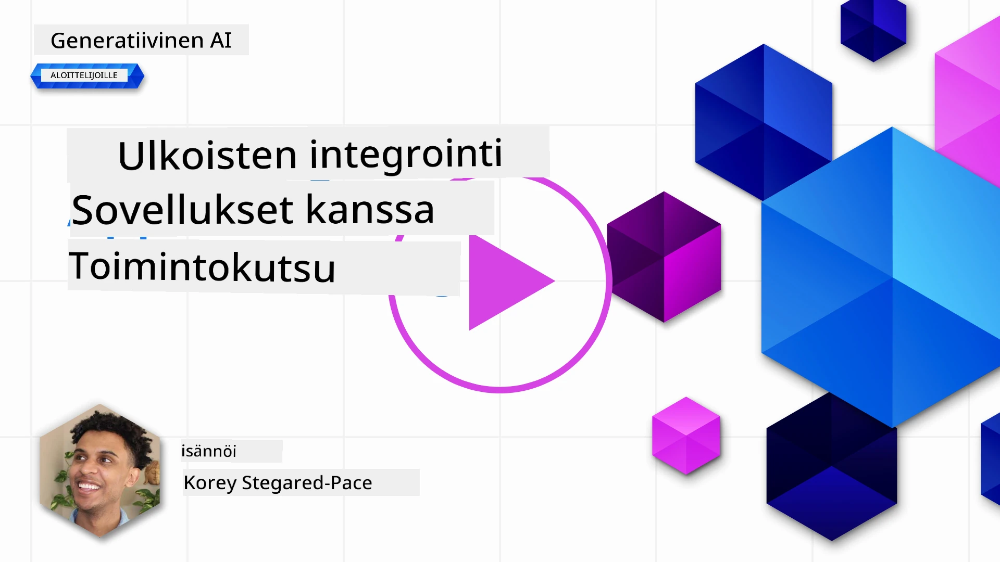
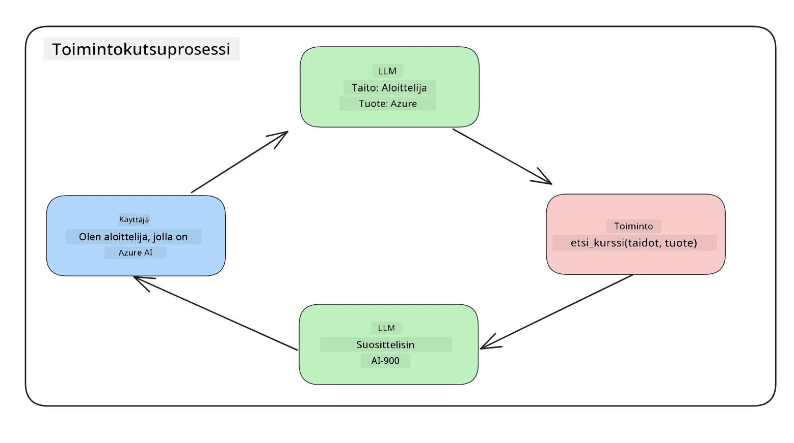
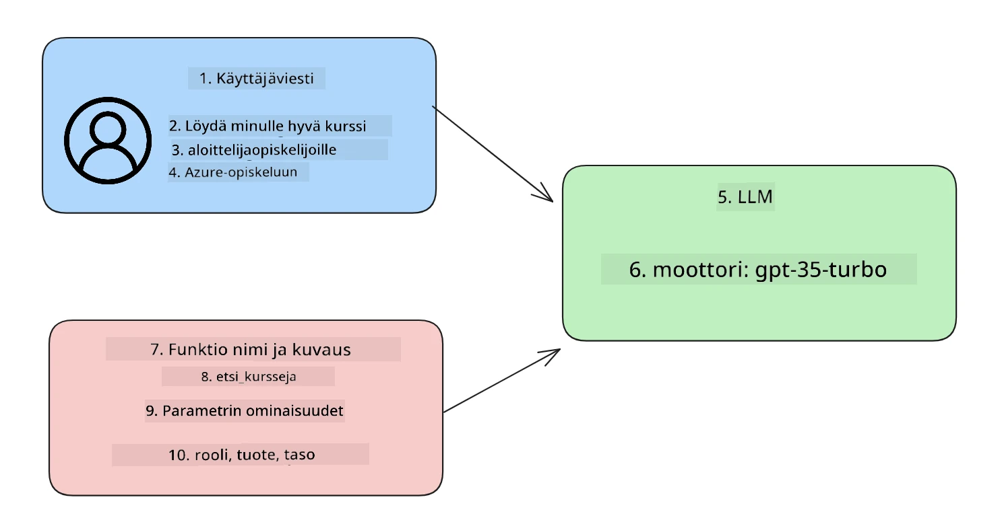

# Integrointi funktiokutsuun

[](https://youtu.be/DgUdCLX8qYQ?si=f1ouQU5HQx6F8Gl2)

Olet oppinut tähän mennessä melko paljon edellisissä oppitunneissa. Voimme kuitenkin parantaa vielä lisää. Jotkut asiat, joita voimme käsitellä, ovat kuinka voimme saada johdonmukaisemman vastausformaatin, jotta vastauksen käsittely jälkikäteen olisi helpompaa. Lisäksi voimme haluta lisätä dataa muista lähteistä sovelluksemme rikastamiseksi.

Edellä mainitut ongelmat ovat tämän luvun käsittelyn kohteena.

## Johdanto

Tässä oppitunnissa käsittelemme:

- Selitetään, mitä funktiokutsu tarkoittaa ja sen käyttötapaukset.
- Funktiokutsun luominen Azure OpenAI:lla.
- Kuinka integroida funktiokutsu sovellukseen.

## Oppimistavoitteet

Oppitunnin lopussa osaat:

- Selittää, miksi funktiokutsua käytetään.
- Määrittää Funktiokutsu Azure OpenAI -palvelussa.
- Suunnitella tehokkaita funktiokutsuja sovelluksesi käyttötarkoitukseen.

## Tilanne: Parannetaan chatbotiamme funktioilla

Tässä oppitunnissa rakennamme ominaisuuden koulutusstartup-sovellukseemme, jonka avulla käyttäjät voivat käyttää chatbotia löytääkseen teknisiä kursseja. Suositamme kursseja, jotka sopivat heidän taitotasoonsa, nykyiseen rooliinsa ja kiinnostuksen kohteisiin teknologiassa.

Tämän tilanteen suorittamiseen käytämme yhdistelmää:

- `Azure OpenAI`:ta luodaksemme käyttäjälle chat-kokemuksen.
- `Microsoft Learn Catalog API`:a auttamaan käyttäjiä löytämään kursseja käyttäjän pyynnön perusteella.
- `Function Calling`:ia käyttääksemme käyttäjän kyselyn ja lähettääksemme sen funktiolle API-kutsun tekemiseksi.

Aloitetaan katsomalla, miksi haluamme käyttää funktiokutsua ylipäätään:

## Miksi Funktiokutsu

Ennen funktiokutsua LLM:n vastaukset olivat jäsentämättömiä ja epäjohdonmukaisia. Kehittäjien täytyi kirjoittaa monimutkaista validointikoodia varmistaakseen, että he pystyivät käsittelemään kaikki vastausvaihtoehdot. Käyttäjät eivät voineet saada vastauksia esimerkiksi kysymykseen "Mikä on tämänhetkinen sää Tukholmassa?". Tämä johtui siitä, että mallit olivat koulutettujen tietojen aikarajoitettuja.

Funktiokutsu on Azure OpenAI -palvelun ominaisuus, joka ratkaisee seuraavat rajoitukset:

- **Johdonmukainen vastausformaatio.** Jos voimme paremmin hallita vastausformaatia, voimme helpommin integroida vastauksen muihin järjestelmiin.
- **Ulkoinen data.** Kyky käyttää dataa sovelluksen muista lähteistä chat-kontekstissa.

## Ongelman havainnollistaminen esimerkin kautta

> Suosittelemme käyttämään [sisällytettyä muistikirjaa](./python/aoai-assignment.ipynb?WT.mc_id=academic-105485-koreyst), jos haluat suorittaa alla olevan skenaarion. Voit myös vain lukea, kun yritämme havainnollistaa ongelmaa, johon funktiot voivat auttaa.

Tarkastellaan esimerkkiä, joka havainnollistaa vastausformaatin ongelmaa:

Oletetaan, että haluamme luoda opiskelijatietokannan, jotta voimme ehdottaa heille sopivaa kurssia. Alla on kaksi kuvausta opiskelijoista, jotka ovat hyvin samankaltaisia sisällöltään.

1. Luo yhteys Azure OpenAI -resurssiimme:

   ```python
   import os
   import json
   from openai import OpenAI
   from dotenv import load_dotenv
   load_dotenv()

   # Responses API palvellaan Azure OpenAI (Microsoft Foundry) v1 -päätepisteestä
   # joten osoitamme OpenAI-asiakkaan osoitteeseen <your-endpoint>/openai/v1/.
   endpoint = os.environ['AZURE_OPENAI_ENDPOINT']
   client = OpenAI(
   api_key=os.environ['AZURE_OPENAI_API_KEY'],
   base_url=f"{endpoint.rstrip('/')}/openai/v1/",
   )

   deployment=os.environ['AZURE_OPENAI_DEPLOYMENT']
   ```

   Alla on Python-koodia, jolla konfiguroidaan yhteys Azure OpenAI:hin. Koska käytämme v1-päätepistettä, meidän tarvitsee määrittää vain `api_key` ja `base_url` (ei tarvita `api_version`ia).

1. Tehdään kaksi opiskelijakuvausta muuttujilla `student_1_description` ja `student_2_description`.

   ```python
   student_1_description="Emily Johnson is a sophomore majoring in computer science at Duke University. She has a 3.7 GPA. Emily is an active member of the university's Chess Club and Debate Team. She hopes to pursue a career in software engineering after graduating."

   student_2_description = "Michael Lee is a sophomore majoring in computer science at Stanford University. He has a 3.8 GPA. Michael is known for his programming skills and is an active member of the university's Robotics Club. He hopes to pursue a career in artificial intelligence after finishing his studies."
   ```

   Haluamme lähettää yllä olevat opiskelijakuvaukset LLM:lle datan jäsentämistä varten. Tätä dataa voidaan myöhemmin käyttää sovelluksessa ja lähettää API:lle tai tallentaa tietokantaan.

1. Luodaan kaksi identtistä kehotetta, joissa annetaan LLM:lle ohjeet siitä, mitä tietoja haluamme:

   ```python
   prompt1 = f'''
   Please extract the following information from the given text and return it as a JSON object:

   name
   major
   school
   grades
   club

   This is the body of text to extract the information from:
   {student_1_description}
   '''

   prompt2 = f'''
   Please extract the following information from the given text and return it as a JSON object:

   name
   major
   school
   grades
   club

   This is the body of text to extract the information from:
   {student_2_description}
   '''
   ```

   Yllä olevat kehotteet ohjeistavat LLM:ää poimimaan tiedot ja palauttamaan vastauksen JSON-muodossa.

1. Kun kehotteet ja yhteys Azure OpenAI:hin on asetettu, lähetämme kehotteet LLM:lle käyttämällä `client.responses.create`. Tallennamme kehotteen `input`-muuttujaan ja määritämme roolin `user`:ksi. Tämä jäljittelee käyttäjän kirjoittamaa viestiä chatbotille.

   ```python
   # vastaus kehotteeseen yksi
   openai_response1 = client.responses.create(
   model=deployment,
   input = [{'role': 'user', 'content': prompt1}],
   store=False,
   )
   openai_response1.output_text

   # vastaus kehotteeseen kaksi
   openai_response2 = client.responses.create(
   model=deployment,
   input = [{'role': 'user', 'content': prompt2}],
   store=False,
   )
   openai_response2.output_text
   ```

Nyt voimme lähettää molemmat pyynnöt LLM:lle ja tarkastella saamamme vastauksen, joka löytyy kohdasta `openai_response1.output_text`.

1. Lopuksi voimme muuntaa vastauksen JSON-muotoon kutsumalla `json.loads`:

   ```python
   # Ladataan vastaus JSON-objektina
   json_response1 = json.loads(openai_response1.output_text)
   json_response1
   ```

   Vastaus 1:

   ```json
   {
     "name": "Emily Johnson",
     "major": "computer science",
     "school": "Duke University",
     "grades": "3.7",
     "club": "Chess Club"
   }
   ```

   Vastaus 2:

   ```json
   {
     "name": "Michael Lee",
     "major": "computer science",
     "school": "Stanford University",
     "grades": "3.8 GPA",
     "club": "Robotics Club"
   }
   ```

   Vaikka kehotteet ovat samat ja kuvaukset samankaltaiset, näemme `Grades`-ominaisuuden arvot muotoiltuina eri tavoin, esimerkiksi joskus saamme arvon `3.7` tai `3.7 GPA`.

   Tämä tulos johtuu siitä, että LLM ottaa vastaan rakenteettoman datan kirjoitetussa kehotteessa ja myös palauttaa rakenteetonta dataa. Tarvitsemme jäsennellyn formaatin, jotta tiedämme mitä odottaa tietojen tallennukselta tai käytöltä.

Joten, miten ratkaistaan muotoiluongelma? Käyttämällä funktiokutsua varmistamme, että saamme jäsenneltyä dataa takaisin. Funktiokutsua käytettäessä LLM ei itse asiassa kutsu tai suorita mitään funktioita. Sen sijaan luomme rakenteen, jota LLM seuraa vastauksissaan. Käytämme sitten näitä jäsenneltyjä vastauksia tietääksemme, mitä funktiota ajaa sovelluksissamme.



Voimme sitten ottaa funktiosta saadun vastauksen ja lähettää sen takaisin LLM:lle. LLM vastaa luonnollisella kielellä käyttäjän kyselyyn.

## Funktiokutsujen käyttötapaukset

On monia erilaisia käyttötapauksia, joissa funktiokutsut voivat parantaa sovellustasi, kuten:

- **Ulkoisten työkalujen kutsuminen.** Chatbotit ovat hyviä vastaamaan käyttäjien kysymyksiin. Funktiokutsun avulla chatbot voi käyttää käyttäjän viestejä suorittaakseen tiettyjä tehtäviä. Esimerkiksi opiskelija voi pyytää chatbotia "Lähettämään sähköpostin ohjaajalleni, jossa sanotaan, että tarvitsen lisää apua aiheessa". Tämä voi kutsua funktion `send_email(to: string, body: string)`

- **API- tai tietokantakyselyjen luominen.** Käyttäjät voivat hakea tietoa luonnollisella kielellä, joka muunnetaan muotoilluksi kyselyksi tai API-pyynnöksi. Esimerkkinä on opettaja, joka pyytää "Ketkä opiskelijat suorittivat viimeisen tehtävän", mikä voisi kutsua funktion nimeltä `get_completed(student_name: string, assignment: int, current_status: string)`

- **Jäsennellyn datan luominen.** Käyttäjät voivat ottaa tekstiblokin tai CSV-tiedoston ja käyttää LLM:ää tärkeän tiedon poimimiseen siitä. Esimerkiksi opiskelija voi muuntaa Wikipedia-artikkelin rauhansopimuksista luodakseen tekoälymuistilappuja. Tämä onnistuu käyttäen funktiota `get_important_facts(agreement_name: string, date_signed: string, parties_involved: list)`

## Ensimmäisen funktiokutsun luominen

Funktiokutsun luomisprosessi sisältää kolme päävaihetta:

1. **Soitto** Responses-API:lle, jossa on luettelo toiminnoistasi (työkaluista) ja käyttäjän viesti.
2. **Mallin vastauksen lukeminen** ja toiminnon eli funktion tai API-kutsun suorittaminen.
3. **Toisen kutsun tekeminen** Responses-API:lle funktion vastauksella, jotta tämä tieto voidaan käyttää vastauksen luomiseksi käyttäjälle.



### Vaihe 1 - viestien luominen

Ensimmäinen vaihe on luoda käyttäjän viesti. Tämä voidaan määrittää dynaamisesti ottamalla esimerkiksi tekstikentän arvo tai voit määrittää arvon tässä. Jos tämä on ensimmäinen kerta, kun työskentelet Responses API:n kanssa, meidän tulee määrittää viestin `role` ja `content`.

`role` voi olla `system` (sääntöjen luominen), `assistant` (malli) tai `user` (loppukäyttäjä). Funktiokutsua varten määritämme tämän arvoksi `user` ja annamme esimerkkinä kysymyksen.

```python
messages= [ {"role": "user", "content": "Find me a good course for a beginner student to learn Azure."} ]
```

Roolien määrittely tekee LLM:lle selväksi, onko viestin lähettäjä järjestelmä vai käyttäjä, mikä auttaa rakentamaan keskusteluhistoriaa, jonka LLM voi käyttää.

### Vaihe 2 - funktioiden luominen

Seuraavaksi määrittelemme funktion ja sen parametrit. Käytämme vain yhtä funktiota nimeltä `search_courses`, mutta voit luoda myös useita funktioita.

> **Tärkeää** : Funktiot sisällytetään järjestelmäviestiin LLM:lle, ja ne lasketaan saatavilla olevien tokenien määrään.

Alla luomme funktiot taulukoksi. Jokainen osa on työkalu Responses API:n tasaisessa muodossa, jossa on ominaisuudet `type`, `name`, `description` ja `parameters`:

```python
functions = [
   {
      "type":"function",
      "name":"search_courses",
      "description":"Retrieves courses from the search index based on the parameters provided",
      "parameters":{
         "type":"object",
         "properties":{
            "role":{
               "type":"string",
               "description":"The role of the learner (i.e. developer, data scientist, student, etc.)"
            },
            "product":{
               "type":"string",
               "description":"The product that the lesson is covering (i.e. Azure, Power BI, etc.)"
            },
            "level":{
               "type":"string",
               "description":"The level of experience the learner has prior to taking the course (i.e. beginner, intermediate, advanced)"
            }
         },
         "required":[
            "role"
         ]
      }
   }
]
```

Kuvataan kunkin funktion osa tarkemmin alla:

- `name` - funktion nimi, jota haluamme kutsuttavan.
- `description` - kuvaus siitä, miten funktio toimii. Täällä on tärkeää olla täsmällinen ja selkeä.
- `parameters` - luettelo arvoista ja muodosta, jonka haluat mallin tuottavan vastauksessaan. Parametritaulukko sisältää kohtia, joilla on seuraavat ominaisuudet:
  1. `type` - ominaisuuden tietotyyppi.
  1. `properties` - lista erityisistä arvoista, joita malli käyttää vastauksessaan
      1. `name` - avain on ominaisuuden nimi, jota malli käyttää muotoillussa vastauksessa, esimerkiksi `product`.
      1. `type` - ominaisuuden tietotyyppi, esimerkiksi `string`.
      1. `description` - erityisen ominaisuuden kuvaus.

On myös valinnainen ominaisuus `required` - vaadittu ominaisuus funktion kutsun suorittamiseksi.

### Vaihe 3 - Funktiokutsun tekeminen

Kun olemme määrittäneet funktion, meidän täytyy nyt sisällyttää se kutsuun Responses API:lle. Teemme tämän lisäämällä pyynnön `tools`-parametriin. Tällä kertaa `tools=functions`.

On myös vaihtoehto asettaa `tool_choice` arvoksi `auto`. Tämä tarkoittaa, että annamme LLM:n päättää, mitä funktiota kutsutaan käyttäjän viestin perusteella sen sijaan, että määrittäisimme sen itse.

Alla on koodia, jossa kutsutaan `client.responses.create`. Huomaa, että asetamme `tools=functions` ja `tool_choice="auto"`, antaen LLM:lle valinnan milloin kutsua tarjoamiamme funktioita:

```python
response = client.responses.create(model=deployment,
                                        input=messages,
                                        tools=functions,
                                        tool_choice="auto",
                                        store=False)

print(response.output)
```

Vastauksessa on nyt mukana `function_call`-kohta kohdassa `response.output`, joka näyttää tältä:

```json
{
  "type": "function_call",
  "name": "search_courses",
  "call_id": "call_abc123",
  "arguments": "{\n  \"role\": \"student\",\n  \"product\": \"Azure\",\n  \"level\": \"beginner\"\n}"
}
```

Tässä näemme, miten funktio `search_courses` kutsuttiin ja millä argumenteilla, jotka ovat `arguments`-ominaisuudessa JSON-vastauksessa.

Johtopäätös on, että LLM pystyi löytämään tiedot, jotka vastaavat funktion argumentteja, kun se poimi ne arvoista, jotka annettiin `input`-parametrille Responses API -kutsussa. Alla muistutus `messages`-arvosta:

```python
messages= [ {"role": "user", "content": "Find me a good course for a beginner student to learn Azure."} ]
```

Kuten näet, `student`, `Azure` ja `beginner` poimittiin `messages`-kohdasta ja asetettiin funktion syötteeksi. Funktioiden käyttäminen tällä tavalla on hyvä tapa poimia tietoa kehotteesta, mutta myös tarjota LLM:lle rakenne ja uudelleenkäytettävä toiminnallisuus.

Seuraavaksi katsomme, kuinka tätä voidaan käyttää sovelluksessamme.

## Funktiokutsujen integrointi sovellukseen

Kun olemme testanneet jäsennetyn vastauksen LLM:ltä, voimme nyt integroida sen sovellukseen.

### Virran hallinta

Integroidaksemme tämän sovellukseen, teemme seuraavat vaiheet:

1. Ensin tehdään kutsu OpenAI-palveluihin ja poimitaan funktiokutsu-vastaukset vastauksen `output`-kohdasta.

   ```python
   response_items = response.output
   tool_calls = [item for item in response_items if item.type == "function_call"]
   ```

1. Nyt määrittelemme funktion, joka kutsuu Microsoft Learn API:a saadakseen listan kursseista:

   ```python
   import requests

   def search_courses(role, product, level):
     url = "https://learn.microsoft.com/api/catalog/"
     params = {
        "role": role,
        "product": product,
        "level": level
     }
     response = requests.get(url, params=params)
     modules = response.json()["modules"]
     results = []
     for module in modules[:5]:
        title = module["title"]
        url = module["url"]
        results.append({"title": title, "url": url})
     return str(results)
   ```

   Huomaa, että luomme nyt varsinaisen Python-funktion, joka vastaa `functions`-muuttujassa määritettyjä funktioita. Teemme myös oikeita ulkoisia API-kutsuja saadaksemme tarvitsemaamme dataa. Tässä tapauksessa kutsumme Microsoft Learn API:a hakeaksemme koulutusmoduuleja.

Okei, olemme luoneet `functions`-muuttujan ja vastaavan Python-funktion, miten kerromme LLM:lle, miten nämä yhdistetään siten, että Python-funktiota kutsutaan?

1. Nähtäväksi, pitääkö kutsua Python-funktiota, katsomme LLM:n vastauksesta löytyykö sieltä `function_call`-kohta ja kutsumme osoitettua funktiota. Näin teet mainitun tarkastuksen:

   ```python
   # Tarkista, haluaako malli kutsua funktiota
   if tool_calls:
    for tool_call in tool_calls:
     print("Recommended Function call:")
     print(tool_call.name)
     print()

     # Kutsu funktiota.
     function_name = tool_call.name

     available_functions = {
             "search_courses": search_courses,
     }
     function_to_call = available_functions[function_name]

     function_args = json.loads(tool_call.arguments)
     function_response = function_to_call(**function_args)

     print("Output of function call:")
     print(function_response)
     print(type(function_response))

     # Lisää funktiokutsu ja sen tulos takaisin keskusteluun.
     # Mallin function_call-kohde on liitettävä sen tuloksen ennen.
     messages.append(tool_call)  # avustajan function_call-kohde
     messages.append( # funktion tulos
         {
             "type": "function_call_output",
             "call_id": tool_call.call_id,
             "output": function_response,
         }
     )
   ```

   Nämä kolme riviä varmistavat, että saamme funktion nimen, argumentit ja teemme kutsun:

   ```python
   function_to_call = available_functions[function_name]

   function_args = json.loads(tool_call.arguments)
   function_response = function_to_call(**function_args)
   ```

   Alla on tuloste suorituksestamme:

   **Tuloste**

   ```Recommended Function call:
   {
     "name": "search_courses",
     "arguments": "{\n  \"role\": \"student\",\n  \"product\": \"Azure\",\n  \"level\": \"beginner\"\n}"
   }

   Output of function call:
   [{'title': 'Describe concepts of cryptography', 'url': 'https://learn.microsoft.com/training/modules/describe-concepts-of-cryptography/?
   WT.mc_id=api_CatalogApi'}, {'title': 'Introduction to audio classification with TensorFlow', 'url': 'https://learn.microsoft.com/en-
   us/training/modules/intro-audio-classification-tensorflow/?WT.mc_id=api_CatalogApi'}, {'title': 'Design a Performant Data Model in Azure SQL
   Database with Azure Data Studio', 'url': 'https://learn.microsoft.com/training/modules/design-a-data-model-with-ads/?
   WT.mc_id=api_CatalogApi'}, {'title': 'Getting started with the Microsoft Cloud Adoption Framework for Azure', 'url':
   'https://learn.microsoft.com/training/modules/cloud-adoption-framework-getting-started/?WT.mc_id=api_CatalogApi'}, {'title': 'Set up the
   Rust development environment', 'url': 'https://learn.microsoft.com/training/modules/rust-set-up-environment/?WT.mc_id=api_CatalogApi'}]
   <class 'str'>
   ```

1. Lähetämme nyt päivitetyn viestin, `messages` LLM:lle, jotta voimme saada luonnolliskielisen vastauksen API:n JSON-vastauksen sijaan.

   ```python
   print("Messages in next request:")
   print(messages)
   print()

   second_response = client.responses.create(
      input=messages,
      model=deployment,
      tool_choice="auto",
      tools=functions,
      temperature=0,
      store=False,
         )  # hae uusi vastaus mallilta, jossa se voi nähdä funktiovastauksen


   print(second_response.output_text)
   ```

   **Tuloste**

   ```text
   I found some good courses for beginner students to learn Azure:

   1. [Describe concepts of cryptography](https://learn.microsoft.com/training/modules/describe-concepts-of-cryptography/?WT.mc_id=api_CatalogApi)
   2. [Introduction to audio classification with TensorFlow](https://learn.microsoft.com/training/modules/intro-audio-classification-tensorflow/?WT.mc_id=api_CatalogApi)
   3. [Design a Performant Data Model in Azure SQL Database with Azure Data Studio](https://learn.microsoft.com/training/modules/design-a-data-model-with-ads/?WT.mc_id=api_CatalogApi)
   4. [Getting started with the Microsoft Cloud Adoption Framework for Azure](https://learn.microsoft.com/training/modules/cloud-adoption-framework-getting-started/?WT.mc_id=api_CatalogApi)
   5. [Set up the Rust development environment](https://learn.microsoft.com/training/modules/rust-set-up-environment/?WT.mc_id=api_CatalogApi)

   You can click on the links to access the courses.
   ```

## Tehtävä

Jatkaaksesi oppimista Azure OpenAI Funktiokutsusta voit rakentaa:

- Lisää parametreja funktiolle, jotka voivat auttaa oppijoita löytämään lisää kursseja.

- Luo toinen funktiokutsu, joka ottaa oppijalta lisää tietoa, kuten heidän äidinkielensä
- Luo virheenkäsittely, kun funktiokutsu ja/tai API-kutsu ei palauta sopivia kursseja

Vihje: Seuraa [Learn API reference documentation](https://learn.microsoft.com/training/support/catalog-api-developer-reference?WT.mc_id=academic-105485-koreyst) -sivua nähdäksesi, miten ja mistä nämä tiedot ovat saatavilla.

## Hienoa työtä! Jatka matkaa

Tämän oppitunnin suorittamisen jälkeen tutustu [Generative AI Learning collection](https://aka.ms/genai-collection?WT.mc_id=academic-105485-koreyst) -kokoelmaamme jatkaaksesi generatiivisen tekoälyn osaamisesi kehittämistä!

Siirry oppitunnille 12, jossa tarkastelemme, kuinka [suunnitella UX:ää tekoälysovelluksille](../12-designing-ux-for-ai-applications/README.md?WT.mc_id=academic-105485-koreyst)!

---

<!-- CO-OP TRANSLATOR DISCLAIMER START -->
**Vastuuvapauslauseke**:
Tämä asiakirja on käännetty käyttämällä tekoälypohjaista käännöspalvelua [Co-op Translator](https://github.com/Azure/co-op-translator). Vaikka pyrimme tarkkuuteen, otathan huomioon, että automaattiset käännökset saattavat sisältää virheitä tai epätarkkuuksia. Alkuperäinen asiakirja sen alkuperäiskielellä on virallinen lähde. Tärkeissä asioissa suositellaan ammattimaista ihmiskäännöstä. Emme ole vastuussa tämän käännöksen käytöstä aiheutuvista väärinymmärryksistä tai tulkinnoista.
<!-- CO-OP TRANSLATOR DISCLAIMER END -->