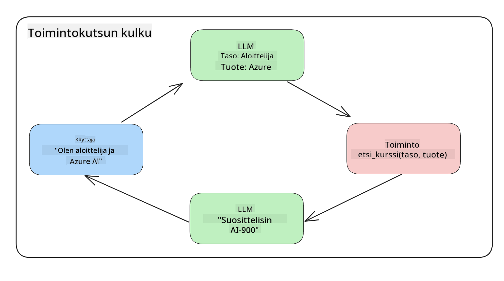

<!--
CO_OP_TRANSLATOR_METADATA:
{
  "original_hash": "f6f84f9ef2d066cd25850cab93580a50",
  "translation_date": "2025-10-17T19:40:00+00:00",
  "source_file": "11-integrating-with-function-calling/README.md",
  "language_code": "fi"
}
-->
# Integrointi funktiokutsujen kanssa

[](https://youtu.be/DgUdCLX8qYQ?si=f1ouQU5HQx6F8Gl2)

Olet oppinut jo paljon aiemmissa oppitunneissa. Kuitenkin voimme parantaa vielä lisää. Joitakin asioita, joita voimme käsitellä, ovat esimerkiksi miten voimme saada johdonmukaisemman vastausmuodon, joka helpottaa vastauksen käsittelyä myöhemmin. Lisäksi voimme haluta lisätä dataa muista lähteistä rikastuttaaksemme sovellustamme.

Tässä luvussa käsitellään edellä mainittuja ongelmia.

## Johdanto

Tämä oppitunti kattaa:

- Selitetään, mitä funktiokutsut ovat ja niiden käyttötapaukset.
- Funktiokutsun luominen Azure OpenAI:n avulla.
- Funktiokutsun integrointi sovellukseen.

## Oppimistavoitteet

Oppitunnin lopussa osaat:

- Selittää funktiokutsujen käytön tarkoituksen.
- Asettaa funktiokutsun Azure OpenAI -palvelun avulla.
- Suunnitella tehokkaita funktiokutsuja sovelluksesi käyttötapaukseen.

## Skenaario: Chatbotin parantaminen funktioilla

Tässä oppitunnissa haluamme rakentaa ominaisuuden koulutusalan startupillemme, joka mahdollistaa käyttäjien löytää teknisiä kursseja chatbotin avulla. Suosittelemme kursseja, jotka sopivat heidän taitotasolleen, nykyiselle roolilleen ja kiinnostuksen kohteena olevalle teknologialle.

Tämän skenaarion toteuttamiseksi käytämme yhdistelmää:

- `Azure OpenAI` luomaan käyttäjälle chat-kokemuksen.
- `Microsoft Learn Catalog API` auttamaan käyttäjiä löytämään kursseja heidän pyyntöjensä perusteella.
- `Funktiokutsut` ottamaan käyttäjän kyselyn ja lähettämään sen funktiolle API-pyynnön tekemiseksi.

Aloitetaan tarkastelemalla, miksi haluaisimme käyttää funktiokutsuja alun perin:

## Miksi funktiokutsut

Ennen funktiokutsuja LLM:n vastaukset olivat jäsentämättömiä ja epäjohdonmukaisia. Kehittäjien piti kirjoittaa monimutkaista validointikoodia varmistaakseen, että he pystyivät käsittelemään vastauksen eri variaatiot. Käyttäjät eivät voineet saada vastauksia, kuten "Mikä on nykyinen sää Tukholmassa?". Tämä johtui siitä, että mallit olivat rajoitettuja siihen aikaan, jolloin data oli koulutettu.

Funktiokutsut ovat Azure OpenAI -palvelun ominaisuus, joka ratkaisee seuraavat rajoitukset:

- **Johdonmukainen vastausmuoto**. Jos voimme paremmin hallita vastausmuotoa, voimme helpommin integroida vastauksen muihin järjestelmiin.
- **Ulkoiset tiedot**. Mahdollisuus käyttää sovelluksen muita lähteitä chat-kontekstissa.

## Ongelman havainnollistaminen skenaarion avulla

> Suosittelemme käyttämään [mukana olevaa notebookia](./python/aoai-assignment.ipynb?WT.mc_id=academic-105485-koreyst), jos haluat suorittaa alla olevan skenaarion. Voit myös vain lukea mukana, sillä pyrimme havainnollistamaan ongelmaa, jossa funktiot voivat auttaa sen ratkaisemisessa.

Tarkastellaan esimerkkiä, joka havainnollistaa vastausmuoto-ongelmaa:

Oletetaan, että haluamme luoda tietokannan opiskelijadatoista, jotta voimme ehdottaa heille sopivia kursseja. Alla on kaksi opiskelijakuvausta, jotka ovat hyvin samankaltaisia sisältämänsä datan suhteen.

1. Luo yhteys Azure OpenAI -resurssiimme:

   ```python
   import os
   import json
   from openai import AzureOpenAI
   from dotenv import load_dotenv
   load_dotenv()

   client = AzureOpenAI(
   api_key=os.environ['AZURE_OPENAI_API_KEY'],  # this is also the default, it can be omitted
   api_version = "2023-07-01-preview"
   )

   deployment=os.environ['AZURE_OPENAI_DEPLOYMENT']
   ```

   Alla on Python-koodia yhteyden määrittämiseksi Azure OpenAI:hin, jossa asetamme `api_type`, `api_base`, `api_version` ja `api_key`.

1. Luo kaksi opiskelijakuvausta käyttäen muuttujia `student_1_description` ja `student_2_description`.

   ```python
   student_1_description="Emily Johnson is a sophomore majoring in computer science at Duke University. She has a 3.7 GPA. Emily is an active member of the university's Chess Club and Debate Team. She hopes to pursue a career in software engineering after graduating."

   student_2_description = "Michael Lee is a sophomore majoring in computer science at Stanford University. He has a 3.8 GPA. Michael is known for his programming skills and is an active member of the university's Robotics Club. He hopes to pursue a career in artificial intelligence after finishing his studies."
   ```

   Haluamme lähettää yllä olevat opiskelijakuvaukset LLM:lle datan jäsentämiseksi. Tämä data voidaan myöhemmin käyttää sovelluksessamme ja lähettää API:lle tai tallentaa tietokantaan.

1. Luodaan kaksi identtistä kehotetta, joissa ohjeistamme LLM:ää, mitä tietoa olemme kiinnostuneita saamaan:

   ```python
   prompt1 = f'''
   Please extract the following information from the given text and return it as a JSON object:

   name
   major
   school
   grades
   club

   This is the body of text to extract the information from:
   {student_1_description}
   '''

   prompt2 = f'''
   Please extract the following information from the given text and return it as a JSON object:

   name
   major
   school
   grades
   club

   This is the body of text to extract the information from:
   {student_2_description}
   '''
   ```

   Yllä olevat kehotteet ohjeistavat LLM:ää poimimaan tietoa ja palauttamaan vastauksen JSON-muodossa.

1. Kun kehotteet ja yhteys Azure OpenAI:hin on asetettu, lähetämme kehotteet LLM:lle käyttämällä `openai.ChatCompletion`. Tallennamme kehotteen muuttujaan `messages` ja määritämme roolin `user`. Tämä jäljittelee käyttäjän kirjoittamaa viestiä chatbotille.

   ```python
   # response from prompt one
   openai_response1 = client.chat.completions.create(
   model=deployment,
   messages = [{'role': 'user', 'content': prompt1}]
   )
   openai_response1.choices[0].message.content

   # response from prompt two
   openai_response2 = client.chat.completions.create(
   model=deployment,
   messages = [{'role': 'user', 'content': prompt2}]
   )
   openai_response2.choices[0].message.content
   ```

Nyt voimme lähettää molemmat pyynnöt LLM:lle ja tarkastella saamaamme vastausta löytämällä sen esimerkiksi näin: `openai_response1['choices'][0]['message']['content']`.

1. Lopuksi voimme muuntaa vastauksen JSON-muotoon kutsumalla `json.loads`:

   ```python
   # Loading the response as a JSON object
   json_response1 = json.loads(openai_response1.choices[0].message.content)
   json_response1
   ```

   Vastaus 1:

   ```json
   {
     "name": "Emily Johnson",
     "major": "computer science",
     "school": "Duke University",
     "grades": "3.7",
     "club": "Chess Club"
   }
   ```

   Vastaus 2:

   ```json
   {
     "name": "Michael Lee",
     "major": "computer science",
     "school": "Stanford University",
     "grades": "3.8 GPA",
     "club": "Robotics Club"
   }
   ```

   Vaikka kehotteet ovat samat ja kuvaukset ovat samankaltaisia, näemme `Grades`-ominaisuuden arvot eri tavalla muotoiltuina, kuten `3.7` tai `3.7 GPA`.

   Tämä tulos johtuu siitä, että LLM ottaa jäsentämätöntä dataa kirjoitetun kehotteen muodossa ja palauttaa myös jäsentämätöntä dataa. Meidän täytyy saada jäsennelty muoto, jotta tiedämme, mitä odottaa, kun tallennamme tai käytämme tätä dataa.

Kuinka sitten ratkaista muotoiluongelma? Käyttämällä funktiokutsuja voimme varmistaa, että saamme takaisin jäsenneltyä dataa. Funktiokutsuja käytettäessä LLM ei itse asiassa kutsu tai suorita mitään funktioita. Sen sijaan luomme rakenteen, jota LLM noudattaa vastauksissaan. Käytämme näitä jäsenneltyjä vastauksia tietääksemme, mitä funktiota sovelluksissamme tulee suorittaa.



Voimme sitten ottaa funktiosta palautetun tiedon ja lähettää sen takaisin LLM:lle. LLM vastaa sitten luonnollisella kielellä käyttäjän kyselyyn.

## Funktiokutsujen käyttötapaukset

Funktiokutsut voivat parantaa sovellustasi monin eri tavoin, kuten:

- **Ulkoisten työkalujen kutsuminen**. Chatbotit ovat erinomaisia vastaamaan käyttäjien kysymyksiin. Funktiokutsujen avulla chatbotit voivat käyttää käyttäjien viestejä tiettyjen tehtävien suorittamiseen. Esimerkiksi opiskelija voi pyytää chatbotia "Lähetä sähköposti opettajalleni, jossa sanon tarvitsevani lisää apua tässä aiheessa". Tämä voi tehdä funktiokutsun `send_email(to: string, body: string)`.

- **API- tai tietokantakyselyjen luominen**. Käyttäjät voivat löytää tietoa luonnollisella kielellä, joka muunnetaan jäsenneltyyn kyselyyn tai API-pyyntöön. Esimerkkinä opettaja voi pyytää "Ketkä opiskelijat suorittivat viimeisen tehtävän", joka voisi kutsua funktiota nimeltä `get_completed(student_name: string, assignment: int, current_status: string)`.

- **Jäsennellyn datan luominen**. Käyttäjät voivat ottaa tekstilohkon tai CSV:n ja käyttää LLM:ää tärkeän tiedon poimimiseen siitä. Esimerkiksi opiskelija voi muuntaa Wikipedia-artikkelin rauhansopimuksista AI-muistikorteiksi. Tämä voidaan tehdä käyttämällä funktiota `get_important_facts(agreement_name: string, date_signed: string, parties_involved: list)`.

## Ensimmäisen funktiokutsun luominen

Funktiokutsun luominen sisältää kolme päävaihetta:

1. **Kutsuminen** Chat Completion API:ta funktioiden listalla ja käyttäjän viestillä.
2. **Lukeminen** mallin vastauksesta toiminnon suorittamiseksi, kuten funktion tai API-pyynnön suorittaminen.
3. **Tekeminen** uusi kutsu Chat Completion API:lle funktion vastauksen kanssa, jotta voidaan luoda vastaus käyttäjälle.


### Vaihe 1 - viestien luominen

Ensimmäinen vaihe on luoda käyttäjän viesti. Tämä voidaan määrittää dynaamisesti ottamalla tekstisyötteen arvo tai määrittämällä arvo tässä. Jos tämä on ensimmäinen kerta, kun työskentelet Chat Completion API:n kanssa, meidän täytyy määritellä viestin `role` ja `content`.

`Role` voi olla joko `system` (sääntöjen luominen), `assistant` (malli) tai `user` (loppukäyttäjä). Funktiokutsuja varten määritämme tämän `user`-rooliksi ja annamme esimerkkikysymyksen.

```python
messages= [ {"role": "user", "content": "Find me a good course for a beginner student to learn Azure."} ]
```

Määrittämällä eri rooleja tehdään LLM:lle selväksi, onko kyseessä järjestelmän vai käyttäjän viesti, mikä auttaa rakentamaan keskusteluhistoriaa, jota LLM voi hyödyntää.

### Vaihe 2 - funktioiden luominen

Seuraavaksi määrittelemme funktion ja sen parametrit. Käytämme tässä vain yhtä funktiota nimeltä `search_courses`, mutta voit luoda useita funktioita.

> **Tärkeää**: Funktiot sisältyvät LLM:lle lähetettävään järjestelmäviestiin ja ne kuluttavat käytettävissä olevia tokeneita.

Alla luomme funktiot taulukoksi, jossa jokainen kohde on funktio ja sillä on ominaisuudet `name`, `description` ja `parameters`:

```python
functions = [
   {
      "name":"search_courses",
      "description":"Retrieves courses from the search index based on the parameters provided",
      "parameters":{
         "type":"object",
         "properties":{
            "role":{
               "type":"string",
               "description":"The role of the learner (i.e. developer, data scientist, student, etc.)"
            },
            "product":{
               "type":"string",
               "description":"The product that the lesson is covering (i.e. Azure, Power BI, etc.)"
            },
            "level":{
               "type":"string",
               "description":"The level of experience the learner has prior to taking the course (i.e. beginner, intermediate, advanced)"
            }
         },
         "required":[
            "role"
         ]
      }
   }
]
```

Kuvaillaan jokainen funktioinstanssi tarkemmin alla:

- `name` - Funktiolle annettava nimi, joka halutaan kutsua.
- `description` - Kuvaus siitä, miten funktio toimii. Tässä on tärkeää olla tarkka ja selkeä.
- `parameters` - Lista arvoista ja muodosta, jonka haluat mallin tuottavan vastauksessaan. Parametrit-taulukko koostuu kohteista, joilla on seuraavat ominaisuudet:
  1.  `type` - Ominaisuuksien tallennustyyppi.
  1.  `properties` - Lista erityisistä arvoista, joita malli käyttää vastauksessaan.
      1. `name` - Avain on ominaisuuden nimi, jota malli käyttää jäsennellyssä vastauksessaan, esimerkiksi `product`.
      1. `type` - Ominaisuuden tietotyyppi, esimerkiksi `string`.
      1. `description` - Kuvaus tietystä ominaisuudesta.

Lisäksi on olemassa valinnainen ominaisuus `required` - vaadittu ominaisuus funktiokutsun suorittamiseksi.

### Vaihe 3 - Funktiokutsun tekeminen

Kun funktio on määritelty, meidän täytyy sisällyttää se Chat Completion API -kutsuun. Teemme tämän lisäämällä `functions` pyyntöön. Tässä tapauksessa `functions=functions`.

On myös mahdollista asettaa `function_call` arvoksi `auto`. Tämä tarkoittaa, että annamme LLM:n päättää, mitä funktiota tulisi kutsua käyttäjän viestin perusteella sen sijaan, että määrittäisimme sen itse.

Alla on koodia, jossa kutsumme `ChatCompletion.create`. Huomaa, miten asetamme `functions=functions` ja `function_call="auto"` ja annamme näin LLM:lle valinnan, milloin kutsua tarjoamiamme funktioita:

```python
response = client.chat.completions.create(model=deployment,
                                        messages=messages,
                                        functions=functions,
                                        function_call="auto")

print(response.choices[0].message)
```

Vastaus näyttää nyt tältä:

```json
{
  "role": "assistant",
  "function_call": {
    "name": "search_courses",
    "arguments": "{\n  \"role\": \"student\",\n  \"product\": \"Azure\",\n  \"level\": \"beginner\"\n}"
  }
}
```

Tässä näemme, miten funktio `search_courses` kutsuttiin ja millä argumenteilla, kuten `arguments`-ominaisuudessa JSON-vastauksessa on listattu.

LLM pystyi löytämään datan, joka sopii funktion argumentteihin, kun se poimi sen arvosta, joka annettiin `messages`-parametrille chat completion -kutsussa. Alla muistutus `messages`-arvosta:

```python
messages= [ {"role": "user", "content": "Find me a good course for a beginner student to learn Azure."} ]
```

Kuten näet, `student`, `Azure` ja `beginner` poimittiin `messages`-arvosta ja asetettiin funktion syötteeksi. Funktioiden käyttäminen tällä tavalla on erinomainen tapa poimia tietoa kehotteesta, mutta myös tarjota rakenne LLM:lle ja saada uudelleenkäytettävää toiminnallisuutta.

Seuraavaksi meidän täytyy nähdä, miten voimme käyttää tätä sovelluksessamme.

## Funktiokutsujen integrointi sovellukseen

Kun olemme testanneet LLM:n jäsennellyn vastauksen, voimme nyt integroida tämän sovellukseemme.

### Prosessin hallinta

Integrointi sovellukseen tapahtuu seuraavilla vaiheilla:

1. Ensiksi tehdään kutsu OpenAI-palveluihin ja tallennetaan viesti muuttujaan nimeltä `response_message`.

   ```python
   response_message = response.choices[0].message
   ```

1. Nyt määritellään funktio, joka kutsuu Microsoft Learn API:ta saadakseen kurssilistan:

   ```python
   import requests

   def search_courses(role, product, level):
     url = "https://learn.microsoft.com/api/catalog/"
     params = {
        "role": role,
        "product": product,
        "level": level
     }
     response = requests.get(url, params=params)
     modules = response.json()["modules"]
     results = []
     for module in modules[:5]:
        title = module["title"]
        url = module["url"]
        results.append({"title": title, "url": url})
     return str(results)
   ```

   Huomaa, miten nyt luomme todellisen Python-funktion, joka vastaa `functions`-muuttujassa esiteltyjä funktioiden nimiä. Teemme myös todellisia ulkoisia API-kutsuja saadaksemme tarvitsemamme datan. Tässä tapauksessa käytämme Microsoft Learn API:ta koulutusmoduulien etsimiseen.

Ok, joten loimme `functions`-muuttujan ja vastaavan Python-funktion, mutta miten kerromme LLM:lle, miten nämä kaksi yhdistetään, jotta Python-funktiomme kutsutaan?

1. Tarkistaaksemme, tarvitseeko Python-funktiota kutsua, meidän täytyy tarkastella LLM:n vastausta ja nähdä, onko siinä `function_call` ja kutsua osoitettu funktio. Alla on esimerkki, miten voit tehdä mainitun tarkistuksen:

   ```python
   # Check if the model wants to call a function
   if response_message.function_call.name:
    print("Recommended Function call:")
    print(response_message.function_call.name)
    print()

    # Call the function.
    function_name = response_message.function_call.name

    available_functions = {
            "search_courses": search_courses,
    }
    function_to_call = available_functions[function_name]

    function_args = json.loads(response_message.function_call.arguments)
    function_response = function_to_call(**function_args)

    print("Output of function call:")
    print(function_response)
    print(type(function_response))


    # Add the assistant response and function response to the messages
    messages.append( # adding assistant response to messages
        {
            "role": response_message.role,
            "function_call": {
                "name": function_name,
                "arguments": response_message.function_call.arguments,
            },
            "content": None
        }
    )
    messages.append( # adding function response to messages
        {
            "role": "function",
            "name": function_name,
            "content":function_response,
        }
    )
   ```

   Nämä kolme riviä varmistavat, että poimimme funktion nimen, argumentit ja teemme kutsun:

   ```python
   function_to_call = available_functions[function_name]

   function_args = json.loads(response_message.function_call.arguments)
   function_response = function_to_call(**function_args)
   ```

   Alla on tulos koodimme suorittamisesta:

   **Tulos**

   ```Recommended Function call:
   {
     "name": "search_courses",
     "arguments": "{\n  \"role\": \"student\",\n  \"product\": \"Azure\",\n  \"level\": \"beginner\"\n}"
   }

   Output of function call:
   [{'title': 'Describe concepts of cryptography', 'url': 'https://learn.microsoft.com/training/modules/describe-concepts-of-cryptography/?
   WT.mc_id=api_CatalogApi'}, {'title': 'Introduction to audio classification with TensorFlow', 'url': 'https://learn.microsoft.com/en-
   us/training/modules/intro-audio-classification-tensorflow/?WT.mc_id=api_CatalogApi'}, {'title': 'Design a Performant Data Model in Azure SQL
   Database with Azure Data Studio', 'url': 'https://learn.microsoft.com/training/modules/design-a-data-model-with-ads/?
   WT.mc_id=api_CatalogApi'}, {'title': 'Getting started with the Microsoft Cloud Adoption Framework for Azure', 'url':
   'https://learn.microsoft.com/training/modules/cloud-adoption-framework-getting-started/?WT.mc_id=api_CatalogApi'}, {'title': 'Set up the
   Rust development environment', 'url': 'https://learn.microsoft.com/training/modules/rust-set-up-environment/?WT.mc_id=api_CatalogApi'}]
   <class 'str'>
   ```

1. Nyt lähetämme päivitetyn viestin, `messages`, LLM:lle, jotta voimme saada luonnollisen kielen vastauksen API:n JSON-muotoisen vastauksen sijaan.

   ```python
   print("Messages in next request:")
   print(messages)
   print()

   second_response = client.chat.completions.create(
      messages=messages,
      model=deployment,
      function_call="auto",
      functions=functions,
      temperature=0
         )  # get a new response from GPT where it can see the function response


   print(second_response.choices[0].message)
   ```

   **Tulos**

   ```python
   {
     "role": "assistant",
     "content": "I found some good courses for beginner students to learn Azure:\n\n1. [Describe concepts of cryptography] (https://learn.microsoft.com/training/modules/describe-concepts-of-cryptography/?WT.mc_id=api_CatalogApi)\n2. [Introduction to audio classification with TensorFlow](https://learn.microsoft.com/training/modules/intro-audio-classification-tensorflow/?WT.mc_id=api_CatalogApi)\n3. [Design a Performant Data Model in Azure SQL Database with Azure Data Studio](https://learn.microsoft.com/training/modules/design-a-data-model-with-ads/?WT.mc_id=api_CatalogApi)\n4. [Getting started with the Microsoft Cloud Adoption Framework for Azure](https://learn.microsoft.com/training/modules/cloud-adoption-framework-getting-started/?WT.mc_id=api_CatalogApi)\n5. [Set up the Rust development environment](https://learn.microsoft.com/training/modules/rust-set-up-environment/?WT.mc_id=api_CatalogApi)\n\nYou can click on the links to access the courses."
   }

   ```

## Tehtävä

Jatkaaksesi Azure OpenAI Funktiokutsujen oppimista voit rakentaa:

- Lisää funktion parametreja, jotka voivat auttaa oppijoita löytämään enemmän kursseja.
- Luo toinen funktiokutsu, joka ottaa enemmän tietoa oppijalta, kuten heidän äidinkielensä.
- Luo virheenkäsittely, kun funktiokutsu ja/tai API-kutsu ei palauta sopivia kursseja

Vinkki: Tutustu [Learn API -viitedokumentaatio](https://learn.microsoft.com/training/support/catalog-api-developer-reference?WT.mc_id=academic-105485-koreyst) -sivuun nähdäksesi, miten ja mistä nämä tiedot ovat saatavilla.

## Hienoa työtä! Jatka matkaa

Tämän oppitunnin jälkeen tutustu [Generatiivisen tekoälyn oppimiskokoelmaan](https://aka.ms/genai-collection?WT.mc_id=academic-105485-koreyst) jatkaaksesi generatiivisen tekoälyn tietämyksesi kehittämistä!

Siirry oppituntiin 12, jossa tarkastelemme, miten [suunnitella UX tekoälysovelluksille](../12-designing-ux-for-ai-applications/README.md?WT.mc_id=academic-105485-koreyst)!

---

**Vastuuvapauslauseke**:  
Tämä asiakirja on käännetty käyttämällä tekoälypohjaista käännöspalvelua [Co-op Translator](https://github.com/Azure/co-op-translator). Vaikka pyrimme tarkkuuteen, huomioithan, että automaattiset käännökset voivat sisältää virheitä tai epätarkkuuksia. Alkuperäinen asiakirja sen alkuperäisellä kielellä tulisi pitää ensisijaisena lähteenä. Kriittisen tiedon osalta suositellaan ammattimaista ihmiskäännöstä. Emme ole vastuussa väärinkäsityksistä tai virhetulkinnoista, jotka johtuvat tämän käännöksen käytöstä.