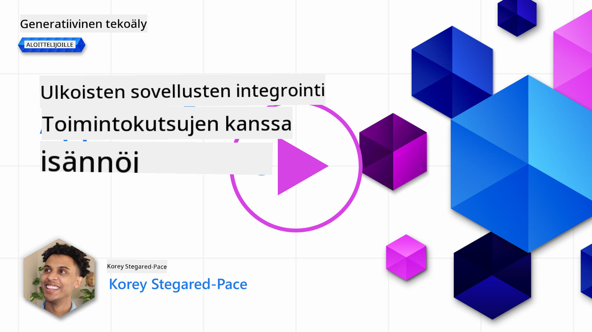
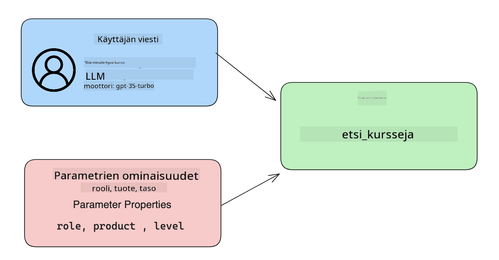

<!--
CO_OP_TRANSLATOR_METADATA:
{
  "original_hash": "77a48a201447be19aa7560706d6f93a0",
  "translation_date": "2025-07-09T14:36:50+00:00",
  "source_file": "11-integrating-with-function-calling/README.md",
  "language_code": "fi"
}
-->
# Integrointi funktiokutsujen kanssa

[](https://aka.ms/gen-ai-lesson11-gh?WT.mc_id=academic-105485-koreyst)

Olet oppinut jo melko paljon aiemmissa oppitunneissa. Voimme kuitenkin vielä parantaa. Joitakin asioita, joita voimme kehittää, ovat esimerkiksi se, miten saamme vastaukset yhtenäisempään muotoon, jotta niiden käsittely jälkikäteen olisi helpompaa. Lisäksi saatamme haluta lisätä tietoa muista lähteistä rikastuttaaksemme sovellustamme entisestään.

Edellä mainitut ongelmat ovat tämän luvun keskiössä.

## Johdanto

Tässä oppitunnissa käsitellään:

- Mitä funktiokutsu tarkoittaa ja missä sitä käytetään.
- Funktiokutsun luominen Azure OpenAI:n avulla.
- Kuinka integroida funktiokutsu sovellukseen.

## Oppimistavoitteet

Oppitunnin lopussa osaat:

- Selittää funktiokutsujen käytön tarkoituksen.
- Määrittää Function Callin Azure OpenAI -palvelussa.
- Suunnitella tehokkaita funktiokutsuja sovelluksesi käyttötarkoitukseen.

## Tilannekuvaus: Chatbotin parantaminen funktioilla

Tässä oppitunnissa haluamme rakentaa ominaisuuden koulutusstartupillemme, joka mahdollistaa käyttäjien löytää teknisiä kursseja chatbotin avulla. Suosittelemme kursseja, jotka sopivat heidän taitotasoonsa, nykyiseen rooliinsa ja kiinnostuksen kohteena olevaan teknologiaan.

Tämän tilanteen toteuttamiseksi käytämme yhdistelmää:

- `Azure OpenAI` luomaan käyttäjälle chat-kokemuksen.
- `Microsoft Learn Catalog API` auttamaan käyttäjiä löytämään kursseja käyttäjän pyynnön perusteella.
- `Function Calling` ottamaan käyttäjän kyselyn ja lähettämään sen funktiolle API-kutsua varten.

Aloitetaan katsomalla, miksi haluamme käyttää funktiokutsuja ylipäätään:

## Miksi funktiokutsuja?

Ennen funktiokutsuja LLM:n vastaukset olivat rakenteettomia ja epäjohdonmukaisia. Kehittäjien piti kirjoittaa monimutkaista validointikoodia, jotta he pystyivät käsittelemään kaikki mahdolliset vastausmuunnelmat. Käyttäjät eivät voineet saada vastauksia esimerkiksi kysymykseen "Mikä on tämänhetkinen sää Tukholmassa?". Tämä johtui siitä, että mallit rajoittuivat koulutusdataan, joka oli käytettävissä koulutushetkellä.

Function Calling on Azure OpenAI -palvelun ominaisuus, joka auttaa voittamaan seuraavat rajoitukset:

- **Yhtenäinen vastausmuoto**. Jos voimme paremmin hallita vastausten muotoa, voimme helpommin integroida vastaukset muihin järjestelmiin.
- **Ulkoiset tiedot**. Mahdollisuus käyttää sovelluksen muita tietolähteitä chat-kontekstissa.

## Ongelman havainnollistaminen esimerkin avulla

> Suosittelemme käyttämään [mukaan sisältyvää muistikirjaa](../../../11-integrating-with-function-calling/python/aoai-assignment.ipynb), jos haluat kokeilla alla olevaa tilannetta itse. Voit myös vain lukea eteenpäin, kun yritämme havainnollistaa ongelmaa, johon funktiot voivat tarjota ratkaisun.

Katsotaan esimerkkiä, joka havainnollistaa vastausmuodon ongelmaa:

Oletetaan, että haluamme luoda opiskelijatietokannan, jotta voimme ehdottaa heille sopivia kursseja. Alla on kaksi opiskelijakuvausta, jotka ovat hyvin samankaltaisia sisällöltään.

1. Luo yhteys Azure OpenAI -resurssiimme:

   ```python
   import os
   import json
   from openai import AzureOpenAI
   from dotenv import load_dotenv
   load_dotenv()

   client = AzureOpenAI(
   api_key=os.environ['AZURE_OPENAI_API_KEY'],  # this is also the default, it can be omitted
   api_version = "2023-07-01-preview"
   )

   deployment=os.environ['AZURE_OPENAI_DEPLOYMENT']
   ```

   Alla on Python-koodia, jolla määritämme yhteyden Azure OpenAI:hin asettamalla `api_type`, `api_base`, `api_version` ja `api_key`.

1. Luodaan kaksi opiskelijakuvausta muuttujilla `student_1_description` ja `student_2_description`.

   ```python
   student_1_description="Emily Johnson is a sophomore majoring in computer science at Duke University. She has a 3.7 GPA. Emily is an active member of the university's Chess Club and Debate Team. She hopes to pursue a career in software engineering after graduating."

   student_2_description = "Michael Lee is a sophomore majoring in computer science at Stanford University. He has a 3.8 GPA. Michael is known for his programming skills and is an active member of the university's Robotics Club. He hopes to pursue a career in artificial intelligence after finishing his studies."
   ```

   Haluamme lähettää yllä olevat opiskelijakuvaukset LLM:lle tietojen jäsentämistä varten. Näitä tietoja voidaan myöhemmin käyttää sovelluksessamme ja lähettää API:lle tai tallentaa tietokantaan.

1. Luodaan kaksi identtistä kehotetta, joissa ohjeistamme LLM:ää, mitä tietoja haluamme:

   ```python
   prompt1 = f'''
   Please extract the following information from the given text and return it as a JSON object:

   name
   major
   school
   grades
   club

   This is the body of text to extract the information from:
   {student_1_description}
   '''

   prompt2 = f'''
   Please extract the following information from the given text and return it as a JSON object:

   name
   major
   school
   grades
   club

   This is the body of text to extract the information from:
   {student_2_description}
   '''
   ```

   Yllä olevat kehotteet ohjeistavat LLM:ää poimimaan tiedot ja palauttamaan vastauksen JSON-muodossa.

1. Kun kehotteet ja yhteys Azure OpenAI:hin on määritetty, lähetämme kehotteet LLM:lle käyttämällä `openai.ChatCompletion`. Tallennamme kehotteen `messages`-muuttujaan ja asetamme rooliksi `user`. Tämä jäljittelee käyttäjän kirjoittamaa viestiä chatbotille.

   ```python
   # response from prompt one
   openai_response1 = client.chat.completions.create(
   model=deployment,
   messages = [{'role': 'user', 'content': prompt1}]
   )
   openai_response1.choices[0].message.content

   # response from prompt two
   openai_response2 = client.chat.completions.create(
   model=deployment,
   messages = [{'role': 'user', 'content': prompt2}]
   )
   openai_response2.choices[0].message.content
   ```

Nyt voimme lähettää molemmat pyynnöt LLM:lle ja tarkastella saamaamme vastausta hakemalla sen näin: `openai_response1['choices'][0]['message']['content']`.

1. Lopuksi voimme muuntaa vastauksen JSON-muotoon kutsumalla `json.loads`:

   ```python
   # Loading the response as a JSON object
   json_response1 = json.loads(openai_response1.choices[0].message.content)
   json_response1
   ```

   Vastaus 1:

   ```json
   {
     "name": "Emily Johnson",
     "major": "computer science",
     "school": "Duke University",
     "grades": "3.7",
     "club": "Chess Club"
   }
   ```

   Vastaus 2:

   ```json
   {
     "name": "Michael Lee",
     "major": "computer science",
     "school": "Stanford University",
     "grades": "3.8 GPA",
     "club": "Robotics Club"
   }
   ```

   Vaikka kehotteet ovat samat ja kuvaukset samankaltaisia, näemme, että `Grades`-ominaisuuden arvot ovat eri muodoissa, esimerkiksi joskus saamme muodon `3.7` ja toisinaan `3.7 GPA`.

   Tämä johtuu siitä, että LLM ottaa vastaan rakenteetonta dataa kirjoitetun kehotteen muodossa ja palauttaa myös rakenteetonta dataa. Tarvitsemme rakenteellisen muodon, jotta tiedämme, mitä odottaa, kun tallennamme tai käytämme näitä tietoja.

Miten sitten ratkaistaan muotoiluongelma? Käyttämällä funktiokutsuja voimme varmistaa, että saamme rakenteellista dataa takaisin. Funktiokutsujen käytössä LLM ei itse asiassa kutsu tai suorita funktioita. Sen sijaan luomme rakenteen, jota LLM noudattaa vastauksissaan. Käytämme näitä rakenteellisia vastauksia tietääksemme, mitä funktiota sovelluksessamme suoritetaan.


Voimme sitten ottaa funktion palauttaman tiedon ja lähettää sen takaisin LLM:lle. LLM vastaa luonnollisella kielellä käyttäjän kyselyyn.

## Funktiokutsujen käyttötapaukset

Funktiokutsut voivat parantaa sovellustasi monissa eri tilanteissa, kuten:

- **Ulkoisten työkalujen kutsuminen**. Chatbotit ovat hyviä vastaamaan käyttäjien kysymyksiin. Funktiokutsujen avulla chatbotit voivat käyttää käyttäjien viestejä suorittaakseen tiettyjä tehtäviä. Esimerkiksi opiskelija voi pyytää chatbotilta: "Lähetä sähköposti opettajalleni, että tarvitsen lisää apua tässä aiheessa". Tämä voi tehdä funktiokutsun `send_email(to: string, body: string)`.

- **API- tai tietokantakyselyjen luominen**. Käyttäjät voivat löytää tietoa luonnollisella kielellä, joka muunnetaan muotoilluksi kyselyksi tai API-pyynnöksi. Esimerkiksi opettaja voi kysyä: "Ketkä opiskelijat ovat suorittaneet viimeisen tehtävän", mikä voisi kutsua funktiota `get_completed(student_name: string, assignment: int, current_status: string)`.

- **Rakenteellisen datan luominen**. Käyttäjät voivat ottaa tekstilohkon tai CSV-tiedoston ja käyttää LLM:ää poimiakseen siitä tärkeitä tietoja. Esimerkiksi opiskelija voi muuntaa Wikipedia-artikkelin rauhansopimuksista tekoälymuistilapuiksi. Tämä voidaan tehdä funktiolla `get_important_facts(agreement_name: string, date_signed: string, parties_involved: list)`.

## Ensimmäisen funktiokutsun luominen

Funktiokutsun luominen sisältää kolme päävaihetta:

1. **Kutsutaan** Chat Completions API:ta funktiolistalla ja käyttäjän viestillä.
2. **Luetaan** mallin vastaus ja suoritetaan toiminto, eli kutsutaan funktiota tai API:a.
3. **Tehdään** toinen kutsu Chat Completions API:lle funktion vastauksella, jotta voimme luoda vastauksen käyttäjälle.



### Vaihe 1 – viestien luominen

Ensimmäinen vaihe on luoda käyttäjän viesti. Tämä voidaan määrittää dynaamisesti tekstikentän arvosta tai voit asettaa arvon suoraan tässä. Jos työskentelet Chat Completions API:n kanssa ensimmäistä kertaa, sinun täytyy määrittää viestin `role` ja `content`.

`role` voi olla joko `system` (sääntöjen luominen), `assistant` (malli) tai `user` (loppukäyttäjä). Funktiokutsujen yhteydessä asetamme tämän `user`-rooliksi ja annamme esimerkkikysymyksen.

```python
messages= [ {"role": "user", "content": "Find me a good course for a beginner student to learn Azure."} ]
```

Eri roolien määrittäminen auttaa LLM:ää ymmärtämään, onko viestin lähettäjä järjestelmä vai käyttäjä, mikä auttaa rakentamaan keskusteluhistoriaa, johon LLM voi tukeutua.

### Vaihe 2 – funktioiden luominen

Seuraavaksi määrittelemme funktion ja sen parametrit. Käytämme tässä vain yhtä funktiota nimeltä `search_courses`, mutta voit luoda useita funktioita.

> **Important** : Funktiot sisällytetään LLM:lle lähetettävään järjestelmäviestiin, ja ne vaikuttavat käytettävissä olevien tokenien määrään.

Alla luomme funktiot taulukkona. Jokainen kohde on funktio, jolla on ominaisuudet `name`, `description` ja `parameters`:

```python
functions = [
   {
      "name":"search_courses",
      "description":"Retrieves courses from the search index based on the parameters provided",
      "parameters":{
         "type":"object",
         "properties":{
            "role":{
               "type":"string",
               "description":"The role of the learner (i.e. developer, data scientist, student, etc.)"
            },
            "product":{
               "type":"string",
               "description":"The product that the lesson is covering (i.e. Azure, Power BI, etc.)"
            },
            "level":{
               "type":"string",
               "description":"The level of experience the learner has prior to taking the course (i.e. beginner, intermediate, advanced)"
            }
         },
         "required":[
            "role"
         ]
      }
   }
]
```

Kuvaillaan funktioiden osat tarkemmin:

- `name` – Funktion nimi, jota haluamme kutsua.
- `description` – Kuvaus siitä, miten funktio toimii. Tässä on tärkeää olla selkeä ja täsmällinen.
- `parameters` – Lista arvoista ja muodosta, jonka mallin haluamme tuottavan vastauksessaan. Parametrit-taulukko sisältää kohteita, joilla on seuraavat ominaisuudet:
  1. `type` – Tietotyyppi, johon ominaisuudet tallennetaan.
  2. `properties` – Lista erityisistä arvoista, joita malli käyttää vastauksessaan.
      1. `name` – Ominaisuuden nimi, jota malli käyttää muotoillussa vastauksessa, esimerkiksi `product`.
      2. `type` – Ominaisuuden tietotyyppi, esimerkiksi `string`.
      3. `description` – Kuvaus kyseisestä ominaisuudesta.

Lisäksi on valinnainen ominaisuus `required` – pakolliset kentät, jotta funktiokutsu voidaan suorittaa.

### Vaihe 3 – funktiokutsun tekeminen

Funktion määrittämisen jälkeen meidän täytyy sisällyttää se Chat Completion API -kutsuun. Teemme tämän lisäämällä `functions` pyyntöön. Tässä tapauksessa `functions=functions`.

Voimme myös asettaa `function_call` arvoksi `auto`. Tämä tarkoittaa, että annamme LLM:n päättää, mikä funktio kutsutaan käyttäjän viestin perusteella sen sijaan, että määrittäisimme sen itse.

Alla on koodiesimerkki, jossa kutsutaan `ChatCompletion.create`. Huomaa, että asetamme `functions=functions` ja `function_call="auto"`, jolloin LLM saa päättää, milloin funktiot kutsutaan:

```python
response = client.chat.completions.create(model=deployment,
                                        messages=messages,
                                        functions=functions,
                                        function_call="auto")

print(response.choices[0].message)
```

Vastaus näyttää nyt tältä:

```json
{
  "role": "assistant",
  "function_call": {
    "name": "search_courses",
    "arguments": "{\n  \"role\": \"student\",\n  \"product\": \"Azure\",\n  \"level\": \"beginner\"\n}"
  }
}
```

Tässä näemme, miten funktio `search_courses` kutsuttiin ja millä argumenteilla, jotka löytyvät JSON-vastauksen `arguments`-ominaisuudesta.

Johtopäätös on, että LLM pystyi löytämään tiedot, jotka sopivat funktion argumentteihin, koska se poimi ne `messages`-parametriin annetusta arvosta chat completion -kutsussa. Alla muistutus `messages`-arvosta:

```python
messages= [ {"role": "user", "content": "Find me a good course for a beginner student to learn Azure."} ]
```

Kuten näet, `student`, `Azure` ja `beginner` poimittiin `messages`-arvosta ja asetettiin funktion syötteeksi. Funktioiden käyttäminen tällä tavalla on erinomainen tapa poimia tietoa kehotteesta, mutta myös tarjota rakennetta LLM:lle ja saada uudelleenkäytettävää toiminnallisuutta.

Seuraavaksi katsotaan, miten tätä voidaan käyttää sovelluksessamme.

## Funktiokutsujen integrointi sovellukseen

Kun olemme testanneet LLM:n muotoillun vastauksen, voimme nyt integroida sen sovellukseen.

### Virran hallinta

Integrointia varten teemme seuraavat vaiheet:

1. Tehdään ensin kutsu OpenAI-palveluihin ja tallennetaan viesti muuttujaan `response_message`.

   ```python
   response_message = response.choices[0].message
   ```

1. Määritellään funktio, joka kutsuu Microsoft Learn API:a saadakseen listan kursseista:

   ```python
   import requests

   def search_courses(role, product, level):
     url = "https://learn.microsoft.com/api/catalog/"
     params = {
        "role": role,
        "product": product,
        "level": level
     }
     response = requests.get(url, params=params)
     modules = response.json()["modules"]
     results = []
     for module in modules[:5]:
        title = module["title"]
        url = module["url"]
        results.append({"title": title, "url": url})
     return str(results)
   ```

   Huomaa, että luomme nyt oikean Python-funktion, joka vastaa `functions`-muuttujassa määriteltyjä funktioita. Teemme myös oikeita ulkoisia API-kutsuja hakemaan tarvitsemamme tiedot. Tässä tapauksessa haemme Microsoft Learn API:sta koulutusmoduuleja.

Ok, loimme `functions`-muuttujan ja vastaavan Python-funktion, miten kerromme LLM:lle, miten nämä yhdistetään, jotta Python-funktiomme kutsutaan?

1. Tarkistaaksemme, pitääkö Python-funktio kutsua, katsomme LLM:n vastausta ja tarkistamme, onko siinä `function_call`-kenttä, ja kutsumme osoitettua funktiota. Näin voit tehdä tarkistuksen:

   ```python
   # Check if the model wants to call a function
   if response_message.function_call.name:
    print("Recommended Function call:")
    print(response_message.function_call.name)
    print()

    # Call the function.
    function_name = response_message.function_call.name

    available_functions = {
            "search_courses": search_courses,
    }
    function_to_call = available_functions[function_name]

    function_args = json.loads(response_message.function_call.arguments)
    function_response = function_to_call(**function_args)

    print("Output of function call:")
    print(function_response)
    print(type(function_response))


    # Add the assistant response and function response to the messages
    messages.append( # adding assistant response to messages
        {
            "role": response_message.role,
            "function_call": {
                "name": function_name,
                "arguments": response_message.function_call.arguments,
            },
            "content": None
        }
    )
    messages.append( # adding function response to messages
        {
            "role": "function",
            "name": function_name,
            "content":function_response,
        }
    )
   ```

   Nämä kolme riviä varmistavat, että saamme funktion nimen, argumentit ja teemme kutsun:

   ```python
   function_to_call = available_functions[function_name]

   function_args = json.loads(response_message.function_call.arguments)
   function_response = function_to_call(**function_args)
   ```

   Alla on tuloste koodin suorittamisesta:

   **Output**

   ```Recommended Function call:
   {
     "name": "search_courses",
     "arguments": "{\n  \"role\": \"student\",\n  \"product\": \"Azure\",\n  \"level\": \"beginner\"\n}"
   }

   Output of function call:
   [{'title': 'Describe concepts of cryptography', 'url': 'https://learn.microsoft.com/training/modules/describe-concepts-of-cryptography/?
   WT.mc_id=api_CatalogApi'}, {'title': 'Introduction to audio classification with TensorFlow', 'url': 'https://learn.microsoft.com/en-
   us/training/modules/intro-audio-classification-tensorflow/?WT.mc_id=api_CatalogApi'}, {'title': 'Design a Performant Data Model in Azure SQL
   Database with Azure Data Studio', 'url': 'https://learn.microsoft.com/training/modules/design-a-data-model-with-ads/?
   WT.mc_id=api_CatalogApi'}, {'title': 'Getting started with the Microsoft Cloud Adoption Framework for Azure', 'url':
   'https://learn.microsoft.com/training/modules/cloud-adoption-framework-getting-started/?WT.mc_id=api_CatalogApi'}, {'title': 'Set up the
   Rust development environment', 'url': 'https://learn.microsoft.com/training/modules/rust-set-up-environment/?WT.mc_id=api_CatalogApi'}]
   <class 'str'>
   ```

1. Lähetämme nyt päivitetyn viestin, `messages`, LLM:lle, jotta saamme luonnollisen kielen vastauksen API:n JSON-muotoisen vastauksen sijaan.

   ```python
   print("Messages in next request:")
   print(messages)
   print()

   second_response = client.chat.completions.create(
      messages=messages,
      model=deployment,
      function_call="auto",
      functions=functions,
      temperature=0
         )  # get a new response from GPT where it can see the function response


   print(second_response.choices[0].message)
   ```

   **Output**

   ```python
   {
     "role": "assistant",
     "content": "I found some good courses for beginner students to learn Azure:\n\n1. [Describe concepts of cryptography] (https://learn.microsoft.com/training/modules/describe-concepts-of-cryptography/?WT.mc_id=api_CatalogApi)\n2. [Introduction to audio classification with TensorFlow](https://learn.microsoft.com/training/modules/intro-audio-classification-tensorflow/?WT.mc_id=api_CatalogApi)\n3. [Design a Performant Data Model in Azure SQL Database with Azure Data Studio](https://learn.microsoft.com/training/modules/design-a-data-model-with-ads/?WT.mc_id=api_CatalogApi)\n4. [Getting started with the Microsoft Cloud Adoption Framework for Azure](https://learn.microsoft.com/training/modules/cloud-adoption-framework-getting-started/?WT.mc_id=api_CatalogApi)\n5. [Set up the Rust development environment](https://learn.microsoft.com/training/modules/rust-set-up-environment/?WT.mc_id=api_CatalogApi)\n\nYou can click on the links to access the courses."
   }

   ```

## Tehtävä

Jatkaaksesi Azure OpenAI Function Calling -oppimista voit rakentaa:

- Lisää parametreja funktiolle, jotka auttavat oppijoita löytämään enemmän kursseja.
- Luo toinen funktiokutsu, joka ottaa oppijalta lisää tietoja, kuten äidinkielen.
- Lisää virheenkäsittely, kun funktiokutsu ja/tai API-kutsu ei palauta sopivia kursseja.
## Hienoa työtä! Jatka matkaa

Kun olet suorittanut tämän oppitunnin, tutustu [Generative AI Learning -kokoelmaamme](https://aka.ms/genai-collection?WT.mc_id=academic-105485-koreyst) jatkaaksesi Generative AI -osaamisesi kehittämistä!

Siirry Oppitunnille 12, jossa tarkastelemme, miten [suunnitella UX AI-sovelluksille](../12-designing-ux-for-ai-applications/README.md?WT.mc_id=academic-105485-koreyst)!

**Vastuuvapauslauseke**:  
Tämä asiakirja on käännetty käyttämällä tekoälypohjaista käännöspalvelua [Co-op Translator](https://github.com/Azure/co-op-translator). Vaikka pyrimme tarkkuuteen, huomioithan, että automaattikäännöksissä saattaa esiintyä virheitä tai epätarkkuuksia. Alkuperäistä asiakirjaa sen alkuperäiskielellä tulee pitää virallisena lähteenä. Tärkeissä asioissa suositellaan ammattimaista ihmiskäännöstä. Emme ole vastuussa tämän käännöksen käytöstä aiheutuvista väärinymmärryksistä tai tulkinnoista.