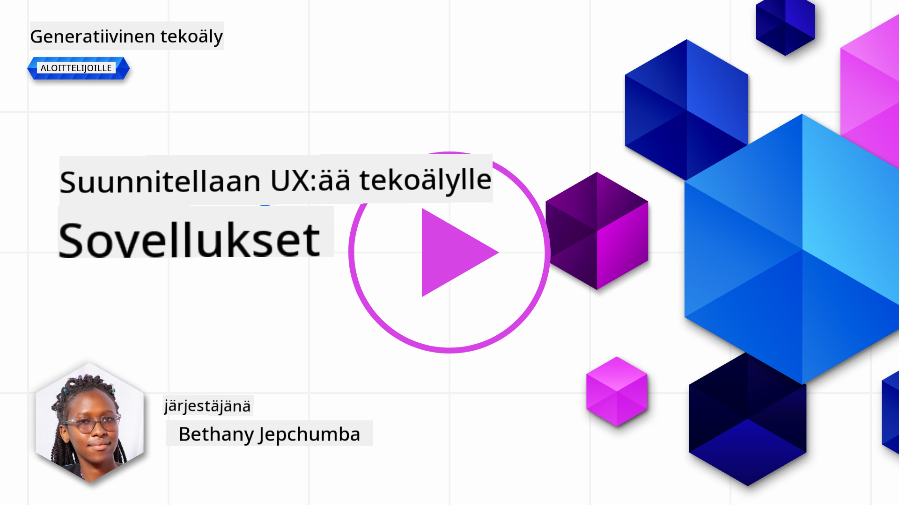
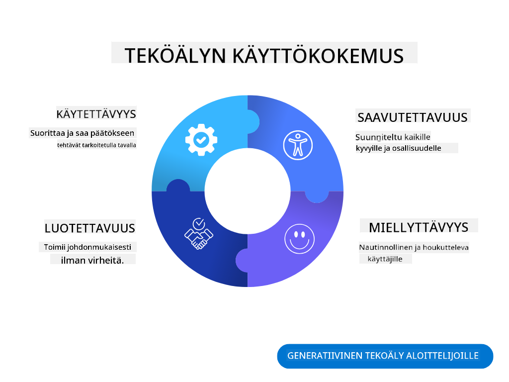
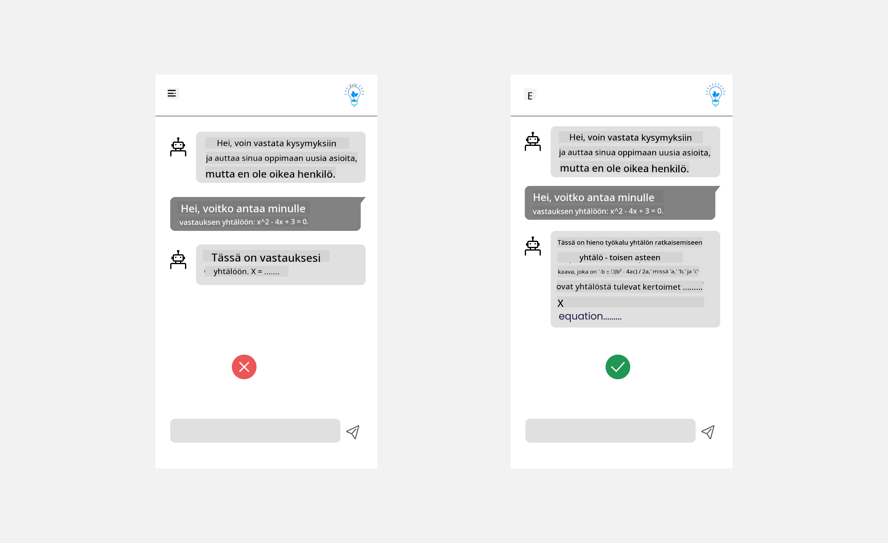
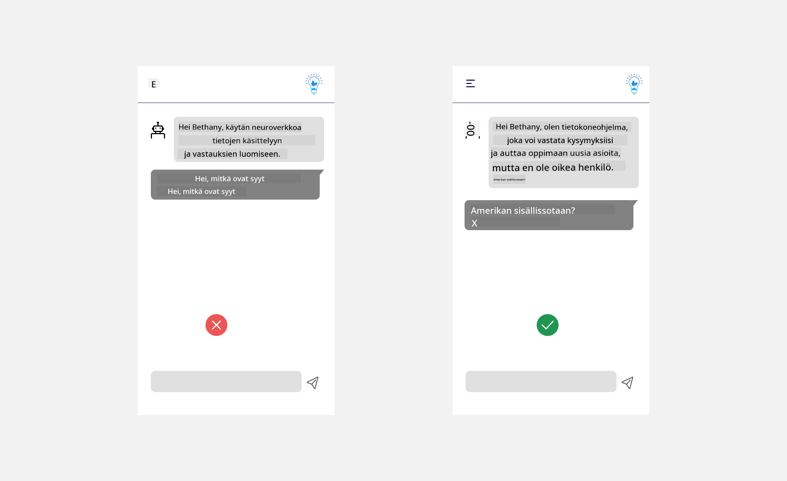
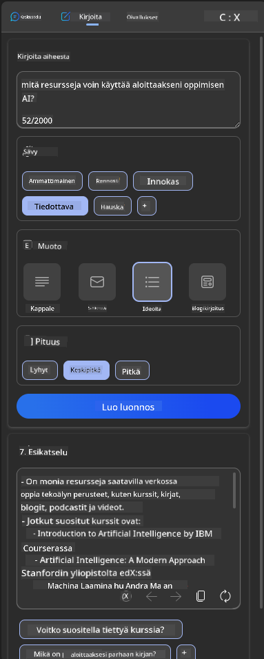
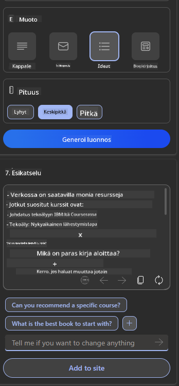
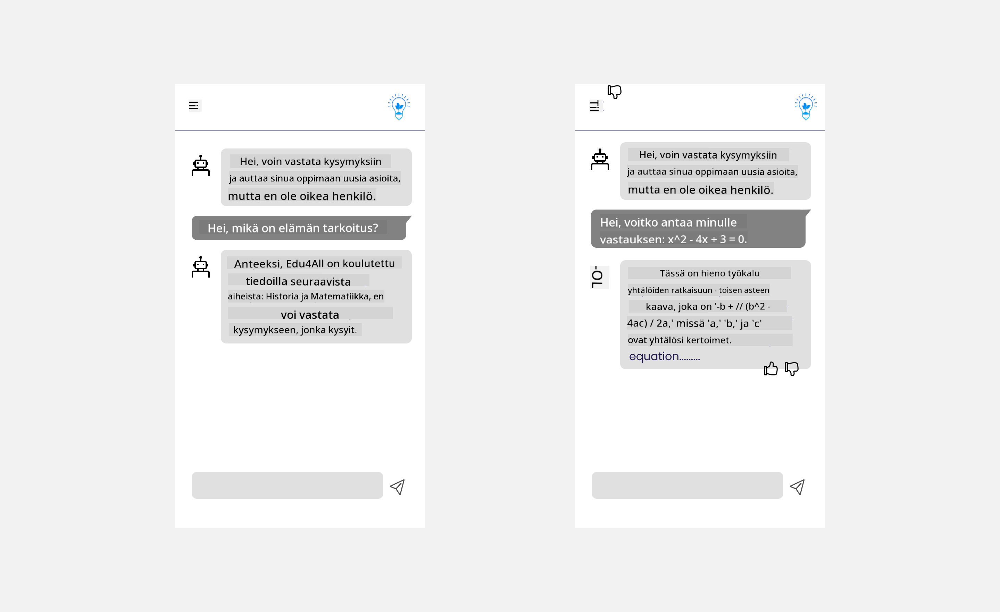

<!--
CO_OP_TRANSLATOR_METADATA:
{
  "original_hash": "ec385b41ee50579025d50cc03bfb3a25",
  "translation_date": "2025-05-19T21:58:37+00:00",
  "source_file": "12-designing-ux-for-ai-applications/README.md",
  "language_code": "fi"
}
-->
# Suunnittele UX tekoälysovelluksille

> _(Napsauta yllä olevaa kuvaa nähdäksesi tämän oppitunnin videon)_

Käyttäjäkokemus on erittäin tärkeä osa sovellusten rakentamista. Käyttäjien on pystyttävä käyttämään sovellustasi tehokkaasti tehtävien suorittamiseen. Tehokkuus on yksi asia, mutta sinun on myös suunniteltava sovelluksia siten, että niitä voi käyttää kuka tahansa, jotta ne ovat _saavutettavia_. Tämä luku keskittyy tähän alueeseen, jotta lopulta suunnittelet sovelluksen, jota ihmiset voivat ja haluavat käyttää.

## Johdanto

Käyttäjäkokemus tarkoittaa sitä, miten käyttäjä on vuorovaikutuksessa tietyn tuotteen tai palvelun kanssa, olipa kyseessä järjestelmä, työkalu tai muotoilu. Kehitettäessä tekoälysovelluksia kehittäjät keskittyvät paitsi varmistamaan, että käyttäjäkokemus on tehokas, myös eettinen. Tässä oppitunnissa käsitellään, miten rakennetaan tekoälysovelluksia, jotka vastaavat käyttäjien tarpeisiin.

Oppitunti kattaa seuraavat alueet:

- Johdanto käyttäjäkokemukseen ja käyttäjien tarpeiden ymmärtäminen
- Tekoälysovellusten suunnittelu luottamusta ja läpinäkyvyyttä varten
- Tekoälysovellusten suunnittelu yhteistyötä ja palautetta varten

## Oppimistavoitteet

Tämän oppitunnin jälkeen osaat:

- Ymmärtää, miten rakennetaan tekoälysovelluksia, jotka vastaavat käyttäjien tarpeisiin.
- Suunnitella tekoälysovelluksia, jotka edistävät luottamusta ja yhteistyötä.

### Esitietovaatimus

Käytä aikaa ja lue lisää [käyttäjäkokemuksesta ja design-ajattelusta.](https://learn.microsoft.com/training/modules/ux-design?WT.mc_id=academic-105485-koreyst)

## Johdanto käyttäjäkokemukseen ja käyttäjien tarpeiden ymmärtäminen

Kuvitteellisessa koulutusstartupissamme meillä on kaksi pääasiallista käyttäjää, opettajat ja opiskelijat. Molemmilla käyttäjillä on omat tarpeensa. Käyttäjäkeskeinen suunnittelu asettaa käyttäjän etusijalle varmistaen, että tuotteet ovat tarkoituksenmukaisia ja hyödyllisiä niille, joille ne on tarkoitettu.

Sovelluksen tulisi olla **hyödyllinen, luotettava, saavutettava ja miellyttävä** tarjotakseen hyvän käyttäjäkokemuksen.

### Käytettävyys

Hyödyllisyys tarkoittaa, että sovelluksella on toiminnallisuus, joka vastaa sen tarkoitusta, kuten arvosteluprosessin automatisointi tai muistikorttien luominen kertausta varten. Sovelluksen, joka automatisoi arvosteluprosessin, tulisi pystyä tarkasti ja tehokkaasti antamaan pisteitä opiskelijoiden töille ennalta määritettyjen kriteerien perusteella. Vastaavasti sovelluksen, joka luo muistikortteja, tulisi pystyä luomaan merkityksellisiä ja monipuolisia kysymyksiä sen datan perusteella.

### Luotettavuus

Luotettavuus tarkoittaa, että sovellus pystyy suorittamaan tehtävänsä johdonmukaisesti ja virheettömästi. Kuitenkin, aivan kuten ihmiset, tekoäly ei ole täydellinen ja saattaa olla altis virheille. Sovellukset saattavat kohdata virheitä tai odottamattomia tilanteita, jotka vaativat ihmisen puuttumista tai korjausta. Miten käsittelet virheitä? Oppitunnin viimeisessä osassa käsittelemme, miten tekoälyjärjestelmät ja -sovellukset on suunniteltu yhteistyötä ja palautetta varten.

### Saavutettavuus

Saavutettavuus tarkoittaa käyttäjäkokemuksen laajentamista eri kykyjä omaaville käyttäjille, mukaan lukien vammaiset, varmistaen, ettei ketään jätetä ulkopuolelle. Noudattamalla saavutettavuusohjeita ja -periaatteita tekoälyratkaisut tulevat inklusiivisemmiksi, käytettävämmiksi ja hyödyllisemmiksi kaikille käyttäjille.

### Miellyttävyys

Miellyttävyys tarkoittaa, että sovellusta on mukava käyttää. Houkutteleva käyttäjäkokemus voi vaikuttaa positiivisesti käyttäjään, rohkaista häntä palaamaan sovellukseen ja lisätä liiketoiminnan tuottoa.

Kaikkia haasteita ei voida ratkaista tekoälyllä. Tekoäly täydentää käyttäjäkokemustasi, olipa kyseessä manuaalisten tehtävien automatisointi tai käyttäjäkokemusten personointi.

## Tekoälysovellusten suunnittelu luottamusta ja läpinäkyvyyttä varten

Luottamuksen rakentaminen on kriittistä suunniteltaessa tekoälysovelluksia. Luottamus varmistaa, että käyttäjä on varma, että sovellus hoitaa työnsä, tuottaa johdonmukaisia tuloksia ja tulokset ovat sitä, mitä käyttäjä tarvitsee. Tällä alueella on riski epäluottamuksesta ja liiallisesta luottamuksesta. Epäluottamus ilmenee, kun käyttäjällä on vähän tai ei lainkaan luottamusta tekoälyjärjestelmään, mikä johtaa sovelluksesi hylkäämiseen. Liiallinen luottamus ilmenee, kun käyttäjä yliarvioi tekoälyjärjestelmän kyvyt, mikä johtaa siihen, että käyttäjät luottavat tekoälyjärjestelmään liikaa. Esimerkiksi automaattinen arvostelujärjestelmä voi johtaa opettajan olettamaan, että kaikki paperit on tarkistettu, vaikka järjestelmä ei toimisikaan oikein, mikä voi johtaa epäreiluihin tai epätarkkoihin arvosanoihin opiskelijoille tai menetettyihin mahdollisuuksiin saada palautetta ja parannuksia.

Kaksi tapaa varmistaa, että luottamus on suunnittelun keskiössä, ovat selitettävyys ja hallinta.

### Selitettävyys

Kun tekoäly auttaa tekemään päätöksiä, kuten tulevien sukupolvien kouluttamisessa, on tärkeää, että opettajat ja vanhemmat ymmärtävät, miten tekoälypäätökset tehdään. Tämä on selitettävyys - ymmärrys siitä, miten tekoälysovellukset tekevät päätöksiä. Selitettävyys suunnittelussa sisältää yksityiskohtien lisäämisen esimerkeistä, mitä tekoälysovellus voi tehdä. Esimerkiksi "Aloita tekoälyopettajan kanssa" sijasta järjestelmä voi käyttää: "Tiivistä muistiinpanosi helpompaa kertausta varten tekoälyn avulla."

Toinen esimerkki on, miten tekoäly käyttää käyttäjän ja henkilökohtaista dataa. Esimerkiksi opiskelijapersoonalla voi olla rajoituksia persoonansa perusteella. Tekoäly ei ehkä pysty paljastamaan vastauksia kysymyksiin, mutta voi auttaa käyttäjää miettimään, miten he voivat ratkaista ongelman.

Viimeinen tärkeä osa selitettävyyttä on selitysten yksinkertaistaminen. Opiskelijat ja opettajat eivät välttämättä ole tekoälyasiantuntijoita, joten selitykset siitä, mitä sovellus voi tai ei voi tehdä, tulisi yksinkertaistaa ja tehdä helposti ymmärrettäviksi.

### Hallinta

Generatiivinen tekoäly luo yhteistyön tekoälyn ja käyttäjän välille, missä esimerkiksi käyttäjä voi muokata kehotteita eri tuloksia varten. Lisäksi, kun tulos on luotu, käyttäjien tulisi pystyä muokkaamaan tuloksia, mikä antaa heille hallinnan tunteen. Esimerkiksi, kun käytät Bingia, voit räätälöidä kehotteesi muodon, sävyn ja pituuden perusteella. Lisäksi voit tehdä muutoksia tulokseesi ja muokata tulosta alla olevan kuvan mukaisesti:

Toinen ominaisuus Bingissä, joka antaa käyttäjälle hallinnan sovelluksesta, on mahdollisuus valita mukaan tai pois datasta, jota tekoäly käyttää. Koulusovelluksessa opiskelija saattaa haluta käyttää omia muistiinpanojaan sekä opettajan materiaaleja kertausta varten.

> Kun suunnittelet tekoälysovelluksia, tarkoituksellisuus on avainasemassa varmistaaksesi, etteivät käyttäjät luota liikaa, asettamalla epärealistisia odotuksia sen kyvyistä. Yksi tapa tehdä tämä on luoda kitkaa kehotteiden ja tulosten välille. Muistuta käyttäjää, että tämä on tekoäly eikä toinen ihminen.

## Tekoälysovellusten suunnittelu yhteistyötä ja palautetta varten

Kuten aiemmin mainittiin, generatiivinen tekoäly luo yhteistyön käyttäjän ja tekoälyn välille. Useimmat vuorovaikutukset tapahtuvat, kun käyttäjä syöttää kehotteen ja tekoäly tuottaa tuloksen. Entä jos tulos on virheellinen? Miten sovellus käsittelee virheitä, jos niitä ilmenee? Syytteleekö tekoäly käyttäjää vai viekö aikaa selittääkseen virheen?

Tekoälysovellukset tulisi rakentaa siten, että ne voivat vastaanottaa ja antaa palautetta. Tämä ei ainoastaan auta tekoälyjärjestelmää parantumaan, vaan myös rakentaa luottamusta käyttäjiin. Palautejärjestelmä tulisi sisällyttää suunnitteluun, esimerkkinä voi olla yksinkertainen peukku ylös tai alas tuotokselle.

Toinen tapa käsitellä tätä on selkeästi viestiä järjestelmän kyvyistä ja rajoituksista. Kun käyttäjä tekee virheen pyytäessään jotain, joka ylittää tekoälyn kyvyt, tulisi olla tapa käsitellä tämä, kuten alla näytetään.

Järjestelmävirheet ovat yleisiä sovelluksissa, joissa käyttäjä saattaa tarvita apua tiedoissa, jotka ovat tekoälyn ulottumattomissa, tai sovelluksella voi olla rajoitus siitä, kuinka monta kysymystä/aihetta käyttäjä voi luoda tiivistelmiä. Esimerkiksi tekoälysovellus, joka on koulutettu rajallisilla aiheilla, kuten historia ja matematiikka, ei ehkä pysty käsittelemään maantiedon kysymyksiä. Tämän lievittämiseksi tekoälyjärjestelmä voi antaa vastauksen, kuten: "Anteeksi, tuotteemme on koulutettu seuraavien aiheiden tiedoilla....., en pysty vastaamaan kysymykseen, jonka esität."

Tekoälysovellukset eivät ole täydellisiä, joten ne tekevät varmasti virheitä. Kun suunnittelet sovelluksiasi, sinun tulisi varmistaa, että luot tilaa käyttäjäpalautteelle ja virheenkäsittelylle tavalla, joka on yksinkertainen ja helposti selitettävä.

## Tehtävä

Ota mikä tahansa tekoälysovellus, jonka olet tähän mennessä rakentanut, ja harkitse seuraavien vaiheiden toteuttamista sovelluksessasi:

- **Miellyttävyys:** Mieti, miten voit tehdä sovelluksestasi miellyttävämmän. Lisäätkö selityksiä kaikkialle? Rohkaisetko käyttäjää tutkimaan? Miten muotoilet virheilmoituksesi?

- **Käytettävyys:** Rakenna verkkosovellus. Varmista, että sovelluksesi on navigoitavissa sekä hiirellä että näppäimistöllä.

- **Luottamus ja läpinäkyvyys:** Älä luota täysin tekoälyyn ja sen tuotoksiin, mieti, miten voisit lisätä ihmisen prosessiin varmistaaksesi tuotoksen. Harkitse ja toteuta myös muita tapoja saavuttaa luottamus ja läpinäkyvyys.

- **Hallinta:** Anna käyttäjälle hallinta siitä, mitä tietoja hän antaa sovellukselle. Toteuta tapa, jolla käyttäjä voi valita mukaan tai pois datan keräämisestä tekoälysovelluksessa.

## Jatka oppimista!

Tämän oppitunnin jälkeen tutustu [Generatiivisen tekoälyn oppimiskokoelmaamme](https://aka.ms/genai-collection?WT.mc_id=academic-105485-koreyst) jatkaaksesi generatiivisen tekoälyosaamisesi kehittämistä!

Siirry oppituntiin 13, jossa käsittelemme [tekoälysovellusten suojaamista](../13-securing-ai-applications/README.md?WT.mc_id=academic-105485-koreyst)!

**Vastuuvapauslauseke**:  
Tämä asiakirja on käännetty käyttämällä AI-käännöspalvelua [Co-op Translator](https://github.com/Azure/co-op-translator). Vaikka pyrimme tarkkuuteen, ole hyvä ja huomaa, että automaattiset käännökset voivat sisältää virheitä tai epätarkkuuksia. Alkuperäistä asiakirjaa sen alkuperäisellä kielellä tulisi pitää auktoritatiivisena lähteenä. Kriittisen tiedon osalta suositellaan ammattimaista ihmiskäännöstä. Emme ole vastuussa väärinkäsityksistä tai virhetulkinnoista, jotka johtuvat tämän käännöksen käytöstä.