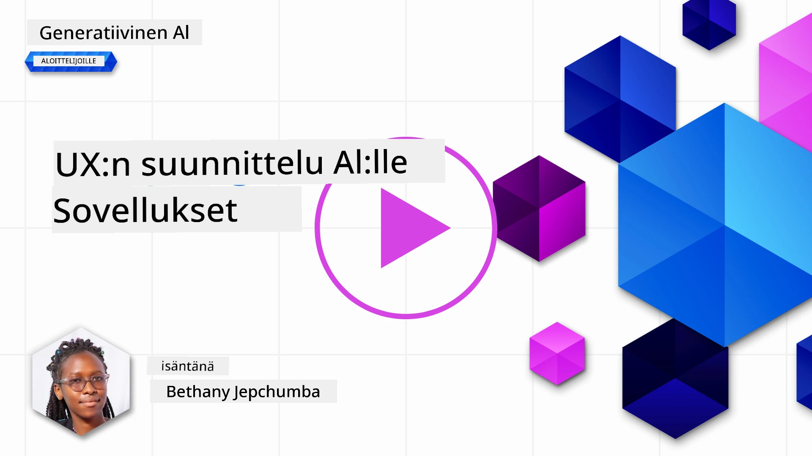
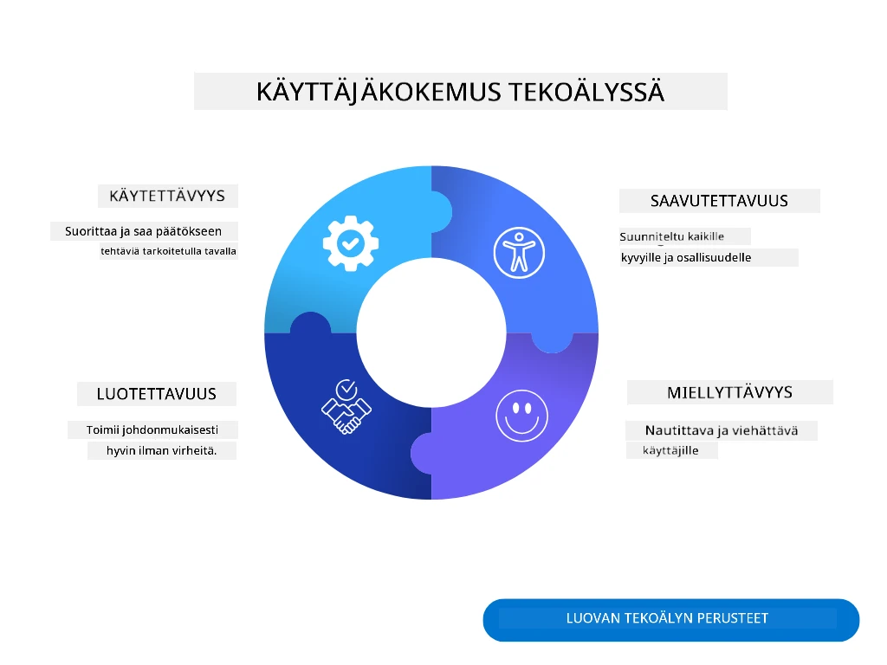
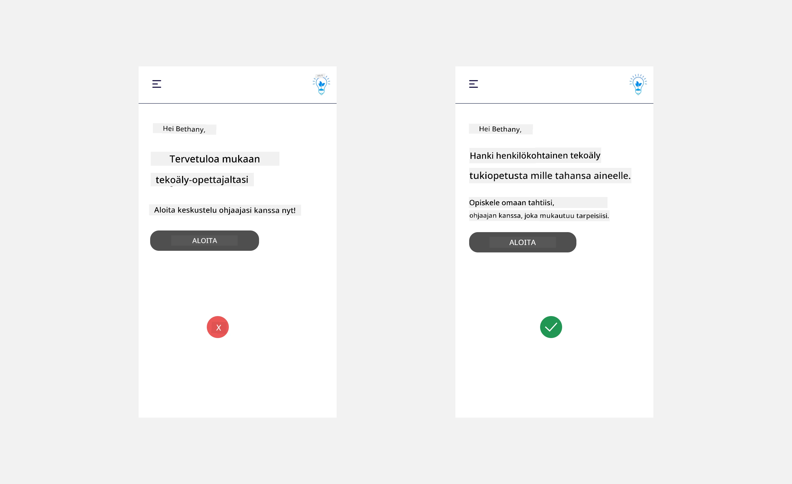
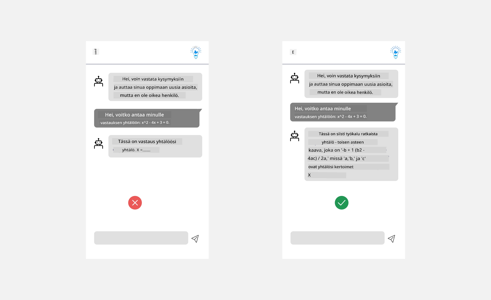
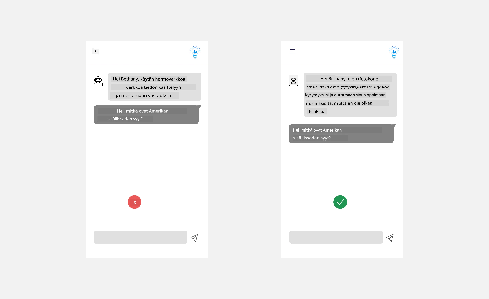
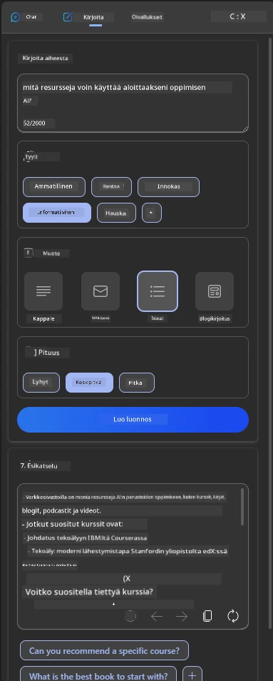
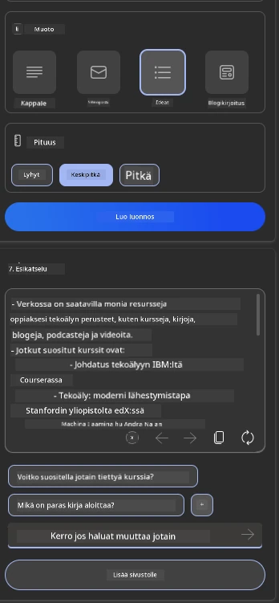
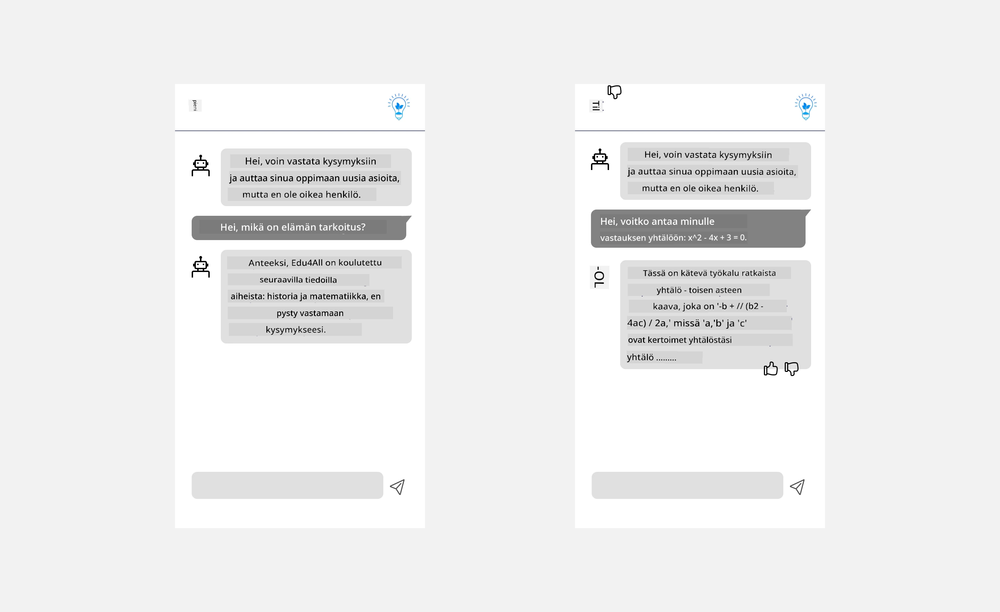

# UX:n suunnittelu tekoälysovelluksille

> _(Napsauta yllä olevaa kuvaa nähdäksesi tämän oppitunnin videon)_

Käyttäjäkokemus on erittäin tärkeä osa sovellusten rakentamista. Käyttäjien on kyettävä käyttämään sovellustasi tehokkaasti suorittaakseen tehtäviä. Tehokkuus on yksi asia, mutta sinun on myös suunniteltava sovelluksia siten, että ne sopivat kaikille ja tekevät niistä _saavutettavia_. Tämä luku keskittyy tähän alueeseen, jotta lopputuloksena olisi sovellus, jota ihmiset voivat ja haluavat käyttää.

## Johdanto

Käyttäjäkokemus tarkoittaa sitä, miten käyttäjä on vuorovaikutuksessa ja käyttää tiettyä tuotetta tai palvelua, olipa kyseessä järjestelmä, työkalu tai suunnittelu. Kehitettäessä tekoälysovelluksia kehittäjät keskittyvät paitsi käyttäjäkokemuksen tehokkuuteen myös eettisyyteen. Tässä oppitunnissa käsittelemme, kuinka rakentaa tekoälysovelluksia, jotka vastaavat käyttäjien tarpeita.

Oppitunti käsittelee seuraavia aihealueita:

- Johdanto käyttäjäkokemukseen ja käyttäjätarpeiden ymmärtämiseen
- Tekoälysovellusten suunnittelu luottamuksen ja läpinäkyvyyden edistämiseksi
- Tekoälysovellusten suunnittelu yhteistyötä ja palautetta varten

## Oppimistavoitteet

Oppitunnin jälkeen osaat:

- Ymmärtää, miten rakentaa tekoälysovelluksia, jotka täyttävät käyttäjien tarpeet.
- Suunnitella tekoälysovelluksia, jotka edistävät luottamusta ja yhteistyötä.

### Esitiedot

Käy lukemassa lisää [käyttäjäkokemuksesta ja design-ajattelusta.](https://learn.microsoft.com/training/modules/ux-design?WT.mc_id=academic-105485-koreyst)

## Johdanto käyttäjäkokemukseen ja käyttäjätarpeiden ymmärtämiseen

Kuvitteellisessa koulutusstart-upissamme on kaksi pääkäyttäjää, opettajat ja opiskelijat. Jokaisella käyttäjällä on omat ainutlaatuiset tarpeensa. Käyttäjäkeskeinen suunnittelu asettaa käyttäjän etusijalle varmistaen, että tuotteet ovat merkityksellisiä ja hyödyllisiä niille, joiden käyttöön ne on suunnattu.

Sovelluksen tulisi olla **hyödyllinen, luotettava, saavutettava ja miellyttävä** tarjotakseen hyvän käyttäjäkokemuksen.

### Käytettävyys

Hyödyllisyys tarkoittaa, että sovelluksen toiminnallisuus vastaa sen tarkoitusta, kuten arviointiprosessin automatisointia tai muistikorttien luontia kertausta varten. Sovelluksen, joka automatisoi arvioinnin, tulee pystyä määrittämään tarkasti ja tehokkaasti pisteet opiskelijoiden töille ennalta määriteltyjen kriteerien perusteella. Vastaavasti sovelluksen, joka luo kertaavia muistikortteja, tulee pystyä tuottamaan aiheeseen liittyviä ja monipuolisia kysymyksiä datansa pohjalta.

### Luotettavuus

Luotettavuus tarkoittaa, että sovellus pystyy suorittamaan tehtävänsä johdonmukaisesti ja virheettömästi. Tekoäly ei kuitenkaan ole täydellinen, kuten ihmisetkään, ja saattaa tehdä virheitä. Sovellukset voivat kohdata virheitä tai odottamattomia tilanteita, jotka vaativat ihmisen väliintuloa tai korjausta. Miten käsittelet virheitä? Tämän oppitunnin viimeisessä osassa käsittelemme, miten tekoälyjärjestelmät ja -sovellukset on suunniteltu yhteistyötä ja palautetta varten.

### Saavutettavuus

Saavutettavuus tarkoittaa, että käyttäjäkokemus ulotetaan käyttäjiin, joilla on erilaisia kykyjä, mukaan lukien vammaiset, varmistaen, että kukaan ei jää ulkopuolelle. Noudattamalla saavutettavuusohjeita ja -periaatteita tekoälyratkaisut muuttuvat inklusiivisemmiksi, käytettäviksi ja hyödyllisemmiksi kaikille käyttäjille.

### Miellyttävyys

Miellyttävyys tarkoittaa, että sovelluksen käyttö on nautittavaa. Houkutteleva käyttäjäkokemus voi vaikuttaa myönteisesti käyttäjään, kannustaen tätä palaamaan sovellukseen ja lisäämään liiketoiminnan tuottoa.

Kaikkeen ongelmaan ei löydy ratkaisua tekoälyn avulla. Tekoälyä käytetään täydentämään käyttäjäkokemusta, olipa kyseessä manuaalisten tehtävien automatisointi tai käyttäjäkokemuksen räätälöinti.

## Tekoälysovellusten suunnittelu luottamuksen ja läpinäkyvyyden takaamiseksi

Luottamuksen rakentaminen on ratkaisevan tärkeää tekoälysovellusten suunnittelussa. Luottamus varmistaa, että käyttäjä on vakuuttunut sovelluksen suorittavan työn, tuottavan tulokset johdonmukaisesti ja että tulokset vastaavat käyttäjän tarpeita. Kehityksen riskinä ovat epäluottamus ja liiallinen luottamus. Epäluottamus syntyy, kun käyttäjällä on vähän tai ei lainkaan luottamusta tekoälyjärjestelmään, mikä johtaa sovelluksen hylkäämiseen. Liiallinen luottamus puolestaan syntyy, kun käyttäjä yliarvioi tekoälyn kyvyt ja luottaa siihen liikaa. Esimerkiksi arviointijärjestelmässä liiallinen luottamus voi johtaa siihen, että opettaja ei tarkista kaikkia töitä varmistaakseen järjestelmän toimivuuden, mikä voi johtaa epäoikeudenmukaisiin tai epätarkkoihin arvosanoihin sekä menetettyihin palautteen ja kehityksen mahdollisuuksiin.

Kaksi tapaa varmistaa, että luottamus on suunnittelun keskiössä, ovat selitettävyys ja hallinta.

### Selitettävyys

Kun tekoäly auttaa päätöksenteossa, kuten tiedon välittämisessä tuleville sukupolville, on tärkeää, että opettajat ja vanhemmat ymmärtävät, miten tekoälyn tekemät päätökset syntyvät. Tämä on selitettävyys – ymmärrys siitä, miten tekoälysovellukset tekevät päätöksiä. Selitettävyyden suunnitteluun sisältyy yksityiskohtien lisääminen, jotka korostavat, miten tekoäly on päätynyt tulokseen. Katsojan täytyy olla tietoinen siitä, että tulos on tekoälyn generoima eikä ihmisen. Esimerkiksi sanan sijaan "Aloita keskustelu ohjaajasi kanssa nyt" sanotaan "Käytä tekoälyohjaajaa, joka mukautuu tarpeisiisi ja auttaa sinut oppimaan omaan tahtiisi."

Toinen esimerkki on, kuinka tekoäly käyttää käyttäjä- ja henkilötietoja. Esimerkiksi käyttäjällä, jolla on opiskelijan rooli, voi olla rajoituksia roolinsa perusteella. Tekoäly ei välttämättä voi paljastaa vastauksia kysymyksiin, mutta voi auttaa ohjaamalla käyttäjää ajattelemaan, miten ongelman voi ratkaista.

Selitettävyyden viimeinen tärkeä osa-alue on selitysten yksinkertaistaminen. Opiskelijat ja opettajat eivät välttämättä ole tekoälyasiantuntijoita, joten selitysten siitä, mitä sovellus voi tai ei voi tehdä, tulisi olla yksinkertaisia ja helposti ymmärrettäviä.

### Hallinta

Generatiivinen tekoäly luo yhteistyön tekoälyn ja käyttäjän välille, jossa esimerkiksi käyttäjä voi muokata pyyntöjä erilaisia tuloksia varten. Lisäksi, kun tulos on luotu, käyttäjien tulisi pystyä muokkaamaan tuloksia, mikä antaa heille hallinnan tunteen. Esimerkiksi käyttäessäsi Microsoft Copilotia (entinen Bing Chat), voit räätälöidä pyyntöäsi muodon, sävyn ja pituuden mukaan. Lisäksi voit lisätä muutoksia tulokseesi ja muokata sitä alla kuvatulla tavalla:

Toinen ominaisuus Microsoft Copilotissa, joka antaa käyttäjälle hallintaa sovellukseen, on mahdollisuus valita, hyväksyykö vai hylkääkö tiedonkeruun tekoälylle. Koulusovelluksessa opiskelija saattaa haluta käyttää sekä omia muistiinpanojaan että opettajien materiaaleja kertausmateriaalina.

> Suunnitellessasi tekoälysovelluksia tarkoituksenmukaisuus on avain siihen, etteivät käyttäjät luota liikaa asettaen epärealistisia odotuksia sen kyvyistä. Yksi tapa tehdä tämä on luoda kitkaa pyyntöjen ja tulosten välille. Muistuttaa käyttäjää, että kyseessä on tekoäly eikä ihminen.

## Tekoälysovellusten suunnittelu yhteistyötä ja palautetta varten

Kuten aiemmin mainittiin, generatiivinen tekoäly luo yhteistyön käyttäjän ja tekoälyn välille. Useimmat vuorovaikutukset koostuvat käyttäjän syöttämästä pyynnöstä ja tekoälyn tuottamasta vastauksesta. Entä jos tulos on virheellinen? Miten sovellus käsittelee virheet, jos niitä ilmenee? Syyttääkö tekoäly käyttäjää vai käyttääkö se aikaa selittääkseen virheen?

Tekoälysovellukset tulisi rakentaa siten, että ne voivat vastaanottaa ja antaa palautetta. Tämä auttaa paitsi tekoälyjärjestelmän parantamista myös rakentaa luottamusta käyttäjien kanssa. Palautesilmukka tulisi ottaa suunnitteluun mukaan, esimerkiksi yksinkertainen peukku ylös tai alas tuloksesta.

Toinen tapa käsitellä tätä on selkeästi viestiä järjestelmän kyvyt ja rajoitukset. Kun käyttäjä tekee virheen pyytäen jotain tekoälyn kykyjen ulkopuolelta, pitäisi olla myös keino käsitellä tämä, kuten alla kuvataan.

Järjestelmävirheet ovat yleisiä sovelluksissa, joissa käyttäjä saattaa tarvita apua tekoälyn toiminnan ulkopuolella tai sovelluksella voi olla rajoitus siitä, kuinka monta kysymystä/aihetta käyttäjä voi tiivistää. Esimerkiksi tekoälysovellus, joka on koulutettu rajatulla määrällä aineistoa kuten Historiaa ja Matematiikkaa, ei välttämättä pysty käsittelemään maantietoon liittyviä kysymyksiä. Tämän välttämiseksi tekoälyjärjestelmä voi antaa vastauksen kuten: "Valitettavasti tuotteemme on koulutettu seuraavilla ainealueilla..., en pysty vastaamaan esittämääsi kysymykseen."

Tekoälysovellukset eivät ole täydellisiä, joten ne tekevät virheitä. Suunnitellessasi sovelluksiasi sinun tulisi varmistaa, että niissä on tilaa käyttäjäpalautteelle ja virheiden käsittelylle tavalla, joka on yksinkertainen ja helposti selitettävissä.

## Tehtävä

Ota mikä tahansa tähän mennessä rakentamasi tekoälysovellus ja harkitse seuraavien vaiheiden toteuttamista sovelluksessasi:

- **Miellyttävyys:** Mieti, miten voit tehdä sovelluksestasi miellyttävämmän. Lisäätkö selityksiä kaikkialle? Kannustatko käyttäjää tutkimaan? Miten muotoilet virheilmoituksesi?

- **Käytettävyys:** Rakennatko web-sovellusta. Varmista, että sovellus on navigoitavissa sekä hiirellä että näppäimistöllä.

- **Luottamus ja läpinäkyvyys:** Älä luota tekoälyyn ja sen tuloksiin täysin, mieti, miten lisäisit ihmisen prosessiin tulosten varmistaamiseksi. Pohdi ja toteuta myös muita tapoja saavuttaa luottamusta ja läpinäkyvyyttä.

- **Hallinta:** Anna käyttäjälle mahdollisuus hallita sovellukselle antamiaan tietoja. Toteuta tapa, jolla käyttäjä voi halutessaan hyväksyä tai hylätä tiedonkeruun tekoälysovelluksessa.

<!-- ## [Luentotehtävän jälkeinen tietovisa](../../../12-designing-ux-for-ai-applications/quiz-url) -->

## Jatka oppimistasi!

Oppitunnin suorittamisen jälkeen tutustu [Generatiivisen tekoälyn oppimiskokoelmaamme](https://aka.ms/genai-collection?WT.mc_id=academic-105485-koreyst) kehittääksesi generatiivista tekoälytietämystäsi edelleen!

Suuntaa oppituntiin 13, jossa käsittelemme, miten [suojataan tekoälysovelluksia](../13-securing-ai-applications/README.md?WT.mc_id=academic-105485-koreyst)!

---

<!-- CO-OP TRANSLATOR DISCLAIMER START -->
**Vastuuvapauslauseke**:
Tämä asiakirja on käännetty käyttämällä tekoälypohjaista käännöspalvelua [Co-op Translator](https://github.com/Azure/co-op-translator). Vaikka pyrimme tarkkuuteen, otathan huomioon, että automaattiset käännökset saattavat sisältää virheitä tai epätarkkuuksia. Alkuperäinen asiakirja sen alkuperäiskielellä on virallinen lähde. Tärkeissä asioissa suositellaan ammattimaista ihmiskäännöstä. Emme ole vastuussa tämän käännöksen käytöstä aiheutuvista väärinymmärryksistä tai tulkinnoista.
<!-- CO-OP TRANSLATOR DISCLAIMER END -->