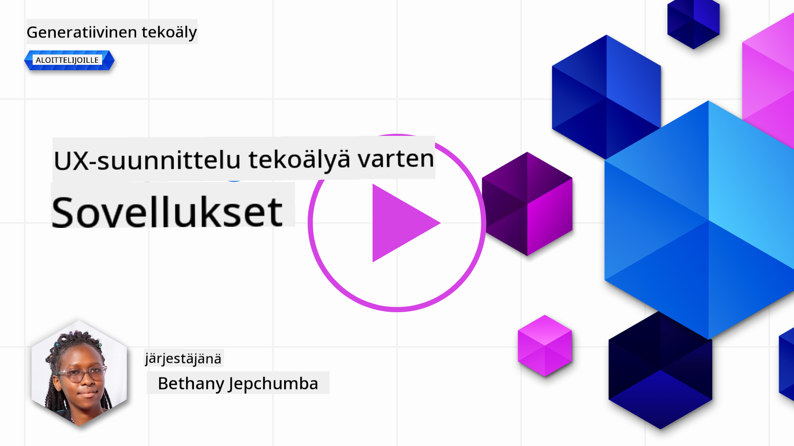
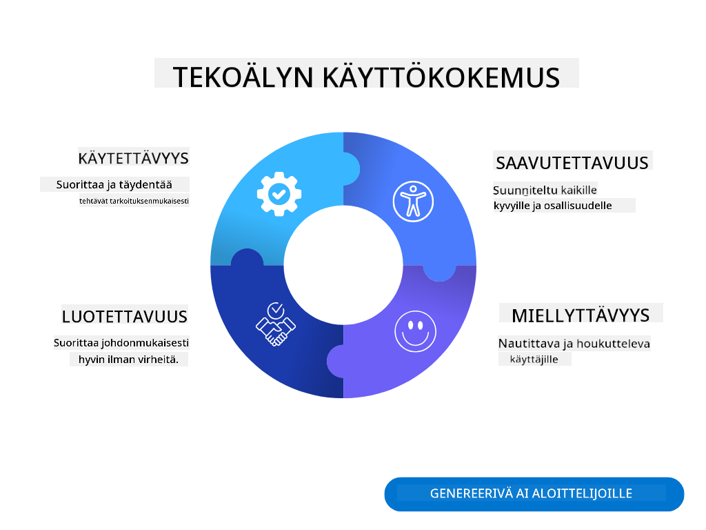
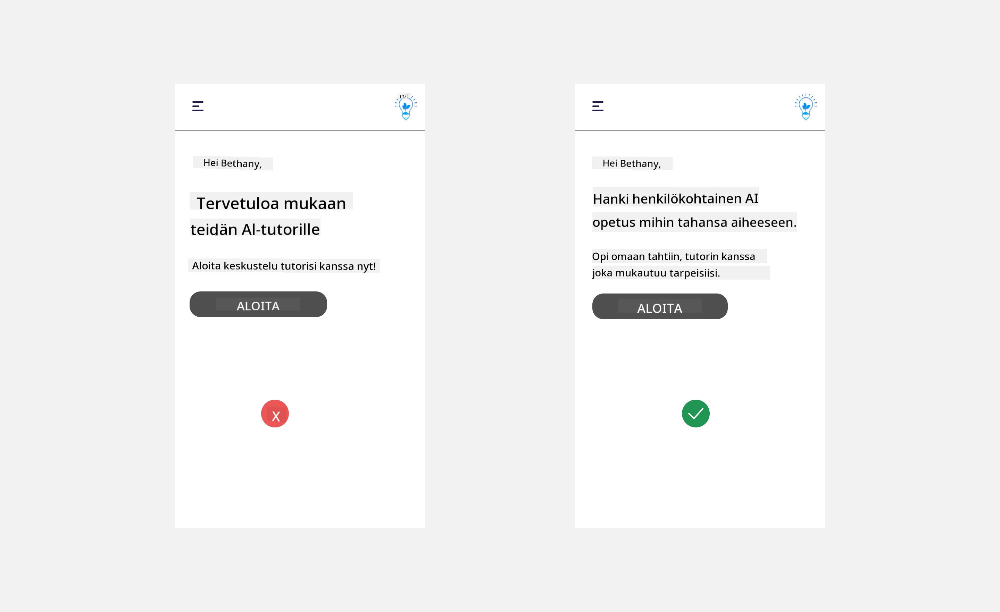
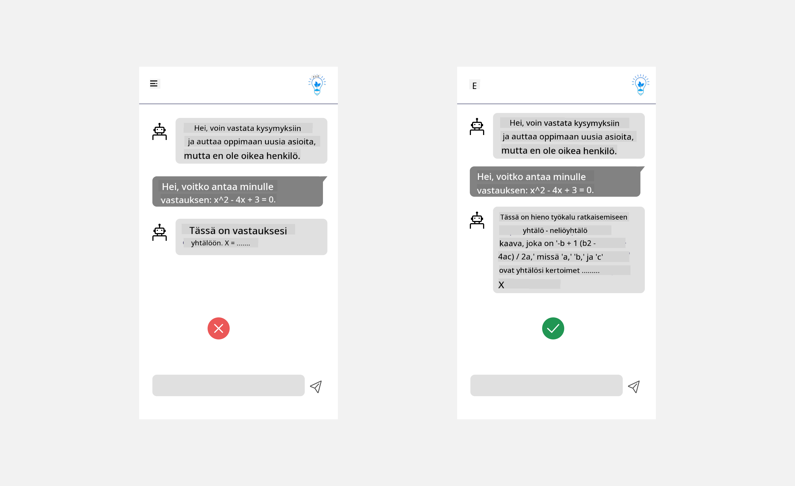
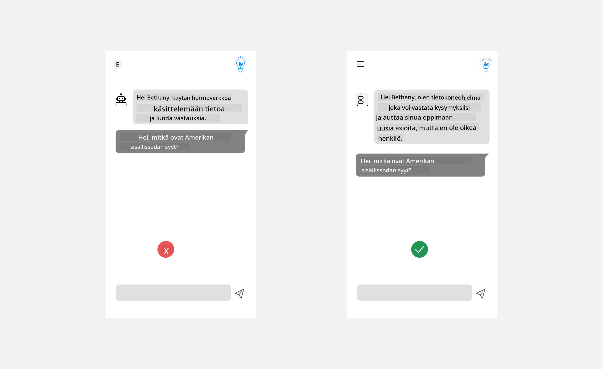
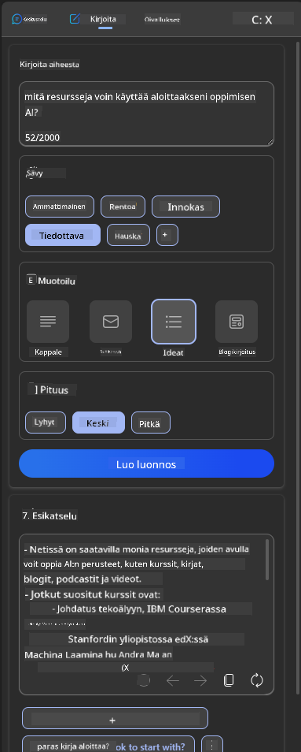
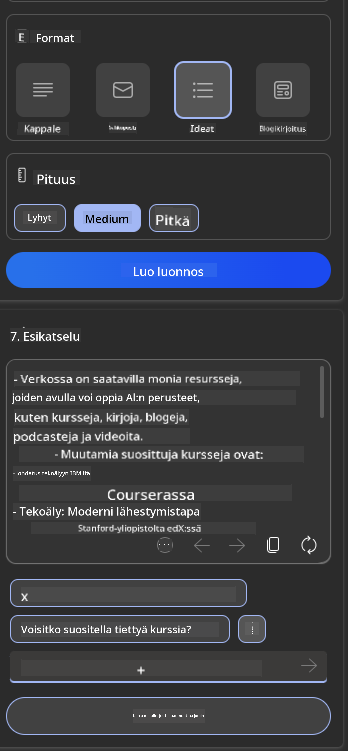
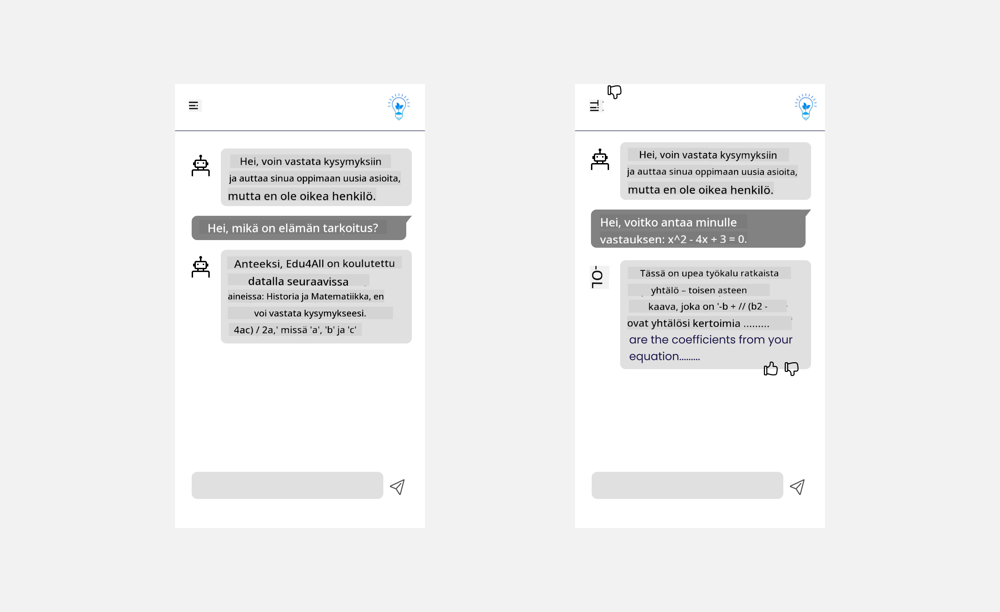

<!--
CO_OP_TRANSLATOR_METADATA:
{
  "original_hash": "ec385b41ee50579025d50cc03bfb3a25",
  "translation_date": "2025-06-25T20:26:16+00:00",
  "source_file": "12-designing-ux-for-ai-applications/README.md",
  "language_code": "fi"
}
-->
# Suunnitellaan käyttäjäkokemusta tekoälysovelluksille

> _(Klikkaa yllä olevaa kuvaa katsoaksesi tämän oppitunnin video)_

Käyttäjäkokemus on erittäin tärkeä osa sovellusten rakentamista. Käyttäjien on pystyttävä käyttämään sovellustasi tehokkaasti suorittaakseen tehtäviä. Tehokkuus on yksi asia, mutta sinun on myös suunniteltava sovelluksia niin, että niitä voi käyttää jokainen, jotta ne ovat _saavutettavia_. Tämä luku keskittyy tähän alueeseen, jotta päädyt suunnittelemaan sovelluksen, jota ihmiset voivat ja haluavat käyttää.

## Johdanto

Käyttäjäkokemus on se, miten käyttäjä on vuorovaikutuksessa ja käyttää tiettyä tuotetta tai palvelua, olipa kyseessä järjestelmä, työkalu tai suunnittelu. Kun kehitetään tekoälysovelluksia, kehittäjät eivät keskity vain varmistamaan, että käyttäjäkokemus on tehokas, vaan myös eettinen. Tässä oppitunnissa käsittelemme, kuinka rakentaa tekoälysovelluksia, jotka vastaavat käyttäjien tarpeisiin.

Oppitunti kattaa seuraavat alueet:

- Johdatus käyttäjäkokemukseen ja käyttäjien tarpeiden ymmärtäminen
- Tekoälysovellusten suunnittelu luottamusta ja läpinäkyvyyttä varten
- Tekoälysovellusten suunnittelu yhteistyötä ja palautetta varten

## Oppimistavoitteet

Tämän oppitunnin jälkeen osaat:

- Ymmärtää, kuinka rakentaa tekoälysovelluksia, jotka täyttävät käyttäjien tarpeet.
- Suunnitella tekoälysovelluksia, jotka edistävät luottamusta ja yhteistyötä.

### Esitietovaatimus

Käytä aikaa ja lue lisää [käyttäjäkokemuksesta ja muotoiluajattelusta.](https://learn.microsoft.com/training/modules/ux-design?WT.mc_id=academic-105485-koreyst)

## Johdatus käyttäjäkokemukseen ja käyttäjien tarpeiden ymmärtäminen

Kuvitteellisessa koulutusalan startupissamme meillä on kaksi ensisijaista käyttäjää, opettajat ja opiskelijat. Kummallakin käyttäjällä on ainutlaatuiset tarpeet. Käyttäjälähtöinen suunnittelu asettaa käyttäjän etusijalle varmistaen, että tuotteet ovat merkityksellisiä ja hyödyllisiä niille, joille ne on tarkoitettu.

Sovelluksen tulisi olla **hyödyllinen, luotettava, saavutettava ja miellyttävä** tarjotakseen hyvän käyttäjäkokemuksen.

### Käytettävyys

Hyödyllisyys tarkoittaa, että sovelluksella on toimintoja, jotka vastaavat sen tarkoitusta, kuten arvosanojen automaattinen laskenta tai muistutuskorttien luominen kertausta varten. Sovelluksen, joka automatisoi arvosanojen laskemisen, pitäisi pystyä tarkasti ja tehokkaasti antamaan pisteitä opiskelijoiden töistä ennalta määriteltyjen kriteerien perusteella. Samoin sovelluksen, joka luo kertausta varten muistutuskortteja, pitäisi pystyä luomaan relevantteja ja monipuolisia kysymyksiä sen datan perusteella.

### Luotettavuus

Luotettavuus tarkoittaa, että sovellus pystyy suorittamaan tehtävänsä johdonmukaisesti ja virheettömästi. Kuitenkin, aivan kuten ihmiset, tekoäly ei ole täydellinen ja saattaa olla altis virheille. Sovellukset saattavat kohdata virheitä tai odottamattomia tilanteita, jotka vaativat ihmisen väliintuloa tai korjausta. Kuinka käsittelet virheitä? Oppitunnin viimeisessä osassa käsittelemme, kuinka tekoälyjärjestelmät ja sovellukset on suunniteltu yhteistyötä ja palautetta varten.

### Saavutettavuus

Saavutettavuus tarkoittaa käyttäjäkokemuksen laajentamista erilaisille käyttäjille, mukaan lukien vammaiset, varmistaen, ettei kukaan jää ulkopuolelle. Noudattamalla saavutettavuusohjeita ja -periaatteita tekoälyratkaisut tulevat inklusiivisemmiksi, käytettävämmiksi ja hyödyllisemmiksi kaikille käyttäjille.

### Miellyttävyys

Miellyttävyys tarkoittaa, että sovellusta on mukava käyttää. Miellyttävä käyttäjäkokemus voi vaikuttaa positiivisesti käyttäjään kannustaen häntä palaamaan sovellukseen ja lisäämään liiketoiminnan tuottoa.

Kaikkia haasteita ei voi ratkaista tekoälyllä. Tekoäly täydentää käyttäjäkokemusta, olipa kyseessä manuaalisten tehtävien automatisointi tai käyttäjäkokemusten personointi.

## Tekoälysovellusten suunnittelu luottamusta ja läpinäkyvyyttä varten

Luottamuksen rakentaminen on kriittistä tekoälysovellusten suunnittelussa. Luottamus varmistaa, että käyttäjä on varma siitä, että sovellus suorittaa työn, tuottaa tuloksia johdonmukaisesti ja tulokset ovat sitä, mitä käyttäjä tarvitsee. Riski tällä alueella on epäluottamus ja liiallinen luottamus. Epäluottamus syntyy, kun käyttäjällä on vähän tai ei lainkaan luottamusta tekoälyjärjestelmään, mikä johtaa siihen, että käyttäjä hylkää sovelluksesi. Liiallinen luottamus syntyy, kun käyttäjä yliarvioi tekoälyjärjestelmän kyvyt, mikä johtaa siihen, että käyttäjät luottavat tekoälyjärjestelmään liikaa. Esimerkiksi automaattinen arvosanojen laskentajärjestelmä liiallisen luottamuksen tapauksessa saattaa johtaa siihen, että opettaja ei tarkista joitakin papereita varmistaakseen, että arvosanojen laskentajärjestelmä toimii hyvin. Tämä voi johtaa epäoikeudenmukaisiin tai epätarkkoihin arvosanoihin opiskelijoille tai menetettyihin mahdollisuuksiin palautteeseen ja parantamiseen.

Kaksi tapaa varmistaa, että luottamus asetetaan suunnittelun keskiöön, ovat selitettävyys ja hallinta.

### Selitettävyys

Kun tekoäly auttaa tekemään päätöksiä, kuten tiedon siirtämistä tuleville sukupolville, on kriittistä, että opettajat ja vanhemmat ymmärtävät, miten tekoälypäätökset tehdään. Tämä on selitettävyys - ymmärtäminen, miten tekoälysovellukset tekevät päätöksiä. Selitettävyys huomioiden suunnittelu sisältää yksityiskohtien lisäämisen esimerkeistä siitä, mitä tekoälysovellus voi tehdä. Esimerkiksi sen sijaan, että sanottaisiin "Aloita tekoälyopettajan kanssa", järjestelmä voi käyttää: "Tiivistä muistiinpanosi helpompaa kertausta varten tekoälyn avulla."

Toinen esimerkki on, miten tekoäly käyttää käyttäjän ja henkilötietoja. Esimerkiksi käyttäjä, jolla on opiskelijapersoona, saattaa kohdata rajoituksia perustuen heidän persoonaansa. Tekoäly ei ehkä pysty paljastamaan vastauksia kysymyksiin, mutta voi auttaa ohjaamaan käyttäjää miettimään, miten he voivat ratkaista ongelman.

Yksi viimeinen avainosa selitettävyydessä on selitysten yksinkertaistaminen. Opiskelijat ja opettajat eivät välttämättä ole tekoälyasiantuntijoita, joten selitykset siitä, mitä sovellus voi tai ei voi tehdä, tulisi yksinkertaistaa ja olla helposti ymmärrettäviä.

### Hallinta

Generatiivinen tekoäly luo yhteistyön tekoälyn ja käyttäjän välille, jossa esimerkiksi käyttäjä voi muokata kehotteita eri tuloksia varten. Lisäksi, kun tulos on luotu, käyttäjien pitäisi pystyä muokkaamaan tuloksia antaen heille tunteen hallinnasta. Esimerkiksi Bingin käytössä voit muokata kehotettasi perustuen muotoon, sävyyn ja pituuteen. Lisäksi voit lisätä muutoksia tulokseesi ja muokata tulosta kuten alla on esitetty:

Toinen ominaisuus Bingissä, joka antaa käyttäjälle hallinnan sovelluksesta, on kyky valita, osallistuuko tekoälyn käyttämän datan käyttöön vai ei. Koulusovelluksessa opiskelija saattaa haluta käyttää muistiinpanojaan sekä opettajan resursseja kertaamismateriaalina.

> Kun suunnittelet tekoälysovelluksia, tarkoituksellisuus on avain varmistamaan, että käyttäjät eivät luota liikaa, asettaen epärealistisia odotuksia sen kyvyistä. Yksi tapa tehdä tämä on luoda kitkaa kehotteiden ja tulosten välillä. Muistuta käyttäjää, että tämä on tekoäly eikä toinen ihminen

## Tekoälysovellusten suunnittelu yhteistyötä ja palautetta varten

Kuten aiemmin mainittiin, generatiivinen tekoäly luo yhteistyön käyttäjän ja tekoälyn välille. Useimmat vuorovaikutukset tapahtuvat käyttäjän syöttäessä kehotteen ja tekoälyn tuottaessa tuloksen. Entä jos tulos on väärä? Kuinka sovellus käsittelee virheitä, jos niitä esiintyy? Syytääkö tekoäly käyttäjää vai käyttääkö se aikaa virheen selittämiseen?

Tekoälysovellukset tulisi rakentaa vastaanottamaan ja antamaan palautetta. Tämä ei ainoastaan auta tekoälyjärjestelmää parantumaan, vaan myös rakentaa luottamusta käyttäjiin. Palautejärjestelmä tulisi sisällyttää suunnitteluun, esimerkkinä voi olla yksinkertainen peukku ylös tai alas tuloksen kohdalla.

Toinen tapa käsitellä tätä on viestiä selkeästi järjestelmän kyvyistä ja rajoituksista. Kun käyttäjä tekee virheen pyytäessään jotain, joka ylittää tekoälyn kyvyt, tulisi myös olla tapa käsitellä tämä, kuten alla on esitetty.

Järjestelmävirheet ovat yleisiä sovelluksissa, joissa käyttäjä saattaa tarvita apua tiedon kanssa, joka on tekoälyn ulottumattomissa, tai sovelluksella voi olla rajoitus siinä, kuinka monta kysymystä/aihetta käyttäjä voi luoda tiivistelmiä. Esimerkiksi tekoälysovellus, joka on koulutettu rajallisilla aiheilla, kuten historia ja matematiikka, ei ehkä pysty käsittelemään maantietoon liittyviä kysymyksiä. Tämän lieventämiseksi tekoälyjärjestelmä voi antaa vastauksen kuten: "Anteeksi, tuotteemme on koulutettu seuraavilla aiheilla..., en voi vastata kysymykseen, jonka esität."

Tekoälysovellukset eivät ole täydellisiä, joten ne ovat alttiita tekemään virheitä. Kun suunnittelet sovelluksiasi, sinun tulisi varmistaa, että luot tilaa käyttäjäpalautteelle ja virheiden käsittelylle tavalla, joka on yksinkertainen ja helposti selitettävä.

## Tehtävä

Ota mikä tahansa tekoälysovellus, jonka olet tähän mennessä rakentanut, ja harkitse alla olevien vaiheiden toteuttamista sovelluksessasi:

- **Miellyttävyys:** Mieti, kuinka voit tehdä sovelluksestasi miellyttävämmän. Lisäätkö selityksiä kaikkialle? Kannustatko käyttäjää tutkimaan? Miten muotoilet virheilmoituksesi?

- **Käytettävyys:** Rakenna verkkosovellus. Varmista, että sovellustasi voi navigoida sekä hiirellä että näppäimistöllä.

- **Luottamus ja läpinäkyvyys:** Älä luota täysin tekoälyyn ja sen tuotoksiin, mieti, kuinka lisäisit ihmisen prosessiin varmistamaan tuloksen oikeellisuuden. Harkitse ja toteuta myös muita tapoja saavuttaa luottamus ja läpinäkyvyys.

- **Hallinta:** Anna käyttäjälle hallinta sovellukselle antamiensa tietojen suhteen. Toteuta tapa, jolla käyttäjä voi valita osallistumisen tai kieltäytymisen datan keräämisestä tekoälysovelluksessa.

## Jatka oppimistasi!

Kun olet suorittanut tämän oppitunnin, tutustu [Generatiivinen tekoäly -oppimiskokoelmaamme](https://aka.ms/genai-collection?WT.mc_id=academic-105485-koreyst) jatkaaksesi generatiivisen tekoälyosaamisesi kehittämistä!

Siirry oppitunnille 13, jossa tarkastelemme, kuinka [turvata tekoälysovelluksia](../13-securing-ai-applications/README.md?WT.mc_id=academic-105485-koreyst)!

**Vastuuvapauslauseke**:  
Tämä asiakirja on käännetty käyttämällä AI-käännöspalvelua [Co-op Translator](https://github.com/Azure/co-op-translator). Pyrimme tarkkuuteen, mutta huomaa, että automaattiset käännökset voivat sisältää virheitä tai epätarkkuuksia. Alkuperäistä asiakirjaa sen alkuperäisellä kielellä tulee pitää ensisijaisena lähteenä. Tärkeää tietoa varten suositellaan ammattimaista ihmiskäännöstä. Emme ole vastuussa mahdollisista väärinkäsityksistä tai virhetulkinnoista, jotka johtuvat tämän käännöksen käytöstä.