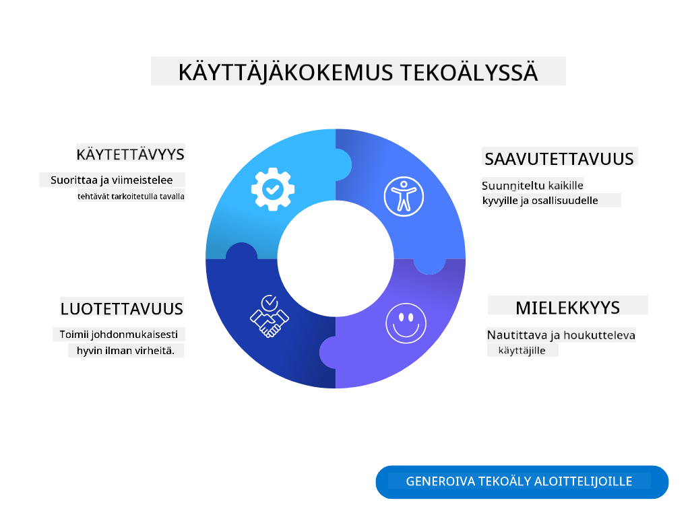
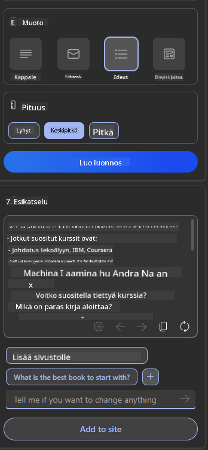
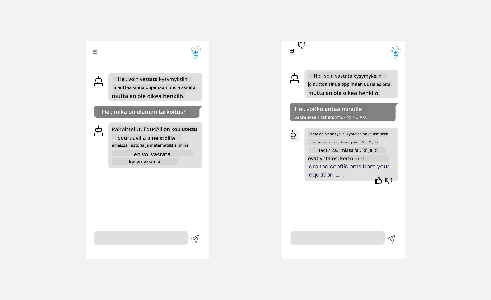

<!--
CO_OP_TRANSLATOR_METADATA:
{
  "original_hash": "ec385b41ee50579025d50cc03bfb3a25",
  "translation_date": "2025-07-09T14:59:56+00:00",
  "source_file": "12-designing-ux-for-ai-applications/README.md",
  "language_code": "fi"
}
-->
# Käyttökokemuksen suunnittelu tekoälysovelluksille

> _(Klikkaa yllä olevaa kuvaa nähdäksesi tämän oppitunnin videon)_

Käyttökokemus on erittäin tärkeä osa sovellusten rakentamista. Käyttäjien täytyy pystyä käyttämään sovellustasi tehokkaasti tehtävien suorittamiseen. Tehokkuus on yksi asia, mutta sinun täytyy myös suunnitella sovellukset niin, että ne ovat kaikkien käytettävissä eli _saavutettavia_. Tässä luvussa keskitytään tähän osa-alueeseen, jotta lopputuloksena olisi sovellus, jota ihmiset voivat ja haluavat käyttää.

## Johdanto

Käyttökokemus tarkoittaa sitä, miten käyttäjä vuorovaikuttaa ja käyttää tiettyä tuotetta tai palvelua, olipa kyseessä järjestelmä, työkalu tai suunnittelu. Tekoälysovelluksia kehitettäessä kehittäjät eivät keskity pelkästään siihen, että käyttökokemus olisi toimiva, vaan myös eettinen. Tässä oppitunnissa käsitellään, miten rakentaa tekoälysovelluksia, jotka vastaavat käyttäjien tarpeisiin.

Oppitunnissa käsitellään seuraavia aiheita:

- Johdanto käyttökokemukseen ja käyttäjätarpeiden ymmärtäminen
- Tekoälysovellusten suunnittelu luottamuksen ja läpinäkyvyyden näkökulmasta
- Tekoälysovellusten suunnittelu yhteistyötä ja palautetta varten

## Oppimistavoitteet

Tämän oppitunnin jälkeen osaat:

- Ymmärtää, miten rakentaa tekoälysovelluksia, jotka vastaavat käyttäjien tarpeisiin.
- Suunnitella tekoälysovelluksia, jotka edistävät luottamusta ja yhteistyötä.

### Esitiedot

Varaa aikaa ja lue lisää [käyttökokemuksesta ja design-ajattelusta.](https://learn.microsoft.com/training/modules/ux-design?WT.mc_id=academic-105485-koreyst)

## Johdanto käyttökokemukseen ja käyttäjätarpeiden ymmärtäminen

Kuvitteellisessa koulutukseen keskittyvässä startupissamme on kaksi pääkäyttäjäryhmää: opettajat ja opiskelijat. Molemmilla käyttäjäryhmillä on omat erityiset tarpeensa. Käyttäjäkeskeinen suunnittelu asettaa käyttäjän etusijalle varmistaen, että tuotteet ovat merkityksellisiä ja hyödyllisiä niille, joille ne on tarkoitettu.

Sovelluksen tulisi olla **käytännöllinen, luotettava, saavutettava ja miellyttävä** tarjotakseen hyvän käyttökokemuksen.

### Käytettävyys

Käytännöllisyys tarkoittaa, että sovelluksella on toimintoja, jotka vastaavat sen tarkoitusta, kuten automaattinen arvosteluprosessi tai kertauskorttien luominen. Sovelluksen, joka automatisoi arvostelun, tulisi pystyä tarkasti ja tehokkaasti antamaan pisteitä opiskelijoiden töille ennalta määriteltyjen kriteerien perusteella. Vastaavasti sovelluksen, joka luo kertauskortteja, tulisi pystyä tuottamaan relevantteja ja monipuolisia kysymyksiä datansa pohjalta.

### Luotettavuus

Luotettavuus tarkoittaa, että sovellus pystyy suorittamaan tehtävänsä johdonmukaisesti ja virheettömästi. Kuitenkin tekoäly, kuten ihmisetkin, ei ole täydellinen ja voi tehdä virheitä. Sovellukset voivat kohdata virheitä tai odottamattomia tilanteita, jotka vaativat ihmisen puuttumista tai korjausta. Miten käsittelet virheitä? Oppitunnin viimeisessä osassa käsitellään, miten tekoälyjärjestelmät ja sovellukset suunnitellaan yhteistyötä ja palautetta varten.

### Saavutettavuus

Saavutettavuus tarkoittaa käyttökokemuksen laajentamista erilaisilla kyvyillä varustetuille käyttäjille, mukaan lukien vammaiset, varmistaen, ettei ketään jätetä ulkopuolelle. Noudattamalla saavutettavuusohjeita ja -periaatteita tekoälyratkaisut muuttuvat inklusiivisemmiksi, helpommin käytettäviksi ja hyödyllisemmiksi kaikille käyttäjille.

### Miellyttävyys

Miellyttävyys tarkoittaa, että sovelluksen käyttö on nautinnollista. Houkutteleva käyttökokemus voi vaikuttaa positiivisesti käyttäjään, kannustaen tätä palaamaan sovellukseen ja lisäämään liiketoiminnan tuottoa.

Kaikkia haasteita ei voi ratkaista tekoälyllä. Tekoäly täydentää käyttökokemustasi, olipa kyse manuaalisten tehtävien automatisoinnista tai käyttökokemusten personoinnista.

## Tekoälysovellusten suunnittelu luottamuksen ja läpinäkyvyyden näkökulmasta

Luottamuksen rakentaminen on ratkaisevan tärkeää tekoälysovelluksia suunniteltaessa. Luottamus varmistaa, että käyttäjä on varma siitä, että sovellus hoitaa tehtävänsä, tuottaa tuloksia johdonmukaisesti ja että tulokset vastaavat käyttäjän tarpeita. Riskinä tässä on epäluottamus ja liiallinen luottamus. Epäluottamus syntyy, kun käyttäjällä on vähän tai ei lainkaan luottamusta tekoälyjärjestelmään, mikä johtaa sovelluksen hylkäämiseen. Liiallinen luottamus syntyy, kun käyttäjä yliarvioi tekoälyn kyvyt, mikä johtaa siihen, että käyttäjät luottavat tekoälyyn liikaa. Esimerkiksi automaattinen arvostelujärjestelmä voi liiallisen luottamuksen tapauksessa johtaa siihen, että opettaja ei tarkista kaikkia töitä varmistaakseen järjestelmän toimivuuden. Tämä voi johtaa epäreiluihin tai epätarkkoihin arvosanoihin tai menetettyihin mahdollisuuksiin antaa palautetta ja parantaa.

Kaksi tapaa varmistaa, että luottamus on suunnittelun keskiössä, ovat selitettävyys ja hallinta.

### Selitettävyys

Kun tekoäly auttaa päätöksenteossa, kuten tiedon välittämisessä tuleville sukupolville, on tärkeää, että opettajat ja vanhemmat ymmärtävät, miten tekoälyn päätökset tehdään. Tämä on selitettävyys – ymmärrys siitä, miten tekoälysovellukset tekevät päätöksiä. Selitettävyyttä suunniteltaessa lisätään esimerkkejä siitä, mitä tekoälysovellus voi tehdä. Esimerkiksi "Aloita tekoälyopettajan kanssa" sijaan järjestelmä voi käyttää: "Tiivistä muistiinpanosi helpompaa kertailua varten tekoälyn avulla."

Toinen esimerkki on, miten tekoäly käyttää käyttäjä- ja henkilötietoja. Esimerkiksi opiskelijapersoonalla voi olla rajoituksia persoonansa perusteella. Tekoäly ei välttämättä voi paljastaa vastauksia kysymyksiin, mutta voi auttaa ohjaamaan käyttäjää ajattelemaan, miten ongelman voisi ratkaista.

Viimeinen tärkeä osa selitettävyyttä on selitysten yksinkertaistaminen. Opiskelijat ja opettajat eivät välttämättä ole tekoälyasiantuntijoita, joten sovelluksen kykyjen ja rajoitusten selitysten tulisi olla yksinkertaisia ja helposti ymmärrettäviä.

### Hallinta

Generatiivinen tekoäly luo yhteistyön tekoälyn ja käyttäjän välille, jossa esimerkiksi käyttäjä voi muokata kehotteita eri tuloksia varten. Lisäksi, kun tulos on luotu, käyttäjien tulisi pystyä muokkaamaan tuloksia, mikä antaa heille hallinnan tunteen. Esimerkiksi Bingin käytössä voit räätälöidä kehotteesi muodon, sävyn ja pituuden mukaan. Lisäksi voit tehdä muutoksia tulokseen ja muokata sitä alla olevan kuvan mukaisesti:

Toinen Bingin ominaisuus, joka antaa käyttäjälle hallinnan sovellukseen, on mahdollisuus valita, haluaako osallistua tekoälyn käyttämän datan keräämiseen vai ei. Koulusovelluksessa opiskelija saattaa haluta käyttää sekä omia muistiinpanojaan että opettajan materiaaleja kertausaineistona.

> Tekoälysovelluksia suunniteltaessa tarkoituksellisuus on avainasemassa, jotta käyttäjät eivät luota liikaa asettaen epärealistisia odotuksia tekoälyn kyvyistä. Yksi tapa tehdä tämä on luoda kitkaa kehotteiden ja tulosten välille. Muistuttaa käyttäjää, että kyseessä on tekoäly, ei toinen ihminen.

## Tekoälysovellusten suunnittelu yhteistyötä ja palautetta varten

Kuten aiemmin mainittiin, generatiivinen tekoäly luo yhteistyön käyttäjän ja tekoälyn välille. Useimmiten vuorovaikutus tapahtuu siten, että käyttäjä syöttää kehotteen ja tekoäly tuottaa tuloksen. Entä jos tulos on virheellinen? Miten sovellus käsittelee virheitä, jos niitä ilmenee? Syyttääkö tekoäly käyttäjää vai käyttääkö se aikaa virheen selittämiseen?

Tekoälysovellukset tulisi rakentaa vastaanottamaan ja antamaan palautetta. Tämä ei ainoastaan auta tekoälyjärjestelmää kehittymään, vaan myös rakentaa luottamusta käyttäjien kanssa. Palautesilmukka tulisi sisällyttää suunnitteluun, esimerkiksi yksinkertaisena peukku ylös tai alas -toimintona tulokselle.

Toinen tapa käsitellä tätä on viestiä selkeästi järjestelmän kyvyt ja rajoitukset. Kun käyttäjä tekee virheen pyytämällä jotain tekoälyn kykyjen ulkopuolelta, tulisi olla myös keino käsitellä tämä, kuten alla on esitetty.

Järjestelmävirheet ovat yleisiä sovelluksissa, joissa käyttäjä saattaa tarvita apua tekoälyn ulkopuolisen tiedon kanssa tai sovelluksella voi olla rajoitus, kuinka monta kysymystä/aihetta käyttäjä voi tiivistää. Esimerkiksi tekoälysovellus, joka on koulutettu rajoitetuilla aineistoilla, kuten historiassa ja matematiikassa, ei välttämättä pysty käsittelemään maantietoon liittyviä kysymyksiä. Tämän välttämiseksi tekoälyjärjestelmä voi antaa vastauksen kuten: "Valitettavasti tuotteemme on koulutettu seuraavilla ainealueilla..., en pysty vastaamaan esittämääsi kysymykseen."

Tekoälysovellukset eivät ole täydellisiä, joten ne tekevät virheitä. Suunnitellessasi sovelluksiasi varmista, että luot tilaa käyttäjäpalautteelle ja virheiden käsittelylle tavalla, joka on yksinkertainen ja helposti selitettävissä.

## Tehtävä

Ota käyttöön jokin tähän mennessä rakentamasi tekoälysovellus ja harkitse seuraavien vaiheiden toteuttamista sovelluksessasi:

- **Miellyttävyys:** Mieti, miten voit tehdä sovelluksestasi miellyttävämmän. Lisäätkö selityksiä joka paikkaan? Kannustatko käyttäjää tutkimaan sovellusta? Miten muotoilet virheilmoituksesi?

- **Käytettävyys:** Rakennatko web-sovelluksen? Varmista, että sovellusta voi käyttää sekä hiirellä että näppäimistöllä.

- **Luottamus ja läpinäkyvyys:** Älä luota tekoälyyn ja sen tuloksiin täysin. Mieti, miten voisit lisätä ihmisen prosessiin tarkistamaan tulokset. Harkitse ja toteuta myös muita tapoja saavuttaa luottamus ja läpinäkyvyys.

- **Hallinta:** Anna käyttäjälle hallinta sovellukselle antamastaan datasta. Toteuta tapa, jolla käyttäjä voi valita, haluaako osallistua datan keräämiseen vai ei tekoälysovelluksessa.

## Jatka oppimista!

Oppitunnin suorittamisen jälkeen tutustu [Generative AI Learning -kokoelmaamme](https://aka.ms/genai-collection?WT.mc_id=academic-105485-koreyst) jatkaaksesi generatiivisen tekoälyn osaamisesi kehittämistä!

Siirry oppitunnille 13, jossa käsittelemme, miten [turvataan tekoälysovellukset](../13-securing-ai-applications/README.md?WT.mc_id=academic-105485-koreyst)!

**Vastuuvapauslauseke**:  
Tämä asiakirja on käännetty käyttämällä tekoälypohjaista käännöspalvelua [Co-op Translator](https://github.com/Azure/co-op-translator). Vaikka pyrimme tarkkuuteen, huomioithan, että automaattikäännöksissä saattaa esiintyä virheitä tai epätarkkuuksia. Alkuperäistä asiakirjaa sen alkuperäiskielellä tulee pitää virallisena lähteenä. Tärkeissä tiedoissa suositellaan ammattimaista ihmiskäännöstä. Emme ole vastuussa tämän käännöksen käytöstä aiheutuvista väärinymmärryksistä tai tulkinnoista.