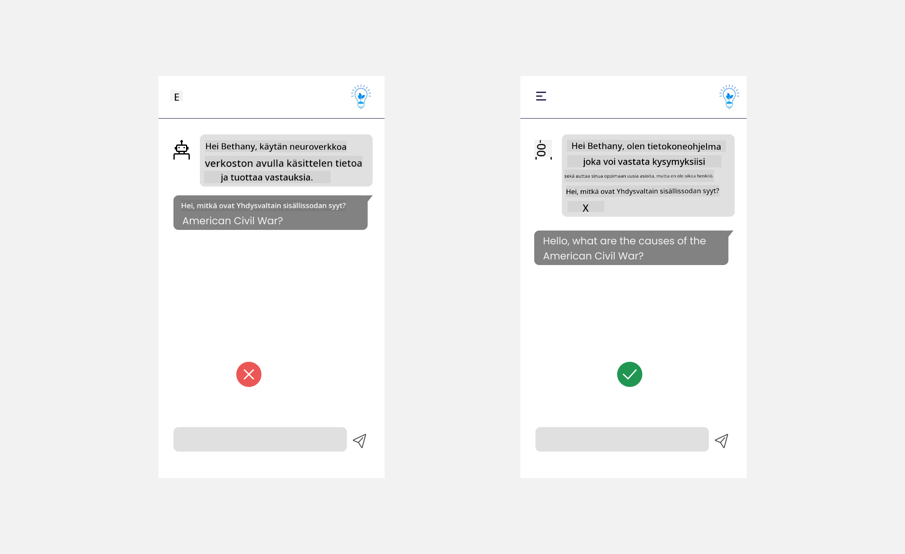

<!--
CO_OP_TRANSLATOR_METADATA:
{
  "original_hash": "747668e4c53d067369f06e9ec2e6313e",
  "translation_date": "2025-08-26T17:48:03+00:00",
  "source_file": "12-designing-ux-for-ai-applications/README.md",
  "language_code": "fi"
}
-->
# UX-suunnittelu tekoälysovelluksille

> _(Klikkaa yllä olevaa kuvaa nähdäksesi tämän oppitunnin videon)_

Käyttäjäkokemus on erittäin tärkeä osa sovellusten rakentamista. Käyttäjien täytyy pystyä käyttämään sovellustasi tehokkaasti suorittaakseen tehtäviä. Tehokkuus on tärkeää, mutta sovellukset täytyy myös suunnitella niin, että kaikki voivat käyttää niitä – eli niiden täytyy olla _esteettömiä_. Tässä luvussa keskitytään tähän aiheeseen, jotta lopulta suunnittelet sovelluksen, jota ihmiset voivat ja haluavat käyttää.

## Johdanto

Käyttäjäkokemus tarkoittaa sitä, miten käyttäjä on vuorovaikutuksessa tietyn tuotteen tai palvelun kanssa – oli kyseessä sitten järjestelmä, työkalu tai suunnittelu. Tekoälysovelluksia kehitettäessä kehittäjät eivät keskity vain tehokkaaseen käyttäjäkokemukseen, vaan myös eettisyyteen. Tässä oppitunnissa käymme läpi, miten rakennetaan tekoälysovelluksia, jotka vastaavat käyttäjien tarpeisiin.

Oppitunnilla käsitellään seuraavia aiheita:

- Johdatus käyttäjäkokemukseen ja käyttäjien tarpeiden ymmärtäminen
- Tekoälysovellusten suunnittelu luottamuksen ja läpinäkyvyyden näkökulmasta
- Tekoälysovellusten suunnittelu yhteistyötä ja palautetta varten

## Oppimistavoitteet

Tämän oppitunnin jälkeen osaat:

- Ymmärtää, miten rakennetaan tekoälysovelluksia, jotka vastaavat käyttäjien tarpeisiin.
- Suunnitella tekoälysovelluksia, jotka edistävät luottamusta ja yhteistyötä.

### Esitietovaatimus

Varaa hetki ja lue lisää [käyttäjäkokemuksesta ja design-ajattelusta.](https://learn.microsoft.com/training/modules/ux-design?WT.mc_id=academic-105485-koreyst)

## Johdatus käyttäjäkokemukseen ja käyttäjien tarpeiden ymmärtäminen

Kuvitteellisessa koulutus-startupissamme meillä on kaksi pääkäyttäjää: opettajat ja opiskelijat. Molemmilla käyttäjillä on omat erityiset tarpeensa. Käyttäjälähtöinen suunnittelu asettaa käyttäjän etusijalle varmistaen, että tuotteet ovat tarkoituksenmukaisia ja hyödyllisiä niille, joille ne on suunnattu.

Sovelluksen tulisi olla **hyödyllinen, luotettava, esteetön ja miellyttävä**, jotta käyttäjäkokemus olisi hyvä.

### Käytettävyys

Hyödyllisyys tarkoittaa, että sovelluksessa on toiminnallisuuksia, jotka vastaavat sen tarkoitusta, kuten arvioinnin automatisointi tai kertauskorttien luominen. Sovelluksen, joka automatisoi arvioinnin, tulisi pystyä antamaan pisteet opiskelijoiden töille tarkasti ja tehokkaasti ennalta määriteltyjen kriteerien perusteella. Vastaavasti sovelluksen, joka luo kertauskortteja, tulisi pystyä tuottamaan olennaisia ja monipuolisia kysymyksiä datansa pohjalta.

### Luotettavuus

Luotettavuus tarkoittaa, että sovellus pystyy suorittamaan tehtävänsä johdonmukaisesti ja virheettömästi. Tekoäly ei kuitenkaan ole täydellinen, vaan voi tehdä virheitä kuten ihmisetkin. Sovellukset voivat kohdata virheitä tai odottamattomia tilanteita, jotka vaativat ihmisen puuttumista tai korjausta. Miten virheet käsitellään? Tämän oppitunnin viimeisessä osassa käsitellään, miten tekoälyjärjestelmät ja -sovellukset suunnitellaan yhteistyötä ja palautetta varten.

### Esteettömyys

Esteettömyys tarkoittaa käyttäjäkokemuksen laajentamista erilaisille käyttäjille, myös vammaisille, jotta kukaan ei jää ulkopuolelle. Noudattamalla esteettömyysohjeita ja -periaatteita tekoälyratkaisuista tulee osallistavampia, helpommin käytettäviä ja hyödyllisempiä kaikille käyttäjille.

### Miellyttävyys

Miellyttävyys tarkoittaa, että sovellusta on mukava käyttää. Houkutteleva käyttäjäkokemus voi vaikuttaa positiivisesti käyttäjään, kannustaa palaamaan sovellukseen ja kasvattaa liiketoiminnan tuottoa.

Kaikkia haasteita ei voi ratkaista tekoälyllä. Tekoäly täydentää käyttäjäkokemusta, esimerkiksi automatisoimalla manuaalisia tehtäviä tai personoimalla käyttäjäkokemuksia.

## Tekoälysovellusten suunnittelu luottamuksen ja läpinäkyvyyden näkökulmasta

Luottamuksen rakentaminen on keskeistä tekoälysovelluksia suunniteltaessa. Luottamus varmistaa, että käyttäjä uskoo sovelluksen tekevän työnsä, tuottavan johdonmukaisia tuloksia ja että tulokset vastaavat käyttäjän tarpeita. Tähän liittyy riski epäluottamuksesta ja liiallisesta luottamuksesta. Epäluottamus syntyy, kun käyttäjä ei luota tekoälyjärjestelmään, mikä johtaa sovelluksen hylkäämiseen. Liiallinen luottamus taas syntyy, kun käyttäjä yliarvioi tekoälyn kyvyt ja luottaa siihen liikaa. Esimerkiksi automaattinen arviointijärjestelmä voi liiallisen luottamuksen seurauksena johtaa siihen, ettei opettaja tarkista osaa töistä varmistaakseen järjestelmän toimivuuden. Tämä voi johtaa epäoikeudenmukaisiin tai epätarkkoihin arvosanoihin tai palautteen ja kehitysmahdollisuuksien menetykseen.

Kaksi tapaa varmistaa, että luottamus on suunnittelun ytimessä, ovat selitettävyys ja hallinta.

### Selitettävyys

Kun tekoäly auttaa päätöksenteossa, kuten tiedon välittämisessä tuleville sukupolville, on tärkeää, että opettajat ja vanhemmat ymmärtävät, miten tekoäly tekee päätöksiä. Tätä kutsutaan selitettävyydestä – ymmärretään, miten tekoälysovellukset tekevät päätöksiä. Selitettävyyden suunnittelu tarkoittaa yksityiskohtien lisäämistä, jotka tuovat esiin, miten tekoäly päätyi tiettyyn lopputulokseen. Käyttäjien täytyy tietää, että tulos on tekoälyn eikä ihmisen tuottama. Esimerkiksi "Aloita keskustelu tutorisi kanssa nyt" sijaan voisi sanoa "Käytä tekoäly-tutoria, joka mukautuu tarpeisiisi ja auttaa sinua oppimaan omaan tahtiisi."

Toinen esimerkki on, miten tekoäly käyttää käyttäjän ja henkilötietoja. Esimerkiksi opiskelijapersoonalla voi olla rajoituksia persoonansa perusteella. Tekoäly ei välttämättä voi paljastaa vastauksia kysymyksiin, mutta voi ohjata käyttäjää pohtimaan, miten ongelma ratkaistaan.

Yksi tärkeä osa selitettävyyttä on selitysten yksinkertaistaminen. Opiskelijat ja opettajat eivät välttämättä ole tekoälyasiantuntijoita, joten selitysten siitä, mitä sovellus voi tai ei voi tehdä, tulisi olla yksinkertaisia ja helposti ymmärrettäviä.

### Hallinta

Generatiivinen tekoäly luo yhteistyötä tekoälyn ja käyttäjän välille, jolloin käyttäjä voi esimerkiksi muokata kehotteita saadakseen erilaisia tuloksia. Lisäksi, kun tulos on luotu, käyttäjän tulisi pystyä muokkaamaan tulosta, mikä antaa tunteen hallinnasta. Esimerkiksi Bingissä voit räätälöidä kehotteesi muodon, sävyn ja pituuden mukaan. Lisäksi voit tehdä muutoksia tulokseen ja muokata sitä, kuten alla näkyy:

Toinen Bingin ominaisuus, joka antaa käyttäjälle hallinnan tunnetta, on mahdollisuus valita, käyttääkö tekoäly dataasi vai ei. Koulusovelluksessa opiskelija saattaa haluta käyttää omia muistiinpanojaan sekä opettajan materiaaleja kertaukseen.

> Tekoälysovelluksia suunniteltaessa tarkoituksellisuus on tärkeää, jotta käyttäjät eivät luota liikaa tekoälyyn ja aseta epärealistisia odotuksia sen kyvyistä. Yksi tapa tehdä tämä on luoda kitkaa kehotteiden ja tulosten välille. Muistuta käyttäjää, että kyseessä on tekoäly, ei toinen ihminen.

## Tekoälysovellusten suunnittelu yhteistyötä ja palautetta varten

Kuten aiemmin mainittiin, generatiivinen tekoäly luo yhteistyötä käyttäjän ja tekoälyn välille. Useimmiten käyttäjä syöttää kehotteen ja tekoäly tuottaa vastauksen. Entä jos vastaus on väärä? Miten sovellus käsittelee virheitä, jos niitä ilmenee? Syyttääkö tekoäly käyttäjää vai selittääkö se virheen?

Tekoälysovelluksiin tulisi rakentaa mahdollisuus antaa ja vastaanottaa palautetta. Tämä auttaa paitsi tekoälyjärjestelmää kehittymään, myös rakentaa luottamusta käyttäjiin. Palautesilmukka tulisi sisällyttää suunnitteluun – esimerkkinä yksinkertainen peukku ylös tai alas annetulle vastaukselle.

Toinen tapa käsitellä tätä on viestiä selkeästi järjestelmän kyvyt ja rajoitukset. Kun käyttäjä tekee virheen pyytäessään jotain, mihin tekoäly ei pysty, tulisi olla tapa käsitellä tämä, kuten alla näkyy.

Järjestelmävirheet ovat yleisiä sovelluksissa, joissa käyttäjä saattaa tarvita apua tiedoissa, jotka ovat tekoälyn ulkopuolella, tai sovelluksella voi olla rajoitus, kuinka monta kysymystä/aihetta käyttäjä voi tiivistää. Esimerkiksi tekoälysovellus, joka on koulutettu vain rajatuilla aiheilla, kuten historia ja matematiikka, ei välttämättä pysty vastaamaan maantietoon liittyviin kysymyksiin. Tämän ratkaisemiseksi tekoäly voi vastata esimerkiksi: "Valitettavasti tuotteemme on koulutettu seuraavilla aiheilla....., en pysty vastaamaan kysymykseesi."

Tekoälysovellukset eivät ole täydellisiä, joten ne tekevät väistämättä virheitä. Suunnitellessasi sovelluksia varmista, että jätät tilaa käyttäjäpalautteelle ja virheiden käsittelylle yksinkertaisella ja helposti selitettävällä tavalla.

## Tehtävä

Valitse jokin tekoälysovellus, jonka olet rakentanut, ja harkitse seuraavien vaiheiden toteuttamista sovelluksessasi:

- **Miellyttävyys:** Mieti, miten voisit tehdä sovelluksestasi miellyttävämmän. Lisäätkö selityksiä kaikkialle? Kannustatko käyttäjää tutkimaan? Miten muotoilet virheilmoituksesi?

- **Käytettävyys:** Rakennatko verkkosovellusta? Varmista, että sovellustasi voi käyttää sekä hiirellä että näppäimistöllä.

- **Luottamus ja läpinäkyvyys:** Älä luota tekoälyyn ja sen tuloksiin sokeasti, vaan mieti, miten voisit lisätä ihmisen tarkistamaan tulokset. Harkitse ja toteuta myös muita tapoja saavuttaa luottamus ja läpinäkyvyys.

- **Hallinta:** Anna käyttäjälle mahdollisuus hallita, mitä tietoja hän antaa sovellukselle. Toteuta tapa, jolla käyttäjä voi valita, osallistuuko datan keräämiseen tekoälysovelluksessa vai ei.

## Jatka oppimista!

Kun olet suorittanut tämän oppitunnin, tutustu [Generatiivisen tekoälyn oppimiskokoelmaan](https://aka.ms/genai-collection?WT.mc_id=academic-105485-koreyst) ja syvennä osaamistasi!

Siirry oppituntiin 13, jossa käsittelemme [tekoälysovellusten suojaamista](../13-securing-ai-applications/README.md?WT.mc_id=academic-105485-koreyst)!

---

**Vastuuvapauslauseke**:  
Tämä asiakirja on käännetty käyttämällä tekoälypohjaista käännöspalvelua [Co-op Translator](https://github.com/Azure/co-op-translator). Vaikka pyrimme tarkkuuteen, automaattiset käännökset saattavat sisältää virheitä tai epätarkkuuksia. Alkuperäistä asiakirjaa sen omalla kielellä tulee pitää ensisijaisena lähteenä. Kriittisissä tapauksissa suositellaan ammattimaista ihmiskääntäjää. Emme ole vastuussa tämän käännöksen käytöstä mahdollisesti aiheutuvista väärinkäsityksistä tai tulkintavirheistä.