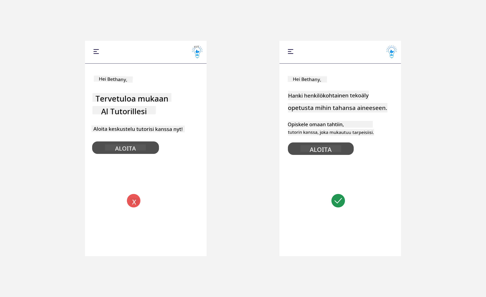
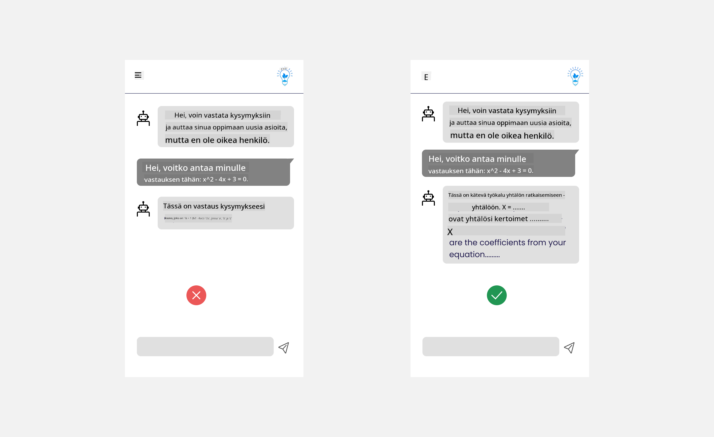
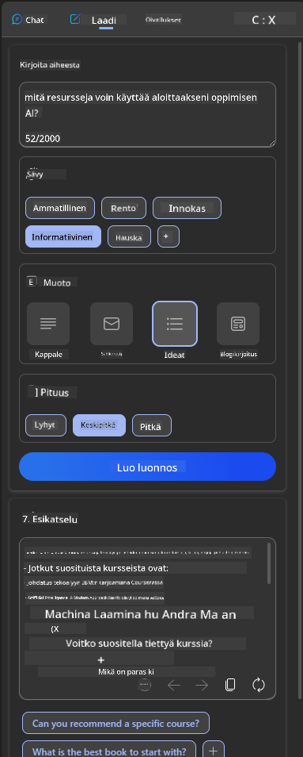

<!--
CO_OP_TRANSLATOR_METADATA:
{
  "original_hash": "78bbeed50fd4dc9fdee931f5daf98cb3",
  "translation_date": "2025-10-17T19:39:06+00:00",
  "source_file": "12-designing-ux-for-ai-applications/README.md",
  "language_code": "fi"
}
-->
# UX-suunnittelu tekoälysovelluksille

> _(Klikkaa yllä olevaa kuvaa nähdäksesi tämän oppitunnin videon)_

Käyttäjäkokemus on erittäin tärkeä osa sovellusten rakentamista. Käyttäjien täytyy pystyä käyttämään sovellustasi tehokkaasti tehtäviensä suorittamiseen. Tehokkuus on yksi asia, mutta sovellukset täytyy myös suunnitella niin, että ne ovat kaikkien käytettävissä, eli _esteettömiä_. Tämä luku keskittyy tähän aiheeseen, jotta lopulta suunnittelet sovelluksen, jota ihmiset voivat ja haluavat käyttää.

## Johdanto

Käyttäjäkokemus tarkoittaa sitä, miten käyttäjä on vuorovaikutuksessa tietyn tuotteen tai palvelun kanssa, olipa kyseessä järjestelmä, työkalu tai suunnittelu. Tekoälysovelluksia kehitettäessä kehittäjät keskittyvät paitsi varmistamaan, että käyttäjäkokemus on tehokas, myös siihen, että se on eettinen. Tässä oppitunnissa käsittelemme, miten rakentaa tekoälysovelluksia, jotka vastaavat käyttäjien tarpeisiin.

Oppitunnilla käsitellään seuraavia aiheita:

- Johdatus käyttäjäkokemukseen ja käyttäjien tarpeiden ymmärtäminen
- Tekoälysovellusten suunnittelu luottamuksen ja läpinäkyvyyden näkökulmasta
- Tekoälysovellusten suunnittelu yhteistyön ja palautteen näkökulmasta

## Oppimistavoitteet

Tämän oppitunnin jälkeen osaat:

- Ymmärtää, miten rakentaa tekoälysovelluksia, jotka vastaavat käyttäjien tarpeisiin.
- Suunnitella tekoälysovelluksia, jotka edistävät luottamusta ja yhteistyötä.

### Esitietovaatimus

Tutustu tarkemmin [käyttäjäkokemukseen ja design-ajatteluun.](https://learn.microsoft.com/training/modules/ux-design?WT.mc_id=academic-105485-koreyst)

## Johdatus käyttäjäkokemukseen ja käyttäjien tarpeiden ymmärtäminen

Kuvitteellisessa koulutusstartupissamme meillä on kaksi pääasiallista käyttäjäryhmää: opettajat ja opiskelijat. Molemmilla käyttäjäryhmillä on omat erityiset tarpeensa. Käyttäjäkeskeinen suunnittelu asettaa käyttäjän etusijalle varmistaen, että tuotteet ovat tarkoituksenmukaisia ja hyödyllisiä niille, joille ne on tarkoitettu.

Sovelluksen tulisi olla **hyödyllinen, luotettava, esteetön ja miellyttävä**, jotta se tarjoaa hyvän käyttäjäkokemuksen.

### Käytettävyys

Hyödyllisyys tarkoittaa, että sovelluksella on toiminnallisuuksia, jotka vastaavat sen tarkoitusta, kuten arviointiprosessin automatisointi tai muistikorttien luominen kertausta varten. Sovelluksen, joka automatisoi arviointiprosessin, tulisi pystyä tarkasti ja tehokkaasti antamaan pisteitä opiskelijoiden töille ennalta määriteltyjen kriteerien perusteella. Vastaavasti sovelluksen, joka luo muistikortteja, tulisi pystyä tuottamaan relevantteja ja monipuolisia kysymyksiä datansa perusteella.

### Luotettavuus

Luotettavuus tarkoittaa, että sovellus pystyy suorittamaan tehtävänsä johdonmukaisesti ja virheettömästi. Kuitenkin, kuten ihmiset, tekoäly ei ole täydellinen ja voi olla altis virheille. Sovellukset voivat kohdata virheitä tai odottamattomia tilanteita, jotka vaativat ihmisen väliintuloa tai korjausta. Miten virheet käsitellään? Oppitunnin viimeisessä osassa käsittelemme, miten tekoälyjärjestelmät ja -sovellukset suunnitellaan yhteistyötä ja palautetta varten.

### Esteettömyys

Esteettömyys tarkoittaa käyttäjäkokemuksen laajentamista erilaisille käyttäjille, mukaan lukien vammaiset, varmistaen, ettei ketään jätetä ulkopuolelle. Noudattamalla esteettömyysohjeita ja -periaatteita tekoälyratkaisuista tulee inklusiivisempia, käyttökelpoisempia ja hyödyllisempiä kaikille käyttäjille.

### Miellyttävyys

Miellyttävyys tarkoittaa, että sovellusta on mukava käyttää. Houkutteleva käyttäjäkokemus voi vaikuttaa positiivisesti käyttäjään, kannustaen häntä palaamaan sovelluksen pariin ja lisäten liiketoiminnan tuottoa.

Kaikkia haasteita ei voida ratkaista tekoälyllä. Tekoäly täydentää käyttäjäkokemusta, olipa kyseessä manuaalisten tehtävien automatisointi tai käyttäjäkokemuksen personointi.

## Tekoälysovellusten suunnittelu luottamuksen ja läpinäkyvyyden näkökulmasta

Luottamuksen rakentaminen on kriittistä tekoälysovellusten suunnittelussa. Luottamus varmistaa, että käyttäjä on varma siitä, että sovellus hoitaa tehtävänsä, tuottaa johdonmukaisia tuloksia ja että tulokset vastaavat käyttäjän tarpeita. Tällä alueella riskinä on epäluottamus ja liiallinen luottamus. Epäluottamus syntyy, kun käyttäjällä on vähän tai ei lainkaan luottamusta tekoälyjärjestelmään, mikä johtaa sovelluksen hylkäämiseen. Liiallinen luottamus syntyy, kun käyttäjä yliarvioi tekoälyjärjestelmän kyvyt, mikä johtaa siihen, että käyttäjä luottaa liikaa tekoälyjärjestelmään. Esimerkiksi automatisoitu arviointijärjestelmä voi liiallisen luottamuksen tapauksessa johtaa siihen, että opettaja ei tarkista joitakin töitä varmistaakseen, että arviointijärjestelmä toimii hyvin. Tämä voisi johtaa epäoikeudenmukaisiin tai epätarkkoihin arvosanoihin opiskelijoille tai menetettyihin mahdollisuuksiin antaa palautetta ja parannusehdotuksia.

Kaksi tapaa varmistaa, että luottamus on suunnittelun keskiössä, ovat selitettävyys ja hallinta.

### Selitettävyys

Kun tekoäly auttaa päätöksenteossa, kuten tiedon siirtämisessä tuleville sukupolville, on kriittistä, että opettajat ja vanhemmat ymmärtävät, miten tekoäly tekee päätöksiä. Tämä on selitettävyys - ymmärrys siitä, miten tekoälysovellukset tekevät päätöksiä. Selitettävyys voidaan huomioida suunnittelussa lisäämällä yksityiskohtia, jotka korostavat, miten tekoäly päätyi tiettyyn lopputulokseen. Käyttäjien on oltava tietoisia siitä, että tulos on tekoälyn eikä ihmisen tuottama. Esimerkiksi sen sijaan, että sanottaisiin "Aloita keskustelu tutorisi kanssa nyt", voisi sanoa "Käytä tekoälytutoria, joka mukautuu tarpeisiisi ja auttaa sinua oppimaan omaan tahtiisi."

Toinen esimerkki on, miten tekoäly käyttää käyttäjän ja henkilökohtaisia tietoja. Esimerkiksi opiskelijapersoonalla voi olla rajoituksia, jotka perustuvat hänen rooliinsa. Tekoäly ei ehkä pysty paljastamaan vastauksia kysymyksiin, mutta voi auttaa käyttäjää pohtimaan, miten hän voi ratkaista ongelman.

Viimeinen tärkeä osa selitettävyydessä on selitysten yksinkertaistaminen. Opiskelijat ja opettajat eivät välttämättä ole tekoälyn asiantuntijoita, joten selitykset siitä, mitä sovellus voi tai ei voi tehdä, tulisi yksinkertaistaa ja tehdä helposti ymmärrettäviksi.

### Hallinta

Generatiivinen tekoäly luo yhteistyötä tekoälyn ja käyttäjän välillä, jossa esimerkiksi käyttäjä voi muokata kehotteita saadakseen erilaisia tuloksia. Lisäksi, kun tulos on luotu, käyttäjien tulisi pystyä muokkaamaan tuloksia, mikä antaa heille tunteen hallinnasta. Esimerkiksi Bingissä voit muokata kehotettasi muodon, sävyn ja pituuden perusteella. Lisäksi voit tehdä muutoksia tulokseen ja muokata sitä, kuten alla on esitetty:

Toinen Bingin ominaisuus, joka antaa käyttäjälle hallinnan sovelluksesta, on mahdollisuus valita, haluaako käyttäjä antaa tekoälyn käyttää hänen dataansa vai ei. Esimerkiksi koulusovelluksessa opiskelija saattaa haluta käyttää muistiinpanojaan sekä opettajan materiaaleja kertaamiseen.

> Tekoälysovelluksia suunniteltaessa tarkoituksellisuus on avainasemassa, jotta käyttäjät eivät luota liikaa ja aseta epärealistisia odotuksia sen kyvyille. Yksi tapa tehdä tämä on luoda kitkaa kehotteiden ja tulosten välille. Muistuta käyttäjää, että kyseessä on tekoäly eikä toinen ihminen.

## Tekoälysovellusten suunnittelu yhteistyön ja palautteen näkökulmasta

Kuten aiemmin mainittiin, generatiivinen tekoäly luo yhteistyötä käyttäjän ja tekoälyn välillä. Useimmat vuorovaikutukset tapahtuvat, kun käyttäjä syöttää kehotteen ja tekoäly tuottaa tuloksen. Entä jos tulos on virheellinen? Miten sovellus käsittelee virheitä, jos niitä ilmenee? Syyttääkö tekoäly käyttäjää vai selittääkö se virheen?

Tekoälysovellusten tulisi olla rakennettu vastaanottamaan ja antamaan palautetta. Tämä ei ainoastaan auta tekoälyjärjestelmää parantumaan, vaan myös rakentaa luottamusta käyttäjien kanssa. Palautesilmukka tulisi sisällyttää suunnitteluun, esimerkiksi yksinkertainen peukku ylös tai alas tuloksen kohdalla.

Toinen tapa käsitellä tätä on selkeästi viestiä järjestelmän kyvyt ja rajoitukset. Kun käyttäjä tekee virheen pyytäessään jotain, joka ylittää tekoälyn kyvyt, tulisi olla tapa käsitellä tämä, kuten alla on esitetty.

Järjestelmävirheet ovat yleisiä sovelluksissa, joissa käyttäjä saattaa tarvita apua tiedoissa, jotka ovat tekoälyn ulottumattomissa, tai sovelluksella voi olla rajoituksia siitä, kuinka monta kysymystä/aihetta käyttäjä voi luoda tiivistelmiä. Esimerkiksi tekoälysovellus, joka on koulutettu rajallisilla aiheilla, kuten historia ja matematiikka, ei ehkä pysty käsittelemään maantiedon kysymyksiä. Tämän lieventämiseksi tekoälyjärjestelmä voi antaa vastauksen, kuten: "Valitettavasti tuotteemme on koulutettu seuraavilla aiheilla....., en pysty vastaamaan kysymykseesi."

Tekoälysovellukset eivät ole täydellisiä, joten ne ovat alttiita virheille. Kun suunnittelet sovelluksiasi, sinun tulisi varmistaa, että luot tilaa käyttäjien palautteelle ja virheiden käsittelylle tavalla, joka on yksinkertainen ja helposti ymmärrettävä.

## Tehtävä

Ota mikä tahansa tekoälysovellus, jonka olet tähän mennessä rakentanut, ja harkitse seuraavien vaiheiden toteuttamista sovelluksessasi:

- **Miellyttävyys:** Mieti, miten voit tehdä sovelluksestasi miellyttävämmän. Lisäätkö selityksiä kaikkialle? Kannustatko käyttäjää tutkimaan? Miten muotoilet virheilmoituksesi?

- **Käytettävyys:** Rakennatko verkkosovellusta. Varmista, että sovelluksesi on navigoitavissa sekä hiirellä että näppäimistöllä.

- **Luottamus ja läpinäkyvyys:** Älä luota tekoälyyn täysin ja sen tuloksiin, mieti, miten voisit lisätä ihmisen prosessiin varmistamaan tulokset. Mieti ja toteuta myös muita tapoja saavuttaa luottamus ja läpinäkyvyys.

- **Hallinta:** Anna käyttäjälle hallinta siitä, mitä dataa hän antaa sovellukselle. Toteuta tapa, jolla käyttäjä voi valita, haluaako hän antaa datansa tekoälyn käyttöön vai ei.

<!-- ## [Oppitunnin jälkeinen kysely](../../../12-designing-ux-for-ai-applications/quiz-url) -->

## Jatka oppimistasi!

Kun olet suorittanut tämän oppitunnin, tutustu [Generatiivisen tekoälyn oppimiskokoelmaan](https://aka.ms/genai-collection?WT.mc_id=academic-105485-koreyst) jatkaaksesi generatiivisen tekoälyn tietämyksesi kehittämistä!

Siirry oppituntiin 13, jossa tarkastelemme [tekoälysovellusten suojaamista](../13-securing-ai-applications/README.md?WT.mc_id=academic-105485-koreyst)!

---

**Vastuuvapauslauseke**:  
Tämä asiakirja on käännetty käyttämällä tekoälypohjaista käännöspalvelua [Co-op Translator](https://github.com/Azure/co-op-translator). Vaikka pyrimme tarkkuuteen, huomioithan, että automaattiset käännökset voivat sisältää virheitä tai epätarkkuuksia. Alkuperäinen asiakirja sen alkuperäisellä kielellä tulisi pitää ensisijaisena lähteenä. Kriittisen tiedon osalta suositellaan ammattimaista ihmiskäännöstä. Emme ole vastuussa väärinkäsityksistä tai virhetulkinnoista, jotka johtuvat tämän käännöksen käytöstä.