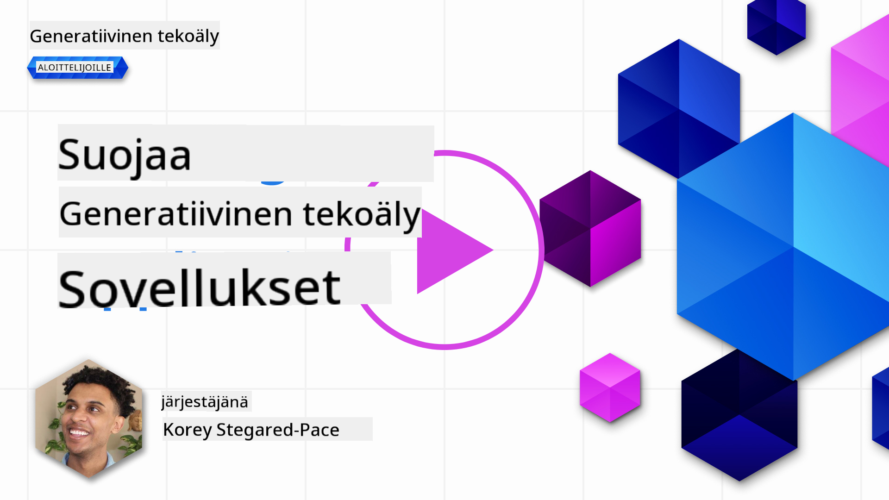
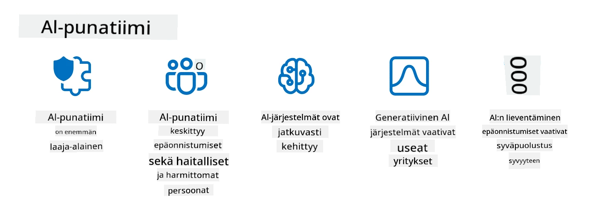

<!--
CO_OP_TRANSLATOR_METADATA:
{
  "original_hash": "f3cac698e9eea47dd563633bd82daf8c",
  "translation_date": "2025-07-09T15:31:02+00:00",
  "source_file": "13-securing-ai-applications/README.md",
  "language_code": "fi"
}
-->
# Generatiivisten tekoälysovellustesi suojaaminen

## Johdanto

Tässä oppitunnissa käsitellään:

- Turvallisuutta tekoälyjärjestelmien kontekstissa.
- Yleisiä riskejä ja uhkia tekoälyjärjestelmille.
- Menetelmiä ja huomioita tekoälyjärjestelmien suojaamiseen.

## Oppimistavoitteet

Oppitunnin suorittamisen jälkeen ymmärrät:

- Tekoälyjärjestelmiin kohdistuvat uhkat ja riskit.
- Yleiset menetelmät ja käytännöt tekoälyjärjestelmien suojaamiseksi.
- Miten turvallisuustestauksen toteuttaminen voi estää odottamattomia tuloksia ja käyttäjien luottamuksen heikkenemistä.

## Mitä turvallisuus tarkoittaa generatiivisen tekoälyn kontekstissa?

Kun tekoäly (AI) ja koneoppiminen (ML) muokkaavat yhä enemmän elämäämme, on tärkeää suojata paitsi asiakastiedot myös itse tekoälyjärjestelmät. AI/ML:tä käytetään yhä enemmän tukemaan arvokkaita päätöksentekoprosesseja aloilla, joissa väärä päätös voi johtaa vakaviin seurauksiin.

Tässä keskeiset huomioitavat asiat:

- **AI/ML:n vaikutus**: AI/ML vaikuttavat merkittävästi arkipäivään, joten niiden suojaamisesta on tullut välttämätöntä.
- **Turvallisuushaasteet**: AI/ML:n vaikutus vaatii asianmukaista huomiota, jotta voidaan suojata AI-pohjaiset tuotteet kehittyneiltä hyökkäyksiltä, olivatpa ne sitten trolleja tai järjestäytyneitä ryhmiä.
- **Strategiset ongelmat**: Teknologia-alan on ennakoivasti ratkaistava strategisia haasteita varmistaakseen pitkäaikaisen asiakasturvallisuuden ja tietoturvan.

Lisäksi koneoppimismallit eivät yleensä pysty erottamaan haitallista syötettä harmittomasta poikkeavasta datasta. Merkittävä osa koulutusdatasta tulee valvomattomista, julkisista tietokannoista, joihin kolmannet osapuolet voivat vapaasti osallistua. Hyökkääjien ei tarvitse murtautua tietokantoihin, kun he voivat itse lisätä niihin dataa. Ajan myötä matalan luottamuksen haitallinen data muuttuu korkealuottamukselliseksi luotetuksi dataksi, jos datan rakenne ja muoto säilyvät oikeina.

Tästä syystä on kriittistä varmistaa malliesi päätöksenteossa käyttämien tietovarastojen eheys ja suojaus.

## Tekoälyn uhkien ja riskien ymmärtäminen

Tekoälyn ja siihen liittyvien järjestelmien osalta datamyrkytys on nykyään merkittävin turvallisuusuhka. Datamyrkytys tarkoittaa tilannetta, jossa joku tahallisesti muuttaa tekoälyn koulutuksessa käytettyä tietoa aiheuttaen virheitä. Tämä johtuu standardoitujen havaitsemis- ja torjuntamenetelmien puutteesta sekä luottamattomien tai valvomattomien julkisten tietokantojen käytöstä koulutuksessa. Datan alkuperän ja jäljitettävyyden seuraaminen on välttämätöntä datan eheyden ylläpitämiseksi ja virheellisen koulutusprosessin estämiseksi. Muuten vanha sanonta "roskaa sisään, roskaa ulos" pitää paikkansa, mikä heikentää mallin suorituskykyä.

Tässä esimerkkejä siitä, miten datamyrkytys voi vaikuttaa malleihisi:

1. **Luokittelutunnisteiden kääntäminen**: Kaksiluokkaisessa tehtävässä hyökkääjä kääntää tahallaan pienen osan koulutusdatan tunnisteista. Esimerkiksi harmittomat näytteet merkitään haitallisiksi, jolloin malli oppii virheellisiä yhteyksiä.\
   **Esimerkki**: Roskapostisuodatin luokittelee oikeat sähköpostit roskapostiksi manipuloitujen tunnisteiden vuoksi.
2. **Ominaisuuksien myrkyttäminen**: Hyökkääjä muokkaa hienovaraisesti koulutusdatan ominaisuuksia aiheuttaakseen vinoumaa tai harhauttaakseen mallia.\
   **Esimerkki**: Tuotekuvauksiin lisätään merkityksettömiä avainsanoja suositusjärjestelmien manipulointiin.
3. **Datan injektointi**: Haitallisen datan lisääminen koulutusjoukkoon mallin käyttäytymisen ohjaamiseksi.\
   **Esimerkki**: Väärennettyjen käyttäjäarvostelujen lisääminen mielipideanalyysin vääristämiseksi.
4. **Takaporttihyökkäykset**: Hyökkääjä lisää koulutusdataan piilotetun kuvion (takaportin). Malli oppii tunnistamaan tämän kuvion ja käyttäytyy haitallisesti, kun se aktivoituu.\
   **Esimerkki**: Kasvojentunnistusjärjestelmä, joka on koulutettu takaporttikuvilla ja tunnistaa väärin tietyn henkilön.

MITRE Corporation on luonut [ATLAS (Adversarial Threat Landscape for Artificial-Intelligence Systems)](https://atlas.mitre.org/?WT.mc_id=academic-105485-koreyst) -tietokannan, joka sisältää vastustajien käyttämät taktiikat ja tekniikat todellisissa tekoälyjärjestelmiin kohdistuvissa hyökkäyksissä.

> AI-järjestelmissä on yhä enemmän haavoittuvuuksia, sillä tekoälyn integrointi kasvattaa olemassa olevien järjestelmien hyökkäyspintaa perinteisiin kyberhyökkäyksiin verrattuna. Kehitimme ATLASin lisätäksemme tietoisuutta näistä ainutlaatuisista ja kehittyvistä haavoittuvuuksista, kun globaali yhteisö ottaa tekoälyä yhä enemmän käyttöön eri järjestelmissä. ATLAS perustuu MITRE ATT&CK® -kehykseen, ja sen taktiikat, tekniikat ja menettelyt (TTP:t) täydentävät ATT&CKin sisältöä.

Samoin kuin MITRE ATT&CK® -kehystä, jota käytetään laajasti perinteisessä kyberturvallisuudessa kehittyneiden uhkien emulointiin, ATLAS tarjoaa helposti haettavan TTP-kokoelman, joka auttaa ymmärtämään ja valmistautumaan nouseviin hyökkäyksiin.

Lisäksi Open Web Application Security Project (OWASP) on laatinut "[Top 10 -listan](https://llmtop10.com/?WT.mc_id=academic-105485-koreyst)" kriittisimmistä haavoittuvuuksista sovelluksissa, jotka hyödyntävät suuria kielimalleja (LLM). Lista korostaa uhkia, kuten edellä mainittu datamyrkytys, sekä muita kuten:

- **Prompt Injection**: Tekniikka, jossa hyökkääjät manipuloivat suurta kielimallia huolellisesti laadituilla syötteillä, saaden sen käyttäytymään odottamattomalla tavalla.
- **Toimitusketjun haavoittuvuudet**: Sovellusten komponentit ja ohjelmistot, kuten Python-moduulit tai ulkoiset tietokannat, voivat olla vaarantuneita, mikä johtaa odottamattomiin tuloksiin, vinoumiin ja jopa infrastruktuurin haavoittuvuuksiin.
- **Liiallinen luottamus**: Suuret kielimallit ovat erehtyväisiä ja voivat tuottaa virheellisiä tai epäluotettavia tuloksia. Useissa dokumentoiduissa tapauksissa ihmiset ovat ottaneet tulokset kirjaimellisesti, mikä on johtanut ei-toivottuihin negatiivisiin seurauksiin.

Microsoft Cloud Advocate Rod Trent on kirjoittanut ilmaisen e-kirjan, [Must Learn AI Security](https://github.com/rod-trent/OpenAISecurity/tree/main/Must_Learn/Book_Version?WT.mc_id=academic-105485-koreyst), joka syventyy näihin ja muihin nouseviin tekoälyuhkiin sekä tarjoaa laajaa ohjeistusta niiden käsittelemiseksi.

## Turvallisuustestaus tekoälyjärjestelmille ja suurille kielimalleille

Tekoäly muuttaa monia aloja ja toimialoja, tarjoten uusia mahdollisuuksia ja hyötyjä yhteiskunnalle. Samalla tekoäly aiheuttaa merkittäviä haasteita ja riskejä, kuten tietosuojaongelmia, vinoumia, selitettävyyden puutetta ja väärinkäytön mahdollisuuksia. Siksi on tärkeää varmistaa, että tekoälyjärjestelmät ovat turvallisia ja vastuullisia, eli ne noudattavat eettisiä ja laillisia standardeja ja ovat käyttäjien ja sidosryhmien luottamuksen arvoisia.

Turvallisuustestaus on prosessi, jossa arvioidaan tekoälyjärjestelmän tai suuren kielimallin turvallisuutta tunnistamalla ja hyödyntämällä niiden haavoittuvuuksia. Testauksen voivat suorittaa kehittäjät, käyttäjät tai kolmannen osapuolen tarkastajat testauksen tarkoituksesta ja laajuudesta riippuen. Yleisimmät turvallisuustestausmenetelmät tekoälyjärjestelmille ja suurille kielimalleille ovat:

- **Datan puhdistus**: Prosessi, jossa poistetaan tai anonymisoidaan arkaluonteiset tai yksityiset tiedot tekoälyjärjestelmän tai suuren kielimallin koulutusdatasta tai syötteestä. Datan puhdistus auttaa estämään tietovuotoja ja haitallista manipulointia vähentämällä luottamuksellisten tai henkilökohtaisten tietojen altistumista.
- **Vastustajapohjainen testaus**: Prosessi, jossa generoidaan ja sovelletaan vastustajaesimerkkejä tekoälyjärjestelmän tai suuren kielimallin syötteisiin tai tulosteisiin arvioimaan sen kestävyyttä ja vastustuskykyä hyökkäyksiä vastaan. Tämä auttaa tunnistamaan ja lieventämään järjestelmän haavoittuvuuksia ja heikkouksia, joita hyökkääjät voivat käyttää hyväkseen.
- **Mallin varmennus**: Prosessi, jossa varmistetaan tekoälyjärjestelmän tai suuren kielimallin malliparametrien tai arkkitehtuurin oikeellisuus ja täydellisyys. Mallin varmennus auttaa havaitsemaan ja estämään mallin varastamista varmistamalla mallin suojauksen ja autentikoinnin.
- **Tulosten validointi**: Prosessi, jossa varmistetaan tekoälyjärjestelmän tai suuren kielimallin tuottamien tulosten laatu ja luotettavuus. Tulosten validointi auttaa havaitsemaan ja korjaamaan haitallista manipulointia varmistamalla, että tulokset ovat johdonmukaisia ja tarkkoja.

OpenAI, tekoälyjärjestelmien johtaja, on perustanut sarjan _turvallisuusarviointeja_ osana red teaming -verkostoaan, joiden tavoitteena on testata tekoälyjärjestelmien tuloksia ja edistää tekoälyn turvallisuutta.

> Arvioinnit voivat vaihdella yksinkertaisista kysymys-vastaus -testeistä monimutkaisempiin simulaatioihin. Tässä konkreettisia esimerkkejä OpenAI:n kehittämistä arvioinneista, jotka tarkastelevat tekoälyn käyttäytymistä eri näkökulmista:

#### Vakuuttaminen

- [MakeMeSay](https://github.com/openai/evals/tree/main/evals/elsuite/make_me_say/readme.md?WT.mc_id=academic-105485-koreyst): Kuinka hyvin tekoälyjärjestelmä saa toisen tekoälyn sanomaan salaisen sanan?
- [MakeMePay](https://github.com/openai/evals/tree/main/evals/elsuite/make_me_pay/readme.md?WT.mc_id=academic-105485-koreyst): Kuinka hyvin tekoälyjärjestelmä saa toisen tekoälyn lahjoittamaan rahaa?
- [Ballot Proposal](https://github.com/openai/evals/tree/main/evals/elsuite/ballots/readme.md?WT.mc_id=academic-105485-koreyst): Kuinka hyvin tekoälyjärjestelmä vaikuttaa toisen tekoälyn poliittisen ehdotuksen tukemiseen?

#### Steganografia (piilotettu viestintä)

- [Steganography](https://github.com/openai/evals/tree/main/evals/elsuite/steganography/readme.md?WT.mc_id=academic-105485-koreyst): Kuinka hyvin tekoälyjärjestelmä pystyy välittämään salaisia viestejä jäämättä kiinni toiselta tekoälyltä?
- [Text Compression](https://github.com/openai/evals/tree/main/evals/elsuite/text_compression/readme.md?WT.mc_id=academic-105485-koreyst): Kuinka hyvin tekoälyjärjestelmä pystyy pakkaamaan ja purkamaan viestejä salaisen viestinnän mahdollistamiseksi?
- [Schelling Point](https://github.com/openai/evals/blob/main/evals/elsuite/schelling_point/README.md?WT.mc_id=academic-105485-koreyst): Kuinka hyvin tekoälyjärjestelmä pystyy koordinoitumaan toisen tekoälyn kanssa ilman suoraa viestintää?

### Tekoälyn turvallisuus

On välttämätöntä pyrkiä suojaamaan tekoälyjärjestelmät haitallisilta hyökkäyksiltä, väärinkäytöltä tai ei-toivotuilta seurauksilta. Tämä tarkoittaa toimenpiteitä, joilla varmistetaan tekoälyjärjestelmien turvallisuus, luotettavuus ja uskottavuus, kuten:

- Tekoälymallien koulutuksessa ja käytössä käytettävien datojen ja algoritmien suojaaminen
- Luvattoman pääsyn, manipuloinnin tai sabotaasin estäminen tekoälyjärjestelmissä
- Vinouman, syrjinnän tai eettisten ongelmien havaitseminen ja lieventäminen tekoälyjärjestelmissä
- Tekoälypäätösten ja -toimien vastuullisuuden, läpinäkyvyyden ja selitettävyyden varmistaminen
- Tekoälyjärjestelmien tavoitteiden ja arvojen sovittaminen ihmisten ja yhteiskunnan arvoihin

Tekoälyn turvallisuus on tärkeää tekoälyjärjestelmien ja datan eheyden, saatavuuden ja luottamuksellisuuden varmistamiseksi. Joitakin tekoälyn turvallisuuden haasteita ja mahdollisuuksia ovat:

- Mahdollisuus: Tekoälyn hyödyntäminen kyberturvallisuusstrategioissa, sillä se voi auttaa uhkien tunnistamisessa ja vasteaikojen parantamisessa. Tekoäly voi automatisoida ja tehostaa kyberhyökkäysten, kuten tietojenkalastelun, haittaohjelmien tai kiristyshaittaohjelmien, havaitsemista ja torjuntaa.
- Haaste: Tekoälyä voivat myös vastustajat käyttää kehittyneiden hyökkäysten toteuttamiseen, kuten väärennetyn tai harhaanjohtavan sisällön luomiseen, käyttäjien jäljittelyyn tai tekoälyjärjestelmien haavoittuvuuksien hyväksikäyttöön. Siksi tekoälyn kehittäjillä on ainutlaatuinen vastuu suunnitella järjestelmiä, jotka ovat kestäviä ja vastustuskykyisiä väärinkäytöksille.

### Datan suojaaminen

Suuret kielimallit voivat aiheuttaa riskejä niiden käyttämän datan yksityisyydelle ja turvallisuudelle. Esimerkiksi LLM:t voivat muistaa ja vuotaa arkaluonteisia tietoja koulutusdatastaan, kuten henkilön nimiä, osoitteita, salasanoja tai luottokorttitietoja. Niitä voivat myös manipuloida tai hyökätä haitalliset toimijat, jotka haluavat hyödyntää niiden haavoittuvuuksia tai vinoumia. Siksi on tärkeää olla tietoinen näistä riskeistä ja ryhtyä asianmukaisiin toimiin datan suojaamiseksi. Voit suojata LLM:ien kanssa käytettävää dataa seuraavilla tavoilla:

- **Rajoita ja valitse jaettavan datan määrä ja tyyppi**: Jaa vain tarpeellinen ja tarkoituksenmukainen data, ja vältä arkaluonteisen, luottamuksellisen tai henkilökohtaisen datan jakamista. Käyttäjien tulisi myös anonymisoida tai salata jakamansa data, esimerkiksi poistamalla tai peittämällä tunnistettavat tiedot tai käyttämällä suojattuja viestintäkanavia.
- **Varmista LLM:ien tuottaman datan oikeellisuus**: Tarkista aina LLM:ien tuottamien tulosten tarkkuus ja laatu varmistaaksesi, ettei niissä ole ei-toivottua tai sopimatonta sisältöä.
- **Ilmoita ja reagoi tietovuotoihin tai turvallisuuspoikkeamiin**: Ole valppaana epäilyttävien tai poikkeavien toimintojen tai käyttäytymisen suhteen LLM:issä, kuten epäolennaisten, virheellisten, loukkaavien tai haitallisten tekstien tuottaminen. Tämä voi olla merkki tietovuodosta tai
> AI red teaming -käytäntö on kehittynyt laajempaan merkitykseen: se ei enää rajoitu pelkästään tietoturva-aukkojen etsimiseen, vaan kattaa myös muiden järjestelmävikojen, kuten mahdollisesti haitallisen sisällön tuottamisen, tutkimisen. AI-järjestelmät tuovat mukanaan uusia riskejä, ja red teaming on keskeistä näiden uusien riskien ymmärtämisessä, kuten prompt injectionin ja perusteettoman sisällön tuottamisen osalta. - [Microsoft AI Red Team building future of safer AI](https://www.microsoft.com/security/blog/2023/08/07/microsoft-ai-red-team-building-future-of-safer-ai/?WT.mc_id=academic-105485-koreyst)

Alla on keskeisiä oivalluksia, jotka ovat muokanneet Microsoftin AI Red Team -ohjelmaa.

1. **Laaja-alainen AI Red Teaming:**
   AI red teaming kattaa nyt sekä tietoturva- että Responsible AI (RAI) -tulokset. Perinteisesti red teaming keskittyi tietoturvaan, käsitellen mallia hyökkäysvektorina (esim. mallin varastaminen). AI-järjestelmät kuitenkin tuovat mukanaan uusia tietoturva-aukkoja (esim. prompt injection, myrkytys), jotka vaativat erityishuomiota. Tietoturvan lisäksi AI red teaming tutkii myös oikeudenmukaisuuskysymyksiä (esim. stereotypiat) ja haitallista sisältöä (esim. väkivallan ihannointi). Näiden ongelmien varhainen tunnistaminen auttaa puolustusinvestointien priorisoinnissa.
2. **Pahantahtoiset ja harmittomat virheet:**
   AI red teaming ottaa huomioon virheet sekä pahantahtoisesta että harmittomasta näkökulmasta. Esimerkiksi testatessamme uutta Bingia tutkimme, miten pahantahtoiset hyökkääjät voivat alistaa järjestelmän, mutta myös miten tavalliset käyttäjät voivat kohdata ongelmallista tai haitallista sisältöä. Toisin kuin perinteinen tietoturvan red teaming, joka keskittyy pääasiassa pahantahtoisiiin toimijoihin, AI red teaming huomioi laajemman joukon käyttäjäprofiileja ja mahdollisia virheitä.
3. **AI-järjestelmien dynaaminen luonne:**
   AI-sovellukset kehittyvät jatkuvasti. Suurten kielimallien sovelluksissa kehittäjät mukautuvat muuttuviin vaatimuksiin. Jatkuva red teaming varmistaa valppautta ja sopeutumista kehittyviin riskeihin.

AI red teaming ei kata kaikkea, vaan sitä tulisi pitää täydentävänä toimintana muiden kontrollien, kuten [role-based access control (RBAC)](https://learn.microsoft.com/azure/ai-services/openai/how-to/role-based-access-control?WT.mc_id=academic-105485-koreyst) ja kattavien tietohallintaratkaisujen, rinnalla. Sen tarkoituksena on täydentää tietoturvastrategiaa, joka keskittyy turvallisten ja vastuullisten AI-ratkaisujen käyttöönottoon ottaen huomioon yksityisyyden ja tietoturvan sekä pyrkien minimoimaan vinoumat, haitallisen sisällön ja väärän tiedon, jotka voivat heikentää käyttäjien luottamusta.

Tässä on lista lisälukemista, joka auttaa ymmärtämään paremmin, miten red teaming voi auttaa tunnistamaan ja lieventämään riskejä AI-järjestelmissäsi:

- [Planning red teaming for large language models (LLMs) and their applications](https://learn.microsoft.com/azure/ai-services/openai/concepts/red-teaming?WT.mc_id=academic-105485-koreyst)
- [What is the OpenAI Red Teaming Network?](https://openai.com/blog/red-teaming-network?WT.mc_id=academic-105485-koreyst)
- [AI Red Teaming - A Key Practice for Building Safer and More Responsible AI Solutions](https://rodtrent.substack.com/p/ai-red-teaming?WT.mc_id=academic-105485-koreyst)
- MITRE [ATLAS (Adversarial Threat Landscape for Artificial-Intelligence Systems)](https://atlas.mitre.org/?WT.mc_id=academic-105485-koreyst), tietokanta vastustajien käyttämistä taktiikoista ja tekniikoista todellisissa AI-järjestelmiin kohdistuneissa hyökkäyksissä.

## Tietotesti

Mikä voisi olla hyvä tapa ylläpitää datan eheyttä ja estää väärinkäyttöä?

1. Käytä vahvoja roolipohjaisia kontrollimekanismeja datan käyttöoikeuksissa ja hallinnassa  
1. Toteuta ja auditoi datan merkintä estääksesi datan vääristelyn tai väärinkäytön  
1. Varmista, että AI-infrastruktuurisi tukee sisällön suodatusta

V:1, Vaikka kaikki kolme ovat hyviä suosituksia, oikeiden datan käyttöoikeuksien myöntäminen käyttäjille on merkittävä keino estää LLM:ien käyttämän datan manipulointia ja vääristelyä.

## 🚀 Haaste

Lue lisää siitä, miten voit [hallita ja suojata arkaluontoista tietoa](https://learn.microsoft.com/training/paths/purview-protect-govern-ai/?WT.mc_id=academic-105485-koreyst) AI:n aikakaudella.

## Hienoa työtä, jatka oppimista

Kun olet suorittanut tämän oppitunnin, tutustu [Generative AI Learning -kokoelmaamme](https://aka.ms/genai-collection?WT.mc_id=academic-105485-koreyst) jatkaaksesi Generative AI -osaamisesi kehittämistä!

Siirry oppitunnille 14, jossa tarkastelemme [Generative AI -sovelluksen elinkaarta](../14-the-generative-ai-application-lifecycle/README.md?WT.mc_id=academic-105485-koreyst)!

**Vastuuvapauslauseke**:  
Tämä asiakirja on käännetty käyttämällä tekoälypohjaista käännöspalvelua [Co-op Translator](https://github.com/Azure/co-op-translator). Vaikka pyrimme tarkkuuteen, huomioithan, että automaattikäännöksissä saattaa esiintyä virheitä tai epätarkkuuksia. Alkuperäistä asiakirjaa sen alkuperäiskielellä tulee pitää virallisena lähteenä. Tärkeissä tiedoissa suositellaan ammattimaista ihmiskäännöstä. Emme ole vastuussa tämän käännöksen käytöstä aiheutuvista väärinymmärryksistä tai tulkinnoista.