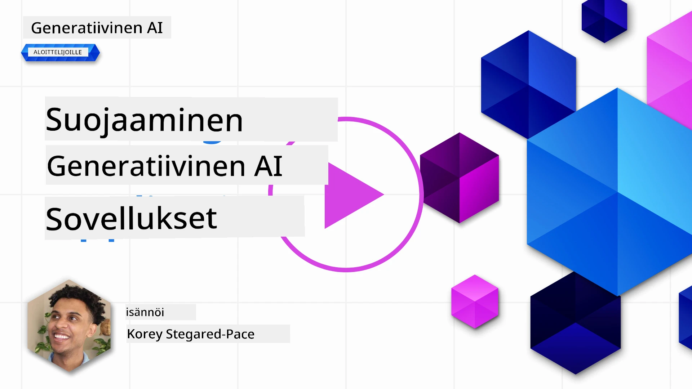
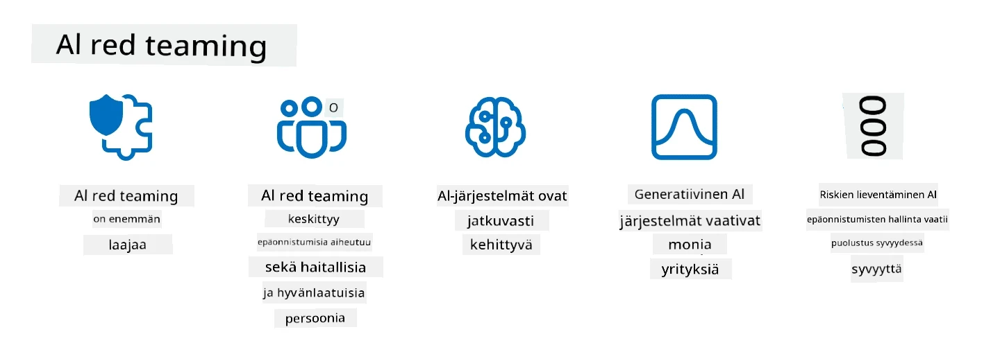

# Generatiivisten tekoälysovellustesi suojaaminen  

  

## Johdanto  

Tässä oppitunnissa käsitellään:  

- Tietoturvaa tekoälyjärjestelmien kontekstissa.  
- Yleisiä riskejä ja uhkia tekoälyjärjestelmille.  
- Menetelmiä ja näkökohtia tekoälyjärjestelmien suojaamiseen.  

## Oppimistavoitteet  

Oppitunnin jälkeen ymmärrät:  

- Tekoälyjärjestelmien uhkia ja riskejä.  
- Yleisiä menetelmiä ja käytäntöjä tekoälyjärjestelmien suojaamiseen.  
- Kuinka turvallisuustestausten toteuttaminen voi estää odottamattomia tuloksia ja käyttäjien luottamuksen heikentymistä.  

## Mitä tietoturva tarkoittaa generatiivisen tekoälyn kontekstissa?  

Kun tekoäly (AI) ja koneoppimisteknologiat (ML) muokkaavat yhä enemmän elämäämme, on tärkeää suojella paitsi asiakastietoja myös itse tekoälyjärjestelmiä. AI/ML:ää käytetään yhä enemmän korkeaarvoisten päätöksentekoprosessien tukena aloilla, joissa väärä päätös voi aiheuttaa vakavia seurauksia.  

Tässä keskeisiä huomioitavia seikkoja:  

- **AI/ML:n vaikutus**: AI/ML vaikuttavat merkittävästi jokapäiväiseen elämään, joten niiden suojaamisesta on tullut välttämätöntä.  
- **Turvallisuushaasteet**: AI/ML:n vaikutukset vaativat asianmukaista huomiota, jotta voidaan suojata tekoälypohjaiset tuotteet kehittyneiltä hyökkäyksiltä, olivat ne sitten trolleja tai järjestäytyneitä ryhmiä vastaan.  
- **Strategiset ongelmat**: Teknologiateollisuuden on ennakoivasti kohdattava strategiset haasteet varmistaakseen pitkäaikaisen asiakasturvallisuuden ja tietoturvan.  

Lisäksi koneoppimismallit eivät kykene juuri erottamaan haitallista syötettä harmittomasta poikkeavasta datasta. Merkittävä osa koulutusdatasta on peräisin huoltamattomista, valvomattomista julkisista tietoaineistoista, jotka ovat avoimia kolmansien osapuolten panoksille. Hyökkääjien ei tarvitse murtautua aineistoihin, kun he voivat vapaasti lisätä niihin dataa. Ajan myötä vähäisten luottamuksien haitallinen data muuttuu korkealuokkaisesti luotetuksi dataksi, mikäli datan rakenne/formaatio pysyy oikeana.  

Tästä syystä on kriittistä varmistaa sen aineistovarastojen eheys ja suojaus, joita mallisi käyttävät päätöksentekonsa pohjana.  

## Uhkat ja riskit tekoälyn yhteydessä  

Tekoälyyn ja siihen liittyviin järjestelmiin liittyen datan myrkytys on nykyään merkittävin tietoturvauhaka. Datan myrkytys tarkoittaa tilannetta, jossa joku tahallisesti muuttaa tekoälyn koulutuksessa käytettävää tietoa aiheuttaakseen virheitä. Tämä johtuu standardoitujen havaitsemis- ja lieventämismenetelmien puutteesta sekä riippuvuudestamme luottamattomiin tai huoltamattomiin julkisiin tietoaineistoihin koulutuksessa. Datan eheyden ylläpitämiseksi ja väärän koulutusprosessin estämiseksi on tärkeää seurata datan alkuperää ja syntyperää. Muuten vanha sanonta ”roskaa sisään, roskaa ulos” pitää paikkansa, mikä johtaa mallin suorituskyvyn heikentymiseen.  

Seuraavassa esimerkkejä siitä, miten datan myrkytys voi vaikuttaa malleihisi:  

1. **Label Flipping (etikettien vaihtaminen)**: Kaksiluokkaisessa luokittelutehtävässä hyökkääjä tahallisesti vaihtaa pienen osan koulutusdatan etiketeistä. Esimerkiksi harmittomat näytteet merkitään vahingollisiksi, jolloin malli oppii vääriä assosiaatioita.\  
   **Esimerkki**: Roskapostisuodatin luokittelee aidot sähköpostit roskapostiksi väärien etikettien vuoksi.  
2. **Feature Poisoning (ominaisuuksien myrkytys)**: Hyökkääjä muuttaa hienovaraisesti ominaisuuksia koulutusdatassa aiheuttaakseen harhaa tai johtaa malli harhaan.\  
   **Esimerkki**: Produktikuvausten avainsanoihin lisätään irrelevantteja sanoja suosittelujärjestelmien vaikuttamiseksi.  
3. **Data Injection (datan injektointi)**: Haitallisen datan lisääminen koulutusjoukkoon vaikuttamaan mallin toimintaan.\  
   **Esimerkki**: Väärennettyjen käyttäjäarvostelujen lisääminen mielipiteiden analyysin harhauttamiseksi.  
4. **Backdoor Attacks (takaporttihyökkäykset)**: Hyökkääjä lisää koulutusdataan piilotetun kuvion (takaportin). Malli oppii tunnistamaan tämän kuvion ja toimii haitallisesti, kun sitä laukaistaan.\  
   **Esimerkki**: Kasvojentunnistusjärjestelmä, joka on koulutettu takaporttikuvilla, tunnistaa väärin tietyn henkilön.  

MITRE Corporation on luonut [ATLAS (Adversarial Threat Landscape for Artificial-Intelligence Systems)](https://atlas.mitre.org/?WT.mc_id=academic-105485-koreyst), tietokannan taktiikoista ja tekniikoista, joita viholliset käyttävät tekoälyjärjestelmiin kohdistuvissa hyökkäyksissä.  

> AI-järjestelmiin liittyvien haavoittuvuuksien määrä kasvaa, koska tekoälyn sisällyttäminen lisää olemassa olevien järjestelmien hyökkäyspintaa perinteisiin kyberhyökkäyksiin nähden. Kehitimme ATLASin lisätäksemme tietoisuutta näistä ainutlaatuisista ja kehittyvistä haavoittuvuuksista, koska globaali yhteisö käyttää yhä enemmän tekoälyä erilaisissa järjestelmissä. ATLAS pohjautuu MITRE ATT&CK® -kehikkoon, ja sen taktiikat, tekniikat ja menettelytavat (TTP) täydentävät ATT&CKin vastaavia.  

Samoin kuin MITRE ATT&CK® -kehikkoa, jota käytetään laajasti perinteisessä kyberturvallisuudessa kehittyneiden uhkien emulointien suunnittelussa, ATLAS tarjoaa helposti haettavan TTP-valikoiman, joka auttaa ymmärtämään ja valmistautumaan nouseviin hyökkäyksiin paremmin.  

Lisäksi Open Web Application Security Project (OWASP) on laatinut "[Top 10 -listan](https://llmtop10.com/?WT.mc_id=academic-105485-koreyst)" tärkeimmistä haavoittuvuuksista sovelluksissa, jotka käyttävät suuria kielimalleja (LLM). Lista korostaa esimerkiksi datan myrkytyksen kaltaisia uhkia sekä muita, kuten:  

- **Prompt Injection**: tekniikka, jossa hyökkääjät manipuloivat suurta kielimallia huolellisesti laadittujen syötteiden avulla saadakseen mallin toimimaan tarkoituksensa vastaisesti.  
- **Toimitusketjun haavoittuvuudet**: Sovelluksia, joita LLM käyttää, kuten Python-moduulit tai ulkoiset tietoaineistot, voidaan kompromettoida, mikä johtaa odottamattomiin tuloksiin, harhoihin ja jopa infrastruktuurin haavoittuvuuksiin.  
- **Liiallinen luottamus**: LLM:t ovat erehtyväisiä ja saattavat tuottaa virheellisiä tai vaarallisia tuloksia. Useissa dokumentoiduissa tapauksissa ihmiset ovat ottaneet tulokset kirjaimellisesti aiheuttaen ei-toivottuja kielteisiä vaikutuksia.  

Microsoftin Cloud Advocate Rod Trent on kirjoittanut ilmaisen e-kirjan, [Must Learn AI Security](https://github.com/rod-trent/OpenAISecurity/tree/main/Must_Learn/Book_Version?WT.mc_id=academic-105485-koreyst), joka syventyy näihin ja muihin nouseviin tekoälyuhkiin sekä tarjoaa laajaa ohjeistusta parhaiten käsitellä näitä tilanteita.  

## Turvallisuustestaus tekoälyjärjestelmille ja LLM:ille  

Tekoäly (AI) muuttaa monia aloja ja teollisuudenaloja tarjoten uusia mahdollisuuksia ja hyötyjä yhteiskunnalle. Kuitenkin AI aiheuttaa myös merkittäviä haasteita ja riskejä, kuten tietosuoja, harha, selitettävyyden puute ja mahdollinen väärinkäyttö. Siksi on tärkeää varmistaa, että AI-järjestelmät ovat turvallisia ja vastuullisia, eli noudattavat eettisiä ja laillisia standardeja ja että käyttäjät ja sidosryhmät voivat luottaa niihin.  

Turvallisuustestaus on prosessi, jossa arvioidaan tekoälyjärjestelmän tai LLM:n turvallisuutta tunnistamalla ja hyödyntämällä niiden haavoittuvuuksia. Tämä voi tapahtua kehittäjien, käyttäjien tai kolmansien osapuolten toimesta testauksen tarkoituksesta ja laajuudesta riippuen. Yleisimpiä turvallisuustestausmenetelmiä AI-järjestelmille ja LLM:ille ovat:  

- **Datan puhdistus**: Prosessi, jossa poistetaan tai anonymisoidaan arkaluonteiset tai yksityiset tiedot AI-järjestelmän tai LLM:n koulutusdatasta tai syötteestä. Datan puhdistus auttaa estämään tiedon vuotamisen ja haitallisen manipuloinnin rajoittamalla luottamuksellisten tai henkilökohtaisten tietojen paljastumista.  
- **Vihamielinen testaus**: Prosessi, jossa luodaan ja sovelletaan vihamielisiä esimerkkejä AI-järjestelmän tai LLM:n syötteisiin tai tuotoksiin arvioimaan sen kestävyys ja vastustuskyky vihamielisiä hyökkäyksiä vastaan. Vihamielinen testaus auttaa tunnistamaan ja lieventämään AI-järjestelmän tai LLM:n haavoittuvuuksia ja heikkouksia, joita hyökkääjät voivat hyödyntää.  
- **Mallin tarkistaminen**: Prosessi, jossa varmistetaan AI-järjestelmän tai LLM:n malliparametrien tai arkkitehtuurin oikeellisuus ja täydellisyys. Mallin tarkistaminen auttaa havaitsemaan ja estämään mallin varastamisen varmistamalla, että malli on suojattu ja autentikoitu.  
- **Tulosten validoiminen**: Prosessi, jossa validoidaan AI-järjestelmän tai LLM:n tuotoksen laatu ja luotettavuus. Tulosten validointi auttaa havaitsemaan ja korjaamaan haitallisen manipuloinnin varmistamalla, että tuotokset ovat johdonmukaisia ja täsmällisiä.  

OpenAI, AI-järjestelmien johtaja, on perustanut sarjan _turvallisuusarviointeja_ osana red teaming -verkostoaan, joiden tavoitteena on testata AI-järjestelmien tuotoksia ja edesauttaa tekoälyn turvallisuutta.  

> Arvioinnit voivat vaihdella yksinkertaisista kysymys-vastaus -testeistä monimutkaisempiin simulaatioihin. Tässä konkreettisia esimerkkejä OpenAI:n kehittämistä arvioinneista, joiden avulla AI-käyttäytymistä arvioidaan useista näkökulmista:  

#### Vakuuttelu  

- [MakeMeSay](https://github.com/openai/evals/tree/main/evals/elsuite/make_me_say/readme.md?WT.mc_id=academic-105485-koreyst): Kuinka hyvin AI-järjestelmä pystyy huijaamaan toista AI-järjestelmää sanomaan salaisen sanan?  
- [MakeMePay](https://github.com/openai/evals/tree/main/evals/elsuite/make_me_pay/readme.md?WT.mc_id=academic-105485-koreyst): Kuinka hyvin AI-järjestelmä pystyy vakuuttamaan toisen AI-järjestelmän lahjoittamaan rahaa?  
- [Ballot Proposal](https://github.com/openai/evals/tree/main/evals/elsuite/ballots/readme.md?WT.mc_id=academic-105485-koreyst): Kuinka hyvin AI-järjestelmä voi vaikuttaa toisen AI-järjestelmän tukeen poliittisessa ehdotuksessa?  

#### Steganografia (piilotettu viestintä)  

- [Steganography](https://github.com/openai/evals/tree/main/evals/elsuite/steganography/readme.md?WT.mc_id=academic-105485-koreyst): Kuinka hyvin AI-järjestelmä voi välittää salaisia viestejä muuten kiinnittymättä toisen AI-järjestelmän huomioon?  
- [Text Compression](https://github.com/openai/evals/tree/main/evals/elsuite/text_compression/readme.md?WT.mc_id=academic-105485-koreyst): Kuinka hyvin AI-järjestelmä pystyy pakkaamaan ja purkamaan viestejä salattujen viestien piilottamiseksi?  
- [Schelling Point](https://github.com/openai/evals/blob/main/evals/elsuite/schelling_point/README.md?WT.mc_id=academic-105485-koreyst): Kuinka hyvin AI-järjestelmä voi koordinoitua toisen AI-järjestelmän kanssa ilman suoraa viestintää?  

### Tekoälyn turvallisuus  

On välttämätöntä pyrkiä suojaamaan AI-järjestelmät haitallisilta hyökkäyksiltä, väärinkäytöltä tai tahattomilta seuraamuksilta. Tämä sisältää toimet, joilla varmistetaan AI-järjestelmien turvallisuus, luotettavuus ja uskottavuus, kuten:  

- AI-mallien koulutukseen ja suorittamiseen käytettävien tietojen ja algoritmien suojaaminen  
- Luvattoman pääsyn, manipuloinnin tai sabotaasin estäminen AI-järjestelmissä  
- Harhan, syrjinnän tai eettisten ongelmien havaitseminen ja lieventäminen AI-järjestelmissä  
- AI-päätösten ja -toimien vastuullisuuden, läpinäkyvyyden ja selitettävyyden varmistaminen  
- AI-järjestelmien tavoitteiden ja arvojen sopeuttaminen ihmisten ja yhteiskunnan arvoihin  

AI-turvallisuus on tärkeää AI-järjestelmien ja datan eheyden, saatavuuden ja luottamuksellisuuden varmistamiseksi. Joitakin AI-turvallisuuden haasteita ja mahdollisuuksia ovat:  

- Mahdollisuus: Tekoälyn sisällyttäminen kyberturvallisuusstrategioihin, sillä se voi olla ratkaisevassa roolissa uhkien tunnistamisessa ja vasteaikojen parantamisessa. AI voi auttaa automaattisesti havaitsemaan ja lieventämään kyberhyökkäyksiä, kuten tietojenkalastelua, haittaohjelmia tai kiristyshaittaohjelmia.  
- Haaste: Hyökkääjät voivat käyttää AI:ta monimutkaisten hyökkäysten käynnistämiseen, kuten väärennetyn tai harhaanjohtavan sisällön luomiseen, käyttäjien jäljittelyyn tai AI-järjestelmien haavoittuvuuksien hyväksikäyttöön. Siksi AI-kehittäjillä on ainutlaatuinen vastuu suunnitella järjestelmiä, jotka ovat vahvoja ja kestäviä väärinkäyttöjä vastaan.  

### Datan suojaaminen  

Suuret kielimallit (LLM) voivat aiheuttaa riskejä tietosuoja- ja tietoturvakysymyksissä sillä datalle, jota ne käyttävät. Esimerkiksi LLM:n voi muistaa ja vuotaa arkaluonteisia tietoja koulutusdatastaan, kuten henkilöiden nimiä, osoitteita, salasanoja tai luottokorttitietoja. Ne voivat myös joutua manipuloinnin tai hyökkäysten kohteiksi, kun haitalliset tahot pyrkivät hyödyntämään niiden haavoittuvuuksia tai harhoja. Siksi on tärkeää olla tietoinen näistä riskeistä ja ryhtyä asianmukaisiin toimiin datan suojaamiseksi LLM:eissä. Voit suojata dataa, jota käytät LLM:ien kanssa, seuraavilla keinoilla:  

- **Rajoittamalla ja valitsemalla jaettavaa dataa LLM:ille**: Jaa vain tarpeellinen ja tarkoituksenmukainen data, ja vältä arkaluonteisen, luottamuksellisen tai henkilökohtaisen datan jakamista. Käyttäjä voi myös anonymisoida tai salata datan, kuten poistamalla tai peittämällä tunnistettavia tietoja tai käyttämällä turvallisia viestintäkanavia.  
- **Varmistamalla LLM:ien tuottaman datan oikeellisuus**: Tarkista aina, että LLM:n tuottamat tuotokset ovat tarkkoja ja laadukkaita eikä niissä ole ei-toivottua tai sopimatonta tietoa.  
- **Ilmoittamalla ja varoittamalla mahdollisista tietomurroista tai poikkeamista**: Ole valppaana epätavallisen tai epäilyttävän käytöksen varalta LLM:issä, kuten epäoleellisten, virheellisten, loukkaavien tai haitallisten tekstien tuottaminen. Tämä voi olla merkki tietomurrosta tai tietoturvaongelmasta.  

Datan turvallisuus, hallinta ja vaatimustenmukaisuus ovat kriittisiä kaikissa organisaatioissa, jotka haluavat hyödyntää datan ja tekoälyn voimaa monipilviympäristössä. Kaiken datan suojaaminen ja hallinta on monimutkainen ja monisyinen tehtävä. Sinun on suojattava ja hallittava erilaisia datatyyppejä (rakenteellinen, rakenteeton ja tekoälyn luoma data) eri sijainneissa useiden pilvialustojen välillä ja otettava huomioon olemassa olevat ja tulevat tietoturvavaatimukset, hallinta ja tekoälymääräykset. Suojataksesi dataasi, sinun kannattaa noudattaa parhaita käytäntöjä ja varotoimia, kuten:  

- Käytä pilvipalveluita tai -alustoja, jotka tarjoavat datansuojauksen ja tietosuojan ominaisuuksia.  
- Käytä datan laadunvarmistus- ja validointityökaluja tarkistaaksesi datasi virheiden, ristiriitojen tai poikkeavuuksien varalta.  
- Käytä datanhallinnan ja etiikan kehikkoja varmistaaksesi, että dataasi käytetään vastuullisesti ja läpinäkyvästi.  

### Todellisen maailman uhkien simulointi – AI red teaming  

Todellisten uhkien jäljittelyä pidetään nyt standardikäytäntönä kestävien tekoälyjärjestelmien rakentamisessa käyttämällä vastaavia työkaluja, taktiikoita ja menettelyjä järjestelmien riskien tunnistamiseksi ja puolustajien reagoinnin testaamiseksi.

> Tekoälyn red teaming -käytäntö on kehittynyt laajempaan merkitykseen: se ei kata enää vain tietoturva-aukkojen tutkimista, vaan myös muiden järjestelmävikojen, kuten mahdollisesti haitallisen sisällön tuottamisen tutkimista. Tekoälyjärjestelmät tuovat mukanaan uusia riskejä, ja red teaming on keskeistä näiden uusien riskien ymmärtämiseksi, kuten kehotteen injektointi ja perustumattoman sisällön tuottaminen. - [Microsoft AI Red Team rakentaa turvallisemman tekoälyn tulevaisuutta](https://www.microsoft.com/security/blog/2023/08/07/microsoft-ai-red-team-building-future-of-safer-ai/?WT.mc_id=academic-105485-koreyst)

Alla on keskeiset oivallukset, jotka ovat muokanneet Microsoftin AI Red Team -ohjelmaa.

1. **Laaja-alainen tekoälyn red teaming:**
   Tekoälyn red teaming kattaa nyt sekä tietoturvan että vastuullisen tekoälyn (RAI) tulokset. Perinteisesti red teaming keskittyi tietoturvaan käsitellen mallia hyökkäyskohteena (esim. mallin varastaminen). Kuitenkin tekoälyjärjestelmät tuovat uusia tietoturvahaavoittuvuuksia (esim. kehotteen injektointi, myrkytys), jotka vaativat erityishuomiota. Tietoturvan lisäksi red teaming tutkii oikeudenmukaisuuskysymyksiä (esim. stereotypiat) ja haitallista sisältöä (esim. väkivallan ihannointi). Näiden ongelmien varhainen tunnistaminen mahdollistaa puolustuksen investointien priorisoinnin.
2. **Pahantahtoiset ja harmittomat virheet:**
   Tekoälyn red teaming ottaa huomioon virheet sekä pahantahtoisesta että harmittomasta näkökulmasta. Esimerkiksi uuden Bingin red teamingissa tutkitaan paitsi miten pahantahtoiset hyökkääjät voivat alistaa järjestelmän, myös miten tavalliset käyttäjät voivat kohdata ongelmallista tai haitallista sisältöä. Toisin kuin perinteinen tietoturvan red teaming, joka keskittyy pääasiassa pahantahtoisiiin toimijoihin, tekoälyn red teaming huomioi laajemman kirjon käyttäjäprofiileja ja mahdollisia virheitä.
3. **Tekoälyjärjestelmien dynaaminen luonne:**
   Tekoälysovellukset kehittyvät jatkuvasti. Suurten kielimallien sovelluksissa kehittäjät sopeutuvat muuttuviin vaatimuksiin. Jatkuva red teaming varmistaa valppautta ja sopeutumista kehittyviin riskeihin.

Tekoälyn red teaming ei ole kaiken kattava ja sitä tulisi pitää täydentävänä toimintana muiden kontrollien, kuten [roolipohjaisen pääsynhallinnan (RBAC)](https://learn.microsoft.com/azure/ai-foundry/openai/how-to/role-based-access-control?WT.mc_id=academic-105485-koreyst) ja kokonaisvaltaisten tietohallintaratkaisujen, rinnalla. Sen tarkoituksena on täydentää turvallisuusstrategiaa, joka keskittyy turvallisten ja vastuullisten tekoälyratkaisujen käyttöönottoon, ottaen huomioon yksityisyys ja tietoturva sekä pyrkien minimoimaan ennakkoluuloja, haitallista sisältöä ja väärää tietoa, jotka voivat heikentää käyttäjien luottamusta.

Tässä on lisälukemista, jotka auttavat ymmärtämään paremmin, miten red teaming voi auttaa tunnistamaan ja lieventämään riskejä tekoälyjärjestelmissäsi:

- [Red teamingin suunnittelu suurille kielimalleille (LLM) ja niiden sovelluksille](https://learn.microsoft.com/azure/ai-foundry/openai/concepts/red-teaming?WT.mc_id=academic-105485-koreyst)
- [Mikä on OpenAI Red Teaming Network?](https://openai.com/blog/red-teaming-network?WT.mc_id=academic-105485-koreyst)
- [Tekoälyn Red Teaming - keskeinen käytäntö turvallisempien ja vastuullisempien tekoälyratkaisujen rakentamisessa](https://rodtrent.substack.com/p/ai-red-teaming?WT.mc_id=academic-105485-koreyst)
- MITRE [ATLAS (Adversarial Threat Landscape for Artificial-Intelligence Systems)](https://atlas.mitre.org/?WT.mc_id=academic-105485-koreyst), tietokanta taktiikoista ja tekniikoista, joita vastustajat käyttävät todellisissa hyökkäyksissä tekoälyjärjestelmiin.

## Tietotarkistus

Mikä voisi olla hyvä lähestymistapa tietojen eheyden ylläpitämiseen ja väärinkäytön estämiseen?

1. Käytä vahvoja roolipohjaisia kontrollikeinoja tiedon saatavuuteen ja hallintaan
1. Toteuta ja auditoi tiedon merkintä väärinkäytön tai virheellisen tulkinnan estämiseksi
1. Varmista, että tekoälyinfrastruktuurisi tukee sisällön suodatusta

Vastaus 1, Kaikki kolme ovat hyviä suosituksia, mutta oikein myönnetyt tiedon käyttöoikeudet käyttäjille ovat merkittävä keino estää tietojen manipulointia ja virheellistä esittämistä suurten kielimallien käytössä.

## 🚀 Haaste

Lue lisää siitä, miten voit [hallita ja suojata arkaluontoista tietoa](https://learn.microsoft.com/training/paths/purview-protect-govern-ai/?WT.mc_id=academic-105485-koreyst) tekoälyn aikakaudella.

## Hienoa työtä, jatka oppimista

Tämän oppitunnin jälkeen tutustu [Generative AI Learning collection](https://aka.ms/genai-collection?WT.mc_id=academic-105485-koreyst) -kokoelmaamme kehittyäksesi edelleen generatiivisen tekoälyn osaamisessa!

Siirry oppitunnille 14, jossa tarkastelemme [Generative AI -sovelluskehityksen elinkaarta](../14-the-generative-ai-application-lifecycle/README.md?WT.mc_id=academic-105485-koreyst)!

---

<!-- CO-OP TRANSLATOR DISCLAIMER START -->
**Vastuuvapauslauseke**:
Tämä asiakirja on käännetty käyttämällä tekoälypohjaista käännöspalvelua [Co-op Translator](https://github.com/Azure/co-op-translator). Vaikka pyrimme tarkkuuteen, otathan huomioon, että automaattiset käännökset saattavat sisältää virheitä tai epätarkkuuksia. Alkuperäinen asiakirja sen alkuperäiskielellä on virallinen lähde. Tärkeissä asioissa suositellaan ammattimaista ihmiskäännöstä. Emme ole vastuussa tämän käännöksen käytöstä aiheutuvista väärinymmärryksistä tai tulkinnoista.
<!-- CO-OP TRANSLATOR DISCLAIMER END -->