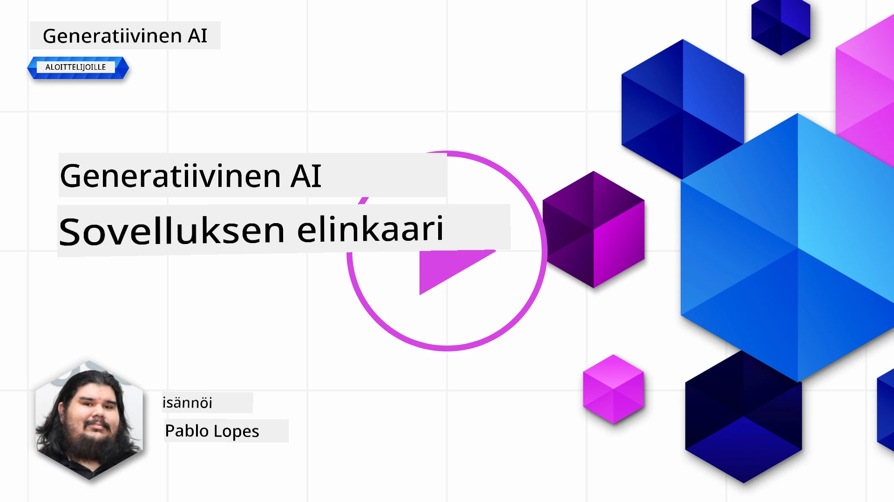
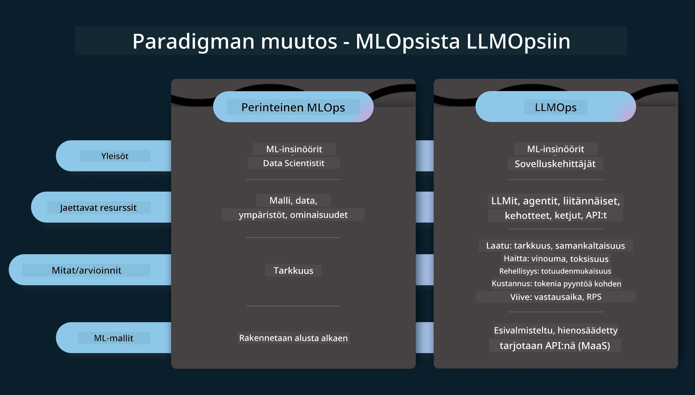
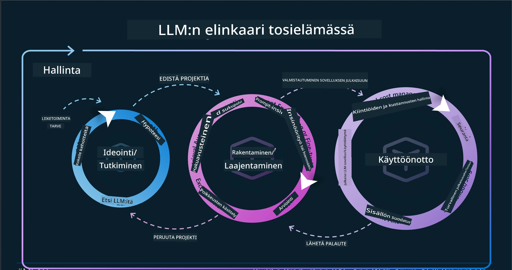
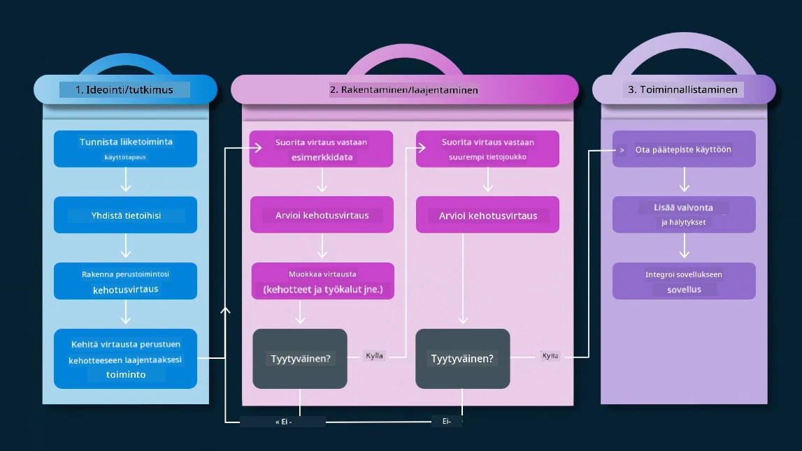
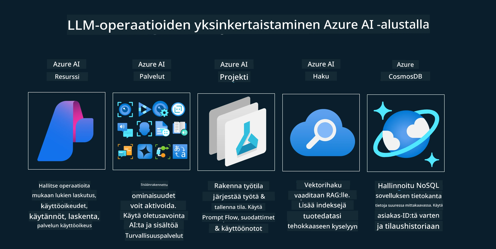
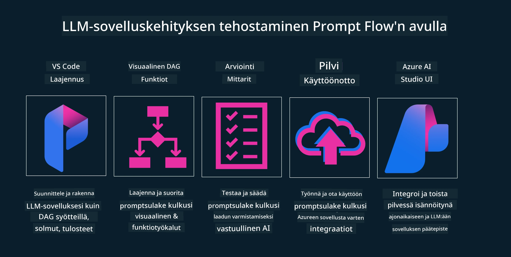

<!--
CO_OP_TRANSLATOR_METADATA:
{
  "original_hash": "df44972d5575ea8cef3c52ee31696d04",
  "translation_date": "2025-12-19T15:40:44+00:00",
  "source_file": "14-the-generative-ai-application-lifecycle/README.md",
  "language_code": "fi"
}
-->

# Generatiivisen tekoälyn sovelluskehityksen elinkaari

Tärkeä kysymys kaikille tekoälysovelluksille on tekoälyominaisuuksien merkityksellisyys, sillä tekoäly on nopeasti kehittyvä ala. Varmistaaksesi, että sovelluksesi pysyy merkityksellisenä, luotettavana ja vankkana, sinun tulee jatkuvasti seurata, arvioida ja parantaa sitä. Tässä kohtaa generatiivisen tekoälyn elinkaari astuu kuvaan.

Generatiivisen tekoälyn elinkaari on kehys, joka ohjaa sinua generatiivisen tekoälysovelluksen kehittämisen, käyttöönoton ja ylläpidon vaiheiden läpi. Se auttaa sinua määrittelemään tavoitteesi, mittaamaan suorituskykyäsi, tunnistamaan haasteesi ja toteuttamaan ratkaisusi. Se auttaa myös sovittamaan sovelluksesi eettisiin ja laillisiin standardeihin toimialallasi ja sidosryhmissäsi. Noudattamalla generatiivisen tekoälyn elinkaarta voit varmistaa, että sovelluksesi tuottaa aina arvoa ja tyydyttää käyttäjiäsi.

## Johdanto

Tässä luvussa opit:

- Ymmärtämään paradigman muutoksen MLOpsista LLMOpsiin
- LLM-elinkaaren
- Elinkaarityökalut
- Elinkaaren mittaamisen ja arvioinnin

## Ymmärrä paradigman muutos MLOpsista LLMOpsiin

LLM:t ovat uusi työkalu tekoälyn arsenaalissa, ne ovat uskomattoman tehokkaita analyysi- ja generointitehtävissä sovelluksissa, mutta tällä voimalla on seurauksia siinä, miten virtaviivaistamme tekoäly- ja perinteisiä koneoppimistehtäviä.

Tämän vuoksi tarvitsemme uuden paradigman sopeuttaaksemme tämän työkalun dynaamisesti ja oikeilla kannustimilla. Voimme luokitella vanhemmat tekoälysovellukset "ML-sovelluksiksi" ja uudemmat tekoälysovellukset "GenAI-sovelluksiksi" tai yksinkertaisesti "AI-sovelluksiksi", heijastaen aikakauden valtavirran teknologiaa ja tekniikoita. Tämä muuttaa kertomustamme monin tavoin, katso seuraavaa vertailua.

Huomaa, että LLMOpsissa keskitymme enemmän sovelluskehittäjiin, käyttäen integraatioita keskeisenä kohtana, hyödyntäen "Malleja palveluna" ja ajatellen seuraavia mittareita.

- Laatu: Vastauksen laatu
- Haitta: Vastuullinen tekoäly
- Rehellisyys: Vastauksen perusteltavuus (Onko järkevää? Onko oikein?)
- Kustannus: Ratkaisun budjetti
- Viive: Keskimääräinen aika token-vastaukseen

## LLM-elinkaari

Ensiksi, ymmärtääksemme elinkaaren ja muutokset, katsotaan seuraavaa infografiikkaa.

Kuten huomaat, tämä eroaa tavallisista MLOpsin elinkaareista. LLM:illä on monia uusia vaatimuksia, kuten kehotteiden käyttö, erilaiset tekniikat laadun parantamiseksi (Fine-Tuning, RAG, Meta-Prompts), erilainen arviointi ja vastuu vastuullisen tekoälyn kanssa, lopuksi uudet arviointimittarit (Laatu, Haitta, Rehellisyys, Kustannus ja Viive).

Esimerkiksi, katso miten ideoimme. Käytämme kehotteiden suunnittelua kokeillaksemme erilaisia LLM:iä tutkiaksemme mahdollisuuksia testata, voisiko heidän hypoteesinsa olla oikea.

Huomaa, että tämä ei ole lineaarista, vaan integroitua silmukkaa, iteratiivista ja kokonaisvaltaista sykliä.

Miten voisimme tutkia näitä vaiheita? Sukelletaan yksityiskohtiin siitä, miten voisimme rakentaa elinkaaren.

Tämä saattaa näyttää hieman monimutkaiselta, keskitytään ensin kolmeen isoon vaiheeseen.

1. Ideointi/Tutkiminen: Tutkiminen, tässä voimme tutkia liiketoimintatarpeidemme mukaan. Prototyyppaus, [PromptFlow:n](https://microsoft.github.io/promptflow/index.html?WT.mc_id=academic-105485-koreyst) luominen ja testaus, onko se tarpeeksi tehokas hypoteesillemme.
1. Rakentaminen/Lisäys: Toteutus, nyt alamme arvioida suuremmilla tietojoukoilla, toteuttaa tekniikoita kuten hienosäätö ja RAG, tarkistaaksemme ratkaisumme vankkuuden. Jos ei toimi, uudelleentoteutus, uusien vaiheiden lisääminen työnkulkuun tai datan uudelleenjärjestely voi auttaa. Testattuamme työnkulun ja mittakaavan, jos se toimii ja mittarit ovat kunnossa, se on valmis seuraavaan vaiheeseen.
1. Operatiivistaminen: Integrointi, nyt lisätään valvonta- ja hälytysjärjestelmät järjestelmäämme, käyttöönotto ja sovelluksen integrointi sovellukseemme.

Sitten meillä on hallinnan kokonaisvaltainen sykli, keskittyen turvallisuuteen, vaatimustenmukaisuuteen ja hallintoon.

Onnittelut, nyt tekoälysovelluksesi on valmis ja toiminnassa. Käytännön kokemusta varten tutustu [Contoso Chat Demo](https://nitya.github.io/contoso-chat/?WT.mc_id=academic-105485-koreys).

Nyt, mitä työkaluja voisimme käyttää?

## Elinkaarityökalut

Työkalujen osalta Microsoft tarjoaa [Azure AI Platformin](https://azure.microsoft.com/solutions/ai/?WT.mc_id=academic-105485-koreys) ja [PromptFlow:n](https://microsoft.github.io/promptflow/index.html?WT.mc_id=academic-105485-koreyst), jotka helpottavat ja tekevät elinkaaren toteuttamisesta helppoa ja valmista käyttöön.

[Azure AI Platform](https://azure.microsoft.com/solutions/ai/?WT.mc_id=academic-105485-koreys) antaa sinun käyttää [AI Studiota](https://ai.azure.com/?WT.mc_id=academic-105485-koreys). AI Studio on verkkosivusto, joka mahdollistaa mallien, esimerkkien ja työkalujen tutkimisen. Resurssien hallinnan, käyttöliittymän kehitystyönkulut sekä SDK/CLI-vaihtoehdot koodipohjaiseen kehitykseen.

Azure AI mahdollistaa useiden resurssien käytön, halliten toimintoja, palveluita, projekteja, vektorihakua ja tietokantatarpeita.

Rakenna, Proof-of-Conceptistä (POC) suuriin sovelluksiin PromptFlow:n avulla:

- Suunnittele ja rakenna sovelluksia VS Codesta, visuaalisilla ja toiminnallisilla työkaluilla
- Testaa ja hienosäädä sovelluksiasi laadukkaaksi tekoälyksi helposti.
- Käytä Azure AI Studiota integroidaksesi ja iterointiin pilvessä, työn työntöön ja käyttöönottoon nopeaa integraatiota varten.

## Hienoa! Jatka oppimista!

Mahtavaa, opi nyt lisää siitä, miten rakennamme sovelluksen käyttämään näitä käsitteitä [Contoso Chat Appin](https://nitya.github.io/contoso-chat/?WT.mc_id=academic-105485-koreyst) avulla, nähdäksesi miten Cloud Advocacy lisää nämä käsitteet demonstraatioihin. Lisää sisältöä löydät [Ignite breakout -sessiossamme!](https://www.youtube.com/watch?v=DdOylyrTOWg)

Seuraavaksi tutustu Oppituntiin 15, ymmärtääksesi miten [Retrieval Augmented Generation ja vektoritietokannat](../15-rag-and-vector-databases/README.md?WT.mc_id=academic-105485-koreyst) vaikuttavat generatiiviseen tekoälyyn ja tekevät sovelluksista entistä kiinnostavampia!

---

<!-- CO-OP TRANSLATOR DISCLAIMER START -->
**Vastuuvapauslauseke**:  
Tämä asiakirja on käännetty käyttämällä tekoälypohjaista käännöspalvelua [Co-op Translator](https://github.com/Azure/co-op-translator). Pyrimme tarkkuuteen, mutta huomioithan, että automaattikäännöksissä saattaa esiintyä virheitä tai epätarkkuuksia. Alkuperäinen asiakirja sen alkuperäiskielellä on virallinen lähde. Tärkeissä asioissa suositellaan ammattimaista ihmiskäännöstä. Emme ole vastuussa tämän käännöksen käytöstä aiheutuvista väärinymmärryksistä tai tulkinnoista.
<!-- CO-OP TRANSLATOR DISCLAIMER END -->