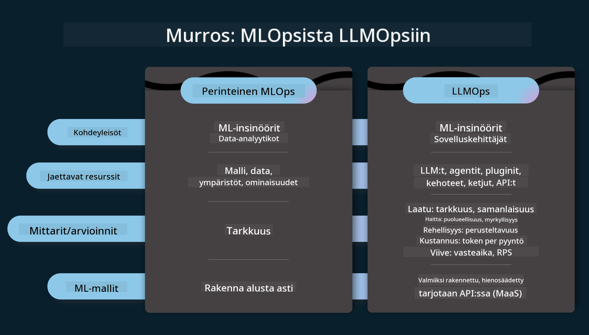
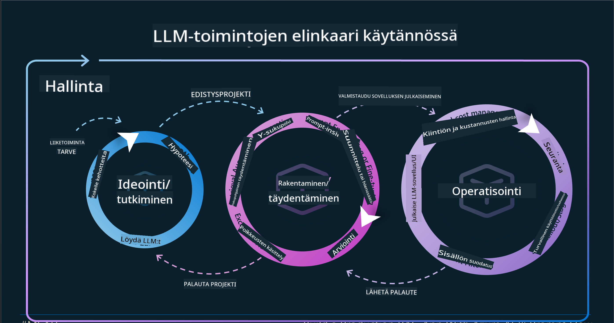
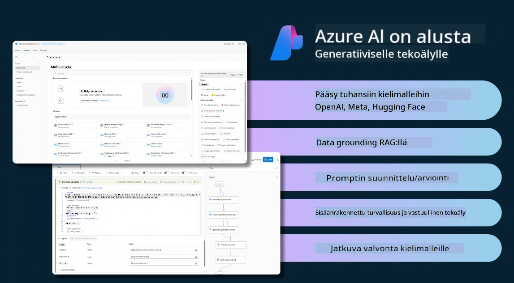
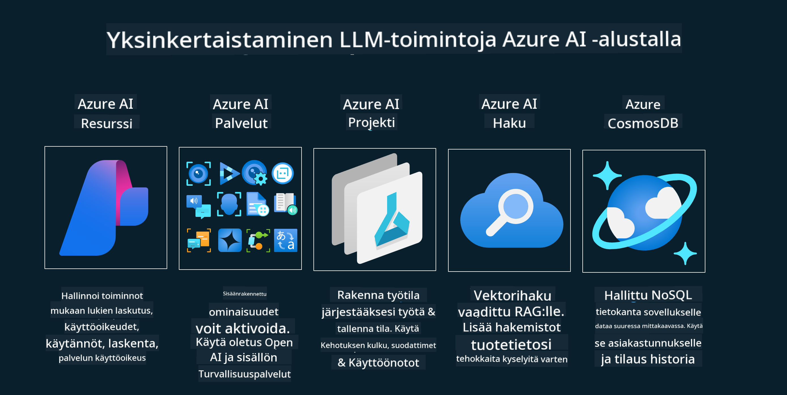
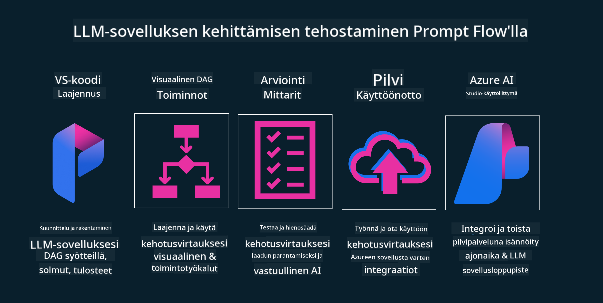

<!--
CO_OP_TRANSLATOR_METADATA:
{
  "original_hash": "27a5347a5022d5ef0a72ab029b03526a",
  "translation_date": "2025-05-19T23:30:01+00:00",
  "source_file": "14-the-generative-ai-application-lifecycle/README.md",
  "language_code": "fi"
}
-->

# Generatiivisen tekoälyn sovelluksen elinkaari

Kaikille tekoälysovelluksille tärkeä kysymys on tekoälyominaisuuksien merkityksellisyys, sillä tekoäly on nopeasti kehittyvä ala. Jotta sovelluksesi pysyy merkityksellisenä, luotettavana ja kestävänä, sinun on valvottava, arvioitava ja parannettava sitä jatkuvasti. Tässä kohtaa generatiivisen tekoälyn elinkaari tulee mukaan kuvaan.

Generatiivisen tekoälyn elinkaari on viitekehys, joka ohjaa sinua generatiivisen tekoälysovelluksen kehittämisen, käyttöönoton ja ylläpidon vaiheissa. Se auttaa sinua määrittelemään tavoitteesi, mittaamaan suorituskykysi, tunnistamaan haasteesi ja toteuttamaan ratkaisusi. Se auttaa myös sovittamaan sovelluksesi alasi ja sidosryhmiesi eettisiin ja oikeudellisiin normeihin. Noudattamalla generatiivisen tekoälyn elinkaarta voit varmistaa, että sovelluksesi tuottaa aina arvoa ja tyydyttää käyttäjäsi.

## Johdanto

Tässä luvussa opit:

- Ymmärtämään siirtymän MLOpsista LLMOpsiin
- LLM:n elinkaari
- Elinkaarityökalut
- Elinkaaren mittaus ja arviointi

## Ymmärrä siirtymä MLOpsista LLMOpsiin

LLM:t ovat uusi työkalu tekoälyn työkalupakissa. Ne ovat uskomattoman tehokkaita analysointi- ja generointitehtävissä sovelluksille, mutta tämä voima tuo mukanaan seurauksia siitä, miten sujuvoitamme tekoälyn ja perinteisten koneoppimistehtävien kulkua.

Tämän myötä tarvitsemme uuden paradigman mukauttamaan tätä työkalua dynaamisesti, oikeilla kannustimilla. Voimme luokitella vanhemmat tekoälysovellukset "ML-sovelluksiksi" ja uudemmat tekoälysovellukset "GenAI-sovelluksiksi" tai vain "tekoälysovelluksiksi", mikä heijastaa sen ajan valtavirran tekniikoita ja menetelmiä. Tämä muuttaa kerrontaamme monin tavoin, katso seuraava vertailu.

Huomaa, että LLMOpsissa keskitymme enemmän sovelluskehittäjiin, käyttäen integraatioita avainkohtana, käyttäen "Models-as-a-Service" -mallia ja miettien seuraavia kohtia mittareina.

- Laatu: Vastausten laatu
- Vahinko: Vastuullinen tekoäly
- Rehellisyys: Vastausten perusteltavuus (Onko järkevää? Onko se oikein?)
- Kustannukset: Ratkaisun budjetti
- Viive: Keskimääräinen aika token-vastaukseen

## LLM:n elinkaari

Ensinnäkin, ymmärtääksemme elinkaaren ja muutokset, huomioimme seuraavan infografiikan.

Kuten huomaat, tämä eroaa tavallisista MLOpsin elinkaarista. LLM:illä on monia uusia vaatimuksia, kuten Prompting, erilaisia tekniikoita laadun parantamiseksi (Fine-Tuning, RAG, Meta-Prompts), erilaisia arviointeja ja vastuullisuutta vastuullisen tekoälyn kanssa, ja lopuksi uusia arviointimittareita (laatu, vahinko, rehellisyys, kustannukset ja viive).

Esimerkiksi katsotaan, miten ideointi tapahtuu. Käyttämällä prompt-tekniikoita kokeillaan erilaisia LLM:itä tutkiakseen mahdollisuuksia testata, voisivatko niiden hypoteesit olla oikeita.

Huomaa, että tämä ei ole lineaarinen, vaan integroituja silmukoita, iteratiivisia ja kokonaisvaltaisella syklillä.

Miten voisimme tutkia näitä vaiheita? Katsotaan yksityiskohtaisesti, miten voisimme rakentaa elinkaaren.

Tämä voi näyttää hieman monimutkaiselta, keskitytään ensin kolmeen suureen vaiheeseen.

1. Ideointi/Tutkiminen: Tutkiminen, tässä voimme tutkia liiketoimintamme tarpeiden mukaan. Prototyyppien luominen, [PromptFlow](https://microsoft.github.io/promptflow/index.html?WT.mc_id=academic-105485-koreyst) -työkalun luominen ja testaus, onko se riittävän tehokas hypoteesillemme.
2. Rakentaminen/Laajentaminen: Toteutus, nyt aloitamme arvioimaan suurempia tietoaineistoja ja toteuttamaan tekniikoita, kuten hienosäätöä ja RAG:ia, tarkistaaksemme ratkaisumme kestävyyden. Jos se ei ole riittävä, sen uudelleentoteuttaminen, uusien vaiheiden lisääminen työprosessiin tai datan uudelleenjärjestely voi auttaa. Kun olemme testanneet työprosessimme ja mittakaavamme, jos se toimii ja tarkistaa mittarimme, se on valmis seuraavaan vaiheeseen.
3. Operointiin siirtyminen: Integraatio, nyt lisätään valvonta- ja hälytysjärjestelmät järjestelmäämme, käyttöönotto ja sovelluksen integrointi sovellukseemme.

Sitten meillä on kokonaisvaltainen hallintokierto, joka keskittyy turvallisuuteen, vaatimustenmukaisuuteen ja hallintoon.

Onneksi olkoon, nyt sinulla on tekoälysovelluksesi valmiina ja toiminnassa. Käytännön kokemusta varten tutustu [Contoso Chat -demoa.](https://nitya.github.io/contoso-chat/?WT.mc_id=academic-105485-koreys)

Mitä työkaluja voisimme käyttää?

## Elinkaarityökalut

Työkalujen osalta Microsoft tarjoaa [Azure AI -alustan](https://azure.microsoft.com/solutions/ai/?WT.mc_id=academic-105485-koreys) ja [PromptFlow](https://microsoft.github.io/promptflow/index.html?WT.mc_id=academic-105485-koreyst) -työkalun, jotka helpottavat elinkaaren toteutusta ja valmiutta.

[Azure AI -alusta](https://azure.microsoft.com/solutions/ai/?WT.mc_id=academic-105485-koreys) mahdollistaa [AI Studion](https://ai.azure.com/?WT.mc_id=academic-105485-koreys) käytön. AI Studio on verkkopohjainen portaali, jonka avulla voit tutkia malleja, esimerkkejä ja työkaluja. Hallitse resurssejasi, käyttöliittymän kehitystyön kulkuja ja SDK/CLI-vaihtoehtoja koodipohjaiselle kehitykselle.

Azure AI mahdollistaa useiden resurssien käytön operaatioiden, palveluiden, projektien, vektorihakujen ja tietokantojen tarpeiden hallintaan.

Rakentaminen, Proof-of-Conceptista (POC) aina laajamittaisiin sovelluksiin PromptFlow'n avulla:

- Suunnittele ja rakenna sovelluksia VS Codessa, visuaalisilla ja toiminnallisilla työkaluilla
- Testaa ja hienosäädä sovelluksesi laadukkaalle tekoälylle helposti.
- Käytä Azure AI Studiota pilvi-integraatioon ja iterointiin, työnnä ja ota käyttöön nopeaa integrointia varten.

## Hienoa! Jatka oppimista!

Mahtavaa, opi nyt lisää siitä, miten rakennamme sovelluksen käyttämään käsitteitä [Contoso Chat -sovelluksen](https://nitya.github.io/contoso-chat/?WT.mc_id=academic-105485-koreyst) avulla, tarkistaaksesi, miten pilvievankeliumi lisää näitä käsitteitä demonstraatioihin. Lisää sisältöä varten tutustu [Ignite breakout -sessioomme!](https://www.youtube.com/watch?v=DdOylyrTOWg)

Tutustu nyt lukuun 15, ymmärtääksesi miten [Retrieval Augmented Generation ja Vektoridatabases](../15-rag-and-vector-databases/README.md?WT.mc_id=academic-105485-koreyst) vaikuttavat generatiiviseen tekoälyyn ja tekevät sovelluksista mukaansatempaavampia!

**Vastuuvapauslauseke**:  
Tämä asiakirja on käännetty käyttämällä tekoälypohjaista käännöspalvelua [Co-op Translator](https://github.com/Azure/co-op-translator). Vaikka pyrimme tarkkuuteen, on syytä huomata, että automaattiset käännökset saattavat sisältää virheitä tai epätarkkuuksia. Alkuperäistä asiakirjaa sen alkuperäisellä kielellä tulee pitää ensisijaisena lähteenä. Kriittisten tietojen osalta suositellaan ammattimaista ihmiskääntäjää. Emme ole vastuussa mahdollisista väärinkäsityksistä tai virhetulkinnoista, jotka johtuvat tämän käännöksen käytöstä.