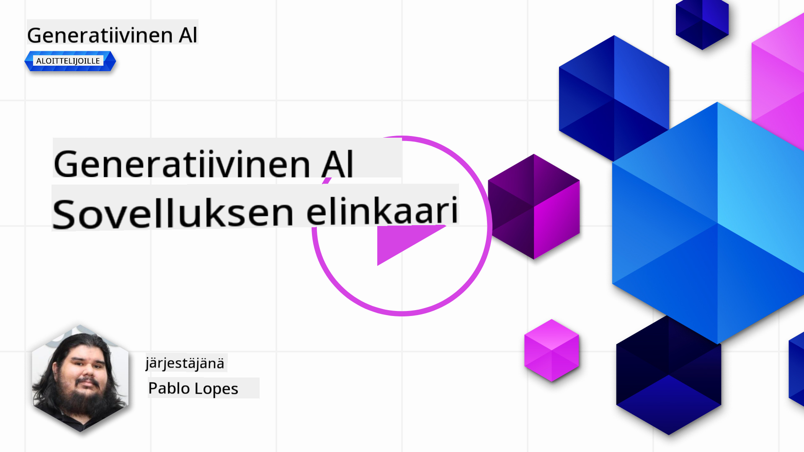
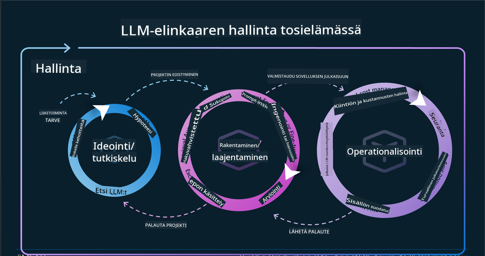
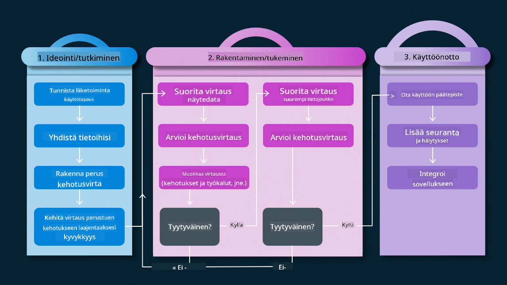
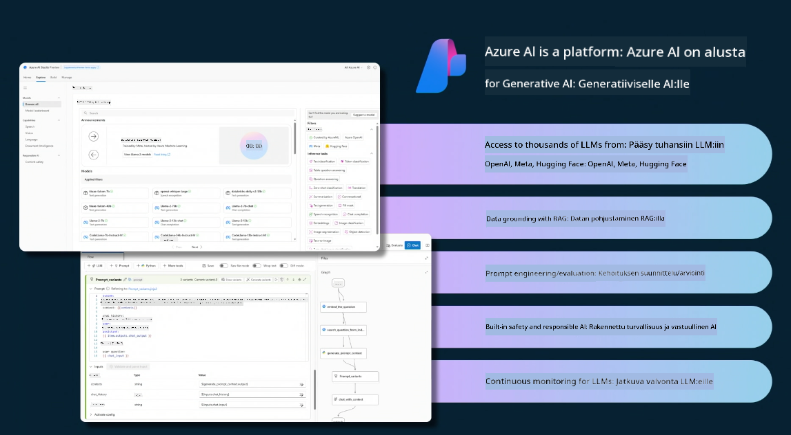
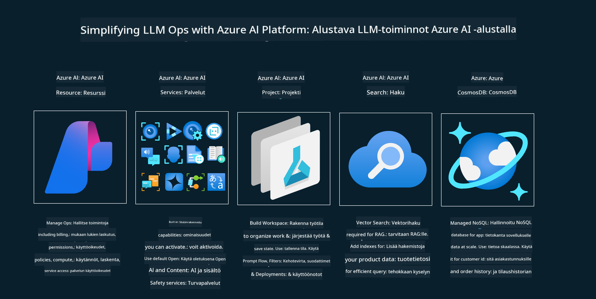
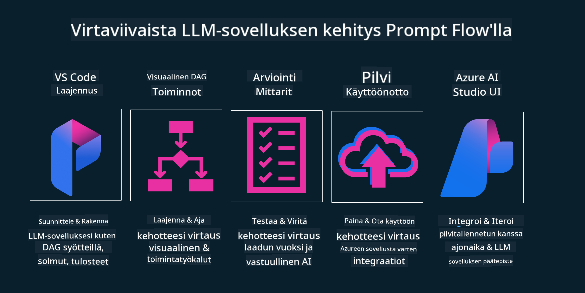

<!--
CO_OP_TRANSLATOR_METADATA:
{
  "original_hash": "27a5347a5022d5ef0a72ab029b03526a",
  "translation_date": "2025-07-09T15:55:16+00:00",
  "source_file": "14-the-generative-ai-application-lifecycle/README.md",
  "language_code": "fi"
}
-->

# Generatiivisen tekoälyn sovelluskehityksen elinkaari

Tärkeä kysymys kaikille tekoälysovelluksille on tekoälyominaisuuksien ajankohtaisuus, sillä tekoäly kehittyy nopeasti. Jotta sovelluksesi pysyy relevanttina, luotettavana ja vankkana, sitä täytyy jatkuvasti seurata, arvioida ja parantaa. Tässä astuu kuvaan generatiivisen tekoälyn elinkaari.

Generatiivisen tekoälyn elinkaari on kehys, joka ohjaa sinua generatiivisen tekoälysovelluksen kehittämisen, käyttöönoton ja ylläpidon vaiheissa. Se auttaa sinua määrittelemään tavoitteesi, mittaamaan suorituskykyäsi, tunnistamaan haasteesi ja toteuttamaan ratkaisut. Lisäksi se auttaa sovelluksesi sovittamisessa eettisiin ja lainsäädännöllisiin vaatimuksiin alallasi ja sidosryhmiesi kanssa. Noudattamalla generatiivisen tekoälyn elinkaarta voit varmistaa, että sovelluksesi tuottaa aina arvoa ja tyydyttää käyttäjiäsi.

## Johdanto

Tässä luvussa opit:

- Ymmärtämään paradigman muutoksen MLOpsista LLMOpsiin
- LLM-elinkaaren
- Elinkaaren työkalut
- Elinkaaren mittaamisen ja arvioinnin

## Ymmärrä paradigman muutos MLOpsista LLMOpsiin

LLM:t ovat uusi työkalu tekoälyn arsenaalissa, ne ovat uskomattoman tehokkaita analyysi- ja generointitehtävissä sovelluksissa, mutta tämä teho tuo mukanaan myös seurauksia tekoälyn ja perinteisen koneoppimisen tehtävien virtaviivaistamiseen.

Tämän vuoksi tarvitsemme uuden paradigman, jolla voimme sovittaa tämän työkalun dynaamisesti oikeilla kannustimilla. Voimme luokitella vanhemmat tekoälysovellukset "ML-sovelluksiksi" ja uudemmat "GenAI-sovelluksiksi" tai yksinkertaisesti "AI-sovelluksiksi", heijastaen aikakauden yleisiä teknologioita ja menetelmiä. Tämä muuttaa kertomustamme monin tavoin, katso seuraavaa vertailua.

Huomaa, että LLMOpsissa keskitymme enemmän sovelluskehittäjiin, käyttäen integraatioita keskeisenä kohtana, hyödyntäen "Models-as-a-Service" -mallia ja ajatellen seuraavia mittareita.

- Laatu: Vastauksen laatu
- Haitta: Vastuullinen tekoäly
- Rehellisyys: Vastauksen perusteltavuus (Onko järkevää? Onko oikein?)
- Kustannus: Ratkaisun budjetti
- Viive: Keskimääräinen aika token-vastaukseen

## LLM-elinkaari

Ensiksi, ymmärtääksemme elinkaaren ja sen muutokset, katsotaan seuraavaa infografiikkaa.

Kuten huomaat, tämä eroaa tavallisista MLOpsin elinkaareista. LLM:illä on monia uusia vaatimuksia, kuten prompttien käyttö, erilaiset laadun parantamistekniikat (Fine-Tuning, RAG, Meta-Prompts), erilainen arviointi ja vastuullisuus vastuullisen tekoälyn näkökulmasta, sekä uudet arviointimittarit (Laatu, Haitta, Rehellisyys, Kustannus ja Viive).

Esimerkiksi, katso miten ideoimme. Käytämme prompttien suunnittelua kokeillaksemme erilaisia LLM:iä ja tutkiaksemme mahdollisuuksia testata hypoteesimme paikkansapitävyyttä.

Huomaa, että tämä ei ole lineaarinen prosessi, vaan integroidut silmukat, iteratiivinen ja kokonaisvaltainen sykli.

Miten voisimme tutkia näitä vaiheita? Sukelletaan yksityiskohtiin siitä, miten voisimme rakentaa elinkaaren.

Tämä saattaa näyttää hieman monimutkaiselta, keskitytään ensin kolmeen isoon vaiheeseen.

1. Ideointi/Tutkiminen: Tutkimusvaihe, tässä voimme tutkia liiketoimintatarpeidemme mukaan. Prototyyppien tekeminen, [PromptFlow](https://microsoft.github.io/promptflow/index.html?WT.mc_id=academic-105485-koreyst) luominen ja testaus, onko se riittävän tehokas hypoteesillemme.
1. Rakentaminen/Lisäys: Toteutusvaihe, nyt alamme arvioida suuremmilla aineistoilla, toteuttaa tekniikoita kuten Fine-tuning ja RAG, tarkistaaksemme ratkaisumme vankkuuden. Jos ei toimi, uudelleentoteutus, uusien vaiheiden lisääminen työnkulkuun tai datan uudelleenjärjestely voi auttaa. Kun työnkulku ja skaala toimivat ja mittarit ovat kunnossa, se on valmis seuraavaan vaiheeseen.
1. Käyttöönotto: Integrointi, nyt lisätään valvonta- ja hälytysjärjestelmät, käyttöönotto ja sovelluksen integrointi sovellukseen.

Tämän jälkeen on hallinnan kokonaisvaltainen sykli, joka keskittyy turvallisuuteen, vaatimustenmukaisuuteen ja hallintoon.

Onnittelut, nyt sinulla on tekoälysovellus valmiina käyttöön ja toiminnassa. Käytännön kokemusta varten tutustu [Contoso Chat Demo](https://nitya.github.io/contoso-chat/?WT.mc_id=academic-105485-koreys).

Mitä työkaluja voisimme käyttää?

## Elinkaaren työkalut

Työkalujen osalta Microsoft tarjoaa [Azure AI Platformin](https://azure.microsoft.com/solutions/ai/?WT.mc_id=academic-105485-koreys) ja [PromptFlow’n](https://microsoft.github.io/promptflow/index.html?WT.mc_id=academic-105485-koreyst), jotka helpottavat ja tekevät elinkaaren toteuttamisesta vaivatonta ja valmista käyttöön.

[Azure AI Platform](https://azure.microsoft.com/solutions/ai/?WT.mc_id=academic-105485-koreys) antaa sinun käyttää [AI Studiota](https://ai.azure.com/?WT.mc_id=academic-105485-koreys). AI Studio on verkkopalvelu, joka mahdollistaa mallien, esimerkkien ja työkalujen tutkimisen. Resurssien hallinnan, käyttöliittymän kehitystyönkulut sekä SDK/CLI-vaihtoehdot koodikeskeiseen kehitykseen.

Azure AI mahdollistaa useiden resurssien käytön operaatioiden, palveluiden, projektien, vektorihakujen ja tietokantojen hallintaan.

Rakenna Proof-of-Conceptistä (POC) aina laajamittaisiin sovelluksiin PromptFlow’n avulla:

- Suunnittele ja rakenna sovelluksia VS Codesta visuaalisilla ja toiminnallisilla työkaluilla
- Testaa ja hienosäädä sovelluksiasi laadukkaan tekoälyn saavuttamiseksi helposti
- Käytä Azure AI Studiota pilvi-integraatioon, iterointiin, push-toimintoihin ja nopeaan käyttöönottoon

## Hienoa! Jatka oppimista!

Mahtavaa, nyt opi lisää siitä, miten rakennamme sovelluksen käyttämään näitä konsepteja [Contoso Chat Appin](https://nitya.github.io/contoso-chat/?WT.mc_id=academic-105485-koreyst) avulla, ja katso, miten Cloud Advocacy tuo nämä konseptit esiin demoissa. Lisää sisältöä löydät [Ignite breakout -sessiossamme!](https://www.youtube.com/watch?v=DdOylyrTOWg)

Seuraavaksi tutustu Oppituntiin 15, jossa ymmärrät, miten [Retrieval Augmented Generation ja vektoritietokannat](../15-rag-and-vector-databases/README.md?WT.mc_id=academic-105485-koreyst) vaikuttavat generatiiviseen tekoälyyn ja tekevät sovelluksista entistä kiinnostavampia!

**Vastuuvapauslauseke**:  
Tämä asiakirja on käännetty käyttämällä tekoälypohjaista käännöspalvelua [Co-op Translator](https://github.com/Azure/co-op-translator). Vaikka pyrimme tarkkuuteen, huomioithan, että automaattikäännöksissä saattaa esiintyä virheitä tai epätarkkuuksia. Alkuperäistä asiakirjaa sen alkuperäiskielellä tulee pitää virallisena lähteenä. Tärkeissä tiedoissa suositellaan ammattimaista ihmiskäännöstä. Emme ole vastuussa tämän käännöksen käytöstä aiheutuvista väärinymmärryksistä tai tulkinnoista.