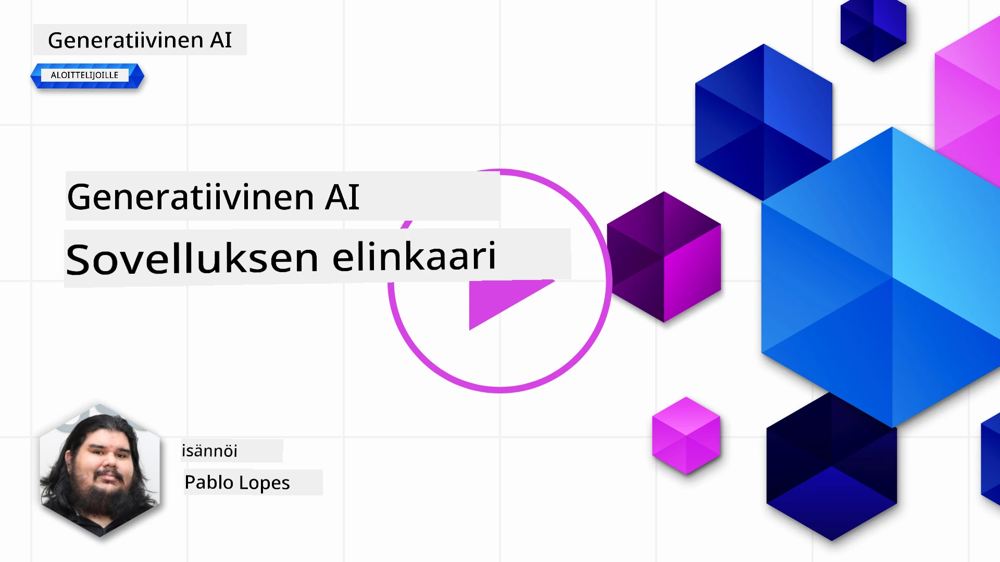
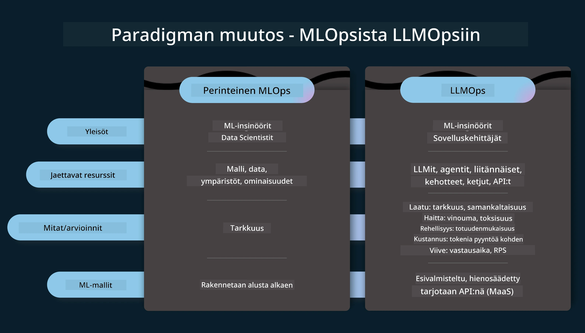
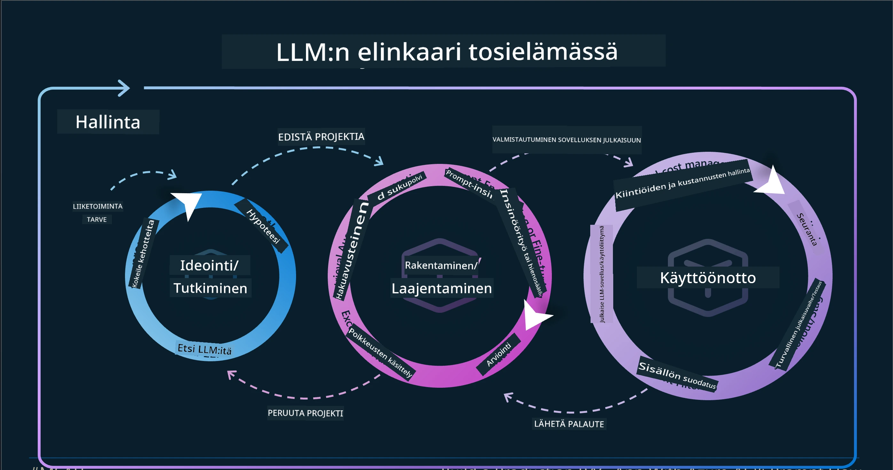
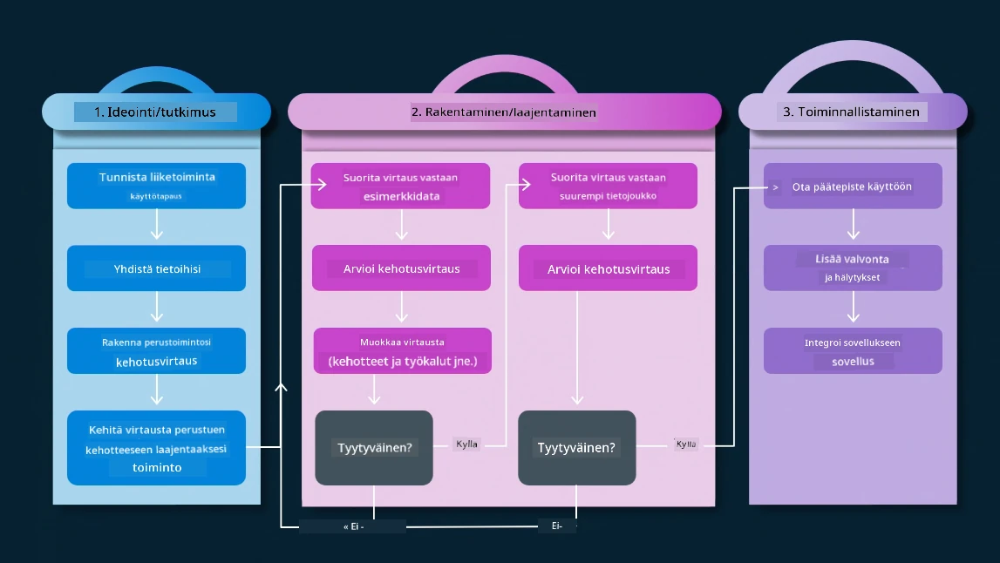
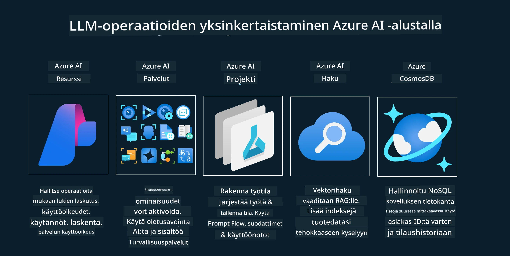
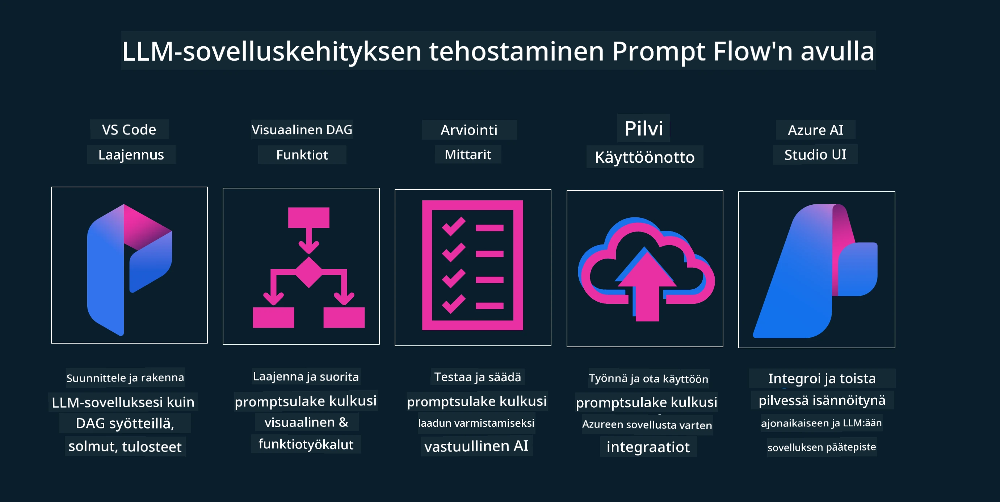

# Generatiivisen tekoälyn sovellus elinkaaren hallinta

Tärkeä kysymys kaikille tekoälysovelluksille on tekoälyominaisuuksien merkityksellisyys, sillä tekoäly on nopeasti kehittyvä ala. Jotta sovelluksesi pysyy merkityksellisenä, luotettavana ja vankkana, sinun on seurattava, arvioitava ja parannettava sitä jatkuvasti. Tässä kohtaa astuu kuvaan generatiivisen tekoälyn elinkaari.

Generatiivisen tekoälyn elinkaari on kehys, joka ohjaa sinua generatiivisen tekoälysovelluksen kehittämisen, käyttöönoton ja ylläpidon vaiheiden läpi. Se auttaa sinua määrittelemään tavoitteesi, mittaamaan suorituskykysi, tunnistamaan haasteesi ja toteuttamaan ratkaisusi. Lisäksi se auttaa sinua sovittamaan sovelluksesi eettisiin ja laillisiin standardeihin omalla alallasi ja sidosryhmäsi kanssa. Noudattamalla generatiivisen tekoälyn elinkaarta voit varmistaa, että sovelluksesi tarjoaa aina arvoa ja tyydyttää käyttäjäsi.

## Johdanto

Tässä luvussa opit:

- Ymmärtämään paradigman muutoksen MLOpsista LLMOpsiin
- LLM-elinkaaren
- Työkalut elinkaareen
- Elinkaaren mittarointi ja arviointi

## Ymmärrä paradigman muutos MLOpsista LLMOpsiin

LLMit ovat uusi työkalu tekoälyarsenaalissa, ne ovat uskomattoman tehokkaita analyysi- ja generointitehtävissä sovelluksille, mutta tällä voimalla on vaikutuksia siihen, miten virtaviivaistamme tekoälyä ja perinteistä koneoppimista.

Tämän myötä tarvitaan uusi paradigma tämän työkalun dynaamiseen sovittamiseen oikeilla kannustimilla. Voimme luokitella vanhemmat tekoälysovellukset "ML-sovelluksiksi" ja uudemmat tekoälysovellukset "GenAI-sovelluksiksi" tai vain "AI-sovelluksiksi", mikä heijastaa tuon ajan valtavirran teknologiaa ja tekniikoita. Tämä muuttaa tarinaamme monella tavalla, katso seuraavaa vertailua.

Huomaa, että LLMOpsissa keskitymme enemmän sovelluskehittäjiin, käyttäen integraatioita keskeisenä kohtana, käyttäen "Models-as-a-Service" -mallia ja ajatellen mittareita seuraavasti.

- Laatu: Vastausten laatu
- Vahinko: Vastuullinen tekoäly
- Rehellisyys: Vastausten perusteltavuus (Onko se järkevää? Onko se oikeassa?)
- Kustannukset: Ratkaisun budjetti
- Latenssi: Keskimääräinen aika token-vastaukseen

## LLM-elinkaari

Ensiksi, ymmärtääksesi elinkaaren ja muutokset, huomioi seuraava infografiikka.

Kuten voi huomata, tämä eroaa tavallisista MLOps-elinkaaresta. LLM:illä on monia uusia vaatimuksia, kuten Prompting, erilaiset tekniikat laadun parantamiseksi (Fine-Tuning, RAG, Meta-Prompts), erilainen arviointi ja vastuu vastuullisen tekoälyn kanssa sekä uudet arviointimittarit (Laatu, Vahinko, Rehellisyys, Kustannukset ja Latenssi).

Esimerkiksi katso, miten ideoimme. Käytämme prompt-tekniikkaa kokeillaksemme erilaisia LLM:itä tutkiaksemme mahdollisuuksia testata, voisiko heidän hypoteesinsa olla oikea.

Huomaa, että tämä ei ole lineaarista, vaan integroidut silmukat, iteratiivinen ja kattava sykli.

Miten voisimme tutkia näitä vaiheita? Tarkastellaan yksityiskohtaisemmin, miten voisimme rakentaa elinkaaren.

Tämä saattaa näyttää hieman monimutkaiselta, keskitytään ensin kolmeen suureen vaiheeseen.

1. Ideointi/Tutkiminen: Tutkiminen, tässä voimme tutkia liiketoimintatarpeidemme mukaan. Prototyypin luominen, [PromptFlow:n](https://microsoft.github.io/promptflow/index.html?WT.mc_id=academic-105485-koreyst) luominen ja testaus onko se tarpeeksi tehokas hypoteesillemme.
1. Rakentaminen/Lisäys: Toteutus, nyt alamme arvioida suuremmilla aineistoilla toteuttaen tekniikoita, kuten hienosäätöä ja RAG:ia, tarkistaaksemme ratkaisumme vankkuuden. Jos ei ole, uudelleen toteuttaminen, uusien vaiheiden lisääminen työnkulkuun tai datan uudelleenjärjestäminen voi auttaa. Testattuamme työnkulkuamme ja mittakaavaamme, jos se toimii ja mittarit ovat hyväksyttävät, se on valmis seuraavaan vaiheeseen.
1. Operatiivistaminen: Integrointi, nyt lisätään valvonta- ja hälytysjärjestelmät järjestelmäämme, käyttöönotto ja sovelluksen integrointi sovellukseemme.

Sitten meillä on hallinnan kattava sykli, joka keskittyy turvallisuuteen, vaatimustenmukaisuuteen ja hallintoon.

Onnittelut, nyt tekoälysovelluksesi on valmis käyttöön ja toimimaan. Käytännön kokemusta varten tutustu [Contoso Chat Demo](https://nitya.github.io/contoso-chat/?WT.mc_id=academic-105485-koreyst).

Mitä työkaluja voimme käyttää?

## Elinkaaren työkalut

Työkaluissa Microsoft tarjoaa [Azure AI Platformin](https://azure.microsoft.com/solutions/ai/?WT.mc_id=academic-105485-koreyst) ja [PromptFlow’n](https://microsoft.github.io/promptflow/index.html?WT.mc_id=academic-105485-koreyst), jotka helpottavat ja tekevät syklin toteuttamisesta helppoa ja valmista käyttöön.

[Azure AI Platform](https://azure.microsoft.com/solutions/ai/?WT.mc_id=academic-105485-koreyst) tarjoaa mahdollisuuden käyttää [AI Studioa](https://ai.azure.com/?WT.mc_id=academic-105485-koreyst). AI Studio on verkkopohjainen portaali, joka sallii mallien, mallinäytteiden ja työkalujen tutkimisen. Hallitsee resurssiasi, käyttöliittymän kehitystyönkulkuja sekä SDK/CLI-vaihtoehtoja koodikeskeiseen kehitykseen.

Azure AI mahdollistaa monien resurssien käytön operaatioiden, palveluiden, projektien, vektorihaut ja tietokantatarpeiden hallinnassa.

Rakenna Proof-of-Conceptistä (POC) suuriin sovelluksiin PromptFlown avulla:

- Suunnittele ja rakenna sovelluksia VS Codesta visuaalisilla ja toiminnallisilla työkaluilla
- Testaa ja hienosäädä sovelluksesi laadukasta tekoälyä varten helposti
- Käytä Azure AI Studioa pilven kanssa integrointiin ja iterointiin, työntöön ja käyttöönottoon nopeaan integraatioon

## Mahtavaa! Jatka oppimista!

Upeaa, opi nyt lisää siitä, miten rakennamme sovelluksen käyttämään käsitteitä [Contoso Chat App](https://nitya.github.io/contoso-chat/?WT.mc_id=academic-105485-koreyst) -sovelluksessa, tutki miten Cloud Advocacy tuo näitä käsitteitä esityksiin. Lisää sisältöä löydät [Ignite breakout sessionista!](https://www.youtube.com/watch?v=DdOylyrTOWg)

Seuraavaksi katso Luku 15, ymmärtääksesi miten [Retrieval Augmented Generation ja vektoritietokannat](../15-rag-and-vector-databases/README.md?WT.mc_id=academic-105485-koreyst) vaikuttavat generatiiviseen tekoälyyn ja tekevät sovelluksistasi kiinnostavampia!

---

<!-- CO-OP TRANSLATOR DISCLAIMER START -->
**Vastuuvapauslauseke**:
Tämä asiakirja on käännetty käyttämällä tekoälypohjaista käännöspalvelua [Co-op Translator](https://github.com/Azure/co-op-translator). Vaikka pyrimme tarkkuuteen, otathan huomioon, että automaattiset käännökset saattavat sisältää virheitä tai epätarkkuuksia. Alkuperäistä asiakirjaa sen alkuperäisellä kielellä pidetään lopullisena ja virallisena lähteenä. Tärkeissä asioissa suositellaan ammattimaista ihmiskäännöstä. Emme ole vastuussa mahdollisista väärinymmärryksistä tai virhetulkintojen seurauksista, jotka johtuvat tämän käännöksen käytöstä.
<!-- CO-OP TRANSLATOR DISCLAIMER END -->