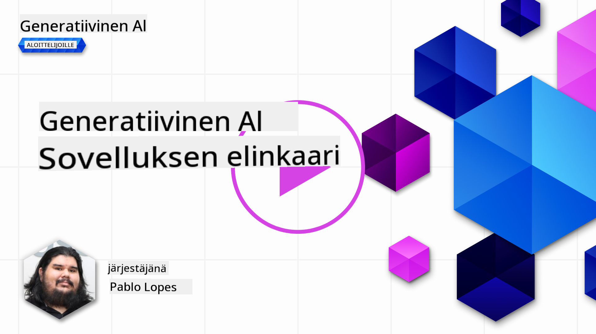
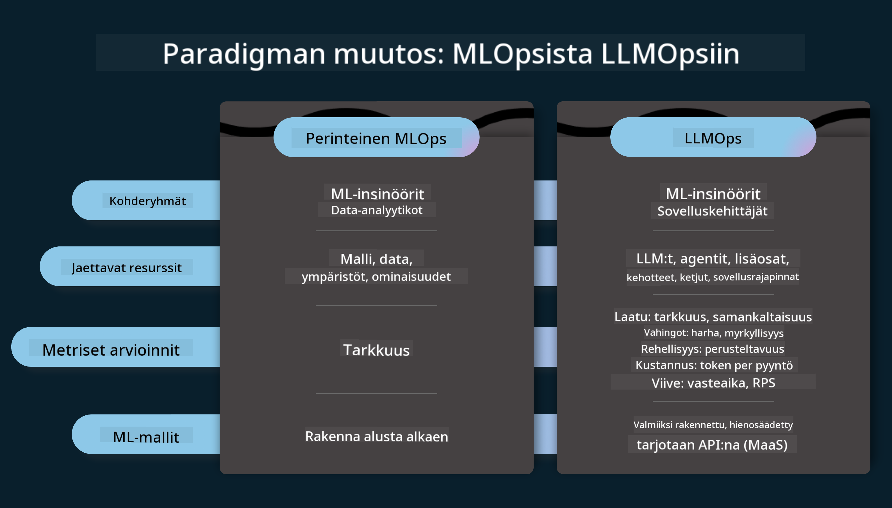
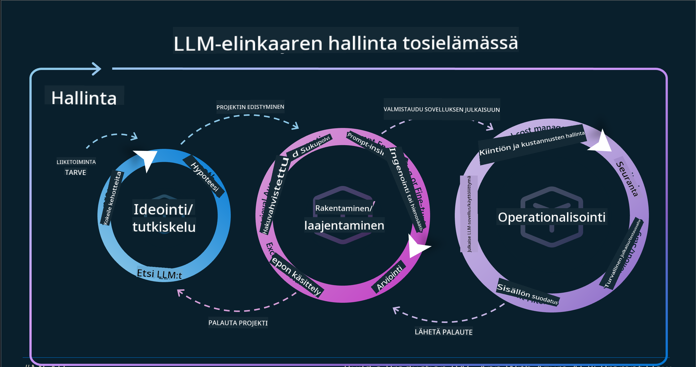
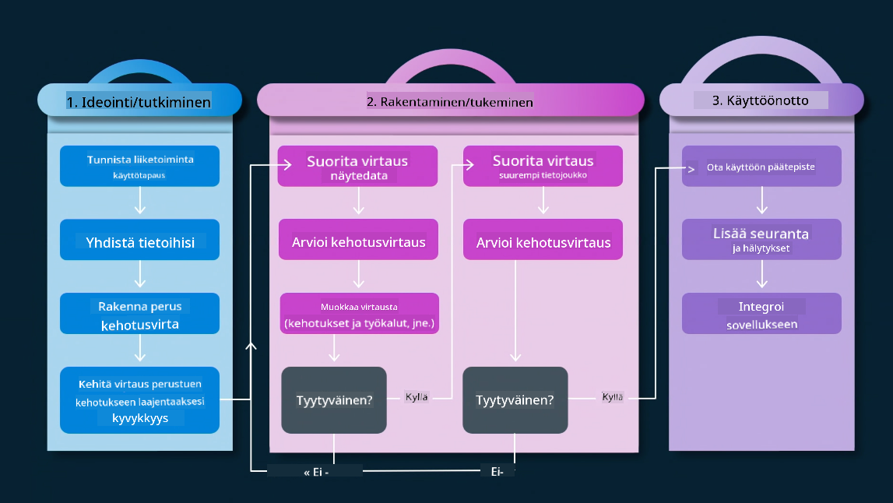
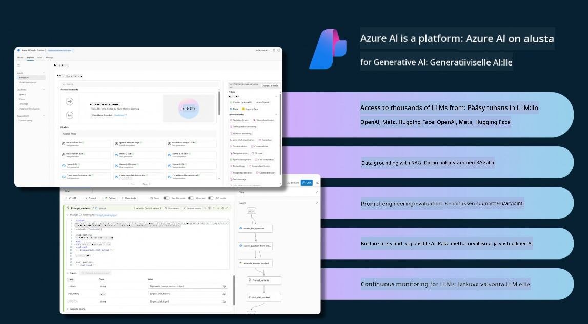
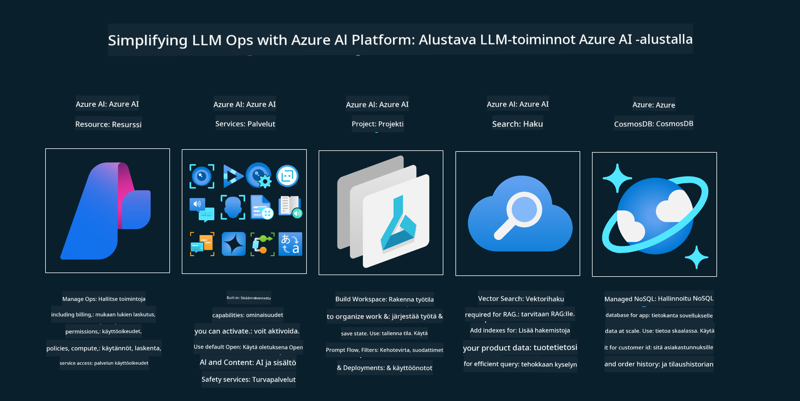
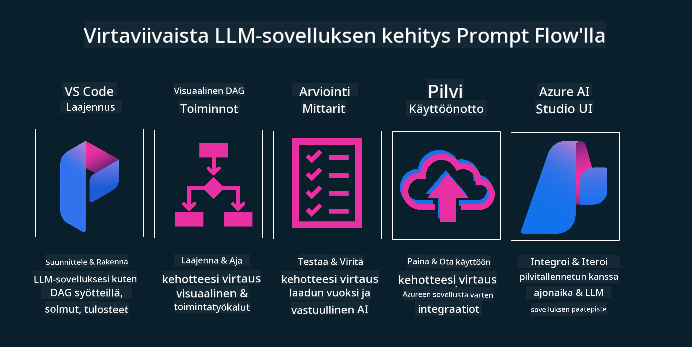

<!--
CO_OP_TRANSLATOR_METADATA:
{
  "original_hash": "27a5347a5022d5ef0a72ab029b03526a",
  "translation_date": "2025-06-25T22:05:44+00:00",
  "source_file": "14-the-generative-ai-application-lifecycle/README.md",
  "language_code": "fi"
}
-->

# Generatiivisen tekoälyn sovelluksen elinkaari

Kaikille tekoälysovelluksille tärkeä kysymys on tekoälyominaisuuksien merkityksellisyys, sillä tekoäly on nopeasti kehittyvä ala. Jotta sovelluksesi pysyy merkityksellisenä, luotettavana ja vankkana, sinun on seurattava, arvioitava ja parannettava sitä jatkuvasti. Tässä generatiivisen tekoälyn elinkaari tulee avuksi.

Generatiivisen tekoälyn elinkaari on viitekehys, joka ohjaa sinua generatiivisen tekoälysovelluksen kehittämisen, käyttöönoton ja ylläpidon vaiheissa. Se auttaa sinua määrittelemään tavoitteesi, mittaamaan suorituskykyäsi, tunnistamaan haasteesi ja toteuttamaan ratkaisuja. Se auttaa myös sovittamaan sovelluksesi alasi ja sidosryhmiesi eettisiin ja oikeudellisiin standardeihin. Seuraamalla generatiivisen tekoälyn elinkaarta voit varmistaa, että sovelluksesi tuottaa aina arvoa ja tyydyttää käyttäjäsi.

## Johdanto

Tässä luvussa:

- Ymmärrä paradigman muutos MLOpsista LLMOpsiin
- LLM:n elinkaari
- Elinkaaren työkalut
- Elinkaaren metrikan ja arviointi

## Ymmärrä paradigman muutos MLOpsista LLMOpsiin

LLM:t ovat uusi työkalu tekoälyn työkalupakissa, ja ne ovat uskomattoman voimakkaita analyysi- ja generointitehtävissä sovelluksille. Tämä voima vaikuttaa kuitenkin siihen, miten virtaviivaistamme tekoälyn ja perinteisen koneoppimisen tehtäviä.

Tarvitsemme uuden paradigman mukauttaaksemme tämän työkalun dynaamisesti, oikeilla kannustimilla. Voimme luokitella vanhemmat tekoälysovellukset "ML-sovelluksiksi" ja uudemmat tekoälysovellukset "GenAI-sovelluksiksi" tai yksinkertaisesti "tekoälysovelluksiksi", mikä heijastaa käytettyä valtavirran teknologiaa ja tekniikoita. Tämä muuttaa kertomustamme monin tavoin, katso seuraavaa vertailua.

Huomaa, että LLMOpsissa keskitymme enemmän sovelluskehittäjiin, käytämme integraatioita avainkohtana, käytämme "mallit palveluna" ja mietimme seuraavia kohtia mittareille.

- Laatu: Vastausten laatu
- Vahinko: Vastuullinen tekoäly
- Rehellisyys: Vastausten pohjautuneisuus (Onko järkevää? Onko oikein?)
- Kustannus: Ratkaisun budjetti
- Viive: Keskimääräinen aika vastauksen saamiseen

## LLM:n elinkaari

Ensin, ymmärtääksemme elinkaaren ja muutokset, tarkastellaan seuraavaa infografiikkaa.

Kuten huomaat, tämä poikkeaa tavallisista MLOpsin elinkaarista. LLM:illä on monia uusia vaatimuksia, kuten Prompting, erilaisia tekniikoita laadun parantamiseksi (hienosäätö, RAG, Meta-Prompts), erilainen arviointi ja vastuu vastuullisen tekoälyn kanssa, ja lopuksi uudet arviointimittarit (laatu, vahinko, rehellisyys, kustannus ja viive).

Esimerkiksi, katsotaan miten ideointi tapahtuu. Käytämme prompt engineeringiä kokeillaksemme erilaisia LLM:itä tutkiaksemme mahdollisuuksia testata, voisiko hypoteesimme olla oikea.

Huomaa, että tämä ei ole lineaarinen, vaan integroidut silmukat, iteratiiviset ja kattava sykli.

Miten voisimme tutkia näitä askeleita? Mennään yksityiskohtiin, miten voisimme rakentaa elinkaaren.

Tämä voi näyttää hieman monimutkaiselta, keskitytään ensin kolmeen suureen askeleeseen.

1. Ideointi/Tutkiminen: Tutkiminen, tässä voimme tutkia liiketoimintatarpeidemme mukaisesti. Prototypointi, luomalla [PromptFlow](https://microsoft.github.io/promptflow/index.html?WT.mc_id=academic-105485-koreyst) ja testaamalla, onko se tarpeeksi tehokas hypoteesillemme.
1. Rakentaminen/Laajentaminen: Toteutus, nyt alamme arvioida suurempia tietojoukkoja, toteutamme tekniikoita, kuten hienosäätöä ja RAG:ia, tarkistaaksemme ratkaisumme vankkuutta. Jos ei, sen uudelleen toteuttaminen, uusien vaiheiden lisääminen virtaamme tai tietojen uudelleenjärjestely saattaa auttaa. Kun olemme testanneet virtaamme ja mittakaavaamme, jos se toimii ja tarkistaa mittarimme, se on valmis seuraavaan vaiheeseen.
1. Operatiivisuus: Integrointi, nyt lisäämme valvonta- ja hälytysjärjestelmät järjestelmäämme, käyttöönoton ja sovellusintegroinnin sovellukseemme.

Sitten meillä on kattava hallintasykli, joka keskittyy turvallisuuteen, vaatimustenmukaisuuteen ja hallintoon.

Onnittelut, nyt sinulla on tekoälysovelluksesi valmiina ja toimintakunnossa. Käytännön kokemuksen saamiseksi tutustu [Contoso Chat Demoon.](https://nitya.github.io/contoso-chat/?WT.mc_id=academic-105485-koreys)

Mitä työkaluja voisimme käyttää?

## Elinkaaren työkalut

Työkalujen osalta Microsoft tarjoaa [Azure AI Platformin](https://azure.microsoft.com/solutions/ai/?WT.mc_id=academic-105485-koreys) ja [PromptFlow](https://microsoft.github.io/promptflow/index.html?WT.mc_id=academic-105485-koreyst) helpottamaan ja tekemään elinkaarestasi helppoa toteuttaa ja valmiina käyttöön.

[Azure AI Platform](https://azure.microsoft.com/solutions/ai/?WT.mc_id=academic-105485-koreys), mahdollistaa [AI Studion](https://ai.azure.com/?WT.mc_id=academic-105485-koreys) käytön. AI Studio on verkkopaneeli, jonka avulla voit tutkia malleja, esimerkkejä ja työkaluja. Hallitset resurssejasi, UI-kehitysvirtoja ja SDK/CLI-vaihtoehtoja koodipohjaiselle kehitykselle.

Azure AI:n avulla voit käyttää useita resursseja hallitaksesi toimintaasi, palveluitasi, projektejasi, vektorihakua ja tietokantatarpeitasi.

Rakenna, Proof-of-Conceptista (POC) aina laajamittaisiin sovelluksiin PromptFlow'n avulla:

- Suunnittele ja rakenna sovelluksia VS Codesta, visuaalisten ja toiminnallisten työkalujen avulla
- Testaa ja hienosäädä sovelluksiasi laadukkaan tekoälyn saavuttamiseksi helposti.
- Käytä Azure AI Studiota integroimaan ja iteratiivisesti pilven kanssa, Push ja Deploy nopeaan integrointiin.

## Hienoa! Jatka oppimista!

Mahtavaa, nyt opi lisää siitä, miten rakennamme sovelluksen käyttämään käsitteitä [Contoso Chat Appin](https://nitya.github.io/contoso-chat/?WT.mc_id=academic-105485-koreyst) avulla, tarkistaaksesi, miten Cloud Advocacy lisää näitä käsitteitä esittelyihin. Lisäsisältöä varten tutustu [Ignite breakout -sessioon!
](https://www.youtube.com/watch?v=DdOylyrTOWg)

Nyt tutustu oppituntiin 15, ymmärtääksesi, miten [Retrieval Augmented Generation ja vektoripohjaiset tietokannat](../15-rag-and-vector-databases/README.md?WT.mc_id=academic-105485-koreyst) vaikuttavat generatiiviseen tekoälyyn ja tekevät sovelluksista kiinnostavampia!

**Vastuuvapauslauseke**:  
Tämä asiakirja on käännetty käyttämällä tekoälypohjaista käännöspalvelua [Co-op Translator](https://github.com/Azure/co-op-translator). Vaikka pyrimme tarkkuuteen, huomioithan, että automaattiset käännökset voivat sisältää virheitä tai epätarkkuuksia. Alkuperäistä asiakirjaa sen alkuperäisellä kielellä tulisi pitää auktoritatiivisena lähteenä. Kriittistä tietoa varten suositellaan ammattimaista ihmiskäännöstä. Emme ole vastuussa tämän käännöksen käytöstä johtuvista väärinkäsityksistä tai väärintulkinnoista.