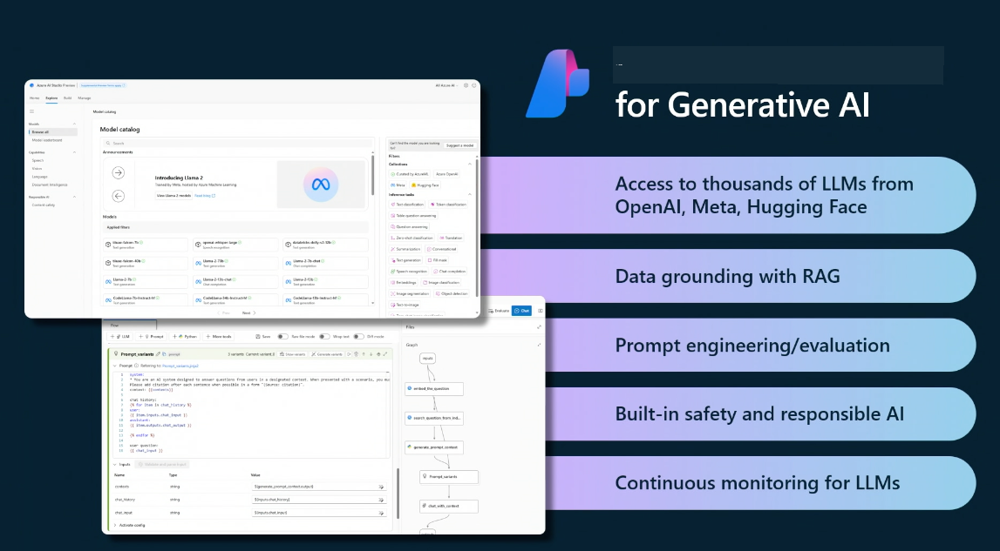

<!--
CO_OP_TRANSLATOR_METADATA:
{
  "original_hash": "b9d32511b27373a1b21b5789d4fda057",
  "translation_date": "2025-10-17T19:44:53+00:00",
  "source_file": "14-the-generative-ai-application-lifecycle/README.md",
  "language_code": "fi"
}
-->

# Generatiivisen tekoälyn sovelluskehityksen elinkaari

Kaikille tekoälysovelluksille tärkeä kysymys on tekoälyominaisuuksien ajankohtaisuus, sillä tekoäly kehittyy nopeasti. Jotta sovelluksesi pysyy ajankohtaisena, luotettavana ja vahvana, sitä on seurattava, arvioitava ja parannettava jatkuvasti. Tässä generatiivisen tekoälyn elinkaari tulee avuksi.

Generatiivisen tekoälyn elinkaari on kehys, joka ohjaa sinua generatiivisen tekoälysovelluksen kehittämisen, käyttöönoton ja ylläpidon vaiheiden läpi. Se auttaa sinua määrittelemään tavoitteesi, mittaamaan suorituskykyäsi, tunnistamaan haasteesi ja toteuttamaan ratkaisuja. Lisäksi se auttaa sovittamaan sovelluksesi eettisiin ja oikeudellisiin standardeihin, jotka koskevat toimialaasi ja sidosryhmiäsi. Noudattamalla generatiivisen tekoälyn elinkaarta voit varmistaa, että sovelluksesi tuottaa jatkuvasti arvoa ja tyydyttää käyttäjiäsi.

## Johdanto

Tässä luvussa opit:

- Ymmärtämään paradigman muutoksen MLOpsista LLMOpsiin
- LLM:n elinkaaren
- Elinkaaren työkalut
- Elinkaaren mittaaminen ja arviointi

## Ymmärrä paradigman muutos MLOpsista LLMOpsiin

LLM:t ovat uusi työkalu tekoälyn työkalupakissa. Ne ovat uskomattoman tehokkaita analyysi- ja generointitehtävissä sovelluksille, mutta tämä voima tuo mukanaan seurauksia siihen, miten virtaviivaistamme tekoäly- ja perinteisiä koneoppimistehtäviä.

Tämän vuoksi tarvitsemme uuden paradigman, joka mukauttaa tämän työkalun dynaamisesti ja oikeilla kannustimilla. Voimme luokitella vanhemmat tekoälysovellukset "ML-sovelluksiksi" ja uudemmat tekoälysovellukset "GenAI-sovelluksiksi" tai yksinkertaisesti "tekoälysovelluksiksi", mikä heijastaa käytettyjä valtavirran teknologioita ja tekniikoita. Tämä muuttaa narratiivia monin tavoin, katso seuraava vertailu.

Huomaa, että LLMOpsissa keskitymme enemmän sovelluskehittäjiin, käyttäen integraatioita keskeisenä kohtana, hyödyntäen "Models-as-a-Service" -lähestymistapaa ja ajatellen seuraavia mittareita:

- Laatu: Vastausten laatu
- Haitta: Vastuullinen tekoäly
- Rehellisyys: Vastausten perusteltavuus (Onko järkevää? Onko oikein?)
- Kustannukset: Ratkaisun budjetti
- Viive: Keskimääräinen aika token-vastaukselle

## LLM:n elinkaari

Ensinnäkin, ymmärtääksemme elinkaaren ja sen muutokset, tarkastellaan seuraavaa infografiikkaa.

Kuten huomaat, tämä eroaa tavallisista MLOpsin elinkaarista. LLM:illä on monia uusia vaatimuksia, kuten kehotteiden luominen, erilaiset tekniikat laadun parantamiseksi (Fine-Tuning, RAG, Meta-Prompts), erilainen arviointi ja vastuu vastuullisen tekoälyn kanssa, sekä uudet arviointimittarit (laatu, haitta, rehellisyys, kustannukset ja viive).

Esimerkiksi, tarkastellaan ideointia. Käytämme kehotteiden suunnittelua kokeillaksemme erilaisia LLM:itä ja tutkiaksemme mahdollisuuksia testataksemme, voisivatko hypoteesimme olla oikeita.

Huomaa, että tämä ei ole lineaarinen prosessi, vaan integroituja silmukoita, iteratiivisia ja kokonaisvaltaisen syklin kanssa.

Miten voisimme tutkia näitä vaiheita? Tarkastellaan yksityiskohtaisesti, miten voisimme rakentaa elinkaaren.

Tämä saattaa näyttää hieman monimutkaiselta, keskitytään ensin kolmeen suureen vaiheeseen.

1. Ideointi/Tutkiminen: Tutkimus, tässä voimme tutkia liiketoimintatarpeidemme mukaan. Prototyyppien luominen, [PromptFlow](https://microsoft.github.io/promptflow/index.html?WT.mc_id=academic-105485-koreyst) -työkalun käyttäminen ja testaus, onko se riittävän tehokas hypoteesillemme.
1. Rakentaminen/Laajentaminen: Toteutus, nyt aloitamme arvioinnin suuremmilla tietojoukoilla, toteutamme tekniikoita, kuten hienosäätöä ja RAG:ia, tarkistaaksemme ratkaisumme vahvuuden. Jos se ei toimi, uudelleentoteutus, uusien vaiheiden lisääminen työnkulkuumme tai datan uudelleenjärjestely saattaa auttaa. Kun olemme testanneet työnkulkuamme ja mittakaavaamme, jos se toimii ja täyttää mittarimme, se on valmis seuraavaan vaiheeseen.
1. Operatiivinen käyttöönotto: Integraatio, nyt lisätään valvonta- ja hälytysjärjestelmiä järjestelmäämme, käyttöönotto ja sovelluksen integrointi sovellukseemme.

Sitten meillä on kokonaisvaltainen hallintasykli, joka keskittyy turvallisuuteen, vaatimustenmukaisuuteen ja hallintoon.

Onneksi olkoon, nyt sinulla on tekoälysovellus valmiina käyttöön ja toiminnassa. Käytännön kokemusta varten tutustu [Contoso Chat -demo](https://nitya.github.io/contoso-chat/?WT.mc_id=academic-105485-koreys) -sovellukseen.

Mitä työkaluja voisimme käyttää?

## Elinkaaren työkalut

Työkalujen osalta Microsoft tarjoaa [Azure AI -alustan](https://azure.microsoft.com/solutions/ai/?WT.mc_id=academic-105485-koreys) ja [PromptFlow](https://microsoft.github.io/promptflow/index.html?WT.mc_id=academic-105485-koreyst) -työkalut, jotka helpottavat elinkaaren toteuttamista ja tekevät siitä käyttövalmiin.

[Azure AI -alusta](https://azure.microsoft.com/solutions/ai/?WT.mc_id=academic-105485-koreys) mahdollistaa [AI Studion](https://ai.azure.com/?WT.mc_id=academic-105485-koreys) käytön. AI Studio on verkkopohjainen portaali, joka mahdollistaa mallien, esimerkkien ja työkalujen tutkimisen. Se tarjoaa resurssien hallintaa, käyttöliittymän kehitystyönkulkuja sekä SDK/CLI-vaihtoehtoja koodipohjaiseen kehitykseen.

Azure AI mahdollistaa useiden resurssien käytön operaatioiden, palveluiden, projektien, vektorihakujen ja tietokantatarpeiden hallintaan.

Rakentaminen, Proof-of-Conceptista (POC) aina laajamittaisiin sovelluksiin PromptFlow:n avulla:

- Suunnittele ja rakenna sovelluksia VS Codessa visuaalisilla ja toiminnallisilla työkaluilla
- Testaa ja hienosäädä sovelluksiasi laadukkaan tekoälyn saavuttamiseksi helposti
- Käytä Azure AI Studiota integroidaksesi ja iteroidaksesi pilvessä, julkaise ja ota käyttöön nopeaa integraatiota varten

## Hienoa! Jatka oppimista!

Mahtavaa, nyt opi lisää siitä, miten rakennamme sovelluksen käyttämään näitä konsepteja [Contoso Chat -sovelluksen](https://nitya.github.io/contoso-chat/?WT.mc_id=academic-105485-koreyst) avulla, ja tarkista, miten Cloud Advocacy käyttää näitä konsepteja demonstraatioissa. Lisää sisältöä löydät [Ignite breakout -sessioista!](https://www.youtube.com/watch?v=DdOylyrTOWg)

Seuraavaksi tutustu lukuun 15, jossa käsitellään, miten [Retrieval Augmented Generation ja vektoripohjaiset tietokannat](../15-rag-and-vector-databases/README.md?WT.mc_id=academic-105485-koreyst) vaikuttavat generatiiviseen tekoälyyn ja tekevät sovelluksista entistä kiinnostavampia!

---

**Vastuuvapauslauseke**:  
Tämä asiakirja on käännetty käyttämällä tekoälypohjaista käännöspalvelua [Co-op Translator](https://github.com/Azure/co-op-translator). Vaikka pyrimme tarkkuuteen, huomioithan, että automaattiset käännökset voivat sisältää virheitä tai epätarkkuuksia. Alkuperäinen asiakirja sen alkuperäisellä kielellä tulisi pitää ensisijaisena lähteenä. Kriittisen tiedon osalta suositellaan ammattimaista ihmiskäännöstä. Emme ole vastuussa väärinkäsityksistä tai virhetulkinnoista, jotka johtuvat tämän käännöksen käytöstä.