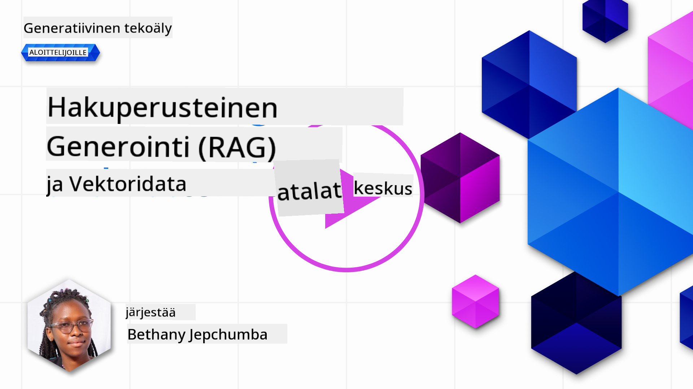
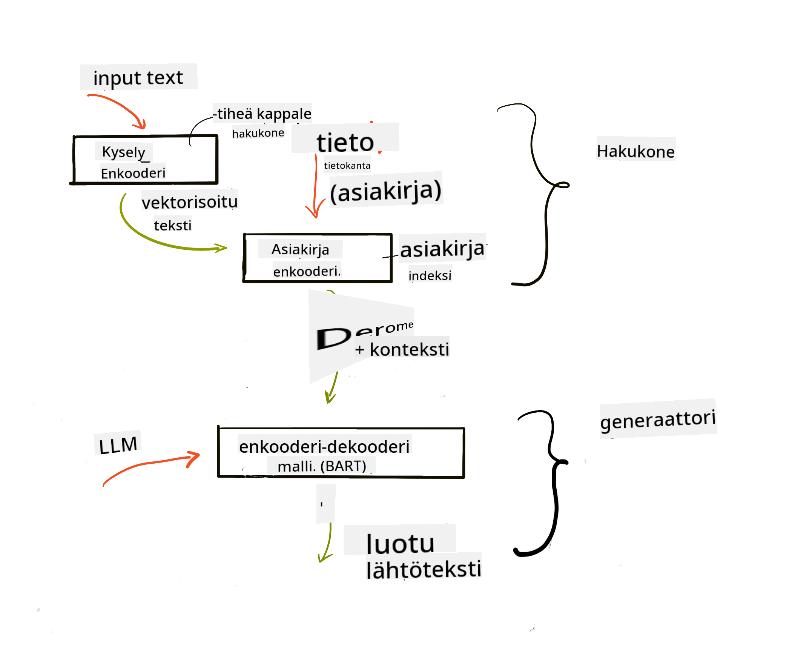
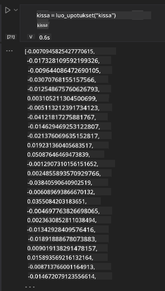

<!--
CO_OP_TRANSLATOR_METADATA:
{
  "original_hash": "e2861bbca91c0567ef32bc77fe054f9e",
  "translation_date": "2025-05-20T01:34:20+00:00",
  "source_file": "15-rag-and-vector-databases/README.md",
  "language_code": "fi"
}
-->
# Tiedonhakuun perustuva generointi (RAG) ja vektoripohjaiset tietokannat

[](https://aka.ms/gen-ai-lesson15-gh?WT.mc_id=academic-105485-koreyst)

Hakusovellusten oppitunnilla opimme lyhyesti, kuinka integroida omaa dataa suuriin kielimalleihin (LLM). Tässä oppitunnissa syvennymme tarkemmin siihen, miten voit sitoa datasi LLM-sovellukseesi, prosessin mekaniikkaan ja menetelmiin datan tallentamiseksi, mukaan lukien sekä upotukset että teksti.

> **Video tulossa pian**

## Johdanto

Tässä oppitunnissa käsittelemme seuraavia asioita:

- Johdatus RAG:iin, mitä se on ja miksi sitä käytetään tekoälyssä.

- Ymmärrys siitä, mitä vektoripohjaiset tietokannat ovat ja kuinka luoda sellainen sovelluksellemme.

- Käytännön esimerkki siitä, kuinka integroida RAG sovellukseen.

## Oppimistavoitteet

Oppitunnin suorittamisen jälkeen pystyt:

- Selittämään RAG:n merkityksen datan haussa ja käsittelyssä.

- Asentamaan RAG-sovelluksen ja sitomaan datasi LLM:ään.

- Tehokkaasti integroimaan RAG:n ja vektoripohjaiset tietokannat LLM-sovelluksiin.

## Meidän skenaario: LLM:n parantaminen omalla datalla

Tässä oppitunnissa haluamme lisätä omat muistiinpanomme koulutusstartuppiin, jolloin chatbot voi saada enemmän tietoa eri aiheista. Käyttämällä muistiinpanojamme oppijat voivat opiskella paremmin ja ymmärtää eri aiheita, mikä helpottaa kokeisiin valmistautumista. Skenaarion luomiseksi käytämme:

- `Azure OpenAI:` LLM, jota käytämme chatbotin luomiseen

- `AI for beginners' lesson on Neural Networks`: tämä on data, johon LLM perustetaan

- `Azure AI Search` ja `Azure Cosmos DB:` vektoripohjainen tietokanta datan tallentamiseen ja hakemistoindeksin luomiseen

Käyttäjät voivat luoda harjoituskyselyitä muistiinpanoistaan, kertauskortteja ja tiivistää ne ytimekkäiksi katsauksiksi. Aloittaaksemme, katsotaan mitä RAG on ja miten se toimii:

## Tiedonhakuun perustuva generointi (RAG)

LLM-pohjainen chatbot käsittelee käyttäjän kehotteita luodakseen vastauksia. Se on suunniteltu olemaan vuorovaikutteinen ja keskustelemaan käyttäjien kanssa laajasta aihevalikoimasta. Sen vastaukset ovat kuitenkin rajallisia annetun kontekstin ja sen perustavan koulutusaineiston mukaan. Esimerkiksi GPT-4:n tietokatko on syyskuussa 2021, mikä tarkoittaa, että se ei tunne tapahtumia, jotka ovat tapahtuneet tämän ajankohdan jälkeen. Lisäksi LLM:ien koulutuksessa käytetty data ei sisällä luottamuksellista tietoa, kuten henkilökohtaisia muistiinpanoja tai yrityksen tuotekäsikirjaa.

### Miten RAG:t (Tiedonhakuun perustuva generointi) toimivat


Oletetaan, että haluat ottaa käyttöön chatbotin, joka luo kyselyitä muistiinpanoistasi, tarvitset yhteyden tietokantaan. Tässä RAG tulee apuun. RAG:t toimivat seuraavasti:

- **Tietokanta:** Ennen hakua nämä dokumentit tulee ottaa vastaan ja esikäsitellä, yleensä pilkkomalla suuria dokumentteja pienempiin osiin, muuntamalla ne tekstin upotuksiksi ja tallentamalla ne tietokantaan.

- **Käyttäjän kysely:** käyttäjä esittää kysymyksen

- **Haku:** Kun käyttäjä esittää kysymyksen, upotusmalli hakee asiaankuuluvan tiedon tietokannastamme tarjotakseen enemmän kontekstia, joka sisällytetään kehotteeseen.

- **Parannettu generointi:** LLM parantaa vastaustaan haetun datan perusteella. Se mahdollistaa, että generoitava vastaus perustuu paitsi ennalta koulutettuun dataan myös asiaankuuluvaan tietoon lisätystä kontekstista. Haettu data käytetään LLM:n vastausten parantamiseen. LLM palauttaa sitten vastauksen käyttäjän kysymykseen.



RAG:n arkkitehtuuri toteutetaan käyttäen transformereita, jotka koostuvat kahdesta osasta: kooderista ja dekooderista. Esimerkiksi, kun käyttäjä esittää kysymyksen, syöteteksti 'koodataan' vektoreiksi, jotka kuvaavat sanojen merkitystä, ja vektorit 'dekoodataan' dokumentti-indeksiimme ja luovat uutta tekstiä käyttäjän kyselyn perusteella. LLM käyttää sekä kooderi-dekooderi mallia tuottaakseen lopputuloksen.

Kaksi lähestymistapaa RAG:n toteuttamiseen ehdotetun paperin mukaan: [Retrieval-Augmented Generation for Knowledge intensive NLP (natural language processing software) Tasks](https://arxiv.org/pdf/2005.11401.pdf?WT.mc_id=academic-105485-koreyst) ovat:

- **_RAG-Sequence_** käyttäen haettuja dokumentteja ennustamaan paras mahdollinen vastaus käyttäjän kyselyyn

- **RAG-Token** käyttäen dokumentteja seuraavan tokenin generointiin, sitten hakemaan niitä vastaamaan käyttäjän kyselyyn

### Miksi käyttäisit RAG:tä? 

- **Tietorikkaus:** varmistaa, että tekstivastaukset ovat ajan tasalla ja ajankohtaisia. Se parantaa suorituskykyä alakohtaisissa tehtävissä pääsemällä sisäiseen tietokantaan.

- Vähentää virheellisiä tietoja käyttämällä **todennettavaa dataa** tietokannassa tarjotakseen kontekstia käyttäjän kyselyihin.

- Se on **kustannustehokas**, koska ne ovat taloudellisempia verrattuna LLM:n hienosäätöön.

## Tietokannan luominen

Sovelluksemme perustuu henkilökohtaiseen dataamme, eli Neuroverkkotunnille AI For Beginners -opetussuunnitelmassa.

### Vektoripohjaiset tietokannat

Vektoripohjainen tietokanta, toisin kuin perinteiset tietokannat, on erikoistunut tietokanta, joka on suunniteltu tallentamaan, hallitsemaan ja hakemaan upotettuja vektoreita. Se tallentaa dokumenttien numeerisia esityksiä. Datan pilkkominen numeerisiin upotuksiin helpottaa AI-järjestelmämme datan ymmärtämistä ja käsittelyä.

Tallennamme upotuksemme vektoripohjaisiin tietokantoihin, koska LLM:illä on rajoitus syötteenä hyväksyttävien tokenien määrässä. Koska et voi antaa koko upotuksia LLM:lle, meidän täytyy pilkkoa ne osiin, ja kun käyttäjä esittää kysymyksen, upotukset, jotka ovat eniten kysymyksen kaltaisia, palautetaan yhdessä kehotteen kanssa. Pilkkominen myös vähentää kustannuksia LLM:lle lähetettävien tokenien määrässä.

Joitakin suosittuja vektoripohjaisia tietokantoja ovat Azure Cosmos DB, Clarifyai, Pinecone, Chromadb, ScaNN, Qdrant ja DeepLake. Voit luoda Azure Cosmos DB -mallin käyttäen Azure CLI:tä seuraavalla komennolla:

```bash
az login
az group create -n <resource-group-name> -l <location>
az cosmosdb create -n <cosmos-db-name> -r <resource-group-name>
az cosmosdb list-keys -n <cosmos-db-name> -g <resource-group-name>
```

### Tekstistä upotuksiin

Ennen kuin tallennamme datamme, meidän täytyy muuntaa se vektoriupotuksiksi ennen kuin se tallennetaan tietokantaan. Jos työskentelet suurten dokumenttien tai pitkien tekstien kanssa, voit pilkkoa ne odotettujen kyselyiden perusteella. Pilkkominen voidaan tehdä lause- tai kappaletasolla. Koska pilkkominen johtaa merkityksiin ympäröivistä sanoista, voit lisätä jonkin muun kontekstin osaan, esimerkiksi lisäämällä dokumentin otsikon tai sisällyttämällä tekstiä ennen tai jälkeen osan. Voit pilkkoa datan seuraavasti:

```python
def split_text(text, max_length, min_length):
    words = text.split()
    chunks = []
    current_chunk = []

    for word in words:
        current_chunk.append(word)
        if len(' '.join(current_chunk)) < max_length and len(' '.join(current_chunk)) > min_length:
            chunks.append(' '.join(current_chunk))
            current_chunk = []

    # If the last chunk didn't reach the minimum length, add it anyway
    if current_chunk:
        chunks.append(' '.join(current_chunk))

    return chunks
```

Kun pilkottu, voimme sitten upottaa tekstimme eri upotusmallien avulla. Joitakin malleja, joita voit käyttää, ovat: word2vec, ada-002 OpenAI:lta, Azure Computer Vision ja paljon muuta. Mallin valinta riippuu käyttämistäsi kielistä, koodatun sisällön tyypistä (teksti/kuvat/audio), syötteen koosta, jonka se voi koodata, ja upotuksen pituudesta.

Esimerkki upotetusta tekstistä käyttäen OpenAI:n `text-embedding-ada-002` mallia on:


## Tiedonhaku ja vektorihaku

Kun käyttäjä esittää kysymyksen, hakija muuntaa sen vektoriksi käyttäen kyselyn kooderia, sitten se etsii dokumentti-hakemistoistamme asiaankuuluvia vektoreita dokumentissa, jotka liittyvät syötteeseen. Kun tehty, se muuntaa sekä syötevektorin että dokumenttivektorit tekstiksi ja kuljettaa sen LLM:n läpi.

### Tiedonhaku

Tiedonhaku tapahtuu, kun järjestelmä yrittää nopeasti löytää dokumentit hakemistosta, jotka täyttävät hakukriteerit. Hakijan tavoite on saada dokumentit, joita käytetään kontekstin tarjoamiseen ja LLM:n sitomiseen dataasi.

Tietokannassamme on useita tapoja tehdä haku, kuten:

- **Avainsanahaku** - käytetään tekstihakuihin

- **Semanttinen haku** - käyttää sanojen semanttista merkitystä

- **Vektorihaku** - muuntaa dokumentit tekstistä vektoriesityksiksi upotusmallien avulla. Haku tehdään kyselemällä dokumentteja, joiden vektoriedustukset ovat lähimpänä käyttäjän kysymystä.

- **Hybridihaku** - yhdistelmä sekä avainsana- että vektorihakua.

Haaste tiedonhaussa tulee, kun tietokannassa ei ole vastaavaa vastausta kyselyyn, järjestelmä palauttaa sitten parhaan saatavilla olevan tiedon, kuitenkin voit käyttää taktiikoita kuten asettaa enimmäisetäisyys relevanssille tai käyttää hybridihakua, joka yhdistää sekä avainsanat että vektorihakua. Tässä oppitunnissa käytämme hybridihakua, yhdistelmää sekä vektori- että avainsanahakua. Tallennamme datamme tietokehykseen, jossa on sarakkeita, jotka sisältävät osat sekä upotukset.

### Vektorien samankaltaisuus

Hakija etsii tietokannasta upotuksia, jotka ovat lähellä toisiaan, lähin naapuri, koska ne ovat tekstejä, jotka ovat samankaltaisia. Skenaariossa, jossa käyttäjä esittää kyselyn, se ensin upotetaan, sitten se yhdistetään samankaltaisiin upotuksiin. Yleinen mittaus, jota käytetään löytämään, kuinka samankaltaisia eri vektorit ovat, on kosinivirhe, joka perustuu kahden vektorin väliseen kulmaan.

Voimme mitata samankaltaisuutta käyttämällä muita vaihtoehtoja, kuten Euklidista etäisyyttä, joka on suora viiva vektorien päätepisteiden välillä, ja pistetuloa, joka mittaa kahden vektorin vastaavien elementtien tuotteiden summaa.

### Hakemisto

Kun teemme tiedonhakua, meidän täytyy rakentaa hakemisto tietokannallemme ennen kuin suoritamme haun. Hakemisto tallentaa upotuksemme ja voi nopeasti hakea samankaltaisimmat osat jopa suuressa tietokannassa. Voimme luoda hakemistomme paikallisesti käyttämällä:

```python
from sklearn.neighbors import NearestNeighbors

embeddings = flattened_df['embeddings'].to_list()

# Create the search index
nbrs = NearestNeighbors(n_neighbors=5, algorithm='ball_tree').fit(embeddings)

# To query the index, you can use the kneighbors method
distances, indices = nbrs.kneighbors(embeddings)
```

### Uudelleenjärjestely

Kun olet kysellyt tietokantaa, saatat tarvita tulosten lajittelua relevanssin mukaan. Uudelleenjärjestely LLM hyödyntää koneoppimista parantaakseen hakutulosten relevanssia järjestämällä ne relevantimmista alkaen. Käyttäen Azure AI Searchia, uudelleenjärjestely tehdään automaattisesti sinulle käyttäen semanttista uudelleenjärjestelijää. Esimerkki siitä, kuinka uudelleenjärjestely toimii lähimpien naapureiden avulla:

```python
# Find the most similar documents
distances, indices = nbrs.kneighbors([query_vector])

index = []
# Print the most similar documents
for i in range(3):
    index = indices[0][i]
    for index in indices[0]:
        print(flattened_df['chunks'].iloc[index])
        print(flattened_df['path'].iloc[index])
        print(flattened_df['distances'].iloc[index])
    else:
        print(f"Index {index} not found in DataFrame")
```

## Kaiken yhdistäminen

Viimeinen vaihe on lisätä LLM mukaan, jotta voimme saada vastauksia, jotka perustuvat dataamme. Voimme toteuttaa sen seuraavasti:

```python
user_input = "what is a perceptron?"

def chatbot(user_input):
    # Convert the question to a query vector
    query_vector = create_embeddings(user_input)

    # Find the most similar documents
    distances, indices = nbrs.kneighbors([query_vector])

    # add documents to query  to provide context
    history = []
    for index in indices[0]:
        history.append(flattened_df['chunks'].iloc[index])

    # combine the history and the user input
    history.append(user_input)

    # create a message object
    messages=[
        {"role": "system", "content": "You are an AI assistant that helps with AI questions."},
        {"role": "user", "content": history[-1]}
    ]

    # use chat completion to generate a response
    response = openai.chat.completions.create(
        model="gpt-4",
        temperature=0.7,
        max_tokens=800,
        messages=messages
    )

    return response.choices[0].message

chatbot(user_input)
```

## Sovelluksen arviointi

### Arviointimetriikat

- Tarjottujen vastausten laatu varmistaen, että ne kuulostavat luonnollisilta, sujuvilta ja ihmismäisiltä

- Datan perustuvuus: arvioida, onko vastaus tullut toimitetuista dokumenteista

- Relevanssi: arvioida, vastaako vastaus kysymykseen ja liittyykö se siihen

- Sujuvuus - onko vastaus kieliopillisesti järkevä

## Käyttötapaukset RAG:n (Tiedonhakuun perustuva generointi) ja vektoripohjaisten tietokantojen käytölle

On monia erilaisia käyttötapauksia, joissa funktiokutsut voivat parantaa sovellustasi, kuten:

- Kysymys ja vastaus: yrityksesi datan perustaminen chattiin, jota työntekijät voivat käyttää kysymysten esittämiseen.

- Suositusjärjestelmät: jossa voit luoda järjestelmän, joka yhdistää samankaltaisimmat arvot, esim. elokuvat, ravintolat ja paljon muuta.

- Chatbot-palvelut: voit tallentaa chat-historian ja henkilökohtaistaa keskustelun käyttäjän datan perusteella.

- Kuvahaku vektoripohjaisten upotusten perusteella, hyödyllinen kuvatunnistuksessa ja poikkeavuuksien havaitsemisessa.

## Yhteenveto

Olemme käsitelleet RAG:n perusalueet datan lisäämisestä sovellukseen, käyttäjän kyselyyn ja lopputulokseen. RAG:n luomisen yksinkertaistamiseksi voit käyttää kehyksiä, kuten Semanti Kernel, Langchain tai Autogen.

## Tehtävä

Jatkaaksesi oppimista tiedonhakuun perustuvan generoinnin (RAG) parissa, voit rakentaa:

- Rakenna käyttöliittymä sovellukselle käyttäen valitsemaasi kehystä

- Hyödynnä kehystä, joko LangChain tai Semanttinen Kernel, ja luo sovelluksesi uudelleen.

Onnittelut oppitunnin suorittamisesta 👏.

## Oppiminen ei lopu tähän, jatka matkaa

Oppitunnin suorittamisen jälkeen tutustu [Generatiivisen AI:n oppimiskokoelmaamme](https://aka.ms/genai-collection?WT.mc_id=academic-105485-koreyst) jatkaaksesi Generatiivisen AI:n tietosi kehittämistä!

**Vastuuvapauslauseke**:  
Tämä asiakirja on käännetty käyttämällä tekoälypohjaista käännöspalvelua [Co-op Translator](https://github.com/Azure/co-op-translator). Pyrimme tarkkuuteen, mutta huomioithan, että automaattiset käännökset saattavat sisältää virheitä tai epätarkkuuksia. Alkuperäistä asiakirjaa sen alkuperäisellä kielellä tulisi pitää ensisijaisena lähteenä. Kriittisen tiedon kohdalla suositellaan ammattimaista ihmiskäännöstä. Emme ole vastuussa tämän käännöksen käytöstä johtuvista väärinkäsityksistä tai virhetulkinnoista.