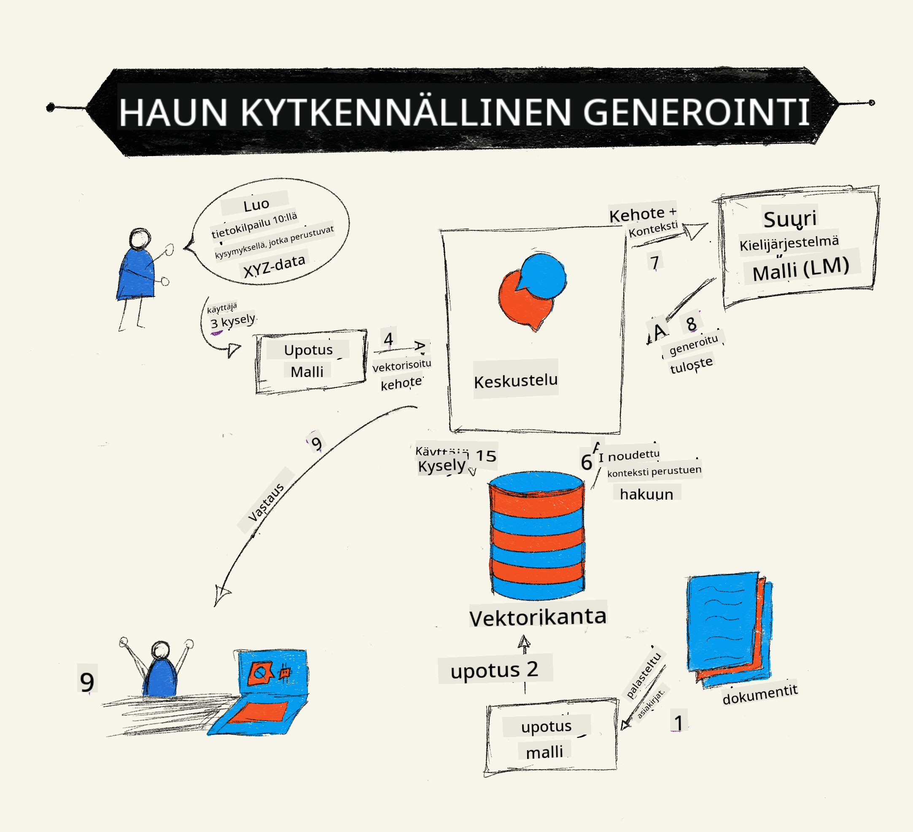
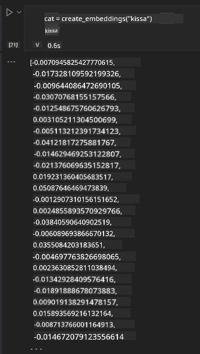

<!--
CO_OP_TRANSLATOR_METADATA:
{
  "original_hash": "e2861bbca91c0567ef32bc77fe054f9e",
  "translation_date": "2025-07-09T16:14:55+00:00",
  "source_file": "15-rag-and-vector-databases/README.md",
  "language_code": "fi"
}
-->
# Retrieval Augmented Generation (RAG) ja vektoritietokannat

[](https://aka.ms/gen-ai-lesson15-gh?WT.mc_id=academic-105485-koreyst)

Hakusovellusten oppitunnilla opimme lyhyesti, miten oma data voidaan integroida suurten kielimallien (LLM) kanssa. Tässä oppitunnissa sukellamme syvemmälle siihen, miten data voidaan perustaa LLM-sovellukseen, prosessin toimintaperiaatteisiin ja datan tallennusmenetelmiin, mukaan lukien sekä upotukset että teksti.

> **Video tulossa pian**

## Johdanto

Tässä oppitunnissa käsittelemme seuraavaa:

- Johdanto RAG:iin, mitä se on ja miksi sitä käytetään tekoälyssä (artificial intelligence).

- Ymmärrys siitä, mitä vektoritietokannat ovat ja miten luodaan oma tietokanta sovellustamme varten.

- Käytännön esimerkki siitä, miten RAG integroidaan sovellukseen.

## Oppimistavoitteet

Oppitunnin suorittamisen jälkeen osaat:

- Selittää RAG:n merkityksen datan hakemisessa ja käsittelyssä.

- Määrittää RAG-sovelluksen ja perustaa datasi LLM:ään.

- Tehokkaasti integroida RAG ja vektoritietokannat LLM-sovelluksiin.

## Tilanteemme: LLM-malliemme parantaminen omalla datallamme

Tässä oppitunnissa haluamme lisätä omat muistiinpanomme koulutusteknologia-startupiin, jotta chatbot saa enemmän tietoa eri aiheista. Muistiinpanojen avulla oppijat voivat opiskella paremmin ja ymmärtää eri aiheita, mikä helpottaa kokeisiin valmistautumista. Tilanteen luomiseksi käytämme:

- `Azure OpenAI:` LLM, jota käytämme chatbotin luomiseen

- `AI for beginners' lesson on Neural Networks:` data, johon perustamme LLM:n

- `Azure AI Search` ja `Azure Cosmos DB:` vektoritietokanta datan tallentamiseen ja hakemisto luomiseen

Käyttäjät voivat luoda muistiinpanoistaan harjoituskyselyitä, kertausmuistikortteja ja tiivistelmiä. Aloitetaan katsomalla, mitä RAG on ja miten se toimii:

## Retrieval Augmented Generation (RAG)

LLM-pohjainen chatbot käsittelee käyttäjän syötteitä vastauksien luomiseksi. Se on suunniteltu olemaan vuorovaikutteinen ja keskustelemaan monista eri aiheista. Sen vastaukset kuitenkin rajoittuvat annettuun kontekstiin ja sen perustana olevaan koulutusdataan. Esimerkiksi GPT-4:n tietämys kattaa syyskuun 2021 asti, eli se ei tunne tämän jälkeen tapahtuneita asioita. Lisäksi LLM:ien koulutusdata ei sisällä luottamuksellista tietoa, kuten henkilökohtaisia muistiinpanoja tai yrityksen tuotemanuaalia.

### Miten RAG toimii



Oletetaan, että haluat ottaa käyttöön chatbotin, joka luo kyselyitä muistiinpanoistasi. Tarvitset yhteyden tietopohjaan. Tässä RAG astuu kuvaan. RAG toimii seuraavasti:

- **Tietopohja:** Ennen hakua dokumentit täytyy syöttää ja esikäsitellä, yleensä pilkkomalla suuret dokumentit pienempiin osiin, muuntamalla ne tekstin upotuksiksi ja tallentamalla tietokantaan.

- **Käyttäjän kysely:** käyttäjä esittää kysymyksen

- **Haku:** Kun käyttäjä kysyy, upotusmalli hakee relevanttia tietoa tietopohjasta tarjotakseen lisäkontekstia, joka liitetään syötteeseen.

- **Laajennettu generointi:** LLM parantaa vastaustaan haetun datan perusteella. Näin vastaus perustuu paitsi esikoulutettuun dataan myös lisättyyn kontekstiin. Haettu data käytetään LLM:n vastausten rikastamiseen. LLM palauttaa vastauksen käyttäjän kysymykseen.


RAG-arkkitehtuuri toteutetaan transformereilla, jotka koostuvat kahdesta osasta: enkooderista ja dekooderista. Esimerkiksi kun käyttäjä esittää kysymyksen, syöteteksti 'enkoodataan' vektoreiksi, jotka kuvaavat sanojen merkitystä, ja vektorit 'dekoodataan' dokumenttihakemistoon, joka luo uutta tekstiä käyttäjän kyselyn perusteella. LLM käyttää sekä enkooderi-dekooderi-mallia tuottaakseen vastauksen.

Kaksi lähestymistapaa RAG:n toteutukseen ehdotetun artikkelin [Retrieval-Augmented Generation for Knowledge intensive NLP Tasks](https://arxiv.org/pdf/2005.11401.pdf?WT.mc_id=academic-105485-koreyst) mukaan ovat:

- **_RAG-Sequence_** käyttää haettuja dokumentteja ennustamaan paras mahdollinen vastaus käyttäjän kyselyyn

- **RAG-Token** käyttää dokumentteja seuraavan tokenin generointiin ja hakee niitä vastatakseen käyttäjän kyselyyn

### Miksi käyttää RAG:ia?

- **Tietosisällön rikkaus:** varmistaa, että tekstivastaukset ovat ajan tasalla ja ajankohtaisia. Parantaa suorituskykyä erityisaloilla pääsemällä käsiksi sisäiseen tietopohjaan.

- Vähentää virheellisiä vastauksia hyödyntämällä **tarkistettavissa olevaa dataa** tietopohjassa käyttäjän kyselyiden kontekstina.

- On **kustannustehokas**, koska se on edullisempaa kuin LLM:n hienosäätö.

## Tietopohjan luominen

Sovelluksemme perustuu henkilökohtaiseen dataamme, eli AI For Beginners -kurssin Neuroverkot-oppituntiin.

### Vektoritietokannat

Vektoritietokanta on erikoistunut tietokanta, joka on suunniteltu tallentamaan, hallitsemaan ja hakemaan upotettuja vektoreita. Se tallentaa dokumenttien numeeriset esitykset. Datan pilkkominen numeerisiksi upotuksiksi helpottaa tekoälyjärjestelmämme datan ymmärtämistä ja käsittelyä.

Tallennamme upotuksemme vektoritietokantoihin, koska LLM:illä on rajoitus syötteen tokenien määrässä. Koska koko upotusta ei voi syöttää LLM:ään kerralla, meidän täytyy pilkkoa se osiin, ja kun käyttäjä esittää kysymyksen, todennäköisimmät upotukset palautetaan syötteen mukana. Pilkkominen myös vähentää tokenien määrää, mikä pienentää kustannuksia.

Suosittuja vektoritietokantoja ovat Azure Cosmos DB, Clarifyai, Pinecone, Chromadb, ScaNN, Qdrant ja DeepLake. Voit luoda Azure Cosmos DB -mallin Azure CLI:llä seuraavalla komennolla:

```bash
az login
az group create -n <resource-group-name> -l <location>
az cosmosdb create -n <cosmos-db-name> -r <resource-group-name>
az cosmosdb list-keys -n <cosmos-db-name> -g <resource-group-name>
```

### Tekstistä upotuksiin

Ennen datan tallentamista meidän täytyy muuntaa se vektoriupotuksiksi. Jos työskentelet suurten dokumenttien tai pitkien tekstien kanssa, voit pilkkoa ne odotettavien kyselyiden mukaan. Pilkkominen voidaan tehdä lause- tai kappaletasolla. Koska pilkkominen perustuu sanojen ympärillä olevaan merkitykseen, voit lisätä pilkkoon myös muuta kontekstia, esimerkiksi dokumentin otsikon tai tekstiä ennen tai jälkeen pilkon. Voit pilkkoa datan seuraavasti:

```python
def split_text(text, max_length, min_length):
    words = text.split()
    chunks = []
    current_chunk = []

    for word in words:
        current_chunk.append(word)
        if len(' '.join(current_chunk)) < max_length and len(' '.join(current_chunk)) > min_length:
            chunks.append(' '.join(current_chunk))
            current_chunk = []

    # If the last chunk didn't reach the minimum length, add it anyway
    if current_chunk:
        chunks.append(' '.join(current_chunk))

    return chunks
```

Kun data on pilkottu, voimme upottaa tekstin eri upotusmalleilla. Joitakin malleja ovat: word2vec, OpenAI:n ada-002, Azure Computer Vision ja monet muut. Mallin valinta riippuu käytettävistä kielistä, koodattavan sisällön tyypistä (teksti/kuvat/ääni), syötteen koosta ja upotuksen pituudesta.

Esimerkki upotetusta tekstistä OpenAI:n `text-embedding-ada-002` -mallilla on:


## Haku ja vektorihaku

Kun käyttäjä esittää kysymyksen, hakija muuntaa sen vektoriksi käyttäen kyselyenkooderia, jonka jälkeen se etsii dokumenttihakemistostamme relevantteja vektoreita, jotka liittyvät syötteeseen. Tämän jälkeen sekä syötevektori että dokumenttivektorit muunnetaan tekstiksi ja syötetään LLM:ään.

### Haku

Haku tapahtuu, kun järjestelmä yrittää nopeasti löytää hakemistosta dokumentit, jotka täyttävät hakuehdot. Hakijan tavoitteena on löytää dokumentit, joita käytetään tarjoamaan kontekstia ja perustamaan LLM datallesi.

Tietokannassa hakemiseen on useita tapoja, kuten:

- **Avainsanahaku** – käytetään tekstihakuihin

- **Semanttinen haku** – hyödyntää sanojen merkitystä

- **Vektorihaku** – muuntaa dokumentit tekstistä vektoriedustuksiksi upotusmallien avulla. Haku tehdään kyselyllä, joka etsii dokumentteja, joiden vektoriesitykset ovat lähimpänä käyttäjän kysymystä.

- **Hybridihaku** – yhdistelmä avainsana- ja vektorihakua.

Haasteena haussa on, jos tietokannasta ei löydy vastaavaa vastausta kyselyyn, järjestelmä palauttaa parhaan mahdollisen tiedon. Voit kuitenkin käyttää keinoja, kuten asettaa maksimietäisyyden relevanssille tai käyttää hybridihakua, joka yhdistää avainsana- ja vektorihakua. Tässä oppitunnissa käytämme hybridihakua, joka yhdistää molemmat. Tallennamme datamme dataframeen, jossa on sarakkeet pilkuille ja upotuksille.

### Vektorien samankaltaisuus

Hakija etsii tietopohjasta upotuksia, jotka ovat lähellä toisiaan, eli lähimmät naapurit, koska ne ovat samankaltaisia tekstejä. Kun käyttäjä esittää kyselyn, se upotetaan ja verrataan samankaltaisiin upotuksiin. Yleisin mittari vektorien samankaltaisuuden arviointiin on kosinietäisyys, joka perustuu kahden vektorin väliseen kulmaan.

Voimme mitata samankaltaisuutta myös muilla tavoilla, kuten euklidisella etäisyydellä, joka on suora viiva vektorien päiden välillä, tai pistetulolla, joka mittaa kahden vektorin vastaavien alkioiden tulon summan.

### Hakemisto

Hakua varten meidän täytyy rakentaa hakemisto tietopohjalle ennen haun suorittamista. Hakemisto tallentaa upotuksemme ja pystyy nopeasti hakemaan samankaltaisimmat pilkut, vaikka tietokanta olisi suuri. Voimme luoda hakemistomme paikallisesti seuraavasti:

```python
from sklearn.neighbors import NearestNeighbors

embeddings = flattened_df['embeddings'].to_list()

# Create the search index
nbrs = NearestNeighbors(n_neighbors=5, algorithm='ball_tree').fit(embeddings)

# To query the index, you can use the kneighbors method
distances, indices = nbrs.kneighbors(embeddings)
```

### Uudelleenjärjestely

Kun olet hakenut tietokannasta, saatat haluta järjestää tulokset relevanssin mukaan. Uudelleenjärjestelyssä LLM hyödyntää koneoppimista parantaakseen hakutulosten relevanssia järjestämällä ne tärkeimmästä alkaen. Azure AI Searchissa uudelleenjärjestely tehdään automaattisesti semanttisen uudelleenjärjestäjän avulla. Esimerkki uudelleenjärjestelystä lähimpien naapureiden avulla:

```python
# Find the most similar documents
distances, indices = nbrs.kneighbors([query_vector])

index = []
# Print the most similar documents
for i in range(3):
    index = indices[0][i]
    for index in indices[0]:
        print(flattened_df['chunks'].iloc[index])
        print(flattened_df['path'].iloc[index])
        print(flattened_df['distances'].iloc[index])
    else:
        print(f"Index {index} not found in DataFrame")
```

## Kaiken yhdistäminen

Viimeinen vaihe on lisätä LLM mukaan, jotta saamme vastauksia, jotka perustuvat dataamme. Voimme toteuttaa sen seuraavasti:

```python
user_input = "what is a perceptron?"

def chatbot(user_input):
    # Convert the question to a query vector
    query_vector = create_embeddings(user_input)

    # Find the most similar documents
    distances, indices = nbrs.kneighbors([query_vector])

    # add documents to query  to provide context
    history = []
    for index in indices[0]:
        history.append(flattened_df['chunks'].iloc[index])

    # combine the history and the user input
    history.append(user_input)

    # create a message object
    messages=[
        {"role": "system", "content": "You are an AI assistant that helps with AI questions."},
        {"role": "user", "content": history[-1]}
    ]

    # use chat completion to generate a response
    response = openai.chat.completions.create(
        model="gpt-4",
        temperature=0.7,
        max_tokens=800,
        messages=messages
    )

    return response.choices[0].message

chatbot(user_input)
```

## Sovelluksen arviointi

### Arviointimittarit

- Vastauksien laatu: varmistetaan, että ne kuulostavat luonnollisilta, sujuvilta ja ihmismäisiltä

- Datan perustellisuus: arvioidaan, tuleeko vastaus toimitetuista dokumenteista

- Relevanssi: arvioidaan, vastaako vastaus esitettyä kysymystä ja liittyykö siihen

- Sujuvuus: arvioidaan, onko vastaus kieliopillisesti järkevä

## Käyttötapaukset RAG:ille ja vektoritietokannoille

RAG:ia ja vektoritietokantoja voidaan hyödyntää monissa eri käyttötapauksissa, kuten:

- Kysymys-vastausjärjestelmät: yrityksen datan perustaminen chattiin, jota työntekijät voivat käyttää kysymyksiin vastaamiseen.

- Suositusjärjestelmät: järjestelmät, jotka löytävät samankaltaisimmat arvot, esim. elokuvat, ravintolat ja paljon muuta.

- Chatbot-palvelut: keskusteluhistorian tallentaminen ja keskustelun personointi käyttäjätiedon perusteella.

- Kuvahaku vektoriupotusten avulla, hyödyllinen kuvatunnistuksessa ja poikkeavuuksien havaitsemisessa.

## Yhteenveto

Olemme käsitelleet RAG:n perusalueet: datan lisäämisen sovellukseen, käyttäjän kyselyn ja vastauksen. RAG:n luomisen helpottamiseksi voit käyttää kehyksiä kuten Semantic Kernel, Langchain tai Autogen.

## Tehtävä

Jatka oppimista Retrieval Augmented Generation (RAG) -aiheesta rakentamalla:

- Käyttöliittymä sovellukselle valitsemallasi kehysympäristöllä

- Hyödynnä kehystä, joko LangChainia tai Semantic Kernelia, ja rakenna sovelluksesi uudelleen.

Onnittelut oppitunnin suorittamisesta 👏.

## Oppiminen ei lopu tähän, jatka matkaa

Oppitunnin jälkeen tutustu [Generative AI Learning collection](https://aka.ms/genai-collection?WT.mc_id=academic-105485-koreyst) -kokoelmaamme ja jatka Generative AI -osaamisesi kehittämistä!

**Vastuuvapauslauseke**:  
Tämä asiakirja on käännetty käyttämällä tekoälypohjaista käännöspalvelua [Co-op Translator](https://github.com/Azure/co-op-translator). Vaikka pyrimme tarkkuuteen, huomioithan, että automaattikäännöksissä saattaa esiintyä virheitä tai epätarkkuuksia. Alkuperäistä asiakirjaa sen alkuperäiskielellä tulee pitää virallisena lähteenä. Tärkeissä tiedoissa suositellaan ammattimaista ihmiskäännöstä. Emme ole vastuussa tämän käännöksen käytöstä aiheutuvista väärinymmärryksistä tai tulkinnoista.