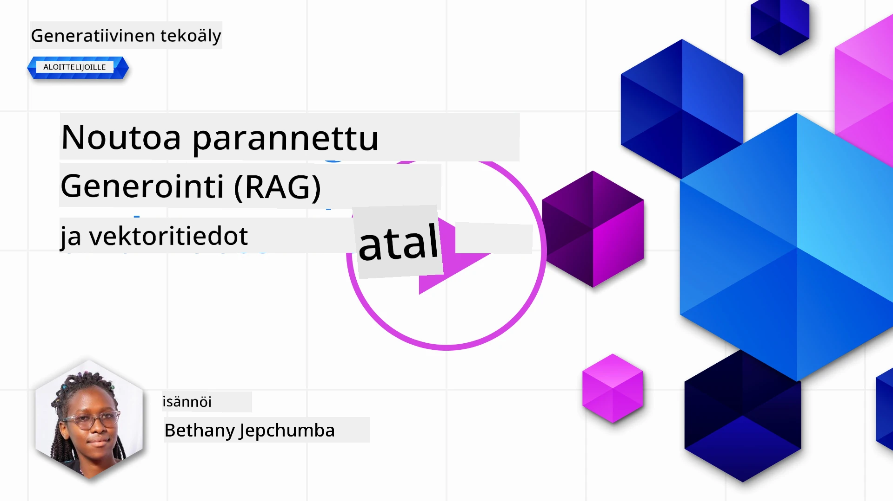
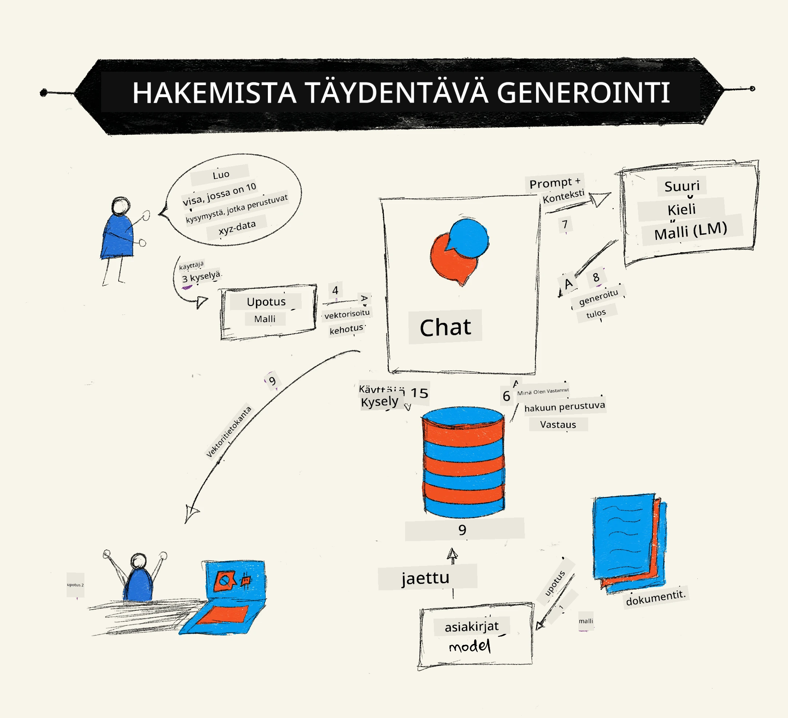
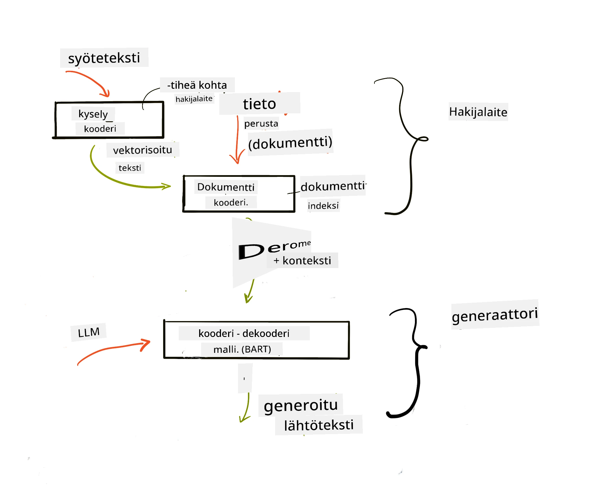

# Hakuavusteinen generointi (RAG) ja vektoritietokannat

[](https://youtu.be/4l8zhHUBeyI?si=BmvDmL1fnHtgQYkL)

Hakusovellusten oppitunnissa opimme lyhyesti, kuinka omat tietosi integroidaan suurten kielimallien (LLM) kanssa. Tässä oppitunnissa syvennymme enemmän konseptiin siitä, miten tieto perustetaan LLM-sovellukseen, prosessin mekaniikkaan sekä tallennusmenetelmiin, jotka sisältävät sekä upotukset että tekstin.

> **Video tulossa pian**

## Johdanto

Tässä oppitunnissa käsittelemme seuraavaa:

- Johdanto RAG:iin, mitä se on ja miksi sitä käytetään tekoälyssä (artificial intelligence).

- Ymmärrystä siitä, mitä vektoritietokannat ovat ja miten luoda sellainen sovellukseemme.

- Käytännön esimerkki siitä, kuinka RAG integroidaan sovellukseen.

## Oppimistavoitteet

Oppitunnin suorittamisen jälkeen osaat:

- Selittää RAG:n merkityksen tiedon haussa ja käsittelyssä.

- Määrittää RAG-sovellus ja perustaa tietosi LLM:ään.

- Tehokkaasti integroida RAG ja vektoritietokannat LLM-sovelluksissa.

## Tilanteemme: LLM-malliemme parantaminen omilla tiedoillamme

Tässä oppitunnissa haluamme lisätä omat muistiinpanomme koulutuksesta startupissa, mikä mahdollistaa chatbotin saavan lisää tietoa eri aiheista. Muistiinpanojen avulla oppijat voivat opiskella paremmin ja ymmärtää eri aiheita, mikä helpottaa kokeisiin valmistautumista. Luoamme tilanteen seuraavasti:

- `Azure OpenAI:` LLM, jota käytämme chatbotin luomiseen

- `AI for beginners' neural networks -opetus:` tieto, johon fundamenttaamme LLM:ämme

- `Azure AI Search` ja `Azure Cosmos DB:` vektoritietokanta tietojen tallentamiseen ja hakemisto hakemiseen

Käyttäjät voivat luoda harjoitustehtäviä muistiinpanoistaan, kertauskortteja sekä tiivistelmiä. Aloitetaan katsomalla, mitä RAG on ja miten se toimii:

## Hakuavusteinen generointi (RAG)

LLM-pohjainen chatbot käsittelee käyttäjän kehotteita luodakseen vastauksia. Se on suunniteltu olemaan vuorovaikutteinen ja keskustelee käyttäjän kanssa monista aiheista. Sen vastaukset kuitenkin rajoittuvat annettuun kontekstiin ja perustietokoulutusdataan. Esimerkiksi GPT-4 tietopäivitys päättyy syyskuuhun 2021, eli se ei tiedä tapahtumista tämän ajankohdan jälkeen. Lisäksi LLM:ien koulutuksessa ei käytetä luottamuksellisia tietoja kuten henkilökohtaisia muistiinpanoja tai yrityksen käyttöohjeita.

### Kuinka RAG (Hakuavusteinen generointi) toimii



Oletetaan, että haluat ottaa käyttöön chatbotin, joka luo kyselyitä muistiinpanoistasi, tarvitset yhteyden tietopohjaan. Tässä RAG tulee avuksi. RAG toimii seuraavasti:

- **Tietopohja:** Ennen hakua nämä asiakirjat täytyy syöttää ja esikäsitellä, tyypillisesti jakamalla suuret asiakirjat pienempiin osiin, muuntamalla ne tekstimuotoisiksi upotuksiksi ja tallentamalla tietokantaan.

- **Käyttäjän kysely:** käyttäjä esittää kysymyksen

- **Hakeminen:** Kun käyttäjä esittää kysymyksen, upotusmalli hakee asiaankuuluvat tiedot tietopohjastamme antaakseen lisää kontekstia, joka sisällytetään kehotteeseen.

- **Laajennettu generointi:** LLM parantaa vastaustaan haettujen tietojen perusteella. Tämä mahdollistaa sen, että vastaus ei perustu vain esikoulutettuun dataan, vaan myös lisättyyn kontekstiin. Haettua dataa käytetään LLM:n vastausten rikastamiseen. LLM palauttaa vastauksen käyttäjän kysymykseen.



RAG-arkkitehtuuri toteutetaan käyttämällä transformereita, jotka koostuvat kahdesta osasta: enkooderista ja dekooderista. Esimerkiksi kun käyttäjä esittää kysymyksen, syötetty teksti "enkoodataan" vektoreiksi jotka sieppaavat sanojen merkityksen, ja nämä vektorit "dekoodataan" dokumenttihakemistoon ja ne tuottavat uutta tekstiä käyttäjän kyselyn perusteella. LLM käyttää sekä enkooderi-dekooderimallia tuloksen luomiseen.

Kaksi lähestymistapaa RAG:n toteuttamiseen ehdotetun tutkimuspaperin mukaan: [Retrieval-Augmented Generation for Knowledge intensive NLP (natural language processing software) Tasks](https://arxiv.org/pdf/2005.11401.pdf?WT.mc_id=academic-105485-koreyst) ovat:

- **_RAG-Sequence_** käyttää haettuja dokumentteja ennustaakseen parhaan mahdollisen vastauksen käyttäjän kyselyyn

- **RAG-Token** käyttää dokumentteja seuraavan tokenin generointiin, sitten hakee ne uudelleen vastatakseen käyttäjän kyselyyn

### Miksi käyttää RAG-menetelmää?

- **Tietorikkaus:** varmistaa, että tekstivastaukset ovat ajan tasalla ja nykyisiä. Parantaa siten suorituskykyä domain-spesifeillä tehtävillä hyödyntämällä sisäistä tietopohjaa.

- Vähentää keksittyjen tietojen määrää käyttämällä **varmistettavaa dataa** tietopohjassa kontekstina käyttäjän kyselyihin.

- On **kustannustehokas**, koska se on edullisempaa kuin LLM:n hienosäätö.

## Tietopohjan luominen

Sovelluksemme perustuu henkilökohtaiseen dataamme eli AI for Beginners -kurssin Neuroverkot-osion tietoon.

### Vektoritietokannat

Vektoritietokanta on erikoistunut tietokanta, joka on suunniteltu tallentamaan, hallitsemaan ja hakemaan upotettuja vektoreita. Se tallentaa asiakirjojen numeeriset esitykset. Datan pilkkominen numeerisiksi upotuksiksi helpottaa tekoälyjärjestelmää ymmärtämään ja käsittelemään dataa.

Tallennamme upotukset vektoritietokantoihin, koska LLM:illä on rajoitus hyväksymiensä tokenien määrässä. Koska koko dataa ei voi syöttää kerralla, joudumme jakamaan sen osiin, ja kun käyttäjä esittää kysymyksen, vastaavia upotuksia palautetaan kehotteen kanssa. Osissa jakaminen myös pienentää kuluja tokenien määrän vähentymisen kautta.

Suosittuja vektoritietokantoja ovat esimerkiksi Azure Cosmos DB, Clarifyai, Pinecone, Chromadb, ScaNN, Qdrant ja DeepLake. Voit luoda Azure Cosmos DB -mallin Azure CLI:llä seuraavalla komennolla:

```bash
az login
az group create -n <resource-group-name> -l <location>
az cosmosdb create -n <cosmos-db-name> -r <resource-group-name>
az cosmosdb list-keys -n <cosmos-db-name> -g <resource-group-name>
```

### Tekstistä upotuksiin

Ennen datan tallennusta meidän täytyy muuntaa se vektorimuotoisiksi upotuksiksi. Jos käsittelet suuria asiakirjoja tai pitkiä tekstejä, voit jakaa ne osiin odotettavien kyselyjen mukaan. Jakaminen voi tapahtua lause- tai kappaletasolla. Koska osiin jako perustuu sanojen ympärillä olevaan merkitykseen, voit lisätä osaan myös muuta kontekstia, esimerkiksi lisätä asiakirjan otsikon tai tekstin ennen tai jälkeen osan. Voit jakaa datan seuraavasti:

```python
def split_text(text, max_length, min_length):
    words = text.split()
    chunks = []
    current_chunk = []

    for word in words:
        current_chunk.append(word)
        if len(' '.join(current_chunk)) < max_length and len(' '.join(current_chunk)) > min_length:
            chunks.append(' '.join(current_chunk))
            current_chunk = []

    # Jos viimeinen palanen ei saavuttanut minimipituutta, lisää se kuitenkin
    if current_chunk:
        chunks.append(' '.join(current_chunk))

    return chunks
```

Kun data on pilkottu, voimme upottaa tekstin eri upotusmalleja käyttäen. Mallit voivat olla esimerkiksi word2vec, OpenAI:n ada-002, Azure Computer Vision ja monet muut. Mallin valintaan vaikuttavat käytettävät kielet, koodattavan sisällön tyyppi (teksti/kuvat/audio), sisäänmenon koko ja upotuksen pituus.

Esimerkki tekstin upotuksesta OpenAI:n `text-embedding-ada-002` mallilla:


## Haku ja vektorihaku

Kun käyttäjä esittää kysymyksen, hakija muuntaa sen vektoriksi käyttäen kyselyn enkooderia, sitten etsii dokumenttihakemistostamme asiaankuuluvia vektoreita asiakirjoista, jotka liittyvät syötteeseen. Kun haku on tehty, se muuntaa sekä syötteen että dokumenttivektorit tekstiksi ja syöttää ne LLM:ään.

### Haku

Haku tapahtuu, kun järjestelmä yrittää löytää mahdollisimman nopeasti hakemiston asiakirjat, jotka täyttävät hakuehdot. Hakijan tavoitteena on saada asiakirjat, joita käytetään kontekstin tarjoamiseen ja LLM:n perustamiseen datallasi.

Hakua voidaan suorittaa useilla tavoilla tietokannassamme, kuten:

- **Avainsanahaku** – käytetään tekstihakuihin

- **Vektorihaku** – muuntaa asiakirjat tekstistä vektoriesityksiksi upotusmalleilla, mahdollistaen **semanttisen haun**, jossa haetaan sanojen merkityksen perusteella. Haku tehdään kyselyn kanssa lähimpien vektoriesitysten asiakirjoihin.

- **Hybridi** – yhdistelmä avainsana- ja vektorihakua.

Haasteena haussa on, jos tietokannasta ei löydy vastausta vastaavaa sisältöä, järjestelmä palauttaa parhaimman mahdollisen tiedon. Voit käyttää tekniikoita esim. asettamalla maksimietäisyyden relevanssille tai käyttäen hybridihakua, joka yhdistää avainsana- ja vektorihakuja. Tässä oppitunnissa käytämme hybridihakua. Tallennamme tietomme dataframeen, jonka sarakkeissa on sekä osat että upotukset.

### Vektoriläheisyys

Hakija etsii tietokannasta lähekkäisiä upotuksia eli lähimmän naapurin, koska ne ovat samankaltaisia tekstejä. Kun käyttäjä kysyy kysymyksen, se ensin upotetaan ja sitten etsitään samankaltaisia upotuksia. Yleinen mittaus samankaltaisuudelle on kosiniläheisyys, joka perustuu kahden vektorin väliseen kulmaan.

Voimme mitata samankaltaisuutta myös muilla tavoilla, kuten euklidisella etäisyydellä, joka mittaa suoraa viivaa vektoripäiden välillä, tai pistetulolla, joka mittaa kahden vektorin vastaavien alkioiden tulojen summan.

### Hakemisto

Hakua varten tarvitsemme hakemiston tietopohjallemme ennen haun suorittamista. Hakemisto tallentaa upotuksemme ja pystyy nopeasti hakemaan samankaltaisimmat osat, vaikka tietokanta olisi suuri. Voimme luoda hakemiston paikallisesti seuraavasti:

```python
from sklearn.neighbors import NearestNeighbors

embeddings = flattened_df['embeddings'].to_list()

# Luo hakemisto
nbrs = NearestNeighbors(n_neighbors=5, algorithm='ball_tree').fit(embeddings)

# Kyselyä varten voit käyttää kneighbors-metodia
distances, indices = nbrs.kneighbors(embeddings)
```

### Tulosten uudelleenjärjestely

Kun olet hakenut tietokannasta, saatat haluta järjestää tulokset relevanssin mukaan. Uudelleenjärjestely LLM käyttää koneoppimista parantaakseen hakutulosten relevanssia järjestämällä ne merkityksellisimmästä vähiten merkitykselliseen. Azure AI Search suorittaa uudelleenjärjestelyn automaattisesti semanttisen uudelleenjärjestäjän avulla. Esimerkki uudelleenjärjestelystä lähimpien naapureiden avulla:

```python
# Etsi eniten samankaltaiset asiakirjat
distances, indices = nbrs.kneighbors([query_vector])

index = []
# Tulosta eniten samankaltaiset asiakirjat
for i in range(3):
    index = indices[0][i]
    for index in indices[0]:
        print(flattened_df['chunks'].iloc[index])
        print(flattened_df['path'].iloc[index])
        print(flattened_df['distances'].iloc[index])
    else:
        print(f"Index {index} not found in DataFrame")
```

## Kaiken yhdistäminen

Viimeinen vaihe on lisätä LLM mukaan, jotta saamme vastauksia, jotka perustuvat dataamme. Toteutus voi olla seuraava:

```python
user_input = "what is a perceptron?"

def chatbot(user_input):
    # Muunna kysymys kyselyvektoriksi
    query_vector = create_embeddings(user_input)

    # Etsi samankaltaisimmat dokumentit
    distances, indices = nbrs.kneighbors([query_vector])

    # lisää dokumentteja kyselyyn kontekstin tarjoamiseksi
    history = []
    for index in indices[0]:
        history.append(flattened_df['chunks'].iloc[index])

    # yhdistä historia ja käyttäjän syöte
    history.append(user_input)

    # luo viestiobjekti
    messages=[
        {"role": "system", "content": "You are an AI assistant that helps with AI questions."},
        {"role": "user", "content": "\n\n".join(history) }
    ]

    # käytä Responses API:ta vastauksen luomiseen
    response = client.responses.create(
        model="gpt-5-mini",
        max_output_tokens=800,
        input=messages,
        store=False,
    )

    return response.output_text

chatbot(user_input)
```

## Sovelluksen arviointi

### Arviointimittarit

- Vastauksien laatu: varmistetaan, että se kuulostaa luonnolliselta, sujuvalta ja ihmismäiseltä

- Dataperustaisuus: arvioidaan vastausten perustuvan toimitettuihin asiakirjoihin

- Relevanssi: arvioidaan vastausten vastaavan ja liittyvän esitettyyn kysymykseen

- Sujuvuus: arvioidaan, onko vastaus kieliopillisesti järkevä

## RAG:n ja vektoritietokantojen käyttötilanteet

Monet eri käyttötapaukset hyödyntävät toimintokutsuja parantaakseen sovellusta, kuten:

- Kysymys- ja vastausjärjestelmät: yrityksen datan perustaminen chat-keskusteluun, jota työntekijät voivat käyttää kysymyksiin.

- Suositusjärjestelmät: joissa luodaan järjestelmä, joka löytää samankaltaisimmat arvot esimerkiksi elokuville, ravintoloille ja muille.

- Chatbot-palvelut: voit tallentaa keskusteluhistorian ja personoida keskustelua käyttäjädatan perusteella.

- Kuvahaku vektoriupotusten perusteella, hyödyllistä kuvantunnistuksessa ja poikkeavuuksien havaitsemisessa.

## Yhteenveto

Olemme käsitelleet RAG:n perusalueet datan lisäämisestä sovellukseen, käyttäjän kyselyn ja tuottamisen. RAG:n luomisen helpottamiseksi voit käyttää kehyksiä kuten Semantic Kernel, LangChain tai Autogen.

## Tehtävä

Jatka oppimista Hakuavusteisesta generoinnista (RAG) rakentamalla:

- Luo käyttöliittymä sovellukselle valitsemallasi kehys

- Hyödynnä kehystä, joko LangChainia tai Semantic Kernelia, ja rakenna sovelluksesi uudelleen.

Onnittelut oppitunnin suorittamisesta 👏.

## Oppiminen ei lopu tähän, jatka matkaa

Oppitunnin jälkeen tutustu [Generative AI Learning -kokoelmaamme](https://aka.ms/genai-collection?WT.mc_id=academic-105485-koreyst) syventääksesi generatiivisen tekoälyn osaamistasi!

---

<!-- CO-OP TRANSLATOR DISCLAIMER START -->
**Vastuuvapauslauseke**:
Tämä asiakirja on käännetty käyttämällä tekoälypohjaista käännöspalvelua [Co-op Translator](https://github.com/Azure/co-op-translator). Vaikka pyrimme tarkkuuteen, otathan huomioon, että automaattiset käännökset saattavat sisältää virheitä tai epätarkkuuksia. Alkuperäinen asiakirja sen alkuperäiskielellä on virallinen lähde. Tärkeissä asioissa suositellaan ammattimaista ihmiskäännöstä. Emme ole vastuussa tämän käännöksen käytöstä aiheutuvista väärinymmärryksistä tai tulkinnoista.
<!-- CO-OP TRANSLATOR DISCLAIMER END -->