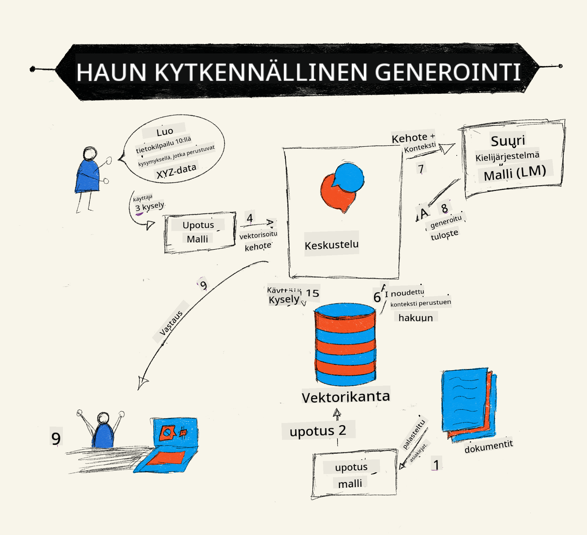
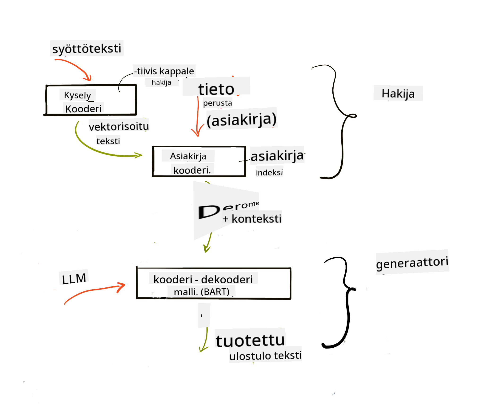
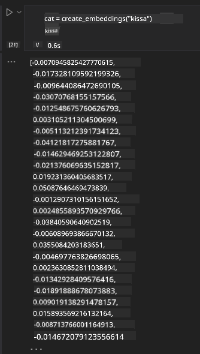

<!--
CO_OP_TRANSLATOR_METADATA:
{
  "original_hash": "e2861bbca91c0567ef32bc77fe054f9e",
  "translation_date": "2025-06-25T22:36:50+00:00",
  "source_file": "15-rag-and-vector-databases/README.md",
  "language_code": "fi"
}
-->
# Hakujen laajentaminen generoinnilla (RAG) ja vektoritietokannat

[](https://aka.ms/gen-ai-lesson15-gh?WT.mc_id=academic-105485-koreyst)

Hakusovellusten oppitunnilla opimme lyhyesti, miten integroida oma data Suuriin Kielenmalleihin (LLM). Tässä oppitunnissa syvennymme tarkemmin siihen, miten maadoittaa data LLM-sovelluksessa, prosessin mekanismeihin ja datan tallennusmenetelmiin, mukaan lukien sekä upotukset että teksti.

> **Video tulossa pian**

## Johdanto

Tässä oppitunnissa käsittelemme seuraavia aiheita:

- Johdatus RAG:iin, mitä se on ja miksi sitä käytetään tekoälyssä.

- Ymmärrämme, mitä vektoritietokannat ovat ja luomme sellaisen sovellukseemme.

- Käytännön esimerkki siitä, miten RAG integroidaan sovellukseen.

## Oppimistavoitteet

Oppitunnin suoritettuasi osaat:

- Selittää RAG:n merkityksen tiedonhakuun ja -käsittelyyn.

- Asentaa RAG-sovelluksen ja maadoittaa datasi LLM:ään.

- Tehokkaasti integroida RAG ja vektoritietokannat LLM-sovelluksiin.

## Skenaariomme: Parannamme LLM:iä omalla datallamme

Tällä oppitunnilla haluamme lisätä omat muistiinpanomme koulutusalustaan, mikä mahdollistaa chatbotin saavan enemmän tietoa eri aiheista. Muistiinpanojen avulla oppijat voivat opiskella paremmin ja ymmärtää eri aiheita, mikä helpottaa kokeisiin valmistautumista. Skenaarion luomiseksi käytämme:

- `Azure OpenAI:` LLM, jota käytämme chatbotin luomiseen

- `AI for beginners' lesson on Neural Networks`: tämä on data, johon maadoitamme LLM:mme

- `Azure AI Search` ja `Azure Cosmos DB:` vektoritietokanta datan tallentamiseen ja hakemiston luomiseen

Käyttäjät voivat luoda harjoituskokeita muistiinpanoistaan, kertaustaulukoita ja tiivistää ne ytimekkäiksi katsauksiksi. Aloitetaan katsomalla, mitä RAG on ja miten se toimii:

## Hakujen laajentaminen generoinnilla (RAG)

LLM-pohjainen chatbot käsittelee käyttäjän kehotteita tuottaakseen vastauksia. Se on suunniteltu olemaan vuorovaikutteinen ja keskustelemaan käyttäjien kanssa laajasta aihevalikoimasta. Sen vastaukset ovat kuitenkin rajallisia annettuun kontekstiin ja sen perustavan koulutusaineiston tietoon. Esimerkiksi GPT-4:n tietopiste on syyskuussa 2021, mikä tarkoittaa, että se ei tunne tämän jälkeen tapahtuneita asioita. Lisäksi LLM:ien koulutuksessa käytetty data ei sisällä luottamuksellisia tietoja, kuten henkilökohtaisia muistiinpanoja tai yrityksen tuotekäsikirjaa.

### Miten RAG:t toimivat



Oletetaan, että haluat ottaa käyttöön chatbotin, joka luo kyselyjä muistiinpanoistasi, tarvitset yhteyden tietokantaan. Tässä RAG tulee apuun. RAG:t toimivat seuraavasti:

- **Tietokanta:** Ennen hakua nämä dokumentit on sisällytettävä ja esikäsiteltävä, yleensä pilkkomalla suuret dokumentit pienemmiksi osiksi, muuntamalla ne tekstin upotuksiksi ja tallentamalla ne tietokantaan.

- **Käyttäjän kysely:** käyttäjä esittää kysymyksen

- **Haku:** Kun käyttäjä esittää kysymyksen, upotusmalli hakee asiaankuuluvat tiedot tietokannastamme tarjotakseen enemmän kontekstia, joka sisällytetään kehotteeseen.

- **Laajennettu generointi:** LLM parantaa vastaustaan haetun datan perusteella. Tämä mahdollistaa sen, että tuotettu vastaus perustuu paitsi etukäteen koulutettuun dataan myös lisäkontekstista saatavaan asiaankuuluvaan tietoon. Haettu data käytetään laajentamaan LLM:n vastauksia. LLM palauttaa sitten vastauksen käyttäjän kysymykseen.



RAG:n arkkitehtuuri toteutetaan transformereilla, jotka koostuvat kahdesta osasta: kooderista ja dekooderista. Esimerkiksi kun käyttäjä esittää kysymyksen, syöttöteksti 'koodataan' vektoreiksi, jotka vangitsevat sanojen merkityksen, ja vektorit 'dekoodataan' dokumentti-indeksiimme ja luovat uutta tekstiä käyttäjän kyselyn perusteella. LLM käyttää sekä kooderi-dekooderi-mallia tuottaakseen tuloksen.

Kaksi lähestymistapaa RAG:n toteuttamiseen ehdotetun paperin mukaan: [Retrieval-Augmented Generation for Knowledge intensive NLP Tasks](https://arxiv.org/pdf/2005.11401.pdf?WT.mc_id=academic-105485-koreyst) ovat:

- **_RAG-Sequence_** käyttää haettuja dokumentteja ennustamaan paras mahdollinen vastaus käyttäjän kyselyyn

- **RAG-Token** käyttää dokumentteja seuraavan tokenin generointiin ja hakee ne sitten vastaamaan käyttäjän kyselyyn

### Miksi käyttäisit RAG:ta?

- **Tietorikkaus:** varmistaa, että tekstivastaukset ovat ajan tasalla ja ajankohtaisia. Se parantaa suorituskykyä alakohtaisissa tehtävissä pääsemällä sisäiseen tietokantaan.

- Vähentää sepittämistä käyttämällä **todennettavaa dataa** tietokannassa tarjotakseen kontekstia käyttäjän kyselyihin.

- Se on **kustannustehokas**, koska ne ovat taloudellisempia verrattuna LLM:n hienosäätöön.

## Tietokannan luominen

Sovelluksemme perustuu omaan dataamme, eli AI For Beginners -opetussuunnitelman neuroverkko-opetukseen.

### Vektoritietokannat

Vektoritietokanta, toisin kuin perinteiset tietokannat, on erikoistunut tietokanta, joka on suunniteltu tallentamaan, hallitsemaan ja hakemaan upotettuja vektoreita. Se tallentaa dokumenttien numeeriset esitykset. Datan pilkkominen numeerisiksi upotuksiksi helpottaa tekoälyjärjestelmämme datan ymmärtämistä ja käsittelyä.

Tallennamme upotuksemme vektoritietokantoihin, koska LLM:illä on rajoitus syötteenä hyväksyttyjen tokenien määrässä. Koska et voi välittää koko upotuksia LLM:lle, meidän on pilkottava ne osiin, ja kun käyttäjä esittää kysymyksen, upotukset, jotka ovat eniten kysymyksen kaltaisia, palautetaan yhdessä kehotteen kanssa. Pilkkominen vähentää myös kustannuksia LLM:n läpi kulkevien tokenien määrässä.

Joihinkin suosittuihin vektoritietokantoihin kuuluvat Azure Cosmos DB, Clarifyai, Pinecone, Chromadb, ScaNN, Qdrant ja DeepLake. Voit luoda Azure Cosmos DB -mallin käyttämällä Azure CLI:tä seuraavalla komennolla:

```bash
az login
az group create -n <resource-group-name> -l <location>
az cosmosdb create -n <cosmos-db-name> -r <resource-group-name>
az cosmosdb list-keys -n <cosmos-db-name> -g <resource-group-name>
```

### Tekstistä upotuksiin

Ennen kuin tallennamme datamme, meidän on muunnettava se vektoriupotuksiksi ennen sen tallentamista tietokantaan. Jos työskentelet suurten dokumenttien tai pitkien tekstien kanssa, voit pilkkoa ne odottamiesi kyselyjen perusteella. Pilkkominen voidaan tehdä lause- tai kappaletasolla. Koska pilkkominen johtaa merkityksiä niiden ympärillä olevista sanoista, voit lisätä muuta kontekstia pilkkuun, esimerkiksi lisäämällä dokumentin otsikon tai sisällyttämällä tekstiä ennen tai jälkeen pilkun. Voit pilkkoa datan seuraavasti:

```python
def split_text(text, max_length, min_length):
    words = text.split()
    chunks = []
    current_chunk = []

    for word in words:
        current_chunk.append(word)
        if len(' '.join(current_chunk)) < max_length and len(' '.join(current_chunk)) > min_length:
            chunks.append(' '.join(current_chunk))
            current_chunk = []

    # If the last chunk didn't reach the minimum length, add it anyway
    if current_chunk:
        chunks.append(' '.join(current_chunk))

    return chunks
```

Kun se on pilkottu, voimme sitten upottaa tekstimme käyttämällä eri upotusmalleja. Joitakin malleja, joita voit käyttää, ovat: word2vec, ada-002 OpenAI:sta, Azure Computer Vision ja paljon muuta. Mallin valinta riippuu käyttämistäsi kielistä, koodatun sisällön tyypistä (teksti/kuvat/ääni), sen syötteen koosta, jonka se voi koodata, ja upotuksen pituudesta.

Esimerkki upotetusta tekstistä käyttämällä OpenAI:n `text-embedding-ada-002` mallia on:


## Haku ja vektorihaku

Kun käyttäjä esittää kysymyksen, hakija muuntaa sen vektoriksi käyttämällä kyselykooderia, ja se etsii dokumentti-indeksistämme asiaankuuluvia vektoreita, jotka liittyvät syötteeseen. Kun se on valmis, se muuntaa sekä syöte- että dokumenttivektorit tekstiksi ja välittää ne LLM:n läpi.

### Haku

Haku tapahtuu, kun järjestelmä yrittää nopeasti löytää indeksistä dokumentteja, jotka täyttävät hakukriteerit. Hakijan tavoitteena on saada dokumentteja, joita käytetään tarjoamaan kontekstia ja maadoittamaan LLM datallasi.

On useita tapoja suorittaa haku tietokannassamme, kuten:

- **Avainsanahaku** - käytetään tekstihakuun

- **Semanttinen haku** - käyttää sanojen semanttista merkitystä

- **Vektorihaku** - muuntaa dokumentit tekstistä vektoriesityksiksi käyttämällä upotusmalleja. Haku suoritetaan kyselemällä dokumentteja, joiden vektoriesitykset ovat lähimpänä käyttäjän kysymystä.

- **Hybridihaku** - yhdistelmä sekä avainsana- että vektorihakua.

Haun haasteena on, kun kyselyyn ei ole samanlaista vastausta tietokannassa, järjestelmä palauttaa parhaan mahdollisen tiedon, mutta voit käyttää taktiikoita, kuten asettaa suurin etäisyys relevanssille tai käyttää hybridihakua, joka yhdistää sekä avainsana- että vektorihakua. Tässä oppitunnissa käytämme hybridihakua, yhdistelmää sekä vektori- että avainsanahausta. Tallennamme datamme datafreimiin, jossa on sarakkeita, jotka sisältävät pilkut ja upotukset.

### Vektorien samankaltaisuus

Hakija etsii tietokantatietokannasta upotuksia, jotka ovat lähellä toisiaan, lähintä naapuria, koska ne ovat samanlaisia tekstejä. Kun käyttäjä esittää kyselyn, se upotetaan ensin ja sitten sovitetaan samanlaisiin upotuksiin. Yleinen mittari, jota käytetään selvittämään, kuinka samanlaisia eri vektorit ovat, on kosininen samankaltaisuus, joka perustuu kahden vektorin väliseen kulmaan.

Voimme mitata samankaltaisuutta käyttämällä muita vaihtoehtoja, joita voimme käyttää, ovat euklidinen etäisyys, joka on suora viiva vektorien päätepisteiden välillä, ja pistetulo, joka mittaa kahden vektorin vastaavien elementtien tulojen summaa.

### Hakemisto

Kun teemme hakua, meidän on rakennettava hakemisto tietokannallemme ennen kuin suoritamme haun. Hakemisto tallentaa upotuksemme ja voi nopeasti hakea samanlaisimmat palat jopa suuressa tietokannassa. Voimme luoda hakemiston paikallisesti käyttämällä:

```python
from sklearn.neighbors import NearestNeighbors

embeddings = flattened_df['embeddings'].to_list()

# Create the search index
nbrs = NearestNeighbors(n_neighbors=5, algorithm='ball_tree').fit(embeddings)

# To query the index, you can use the kneighbors method
distances, indices = nbrs.kneighbors(embeddings)
```

### Uudelleenjärjestely

Kun olet hakenut tietokannasta, saatat joutua lajittelemaan tulokset relevanssin mukaan. Uudelleenjärjestely LLM hyödyntää koneoppimista parantaakseen hakutulosten relevanssia järjestämällä ne relevanssin mukaan. Azure AI Searchissa uudelleenjärjestely tehdään automaattisesti puolestasi käyttämällä semanttista uudelleenjärjestelijää. Esimerkki siitä, miten uudelleenjärjestely toimii lähimpien naapureiden avulla:

```python
# Find the most similar documents
distances, indices = nbrs.kneighbors([query_vector])

index = []
# Print the most similar documents
for i in range(3):
    index = indices[0][i]
    for index in indices[0]:
        print(flattened_df['chunks'].iloc[index])
        print(flattened_df['path'].iloc[index])
        print(flattened_df['distances'].iloc[index])
    else:
        print(f"Index {index} not found in DataFrame")
```

## Kaiken yhdistäminen

Viimeinen vaihe on lisätä LLM sekoitukseen, jotta voimme saada vastauksia, jotka ovat maadoitettuja dataamme. Voimme toteuttaa sen seuraavasti:

```python
user_input = "what is a perceptron?"

def chatbot(user_input):
    # Convert the question to a query vector
    query_vector = create_embeddings(user_input)

    # Find the most similar documents
    distances, indices = nbrs.kneighbors([query_vector])

    # add documents to query  to provide context
    history = []
    for index in indices[0]:
        history.append(flattened_df['chunks'].iloc[index])

    # combine the history and the user input
    history.append(user_input)

    # create a message object
    messages=[
        {"role": "system", "content": "You are an AI assistant that helps with AI questions."},
        {"role": "user", "content": history[-1]}
    ]

    # use chat completion to generate a response
    response = openai.chat.completions.create(
        model="gpt-4",
        temperature=0.7,
        max_tokens=800,
        messages=messages
    )

    return response.choices[0].message

chatbot(user_input)
```

## Sovelluksemme arviointi

### Arviointimittarit

- Toimitettujen vastausten laatu varmistaen, että se kuulostaa luonnolliselta, sujuvalta ja inhimilliseltä

- Datan maadoittuneisuus: arvioidaan, tuliko vastaus toimitetuista dokumenteista

- Relevanssi: arvioidaan, vastaako vastaus kysymystä ja liittyykö se siihen

- Sujuvuus - arvioidaan, onko vastaus kieliopillisesti järkevä

## RAG:n (Hakujen laajentaminen generoinnilla) ja vektoritietokantojen käyttötapaukset

On monia eri käyttötapauksia, joissa toimintokutsut voivat parantaa sovellustasi, kuten:

- Kysymykset ja vastaukset: maadoittamalla yrityksesi data keskusteluun, jota työntekijät voivat käyttää kysymyksiin.

- Suositusjärjestelmät: jossa voit luoda järjestelmän, joka vastaa eniten samanlaisia arvoja, kuten elokuvia, ravintoloita ja paljon muuta.

- Chatbot-palvelut: voit tallentaa keskusteluhistorian ja personoida keskustelun käyttäjän datan perusteella.

- Kuvahaku vektoriupotusten perusteella, hyödyllinen kuvatunnistuksessa ja poikkeavuuksien havaitsemisessa.

## Yhteenveto

Olemme käsitelleet RAG:n keskeisiä alueita datan lisäämisestä sovellukseen, käyttäjän kyselyyn ja tulokseen. RAG:n luomisen yksinkertaistamiseksi voit käyttää kehyksiä, kuten Semanti Kernel, Langchain tai Autogen.

## Tehtävä

Jatkaaksesi oppimistasi Hakujen laajentamisesta generoinnilla (RAG), voit rakentaa:

- Rakenna sovellukselle käyttöliittymä valitsemallasi kehysellä

- Hyödynnä kehystä, joko LangChainia tai Semantic Kernelia, ja luo sovelluksesi uudelleen.

Onnittelut oppitunnin suorittamisesta 👏.

## Oppiminen ei lopu tähän, jatka matkaasi

Oppitunnin suorittamisen jälkeen tutustu [Generative AI Learning collection](https://aka.ms/genai-collection?WT.mc_id=academic-105485-koreyst) -kokoelmaamme jatkaaksesi Generatiivisen tekoälyn tietojesi kehittämistä!

**Vastuuvapauslauseke**:  
Tämä asiakirja on käännetty käyttämällä tekoälypohjaista käännöspalvelua [Co-op Translator](https://github.com/Azure/co-op-translator). Pyrimme tarkkuuteen, mutta huomioithan, että automaattiset käännökset voivat sisältää virheitä tai epätarkkuuksia. Alkuperäistä asiakirjaa sen alkuperäisellä kielellä tulee pitää auktoritatiivisena lähteenä. Kriittisen tiedon kohdalla suositellaan ammattimaista ihmiskääntämistä. Emme ole vastuussa mahdollisista väärinkäsityksistä tai virhetulkinnoista, jotka johtuvat tämän käännöksen käytöstä.