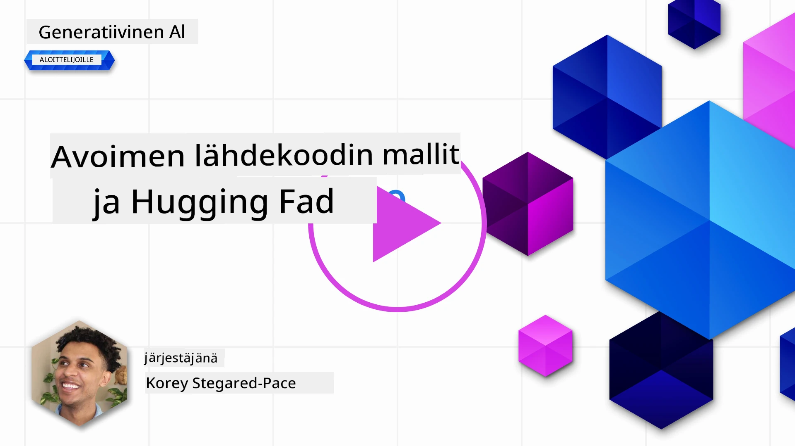
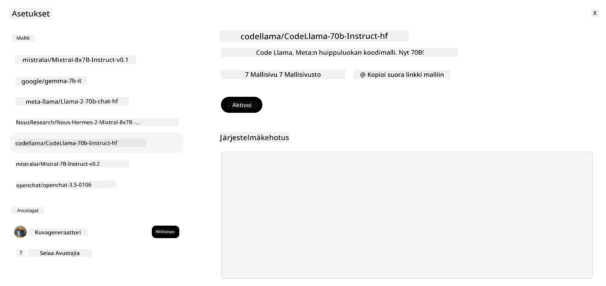

## Johdanto

Avoimen lähdekoodin LLM-mallit ovat jännittävä ja jatkuvasti kehittyvä maailma. Tämä oppitunti pyrkii tarjoamaan syvällisen katsauksen avoimen lähdekoodin malleihin. Jos etsit tietoa siitä, miten omistusoikeudelliset mallit vertautuvat avoimen lähdekoodin malleihin, siirry kohtaan ["Exploring and Comparing Different LLMs" -oppitunti](../02-exploring-and-comparing-different-llms/README.md?WT.mc_id=academic-105485-koreyst). Tämä oppitunti käsittelee myös hienosäätöä, mutta yksityiskohtaisemman selityksen löydät ["Fine-Tuning LLMs" -oppitunnista](../18-fine-tuning/README.md?WT.mc_id=academic-105485-koreyst).

## Oppimistavoitteet

- Ymmärtää avoimen lähdekoodin mallit
- Ymmärtää avoimen lähdekoodin mallien käytön edut
- Tutustua Hugging Facen ja Azure AI Studion avoimiin malleihin

## Mitä ovat avoimen lähdekoodin mallit?

Avoimen lähdekoodin ohjelmistot ovat olleet ratkaisevassa roolissa teknologian kasvussa eri aloilla. Open Source Initiative (OSI) on määritellyt [10 kriteeriä ohjelmistolle](https://web.archive.org/web/20241126001143/https://opensource.org/osd?WT.mc_id=academic-105485-koreyst), jotta se voidaan luokitella avoimeksi lähdekoodiksi. Lähdekoodin on oltava avoimesti jaettuna OSI:n hyväksymän lisenssin alaisena.

Vaikka LLM-mallien kehitys sisältää samankaltaisia elementtejä kuin ohjelmistokehitys, prosessi ei ole täysin sama. Tämä on herättänyt paljon keskustelua yhteisössä siitä, mitä avoin lähdekoodi tarkoittaa LLM-mallien yhteydessä. Jotta malli vastaisi perinteistä avoimen lähdekoodin määritelmää, seuraavien tietojen tulisi olla julkisesti saatavilla:

- Mallin koulutuksessa käytetyt aineistot.
- Koko mallin painot osana koulutusta.
- Arviointikoodi.
- Hienosäätökoodi.
- Koko mallin painot ja koulutusmittarit.

Tällä hetkellä vain muutama malli täyttää nämä kriteerit. [Allen Institute for Artificial Intelligence (AllenAI) luoma OLMo-malli](https://huggingface.co/allenai/OLMo-7B?WT.mc_id=academic-105485-koreyst) on yksi, joka kuuluu tähän kategoriaan.

Tässä oppitunnissa viittaamme malleihin jatkossa nimellä "avoimet mallit", koska ne eivät välttämättä täytä yllä mainittuja kriteerejä kirjoitushetkellä.

## Avoimien mallien edut

**Erittäin muokattavissa** – Koska avoimet mallit julkaistaan yksityiskohtaisen koulutustiedon kanssa, tutkijat ja kehittäjät voivat muokata mallin sisäisiä osia. Tämä mahdollistaa erittäin erikoistuneiden mallien luomisen, jotka on hienosäädetty tiettyyn tehtävään tai tutkimusalueeseen. Esimerkkejä tästä ovat koodin generointi, matemaattiset operaatiot ja biologia.

**Kustannukset** – Näiden mallien käyttö- ja käyttöönottohinta per token on alhaisempi kuin omistusoikeudellisten mallien. Generatiivisia tekoälysovelluksia rakennettaessa on tärkeää tarkastella suorituskyvyn ja hinnan suhdetta näiden mallien käytössä omassa käyttötapauksessa.

Lähde: Artificial Analysis

**Joustavuus** – Avoimien mallien kanssa työskentely mahdollistaa joustavuuden eri mallien käytössä tai niiden yhdistämisessä. Esimerkkinä tästä on [HuggingChat Assistants](https://huggingface.co/chat?WT.mc_id=academic-105485-koreyst), jossa käyttäjä voi valita käytettävän mallin suoraan käyttöliittymästä:

## Tutustuminen eri avoimiin malleihin

### Llama 2

[LLama2](https://huggingface.co/meta-llama?WT.mc_id=academic-105485-koreyst), jonka on kehittänyt Meta, on avoin malli, joka on optimoitu keskustelupohjaisiin sovelluksiin. Tämä johtuu sen hienosäätömenetelmästä, joka sisälsi suuren määrän dialogia ja ihmispalautetta. Tämän menetelmän avulla malli tuottaa enemmän ihmisen odotuksia vastaavia tuloksia, mikä parantaa käyttökokemusta.

Esimerkkejä Llaman hienosäädetyistä versioista ovat [Japanese Llama](https://huggingface.co/elyza/ELYZA-japanese-Llama-2-7b?WT.mc_id=academic-105485-koreyst), joka on erikoistunut japanin kieleen, ja [Llama Pro](https://huggingface.co/TencentARC/LLaMA-Pro-8B?WT.mc_id=academic-105485-koreyst), joka on paranneltu versio perusmallista.

### Mistral

[Mistral](https://huggingface.co/mistralai?WT.mc_id=academic-105485-koreyst) on avoin malli, joka keskittyy vahvasti suorituskykyyn ja tehokkuuteen. Se käyttää Mixture-of-Experts -lähestymistapaa, joka yhdistää joukon erikoistuneita asiantuntijamalleja yhdeksi järjestelmäksi, jossa syötteen mukaan valitaan tietyt mallit käytettäväksi. Tämä tekee laskennasta tehokkaampaa, koska mallit käsittelevät vain niitä syötteitä, joihin ne ovat erikoistuneet.

Esimerkkejä Mistralin hienosäädetyistä versioista ovat [BioMistral](https://huggingface.co/BioMistral/BioMistral-7B?text=Mon+nom+est+Thomas+et+mon+principal?WT.mc_id=academic-105485-koreyst), joka keskittyy lääketieteelliseen alaan, ja [OpenMath Mistral](https://huggingface.co/nvidia/OpenMath-Mistral-7B-v0.1-hf?WT.mc_id=academic-105485-koreyst), joka suorittaa matemaattisia laskutoimituksia.

### Falcon

[Falcon](https://huggingface.co/tiiuae?WT.mc_id=academic-105485-koreyst) on Technology Innovation Institute (**TII**) -instituutin luoma LLM. Falcon-40B on koulutettu 40 miljardilla parametrilla, ja sen on osoitettu suoriutuvan paremmin kuin GPT-3 pienemmällä laskentabudjetilla. Tämä johtuu FlashAttention-algoritmin ja multiquery-attentionin käytöstä, jotka vähentävät muistin tarvetta päättelyvaiheessa. Lyhentyneen päättelyajan ansiosta Falcon-40B soveltuu hyvin keskustelusovelluksiin.

Esimerkkejä Falconin hienosäädetyistä versioista ovat [OpenAssistant](https://huggingface.co/OpenAssistant/falcon-40b-sft-top1-560?WT.mc_id=academic-105485-koreyst), avoimiin malleihin perustuva avustaja, ja [GPT4ALL](https://huggingface.co/nomic-ai/gpt4all-falcon?WT.mc_id=academic-105485-koreyst), joka tarjoaa paremman suorituskyvyn kuin perusmalli.

## Miten valita

Avoimen mallin valintaan ei ole yhtä oikeaa vastausta. Hyvä lähtökohta on käyttää Azure AI Studion tehtäväkohtaisia suodattimia. Tämä auttaa ymmärtämään, millaisiin tehtäviin malli on koulutettu. Hugging Face ylläpitää myös LLM-johtotaulukkoa, joka näyttää parhaiten suoriutuvat mallit tiettyjen mittareiden perusteella.

Kun haluat vertailla LLM-malleja eri tyypeissä, [Artificial Analysis](https://artificialanalysis.ai/?WT.mc_id=academic-105485-koreyst) on toinen erinomainen resurssi:

Lähde: Artificial Analysis

Jos työskentelet tietyn käyttötapauksen parissa, saman alan hienosäädettyjen versioiden etsiminen voi olla tehokasta. Useiden avoimien mallien kokeileminen ja niiden suorituskyvyn arvioiminen omien ja käyttäjiesi odotusten mukaan on myös hyvä käytäntö.

## Seuraavat askeleet

Parasta avoimissa malleissa on, että niiden kanssa pääsee nopeasti alkuun. Tutustu [Azure AI Foundry Model Catalogiin](https://ai.azure.com?WT.mc_id=academic-105485-koreyst), joka sisältää erityisen Hugging Face -kokoelman näistä malleista, joista keskustelimme tässä.

## Oppiminen ei lopu tähän, jatka matkaa

Oppitunnin suorittamisen jälkeen tutustu [Generative AI Learning -kokoelmaamme](https://aka.ms/genai-collection?WT.mc_id=academic-105485-koreyst) jatkaaksesi generatiivisen tekoälyn osaamisesi kehittämistä!

---

<!-- CO-OP TRANSLATOR DISCLAIMER START -->
**Vastuuvapauslauseke**:
Tämä asiakirja on käännetty käyttämällä tekoälypohjaista käännöspalvelua [Co-op Translator](https://github.com/Azure/co-op-translator). Vaikka pyrimme tarkkuuteen, otathan huomioon, että automaattikäännöksissä saattaa esiintyä virheitä tai epätarkkuuksia. Alkuperäistä asiakirjaa sen alkuperäiskielellä tulee pitää virallisena lähteenä. Tärkeissä asioissa suositellaan ammattimaista ihmiskäännöstä. Emme ole vastuussa tämän käännöksen käytöstä aiheutuvista väärinymmärryksistä tai tulkinnoista.
<!-- CO-OP TRANSLATOR DISCLAIMER END -->