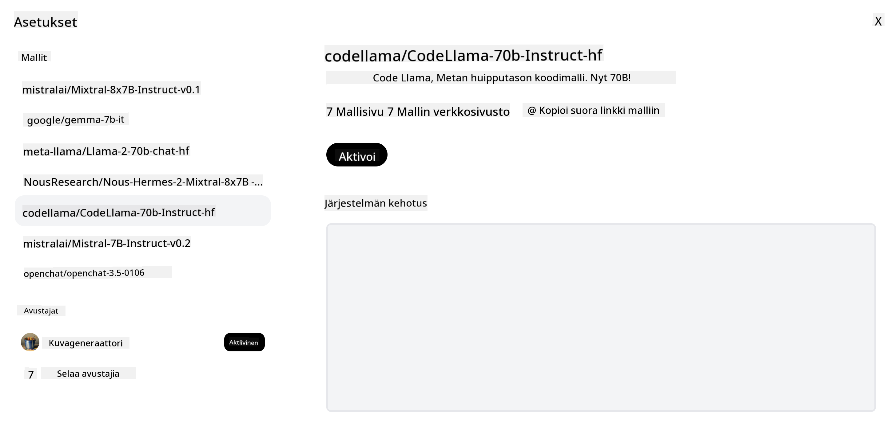
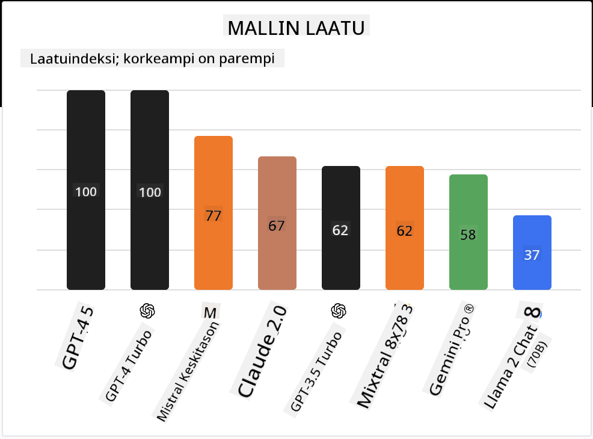

<!--
CO_OP_TRANSLATOR_METADATA:
{
  "original_hash": "0bba96e53ab841d99db731892a51fab8",
  "translation_date": "2025-07-09T17:11:32+00:00",
  "source_file": "16-open-source-models/README.md",
  "language_code": "fi"
}
-->

## Johdanto

Avoimen lähdekoodin LLM-mallit ovat jännittävä ja jatkuvasti kehittyvä ala. Tässä oppitunnissa perehdytään syvällisesti avoimen lähdekoodin malleihin. Jos etsit tietoa siitä, miten suljetut mallit vertautuvat avoimiin malleihin, siirry oppitunnille ["Exploring and Comparing Different LLMs"](../02-exploring-and-comparing-different-llms/README.md?WT.mc_id=academic-105485-koreyst). Tässä oppitunnissa käsitellään myös hienosäätöä, mutta tarkempi selitys löytyy oppitunnista ["Fine-Tuning LLMs"](../18-fine-tuning/README.md?WT.mc_id=academic-105485-koreyst).

## Oppimistavoitteet

- Ymmärtää avoimen lähdekoodin mallit
- Ymmärtää avoimen lähdekoodin mallien käytön hyödyt
- Tutustua Hugging Facen ja Azure AI Studion avoimiin malleihin

## Mitä ovat avoimen lähdekoodin mallit?

Avoimen lähdekoodin ohjelmistot ovat olleet keskeisessä roolissa teknologian kehityksessä monilla aloilla. Open Source Initiative (OSI) on määritellyt [10 kriteeriä ohjelmistoille](https://web.archive.org/web/20241126001143/https://opensource.org/osd?WT.mc_id=academic-105485-koreyst), jotta ne voidaan luokitella avoimen lähdekoodin ohjelmistoiksi. Lähdekoodin tulee olla avoimesti jaettuna OSI:n hyväksymän lisenssin alaisena.

Vaikka LLM-mallien kehitys muistuttaa ohjelmistokehitystä, prosessi ei ole täysin sama. Tämä on herättänyt keskustelua yhteisössä siitä, mitä avoimuus tarkoittaa LLM-mallien yhteydessä. Perinteisen avoimen lähdekoodin määritelmän mukaisesti mallin tulisi sisältää julkisesti saatavilla seuraavat tiedot:

- Mallin koulutuksessa käytetyt aineistot.
- Koko mallin painot koulutuksen osana.
- Arviointikoodi.
- Hienosäätökoodi.
- Koko mallin painot ja koulutusmittarit.

Tällä hetkellä vain harvat mallit täyttävät nämä kriteerit. Yksi tällainen on [Allen Institute for Artificial Intelligence (AllenAI) luoma OLMo-malli](https://huggingface.co/allenai/OLMo-7B?WT.mc_id=academic-105485-koreyst).

Tässä oppitunnissa viittaamme malleihin jatkossa nimellä "avoimet mallit", sillä ne eivät välttämättä täytä yllä mainittuja kriteerejä kirjoitushetkellä.

## Avoimien mallien hyödyt

**Erittäin muokattavissa** – Koska avoimet mallit julkaistaan yksityiskohtaisen koulutustiedon kanssa, tutkijat ja kehittäjät voivat muokata mallin sisäisiä osia. Tämä mahdollistaa erittäin erikoistuneiden mallien luomisen, jotka on hienosäädetty tiettyyn tehtävään tai tutkimusalueeseen. Esimerkkejä tästä ovat koodin generointi, matemaattiset laskutoimitukset ja biologia.

**Kustannukset** – Näiden mallien käyttö- ja käyttöönottohinta per token on alhaisempi kuin suljetuilla malleilla. Generatiivisia tekoälysovelluksia rakennettaessa kannattaa arvioida suorituskyvyn ja hinnan suhdetta omassa käyttötapauksessa.

  
Lähde: Artificial Analysis

**Joustavuus** – Avoimien mallien kanssa työskentely mahdollistaa joustavuuden eri mallien käytössä tai niiden yhdistämisessä. Esimerkkinä tästä ovat [HuggingChat Assistants](https://huggingface.co/chat?WT.mc_id=academic-105485-koreyst), joissa käyttäjä voi valita käytettävän mallin suoraan käyttöliittymästä:

## Tutustuminen eri avoimiin malleihin

### Llama 2

[LLama2](https://huggingface.co/meta-llama?WT.mc_id=academic-105485-koreyst), jonka on kehittänyt Meta, on avoin malli, joka on optimoitu keskustelupohjaisiin sovelluksiin. Tämä johtuu sen hienosäätömenetelmästä, johon sisältyi suuri määrä dialogia ja ihmispalautetta. Tämän ansiosta malli tuottaa tuloksia, jotka vastaavat paremmin ihmisten odotuksia ja tarjoavat paremman käyttökokemuksen.

Esimerkkejä Llama-mallin hienosäädetyistä versioista ovat [Japanese Llama](https://huggingface.co/elyza/ELYZA-japanese-Llama-2-7b?WT.mc_id=academic-105485-koreyst), joka on erikoistunut japanin kieleen, sekä [Llama Pro](https://huggingface.co/TencentARC/LLaMA-Pro-8B?WT.mc_id=academic-105485-koreyst), joka on paranneltu versio perusmallista.

### Mistral

[Mistral](https://huggingface.co/mistralai?WT.mc_id=academic-105485-koreyst) on avoin malli, joka keskittyy vahvasti suorituskykyyn ja tehokkuuteen. Se käyttää Mixture-of-Experts -lähestymistapaa, jossa joukko erikoistuneita asiantuntijamalleja yhdistetään yhdeksi järjestelmäksi. Syötteen mukaan valitaan tietyt mallit käytettäväksi, mikä tekee laskennasta tehokkaampaa, koska mallit käsittelevät vain niille erikoistuneita syötteitä.

Esimerkkejä Mistralin hienosäädetyistä versioista ovat [BioMistral](https://huggingface.co/BioMistral/BioMistral-7B?text=Mon+nom+est+Thomas+et+mon+principal?WT.mc_id=academic-105485-koreyst), joka keskittyy lääketieteelliseen alaan, sekä [OpenMath Mistral](https://huggingface.co/nvidia/OpenMath-Mistral-7B-v0.1-hf?WT.mc_id=academic-105485-koreyst), joka suorittaa matemaattisia laskutoimituksia.

### Falcon

[Falcon](https://huggingface.co/tiiuae?WT.mc_id=academic-105485-koreyst) on Technology Innovation Instituten (**TII**) luoma LLM. Falcon-40B on koulutettu 40 miljardilla parametrilla, ja sen on osoitettu suoriutuvan paremmin kuin GPT-3 pienemmällä laskentateholla. Tämä johtuu FlashAttention-algoritmin ja multiquery-attention -menetelmän käytöstä, jotka vähentävät muistin tarvetta mallin suoritusvaiheessa. Lyhentyneen suoritusajan ansiosta Falcon-40B sopii hyvin keskustelusovelluksiin.

Esimerkkejä Falconin hienosäädetyistä versioista ovat [OpenAssistant](https://huggingface.co/OpenAssistant/falcon-40b-sft-top1-560?WT.mc_id=academic-105485-koreyst), avoimiin malleihin perustuva avustaja, sekä [GPT4ALL](https://huggingface.co/nomic-ai/gpt4all-falcon?WT.mc_id=academic-105485-koreyst), joka tarjoaa paremman suorituskyvyn kuin perusmalli.

## Miten valita

Avoimen mallin valintaan ei ole yhtä oikeaa vastausta. Hyvä lähtökohta on käyttää Azure AI Studion tehtäväkohtaisia suodattimia, jotka auttavat ymmärtämään, mihin tehtäviin malli on koulutettu. Hugging Face ylläpitää myös LLM Leaderboardia, joka näyttää parhaiten suoriutuvat mallit eri mittareiden perusteella.

Kun vertailet LLM-malleja eri tyypeissä, [Artificial Analysis](https://artificialanalysis.ai/?WT.mc_id=academic-105485-koreyst) on myös erinomainen resurssi:

  
Lähde: Artificial Analysis

Jos työskentelet tietyn käyttötapauksen parissa, voi olla tehokasta etsiä hienosäädettyjä versioita, jotka on suunnattu samaan aihealueeseen. Useamman avoimen mallin kokeileminen oman ja käyttäjiesi odotusten mukaan on myös hyvä käytäntö.

## Seuraavat askeleet

Avoimien mallien parissa pääsee parhaiten alkuun nopeasti. Tutustu [Azure AI Studio Model Catalogiin](https://ai.azure.com?WT.mc_id=academic-105485-koreyst), joka sisältää erityisen Hugging Face -kokoelman näistä malleista, joista keskustelimme tässä oppitunnissa.

## Oppiminen ei lopu tähän, jatka matkaa

Oppitunnin jälkeen tutustu [Generative AI Learning -kokoelmaamme](https://aka.ms/genai-collection?WT.mc_id=academic-105485-koreyst) ja jatka Generatiivisen tekoälyn osaamisesi kehittämistä!

**Vastuuvapauslauseke**:  
Tämä asiakirja on käännetty käyttämällä tekoälypohjaista käännöspalvelua [Co-op Translator](https://github.com/Azure/co-op-translator). Vaikka pyrimme tarkkuuteen, huomioithan, että automaattikäännöksissä saattaa esiintyä virheitä tai epätarkkuuksia. Alkuperäistä asiakirjaa sen alkuperäiskielellä tulee pitää virallisena lähteenä. Tärkeissä tiedoissa suositellaan ammattimaista ihmiskäännöstä. Emme ole vastuussa tämän käännöksen käytöstä aiheutuvista väärinymmärryksistä tai tulkinnoista.