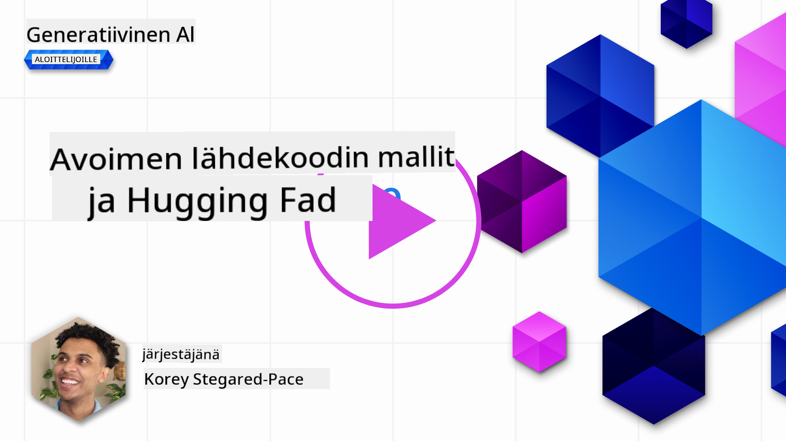
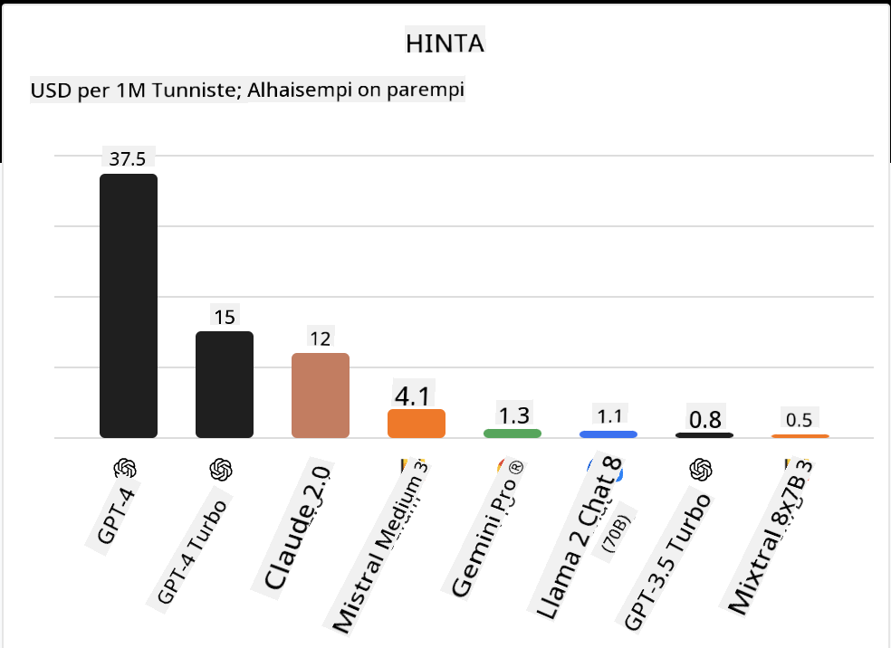

<!--
CO_OP_TRANSLATOR_METADATA:
{
  "original_hash": "0bba96e53ab841d99db731892a51fab8",
  "translation_date": "2025-05-20T06:58:12+00:00",
  "source_file": "16-open-source-models/README.md",
  "language_code": "fi"
}
-->

## Johdanto

Avoimen lähdekoodin LLM-maailma on jännittävä ja jatkuvasti kehittyvä. Tämän oppitunnin tavoitteena on tarjota syvällinen katsaus avoimen lähdekoodin malleihin. Jos etsit tietoa siitä, miten omat mallit vertautuvat avoimen lähdekoodin malleihin, siirry oppituntiin ["Erilaisten LLM-mallien tutkiminen ja vertailu"](../02-exploring-and-comparing-different-llms/README.md?WT.mc_id=academic-105485-koreyst). Tämä oppitunti käsittelee myös hienosäätöä, mutta tarkempi selitys löytyy oppitunnista ["LLM-mallien hienosäätö"](../18-fine-tuning/README.md?WT.mc_id=academic-105485-koreyst).

## Oppimistavoitteet

- Ymmärtää avoimen lähdekoodin mallit
- Ymmärtää avoimen lähdekoodin mallien kanssa työskentelyn hyödyt
- Tutkia Hugging Facen ja Azure AI Studion avoimia malleja

## Mitä ovat avoimen lähdekoodin mallit?

Avoimen lähdekoodin ohjelmistoilla on ollut keskeinen rooli teknologian kasvussa eri aloilla. Open Source Initiative (OSI) on määritellyt [10 kriteeriä ohjelmistolle](https://web.archive.org/web/20241126001143/https://opensource.org/osd?WT.mc_id=academic-105485-koreyst), jotta se voidaan luokitella avoimeksi lähdekoodiksi. Lähdekoodin on oltava avoimesti jaettu OSI:n hyväksymän lisenssin alla.

Vaikka LLM-mallien kehittäminen sisältää samankaltaisia elementtejä kuin ohjelmistojen kehittäminen, prosessi ei ole täysin sama. Tämä on herättänyt paljon keskustelua yhteisössä avoimen lähdekoodin määritelmästä LLM-mallien kontekstissa. Jotta malli vastaisi perinteistä avoimen lähdekoodin määritelmää, seuraavat tiedot tulisi olla julkisesti saatavilla:

- Datalähteet, joita käytetään mallin kouluttamiseen.
- Täydet mallin painot osana koulutusta.
- Arviointikoodi.
- Hienosäätökoodi.
- Täydet mallin painot ja koulutusmetriikat.

Tällä hetkellä vain muutama malli täyttää nämä kriteerit. [OLMo-malli, jonka on luonut Allen Institute for Artificial Intelligence (AllenAI)](https://huggingface.co/allenai/OLMo-7B?WT.mc_id=academic-105485-koreyst) kuuluu tähän kategoriaan.

Tässä oppitunnissa viittaamme malleihin "avoimina malleina", koska ne eivät välttämättä täytä yllä olevia kriteerejä kirjoitushetkellä.

## Avoimien mallien hyödyt

**Erittäin muokattavissa** - Koska avoimet mallit julkaistaan yksityiskohtaisten koulutustietojen kanssa, tutkijat ja kehittäjät voivat muokata mallin sisäistä rakennetta. Tämä mahdollistaa erittäin erikoistuneiden mallien luomisen, jotka on hienosäädetty tiettyyn tehtävään tai tutkimusalueeseen. Joitakin esimerkkejä tästä ovat koodin generointi, matemaattiset operaatiot ja biologia.

**Kustannukset** - Näiden mallien käyttö- ja käyttöönottohinta per token on alhaisempi kuin omien mallien. Generatiivisten AI-sovellusten rakentamisessa kannattaa tarkastella suorituskykyä suhteessa hintaan näiden mallien kanssa työskentelyn yhteydessä.

 Lähde: Artificial Analysis

**Joustavuus** - Avoimien mallien kanssa työskentely mahdollistaa joustavuuden eri mallien käyttämisessä tai niiden yhdistämisessä. Esimerkkinä tästä on [HuggingChat Assistants](https://huggingface.co/chat?WT.mc_id=academic-105485-koreyst), jossa käyttäjä voi valita käytettävän mallin suoraan käyttöliittymässä:

## Erilaisten avointen mallien tutkiminen

### Llama 2

[LLama2](https://huggingface.co/meta-llama?WT.mc_id=academic-105485-koreyst), jonka on kehittänyt Meta, on avoin malli, joka on optimoitu keskustelupohjaisiin sovelluksiin. Tämä johtuu sen hienosäätömenetelmästä, joka sisälsi suuren määrän dialogia ja ihmisten palautetta. Tämän menetelmän avulla malli tuottaa enemmän tuloksia, jotka vastaavat ihmisten odotuksia, mikä tarjoaa paremman käyttäjäkokemuksen.

Joitakin hienosäädettyjä versioita Llama-mallista ovat [Japanese Llama](https://huggingface.co/elyza/ELYZA-japanese-Llama-2-7b?WT.mc_id=academic-105485-koreyst), joka erikoistuu japaninkieleen ja [Llama Pro](https://huggingface.co/TencentARC/LLaMA-Pro-8B?WT.mc_id=academic-105485-koreyst), joka on parannettu versio perusmallista.

### Mistral

[Mistral](https://huggingface.co/mistralai?WT.mc_id=academic-105485-koreyst) on avoin malli, joka keskittyy korkeaan suorituskykyyn ja tehokkuuteen. Se käyttää asiantuntijamallien yhdistelmää, joka yhdistää joukon erikoistuneita asiantuntijamalleja yhdeksi järjestelmäksi, jossa tiettyjen syötteiden perusteella valitaan käytettävät mallit. Tämä tekee laskennasta tehokkaampaa, koska mallit käsittelevät vain niitä syötteitä, joihin ne ovat erikoistuneet.

Joitakin hienosäädettyjä versioita Mistral-mallista ovat [BioMistral](https://huggingface.co/BioMistral/BioMistral-7B?text=Mon+nom+est+Thomas+et+mon+principal?WT.mc_id=academic-105485-koreyst), joka keskittyy lääketieteelliseen alaan ja [OpenMath Mistral](https://huggingface.co/nvidia/OpenMath-Mistral-7B-v0.1-hf?WT.mc_id=academic-105485-koreyst), joka suorittaa matemaattista laskentaa.

### Falcon

[Falcon](https://huggingface.co/tiiuae?WT.mc_id=academic-105485-koreyst) on LLM, jonka on luonut Technology Innovation Institute (**TII**). Falcon-40B koulutettiin 40 miljardilla parametrilla, mikä on osoittautunut paremmaksi kuin GPT-3 pienemmällä laskentabudjetilla. Tämä johtuu sen käyttämästä FlashAttention-algoritmista ja monikyselyhuomiosta, jotka mahdollistavat muistivaatimusten vähentämisen inferenssiaikana. Tämän vähentyneen inferenssiajan ansiosta Falcon-40B soveltuu keskustelusovelluksiin.

Joitakin hienosäädettyjä versioita Falcon-mallista ovat [OpenAssistant](https://huggingface.co/OpenAssistant/falcon-40b-sft-top1-560?WT.mc_id=academic-105485-koreyst), avointen mallien avulla rakennettu assistentti ja [GPT4ALL](https://huggingface.co/nomic-ai/gpt4all-falcon?WT.mc_id=academic-105485-koreyst), joka tarjoaa korkeampaa suorituskykyä kuin perusmalli.

## Miten valita

Avoimen mallin valintaan ei ole yhtä oikeaa vastausta. Hyvä paikka aloittaa on käyttää Azure AI Studion suodatusominaisuutta tehtävän mukaan. Tämä auttaa ymmärtämään, millaisiin tehtäviin malli on koulutettu. Hugging Face ylläpitää myös LLM Leaderboardia, joka näyttää parhaiten suoriutuvat mallit tiettyjen mittareiden perusteella.

Kun halutaan verrata LLM-malleja eri tyyppien välillä, [Artificial Analysis](https://artificialanalysis.ai/?WT.mc_id=academic-105485-koreyst) on toinen erinomainen resurssi:

 Lähde: Artificial Analysis

Jos työskentelet tietyn käyttötapauksen parissa, hienosäädettyjen versioiden etsiminen, jotka keskittyvät samaan alueeseen, voi olla tehokasta. Useiden avointen mallien kokeileminen ja niiden suorituskyvyn tarkastelu omien ja käyttäjiesi odotusten mukaan on myös hyvä käytäntö.

## Seuraavat askeleet

Avoimien mallien paras puoli on, että voit aloittaa niiden parissa työskentelyn melko nopeasti. Tutustu [Azure AI Studion mallikatalogiin](https://ai.azure.com?WT.mc_id=academic-105485-koreyst), joka sisältää erityisen Hugging Face -kokoelman näistä malleista, joita käsittelimme täällä.

## Oppiminen ei lopu tähän, jatka matkaasi

Kun olet suorittanut tämän oppitunnin, tutustu [Generative AI Learning -kokoelmaamme](https://aka.ms/genai-collection?WT.mc_id=academic-105485-koreyst) jatkaaksesi Generative AI -tietämyksesi kehittämistä!

**Vastuuvapauslauseke**:  
Tämä asiakirja on käännetty käyttäen tekoälypohjaista käännöspalvelua [Co-op Translator](https://github.com/Azure/co-op-translator). Vaikka pyrimme tarkkuuteen, huomioithan, että automaattiset käännökset voivat sisältää virheitä tai epätarkkuuksia. Alkuperäistä asiakirjaa sen alkuperäisellä kielellä tulisi pitää auktoritatiivisena lähteenä. Kriittisen tiedon osalta suositellaan ammattimaista ihmiskäännöstä. Emme ole vastuussa tämän käännöksen käytöstä johtuvista väärinkäsityksistä tai virhetulkinnoista.