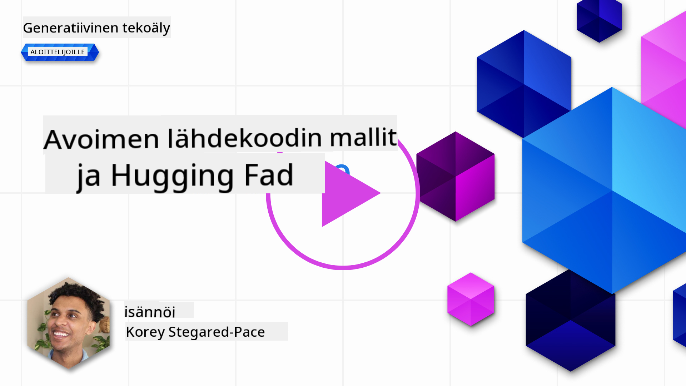
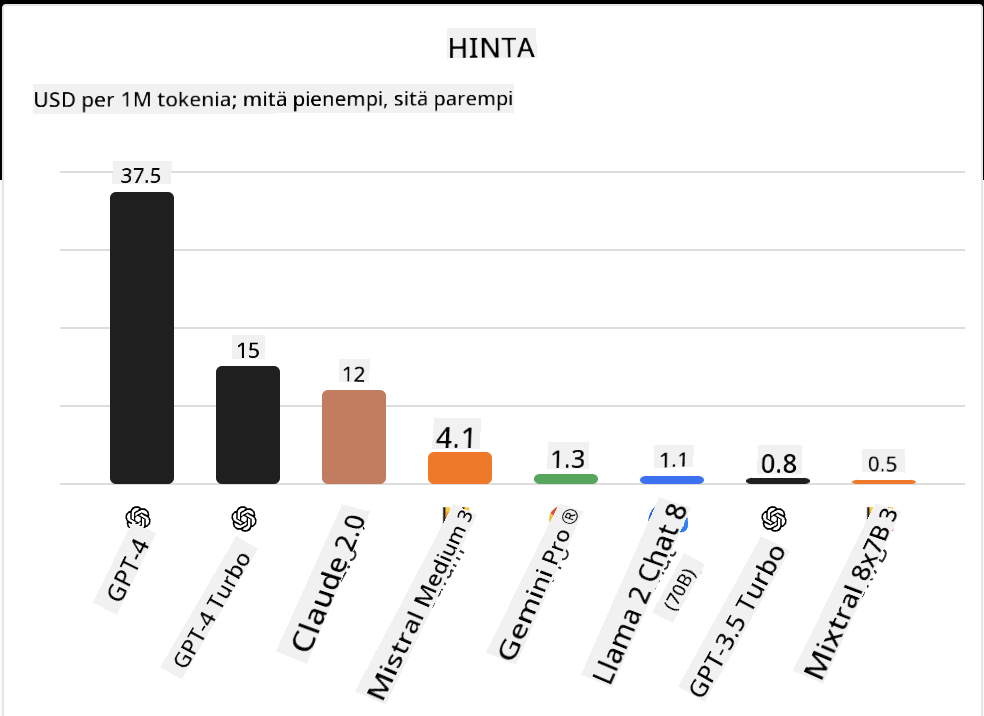
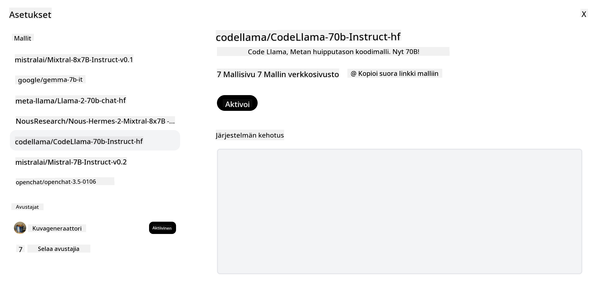
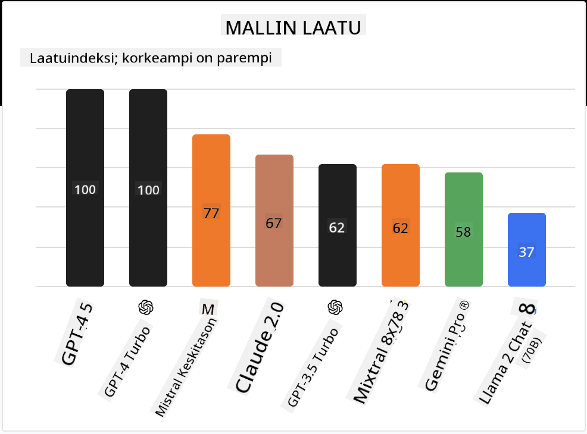

<!--
CO_OP_TRANSLATOR_METADATA:
{
  "original_hash": "0bba96e53ab841d99db731892a51fab8",
  "translation_date": "2025-06-25T23:58:52+00:00",
  "source_file": "16-open-source-models/README.md",
  "language_code": "fi"
}
-->

## Johdanto

Avoimen lähdekoodin LLM-maailma on jännittävä ja jatkuvasti kehittyvä. Tämän oppitunnin tavoitteena on tarjota syvällinen katsaus avoimen lähdekoodin malleihin. Jos etsit tietoa siitä, miten omat mallit vertautuvat avoimen lähdekoodin malleihin, siirry oppituntiin ["Tutkiminen ja erilaisten LLM-mallien vertailu"](../02-exploring-and-comparing-different-llms/README.md?WT.mc_id=academic-105485-koreyst). Tämä oppitunti käsittelee myös hienosäätöä, mutta tarkempi selitys löytyy oppitunnista ["LLM-mallien hienosäätö"](../18-fine-tuning/README.md?WT.mc_id=academic-105485-koreyst).

## Oppimistavoitteet

- Ymmärtää avoimen lähdekoodin mallien perusteet
- Ymmärtää avoimen lähdekoodin mallien käytön edut
- Tutkia Hugging Facen ja Azure AI Studion avoimia malleja

## Mitä ovat avoimen lähdekoodin mallit?

Avoimen lähdekoodin ohjelmistoilla on ollut keskeinen rooli teknologian kasvussa eri aloilla. Open Source Initiative (OSI) on määritellyt [10 kriteeriä ohjelmistolle](https://web.archive.org/web/20241126001143/https://opensource.org/osd?WT.mc_id=academic-105485-koreyst) luokiteltavaksi avoimeksi lähdekoodiksi. Lähdekoodin tulee olla avoimesti jaettu OSI:n hyväksymän lisenssin alaisuudessa.

Vaikka LLM-mallien kehittäminen sisältää samanlaisia elementtejä kuin ohjelmistojen kehittäminen, prosessi ei ole täysin sama. Tämä on herättänyt paljon keskustelua yhteisössä avoimen lähdekoodin määritelmästä LLM-mallien yhteydessä. Jotta malli vastaisi perinteistä avoimen lähdekoodin määritelmää, seuraavat tiedot tulisi olla julkisesti saatavilla:

- Datalähteet, joita käytetään mallin koulutukseen.
- Täydet mallin painot osana koulutusta.
- Arviointikoodi.
- Hienosäätökoodi.
- Täydet mallin painot ja koulutusmetriikat.

Tällä hetkellä on vain muutama malli, jotka täyttävät nämä kriteerit. [OLMo-malli, jonka on luonut Allen Institute for Artificial Intelligence (AllenAI)](https://huggingface.co/allenai/OLMo-7B?WT.mc_id=academic-105485-koreyst) kuuluu tähän kategoriaan.

Tässä oppitunnissa viittaamme malleihin "avoimina malleina" eteenpäin, koska ne eivät välttämättä vastaa yllä olevia kriteerejä kirjoitushetkellä.

## Avoimien mallien edut

**Erittäin muokattavissa** - Koska avoimet mallit julkaistaan yksityiskohtaisilla koulutustiedoilla, tutkijat ja kehittäjät voivat muokata mallin sisäisiä toimintoja. Tämä mahdollistaa erittäin erikoistuneiden mallien luomisen, jotka on hienosäädetty tiettyä tehtävää tai tutkimusaluetta varten. Joitakin esimerkkejä tästä ovat koodin generointi, matemaattiset toiminnot ja biologia.

**Kustannukset** - Näiden mallien käyttö ja käyttöönotto maksaa vähemmän kuin omien mallien. Generatiivisten AI-sovellusten rakentamisessa kannattaa tarkastella suorituskykyä vs. hinta, kun työskennellään näiden mallien kanssa omassa käyttötapauksessa.

Lähde: Artificial Analysis

**Joustavuus** - Työskentely avoimien mallien kanssa mahdollistaa joustavuuden eri mallien käyttämisessä tai yhdistämisessä. Esimerkki tästä on [HuggingChat Assistants](https://huggingface.co/chat?WT.mc_id=academic-105485-koreyst), jossa käyttäjä voi valita käytettävän mallin suoraan käyttöliittymässä:

## Erilaisten avoimien mallien tutkiminen

### Llama 2

[LLama2](https://huggingface.co/meta-llama?WT.mc_id=academic-105485-koreyst), jonka on kehittänyt Meta, on avoin malli, joka on optimoitu keskustelupohjaisiin sovelluksiin. Tämä johtuu sen hienosäätömenetelmästä, joka sisälsi suuren määrän dialogia ja ihmisten palautetta. Tämän menetelmän avulla malli tuottaa enemmän tuloksia, jotka vastaavat ihmisten odotuksia, mikä tarjoaa paremman käyttäjäkokemuksen.

Joitakin hienosäädettyjä versioita Llamasta ovat [Japanese Llama](https://huggingface.co/elyza/ELYZA-japanese-Llama-2-7b?WT.mc_id=academic-105485-koreyst), joka on erikoistunut japanin kieleen, ja [Llama Pro](https://huggingface.co/TencentARC/LLaMA-Pro-8B?WT.mc_id=academic-105485-koreyst), joka on parannettu versio perusmallista.

### Mistral

[Mistral](https://huggingface.co/mistralai?WT.mc_id=academic-105485-koreyst) on avoin malli, joka keskittyy korkeaan suorituskykyyn ja tehokkuuteen. Se käyttää Mixture-of-Experts-lähestymistapaa, joka yhdistää ryhmän erikoistuneita asiantuntijamalleja yhdeksi järjestelmäksi, jossa syötteen perusteella tietyt mallit valitaan käytettäväksi. Tämä tekee laskennasta tehokkaampaa, koska mallit käsittelevät vain niitä syötteitä, joihin ne ovat erikoistuneet.

Joitakin hienosäädettyjä versioita Mistralista ovat [BioMistral](https://huggingface.co/BioMistral/BioMistral-7B?text=Mon+nom+est+Thomas+et+mon+principal?WT.mc_id=academic-105485-koreyst), joka keskittyy lääketieteen alaan, ja [OpenMath Mistral](https://huggingface.co/nvidia/OpenMath-Mistral-7B-v0.1-hf?WT.mc_id=academic-105485-koreyst), joka suorittaa matemaattisia laskelmia.

### Falcon

[Falcon](https://huggingface.co/tiiuae?WT.mc_id=academic-105485-koreyst) on LLM, jonka on luonut Technology Innovation Institute (**TII**). Falcon-40B on koulutettu 40 miljardilla parametreilla, ja sen on osoitettu toimivan paremmin kuin GPT-3 pienemmällä laskentabudjetilla. Tämä johtuu sen käyttämästä FlashAttention-algoritmista ja multiquery-attentionista, jotka mahdollistavat muistin vaatimusten vähentämisen inferenssiaikana. Tämän lyhentyneen inferenssiajan ansiosta Falcon-40B soveltuu keskustelusovelluksiin.

Joitakin hienosäädettyjä versioita Falconista ovat [OpenAssistant](https://huggingface.co/OpenAssistant/falcon-40b-sft-top1-560?WT.mc_id=academic-105485-koreyst), avoimiin malleihin perustuva avustaja, ja [GPT4ALL](https://huggingface.co/nomic-ai/gpt4all-falcon?WT.mc_id=academic-105485-koreyst), joka tarjoaa paremman suorituskyvyn kuin perusmalli.

## Kuinka valita

Avoimen mallin valintaan ei ole yhtä oikeaa vastausta. Hyvä paikka aloittaa on käyttää Azure AI Studion tehtäväkohtaisia suodatusominaisuuksia. Tämä auttaa ymmärtämään, minkä tyyppisiin tehtäviin malli on koulutettu. Hugging Face ylläpitää myös LLM Leaderboardia, joka näyttää parhaiten suoriutuvat mallit tiettyjen mittareiden perusteella.

Kun halutaan verrata LLM-malleja eri tyypeissä, [Artificial Analysis](https://artificialanalysis.ai/?WT.mc_id=academic-105485-koreyst) on toinen loistava resurssi:

Lähde: Artificial Analysis

Jos työskentelet tietyn käyttötapauksen parissa, saman alueen hienosäädettyjen versioiden etsiminen voi olla tehokasta. Useiden avoimien mallien kokeileminen nähdäksesi, miten ne suoriutuvat omien ja käyttäjiesi odotusten mukaan, on toinen hyvä käytäntö.

## Seuraavat askeleet

Parasta avoimissa malleissa on se, että voit aloittaa niiden kanssa työskentelyn melko nopeasti. Tutustu [Azure AI Studion mallikatalogiin](https://ai.azure.com?WT.mc_id=academic-105485-koreyst), joka sisältää erityisen Hugging Face -kokoelman, jossa on tässä käsiteltyjä malleja.

## Oppiminen ei lopu tähän, jatka matkaa

Tämän oppitunnin suorittamisen jälkeen tutustu [Generatiivisen AI:n oppimiskokoelmaan](https://aka.ms/genai-collection?WT.mc_id=academic-105485-koreyst) jatkaaksesi generatiivisen AI:n osaamisen kehittämistä!

**Vastuuvapauslauseke**:  
Tämä asiakirja on käännetty käyttämällä AI-käännöspalvelua [Co-op Translator](https://github.com/Azure/co-op-translator). Vaikka pyrimme tarkkuuteen, huomaa, että automaattiset käännökset voivat sisältää virheitä tai epätarkkuuksia. Alkuperäistä asiakirjaa sen alkuperäisellä kielellä tulisi pitää auktoriteettisena lähteenä. Kriittisen tiedon osalta suositellaan ammattimaista ihmiskäännöstä. Emme ole vastuussa tämän käännöksen käytöstä aiheutuvista väärinkäsityksistä tai väärintulkinnoista.