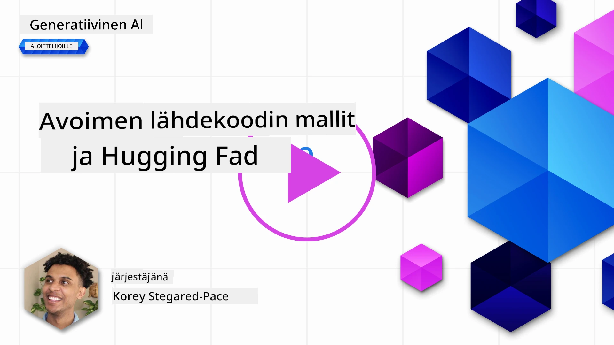
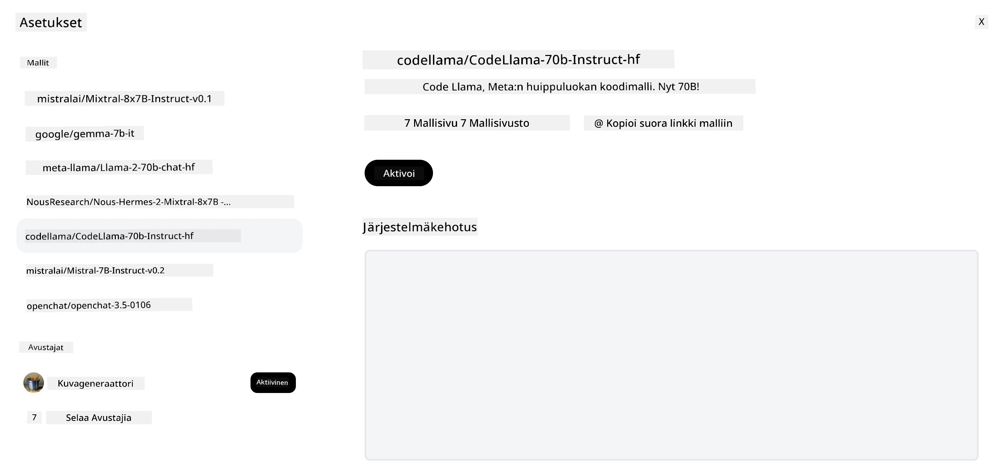

## Johdanto

Avoimen lähdekoodin LLM-mallit ovat jännittävä ja jatkuvasti kehittyvä maailma. Tämän oppitunnin tavoitteena on tarjota syvällinen katsaus avoimen lähdekoodin malleihin. Jos etsit tietoa siitä, miten omistautuneet mallit vertautuvat avoimen lähdekoodin malleihin, siirry oppitunnille ["Eri LLM-mallien tutkiminen ja vertailu"](../02-exploring-and-comparing-different-llms/README.md?WT.mc_id=academic-105485-koreyst). Tämä oppitunti käsittelee myös hienosäätöä, mutta tarkempi selitys löytyy oppitunnilta ["LLM-mallien hienosäätö"](../18-fine-tuning/README.md?WT.mc_id=academic-105485-koreyst).

## Oppimistavoitteet

- Saada ymmärrys avoimen lähdekoodin malleista
- Ymmärtää avoimen lähdekoodin mallien käytön hyödyt
- Tutustua Hugging Face:n ja Microsoft Foundryn mallikatalogin avoimiin malleihin

## Mitä ovat avoimen lähdekoodin mallit?

Avoimen lähdekoodin ohjelmistoilla on ollut keskeinen rooli teknologian kasvussa eri aloilla. Open Source Initiative (OSI) on määritellyt [10 kriteeriä ohjelmistolle](https://web.archive.org/web/20241126001143/https://opensource.org/osd?WT.mc_id=academic-105485-koreyst), jotta sitä voidaan luokitella avoimeksi lähdekoodiksi. Lähdekoodi tulee jakaa avoimesti OSI:n hyväksymän lisenssin alaisena.

Vaikka LLM-mallien kehittäminen sisältää samoja elementtejä kuin ohjelmistokehitys, prosessi ei ole täysin sama. Tämä on herättänyt paljon keskustelua yhteisössä siitä, mitä avoin lähdekoodi tarkoittaa LLM-mallien kontekstissa. Jotta malli vastaisi perinteistä avoimen lähdekoodin määritelmää, seuraavien tietojen tulisi olla julkisesti saatavilla:

- Mallin koulutuksessa käytetyt aineistot.
- Koko mallin painot osana koulutusta.
- Arviointikoodi.
- Hienosäätökoodi.
- Koko mallin painot ja koulutusmittarit.

Tällä hetkellä on vain muutama malli, joka täyttää nämä kriteerit. [Allen Institute for Artificial Intelligence (AllenAI) luoma OLMo-malli](https://huggingface.co/allenai/OLMo-7B?WT.mc_id=academic-105485-koreyst) on yksi, joka kuuluu tähän luokkaan.

Tässä oppitunnissa viittaamme malleihin jatkossa nimellä "avoimet mallit", sillä ne eivät välttämättä täytä edellä mainittuja kriteerejä kirjoitushetkellä.

## Avoimien mallien hyödyt

**Erittäin muokattavissa** – Koska avoimet mallit julkaistaan yksityiskohtaisine koulutustietoineen, tutkijat ja kehittäjät voivat muokata mallin sisäisiä rakenteita. Tämä mahdollistaa erikoistuneiden mallien luomisen, jotka on hienosäädetty tiettyä tehtävää tai tutkimusaluetta varten. Esimerkkejä tästä ovat koodin generointi, matemaattiset laskutoimitukset ja biologia.

**Kustannukset** – Tokenin käyttökustannukset ja käyttöönotto ovat matalammat kuin omistautuneissa malleissa. Luovien tekoälysovellusten rakentamisessa tulee vertailla suorituskykyä ja hintaa, kun käytetään näitä malleja omissa käyttötapauksissa.

Lähde: Artificial Analysis

**Joustavuus** – Avoimien mallien kanssa työskentely mahdollistaa joustavuuden erilaisten mallien käytössä tai yhdistämisessä. Esimerkkinä tästä ovat [HuggingChat-avustajat](https://huggingface.co/chat?WT.mc_id=academic-105485-koreyst), joissa käyttäjä voi valita käytettävän mallin suoraan käyttöliittymästä:

## Tutustuminen erilaisiin avoimiin malleihin

### Llama 2

[Llama2](https://huggingface.co/meta-llama?WT.mc_id=academic-105485-koreyst), Meta-yhtiön kehittämä, on avoin malli, joka on optimoitu keskustelupohjaisiin sovelluksiin. Tämä johtuu sen hienosäätömenetelmästä, johon kuului suuri määrä dialogeja ja ihmispalautetta. Tämän menetelmän avulla malli tuottaa enemmän tuloksia, jotka vastaavat ihmisen odotuksia, mikä parantaa käyttökokemusta.

Joitakin Llama-mallin hienosäädettyjä versioita ovat [Japanese Llama](https://huggingface.co/elyza/ELYZA-japanese-Llama-2-7b?WT.mc_id=academic-105485-koreyst), joka erikoistuu japanin kieleen, ja [Llama Pro](https://huggingface.co/TencentARC/LLaMA-Pro-8B?WT.mc_id=academic-105485-koreyst), joka on paranneltu versio perustasosta.

### Mistral

[Mistral](https://huggingface.co/mistralai?WT.mc_id=academic-105485-koreyst) on avoin malli, joka keskittyy vahvasti suorituskykyyn ja tehokkuuteen. Se käyttää Mixture-of-Experts -lähestymistapaa, jossa joukko erikoistuneita malli-eksperttejä yhdistetään yhdeksi järjestelmäksi, jossa syötteen mukaan tietyt mallit valitaan käytettäväksi. Tämä tekee laskennasta tehokkaampaa, koska mallit käsittelevät vain niille erikoistuneita syötteitä.

Mistralin hienosäädettyjä versioita ovat esimerkiksi [BioMistral](https://huggingface.co/BioMistral/BioMistral-7B?text=Mon+nom+est+Thomas+et+mon+principal?WT.mc_id=academic-105485-koreyst), joka keskittyy lääketieteen alaan, ja [OpenMath Mistral](https://huggingface.co/nvidia/OpenMath-Mistral-7B-v0.1-hf?WT.mc_id=academic-105485-koreyst), joka suorittaa matemaattisia laskelmia.

### Falcon

[Falcon](https://huggingface.co/tiiuae?WT.mc_id=academic-105485-koreyst) on Technology Innovation Institute (**TII**) -instituutin luoma LLM. Falcon-40B on koulutettu 40 miljardilla parametrilla, ja sen on osoitettu suoriutuvan paremmin kuin GPT-3 vähemmällä laskentateholla. Tämä johtuu FlashAttention-algoritmin ja multiquery-attentionin käytöstä, mikä vähentää muistin vaatimuksia mallin suoritusvaiheessa. Lyhentyneen suoritusajan ansiosta Falcon-40B soveltuu keskustelusovelluksiin.

Falconin hienosäädettyjä versioita ovat esimerkiksi [OpenAssistant](https://huggingface.co/OpenAssistant/falcon-40b-sft-top1-560?WT.mc_id=academic-105485-koreyst), avoimien mallien pohjalta rakennettu avustaja, ja [GPT4ALL](https://huggingface.co/nomic-ai/gpt4all-falcon?WT.mc_id=academic-105485-koreyst), joka tarjoaa paremman suorituskyvyn kuin perusmalli.

## Miten valita

Avoimen mallin valintaan ei ole yhtä oikeaa vastausta. Hyvä paikka aloittaa on Microsoft Foundryn mallikatalogin tehtäväkohtainen suodatin. Tämä auttaa ymmärtämään, mihin tehtäviin mallia on koulutettu. Hugging Face ylläpitää myös LLM Leaderboardia, joka näyttää parhaat mallit tietyillä mittareilla.

Kun haluat vertailla LLM-malleja eri tyyppien välillä, [Artificial Analysis](https://artificialanalysis.ai/?WT.mc_id=academic-105485-koreyst) on toinen erinomainen resurssi:

Lähde: Artificial Analysis

Jos työskentelet tietyn käyttötapauksen parissa, saman alan hienosäädettyjen versioiden etsiminen voi olla tehokasta. Useamman avoimen mallin kokeileminen nähdäksesi, kuinka ne suoriutuvat sinun ja käyttäjiesi odotusten mukaan, on myös hyvä käytäntö.

## Seuraavat askeleet

Parasta avoimissa malleissa on, että niillä pääsee nopeasti alkuun. Tutustu [Microsoft Foundryn mallikatalogiin](https://ai.azure.com?WT.mc_id=academic-105485-koreyst), joka sisältää erityisen Hugging Face -kokoelman näistä täällä käsitellyistä malleista.

## Oppiminen ei lopu tähän, jatka matkaa

Tämän oppitunnin suorittamisen jälkeen tutustu [Generative AI Learning -kokoelmaamme](https://aka.ms/genai-collection?WT.mc_id=academic-105485-koreyst) jatkaaksesi generatiivisen tekoälyn tietosi syventämistä!

---

<!-- CO-OP TRANSLATOR DISCLAIMER START -->
**Vastuuvapauslauseke**:
Tämä asiakirja on käännetty käyttämällä tekoälypohjaista käännöspalvelua [Co-op Translator](https://github.com/Azure/co-op-translator). Vaikka pyrimme tarkkuuteen, otathan huomioon, että automaattiset käännökset saattavat sisältää virheitä tai epätarkkuuksia. Alkuperäinen asiakirja sen alkuperäiskielellä on virallinen lähde. Tärkeissä asioissa suositellaan ammattimaista ihmiskäännöstä. Emme ole vastuussa tämän käännöksen käytöstä aiheutuvista väärinymmärryksistä tai tulkinnoista.
<!-- CO-OP TRANSLATOR DISCLAIMER END -->