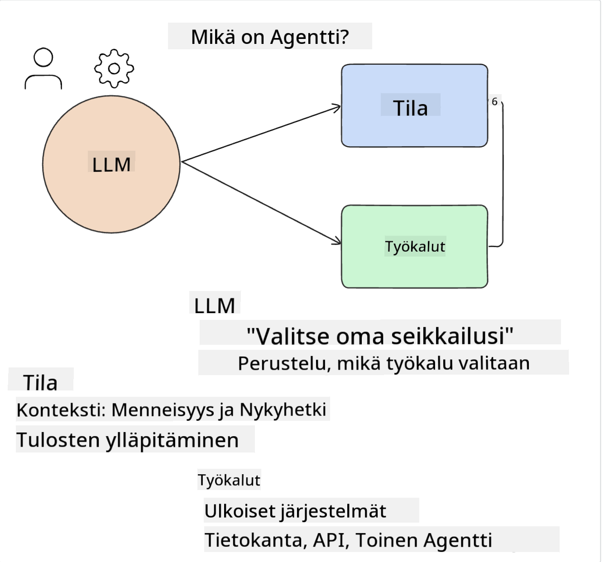
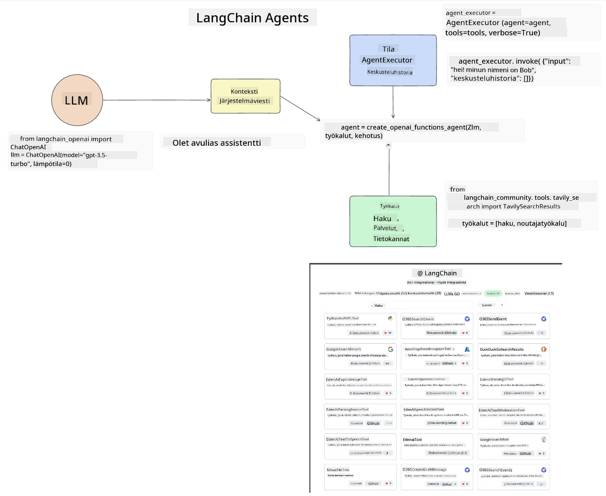
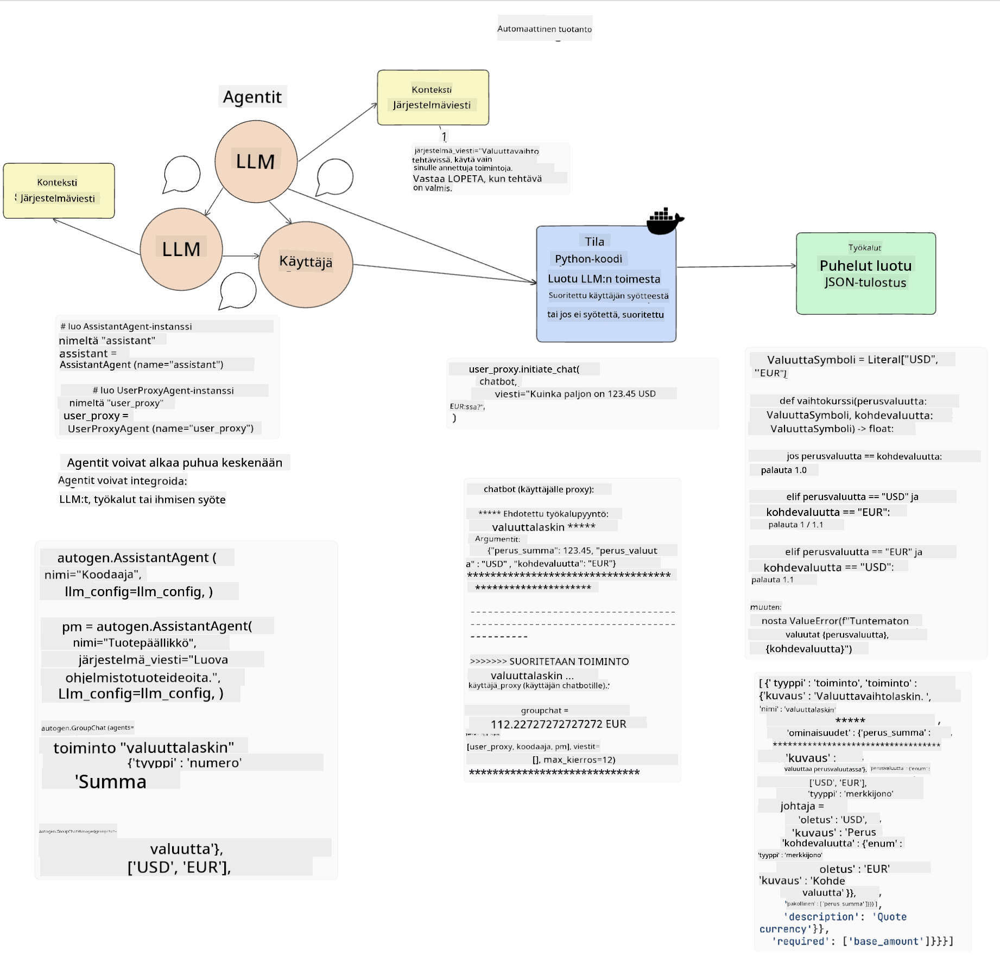
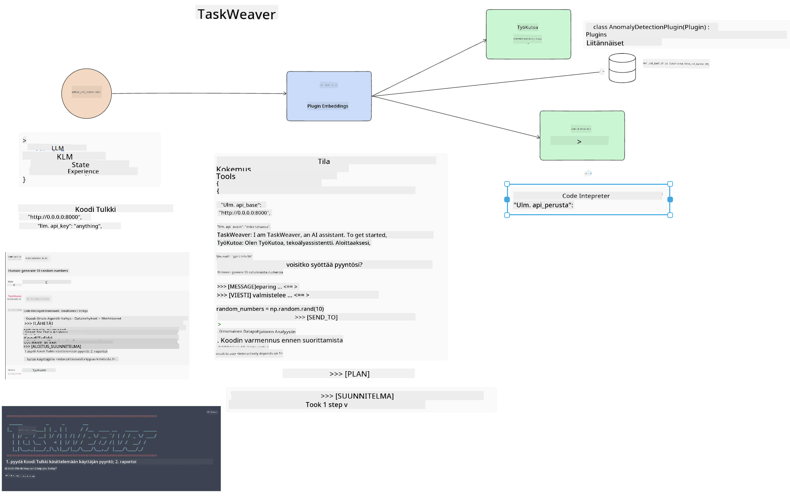
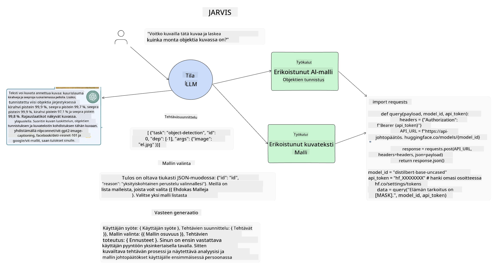

<!--
CO_OP_TRANSLATOR_METADATA:
{
  "original_hash": "11f03c81f190d9cbafd0f977dcbede6c",
  "translation_date": "2025-05-20T07:26:27+00:00",
  "source_file": "17-ai-agents/README.md",
  "language_code": "fi"
}
-->
[](https://aka.ms/gen-ai-lesson17-gh?WT.mc_id=academic-105485-koreyst)

## Johdanto

AI-agentit edustavat jännittävää kehitystä generatiivisessa tekoälyssä, mahdollistaen suurten kielimallien (LLM) kehittymisen avustajista toimia suorittaviksi agenteiksi. AI-agenttikehykset antavat kehittäjille mahdollisuuden luoda sovelluksia, jotka antavat LLM:ille pääsyn työkaluihin ja tilanhallintaan. Nämä kehykset parantavat myös näkyvyyttä, jolloin käyttäjät ja kehittäjät voivat seurata LLM:ien suunnittelemia toimia, mikä parantaa kokemusten hallintaa.

Tässä oppitunnissa käsitellään seuraavia aiheita:

- Mitä AI-agentit ovat - Mitä AI-agentti tarkalleen ottaen on?
- Neljän erilaisen AI-agenttikehyksen tutkiminen - Mikä tekee niistä ainutlaatuisia?
- Näiden AI-agenttien soveltaminen eri käyttötapauksiin - Milloin meidän tulisi käyttää AI-agentteja?

## Oppimistavoitteet

Tämän oppitunnin jälkeen pystyt:

- Selittämään, mitä AI-agentit ovat ja miten niitä voidaan käyttää.
- Ymmärtämään eroja joidenkin suosittujen AI-agenttikehysten välillä ja miten ne eroavat toisistaan.
- Ymmärtämään, miten AI-agentit toimivat sovellusten rakentamiseksi niiden avulla.

## Mitä ovat AI-agentit?

AI-agentit ovat erittäin jännittävä ala generatiivisen tekoälyn maailmassa. Tämän innostuksen myötä termit ja niiden soveltaminen voivat joskus aiheuttaa sekaannusta. Pidetään asiat yksinkertaisina ja kattavina useimmille AI-agenteiksi viittaaville työkaluille käyttämällä tätä määritelmää:

AI-agentit antavat suurille kielimalleille (LLM) mahdollisuuden suorittaa tehtäviä antamalla niille pääsyn **tilaan** ja **työkaluihin**.



Määritellään nämä termit:

**Suuret kielimallit** - Nämä ovat kurssin aikana mainittuja malleja, kuten GPT-3.5, GPT-4, Llama-2 jne.

**Tila** - Tämä viittaa kontekstiin, jossa LLM toimii. LLM käyttää menneiden toimien ja nykyisen kontekstin tietoja ohjatakseen päätöksentekoaan tulevia toimia varten. AI-agenttikehykset helpottavat kehittäjien työtä tämän kontekstin ylläpitämisessä.

**Työkalut** - Tehtävän suorittamiseksi, jonka käyttäjä on pyytänyt ja jonka LLM on suunnitellut, LLM tarvitsee pääsyn työkaluihin. Esimerkkejä työkaluista voivat olla tietokanta, API, ulkoinen sovellus tai jopa toinen LLM!

Nämä määritelmät toivottavasti antavat sinulle hyvän pohjan, kun tarkastelemme, miten ne toteutetaan. Tutkitaan muutamia erilaisia AI-agenttikehyksiä:

## LangChain-agentit

[LangChain-agentit](https://python.langchain.com/docs/how_to/#agents?WT.mc_id=academic-105485-koreyst) ovat toteutus yllä antamillemme määritelmille.

**Tilan** hallitsemiseksi se käyttää sisäänrakennettua toimintoa nimeltä `AgentExecutor`. Tämä hyväksyy määritellyt `agent` ja `tools`, jotka ovat sille saatavilla.

`Agent Executor` tallentaa myös keskusteluhistorian tarjotakseen keskustelun kontekstin.



LangChain tarjoaa [työkalukatalogin](https://integrations.langchain.com/tools?WT.mc_id=academic-105485-koreyst), jotka voidaan tuoda sovellukseesi, jossa LLM voi saada niihin pääsyn. Nämä ovat yhteisön ja LangChain-tiimin tekemiä.

Voit sitten määritellä nämä työkalut ja välittää ne `Agent Executor`:lle.

Näkyvyys on toinen tärkeä asia, kun puhutaan AI-agenteista. On tärkeää, että sovelluskehittäjät ymmärtävät, mitä työkalua LLM käyttää ja miksi. Tätä varten LangChain-tiimi on kehittänyt LangSmithin.

## AutoGen

Seuraava AI-agenttikehys, jota käsittelemme, on [AutoGen](https://microsoft.github.io/autogen/?WT.mc_id=academic-105485-koreyst). AutoGenin pääpaino on keskusteluissa. Agentit ovat sekä **keskustelukykyisiä** että **muokattavissa**.

**Keskustelukykyisyys -** LLM:t voivat aloittaa ja jatkaa keskustelua toisen LLM:n kanssa tehtävän suorittamiseksi. Tämä tehdään luomalla `AssistantAgents` ja antamalla niille erityinen järjestelmäviesti.

```python

autogen.AssistantAgent( name="Coder", llm_config=llm_config, ) pm = autogen.AssistantAgent( name="Product_manager", system_message="Creative in software product ideas.", llm_config=llm_config, )

```

**Muokattavuus** - Agentit voidaan määritellä paitsi LLM:inä, myös käyttäjinä tai työkaluina. Kehittäjänä voit määritellä `UserProxyAgent`:in, joka on vastuussa vuorovaikutuksesta käyttäjän kanssa saadakseen palautetta tehtävän suorittamiseksi. Tämä palaute voi joko jatkaa tehtävän suorittamista tai keskeyttää sen.

```python
user_proxy = UserProxyAgent(name="user_proxy")
```

### Tila ja työkalut

Tilan muuttamiseksi ja hallitsemiseksi avustaja-agentti luo Python-koodia tehtävän suorittamiseksi.

Tässä on esimerkki prosessista:



#### LLM määritelty järjestelmäviestillä

```python
system_message="For weather related tasks, only use the functions you have been provided with. Reply TERMINATE when the task is done."
```

Tämä järjestelmäviesti ohjaa tätä tiettyä LLM:ää, mitkä toiminnot ovat olennaisia sen tehtävälle. Muista, että AutoGenin avulla voit määritellä useita AssistantAgentteja erilaisilla järjestelmäviesteillä.

#### Käyttäjä aloittaa keskustelun

```python
user_proxy.initiate_chat( chatbot, message="I am planning a trip to NYC next week, can you help me pick out what to wear? ", )

```

Tämä käyttäjäproksin (ihminen) viesti käynnistää prosessin, jossa agentti tutkii mahdollisia toimintoja, jotka sen tulisi suorittaa.

#### Toiminto suoritetaan

```bash
chatbot (to user_proxy):

***** Suggested tool Call: get_weather ***** Arguments: {"location":"New York City, NY","time_periond:"7","temperature_unit":"Celsius"} ******************************************************** --------------------------------------------------------------------------------

>>>>>>>> EXECUTING FUNCTION get_weather... user_proxy (to chatbot): ***** Response from calling function "get_weather" ***** 112.22727272727272 EUR ****************************************************************

```

Kun alkuperäinen keskustelu on käsitelty, agentti ehdottaa, mitä työkalua kutsua. Tässä tapauksessa se on toiminto nimeltä `get_weather`. Depending on your configuration, this function can be automatically executed and read by the Agent or can be executed based on user input.

You can find a list of [AutoGen code samples](https://microsoft.github.io/autogen/docs/Examples/?WT.mc_id=academic-105485-koreyst) to further explore how to get started building.

## Taskweaver

The next agent framework we will explore is [Taskweaver](https://microsoft.github.io/TaskWeaver/?WT.mc_id=academic-105485-koreyst). It is known as a "code-first" agent because instead of working strictly with `strings` , it can work with DataFrames in Python. This becomes extremely useful for data analysis and generation tasks. This can be things like creating graphs and charts or generating random numbers.

### State and Tools

To manage the state of the conversation, TaskWeaver uses the concept of a `Planner`. The `Planner` is a LLM that takes the request from the users and maps out the tasks that need to be completed to fulfill this request.

To complete the tasks the `Planner` is exposed to the collection of tools called `Plugins`. Tämä voi olla Python-luokkia tai yleinen koodintulkki. Nämä laajennukset tallennetaan upotuksina, jotta LLM voi paremmin etsiä oikeaa laajennusta.



Tässä on esimerkki laajennuksesta, joka käsittelee poikkeavuuksien havaitsemista:

```python
class AnomalyDetectionPlugin(Plugin): def __call__(self, df: pd.DataFrame, time_col_name: str, value_col_name: str):
```

Koodi tarkistetaan ennen suorittamista. Toinen ominaisuus kontekstin hallintaan Taskweaverissa on keskustelun `kokemus`. Experience allows for the context of a conversation to be stored over to the long term in a YAML file. This can be configured so that the LLM improves over time on certain tasks given that it is exposed to prior conversations.

## JARVIS

The last agent framework we will explore is [JARVIS](https://github.com/microsoft/JARVIS?tab=readme-ov-file?WT.mc_id=academic-105485-koreyst). What makes JARVIS unique is that it uses an LLM to manage the `tila` ja `tools`ovat muita AI-malleja. Jokainen AI-malli on erikoistunut malli, joka suorittaa tiettyjä tehtäviä, kuten objektien tunnistamista, transkriptiota tai kuvatekstitystä.



LLM, ollessaan yleiskäyttöinen malli, vastaanottaa käyttäjän pyynnön ja tunnistaa tietyn tehtävän ja kaikki tarvittavat argumentit/tiedot tehtävän suorittamiseksi.

```python
[{"task": "object-detection", "id": 0, "dep": [-1], "args": {"image": "e1.jpg" }}]
```

LLM muotoilee sitten pyynnön tavalla, jonka erikoistunut AI-malli voi tulkita, kuten JSON. Kun AI-malli on palauttanut ennusteensa tehtävän perusteella, LLM vastaanottaa vastauksen.

Jos useita malleja tarvitaan tehtävän suorittamiseen, se tulkitsee myös näiden mallien vastaukset ennen kuin yhdistää ne luodakseen vastauksen käyttäjälle.

Alla oleva esimerkki näyttää, miten tämä toimisi, kun käyttäjä pyytää kuvausta ja esineiden lukumäärää kuvassa:

## Tehtävä

Jatkaaksesi AI-agenttien oppimista voit rakentaa AutoGenilla:

- Sovelluksen, joka simuloi liiketapaamista koulutusstartupin eri osastojen kanssa.
- Luo järjestelmäviestejä, jotka ohjaavat LLM:itä ymmärtämään eri persoonallisuuksia ja prioriteetteja, ja anna käyttäjän esittää uusi tuoteidea.
- LLM:n tulisi sitten luoda jatkokysymyksiä kustakin osastosta tarkentaakseen ja parantaakseen esitystä ja tuoteideaa.

## Oppiminen ei lopu tähän, jatka matkaa

Suoritettuasi tämän oppitunnin, tutustu [Generatiivisen tekoälyn oppimiskokoelmaamme](https://aka.ms/genai-collection?WT.mc_id=academic-105485-koreyst) jatkaaksesi generatiivisen tekoälyn tietämyksesi syventämistä!

**Vastuuvapauslauseke**:  
Tämä asiakirja on käännetty käyttämällä AI-käännöspalvelua [Co-op Translator](https://github.com/Azure/co-op-translator). Vaikka pyrimme tarkkuuteen, huomioithan, että automaattiset käännökset saattavat sisältää virheitä tai epätarkkuuksia. Alkuperäistä asiakirjaa sen alkuperäisellä kielellä tulisi pitää auktoritatiivisena lähteenä. Kriittisen tiedon osalta suositellaan ammattimaista ihmiskäännöstä. Emme ole vastuussa väärinkäsityksistä tai virhetulkinnoista, jotka johtuvat tämän käännöksen käytöstä.