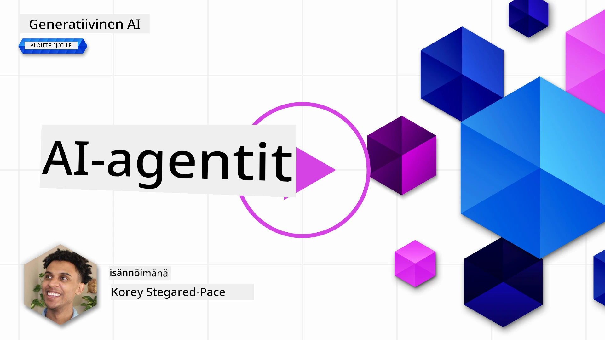
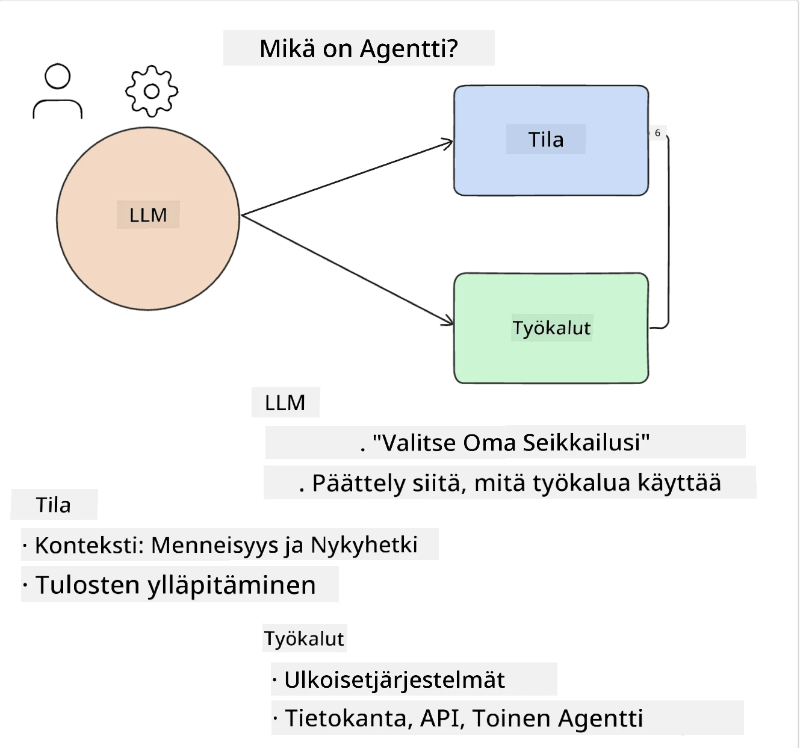
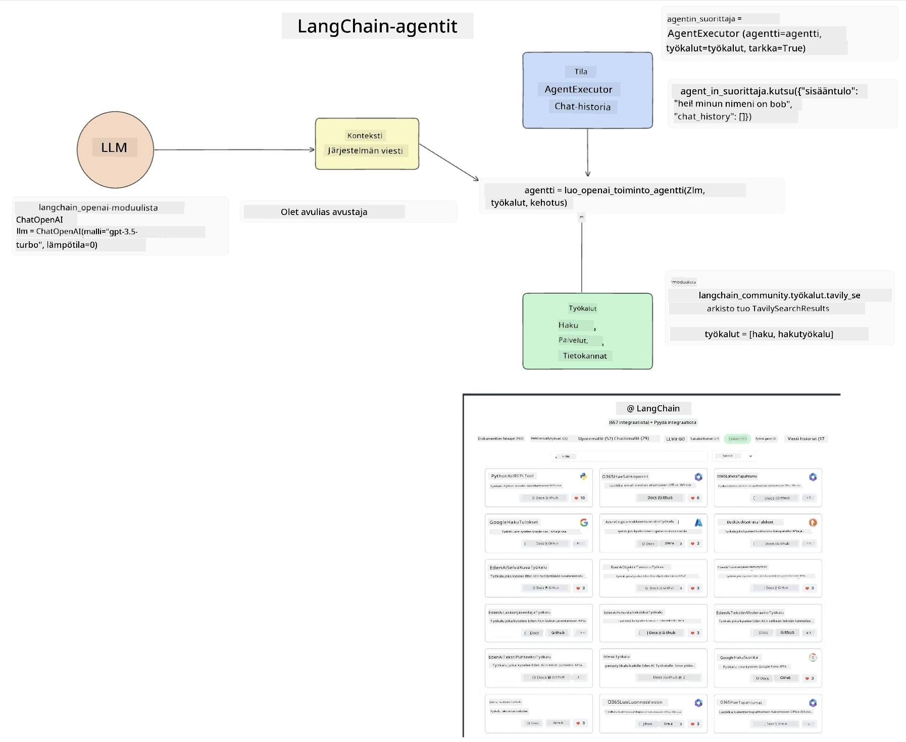
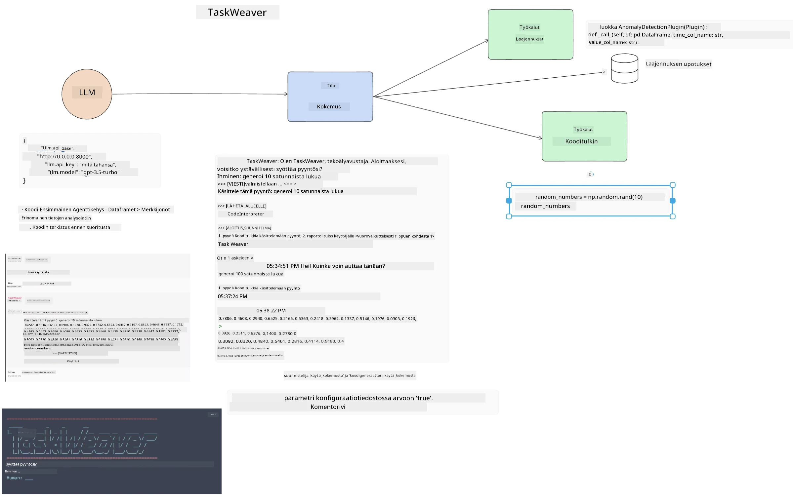
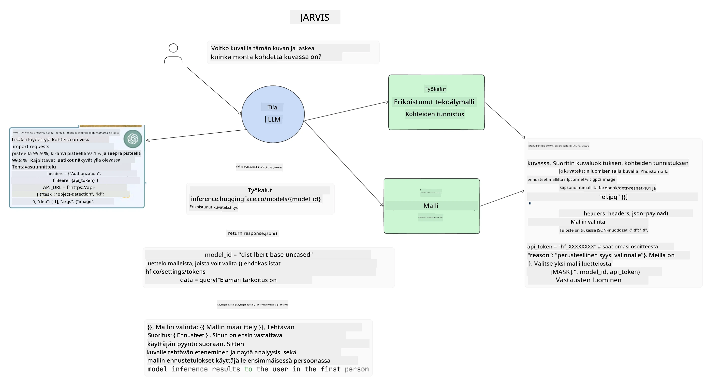

[](https://youtu.be/yAXVW-lUINc?si=bOtW9nL6jc3XJgOM)

## Johdanto

AI-agentit edustavat jännittävää kehitystä generatiivisessa tekoälyssä, mahdollistaen suurten kielimallien (LLM) kehittymisen assistenteista toimijoiksi, jotka pystyvät suorittamaan toimia. AI-agenttikehykset mahdollistavat kehittäjille sovellusten luomisen, jotka antavat LLM:ille pääsyn työkaluihin ja tilan hallintaan. Nämä kehykset myös parantavat näkyvyyttä, jolloin käyttäjät ja kehittäjät voivat seurata LLM:ien suunnittelemia toimia ja näin parantaa käyttökokemuksen hallintaa.

Oppitunnilla käsitellään seuraavia alueita:

- Mitä AI-agentti on - Mitä AI-agentti tarkalleen ottaen on?
- Neljän eri AI-agenttikehyksen tutkiminen - Mikä tekee niistä ainutlaatuisia?
- Näiden AI-agenttien soveltaminen eri käyttötapauksiin - Milloin AI-agentteja tulisi käyttää?

## Oppimistavoitteet

Tämän oppitunnin jälkeen osaat:

- Selittää, mitä AI-agentit ovat ja miten niitä voidaan käyttää.
- Ymmärtää eroja joidenkin suosittujen AI-agenttikehysten välillä ja miten ne eroavat toisistaan.
- Ymmärtää, miten AI-agentit toimivat, jotta voit rakentaa sovelluksia niiden avulla.

## Mitä AI-agentit ovat?

AI-agentit ovat erittäin jännittävä alue generatiivisen tekoälyn maailmassa. Tämän innostuksen mukana voi joskus esiintyä termien ja niiden soveltamisen sekaannusta. Pidämme asiat yksinkertaisina ja kattavina useimmille AI-agentteihin viittaaville työkaluille seuraavalla määritelmällä:

AI-agentit antavat suurille kielimalleille (LLM) mahdollisuuden suorittaa tehtäviä antamalla niille pääsy **tilaan** ja **työkaluihin**.



Määritellään nämä termit:

**Suuret kielimallit** - Nämä ovat mallien esimerkkejä joita käytetään tässä kurssissa, kuten GPT-3.5, GPT-4, Llama-2 jne.

**Tila** - Viittaa kontekstiin, jossa LLM työskentelee. LLM käyttää menneitä toimintojaan ja nykyistä kontekstia ohjatakseen päätöksentekoaan seuraavien toimintojen suhteen. AI-agenttikehykset helpottavat tätä kontekstin ylläpitoa kehittäjille.

**Työkalut** - Suorittaakseen käyttäjän pyytämän ja LLM:än suunnitteleman tehtävän, LLM tarvitsee pääsyn työkaluihin. Työkaluina voi olla esimerkiksi tietokanta, API, ulkoinen sovellus tai jopa toinen LLM!

Näiden määritelmien toivotaan antavan sinulle hyvän perustan eteenpäin tarkasteltaessa niiden toteutusta. Tutkitaanpa joitakin eri AI-agenttikehyksiä:

## LangChain Agents

[LangChain Agents](https://python.langchain.com/docs/how_to/#agents?WT.mc_id=academic-105485-koreyst) on yllä annettujen määritelmien toteutus.

**Tilan** hallintaan se käyttää sisäänrakennettua toimintoa nimeltä `AgentExecutor`. Tämä ottaa vastaan määritellyn `agent`in ja sen käytettävissä olevat `tools`.

`Agent Executor` tallentaa myös keskusteluhistorian tarjotakseen keskustelun kontekstin.



LangChain tarjoaa [työkaluluettelon](https://integrations.langchain.com/tools?WT.mc_id=academic-105485-koreyst), joka voidaan tuoda sovellukseesi ja johon LLM voi saada pääsyn. Näitä tekevät yhteisö sekä LangChain-tiimi.

Voit määritellä nämä työkalut ja välittää ne `Agent Executor`ille.

Näkyvyys on toinen tärkeä näkökulma puhuttaessa AI-agenteista. On tärkeää, että sovelluskehittäjät ymmärtävät, mitä työkalua LLM käyttää ja miksi. Tätä varten LangChainin tiimi on kehittänyt LangSmithin.

## AutoGen

Seuraava AI-agenttikehys, jota käsittelemme, on [AutoGen](https://microsoft.github.io/autogen/?WT.mc_id=academic-105485-koreyst). AutoGenin pääpaino on keskusteluissa. Agentit ovat sekä **keskustelukykyisiä** että **muokattavissa**.

**Keskustelukykyisiä** - LLM:t voivat aloittaa ja jatkaa keskustelua toisen LLM:n kanssa suorittaakseen tehtävän. Tämä tehdään luomalla `AssistantAgents` ja antamalla niille tietty järjestelmäviesti.

```python

autogen.AssistantAgent( name="Coder", llm_config=llm_config, ) pm = autogen.AssistantAgent( name="Product_manager", system_message="Creative in software product ideas.", llm_config=llm_config, )

```

**Muokattavissa** - Agentit voivat olla määriteltyinä paitsi LLM:inä myös käyttäjinä tai työkaluina. Kehittäjänä voit määritellä `UserProxyAgent`in, joka vastaa käyttäjän kanssa vuorovaikutuksesta palautteen saamiseksi tehtävän suorittamisesta. Tämä palaute voi joko jatkaa tehtävän suorittamista tai keskeyttää sen.

```python
user_proxy = UserProxyAgent(name="user_proxy")
```

### Tila ja työkalut

Tilaa muuttamaan ja hallitsemaan assistenttiagentti tuottaa Python-koodia tehtävän suorittamiseksi.

Tässä esimerkki prosessista:


#### LLM määritelty järjestelmäviestillä

```python
system_message="For weather related tasks, only use the functions you have been provided with. Reply TERMINATE when the task is done."
```

Tämä järjestelmäviesti ohjaa tätä tiettyä LLM:ää, mitkä funktiot ovat relevantteja sen tehtävälle. Muista, että AutoGenin kanssa voit määritellä useita AssistantAgents-luokkia eri järjestelmäviesteillä.

#### Keskustelu käynnistyy käyttäjän toimesta

```python
user_proxy.initiate_chat( chatbot, message="I am planning a trip to NYC next week, can you help me pick out what to wear? ", )

```

Tämä viesti user_proxy:lta (ihmiseltä) käynnistää agentin toiminnan tutkia, mitkä funktiot se tulisi suorittaa.

#### Funktio suoritetaan

```bash
chatbot (to user_proxy):

***** Suggested tool Call: get_weather ***** Arguments: {"location":"New York City, NY","time_periond:"7","temperature_unit":"Celsius"} ******************************************************** --------------------------------------------------------------------------------

>>>>>>>> EXECUTING FUNCTION get_weather... user_proxy (to chatbot): ***** Response from calling function "get_weather" ***** 112.22727272727272 EUR ****************************************************************

```

Kun alkuperäinen keskustelu on käsitelty, agentti lähettää ehdotuksen työkalun kutsumisesta. Tässä tapauksessa funktio on nimeltään `get_weather`. Määrittelystä riippuen tämä funktio voidaan suorittaa automaattisesti ja lukea agentin toimesta tai suorittaa käyttäjän syötteen perusteella.

Löydät listan [AutoGen-koodiesimerkeistä](https://microsoft.github.io/autogen/docs/Examples/?WT.mc_id=academic-105485-koreyst) tutustuaksesi tarkemmin aloitukseen.

## Taskweaver

Seuraava agenttikehys jota tutkimme on [Taskweaver](https://microsoft.github.io/TaskWeaver/?WT.mc_id=academic-105485-koreyst). Sitä pidetään "koodi-etusijaisena" agenttina, koska se ei toimi pelkästään merkkijonojen (`strings`) kanssa, vaan voi työskennellä Pythonin DataFramejen kanssa. Tämä on erittäin hyödyllistä data-analyysi- ja generointitehtävissä. Esimerkiksi kaavioiden ja grafiikkojen luomisessa tai satunnaisnumeroiden generoinnissa.

### Tila ja työkalut

Keskustelun tilan hallintaan TaskWeaver käyttää `Planner`-käsitettä. `Planner` on LLM, joka ottaa käyttäjän pyynnön ja laatii tehtävät, jotka pitää suorittaa tämän pyynnön täyttämiseksi.

Tehtävien suorittamiseksi `Planner`ille annetaan käyttöön kokoelma työkaluja, joita kutsutaan `Plugins`iksi. Nämä voivat olla Python-luokkia tai yleinen kooditulkki. Nämä lisäosat tallennetaan embeddingeiksi, jotta LLM voi paremmin etsiä oikeaa lisäosaa.



Tässä esimerkki lisäosasta, joka käsittelee poikkeamien tunnistusta:

```python
class AnomalyDetectionPlugin(Plugin): def __call__(self, df: pd.DataFrame, time_col_name: str, value_col_name: str):
```

Koodi tarkistetaan ennen suorittamista. Toinen Taskweaverin ominaisuus kontekstin hallintaan on `experience` (kokemus). Kokemus mahdollistaa keskustelun kontekstin tallentamisen pitkäaikaisesti YAML-tiedostoon. Tämä voidaan konfiguroida siten, että LLM kehittyy ajan myötä tietyissä tehtävissä, kun se altistuu aiemmille keskusteluille.

## JARVIS

Viimeinen agenttikehys jota tutkimme on [JARVIS](https://github.com/microsoft/JARVIS?tab=readme-ov-file&WT.mc_id=academic-105485-koreyst). JARVISin ainutlaatuisuus on siinä, että se käyttää LLM:ää keskustelun `tilan` hallintaan ja `työkalut` ovat muita tekoälymalleja. Jokainen tekoälymalli on erikoistunut tiettyjen tehtävien suorittamiseen, kuten esineiden tunnistus, puheen tunnistus tai kuvan kuvatekstin generointi.



LLM, joka on yleiskäyttöinen malli, vastaanottaa käyttäjän pyynnön, tunnistaa erityisen tehtävän ja kaikki argumentit/tiedot, jotka tarvitaan tehtävän suorittamiseen.

```python
[{"task": "object-detection", "id": 0, "dep": [-1], "args": {"image": "e1.jpg" }}]
```

LLM muotoilee sitten pyynnön tavalla, jonka erikoistunut tekoälymalli voi tulkita, esimerkiksi JSON-muodossa. Kun tekoälymalli on palauttanut ennusteensa tehtävän perusteella, LLM vastaanottaa vastauksen.

Jos tehtävän suorittamiseen tarvitaan useita malleja, LLM tulkitsee myös niiden mallien vastaukset ennen kuin yhdistää ne luodakseen vastauksen käyttäjälle.

Alla oleva esimerkki näyttää, miten tämä toimisi, kun käyttäjä pyytää kuvassa olevien esineiden kuvausta ja määrää:

## Tehtävä

Jatka AI-agenttien oppimista rakentamalla AutoGenin avulla:

- Sovellus, joka simuloi liiketapaamista eri koulutusstartupin osastojen välillä.
- Luo järjestelmäviestejä, jotka ohjaavat LLM:ää ymmärtämään erilaisia persoonia ja prioriteetteja, ja anna käyttäjän esitellä uusi tuoteidea.
- LLM:n tulisi sitten luoda jatkokysymyksiä jokaiselta osastolta pitchin ja tuoteidean hiomiseksi ja parantamiseksi.

## Oppiminen ei lopu tähän, jatka matkaa

Oppitunnin suorittamisen jälkeen tutustu [Generative AI Learning -kokoelmaamme](https://aka.ms/genai-collection?WT.mc_id=academic-105485-koreyst) jatkaaksesi generatiivisen tekoälyn osaamisesi kehittämistä!

---

<!-- CO-OP TRANSLATOR DISCLAIMER START -->
**Vastuuvapauslauseke**:
Tämä asiakirja on käännetty tekoälypohjaisella käännöspalvelulla [Co-op Translator](https://github.com/Azure/co-op-translator). Vaikka pyrimme tarkkuuteen, huomaathan, että automaattiset käännökset saattavat sisältää virheitä tai epätarkkuuksia. Alkuperäistä asiakirjaa sen alkuperäiskielellä tulee pitää virallisena lähteenä. Keskisuurissa ja kriittisissä asioissa suosittelemme ammattimaista ihmiskäännöstä. Emme ota vastuuta tämän käännöksen käytöstä aiheutuvista väärinymmärryksistä tai tulkinnoista.
<!-- CO-OP TRANSLATOR DISCLAIMER END -->