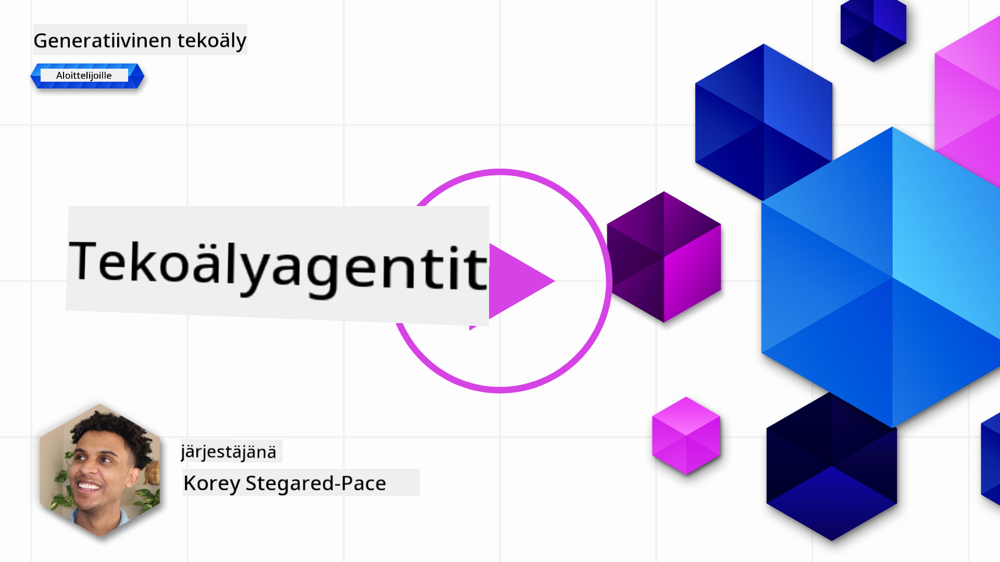
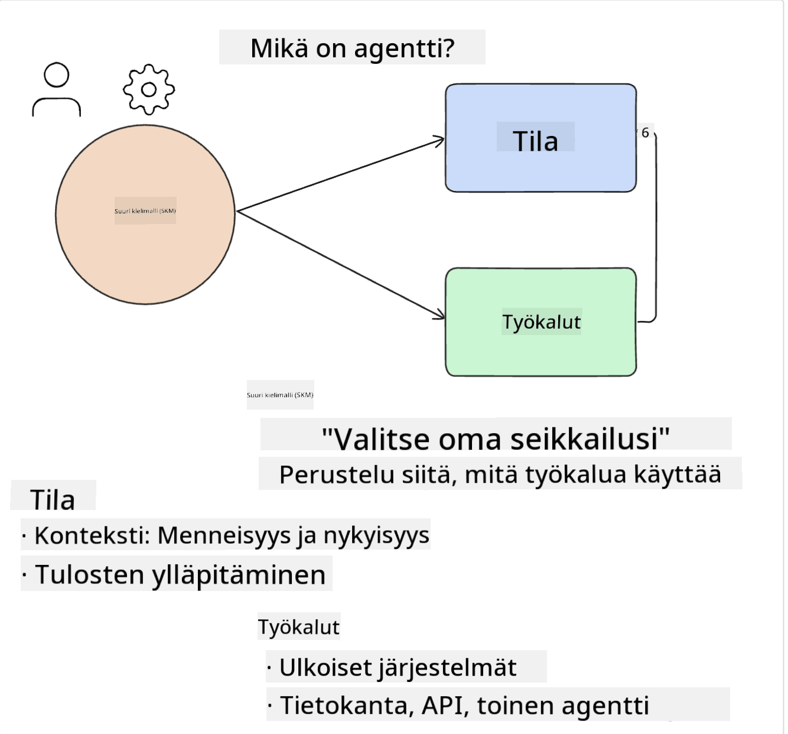
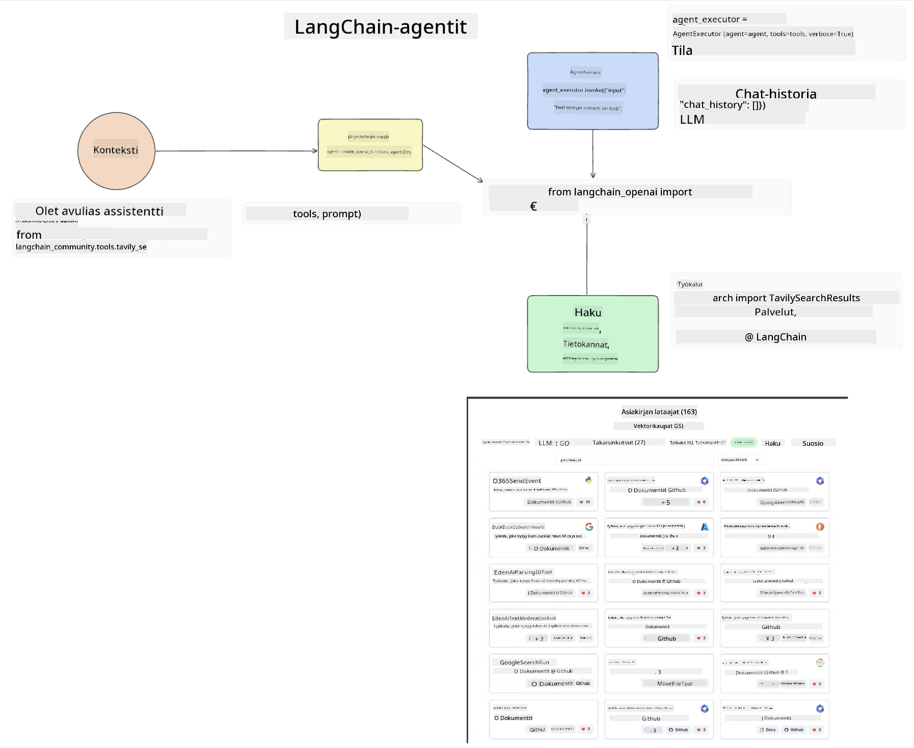
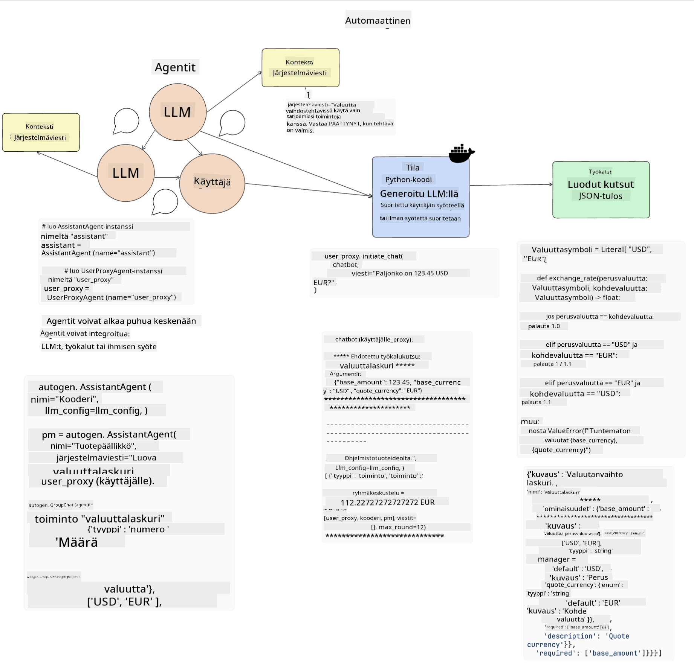
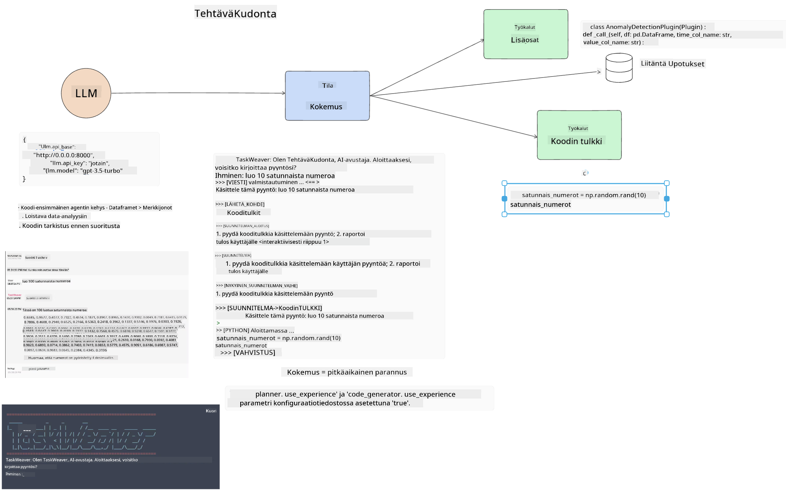
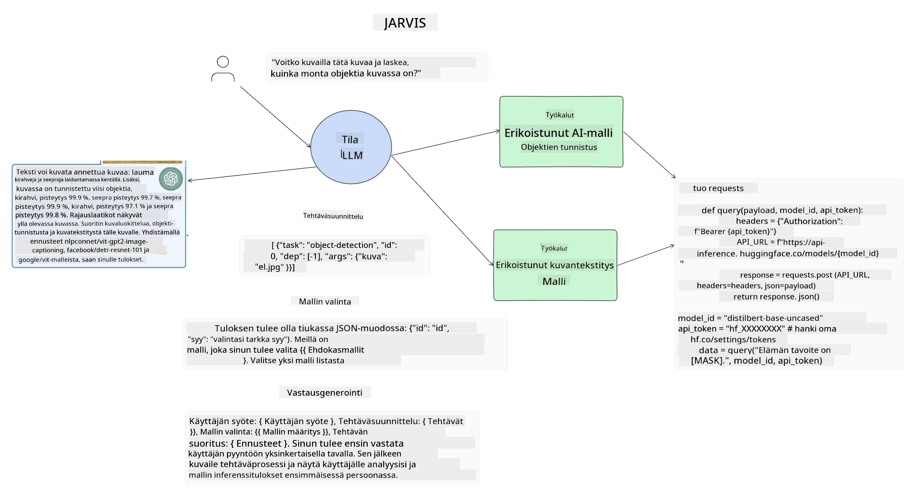

<!--
CO_OP_TRANSLATOR_METADATA:
{
  "original_hash": "11f03c81f190d9cbafd0f977dcbede6c",
  "translation_date": "2025-06-26T00:20:21+00:00",
  "source_file": "17-ai-agents/README.md",
  "language_code": "fi"
}
-->
[](https://aka.ms/gen-ai-lesson17-gh?WT.mc_id=academic-105485-koreyst)

## Johdanto

AI-agentit edustavat jännittävää kehitystä Generatiivisessa tekoälyssä, mahdollistaen suurten kielimallien (LLM) kehittymisen avustajista agenteiksi, jotka pystyvät toimimaan. AI-agenttikehykset mahdollistavat kehittäjille sovellusten luomisen, jotka antavat LLM:ille pääsyn työkaluihin ja tilanhallintaan. Nämä kehykset parantavat myös näkyvyyttä, jolloin käyttäjät ja kehittäjät voivat seurata LLM:ien suunnittelemia toimia, parantaen kokemuksen hallintaa.

Tunti käsittelee seuraavia aiheita:

- Ymmärrä, mitä AI-agentti on - Mitä AI-agentti tarkalleen ottaen on?
- Tutustu neljään eri AI-agenttikehykseen - Mikä tekee niistä ainutlaatuisia?
- Sovella näitä AI-agentteja eri käyttötapauksiin - Milloin meidän tulisi käyttää AI-agentteja?

## Oppimistavoitteet

Tämän oppitunnin jälkeen osaat:

- Selittää, mitä AI-agentit ovat ja miten niitä voidaan käyttää.
- Ymmärtää eroja suosittujen AI-agenttikehysten välillä ja miten ne eroavat toisistaan.
- Ymmärtää, miten AI-agentit toimivat sovellusten rakentamiseksi niiden avulla.

## Mitä ovat AI-agentit?

AI-agentit ovat erittäin jännittävä ala Generatiivisen tekoälyn maailmassa. Tämän jännityksen myötä joskus termit ja niiden sovellukset saattavat aiheuttaa hämmennystä. Pidämme asiat yksinkertaisina ja kattavina useimmille AI-agenteiksi kutsutuille työkaluille, käytämme seuraavaa määritelmää:

AI-agentit antavat suurille kielimalleille (LLM) mahdollisuuden suorittaa tehtäviä antamalla niille pääsyn **tilaan** ja **työkaluihin**.



Määritellään nämä termit:

**Suuret kielimallit** - Nämä ovat kurssin aikana viitattuja malleja, kuten GPT-3.5, GPT-4, Llama-2 jne.

**Tila** - Tämä viittaa kontekstiin, jossa LLM toimii. LLM käyttää aiempien toimiensa ja nykyisen kontekstin kontekstia, ohjaten päätöksentekoaan seuraavia toimia varten. AI-agenttikehykset mahdollistavat kehittäjille tämän kontekstin ylläpidon helpommin.

**Työkalut** - Tehtävän suorittamiseksi, jonka käyttäjä on pyytänyt ja jonka LLM on suunnitellut, LLM tarvitsee pääsyn työkaluihin. Joitakin esimerkkejä työkaluista voivat olla tietokanta, API, ulkoinen sovellus tai jopa toinen LLM!

Nämä määritelmät toivottavasti antavat sinulle hyvän pohjan eteenpäin, kun tarkastelemme, miten niitä toteutetaan. Tutkitaan muutamia eri AI-agenttikehyksiä:

## LangChain-agentit

[LangChain-agentit](https://python.langchain.com/docs/how_to/#agents?WT.mc_id=academic-105485-koreyst) on toteutus edellä annetuista määritelmistä.

**Tilan** hallintaan se käyttää sisäänrakennettua toimintoa nimeltä `AgentExecutor`. Tämä hyväksyy määritellyt `agent` ja `tools`, jotka ovat käytettävissä.

`Agent Executor` tallentaa myös keskusteluhistorian tarjotakseen keskustelun kontekstin.



LangChain tarjoaa [työkalukatalogin](https://integrations.langchain.com/tools?WT.mc_id=academic-105485-koreyst), joka voidaan tuoda sovellukseesi, johon LLM voi saada pääsyn. Nämä on tehty yhteisön ja LangChain-tiimin toimesta.

Voit sitten määritellä nämä työkalut ja siirtää ne `Agent Executor`.

Näkyvyys on toinen tärkeä osa-alue, kun puhutaan AI-agenteista. On tärkeää, että sovelluskehittäjät ymmärtävät, mitä työkalua LLM käyttää ja miksi. Tätä varten LangChainin tiimi on kehittänyt LangSmithin.

## AutoGen

Seuraava AI-agenttikehys, jota käsittelemme, on [AutoGen](https://microsoft.github.io/autogen/?WT.mc_id=academic-105485-koreyst). AutoGenin pääpaino on keskusteluissa. Agentit ovat sekä **keskusteltavissa** että **mukautettavissa**.

**Keskusteltavissa -** LLM:t voivat aloittaa ja jatkaa keskustelua toisen LLM:n kanssa suorittaakseen tehtävän. Tämä tehdään luomalla `AssistantAgents` ja antamalla niille erityinen järjestelmäviesti.

```python

autogen.AssistantAgent( name="Coder", llm_config=llm_config, ) pm = autogen.AssistantAgent( name="Product_manager", system_message="Creative in software product ideas.", llm_config=llm_config, )

```

**Mukautettavissa** - Agenteiksi voidaan määritellä paitsi LLM:t, myös käyttäjä tai työkalu. Kehittäjänä voit määritellä `UserProxyAgentin`, joka on vastuussa käyttäjän kanssa vuorovaikutuksesta saadakseen palautetta tehtävän suorittamiseksi. Tämä palaute voi joko jatkaa tehtävän suorittamista tai pysäyttää sen.

```python
user_proxy = UserProxyAgent(name="user_proxy")
```

### Tila ja työkalut

Tilan muuttamiseksi ja hallitsemiseksi avustajaagentti luo Python-koodia tehtävän suorittamiseksi.

Tässä on esimerkki prosessista:



#### LLM määritetty järjestelmäviestillä

```python
system_message="For weather related tasks, only use the functions you have been provided with. Reply TERMINATE when the task is done."
```

Tämä järjestelmäviesti ohjaa tätä tiettyä LLM:ää, mitkä toiminnot ovat sen tehtävän kannalta merkityksellisiä. Muista, että AutoGenin avulla voit määritellä useita AssistantAgenteja eri järjestelmäviesteillä.

#### Keskustelun aloittaa käyttäjä

```python
user_proxy.initiate_chat( chatbot, message="I am planning a trip to NYC next week, can you help me pick out what to wear? ", )

```

Tämä viesti käyttäjäproxysta (Ihminen) on se, mikä aloittaa prosessin, jossa agentti tutkii mahdollisia toimintoja, jotka sen tulisi suorittaa.

#### Toiminto suoritetaan

```bash
chatbot (to user_proxy):

***** Suggested tool Call: get_weather ***** Arguments: {"location":"New York City, NY","time_periond:"7","temperature_unit":"Celsius"} ******************************************************** --------------------------------------------------------------------------------

>>>>>>>> EXECUTING FUNCTION get_weather... user_proxy (to chatbot): ***** Response from calling function "get_weather" ***** 112.22727272727272 EUR ****************************************************************

```

Kun alkuperäinen keskustelu on käsitelty, agentti lähettää ehdotetun työkalun kutsuttavaksi. Tässä tapauksessa se on `get_weather`. Depending on your configuration, this function can be automatically executed and read by the Agent or can be executed based on user input.

You can find a list of [AutoGen code samples](https://microsoft.github.io/autogen/docs/Examples/?WT.mc_id=academic-105485-koreyst) to further explore how to get started building.

## Taskweaver

The next agent framework we will explore is [Taskweaver](https://microsoft.github.io/TaskWeaver/?WT.mc_id=academic-105485-koreyst). It is known as a "code-first" agent because instead of working strictly with `strings` , it can work with DataFrames in Python. This becomes extremely useful for data analysis and generation tasks. This can be things like creating graphs and charts or generating random numbers.

### State and Tools

To manage the state of the conversation, TaskWeaver uses the concept of a `Planner`. The `Planner` is a LLM that takes the request from the users and maps out the tasks that need to be completed to fulfill this request.

To complete the tasks the `Planner` is exposed to the collection of tools called `Plugins`-niminen funktio. Tämä voi olla Python-luokkia tai yleinen koodintulkki. Nämä laajennukset tallennetaan upotuksina, jotta LLM voi paremmin etsiä oikeaa laajennusta.



Tässä on esimerkki laajennuksesta, joka käsittelee poikkeavuuksien havaitsemista:

```python
class AnomalyDetectionPlugin(Plugin): def __call__(self, df: pd.DataFrame, time_col_name: str, value_col_name: str):
```

Koodi tarkistetaan ennen suorittamista. Toinen ominaisuus kontekstin hallintaan Taskweaverissa on keskustelun `experience`. Experience allows for the context of a conversation to be stored over to the long term in a YAML file. This can be configured so that the LLM improves over time on certain tasks given that it is exposed to prior conversations.

## JARVIS

The last agent framework we will explore is [JARVIS](https://github.com/microsoft/JARVIS?tab=readme-ov-file?WT.mc_id=academic-105485-koreyst). What makes JARVIS unique is that it uses an LLM to manage the `state` ja `tools`ovat muita AI-malleja. Jokainen AI-malli on erikoistunut malli, joka suorittaa tiettyjä tehtäviä, kuten objektien tunnistaminen, transkriptio tai kuvien kuvailu.



LLM, joka on yleiskäyttöinen malli, vastaanottaa käyttäjän pyynnön ja tunnistaa tietyn tehtävän ja kaikki argumentit/tiedot, joita tarvitaan tehtävän suorittamiseksi.

```python
[{"task": "object-detection", "id": 0, "dep": [-1], "args": {"image": "e1.jpg" }}]
```

LLM sitten muotoilee pyynnön tavalla, jonka erikoistunut AI-malli voi tulkita, kuten JSON. Kun AI-malli on palauttanut ennusteensa tehtävän perusteella, LLM vastaanottaa vastauksen.

Jos tehtävän suorittamiseen tarvitaan useita malleja, se tulkitsee myös näiden mallien vastaukset ennen niiden yhdistämistä ja palauttaa vastauksen käyttäjälle.

Alla oleva esimerkki näyttää, miten tämä toimisi, kun käyttäjä pyytää kuvan esineiden kuvausta ja laskemista:

## Tehtävä

Jatkaaksesi AI-agenttien oppimista voit rakentaa AutoGenin avulla:

- Sovelluksen, joka simuloi liiketapaamista eri koulutusalojen osastojen kanssa.
- Luo järjestelmäviestejä, jotka ohjaavat LLM:itä ymmärtämään erilaisia persoonallisuuksia ja prioriteetteja, ja mahdollistavat käyttäjän esitellä uuden tuoteidean.
- LLM:n tulisi sitten luoda jatkokysymyksiä kustakin osastosta tarkentaakseen ja parantaakseen esitystä ja tuoteideaa.

## Oppiminen ei lopu tähän, jatka matkaa

Kun olet suorittanut tämän oppitunnin, tutustu [Generatiivisen tekoälyn oppimiskokoelmaamme](https://aka.ms/genai-collection?WT.mc_id=academic-105485-koreyst) jatkaaksesi Generatiivisen tekoälyn tietämyksesi kehittämistä!

**Vastuuvapauslauseke**:  
Tämä asiakirja on käännetty käyttäen tekoälypohjaista käännöspalvelua [Co-op Translator](https://github.com/Azure/co-op-translator). Pyrimme tarkkuuteen, mutta ole tietoinen, että automaattiset käännökset saattavat sisältää virheitä tai epätarkkuuksia. Alkuperäistä asiakirjaa sen alkuperäisellä kielellä tulee pitää auktoritatiivisena lähteenä. Kriittisen tiedon osalta suositellaan ammattilaisten tekemää käännöstä. Emme ole vastuussa tämän käännöksen käytöstä johtuvista väärinkäsityksistä tai virhetulkinnoista.