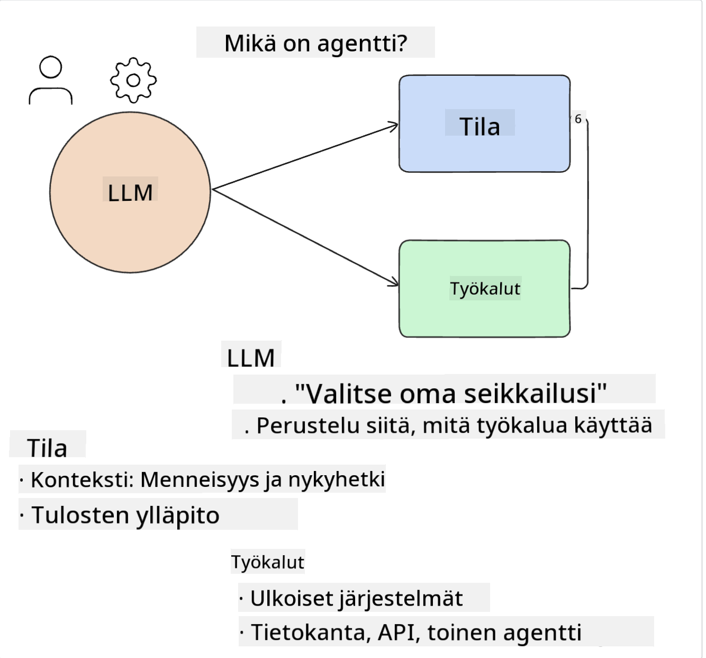
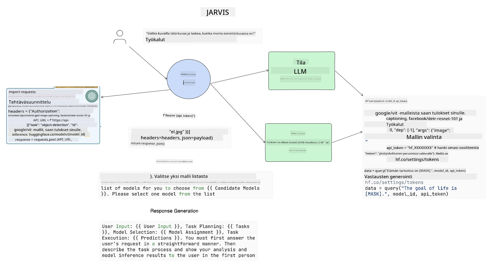

<!--
CO_OP_TRANSLATOR_METADATA:
{
  "original_hash": "11f03c81f190d9cbafd0f977dcbede6c",
  "translation_date": "2025-07-09T17:27:19+00:00",
  "source_file": "17-ai-agents/README.md",
  "language_code": "fi"
}
-->
[](https://aka.ms/gen-ai-lesson17-gh?WT.mc_id=academic-105485-koreyst)

## Johdanto

AI Agentit edustavat jännittävää kehitystä Generatiivisessa tekoälyssä, sillä ne mahdollistavat suurten kielimallien (LLM) kehittymisen avustajista toimijoiksi, jotka pystyvät suorittamaan toimia. AI Agent -kehykset antavat kehittäjille työkalut luoda sovelluksia, joissa LLM:illä on pääsy työkaluihin ja tilanhallintaan. Nämä kehykset parantavat myös näkyvyyttä, jolloin käyttäjät ja kehittäjät voivat seurata LLM:ien suunnittelemia toimia ja näin parantaa käyttökokemusta.

Tässä oppitunnissa käsitellään seuraavia aiheita:

- Mitä AI Agent oikeastaan on?
- Neljän eri AI Agent -kehyksen esittely – mikä tekee niistä ainutlaatuisia?
- AI Agenttien soveltaminen eri käyttötapauksiin – milloin AI Agentteja kannattaa käyttää?

## Oppimistavoitteet

Tämän oppitunnin jälkeen osaat:

- Selittää, mitä AI Agentit ovat ja miten niitä voi käyttää.
- Ymmärtää eroja suosittujen AI Agent -kehysten välillä.
- Ymmärtää, miten AI Agentit toimivat, jotta voit rakentaa sovelluksia niiden avulla.

## Mitä AI Agentit ovat?

AI Agentit ovat erittäin mielenkiintoinen alue Generatiivisen tekoälyn maailmassa. Tämän innostuksen myötä termit ja niiden soveltaminen voivat joskus aiheuttaa sekaannusta. Pidämme asiat yksinkertaisina ja kattavina useimmille AI Agentteja koskeville työkaluillle seuraavalla määritelmällä:

AI Agentit antavat suurille kielimalleille (LLM) mahdollisuuden suorittaa tehtäviä antamalla niille pääsyn **tilaan** ja **työkaluihin**.



Määritellään nämä termit:

**Suurten kielimallien (LLM) mallit** – Näitä malleja käytetään tässä kurssissa, kuten GPT-3.5, GPT-4, Llama-2 jne.

**Tila** – Viittaa kontekstiin, jossa LLM toimii. LLM käyttää aiempien toimien ja nykyisen kontekstin tietoja ohjatakseen päätöksentekoaan seuraavissa toimissa. AI Agent -kehykset helpottavat kehittäjiä ylläpitämään tätä kontekstia.

**Työkalut** – Suorittaakseen käyttäjän pyytämän ja LLM:n suunnitteleman tehtävän, LLM tarvitsee pääsyn työkaluihin. Työkaluina voi olla esimerkiksi tietokanta, API, ulkoinen sovellus tai jopa toinen LLM!

Näiden määritelmien avulla saat hyvän pohjan, kun tarkastelemme, miten ne toteutetaan. Tutustutaan muutamaan eri AI Agent -kehykseen:

## LangChain Agents

[LangChain Agents](https://python.langchain.com/docs/how_to/#agents?WT.mc_id=academic-105485-koreyst) on yllä annettujen määritelmien toteutus.

**Tilan** hallintaan se käyttää sisäänrakennettua funktiota nimeltä `AgentExecutor`. Tämä ottaa vastaan määritellyn `agent`-olion ja käytettävissä olevat `tools`.

`AgentExecutor` tallentaa myös keskusteluhistorian tarjotakseen keskustelun kontekstin.


LangChain tarjoaa [työkaluluettelon](https://integrations.langchain.com/tools?WT.mc_id=academic-105485-koreyst), jotka voi tuoda sovellukseesi, jolloin LLM pääsee niihin käsiksi. Nämä työkalut ovat yhteisön ja LangChain-tiimin tekemiä.

Voit määritellä nämä työkalut ja välittää ne `AgentExecutor`-funktiolle.

Näkyvyys on toinen tärkeä näkökulma AI Agentteja käsiteltäessä. On tärkeää, että sovelluskehittäjät ymmärtävät, mitä työkalua LLM käyttää ja miksi. Tätä varten LangChain-tiimi on kehittänyt LangSmithin.

## AutoGen

Seuraava AI Agent -kehys, josta puhumme, on [AutoGen](https://microsoft.github.io/autogen/?WT.mc_id=academic-105485-koreyst). AutoGenin pääpaino on keskusteluissa. Agentit ovat sekä **keskustelukykyisiä** että **muokattavissa**.

**Keskustelukykyisiä** – LLM:t voivat aloittaa ja jatkaa keskustelua toisen LLM:n kanssa suorittaakseen tehtävän. Tämä tapahtuu luomalla `AssistantAgents` ja antamalla niille tietty järjestelmäviesti.

```python

autogen.AssistantAgent( name="Coder", llm_config=llm_config, ) pm = autogen.AssistantAgent( name="Product_manager", system_message="Creative in software product ideas.", llm_config=llm_config, )

```

**Muokattavissa** – Agentteja ei määritellä vain LLM:iksi, vaan ne voivat olla myös käyttäjiä tai työkaluja. Kehittäjänä voit määritellä `UserProxyAgent`-agentin, joka vastaa käyttäjän kanssa vuorovaikutuksesta palautteen saamiseksi tehtävän suorittamiseen. Tämä palaute voi joko jatkaa tehtävän suorittamista tai keskeyttää sen.

```python
user_proxy = UserProxyAgent(name="user_proxy")
```

### Tila ja työkalut

Tilan muuttamiseksi ja hallitsemiseksi avustava Agentti generoi Python-koodia tehtävän suorittamiseksi.

Tässä esimerkki prosessista:


#### LLM määritelty järjestelmäviestillä

```python
system_message="For weather related tasks, only use the functions you have been provided with. Reply TERMINATE when the task is done."
```

Tämä järjestelmäviesti ohjaa kyseistä LLM:ää, mitkä funktiot ovat sen tehtävän kannalta olennaisia. Muista, että AutoGenissa voit määritellä useita AssistantAgentteja eri järjestelmäviesteillä.

#### Keskustelu aloitetaan käyttäjän toimesta

```python
user_proxy.initiate_chat( chatbot, message="I am planning a trip to NYC next week, can you help me pick out what to wear? ", )

```

Tämä viesti käyttäjäproxyltä (ihmiseltä) käynnistää Agentin prosessin tutkia, mitä toimintoja sen tulisi suorittaa.

#### Funktio suoritetaan

```bash
chatbot (to user_proxy):

***** Suggested tool Call: get_weather ***** Arguments: {"location":"New York City, NY","time_periond:"7","temperature_unit":"Celsius"} ******************************************************** --------------------------------------------------------------------------------

>>>>>>>> EXECUTING FUNCTION get_weather... user_proxy (to chatbot): ***** Response from calling function "get_weather" ***** 112.22727272727272 EUR ****************************************************************

```

Kun alkuperäinen keskustelu on käsitelty, Agentti lähettää ehdotuksen kutsuttavasta työkalusta. Tässä tapauksessa se on funktio nimeltä `get_weather`. Konfiguraatiostasi riippuen funktio voidaan suorittaa automaattisesti ja lukea Agentin toimesta tai suorittaa käyttäjän syötteen perusteella.

Voit löytää listan [AutoGen-koodiesimerkeistä](https://microsoft.github.io/autogen/docs/Examples/?WT.mc_id=academic-105485-koreyst), joilla pääset paremmin alkuun rakentamisessa.

## Taskweaver

Seuraava agenttikehys, johon tutustumme, on [Taskweaver](https://microsoft.github.io/TaskWeaver/?WT.mc_id=academic-105485-koreyst). Sitä kutsutaan "code-first" -agentiksi, koska se ei työskentele pelkästään `string`-tyyppisten tietojen kanssa, vaan voi käsitellä Pythonin DataFrameja. Tämä on erittäin hyödyllistä data-analyysi- ja generointitehtävissä, kuten kaavioiden ja graafien luomisessa tai satunnaislukujen generoinnissa.

### Tila ja työkalut

Keskustelun tilan hallintaan TaskWeaver käyttää `Planner`-käsitettä. `Planner` on LLM, joka ottaa käyttäjän pyynnön ja kartoittaa tehtävät, jotka on suoritettava pyynnön täyttämiseksi.

Tehtävien suorittamiseksi `Planner` pääsee käsiksi työkalukokoelmaan nimeltä `Plugins`. Nämä voivat olla Python-luokkia tai yleisiä koodin tulkkeja. Pluginien tiedot tallennetaan upotuksina (embeddings), jotta LLM voi paremmin etsiä oikeaa pluginia.


Tässä esimerkki pluginista, joka hoitaa poikkeavuuksien havaitsemisen:

```python
class AnomalyDetectionPlugin(Plugin): def __call__(self, df: pd.DataFrame, time_col_name: str, value_col_name: str):
```

Koodi tarkistetaan ennen suorittamista. Toinen kontekstin hallinnan ominaisuus Taskweaverissa on `experience`. Experience mahdollistaa keskustelun kontekstin tallentamisen pitkäaikaisesti YAML-tiedostoon. Tämä voidaan konfiguroida siten, että LLM paranee ajan myötä tietyissä tehtävissä, kun se saa aiempia keskusteluja käyttöönsä.

## JARVIS

Viimeinen agenttikehys, johon tutustumme, on [JARVIS](https://github.com/microsoft/JARVIS?tab=readme-ov-file?WT.mc_id=academic-105485-koreyst). JARVISin ainutlaatuisuus on siinä, että se käyttää LLM:ää keskustelun `tilan` hallintaan ja `työkalut` ovat muita tekoälymalleja. Jokainen tekoälymalli on erikoistunut suorittamaan tiettyjä tehtäviä, kuten kohteiden tunnistusta, puheen tekstitystä tai kuvatekstien luontia.



Yleiskäyttöinen LLM vastaanottaa käyttäjän pyynnön, tunnistaa tehtävän ja tarvittavat argumentit/tiedot tehtävän suorittamiseksi.

```python
[{"task": "object-detection", "id": 0, "dep": [-1], "args": {"image": "e1.jpg" }}]
```

LLM muotoilee pyynnön siten, että erikoistunut tekoälymalli voi sen tulkita, esimerkiksi JSON-muodossa. Kun tekoälymalli on palauttanut ennusteensa tehtävän perusteella, LLM vastaanottaa vastauksen.

Jos tehtävän suorittamiseen tarvitaan useita malleja, LLM tulkitsee myös näiden mallien vastaukset ennen kuin yhdistää ne käyttäjälle annettavaksi vastaukseksi.

Alla oleva esimerkki näyttää, miten tämä toimii, kun käyttäjä pyytää kuvan kohteiden kuvausta ja lukumäärää:

## Tehtävä

Jatka AI Agenttien opiskelua rakentamalla AutoGenilla:

- Sovellus, joka simuloi liiketapaamista eri osastojen välillä koulutusalan startupissa.
- Luo järjestelmäviestejä, jotka ohjaavat LLM:iä ymmärtämään eri persoonia ja prioriteetteja, ja mahdollistavat käyttäjän esittää uuden tuoteidean.
- LLM:n tulisi sitten luoda jatkokysymyksiä jokaiselta osastolta pitchin ja tuoteidean tarkentamiseksi ja parantamiseksi.

## Oppiminen ei lopu tähän, jatka matkaa

Oppitunnin suorittamisen jälkeen tutustu [Generative AI Learning -kokoelmaamme](https://aka.ms/genai-collection?WT.mc_id=academic-105485-koreyst) ja jatka Generatiivisen tekoälyn osaamisesi kehittämistä!

**Vastuuvapauslauseke**:  
Tämä asiakirja on käännetty käyttämällä tekoälypohjaista käännöspalvelua [Co-op Translator](https://github.com/Azure/co-op-translator). Vaikka pyrimme tarkkuuteen, huomioithan, että automaattikäännöksissä saattaa esiintyä virheitä tai epätarkkuuksia. Alkuperäistä asiakirjaa sen alkuperäiskielellä tulee pitää virallisena lähteenä. Tärkeissä tiedoissa suositellaan ammattimaista ihmiskäännöstä. Emme ole vastuussa tämän käännöksen käytöstä aiheutuvista väärinymmärryksistä tai tulkinnoista.