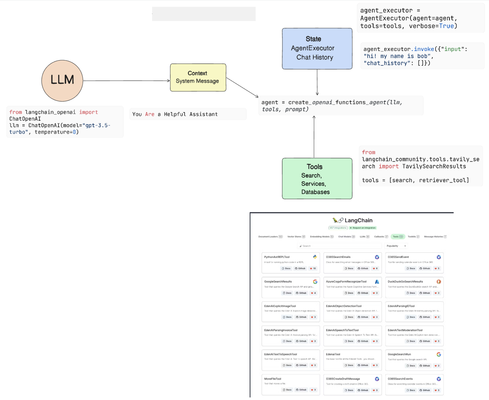
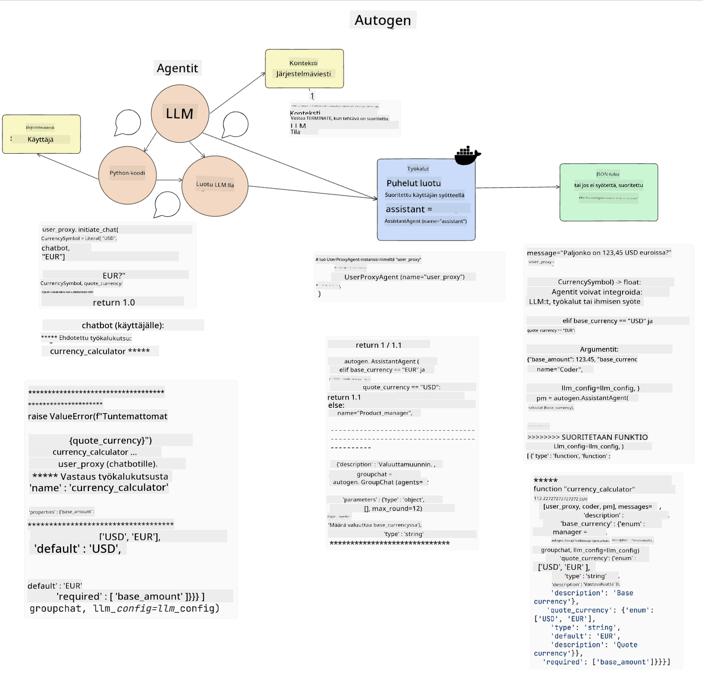

<!--
CO_OP_TRANSLATOR_METADATA:
{
  "original_hash": "8e8d1f6a63da606af7176a87ff8e92b6",
  "translation_date": "2025-10-17T19:48:27+00:00",
  "source_file": "17-ai-agents/README.md",
  "language_code": "fi"
}
-->
[](https://youtu.be/yAXVW-lUINc?si=bOtW9nL6jc3XJgOM)

## Johdanto

AI-agentit edustavat jännittävää kehitystä generatiivisessa tekoälyssä, sillä ne mahdollistavat suurten kielimallien (LLM) kehittymisen avustajista toimintaan kykeneviksi agenteiksi. AI-agenttikehykset antavat kehittäjille mahdollisuuden luoda sovelluksia, jotka tarjoavat LLM:ille pääsyn työkaluihin ja tilanhallintaan. Nämä kehykset parantavat myös näkyvyyttä, jolloin käyttäjät ja kehittäjät voivat seurata LLM:ien suunnittelemia toimia ja siten parantaa käyttökokemuksen hallintaa.

Tässä oppitunnissa käsitellään seuraavia aiheita:

- Ymmärtäminen, mitä AI-agentti on - Mitä AI-agentti tarkalleen ottaen tarkoittaa?
- Neljän eri AI-agenttikehyksen tutkiminen - Mikä tekee niistä ainutlaatuisia?
- Näiden AI-agenttien soveltaminen eri käyttötapauksiin - Milloin AI-agentteja kannattaa käyttää?

## Oppimistavoitteet

Tämän oppitunnin jälkeen osaat:

- Selittää, mitä AI-agentit ovat ja miten niitä voidaan käyttää.
- Ymmärtää eroja suosittujen AI-agenttikehysten välillä ja miten ne eroavat toisistaan.
- Ymmärtää, miten AI-agentit toimivat, jotta voit rakentaa sovelluksia niiden avulla.

## Mitä AI-agentit ovat?

AI-agentit ovat erittäin jännittävä ala generatiivisen tekoälyn maailmassa. Tämän innostuksen mukana tulee joskus termien ja niiden soveltamisen aiheuttamaa hämmennystä. Pidämme asiat yksinkertaisina ja kattavina useimmille AI-agenteiksi kutsutuille työkaluille käyttämällä seuraavaa määritelmää:

AI-agentit antavat suurille kielimalleille (LLM) mahdollisuuden suorittaa tehtäviä tarjoamalla niille pääsyn **tilaan** ja **työkaluihin**.


Määritellään nämä termit:

**Suuret kielimallit** - Nämä ovat kurssilla käsiteltyjä malleja, kuten GPT-3.5, GPT-4, Llama-2 jne.

**Tila** - Tämä viittaa kontekstiin, jossa LLM toimii. LLM käyttää aiempien toimiensa ja nykyisen kontekstin tietoja ohjatakseen päätöksentekoaan seuraavissa toimissa. AI-agenttikehykset helpottavat kehittäjien työtä tämän kontekstin ylläpitämisessä.

**Työkalut** - LLM tarvitsee työkaluja suorittaakseen käyttäjän pyytämän tehtävän ja suunnitellakseen sen. Esimerkkejä työkaluista ovat tietokanta, API, ulkoinen sovellus tai jopa toinen LLM!

Nämä määritelmät toivottavasti antavat sinulle hyvän pohjan eteenpäin, kun tarkastelemme niiden toteutusta. Tutustutaan muutamaan eri AI-agenttikehykseen:

## LangChain Agents

[LangChain Agents](https://python.langchain.com/docs/how_to/#agents?WT.mc_id=academic-105485-koreyst) on toteutus yllä annetuista määritelmistä.

**Tilan** hallintaan se käyttää sisäänrakennettua toimintoa nimeltä `AgentExecutor`. Tämä hyväksyy määritellyn `agentin` ja käytettävissä olevat `työkalut`.

`AgentExecutor` tallentaa myös keskusteluhistorian tarjotakseen keskustelun kontekstin.



LangChain tarjoaa [työkalukatalogin](https://integrations.langchain.com/tools?WT.mc_id=academic-105485-koreyst), jonka yhteisö ja LangChain-tiimi ovat luoneet ja jotka voidaan tuoda sovellukseesi, jotta LLM saa niihin pääsyn.

Voit määritellä nämä työkalut ja välittää ne `AgentExecutorille`.

Näkyvyys on toinen tärkeä näkökohta AI-agenteista puhuttaessa. On tärkeää, että sovelluskehittäjät ymmärtävät, mitä työkalua LLM käyttää ja miksi. Tätä varten LangChain-tiimi on kehittänyt LangSmithin.

## AutoGen

Seuraava AI-agenttikehys, jota käsittelemme, on [AutoGen](https://microsoft.github.io/autogen/?WT.mc_id=academic-105485-koreyst). AutoGen keskittyy pääasiassa keskusteluihin. Agentit ovat sekä **keskustelukykyisiä** että **muokattavissa**.

**Keskustelukykyisiä -** LLM:t voivat aloittaa ja jatkaa keskustelua toisen LLM:n kanssa suorittaakseen tehtävän. Tämä tehdään luomalla `AssistantAgents` ja antamalla niille erityinen järjestelmäviesti.

```python

autogen.AssistantAgent( name="Coder", llm_config=llm_config, ) pm = autogen.AssistantAgent( name="Product_manager", system_message="Creative in software product ideas.", llm_config=llm_config, )

```

**Muokattavissa** - Agentit voidaan määritellä paitsi LLM:iksi myös käyttäjiksi tai työkaluiksi. Kehittäjänä voit määritellä `UserProxyAgentin`, joka vastaa käyttäjän kanssa vuorovaikutuksesta saadakseen palautetta tehtävän suorittamiseksi. Tämä palaute voi joko jatkaa tehtävän suorittamista tai keskeyttää sen.

```python
user_proxy = UserProxyAgent(name="user_proxy")
```

### Tila ja työkalut

Tilan muuttamiseksi ja hallitsemiseksi avustaja-agentti tuottaa Python-koodia tehtävän suorittamiseksi.

Tässä on esimerkki prosessista:



#### LLM määritelty järjestelmäviestillä

```python
system_message="For weather related tasks, only use the functions you have been provided with. Reply TERMINATE when the task is done."
```

Tämä järjestelmäviesti ohjaa kyseistä LLM:ää siihen, mitkä toiminnot ovat olennaisia sen tehtävälle. Muista, että AutoGenin avulla voit määritellä useita AssistantAgentteja, joilla on erilaisia järjestelmäviestejä.

#### Käyttäjä aloittaa keskustelun

```python
user_proxy.initiate_chat( chatbot, message="I am planning a trip to NYC next week, can you help me pick out what to wear? ", )

```

Tämä käyttäjän (Human) lähettämä viesti käynnistää agentin prosessin tutkia, mitä toimintoja sen pitäisi suorittaa.

#### Toiminto suoritetaan

```bash
chatbot (to user_proxy):

***** Suggested tool Call: get_weather ***** Arguments: {"location":"New York City, NY","time_periond:"7","temperature_unit":"Celsius"} ******************************************************** --------------------------------------------------------------------------------

>>>>>>>> EXECUTING FUNCTION get_weather... user_proxy (to chatbot): ***** Response from calling function "get_weather" ***** 112.22727272727272 EUR ****************************************************************

```

Kun alkuperäinen keskustelu on käsitelty, agentti ehdottaa käytettävää työkalua. Tässä tapauksessa se on toiminto nimeltä `get_weather`. Konfiguraatiostasi riippuen tämä toiminto voidaan suorittaa automaattisesti agentin toimesta tai käyttäjän syötteen perusteella.

Voit löytää listan [AutoGen-koodiesimerkeistä](https://microsoft.github.io/autogen/docs/Examples/?WT.mc_id=academic-105485-koreyst) tutkiaksesi tarkemmin, miten aloittaa rakentaminen.

## Taskweaver

Seuraava agenttikehys, jota tarkastelemme, on [Taskweaver](https://microsoft.github.io/TaskWeaver/?WT.mc_id=academic-105485-koreyst). Sitä kutsutaan "koodipohjaiseksi" agentiksi, koska sen sijaan, että se toimisi pelkästään `merkkijonojen` kanssa, se voi työskennellä Pythonin DataFramejen kanssa. Tämä on erittäin hyödyllistä data-analyysi- ja generointitehtävissä, kuten kaavioiden ja graafien luomisessa tai satunnaisten numeroiden generoinnissa.

### Tila ja työkalut

Keskustelun tilan hallitsemiseksi TaskWeaver käyttää `Plannerin` käsitettä. `Planner` on LLM, joka ottaa käyttäjien pyynnön ja kartoittaa tehtävät, jotka on suoritettava pyynnön täyttämiseksi.

Tehtävien suorittamiseksi `Planner` altistetaan työkalukokoelmalle, jota kutsutaan `Pluginsiksi`. Tämä voi olla Python-luokkia tai yleinen kooditulkki. Nämä pluginit tallennetaan upotuksina, jotta LLM voi paremmin etsiä oikean pluginin.


Tässä on esimerkki pluginista, joka käsittelee poikkeavuuksien havaitsemista:

```python
class AnomalyDetectionPlugin(Plugin): def __call__(self, df: pd.DataFrame, time_col_name: str, value_col_name: str):
```

Koodi tarkistetaan ennen sen suorittamista. Toinen ominaisuus kontekstin hallintaan TaskWeaverissa on `kokemus`. Kokemus mahdollistaa keskustelun kontekstin tallentamisen pitkällä aikavälillä YAML-tiedostoon. Tämä voidaan konfiguroida niin, että LLM paranee ajan myötä tietyissä tehtävissä, kun se altistuu aiemmille keskusteluille.

## JARVIS

Viimeinen agenttikehys, jota tarkastelemme, on [JARVIS](https://github.com/microsoft/JARVIS?tab=readme-ov-file?WT.mc_id=academic-105485-koreyst). JARVISin ainutlaatuisuus piilee siinä, että se käyttää LLM:ää keskustelun `tilan` hallintaan ja `työkalut` ovat muita AI-malleja. Kukin AI-malli on erikoistunut tiettyihin tehtäviin, kuten objektien tunnistamiseen, transkriptioon tai kuvatekstien luomiseen.


LLM, joka on yleiskäyttöinen malli, vastaanottaa käyttäjän pyynnön ja tunnistaa tietyn tehtävän sekä tarvittavat argumentit/tiedot tehtävän suorittamiseksi.

```python
[{"task": "object-detection", "id": 0, "dep": [-1], "args": {"image": "e1.jpg" }}]
```

LLM muotoilee pyynnön tavalla, jonka erikoistunut AI-malli voi tulkita, kuten JSON-muodossa. Kun AI-malli on palauttanut ennusteensa tehtävän perusteella, LLM vastaanottaa vastauksen.

Jos tehtävän suorittamiseen tarvitaan useita malleja, se myös tulkitsee näiden mallien vastaukset ennen kuin yhdistää ne ja tuottaa vastauksen käyttäjälle.

Alla oleva esimerkki näyttää, miten tämä toimisi, kun käyttäjä pyytää kuvausta ja laskentaa kuvassa olevista objekteista:

## Tehtävä

Jatka oppimista AI-agenteista rakentamalla AutoGenilla:

- Sovellus, joka simuloi liiketapaamista koulutusalan startupin eri osastojen välillä.
- Luo järjestelmäviestejä, jotka ohjaavat LLM:ää ymmärtämään eri persoonia ja prioriteetteja, ja anna käyttäjän esitellä uusi tuoteidea.
- LLM:n tulisi sitten luoda jatkokysymyksiä kustakin osastosta, jotta esitystä ja tuoteideaa voidaan tarkentaa ja parantaa.

## Oppiminen ei lopu tähän, jatka matkaasi

Tämän oppitunnin jälkeen tutustu [Generatiivisen tekoälyn oppimiskokoelmaan](https://aka.ms/genai-collection?WT.mc_id=academic-105485-koreyst) jatkaaksesi generatiivisen tekoälyn tietämyksesi kehittämistä!

---

**Vastuuvapauslauseke**:  
Tämä asiakirja on käännetty käyttämällä tekoälypohjaista käännöspalvelua [Co-op Translator](https://github.com/Azure/co-op-translator). Vaikka pyrimme tarkkuuteen, huomioithan, että automaattiset käännökset voivat sisältää virheitä tai epätarkkuuksia. Alkuperäistä asiakirjaa sen alkuperäisellä kielellä tulisi pitää ensisijaisena lähteenä. Kriittisen tiedon osalta suositellaan ammattimaista ihmiskäännöstä. Emme ole vastuussa väärinkäsityksistä tai virhetulkinnoista, jotka johtuvat tämän käännöksen käytöstä.