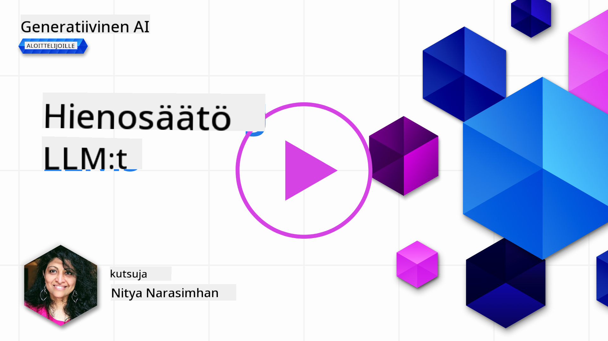
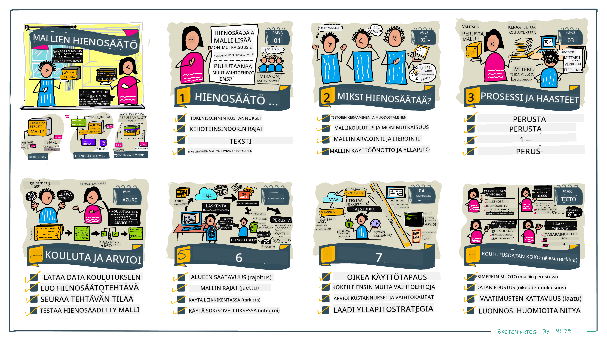

<!--
CO_OP_TRANSLATOR_METADATA:
{
  "original_hash": "68664f7e754a892ae1d8d5e2b7bd2081",
  "translation_date": "2025-07-09T17:45:07+00:00",
  "source_file": "18-fine-tuning/README.md",
  "language_code": "fi"
}
-->

# LLM-mallisi hienosäätö

Suuriin kielimalleihin perustuvien generatiivisten tekoälysovellusten rakentaminen tuo mukanaan uusia haasteita. Keskeinen kysymys on varmistaa mallin tuottamien vastausten laatu (tarkkuus ja merkityksellisyys) käyttäjän pyynnön perusteella. Aiemmissa oppitunneissa käsittelimme tekniikoita, kuten promptin suunnittelua ja hakua hyödyntävää generointia, jotka pyrkivät ratkaisemaan ongelman _muokkaamalla mallille annettavaa syötettä_.

Tämän päivän oppitunnilla käsittelemme kolmatta tekniikkaa, **hienosäätöä**, joka pyrkii ratkaisemaan haasteen _kouluttamalla mallia uudelleen_ lisäaineistolla. Sukelletaanpa yksityiskohtiin.

## Oppimistavoitteet

Tämä oppitunti esittelee hienosäädön käsitteen esikoulutetuille kielimalleille, tutkii tämän lähestymistavan etuja ja haasteita sekä antaa ohjeita siitä, milloin ja miten hienosäätöä kannattaa käyttää generatiivisten tekoälymalliesi suorituskyvyn parantamiseksi.

Oppitunnin lopussa sinun pitäisi osata vastata seuraaviin kysymyksiin:

- Mitä hienosäätö tarkoittaa kielimalleille?
- Milloin ja miksi hienosäätö on hyödyllistä?
- Miten voin hienosäätää esikoulutetun mallin?
- Mitkä ovat hienosäädön rajoitukset?

Valmis? Aloitetaan.

## Kuvitettu opas

Haluatko saada kokonaiskuvan siitä, mitä käsittelemme ennen syvempää sukellusta? Tutustu tähän kuvitettuun oppaaseen, joka kuvaa oppimismatkan tämän oppitunnin aiheisiin – ydinkäsitteiden ja hienosäädön motivaation oppimisesta prosessin ja parhaiden käytäntöjen ymmärtämiseen hienosäätötehtävän suorittamiseksi. Tämä on kiehtova aihe, joten muista myös tutustua [Resurssit](./RESOURCES.md?WT.mc_id=academic-105485-koreyst) -sivuun, josta löydät lisälinkkejä itseopiskelun tueksi!

## Mitä hienosäätö tarkoittaa kielimalleille?

Määritelmän mukaan suuret kielimallit ovat _esikoulutettuja_ suurilla tekstimäärillä, jotka on kerätty monista eri lähteistä, mukaan lukien internet. Kuten olemme oppineet aiemmissa oppitunneissa, tarvitsemme tekniikoita kuten _promptin suunnittelua_ ja _hakua hyödyntävää generointia_ parantaaksemme mallin vastausten laatua käyttäjän kysymyksiin ("prompteihin").

Yksi suosittu promptin suunnittelutekniikka on antaa mallille enemmän ohjeita siitä, mitä vastauksessa odotetaan, joko antamalla _ohjeita_ (selkeää ohjausta) tai _muutamia esimerkkejä_ (epäsuoraa ohjausta). Tätä kutsutaan _few-shot-oppimiseksi_, mutta siinä on kaksi rajoitusta:

- Mallin token-rajoitukset voivat rajoittaa annettavien esimerkkien määrää ja heikentää tehokkuutta.
- Mallin token-kustannukset voivat tehdä esimerkkien lisäämisestä jokaiseen promptiin kallista ja rajoittaa joustavuutta.

Hienosäätö on yleinen käytäntö koneoppimisjärjestelmissä, jossa otetaan esikoulutettu malli ja koulutetaan sitä uudelleen uudella aineistolla parantaaksemme sen suorituskykyä tietyssä tehtävässä. Kielimallien yhteydessä voimme hienosäätää esikoulutettua mallia _valikoidulla esimerkkiaineistolla tiettyä tehtävää tai sovellusaluetta varten_ luodaksemme **räätälöidyn mallin**, joka voi olla tarkempi ja merkityksellisempi juuri kyseiseen tehtävään tai alueeseen. Hienosäädön sivuvaikutuksena on myös se, että se voi vähentää few-shot-oppimiseen tarvittavien esimerkkien määrää – vähentäen tokenien käyttöä ja siihen liittyviä kustannuksia.

## Milloin ja miksi hienosäätää malleja?

Tässä yhteydessä, kun puhumme hienosäädöstä, tarkoitamme **valvottua** hienosäätöä, jossa uudelleenkoulutus tehdään **lisäämällä uutta dataa**, jota ei ollut alkuperäisessä koulutusdatassa. Tämä eroaa valvomattomasta hienosäädöstä, jossa mallia koulutetaan uudelleen alkuperäisellä datalla, mutta eri hyperparametreilla.

Tärkeää on muistaa, että hienosäätö on edistynyt tekniikka, joka vaatii tietyn tason asiantuntemusta haluttujen tulosten saavuttamiseksi. Jos hienosäätö tehdään väärin, se ei välttämättä paranna mallin suorituskykyä odotetusti, ja voi jopa heikentää mallin toimintaa kohdealueellasi.

Ennen kuin opit "miten" hienosäätää kielimalleja, sinun täytyy tietää "miksi" valita tämä lähestymistapa ja "milloin" aloittaa hienosäätöprosessi. Aloita kysymällä itseltäsi nämä kysymykset:

- **Käyttötapaus**: Mikä on sinun _käyttötapauksesi_ hienosäädölle? Mitä nykyisen esikoulutetun mallin osa-aluetta haluat parantaa?
- **Vaihtoehdot**: Oletko kokeillut _muita tekniikoita_ haluttujen tulosten saavuttamiseksi? Käytä niitä vertailupohjana.
  - Promptin suunnittelu: Kokeile few-shot-promptteja, joissa on esimerkkejä relevantista vastauksesta. Arvioi vastausten laatua.
  - Hakua hyödyntävä generointi: Kokeile täydentää promptteja hakutuloksilla, jotka haetaan datastasi. Arvioi vastausten laatua.
- **Kustannukset**: Oletko tunnistanut hienosäädön kustannukset?
  - Säädettävyys – onko esikoulutettu malli saatavilla hienosäätöön?
  - Työmäärä – koulutusdatan valmistelu, mallin arviointi ja hienosäätö
  - Laskentateho – hienosäätötyön suorittaminen ja hienosäädetyn mallin käyttöönotto
  - Data – riittävän laadukkaiden esimerkkien saatavuus hienosäädön vaikutuksen saavuttamiseksi
- **Hyödyt**: Oletko varmistanut hienosäädön hyödyt?
  - Laatu – ylittikö hienosäädetty malli vertailutason?
  - Kustannukset – vähentääkö se tokenien käyttöä yksinkertaistamalla promptteja?
  - Laajennettavuus – voiko perusmallia käyttää uudelleen uusilla alueilla?

Vastaamalla näihin kysymyksiin sinun pitäisi pystyä päättämään, onko hienosäätö oikea lähestymistapa käyttötapaukseesi. Ihanteellisesti lähestymistapa on perusteltu vain, jos hyödyt ylittävät kustannukset. Kun päätät jatkaa, on aika miettiä _miten_ voit hienosäätää esikoulutettua mallia.

Haluatko lisää näkemyksiä päätöksentekoprosessiin? Katso [To fine-tune or not to fine-tune](https://www.youtube.com/watch?v=0Jo-z-MFxJs)

## Miten hienosäätää esikoulutettua mallia?

Hienosäätöä varten tarvitset:

- esikoulutetun mallin, jota hienosäätää
- aineiston, jota käytetään hienosäätöön
- koulutusympäristön hienosäätötyön suorittamiseen
- isäntäympäristön hienosäädetyn mallin käyttöönottoon

## Hienosäätö käytännössä

Seuraavat resurssit tarjoavat vaiheittaiset ohjeet, jotka opastavat sinut läpi käytännön esimerkin valitun mallin ja valikoidun aineiston avulla. Näiden ohjeiden läpikäyntiin tarvitset tilin kyseisellä palveluntarjoajalla sekä pääsyn asiaankuuluviin malleihin ja aineistoihin.

| Palveluntarjoaja | Opas                                                                                                                                                                         | Kuvaus                                                                                                                                                                                                                                                                                                                                                                                                                           |
| ---------------- | ---------------------------------------------------------------------------------------------------------------------------------------------------------------------------- | --------------------------------------------------------------------------------------------------------------------------------------------------------------------------------------------------------------------------------------------------------------------------------------------------------------------------------------------------------------------------------------------------------------------------------- |
| OpenAI           | [How to fine-tune chat models](https://github.com/openai/openai-cookbook/blob/main/examples/How_to_finetune_chat_models.ipynb?WT.mc_id=academic-105485-koreyst)              | Opettele hienosäätämään `gpt-35-turbo` tiettyyn sovellusalueeseen ("reseptiavustaja") valmistamalla koulutusdata, suorittamalla hienosäätötyö ja käyttämällä hienosäädettyä mallia ennustamiseen.                                                                                                                                                                                                                                   |
| Azure OpenAI     | [GPT 3.5 Turbo fine-tuning tutorial](https://learn.microsoft.com/azure/ai-services/openai/tutorials/fine-tune?tabs=python-new%2Ccommand-line?WT.mc_id=academic-105485-koreyst) | Opettele hienosäätämään `gpt-35-turbo-0613` -mallia **Azurella** luomalla ja lataamalla koulutusdata, suorittamalla hienosäätötyö sekä ottamalla uusi malli käyttöön.                                                                                                                                                                                                                                                               |
| Hugging Face     | [Fine-tuning LLMs with Hugging Face](https://www.philschmid.de/fine-tune-llms-in-2024-with-trl?WT.mc_id=academic-105485-koreyst)                                             | Tämä blogikirjoitus opastaa hienosäätämään _avoimen LLM:n_ (esim. `CodeLlama 7B`) käyttäen [transformers](https://huggingface.co/docs/transformers/index?WT.mc_id=academic-105485-koreyst) -kirjastoa ja [Transformer Reinforcement Learning (TRL)](https://huggingface.co/docs/trl/index?WT.mc_id=academic-105485-koreyst) -työkaluja avoimilla [aineistoilla](https://huggingface.co/docs/datasets/index?WT.mc_id=academic-105485-koreyst) Hugging Facessa. |
|                  |                                                                                                                                                                              |                                                                                                                                                                                                                                                                                                                                                                                                                                 |
| 🤗 AutoTrain     | [Fine-tuning LLMs with AutoTrain](https://github.com/huggingface/autotrain-advanced/?WT.mc_id=academic-105485-koreyst)                                                       | AutoTrain (tai AutoTrain Advanced) on Hugging Facen kehittämä Python-kirjasto, joka mahdollistaa hienosäädön moniin eri tehtäviin, mukaan lukien LLM-hienosäätö. AutoTrain on kooditon ratkaisu, ja hienosäätö voidaan tehdä omassa pilvessä, Hugging Face Spacesissa tai paikallisesti. Se tukee web-pohjaista käyttöliittymää, komentorivityökaluja ja koulutusta yaml-konfiguraatiotiedostoilla.                                                                                 |
|                  |                                                                                                                                                                              |                                                                                                                                                                                                                                                                                                                                                                                                                                 |

## Tehtävä

Valitse yllä olevista oppaista yksi ja käy se läpi. _Saatamme toteuttaa näistä oppaista version Jupyter Notebookeina tässä repossa vain viitteeksi. Käytä alkuperäisiä lähteitä saadaksesi uusimmat versiot._

## Hienoa työtä! Jatka oppimista.

Oppitunnin suorittamisen jälkeen tutustu [Generative AI Learning collection](https://aka.ms/genai-collection?WT.mc_id=academic-105485-koreyst) -kokoelmaan jatkaaksesi generatiivisen tekoälyn osaamisesi kehittämistä!

Onnittelut!! Olet suorittanut tämän kurssin v2-sarjan viimeisen oppitunnin! Älä lopeta oppimista ja rakentamista. \*\*Tutustu [RESOURCES](RESOURCES.md?WT.mc_id=academic-105485-koreyst) -sivuun, josta löydät lisäehdotuksia juuri tähän aiheeseen.

Myös v1-sarjan oppitunteja on päivitetty lisäämällä uusia tehtäviä ja käsitteitä. Käytä hetki päivittääksesi tietosi – ja ole hyvä ja [jaa kysymyksesi ja palautteesi](https://github.com/microsoft/generative-ai-for-beginners/issues?WT.mc_id=academic-105485-koreyst) auttaaksesi meitä parantamaan näitä oppitunteja yhteisön hyväksi.

**Vastuuvapauslauseke**:  
Tämä asiakirja on käännetty käyttämällä tekoälypohjaista käännöspalvelua [Co-op Translator](https://github.com/Azure/co-op-translator). Vaikka pyrimme tarkkuuteen, huomioithan, että automaattikäännöksissä saattaa esiintyä virheitä tai epätarkkuuksia. Alkuperäistä asiakirjaa sen alkuperäiskielellä tulee pitää virallisena lähteenä. Tärkeissä tiedoissa suositellaan ammattimaista ihmiskäännöstä. Emme ole vastuussa tämän käännöksen käytöstä aiheutuvista väärinymmärryksistä tai tulkinnoista.