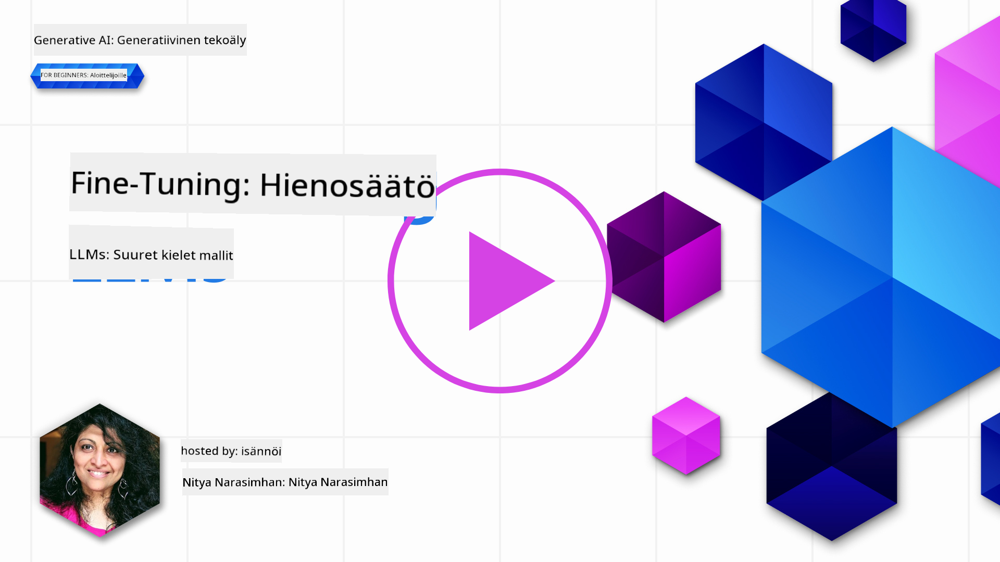
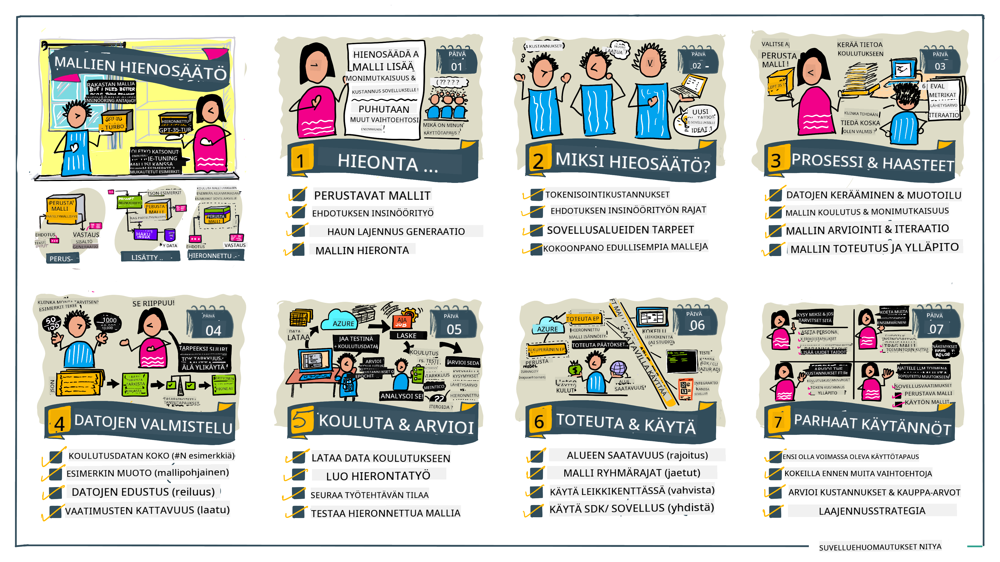

<!--
CO_OP_TRANSLATOR_METADATA:
{
  "original_hash": "68664f7e754a892ae1d8d5e2b7bd2081",
  "translation_date": "2025-05-20T07:51:17+00:00",
  "source_file": "18-fine-tuning/README.md",
  "language_code": "fi"
}
-->

# LLM:n hienosäätö

Suurten kielimallien käyttö generatiivisten tekoälysovellusten rakentamisessa tuo mukanaan uusia haasteita. Keskeinen ongelma on varmistaa mallin tuottaman sisällön vastausten laatu (tarkkuus ja osuvuus) tiettyyn käyttäjän pyyntöön. Aiemmissa oppitunneissa käsittelimme tekniikoita, kuten kehotteiden suunnittelua ja hakutulosten lisäämistä, jotka pyrkivät ratkaisemaan ongelman _muokkaamalla olemassa olevan mallin syötekehotetta_.

Tämän päivän oppitunnilla käsittelemme kolmatta tekniikkaa, **hienosäätöä**, joka pyrkii ratkaisemaan haasteen _kouluttamalla mallin uudelleen_ lisädatalla. Tutustutaan yksityiskohtiin.

## Oppimistavoitteet

Tämä oppitunti esittelee hienosäädön käsitteen esikoulutetuille kielimalleille, tutkii tämän lähestymistavan etuja ja haasteita sekä antaa ohjeita siitä, milloin ja miten hienosäätöä tulisi käyttää generatiivisten tekoälymallien suorituskyvyn parantamiseksi.

Oppitunnin lopussa sinun pitäisi osata vastata seuraaviin kysymyksiin:

- Mitä on hienosäätö kielimalleille?
- Milloin ja miksi hienosäätö on hyödyllistä?
- Kuinka voin hienosäätää esikoulutetun mallin?
- Mitkä ovat hienosäädön rajoitukset?

Valmis? Aloitetaan.

## Kuvitettu opas

Haluatko saada kokonaiskuvan siitä, mitä käsittelemme ennen kuin sukellamme yksityiskohtiin? Tutustu tähän kuvitettuun oppaaseen, joka kuvaa oppimismatkaa tämän oppitunnin aikana - hienosäädön ydinkäsitteiden ja motivaation oppimisesta prosessin ja parhaiden käytäntöjen ymmärtämiseen hienosäätötehtävän suorittamiseksi. Tämä on kiehtova aihe tutkia, joten muista tarkistaa [Resurssit](./RESOURCES.md?WT.mc_id=academic-105485-koreyst) -sivu saadaksesi lisälinkkejä tukemaan itseohjautuvaa oppimismatkaasi!

## Mitä on hienosäätö kielimalleille?

Määritelmän mukaan suuret kielimallit ovat _esikoulutettuja_ suurilla määrillä tekstiä, jotka on kerätty monista eri lähteistä, mukaan lukien internetistä. Kuten olemme oppineet aiemmilla oppitunneilla, tarvitsemme tekniikoita kuten _kehotteiden suunnittelu_ ja _hakutulosten lisääminen_ parantaaksemme mallin vastausten laatua käyttäjän kysymyksiin ("kehotteisiin").

Yksi suosittu kehotteiden suunnittelutekniikka sisältää mallille enemmän ohjeistusta siitä, mitä vastaukselta odotetaan joko antamalla _ohjeita_ (eksplisiittinen ohjeistus) tai _antamalla muutamia esimerkkejä_ (implisiittinen ohjeistus). Tätä kutsutaan _few-shot learningiksi_, mutta sillä on kaksi rajoitusta:

- Mallin token-rajoitukset voivat rajoittaa annettavien esimerkkien määrää ja vaikuttavuutta.
- Mallin token-kustannukset voivat tehdä esimerkkien lisäämisestä jokaiseen kehotteeseen kallista ja rajoittaa joustavuutta.

Hienosäätö on yleinen käytäntö koneoppimisjärjestelmissä, joissa otetaan esikoulutettu malli ja koulutetaan se uudelleen uudella datalla parantamaan sen suorituskykyä tietyssä tehtävässä. Kielimallien yhteydessä voimme hienosäätää esikoulutettua mallia _kuratoidulla esimerkkijoukolla tiettyä tehtävää tai sovellusaluetta varten_ luodaksemme **räätälöidyn mallin**, joka voi olla tarkempi ja osuvampi kyseiselle tehtävälle tai alueelle. Hienosäädön sivuhyötynä on, että se voi myös vähentää few-shot learningin tarvitsemien esimerkkien määrää - vähentäen token-käyttöä ja siihen liittyviä kustannuksia.

## Milloin ja miksi meidän pitäisi hienosäätää malleja?

_Tässä_ yhteydessä, kun puhumme hienosäädöstä, viittaamme **valvottuun** hienosäätöön, jossa uudelleenkoulutus tapahtuu **lisäämällä uutta dataa**, joka ei ollut osa alkuperäistä koulutusdatajoukkoa. Tämä eroaa valvomattomasta hienosäätölähestymistavasta, jossa malli koulutetaan uudelleen alkuperäisellä datalla, mutta eri hyperparametreilla.

Keskeinen asia muistaa on, että hienosäätö on edistynyt tekniikka, joka vaatii tietyn tason asiantuntemusta haluttujen tulosten saavuttamiseksi. Jos se tehdään väärin, se ei välttämättä tuota odotettuja parannuksia, ja saattaa jopa heikentää mallin suorituskykyä kohdealueellasi.

Joten ennen kuin opit "miten" hienosäätää kielimalleja, sinun täytyy tietää "miksi" sinun pitäisi valita tämä reitti ja "milloin" aloittaa hienosäätöprosessi. Aloita kysymällä itseltäsi nämä kysymykset:

- **Käyttötapaus**: Mikä on hienosäädön _käyttötapauksesi_? Mitä nykyisen esikoulutetun mallin ominaisuutta haluat parantaa?
- **Vaihtoehdot**: Oletko kokeillut _muita tekniikoita_ saavuttaaksesi halutut tulokset? Käytä niitä vertailukohtana.
  - Kehotteiden suunnittelu: Kokeile tekniikoita, kuten few-shot kehotteita, esimerkeillä asiaankuuluvista kehotusvastauksista. Arvioi vastausten laatua.
  - Hakutulosten lisääminen: Kokeile kehotteiden rikastamista hakemalla tuloksia datastasi. Arvioi vastausten laatua.
- **Kustannukset**: Oletko tunnistanut hienosäädön kustannukset?
  - Säätömahdollisuus - onko esikoulutettu malli saatavilla hienosäätöön?
  - Työmäärä - koulutusdatan valmistelu, mallin arviointi ja hienosäätö.
  - Laskentateho - hienosäätötyötehtävien suorittaminen ja hienosäädetyn mallin käyttöönotto
  - Data - riittävän laadukkaiden esimerkkien saatavuus hienosäädön vaikutusta varten
- **Hyödyt**: Oletko vahvistanut hienosäädön hyödyt?
  - Laatu - ylittikö hienosäädetty malli vertailukohdan?
  - Kustannus - vähentääkö se token-käyttöä yksinkertaistamalla kehotteita?
  - Laajennettavuus - voiko perusmallia käyttää uudelleen uusille alueille?

Vastaamalla näihin kysymyksiin sinun pitäisi pystyä päättämään, onko hienosäätö oikea lähestymistapa käyttötapauksellesi. Ihannetapauksessa lähestymistapa on pätevä vain, jos hyödyt ylittävät kustannukset. Kun päätät edetä, on aika miettiä _miten_ voit hienosäätää esikoulutetun mallin.

Haluatko saada lisää näkemyksiä päätöksentekoprosessista? Katso [Hienosäätääkö vai ei](https://www.youtube.com/watch?v=0Jo-z-MFxJs)

## Kuinka voimme hienosäätää esikoulutetun mallin?

Hienosäätääksesi esikoulutetun mallin, tarvitset:

- esikoulutetun mallin hienosäätöön
- datan hienosäätöä varten
- koulutusympäristön hienosäätötyön suorittamiseen
- isännöintiy

mpäristön hienosäädetyn mallin käyttöönottoon

## Hienosäätö käytännössä

Seuraavat resurssit tarjoavat vaiheittaisia tutoriaaleja, jotka opastavat sinua todellisen esimerkin läpi valitun mallin ja kuratoidun datasetin avulla. Työskennelläksesi näiden tutoriaalien läpi tarvitset tilin tietylle palveluntarjoajalle sekä pääsyn kyseiseen malliin ja datasetteihin.

| Palveluntarjoaja | Tutoriaali                                                                                                                                                                       | Kuvaus                                                                                                                                                                                                                                                                                                                                                                                                                        |
| ---------------- | ------------------------------------------------------------------------------------------------------------------------------------------------------------------------------- | ---------------------------------------------------------------------------------------------------------------------------------------------------------------------------------------------------------------------------------------------------------------------------------------------------------------------------------------------------------------------------------------------------------------------------------- |
| OpenAI           | [Kuinka hienosäätää chat-malleja](https://github.com/openai/openai-cookbook/blob/main/examples/How_to_finetune_chat_models.ipynb?WT.mc_id=academic-105485-koreyst)                | Opi hienosäätämään `gpt-35-turbo` tietylle alueelle ("reseptiassistentti") valmistelemalla koulutusdata, suorittamalla hienosäätötyö ja käyttämällä hienosäädettyä mallia päättelyyn.                                                                                                                                                                                                                                              |
| Azure OpenAI     | [GPT 3.5 Turbon hienosäätöopas](https://learn.microsoft.com/azure/ai-services/openai/tutorials/fine-tune?tabs=python-new%2Ccommand-line?WT.mc_id=academic-105485-koreyst) | Opi hienosäätämään `gpt-35-turbo-0613` -malli **Azurella** tekemällä toimenpiteitä koulutusdatan luomiseksi ja lataamiseksi, hienosäätötyön suorittamiseksi. Ota uusi malli käyttöön ja käytä sitä.                                                                                                                                                                                                                                                                 |
| Hugging Face     | [LLM:ien hienosäätö Hugging Facella](https://www.philschmid.de/fine-tune-llms-in-2024-with-trl?WT.mc_id=academic-105485-koreyst)                                               | Tämä blogikirjoitus opastaa sinua hienosäätämään _avointa LLM:ää_ (esim. `CodeLlama 7B`) käyttämällä [transformers](https://huggingface.co/docs/transformers/index?WT.mc_id=academic-105485-koreyst) -kirjastoa ja [Transformer Reinforcement Learning (TRL)](https://huggingface.co/docs/trl/index?WT.mc_id=academic-105485-koreyst]) avoimilla [dataseteillä](https://huggingface.co/docs/datasets/index?WT.mc_id=academic-105485-koreyst) Hugging Facella. |
|                  |                                                                                                                                                                                 |                                                                                                                                                                                                                                                                                                                                                                                                                                    |
| 🤗 AutoTrain     | [LLM:ien hienosäätö AutoTrainilla](https://github.com/huggingface/autotrain-advanced/?WT.mc_id=academic-105485-koreyst)                                                         | AutoTrain (tai AutoTrain Advanced) on Hugging Facen kehittämä python-kirjasto, joka mahdollistaa hienosäädön monille eri tehtäville, mukaan lukien LLM-hienosäätö. AutoTrain on kooditon ratkaisu ja hienosäätö voidaan tehdä omassa pilvessäsi, Hugging Face Spacesissa tai paikallisesti. Se tukee sekä verkkopohjaista käyttöliittymää, CLI:tä että koulutusta yaml-konfiguraatiotiedostojen avulla.                                                                               |
|                  |                                                                                                                                                                                 |                                                                                                                                                                                                                                                                                                                                                                                                                                    |

## Tehtävä

Valitse yksi yllä olevista tutoriaaleista ja käy se läpi. _Saatamme toistaa version näistä tutoriaaleista Jupyter Notebooksissa tässä repossa vain viitteeksi. Käytä alkuperäisiä lähteitä saadaksesi uusimmat versiot_.

## Hyvää työtä! Jatka oppimistasi.

Tämän oppitunnin suorittamisen jälkeen tutustu [Generatiivinen AI -oppimiskokoelmaamme](https://aka.ms/genai-collection?WT.mc_id=academic-105485-koreyst) jatkaaksesi Generatiivisen AI -tietämyksesi syventämistä!

Onnittelut!! Olet suorittanut kurssin v2-sarjan viimeisen oppitunnin! Älä lopeta oppimista ja rakentamista. \*\*Tutustu [RESURSSIT](RESOURCES.md?WT.mc_id=academic-105485-koreyst) -sivuun saadaksesi lisäehdotuksia juuri tähän aiheeseen.

Myös v1-sarjamme oppitunteja on päivitetty lisäämällä enemmän tehtäviä ja käsitteitä. Joten käytä hetki päivittääksesi tietosi - ja jaa [kysymyksesi ja palautteesi](https://github.com/microsoft/generative-ai-for-beginners/issues?WT.mc_id=academic-105485-koreyst) auttaaksesi meitä parantamaan näitä oppitunteja yhteisölle.

**Vastuuvapauslauseke**:  
Tämä asiakirja on käännetty käyttäen AI-käännöspalvelua [Co-op Translator](https://github.com/Azure/co-op-translator). Vaikka pyrimme tarkkuuteen, huomioithan, että automaattiset käännökset voivat sisältää virheitä tai epätarkkuuksia. Alkuperäistä asiakirjaa sen alkuperäisellä kielellä tulisi pitää auktoritatiivisena lähteenä. Kriittisen tiedon osalta suositellaan ammattimaista ihmiskäännöstä. Emme ole vastuussa tämän käännöksen käytöstä johtuvista väärinkäsityksistä tai virhetulkinnoista.