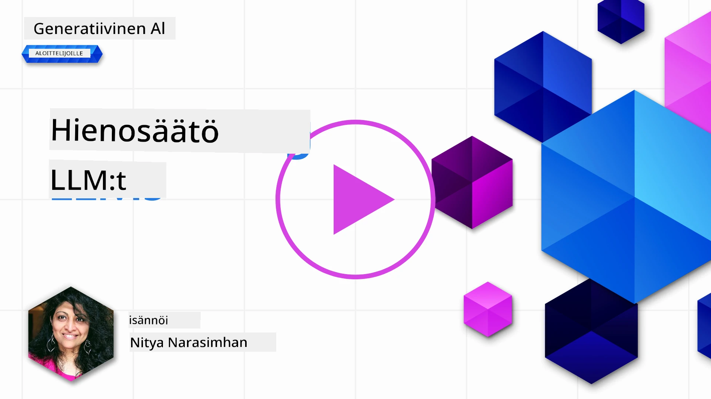
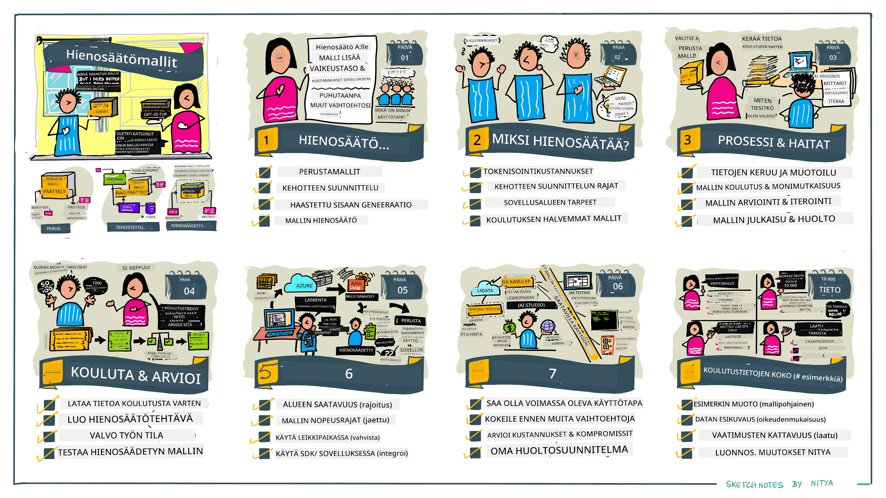

# LLM:n hienosäätö

Suuren kielimallin käyttäminen generatiivisten tekoälysovellusten rakentamiseen tuo mukanaan uusia haasteita. Keskeinen asia on varmistaa vastausten laatu (tarkkuus ja merkityksellisyys) mallin tuottamassa sisällössä käyttäjän pyynnön mukaisesti. Aiemmissa oppitunneissa käsittelimme tekniikoita, kuten kehotteen suunnittelua ja hakua hyödyntävää generointia, jotka pyrkivät ratkaisemaan ongelman _muokkaamalla mallin syötekehotetta_.

Tämän päivän oppitunnissa käsittelemme kolmatta tekniikkaa, **hienosäätöä**, joka pyrkii ratkaisemaan haasteen _kouluttamalla mallia uudelleen_ lisätiedoilla. Syvennytään aiheeseen.

## Oppimistavoitteet

Tämä oppitunti esittelee hienosäädön käsitteen esikoulutetuissa kielimalleissa, tarkastelee tämän lähestymistavan etuja ja haasteita sekä antaa ohjeita siitä, milloin ja miten hienosäätöä käytetään generatiivisten tekoälymallien suorituskyvyn parantamiseksi.

Oppitunnin lopussa sinun pitäisi osata vastata seuraaviin kysymyksiin:

- Mitä hienosäätö kielimalleille tarkoittaa?
- Milloin ja miksi hienosäätö on hyödyllistä?
- Miten voin hienosäätää esikoulutetun mallin?
- Mitkä ovat hienosäädön rajoitukset?

Valmis? Aloitetaan.

## Kuvitettu opas

Haluatko saada yleiskuvan siitä, mitä aiomme käsitellä ennen syvempää sukellusta? Katso tämä kuvitetttu opas, joka kuvaa oppimispolkua – oppimisen keskeisistä käsitteistä ja motivaatiosta hienosäätöön, prosessin ymmärtämiseen ja parhaita käytäntöjä hienosäätötehtävän suorittamiseen. Tämä on kiehtova aihe, joten älä unohda tutustua [Resurssit](./RESOURCES.md?WT.mc_id=academic-105485-koreyst) -sivuun saadaksesi lisää linkkejä tukeaksesi itseopiskelumatkaasi!

## Mitä hienosäätö tarkoittaa kielimalleille?

Määritelmän mukaan suuret kielimallit ovat _esikoulutettuja_ suurilla tekstimassoilla, jotka on kerätty monista lähteistä, mukaan lukien internet. Kuten olemme oppineet aiemmissa oppitunneissa, tarvitsemme tekniikoita, kuten _kehotteen suunnittelua_ ja _hausta rikastettua generointia_, parantaaksemme mallin vastausten laatua käyttäjän kysymyksiin ("kehotteisiin").

Yleisessä kehotteen suunnittelutekniikassa mallille annetaan enemmän ohjausta siitä, mitä vastauksessa odotetaan joko antamalla _ohjeita_ (eksplisiittinen ohjaus) tai _antaa muutama esimerkki_ (implisiittinen ohjaus). Tätä kutsutaan _few-shot-oppimiseksi_, mutta siinä on kaksi rajoitusta:

- Mallin token-rajoitukset voivat rajoittaa annettavien esimerkkien määrää ja siten vähentää tehokkuutta.
- Mallin token-kustannukset voivat tehdä esimerkkien lisäämisestä jokaiseen kehotteeseen kallista ja rajoittaa joustavuutta.

Hienosäätö on koneoppimisjärjestelmissä yleinen käytäntö, jossa otetaan esikoulutettu malli ja koulutetaan sitä uudelleen uudella aineistolla parantaakseen sen suorituskykyä tietyssä tehtävässä. Kielimallien yhteydessä voimme hienosäätää esikoulutettua mallia _huolellisesti valitulla esimerkkikokoelmalla tiettyä tehtävää tai sovellusalaa varten_ luodaksemme **räätälöidyn mallin**, joka voi olla tarkempi ja relevantimpi juuri kyseiseen tehtävään tai alaan. Hienosäännön sivuetu on, että se voi myös vähentää little-shot-oppimiseen tarvittavien esimerkkien määrää – vähentäen tokenien käyttöä ja siihen liittyviä kustannuksia.

## Milloin ja miksi hienosäätää malleja?

_ Tässä_ yhteydessä, kun puhumme hienosäädöstä, tarkoitamme **valvottua** hienosäätöä, jossa uudelleenkoulutus tehdään **uuden datan lisäämisellä**, joka ei ollut osa alkuperäistä koulutusmateriaalia. Tämä eroaa valvomattomasta hienosäätömenetelmästä, jossa mallia koulutetaan uudelleen alkuperäisellä datalla, mutta eri hyperparametreilla.

Keskeinen asia on muistaa, että hienosäätö on kehittynyt tekniikka, joka vaatii tietyn tason asiantuntemusta haluttujen tulosten saavuttamiseksi. Jos se tehdään väärin, se ei välttämättä tuota odotettuja parannuksia, ja voi jopa heikentää mallin suorituskykyä halutulla aluella.

Joten ennen kuin opit "miten" hienosäätää kielimalleja, sinun täytyy tietää "miksi" sinun kannattaa valita tämä reitti ja "milloin" aloittaa hienosäätöprosessi. Aloita kysymällä itseltäsi nämä kysymykset:

- **Käyttötapaus**: Mikä on sinun _käyttötapauksesi_ hienosäädössä? Mitä osa-aluetta nykyisessä esikoulutetussa mallissa haluat parantaa?
- **Vaihtoehdot**: Oletko kokeillut _muita tekniikoita_ haluttujen tulosten saavuttamiseksi? Käytä niitä vertailupohjana.
  - Kehotteen suunnittelu: Kokeile tekniikoita, kuten few-shot-kehotteita, joissa on esimerkkejä relevanttien vastausten luomiseksi. Arvioi vastausten laatua.
  - Hakua rikastettu generointi: Kokeile kehotteiden rikastamista kyselytuloksilla, jotka haetaan datastasi. Arvioi vastausten laatua.
- **Kustannukset**: Oletko kartoittanut hienosäädön kustannukset?
  - Säädettävyys – onko esikoulutettu malli saatavilla hienosäätöön?
  - Työmäärä – koulutusdatan valmisteluun, mallin arviointiin ja hienosäätöön.
  - Laskenta – hienosäätötehtävien suorittamiseen ja hienosäädetyn mallin käyttöönottoon.
  - Data – pääsy riittävän laadukkaisiin esimerkkeihin hienosäädön vaikutuksen varmistamiseksi.
- **Hyödyt**: Oletko varmistunut hienosäädön eduista?
  - Laatu – suoriutuiko hienosäädetty malli paremmin kuin vertailuperuste?
  - Kustannus – vähentääkö se tokenien kulutusta yksinkertaistamalla kehotteita?
  - Laajennettavuus – voitko käyttää perusmallia uudelleen uusilla alueilla?

Vastaamalla näihin kysymyksiin sinun pitäisi pystyä päättämään, onko hienosäätö oikea lähestymistapa käyttötapaukseesi. Ihanteellisesti lähestymistapa on pätevä vain, jos hyödyt ovat suuremmat kuin kustannukset. Kun olet päättänyt jatkaa, on aika miettiä _miten_ voit hienosäätää esikoulutettua mallia.

Haluatko lisätietoa päätöksenteosta? Katso [Hienosäätää vai ei hienosäätää](https://www.youtube.com/watch?v=0Jo-z-MFxJs)

## Miten hienosäätää esikoulutettu malli?

Hienosäätääksesi esikoulutettua mallia tarvitset:

- esikoulutetun mallin hienosäätöä varten
- aineiston hienosäätöön
- koulutusympäristön hienosäätötehtävän suorittamiseen
- isäntäympäristön hienosäädetyn mallin käyttöönottoon

## Hienosäätö käytännössä

Seuraavat resurssit tarjoavat vaiheittaiset opastusohjeet, jotka johdattavat sinut läpi todellisen esimerkin valitun mallin ja huolellisesti valitun aineiston kanssa. Näiden ohjeiden tekemiseen tarvitset tilin kyseisellä tarjoajalla sekä pääsyn asiaankuuluviin malleihin ja aineistoihin.

| Tarjoaja      | Opastus                                                                                                                                                                           | Kuvaus                                                                                                                                                                                                                                                                                                                                                                                                                             |
| ------------- | -------------------------------------------------------------------------------------------------------------------------------------------------------------------------------- | --------------------------------------------------------------------------------------------------------------------------------------------------------------------------------------------------------------------------------------------------------------------------------------------------------------------------------------------------------------------------------------------------------------------------------- |
| OpenAI        | [Miten hienosäätää keskustelumalleja](https://github.com/openai/openai-cookbook/blob/main/examples/How_to_finetune_chat_models.ipynb?WT.mc_id=academic-105485-koreyst)           | Opettele hienosäätämään `gpt-35-turbo` tiettyä aluetta varten ("reseptiassistentti") valmistamalla koulutusdata, suorittamalla hienosäätötehtävä ja käyttämällä hienosäädettyä mallia päätelmissä.                                                                                                                                                                                                                                  |
| Azure OpenAI  | [GPT 3.5 Turbon hienosäätöopastus](https://learn.microsoft.com/azure/ai-services/openai/tutorials/fine-tune?tabs=python-new%2Ccommand-line&WT.mc_id=academic-105485-koreyst)     | Opi hienosäätämään `gpt-35-turbo-0613` mallia **Azuressa** luomalla ja lataamalla koulutusdata, suorittamalla hienosäätötehtävä sekä ottamalla uusi malli käyttöön.                                                                                                                                                                                                                                                                 |
| Hugging Face  | [LLM:ien hienosäätö Hugging Facen avulla](https://www.philschmid.de/fine-tune-llms-in-2024-with-trl?WT.mc_id=academic-105485-koreyst)                                            | Tämä blogikirjoitus opastaa hienosäätämään _avointa LLM:ää_ (esim. `CodeLlama 7B`) käyttäen [transformers](https://huggingface.co/docs/transformers/index?WT.mc_id=academic-105485-koreyst) kirjastoa ja [Transformer Reinforcement Learning (TRL)](https://huggingface.co/docs/trl/index?WT.mc_id=academic-105485-koreyst) -työkalua, avoimilla [aineistoilla](https://huggingface.co/docs/datasets/index?WT.mc_id=academic-105485-koreyst) Hugging Facessa.               |
|               |                                                                                                                                                                                 |                                                                                                                                                                                                                                                                                                                                                                                                                                   |
| 🤗 AutoTrain  | [LLM:ien hienosäätö AutoTrainilla](https://github.com/huggingface/autotrain-advanced/?WT.mc_id=academic-105485-koreyst)                                                          | AutoTrain (tai AutoTrain Advanced) on Hugging Facen kehittämä Python-kirjasto, joka mahdollistaa hienosäädön monille eri tehtäville, mukaan lukien LLM:n hienosäätö. AutoTrain on kooditon ratkaisu, ja hienosäätö voidaan tehdä omassa pilvessä, Hugging Face Spacesissä tai paikallisesti. Tukee verkkopohjaista käyttöliittymää, komentorivityökalua ja koulutusta yaml-konfiguraatiotiedostoilla.                                               |
|               |                                                                                                                                                                                 |                                                                                                                                                                                                                                                                                                                                                                                                                                   |
| 🦥 Unsloth    | [LLM:ien hienosäätö Unslothilla](https://github.com/unslothai/unsloth)                                                                                                         | Unsloth on avoimen lähdekoodin kehys, joka tukee LLM:n hienosäätöä ja vahvistusoppimista (RL). Se virtaviivaistaa paikallisen koulutuksen, arvioinnin ja käyttöönoton valmiiden [muistikirjojen](https://github.com/unslothai/notebooks) avulla. Tukee myös tekstistä puheeksi -muunnosta (TTS), BERT:iä sekä multimodaalisia malleja. Aloita lukemalla heidän vaiheittainen [Hienosäätöopas LLM:ille](https://docs.unsloth.ai/get-started/fine-tuning-llms-guide).            |
|               |                                                                                                                                                                                 |                                                                                                                                                                                                                                                                                                                                                                                                                                   |
## Tehtävä

Valitse yksi yllä olevista opastuksista ja käy se läpi. _Saatamme toistaa näiden opastusten version Jupyter-muistikirjoissa tässä repossa vain viitetarkoituksessa. Käytä alkuperäislähteitä saadaksesi uusimmat versiot_.

## Hienoa työtä! Jatka oppimistasi.

Kun olet suorittanut tämän oppitunnin, tutustu [Generative AI Learning -kokoelmaamme](https://aka.ms/genai-collection?WT.mc_id=academic-105485-koreyst) jatkaaksesi generatiivisen tekoälyn tietämyksen kehittämistä!

Onnittelut!! Olet suorittanut tämän kurssin v2-sarjan viimeisen oppitunnin! Älä lopeta oppimista ja rakentamista. \*\*Katso [RESURSSIT](RESOURCES.md?WT.mc_id=academic-105485-koreyst) -sivu saadaksesi lisää ehdotuksia juuri tähän aiheeseen.

Myös v1-sarjamme oppitunnit on päivitetty lisäämällä tehtäviä ja käsitteitä. Käytä hetki päivittääksesi tietosi – ja ole hyvä, [jaa kysymyksesi ja palautteesi](https://github.com/microsoft/generative-ai-for-beginners/issues?WT.mc_id=academic-105485-koreyst) auttaaksesi meitä parantamaan näitä oppitunteja yhteisön hyödyksi.

---

<!-- CO-OP TRANSLATOR DISCLAIMER START -->
**Vastuuvapauslauseke**:  
Tämä asiakirja on käännetty tekoälykäännöspalvelulla [Co-op Translator](https://github.com/Azure/co-op-translator). Pyrimme tarkkuuteen, mutta ole hyvä ja huomioi, että automaattikäännöksissä voi esiintyä virheitä tai epätarkkuuksia. Alkuperäistä asiakirjaa sen alkuperäiskielellä tulee pitää virallisena lähteenä. Tärkeissä tiedoissa suositellaan ammattimaista ihmiskäännöstä. Emme ole vastuussa tämän käännöksen käytöstä aiheutuvista väärinkäsityksistä tai tulkinnoista.
<!-- CO-OP TRANSLATOR DISCLAIMER END -->