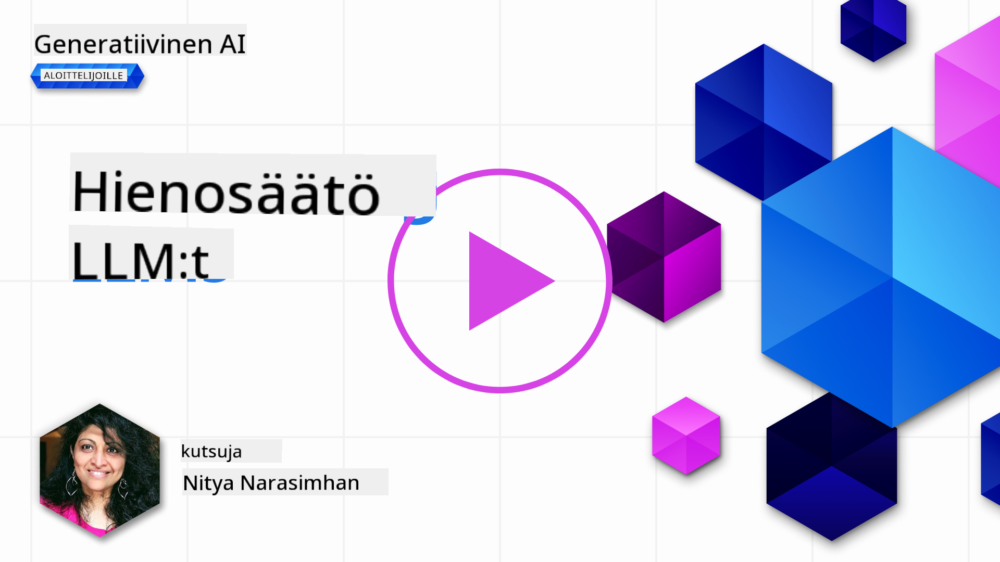
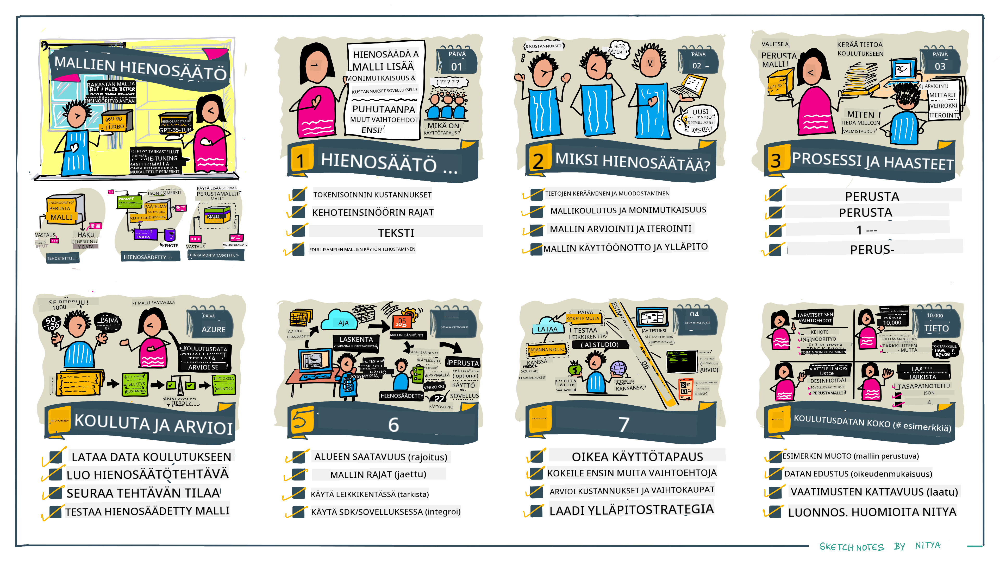

<!--
CO_OP_TRANSLATOR_METADATA:
{
  "original_hash": "68664f7e754a892ae1d8d5e2b7bd2081",
  "translation_date": "2025-06-26T00:45:14+00:00",
  "source_file": "18-fine-tuning/README.md",
  "language_code": "fi"
}
-->

# LLM:n hienosäätö

Suurten kielimallien käyttö generatiivisten AI-sovellusten rakentamiseen tuo mukanaan uusia haasteita. Tärkeä kysymys on varmistaa vastauksen laatu (tarkkuus ja osuvuus) mallin tuottamassa sisällössä käyttäjän pyynnön perusteella. Aiemmissa oppitunneissa käsittelimme tekniikoita kuten promptien suunnittelu ja hakutulosten rikastettu generointi, jotka yrittävät ratkaista ongelman _muokkaamalla mallin syötettä_.

Tämän päivän oppitunnilla käsittelemme kolmatta tekniikkaa, **hienosäätöä**, joka yrittää ratkaista haasteen _kouluttamalla mallia uudelleen_ lisätietojen avulla. Sukelletaan yksityiskohtiin.

## Oppimistavoitteet

Tämä oppitunti esittelee hienosäädön käsitteen esikoulutetuille kielimalleille, tutkii tämän lähestymistavan etuja ja haasteita, sekä antaa ohjeita siitä, milloin ja miten käyttää hienosäätöä parantaaksesi generatiivisten AI-mallien suorituskykyä.

Oppitunnin lopussa sinun tulisi pystyä vastaamaan seuraaviin kysymyksiin:

- Mitä on hienosäätö kielimalleille?
- Milloin ja miksi hienosäätö on hyödyllistä?
- Kuinka voin hienosäätää esikoulutetun mallin?
- Mitkä ovat hienosäädön rajoitukset?

Valmis? Aloitetaan.

## Kuvitettu opas

Haluatko saada yleiskuvan siitä, mitä käsittelemme ennen kuin sukellamme syvemmälle? Tutustu tähän kuvitettuun oppaaseen, joka kuvaa oppimismatkan tämän oppitunnin osalta - ydinajatusten ja motivaation oppimisesta hienosäätöön, prosessin ymmärtämiseen ja parhaisiin käytäntöihin hienosäätötehtävän suorittamiseksi. Tämä on kiehtova aihe tutkimiseen, joten muista tarkistaa [Resurssit](./RESOURCES.md?WT.mc_id=academic-105485-koreyst) -sivu saadaksesi lisälinkkejä itseohjautuvaan oppimismatkaasi!

## Mitä on hienosäätö kielimalleille?

Määritelmän mukaan suuret kielimallit ovat _esikoulutettuja_ suurilla määrillä tekstiä, jotka on kerätty monipuolisista lähteistä, mukaan lukien internet. Kuten olemme oppineet aiemmissa oppitunneissa, tarvitsemme tekniikoita kuten _promptien suunnittelu_ ja _hakutulosten rikastettu generointi_ parantaaksemme mallin vastausten laatua käyttäjän kysymyksiin ("prompteihin").

Suosittu promptien suunnittelutekniikka sisältää mallille enemmän ohjeistusta siitä, mitä vastaukselta odotetaan joko antamalla _ohjeita_ (selkeä ohjeistus) tai _antamalla muutamia esimerkkejä_ (epäsuora ohjeistus). Tätä kutsutaan _few-shot oppimiseksi_, mutta sillä on kaksi rajoitusta:

- Mallin token-rajoitukset voivat rajoittaa annettavien esimerkkien määrää ja rajoittaa tehokkuutta.
- Mallin token-kustannukset voivat tehdä esimerkkien lisäämisen jokaiseen promptiin kalliiksi ja rajoittaa joustavuutta.

Hienosäätö on yleinen käytäntö koneoppimisjärjestelmissä, joissa otamme esikoulutetun mallin ja koulutamme sen uudelleen uusilla tiedoilla parantaaksemme sen suorituskykyä tietyssä tehtävässä. Kielimallien kontekstissa voimme hienosäätää esikoulutetun mallin _kuratoidulla joukolla esimerkkejä tiettyä tehtävää tai sovellusaluetta varten_ luodaksemme **räätälöidyn mallin**, joka voi olla tarkempi ja osuvampi kyseiselle tehtävälle tai alueelle. Hienosäädön sivuetuna on, että se voi myös vähentää tarvittavien esimerkkien määrää few-shot oppimiseen - vähentäen token-käyttöä ja siihen liittyviä kustannuksia.

## Milloin ja miksi meidän pitäisi hienosäätää malleja?

Tässä kontekstissa, kun puhumme hienosäädöstä, viittaamme **valvottuun** hienosäätöön, jossa uudelleenkoulutus tehdään **lisäämällä uusia tietoja**, jotka eivät olleet osa alkuperäistä koulutusdatasettiä. Tämä eroaa valvomattomasta hienosäätömenetelmästä, jossa mallia koulutetaan uudelleen alkuperäisillä tiedoilla, mutta eri hyperparametreilla.

Tärkeää on muistaa, että hienosäätö on edistynyt tekniikka, joka vaatii tietyn tason asiantuntemusta haluttujen tulosten saavuttamiseksi. Jos se tehdään väärin, se ei välttämättä tarjoa odotettuja parannuksia, ja saattaa jopa heikentää mallin suorituskykyä kohdealueellasi.

Joten ennen kuin opit "miten" hienosäätää kielimalleja, sinun on tiedettävä "miksi" sinun pitäisi valita tämä reitti ja "milloin" aloittaa hienosäätöprosessi. Aloita kysymällä itseltäsi nämä kysymykset:

- **Käyttötapaus**: Mikä on _käyttötapauksesi_ hienosäädölle? Mitä nykyisen esikoulutetun mallin osa-aluetta haluat parantaa?
- **Vaihtoehdot**: Oletko kokeillut _muita tekniikoita_ saavuttaaksesi halutut tulokset? Käytä niitä vertailutason luomiseen.
  - Promptien suunnittelu: Kokeile tekniikoita kuten muutama esimerkkiprompti relevanttien vastausten kanssa. Arvioi vastausten laatu.
  - Hakutulosten rikastettu generointi: Kokeile rikastaa promptit hakutuloksilla, jotka on saatu etsimällä tietojasi. Arvioi vastausten laatu.
- **Kustannukset**: Oletko tunnistanut hienosäädön kustannukset?
  - Säädettävyys - onko esikoulutettu malli saatavilla hienosäätöön?
  - Ponnistus - koulutusaineiston valmistelu, mallin arviointi ja hienosäätö.
  - Laskenta - hienosäätötehtävien suorittaminen ja hienosäädetyn mallin käyttöönotto
  - Tiedot - riittävän laadukkaiden esimerkkien saatavuus hienosäätövaikutuksen aikaansaamiseksi
- **Hyödyt**: Oletko vahvistanut hienosäädön hyödyt?
  - Laatu - ylittääkö hienosäädetty malli vertailutason?
  - Kustannus - vähentääkö se token-käyttöä yksinkertaistamalla promptit?
  - Laajennettavuus - voiko perusmallia käyttää uusiin alueisiin?

Vastaamalla näihin kysymyksiin sinun pitäisi pystyä päättämään, onko hienosäätö oikea lähestymistapa käyttötapauksellesi. Ihanteellisesti lähestymistapa on validi vain, jos hyödyt ylittävät kustannukset. Kun päätät jatkaa, on aika miettiä _kuinka_ voit hienosäätää esikoulutetun mallin.

Haluatko saada lisää näkemyksiä päätöksentekoprosessista? Katso [Hienosäätääkö vai ei](https://www.youtube.com/watch?v=0Jo-z-MFxJs)

## Kuinka voimme hienosäätää esikoulutetun mallin?

Hienosäätääksesi esikoulutetun mallin, sinulla tulee olla:

- esikoulutettu malli hienosäätöä varten
- datasetti hienosäätöä varten
- koulutusympäristö hienosäätötehtävän suorittamiseen
- isännöintiympäristö hienosäädetyn mallin käyttöönottoon

## Hienosäätö käytännössä

Seuraavat resurssit tarjoavat vaiheittaisia opetusohjelmia, jotka opastavat sinut läpi todellisen esimerkin valitun mallin ja kuratoidun datasetin avulla. Käydäksesi läpi nämä opetusohjelmat, tarvitset tilin kyseisellä palveluntarjoajalla, sekä pääsyn relevanttiin malliin ja datasetteihin.

| Palveluntarjoaja | Opetusohjelma                                                                                                                                                                       | Kuvaus                                                                                                                                                                                                                                                                                                                                                                                                                        |
| ---------------- | ----------------------------------------------------------------------------------------------------------------------------------------------------------------------------------- | ---------------------------------------------------------------------------------------------------------------------------------------------------------------------------------------------------------------------------------------------------------------------------------------------------------------------------------------------------------------------------------------------------------------------------------- |
| OpenAI           | [Kuinka hienosäätää chat-malleja](https://github.com/openai/openai-cookbook/blob/main/examples/How_to_finetune_chat_models.ipynb?WT.mc_id=academic-105485-koreyst)                   | Opettele hienosäätämään `gpt-35-turbo` tietylle alueelle ("reseptiassistentti") valmistelemalla koulutusaineistoa, suorittamalla hienosäätötehtävä, ja käyttämällä hienosäädettyä mallia päätelmissä.                                                                                                                                                                                                                                              |
| Azure OpenAI     | [GPT 3.5 Turbo hienosäätöopetusohjelma](https://learn.microsoft.com/azure/ai-services/openai/tutorials/fine-tune?tabs=python-new%2Ccommand-line?WT.mc_id=academic-105485-koreyst)   | Opettele hienosäätämään `gpt-35-turbo-0613` mallia **Azurella** tekemällä vaiheita koulutusaineiston luomiseksi ja lataamiseksi, suorittamalla hienosäätötehtävä. Ota käyttöön ja käytä uutta mallia.                                                                                                                                                                                                                                                                 |
| Hugging Face     | [LLM:n hienosäätö Hugging Facella](https://www.philschmid.de/fine-tune-llms-in-2024-with-trl?WT.mc_id=academic-105485-koreyst)                                                     | Tämä blogikirjoitus opastaa sinut hienosäädössä _avoimen LLM:n_ (esim. `CodeLlama 7B`) käyttämällä [transformers](https://huggingface.co/docs/transformers/index?WT.mc_id=academic-105485-koreyst) kirjastoa ja [Transformer Reinforcement Learning (TRL)](https://huggingface.co/docs/trl/index?WT.mc_id=academic-105485-koreyst]) avoimilla [dataseteilla](https://huggingface.co/docs/datasets/index?WT.mc_id=academic-105485-koreyst) Hugging Facessa. |
|                  |                                                                                                                                                                                     |                                                                                                                                                                                                                                                                                                                                                                                                                                    |
| 🤗 AutoTrain     | [LLM:n hienosäätö AutoTrainilla](https://github.com/huggingface/autotrain-advanced/?WT.mc_id=academic-105485-koreyst)                                                             | AutoTrain (tai AutoTrain Advanced) on Hugging Facen kehittämä python-kirjasto, joka mahdollistaa hienosäädön monille eri tehtäville, mukaan lukien LLM:n hienosäätö. AutoTrain on kooditon ratkaisu ja hienosäätö voidaan tehdä omassa pilvessä, Hugging Face Spacesissa tai paikallisesti. Se tukee sekä web-pohjaista käyttöliittymää, CLI:tä että koulutusta yaml-konfiguraatiotiedostojen avulla.                                                                               |
|                  |                                                                                                                                                                                     |                                                                                                                                                                                                                                                                                                                                                                                                                                    |

## Tehtävä

Valitse yksi yllä olevista opetusohjelmista ja käy ne läpi. _Saatamme kopioida version näistä opetusohjelmista Jupyter Notebooks -muodossa tässä repossa vain viitteeksi. Käytä alkuperäisiä lähteitä suoraan saadaksesi uusimmat versiot_.

## Hienoa työtä! Jatka oppimista.

Tämän oppitunnin jälkeen tutustu [Generatiivisen AI:n oppimiskokoelmaan](https://aka.ms/genai-collection?WT.mc_id=academic-105485-koreyst) jatkaaksesi Generatiivisen AI:n tietämyksen kartuttamista!

Onnittelut!! Olet suorittanut v2-sarjan viimeisen oppitunnin tästä kurssista! Älä lopeta oppimista ja rakentamista. \*\*Tutustu [RESURSSIT](RESOURCES.md?WT.mc_id=academic-105485-koreyst) -sivuun saadaksesi lisäehdotuksia juuri tästä aiheesta.

V1-sarjamme oppitunteja on myös päivitetty lisäämällä tehtäviä ja käsitteitä. Joten ota hetki aikaa virkistääksesi tietämystäsi - ja ole hyvä [ja jaa kysymyksesi ja palautteesi](https://github.com/microsoft/generative-ai-for-beginners/issues?WT.mc_id=academic-105485-koreyst) auttaaksesi meitä parantamaan näitä oppitunteja yhteisölle.

**Vastuuvapauslauseke**:  
Tämä asiakirja on käännetty käyttäen AI-käännöspalvelua [Co-op Translator](https://github.com/Azure/co-op-translator). Vaikka pyrimme tarkkuuteen, huomioithan, että automaattiset käännökset voivat sisältää virheitä tai epätarkkuuksia. Alkuperäistä asiakirjaa sen alkuperäisellä kielellä tulisi pitää auktoriteettina. Kriittisen tiedon osalta suositellaan ammattimaista ihmiskäännöstä. Emme ole vastuussa väärinkäsityksistä tai virhetulkinnoista, jotka johtuvat tämän käännöksen käytöstä.