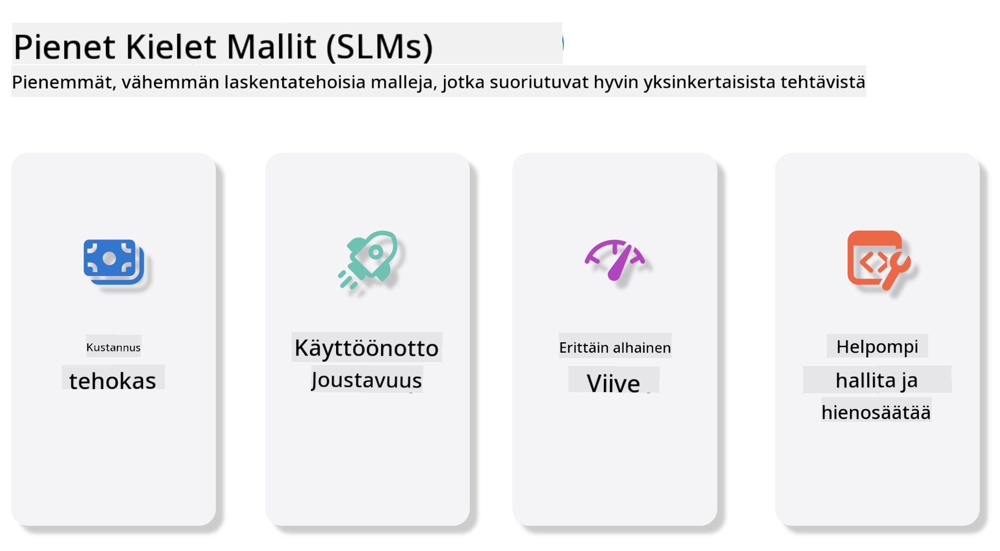
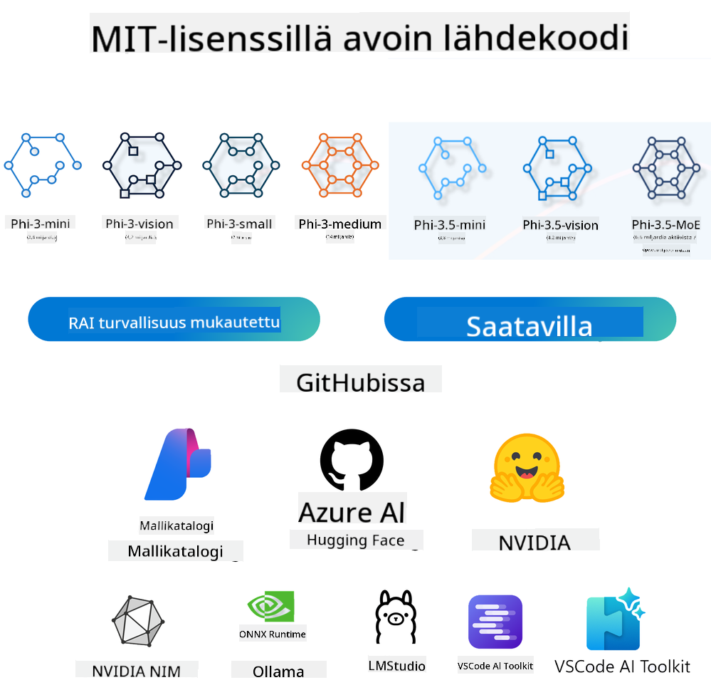

<!--
CO_OP_TRANSLATOR_METADATA:
{
  "original_hash": "124ad36cfe96f74038811b6e2bb93e9d",
  "translation_date": "2025-05-20T10:06:33+00:00",
  "source_file": "19-slm/README.md",
  "language_code": "fi"
}
-->
# Johdanto generatiivisiin tekoälyn pieniin kielimalleihin aloittelijoille

Generatiivinen tekoäly on kiehtova tekoälyn ala, joka keskittyy luomaan järjestelmiä, jotka pystyvät tuottamaan uutta sisältöä. Tämä sisältö voi vaihdella tekstistä ja kuvista musiikkiin ja jopa kokonaisiin virtuaalisiin ympäristöihin. Yksi jännittävimmistä generatiivisen tekoälyn sovelluksista on kielimallien alueella.

## Mitä ovat pienet kielimallit?

Pieni kielimalli (SLM) edustaa suurten kielimallien (LLM) pienennettyä muunnelmaa, hyödyntäen monia LLM:ien arkkitehtonisia periaatteita ja tekniikoita samalla kun sillä on merkittävästi pienempi laskennallinen jalanjälki. SLM:t ovat kielimallien alaryhmä, jotka on suunniteltu tuottamaan ihmismäistä tekstiä. Toisin kuin suuremmat vastineensa, kuten GPT-4, SLM:t ovat kompaktimpia ja tehokkaampia, mikä tekee niistä ihanteellisia sovelluksiin, joissa laskennalliset resurssit ovat rajalliset. Huolimatta pienemmästä koostaan ne voivat silti suorittaa erilaisia tehtäviä. Tyypillisesti SLM:t rakennetaan puristamalla tai tislaamalla LLM:iä, pyrkien säilyttämään merkittävän osan alkuperäisen mallin toiminnallisuudesta ja kielellisistä kyvyistä. Tämä mallin koon vähennys vähentää kokonaiskompleksisuutta, mikä tekee SLM:stä tehokkaampia sekä muistin käytön että laskennallisten vaatimusten osalta. Näistä optimoinneista huolimatta SLM:t voivat silti suorittaa laajan valikoiman luonnollisen kielen käsittelyn (NLP) tehtäviä:

- Tekstin tuottaminen: Luodaan johdonmukaisia ja kontekstiin sopivia lauseita tai kappaleita.
- Tekstin täydentäminen: Ennustetaan ja täydennetään lauseita annetun kehotteen perusteella.
- Kääntäminen: Tekstin muuntaminen yhdestä kielestä toiseen.
- Tiivistäminen: Pitkien tekstikappaleiden tiivistäminen lyhyemmiksi, helpommin ymmärrettäviksi tiivistelmiksi.

Vaikka suorituskyvyssä tai ymmärryksen syvyydessä voi olla kompromisseja verrattuna suurempiin vastineisiinsa.

## Kuinka pienet kielimallit toimivat?

SLM:t koulutetaan valtavilla tekstidatamäärillä. Koulutuksen aikana ne oppivat kielen malleja ja rakenteita, mikä mahdollistaa tekstin tuottamisen, joka on sekä kieliopillisesti oikein että kontekstiin sopivaa. Koulutusprosessi sisältää:

- Datan kerääminen: Suurten tekstidatasetien kerääminen eri lähteistä.
- Esikäsittely: Datan puhdistaminen ja järjestäminen, jotta se soveltuu koulutukseen.
- Koulutus: Koneoppimisalgoritmien käyttö mallin opettamiseksi ymmärtämään ja tuottamaan tekstiä.
- Hienosäätö: Mallin säätäminen sen suorituskyvyn parantamiseksi tietyissä tehtävissä.

SLM:ien kehitys vastaa kasvavaa tarvetta malleille, jotka voidaan ottaa käyttöön resurssirajoitteisissa ympäristöissä, kuten mobiililaitteissa tai reunalaskenta-alustoilla, joissa täysimittaiset LLM:t voivat olla epäkäytännöllisiä niiden raskaiden resurssivaatimusten vuoksi. Keskittymällä tehokkuuteen SLM:t tasapainottavat suorituskyvyn ja saavutettavuuden, mahdollistaen laajemman soveltamisen eri aloilla.



## Oppimistavoitteet

Tässä oppitunnissa toivomme esittelevämme SLM:n tietämystä ja yhdistävän sen Microsoft Phi-3:een oppiaksemme erilaisia skenaarioita tekstisisällössä, visiossa ja MoE:ssa. Tämän oppitunnin lopussa sinun pitäisi pystyä vastaamaan seuraaviin kysymyksiin:

- Mikä on SLM
- Mikä on ero SLM:n ja LLM:n välillä
- Mikä on Microsoft Phi-3/3.5 -perhe
- Kuinka tehdä johtopäätöksiä Microsoft Phi-3/3.5 -perheestä

Valmis? Aloitetaan.

## Suurten kielimallien (LLM) ja pienten kielimallien (SLM) erot

Sekä LLM:t että SLM:t perustuvat todennäköiseen koneoppimiseen, noudattaen samankaltaisia lähestymistapoja niiden arkkitehtonisessa suunnittelussa, koulutusmetodologioissa, datan tuottamisprosesseissa ja mallin arviointitekniikoissa. Kuitenkin useat keskeiset tekijät erottavat nämä kaksi mallityyppiä.

## Pienten kielimallien sovellukset

SLM:illä on laaja valikoima sovelluksia, mukaan lukien:

- Chatbotit: Tarjoavat asiakastukea ja osallistuvat käyttäjien kanssa keskustelunomaisesti.
- Sisällön luominen: Avustavat kirjoittajia ideoiden luomisessa tai jopa koko artikkelien luonnostelussa.
- Koulutus: Auttaa opiskelijoita kirjoitustehtävissä tai uusien kielten oppimisessa.
- Saavutettavuus: Luovat työkaluja henkilöille, joilla on vammaisuuksia, kuten tekstistä puheeksi -järjestelmiä.

**Koko**

Pääasiallinen ero LLM:ien ja SLM:ien välillä on mallien mittakaavassa. LLM:t, kuten ChatGPT (GPT-4), voivat sisältää arviolta 1,76 biljoonaa parametria, kun taas avoimen lähdekoodin SLM:t, kuten Mistral 7B, on suunniteltu merkittävästi pienemmillä parametreilla - noin 7 miljardia. Tämä ero johtuu pääasiassa eroista mallin arkkitehtuurissa ja koulutusprosesseissa. Esimerkiksi ChatGPT käyttää itsehuomiomekanismia kooderin-dekooderin kehyksessä, kun taas Mistral 7B käyttää liukuva ikkuna -huomiota, mikä mahdollistaa tehokkaamman koulutuksen dekooderi-vain-mallissa. Tämä arkkitehtoninen vaihtelu vaikuttaa syvästi näiden mallien monimutkaisuuteen ja suorituskykyyn.

**Ymmärrys**

SLM:t on tyypillisesti optimoitu suorituskykyyn tietyissä alueissa, mikä tekee niistä erittäin erikoistuneita, mutta mahdollisesti rajoitettuja kyvyssään tarjota laajaa kontekstuaalista ymmärrystä useilla tieteenaloilla. Sen sijaan LLM:t pyrkivät simuloimaan ihmismäistä älykkyyttä kattavammalla tasolla. Ne on koulutettu valtavilla, monipuolisilla datasetillä, ja ne on suunniteltu suoriutumaan hyvin monenlaisilla alueilla, tarjoten suurempaa monipuolisuutta ja mukautuvuutta. Näin ollen LLM:t soveltuvat paremmin laajempaan valikoimaan jälkikäsittelytehtäviä, kuten luonnollisen kielen käsittelyyn ja ohjelmointiin.

**Laskenta**

LLM:ien koulutus ja käyttöönotto ovat resurssi-intensiivisiä prosesseja, jotka vaativat usein merkittävää laskennallista infrastruktuuria, mukaan lukien laajamittaisia GPU-klustereita. Esimerkiksi mallin kuten ChatGPT kouluttaminen alusta alkaen voi vaatia tuhansia GPU:ita pitkien aikojen ajan. Toisaalta SLM:t, pienemmillä parametrimäärillään, ovat helpommin saavutettavissa laskennallisten resurssien suhteen. Mistral 7B:n kaltaiset mallit voidaan kouluttaa ja ajaa paikallisilla koneilla, jotka on varustettu kohtuullisilla GPU-ominaisuuksilla, vaikka koulutus vaatii edelleen useita tunteja useilla GPU:illa.

**Harha**

Harha on tunnettu ongelma LLM:issä, pääasiassa koulutusdatan luonteen vuoksi. Nämä mallit luottavat usein raakaan, avoimesti saatavilla olevaan dataan internetistä, mikä voi aliedustaa tai väärin edustaa tiettyjä ryhmiä, aiheuttaa virheellistä merkintää tai heijastaa kielellisiä ennakkoluuloja, jotka johtuvat murteista, maantieteellisistä vaihteluista ja kielioppisäännöistä. Lisäksi LLM-arkkitehtuurien monimutkaisuus voi tahattomasti pahentaa harhaa, mikä voi jäädä huomaamatta ilman huolellista hienosäätöä. Toisaalta SLM:t, jotka on koulutettu rajatummilla, alakohtaisilla dataseteillä, ovat luontaisesti vähemmän alttiita tällaisille harhoille, vaikka ne eivät ole immuuneja niille.

**Päätteleminen**

SLM:ien pienempi koko antaa niille merkittävän edun päätöksenteon nopeudessa, jolloin ne voivat tuottaa tuloksia tehokkaasti paikallisella laitteistolla ilman laajamittaista rinnakkaislaskentaa. Toisaalta LLM:t, kokonsa ja monimutkaisuutensa vuoksi, vaativat usein merkittäviä rinnakkaislaskentaresursseja hyväksyttävien päätösaikojen saavuttamiseksi. Useiden samanaikaisten käyttäjien läsnäolo hidastaa entisestään LLM:ien vasteaikoja, erityisesti kun ne otetaan käyttöön laajassa mittakaavassa.

Yhteenvetona, vaikka sekä LLM:illä että SLM:illä on yhteinen perusta koneoppimisessa, ne eroavat merkittävästi mallin koossa, resurssivaatimuksissa, kontekstuaalisessa ymmärryksessä, alttiudessa harhalle ja päätöksenteon nopeudessa. Nämä erot heijastavat niiden soveltuvuutta eri käyttötapauksiin, LLM:ien ollessa monipuolisempia mutta resurssi-intensiivisempiä, ja SLM:ien tarjotessa enemmän alakohtaista tehokkuutta pienemmillä laskennallisilla vaatimuksilla.

***Huomautus: Tässä luvussa esittelemme SLM:in käyttäen esimerkkinä Microsoft Phi-3 / 3.5 -mallia.***

## Phi-3 / Phi-3.5 -perheen esittely

Phi-3 / 3.5 -perhe keskittyy pääasiassa tekstin, vision ja agentin (MoE) sovellusskenaarioihin:

### Phi-3 / 3.5 Instruct

Pääasiassa tekstin tuottamiseen, keskustelun täydentämiseen ja sisällön tietojen poimintaan, jne.

**Phi-3-mini**

3.8B kielimalli on saatavilla Microsoft Azure AI Studiossa, Hugging Facessa ja Ollamassa. Phi-3-mallit ylittävät merkittävästi saman- ja suurempikokoiset kielimallit keskeisissä vertailuarvoissa (katso vertailuarvot alla, suuremmat numerot ovat parempia). Phi-3-mini ylittää kaksinkertaisen kokoiset mallit, kun taas Phi-3-small ja Phi-3-medium ylittävät suuremmat mallit, mukaan lukien GPT-3.5.

**Phi-3-small & medium**

Vain 7B parametreilla Phi-3-small voittaa GPT-3.5T:n erilaisissa kieli-, päättely-, koodaus- ja matemaattisissa vertailuarvoissa. Phi-3-medium, jossa on 14B parametreja, jatkaa tätä trendiä ja ylittää Gemini 1.0 Pro:n.

**Phi-3.5-mini**

Voimme ajatella sitä Phi-3-minin päivityksenä. Vaikka parametrit pysyvät ennallaan, se parantaa kykyä tukea useita kieliä (tukee yli 20 kieltä: arabia, kiina, tšekki, tanska, hollanti, englanti, suomi, ranska, saksa, heprea, unkari, italia, japani, korea, norja, puola, portugali, venäjä, espanja, ruotsi, thai, turkki, ukraina) ja lisää vahvemman tuen pitkille konteksteille. Phi-3.5-mini, jossa on 3.8B parametreja, ylittää samankokoiset kielimallit ja on samalla tasolla kaksinkertaisen kokoisten mallien kanssa.

### Phi-3 / 3.5 Vision

Voimme ajatella Phi-3/3.5:n Instruct-mallia Phin kyvyksi ymmärtää, ja Vision on se, mikä antaa Phille silmät ymmärtää maailmaa.

**Phi-3-Vision**

Phi-3-vision, jossa on vain 4.2B parametreja, jatkaa tätä trendiä ja ylittää suuremmat mallit, kuten Claude-3 Haiku ja Gemini 1.0 Pro V yleisissä visuaalisen päättelyn tehtävissä, OCR:ssä ja taulukko- ja kaaviotulkintatehtävissä.

**Phi-3.5-Vision**

Phi-3.5-Vision on myös Phi-3-Visionin päivitys, joka lisää tuen useille kuville. Voit ajatella sitä parannuksena visioon, ei vain kuvien näkemiseen, vaan myös videoiden. Phi-3.5-vision ylittää suuremmat mallit, kuten Claude-3.5 Sonnet ja Gemini 1.5 Flash OCR-, taulukko- ja kaavioiden ymmärtämistehtävissä ja on samalla tasolla yleisissä visuaalisen tiedon päättelytehtävissä. Tukee monikehyksistä syötettä, ts. suorittaa päättelyä useilla syöttökuvilla.

### Phi-3.5-MoE

***Mixture of Experts (MoE)*** mahdollistaa mallien esikoulutuksen huomattavasti vähemmällä laskennalla, mikä tarkoittaa, että voit laajentaa mallin tai datasetin kokoa dramaattisesti samalla laskentabudjetilla kuin tiheällä mallilla. Erityisesti MoE-mallin pitäisi saavuttaa sama laatu kuin sen tiheä vastine paljon nopeammin esikoulutuksen aikana. Phi-3.5-MoE koostuu 16x3.8B asiantuntijamoduulista. Phi-3.5-MoE, jossa on vain 6.6B aktiivisia parametreja, saavuttaa samanlaisen tason päättelyssä, kielen ymmärtämisessä ja matematiikassa kuin paljon suuremmat mallit.

Voimme käyttää Phi-3/3.5-perheen mallia eri skenaarioiden perusteella. Toisin kuin LLM, voit ottaa käyttöön Phi-3/3.5-minin tai Phi-3/3.5-Visionin reunalaitteilla.

## Kuinka käyttää Phi-3/3.5-perheen malleja

Toivomme käyttävämme Phi-3/3.5:tä eri skenaarioissa. Seuraavaksi käytämme Phi-3/3.5:tä eri skenaarioiden perusteella.



### Päätöksenteon ero

Pilven API

**GitHub-mallit**

GitHub
Mallit ovat suoraviivaisin tapa. Voit nopeasti käyttää Phi-3/3.5-Instruct-mallia GitHub Mallien kautta. Yhdistettynä Azure AI Inference SDK:han / OpenAI SDK:han voit käyttää API:a koodin kautta suorittaaksesi Phi-3/3.5-Instruct-kutsun. Voit myös testata erilaisia vaikutuksia Playgroundin kautta. - Demo: Phi-3-minin ja Phi-3.5-minin vaikutusten vertailu kiinalaisissa skenaarioissa   **Azure AI Studio** Tai jos haluamme käyttää vision- ja MoE-malleja, voit käyttää Azure AI Studiota suorittaaksesi kutsun. Jos olet kiinnostunut, voit lukea Phi-3 Cookbookin oppiaksesi, kuinka kutsua Phi-3/3.5 Instruct, Vision, MoE Azure AI Studion kautta [Napsauta tätä linkkiä](https://github.com/microsoft/Phi-3CookBook/blob/main/md/02.QuickStart/AzureAIStudio_QuickStart.md?WT.mc_id=academic-105485-koreyst) **NVIDIA NIM** Azure ja GitHubin tarjoamien pilvipohjaisten Mallikatalogiratkaisujen lisäksi voit myös käyttää [Nivida NIM](https://developer.nvidia.com/nim?WT.mc_id=academic-105485-koreyst) suorittaaksesi liittyvät kutsut. Voit käydä NIVIDA NIM:ssä suorittaaksesi Phi-3/3.5 Family API-kutsut. NVIDIA NIM (NVIDIA Inference Microservices) on joukko kiihdytettyjä inferenssimikropalveluja, jotka on suunniteltu auttamaan kehittäjiä ottamaan AI-mallit tehokkaasti käyttöön eri ympäristöissä, mukaan lukien pilvet, datakeskukset ja työasemat. Tässä on joitain keskeisiä ominaisuuksia NVIDIA NIM:stä: - **Helppo käyttöönotto:** NIM mahdollistaa AI-mallien käyttöönoton yhdellä komennolla, mikä tekee siitä helpon integroida olemassa oleviin työnkulkuihin. - **Optimoitu suorituskyky:** Se hyödyntää NVIDIA:n esivalmistettuja inferenssimoottoreita, kuten TensorRT ja TensorRT-LLM, varmistaakseen matalan viiveen ja korkean läpimenon. - **Skaalautuvuus:** NIM tukee Kubernetesin automaattista skaalautumista, jolloin se voi käsitellä vaihtelevia työkuormia tehokkaasti. - **Turvallisuus ja hallinta:** Organisaatiot voivat säilyttää hallinnan tiedoistaan ja sovelluksistaan isännöimällä NIM-mikropalveluja omalla hallitulla infrastruktuurillaan. - **Standardoidut API:t:** NIM tarjoaa teollisuusstandardien mukaisia API:ita, mikä tekee siitä helpon rakentaa ja integroida AI-sovelluksia, kuten chatbotteja, AI-avustajia ja muuta. NIM on osa NVIDIA AI Enterprisea, jonka tavoitteena on yksinkertaistaa AI-mallien käyttöönottoa ja operointia, varmistaen niiden tehokkaan toiminnan NVIDIA GPU:illa. - Demo: Nividia NIM:n käyttäminen Phi-3.5-Vision-API:n kutsumiseen [[Napsauta tätä linkkiä](../../../19-slm/python/Phi-3-Vision-Nividia-NIM.ipynb)] ### Inferenssi Phi-3/3.5 paikallisessa ympäristössä Inferenssi liittyen Phi-3:een tai mihin tahansa kielimalliin, kuten GPT-3:een, viittaa prosessiin, jossa tuotetaan vastauksia tai ennusteita saatujen syötteiden perusteella. Kun annat kehotteen tai kysymyksen Phi-3:lle, se käyttää koulutettua neuroverkkoaan päättelemään todennäköisimmän ja relevantin vastauksen analysoimalla koulutusaineistonsa kuvioita ja suhteita. **Hugging Face Transformer** Hugging Face Transformers on tehokas kirjasto, joka on suunniteltu luonnollisen kielen käsittelyyn (NLP) ja muihin koneoppimistehtäviin. Tässä on joitain keskeisiä kohtia siitä: 1. **Esikoulutetut mallit**: Se tarjoaa tuhansia esikoulutettuja malleja, joita voidaan käyttää eri tehtäviin, kuten tekstiluokitteluun, nimettyjen entiteettien tunnistukseen, kysymyksiin vastaamiseen, tiivistämiseen, kääntämiseen ja tekstin tuottamiseen. 2. **Kehysten yhteensopivuus**: Kirjasto tukee useita syväoppimiskehyksiä, mukaan lukien PyTorch, TensorFlow ja JAX. Tämä mahdollistaa mallin kouluttamisen yhdessä kehyksessä ja sen käyttämisen toisessa. 3. **Monimodaaliset kyvyt**: NLP:n lisäksi Hugging Face Transformers tukee myös tehtäviä tietokonevisiossa (esim. kuvien luokittelu, objektien tunnistus) ja äänenkäsittelyssä (esim. puheentunnistus, äänen luokittelu). 4. **Helppokäyttöisyys**: Kirjasto tarjoaa API:ita ja työkaluja mallien helppoon lataamiseen ja hienosäätöön, mikä tekee siitä saavutettavan sekä aloittelijoille että asiantuntijoille. 5. **Yhteisö ja resurssit**: Hugging Face:llä on elinvoimainen yhteisö ja laaja dokumentaatio, tutoriaalit ja oppaat auttamaan käyttäjiä pääsemään alkuun ja hyödyntämään kirjastoa parhaalla mahdollisella tavalla. [virallinen dokumentaatio](https://huggingface.co/docs/transformers/index?WT.mc_id=academic-105485-koreyst) tai heidän [GitHub-repositorio](https://github.com/huggingface/transformers?WT.mc_id=academic-105485-koreyst). Tämä on yleisimmin käytetty menetelmä, mutta se vaatii myös GPU-kiihdytystä. Loppujen lopuksi Visionin ja MoE:n kaltaiset kohtaukset vaativat paljon laskentaa, mikä on hyvin rajoitettua CPU:ssa, jos niitä ei kvantisoida. - Demo: Transformerilla Phi-3.5-Instuctin kutsuminen [Napsauta tätä linkkiä](../../../19-slm/python/phi35-instruct-demo.ipynb) - Demo: Transformerilla Phi-3.5-Visionin kutsuminen[Napsauta tätä linkkiä](../../../19-slm/python/phi35-vision-demo.ipynb) - Demo: Transformerilla Phi-3.5-MoE:n kutsuminen[Napsauta tätä linkkiä](../../../19-slm/python/phi35_moe_demo.ipynb) **Ollama** [Ollama](https://ollama.com/?WT.mc_id=academic-105485-koreyst) on alusta, joka on suunniteltu helpottamaan suurten kielimallien (LLM) ajamista paikallisesti koneellasi. Se tukee erilaisia malleja, kuten Llama 3.1, Phi 3, Mistral ja Gemma 2, muiden muassa. Alusta yksinkertaistaa prosessia yhdistämällä mallipainot, konfiguraation ja datan yhdeksi paketiksi, mikä tekee siitä helpommin saavutettavan käyttäjille mukauttaa ja luoda omia mallejaan. Ollama on saatavilla macOS:lle, Linuxille ja Windowsille. Se on loistava työkalu, jos haluat kokeilla tai ottaa käyttöön LLM:iä ilman pilvipalveluiden käyttöä. Ollama on suoraviivaisin tapa, sinun tarvitsee vain suorittaa seuraava lauseke. ```bash

ollama run phi3.5

``` **ONNX Runtime for GenAI** [ONNX Runtime](https://github.com/microsoft/onnxruntime-genai?WT.mc_id=academic-105485-koreyst) on monialustainen inferenssi- ja koulutus koneoppimiskiihdytin. ONNX Runtime for Generative AI (GENAI) on tehokas työkalu, joka auttaa sinua ajamaan generatiivisia AI-malleja tehokkaasti eri alustoilla. ## Mikä on ONNX Runtime? ONNX Runtime on avoimen lähdekoodin projekti, joka mahdollistaa koneoppimismallien korkean suorituskyvyn inferenssin. Se tukee malleja Open Neural Network Exchange (ONNX) -muodossa, joka on standardi koneoppimismallien esittämiselle.ONNX Runtime -inferenssi voi mahdollistaa nopeammat asiakaskokemukset ja alentaa kustannuksia, tukien malleja syväoppimiskehyksistä, kuten PyTorch ja TensorFlow/Keras sekä perinteisistä koneoppimiskirjastoista, kuten scikit-learn, LightGBM, XGBoost, jne. ONNX Runtime on yhteensopiva eri laitteistojen, ajureiden ja käyttöjärjestelmien kanssa, ja se tarjoaa optimaalisen suorituskyvyn hyödyntämällä laitteistokiihdyttimiä, jos sovellettavissa, yhdessä graafisten optimointien ja muunnosten kanssa ## Mikä on Generatiivinen AI? Generatiivinen AI viittaa AI-järjestelmiin, jotka voivat tuottaa uutta sisältöä, kuten tekstiä, kuvia tai musiikkia, perustuen niihin tietoihin, joilla ne on koulutettu. Esimerkkejä ovat kielimallit, kuten GPT-3, ja kuvageneraatiomallit, kuten Stable Diffusion. ONNX Runtime for GenAI -kirjasto tarjoaa generatiivisen AI-silmukan ONNX-malleille, mukaan lukien inferenssi ONNX Runtime:lla, logits-käsittely, haku ja näytteenotto, sekä KV-välimuistin hallinta. ## ONNX Runtime for GENAI ONNX Runtime for GENAI laajentaa ONNX Runtimen ominaisuuksia tukemaan generatiivisia AI-malleja. Tässä on joitain keskeisiä ominaisuuksia: - **Laaja alustan tuki:** Se toimii eri alustoilla, mukaan lukien Windows, Linux, macOS, Android ja iOS. - **Mallin tuki:** Se tukee monia suosittuja generatiivisia AI-malleja, kuten LLaMA, GPT-Neo, BLOOM ja muita. - **Suorituskyvyn optimointi:** Se sisältää optimointeja eri laitteistokiihdyttimille, kuten NVIDIA GPU:ille, AMD GPU:ille ja muille. - **Helppokäyttöisyys:** Se tarjoaa API:ita helppoon integrointiin sovelluksiin, mahdollistaen tekstin, kuvien ja muun sisällön generoinnin vähäisellä koodilla - Käyttäjät voivat kutsua korkean tason generate()-metodia tai suorittaa mallin jokaisen iteraation silmukassa, generoiden yhden tokenin kerrallaan ja tarvittaessa päivittäen generointiparametreja silmukan sisällä. - ONNX Runtime tukee myös ahneutta/palkkihakua ja TopP, TopK-näytteenottoa token-sekvenssien generoimiseksi ja sisäänrakennettua logits-käsittelyä, kuten toistopenalttia. Voit myös helposti lisätä mukautettua pisteytystä. ## Aloittaminen Aloittaaksesi ONNX Runtime for GENAI:n kanssa, voit seurata näitä vaiheita: ### Asenna ONNX Runtime: ```Python
pip install onnxruntime
``` ### Asenna Generatiivisen AI:n laajennukset: ```Python
pip install onnxruntime-genai
``` ### Suorita malli: Tässä on yksinkertainen esimerkki Pythonissa: ```Python
import onnxruntime_genai as og

model = og.Model('path_to_your_model.onnx')

tokenizer = og.Tokenizer(model)

input_text = "Hello, how are you?"

input_tokens = tokenizer.encode(input_text)

output_tokens = model.generate(input_tokens)

output_text = tokenizer.decode(output_tokens)

print(output_text) 
``` ### Demo: ONNX Runtime GenAI:n käyttäminen Phi-3.5-Visionin kutsumiseen ```python

import onnxruntime_genai as og

model_path = './Your Phi-3.5-vision-instruct ONNX Path'

img_path = './Your Image Path'

model = og.Model(model_path)

processor = model.create_multimodal_processor()

tokenizer_stream = processor.create_stream()

text = "Your Prompt"

prompt = "<|user|>\n"

prompt += "<|image_1|>\n"

prompt += f"{text}<|end|>\n"

prompt += "<|assistant|>\n"

image = og.Images.open(img_path)

inputs = processor(prompt, images=image)

params = og.GeneratorParams(model)

params.set_inputs(inputs)

params.set_search_options(max_length=3072)

generator = og.Generator(model, params)

while not generator.is_done():

    generator.compute_logits()
    
    generator.generate_next_token()

    new_token = generator.get_next_tokens()[0]
    
    code += tokenizer_stream.decode(new_token)
    
    print(tokenizer_stream.decode(new_token), end='', flush=True)

``` **Muut** ONNX Runtimen ja Ollaman viitemenetelmien lisäksi voimme myös suorittaa kvantitatiivisten mallien viittauksen eri valmistajien tarjoamien malliviittausmenetelmien perusteella. Kuten Apple MLX -kehys Apple Metalilla, Qualcomm QNN NPU:lla, Intel OpenVINO CPU/GPU:lla jne. Voit myös saada lisää sisältöä [Phi-3 Cookbookista](https://github.com/microsoft/phi-3cookbook?WT.mc_id=academic-105485-koreyst) ## Lisää Olemme oppineet Phi-3/3.5 Family:n perusteet, mutta oppiaksemme lisää SLM:stä tarvitsemme enemmän tietoa. Löydät vastaukset Phi-3 Cookbookista. Jos haluat oppia lisää, vieraile [Phi-3 Cookbookissa](https://github.com/microsoft/phi-3cookbook?WT.mc_id=academic-105485-koreyst).

**Vastuuvapauslauseke**:  
Tämä asiakirja on käännetty käyttämällä tekoälypohjaista käännöspalvelua [Co-op Translator](https://github.com/Azure/co-op-translator). Pyrimme tarkkuuteen, mutta huomioithan, että automaattiset käännökset voivat sisältää virheitä tai epätarkkuuksia. Alkuperäistä asiakirjaa sen alkuperäisellä kielellä tulisi pitää auktoritatiivisena lähteenä. Kriittisen tiedon osalta suositellaan ammattimaista ihmiskäännöstä. Emme ole vastuussa mahdollisista väärinkäsityksistä tai virhetulkinnoista, jotka johtuvat tämän käännöksen käytöstä.