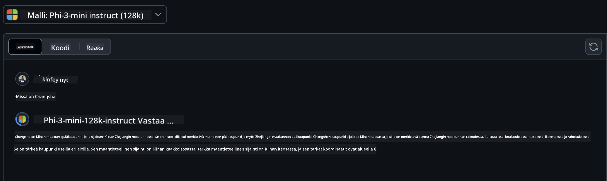
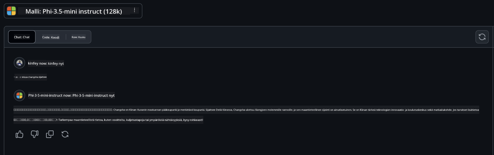

<!--
CO_OP_TRANSLATOR_METADATA:
{
  "original_hash": "124ad36cfe96f74038811b6e2bb93e9d",
  "translation_date": "2025-06-26T02:28:44+00:00",
  "source_file": "19-slm/README.md",
  "language_code": "fi"
}
-->

Mallit ovat suoraviivaisin tapa. Voit nopeasti käyttää Phi-3/3.5-Instruct-mallia GitHub Mallien kautta. Yhdistettynä Azure AI Inference SDK / OpenAI SDK:hen, voit käyttää API:a koodin kautta suorittaaksesi Phi-3/3.5-Instruct-kutsun. Voit myös testata eri vaikutuksia Playgroundin kautta. - Demo: Phi-3-mini ja Phi-3.5-mini vaikutusten vertailu kiinalaisissa skenaarioissa   **Azure AI Studio** Tai jos haluamme käyttää vision- ja MoE-malleja, voit käyttää Azure AI Studiota suorittaaksesi kutsun. Jos olet kiinnostunut, voit lukea Phi-3 Cookbookista, miten kutsua Phi-3/3.5 Instruct, Vision, MoE Azure AI Studion kautta [Klikkaa tätä linkkiä](https://github.com/microsoft/Phi-3CookBook/blob/main/md/02.QuickStart/AzureAIStudio_QuickStart.md?WT.mc_id=academic-105485-koreyst) **NVIDIA NIM** Azure ja GitHubin tarjoamien pilvipohjaisten Model Catalog -ratkaisujen lisäksi voit myös käyttää [Nivida NIM](https://developer.nvidia.com/nim?WT.mc_id=academic-105485-koreyst) suorittaaksesi liittyviä kutsuja. Voit vierailla NIVIDA NIM:ssa suorittaaksesi Phi-3/3.5 Family API-kutsut. NVIDIA NIM (NVIDIA Inference Microservices) on joukko kiihdytettyjä inferenssimikropalveluita, jotka on suunniteltu auttamaan kehittäjiä AI-mallien tehokkaassa käyttöönotossa eri ympäristöissä, kuten pilvissä, datakeskuksissa ja työasemilla. Tässä on joitain NVIDIA NIM:n keskeisiä ominaisuuksia: - **Helppo käyttöönotto:** NIM mahdollistaa AI-mallien käyttöönoton yhdellä komennolla, mikä tekee sen integroimisesta olemassa oleviin työnkulkuihin suoraviivaista. - **Optimoitu suorituskyky:** Se hyödyntää NVIDIA:n ennalta optimoituja inferenssimoottoreita, kuten TensorRT ja TensorRT-LLM, varmistaakseen alhaisen viiveen ja korkean läpäisyn. - **Skaalautuvuus:** NIM tukee Kubernetesin automaattista skaalautumista, mikä mahdollistaa vaihtelevien työkuormien tehokkaan käsittelyn. - **Turvallisuus ja hallinta:** Organisaatiot voivat ylläpitää kontrollia datastaan ja sovelluksistaan isännöimällä NIM-mikropalveluita omalla hallinnoidulla infrastruktuurillaan. - **Standardi API:t:** NIM tarjoaa teollisuusstandardin API:t, mikä tekee AI-sovellusten, kuten chatbotien, AI-avustajien ja muiden, rakentamisesta ja integroimisesta helppoa. NIM on osa NVIDIA AI Enterprisea, jonka tavoitteena on yksinkertaistaa AI-mallien käyttöönottoa ja operointia, varmistaen niiden tehokkaan toiminnan NVIDIA:n GPU:illa. - Demo: Nividia NIM:n käyttäminen Phi-3.5-Vision-API:n kutsumiseen [[Klikkaa tätä linkkiä](../../../19-slm/python/Phi-3-Vision-Nividia-NIM.ipynb)] ### Inferenssi Phi-3/3.5 paikallisessa ympäristössä Inferenssi suhteessa Phi-3:een tai mihin tahansa kielimalliin kuten GPT-3:een viittaa prosessiin, jossa tuotetaan vastauksia tai ennusteita annetun syötteen perusteella. Kun annat kehotteen tai kysymyksen Phi-3:lle, se käyttää koulutettua neuroverkkoaan päätelläkseen todennäköisimmän ja relevantin vastauksen analysoimalla datassa, johon se on koulutettu, esiintyviä kuvioita ja suhteita. **Hugging Face Transformer** Hugging Face Transformers on tehokas kirjasto, joka on suunniteltu luonnollisen kielen käsittelyyn (NLP) ja muihin koneoppimistehtäviin. Tässä on joitain keskeisiä kohtia siitä: 1. **Esikoulutetut mallit**: Se tarjoaa tuhansia esikoulutettuja malleja, joita voidaan käyttää erilaisiin tehtäviin, kuten tekstiluokitteluun, nimettyjen entiteettien tunnistamiseen, kysymysten vastaamiseen, tiivistämiseen, kääntämiseen ja tekstin generointiin. 2. **Framework-yhteensopivuus**: Kirjasto tukee useita syväoppimiskehyksiä, kuten PyTorch, TensorFlow ja JAX. Tämä mahdollistaa mallin kouluttamisen yhdessä kehyksessä ja sen käyttämisen toisessa. 3. **Multimodaaliset ominaisuudet**: NLP:n lisäksi Hugging Face Transformers tukee myös tehtäviä tietokonenäön (esim. kuvien luokittelu, objektien tunnistus) ja äänikäsittelyn (esim. puheentunnistus, ääniluokittelu) parissa. 4. **Helppokäyttöisyys**: Kirjasto tarjoaa API:t ja työkalut mallien helppoon lataamiseen ja hienosäätöön, mikä tekee siitä saavutettavan sekä aloittelijoille että asiantuntijoille. 5. **Yhteisö ja resurssit**: Hugging Face:llä on elinvoimainen yhteisö ja laaja dokumentaatio, tutoriaalit ja oppaat, jotka auttavat käyttäjiä aloittamaan ja hyödyntämään kirjastoa parhaalla mahdollisella tavalla. [virallinen dokumentaatio](https://huggingface.co/docs/transformers/index?WT.mc_id=academic-105485-koreyst) tai heidän [GitHub-repositorionsa](https://github.com/huggingface/transformers?WT.mc_id=academic-105485-koreyst). Tämä on yleisimmin käytetty menetelmä, mutta se vaatii myös GPU-kiihdytystä. Loppujen lopuksi, Vision- ja MoE-skenaariot vaativat paljon laskentaa, mikä on erittäin rajallista CPU:ssa, jos niitä ei kvantisoida. - Demo:Transformerin käyttäminen Phi-3.5-Instuctin kutsumiseen [Klikkaa tätä linkkiä](../../../19-slm/python/phi35-instruct-demo.ipynb) - Demo:Transformerin käyttäminen Phi-3.5-Visionin kutsumiseen[Klikkaa tätä linkkiä](../../../19-slm/python/phi35-vision-demo.ipynb) - Demo:Transformerin käyttäminen Phi-3.5-MoE:n kutsumiseen[Klikkaa tätä linkkiä](../../../19-slm/python/phi35_moe_demo.ipynb) **Ollama** [Ollama](https://ollama.com/?WT.mc_id=academic-105485-koreyst) on alusta, joka on suunniteltu helpottamaan suurten kielimallien (LLM) paikallista ajamista koneellasi. Se tukee erilaisia malleja, kuten Llama 3.1, Phi 3, Mistral ja Gemma 2, muiden muassa. Alusta yksinkertaistaa prosessia pakkaamalla mallin painot, konfiguraation ja datan yhteen pakettiin, mikä tekee siitä käyttäjille helpommin saavutettavan mukauttaa ja luoda omia mallejaan. Ollama on saatavilla macOS:lle, Linuxille ja Windowsille. Se on loistava työkalu, jos haluat kokeilla tai ottaa käyttöön LLM:t ilman pilvipalveluiden riippuvuutta. Ollama on suoraviivaisin tapa, sinun tarvitsee vain suorittaa seuraava lauseke. ```bash

ollama run phi3.5

``` **ONNX Runtime for GenAI** [ONNX Runtime](https://github.com/microsoft/onnxruntime-genai?WT.mc_id=academic-105485-koreyst) on monialustainen inferenssi- ja koulutuskoneoppimisen kiihdytin. ONNX Runtime for Generative AI (GENAI) on tehokas työkalu, joka auttaa sinua ajamaan generatiivisia AI-malleja tehokkaasti eri alustoilla. ## Mikä on ONNX Runtime? ONNX Runtime on avoimen lähdekoodin projekti, joka mahdollistaa koneoppimismallien korkean suorituskyvyn inferenssin. Se tukee malleja Open Neural Network Exchange (ONNX) -formaatissa, joka on standardi koneoppimismallien edustamiselle.ONNX Runtime inferenssi voi mahdollistaa nopeammat asiakaskokemukset ja pienemmät kustannukset tukemalla malleja syväoppimiskehyksistä, kuten PyTorch ja TensorFlow/Keras, sekä klassisista koneoppimiskirjastoista, kuten scikit-learn, LightGBM, XGBoost jne. ONNX Runtime on yhteensopiva eri laitteistojen, ajureiden ja käyttöjärjestelmien kanssa, ja tarjoaa optimaalisen suorituskyvyn hyödyntämällä laitteistokiihdyttimiä, missä mahdollista, rinnalla graafisten optimointien ja muunnosten kanssa ## Mikä on Generative AI? Generative AI viittaa AI-järjestelmiin, jotka voivat luoda uutta sisältöä, kuten tekstiä, kuvia tai musiikkia, perustuen dataan, johon ne on koulutettu. Esimerkkejä ovat kielimallit kuten GPT-3 ja kuvageneraatiomallit kuten Stable Diffusion. ONNX Runtime for GenAI -kirjasto tarjoaa generatiivisen AI-silmukan ONNX-malleille, mukaan lukien inferenssin ONNX Runtime:lla, logiikkakäsittelyn, haun ja näytteenoton sekä KV-välimuistin hallinnan. ## ONNX Runtime for GENAI ONNX Runtime for GENAI laajentaa ONNX Runtime:n kykyjä tukemaan generatiivisia AI-malleja. Tässä on joitain keskeisiä ominaisuuksia: - **Laaja alustan tuki:** Se toimii eri alustoilla, mukaan lukien Windows, Linux, macOS, Android ja iOS. - **Mallien tuki:** Se tukee monia suosittuja generatiivisia AI-malleja, kuten LLaMA, GPT-Neo, BLOOM ja muita. - **Suorituskyvyn optimointi:** Se sisältää optimointeja eri laitteistokiihdyttimille, kuten NVIDIA GPU:t, AMD GPU:t ja muut2. - **Helppokäyttöisyys:** Se tarjoaa API:t helppoon integrointiin sovelluksiin, mikä mahdollistaa tekstin, kuvien ja muun sisällön generoinnin vähäisellä koodilla - Käyttäjät voivat kutsua korkeatasoista generate() -menetelmää tai ajaa mallin jokaista iteraatiota silmukassa, generoiden yhden tokenin kerrallaan ja valinnaisesti päivittää generointiparametreja silmukan sisällä. - ONNX runtime tukee myös ahnetta/sädehakua ja TopP, TopK näytteenottoa token-sekvenssien generoimiseksi sekä sisäänrakennettua logiikkakäsittelyä, kuten toistopenaltiot. Voit myös helposti lisätä mukautettua pisteytystä. ## Aloittaminen Aloittaaksesi ONNX Runtime for GENAI:n kanssa, voit seurata näitä vaiheita: ### Asenna ONNX Runtime: ```Python
pip install onnxruntime
``` ### Asenna Generative AI -laajennukset: ```Python
pip install onnxruntime-genai
``` ### Aja malli: Tässä on yksinkertainen esimerkki Pythonissa: ```Python
import onnxruntime_genai as og

model = og.Model('path_to_your_model.onnx')

tokenizer = og.Tokenizer(model)

input_text = "Hello, how are you?"

input_tokens = tokenizer.encode(input_text)

output_tokens = model.generate(input_tokens)

output_text = tokenizer.decode(output_tokens)

print(output_text) 
``` ### Demo:ONNX Runtime GenAI:n käyttäminen Phi-3.5-Visionin kutsumiseen ```python

import onnxruntime_genai as og

model_path = './Your Phi-3.5-vision-instruct ONNX Path'

img_path = './Your Image Path'

model = og.Model(model_path)

processor = model.create_multimodal_processor()

tokenizer_stream = processor.create_stream()

text = "Your Prompt"

prompt = "<|user|>\n"

prompt += "<|image_1|>\n"

prompt += f"{text}<|end|>\n"

prompt += "<|assistant|>\n"

image = og.Images.open(img_path)

inputs = processor(prompt, images=image)

params = og.GeneratorParams(model)

params.set_inputs(inputs)

params.set_search_options(max_length=3072)

generator = og.Generator(model, params)

while not generator.is_done():

    generator.compute_logits()
    
    generator.generate_next_token()

    new_token = generator.get_next_tokens()[0]
    
    code += tokenizer_stream.decode(new_token)
    
    print(tokenizer_stream.decode(new_token), end='', flush=True)

``` **Muut** ONNX Runtime:n ja Ollama viitemenetelmien lisäksi voimme myös suorittaa kvantitatiivisten mallien viittauksen eri valmistajien tarjoamien malliviitemenetelmien perusteella. Kuten Apple MLX-kehys Apple Metalin kanssa, Qualcomm QNN NPU:n kanssa, Intel OpenVINO CPU/GPU:n kanssa jne. Voit myös saada enemmän sisältöä [Phi-3 Cookbookista](https://github.com/microsoft/phi-3cookbook?WT.mc_id=academic-105485-koreyst) ## Lisää Olemme oppineet Phi-3/3.5 Family:n perusteet, mutta oppiaksemme lisää SLM:stä tarvitsemme enemmän tietoa. Löydät vastaukset Phi-3 Cookbookista. Jos haluat oppia lisää, vieraile [Phi-3 Cookbookissa](https://github.com/microsoft/phi-3cookbook?WT.mc_id=academic-105485-koreyst).

**Vastuuvapauslauseke**:  
Tämä asiakirja on käännetty käyttämällä AI-käännöspalvelua [Co-op Translator](https://github.com/Azure/co-op-translator). Vaikka pyrimme tarkkuuteen, huomioithan, että automaattiset käännökset voivat sisältää virheitä tai epätarkkuuksia. Alkuperäistä asiakirjaa sen alkuperäisellä kielellä tulisi pitää auktoritatiivisena lähteenä. Kriittisen tiedon osalta suositellaan ammattimaista ihmiskäännöstä. Emme ole vastuussa mahdollisista väärinkäsityksistä tai virhetulkinnoista, jotka johtuvat tämän käännöksen käytöstä.