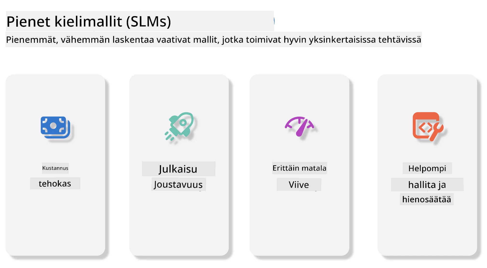
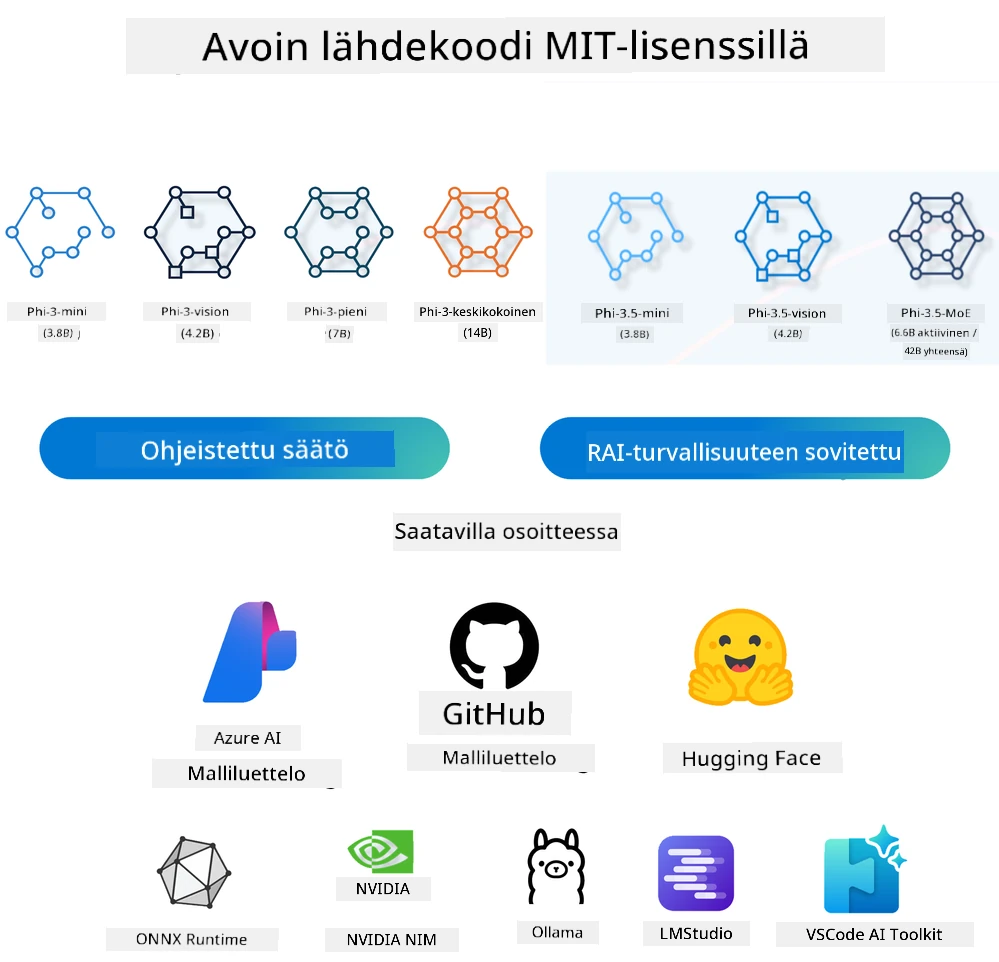
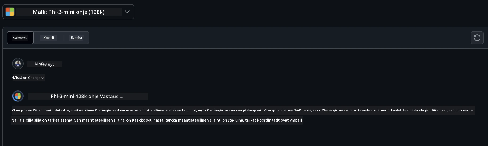
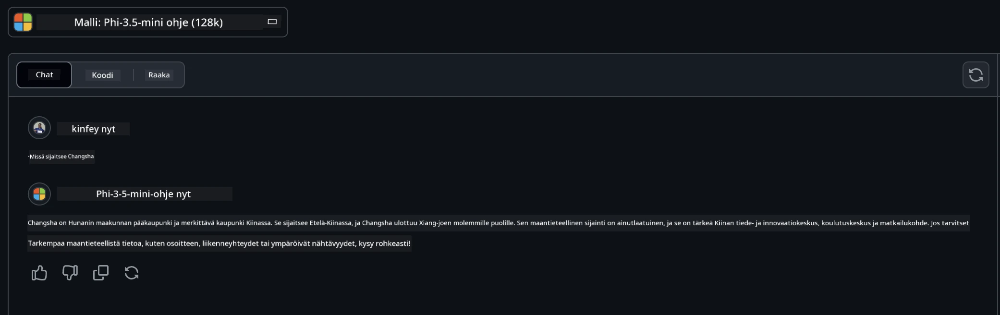

# Johdanto pienten kielimallien käyttöön generatiivisessa tekoälyssä aloittelijoille  
Generatiivinen tekoäly on kiehtova tekoälyn ala, joka keskittyy järjestelmien luomiseen, jotka pystyvät tuottamaan uutta sisältöä. Tämä sisältö voi vaihdella tekstistä ja kuvista musiikkiin ja jopa kokonaisiin virtuaalisiin ympäristöihin. Yksi jännittävimmistä generatiivisen tekoälyn sovelluksista löytyy kielimalleista.

## Mitä ovat pienet kielimallit?

Pieni kielimalli (SLM) on skaalattu versio suuresta kielimallista (LLM), joka hyödyntää monia LLM-malleille tyypillisiä arkkitehtonisia periaatteita ja tekniikoita samalla kun sen laskennallinen jalanjälki on merkittävästi pienempi.

SLM:t ovat kielimalleja, jotka on suunniteltu tuottamaan ihmismäistä tekstiä. Toisin kuin suuremmat vastineensa, kuten GPT-4, SLM:t ovat kompakteja ja tehokkaita, mikä tekee niistä ihanteellisia sovelluksiin, joissa laskentaresurssit ovat rajalliset. Pienestä koosta huolimatta ne voivat suorittaa monenlaisia tehtäviä. Tyypillisesti SLM:t rakennetaan pakkaamalla tai tiivistämällä LLM:iä, pyrkien säilyttämään merkittävä osa alkuperäisen mallin toiminnallisuudesta ja kielellisistä kyvyistä. Mallikoon pienentäminen vähentää kokonaiskompleksisuutta, mikä tekee SLM:istä tehokkaampia sekä muistin käytössä että laskennallisissa vaatimuksissa. Näistä optimoinneista huolimatta SLM:t voivat silti suorittaa laaja-alaisesti luonnollisen kielen käsittelyn (NLP) tehtäviä:

- Tekstin generointi: Johdonmukaisten ja kontekstuaalisesti asiaankuuluvien lauseiden tai kappaleiden luominen.  
- Tekstin täydennys: Lauseiden ennustaminen ja täydentäminen annetun kehotteen perusteella.  
- Kääntäminen: Tekstin muuntaminen yhdestä kielestä toiseen.  
- Tiivistäminen: Pitkien tekstien supistaminen lyhyemmiksi, helpommin omaksuttaviksi yhteenvetoiksi.

Joskin suorituskyvyn tai ymmärryksen syvyyden osalta jonkinlaisilla kompromisseilla verrattuna niiden isompiin vastineisiin.

## Miten pienet kielimallit toimivat?  
SLM:t koulutetaan suurilla tekstidatamäärillä. Koulutuksen aikana mallit oppivat kielen rakenteita ja kaavoja, mikä mahdollistaa kieliopillisesti oikean ja kontekstuaalisesti sopivan tekstin tuottamisen. Koulutusprosessi sisältää:

- Datan keräämisen: Suurten tekstidatasetien kokoamisen eri lähteistä.  
- Esikäsittelyn: Datan puhdistamisen ja järjestämisen koulutukseen sopivaksi.  
- Koulutuksen: Koneoppimisalgoritmien avulla mallin opettamisen ymmärtämään ja tuottamaan tekstiä.  
- Fine-tuningin: Mallin säätämisen suorituskyvyn parantamiseksi erityistehtävissä.

SLM:ien kehitys vastaa kasvavaa tarvetta malleille, jotka voidaan ottaa käyttöön resurssirajoitetuissa ympäristöissä, kuten mobiililaitteissa tai reunalaskennassa, joissa täysimittaiset LLM-mallit ovat raskaan resurssitarpeensa vuoksi epäkäytännöllisiä. Tehokkuuteen keskittyminen tasapainottaa suorituskyvyn ja saavutettavuuden, mahdollistaen laajemman sovellettavuuden eri aloilla.



## Oppimistavoitteet

Tässä oppitunnissa pyrimme esittelemään SLM:n tietoa ja yhdistämään sen Microsoft Phi-3:n kanssa opiskellaksemme erilaisia skenaarioita tekstisisällössä, näkökyvyssä ja MoE:ssa.

Oppitunnin lopussa sinun tulisi pystyä vastaamaan seuraaviin kysymyksiin:

- Mikä on SLM?  
- Mikä on ero SLM:n ja LLM:n välillä?  
- Mikä on Microsoft Phi-3/3.5 -perhe?  
- Miten suorittaa päättely Microsoft Phi-3/3.5 -perheen kanssa?

Oletko valmis? Aloitetaan.

## Suuret kielimallit (LLM) ja pienet kielimallit (SLM) – erot

Sekä LLM:t että SLM:t perustuvat todennäköisyyspohjaisen koneoppimisen periaatteisiin, noudattaen samankaltaisia lähestymistapoja arkkitehtuurimuotoilussa, koulutusmenetelmissä, datan generoinnissa ja mallin arvioinnissa. Kuitenkin useat keskeiset tekijät erottavat nämä kaksi mallityyppiä toisistaan.

## Pienten kielimallien sovellukset

SLM:illä on laaja kirjo sovelluksia, kuten:

- Chatbotit: Asiakastuen tarjoaminen ja käyttäjien kanssa keskusteleminen luontevalla tavalla.  
- Sisällöntuotanto: Kirjoittajien auttaminen ideoiden generoinnissa tai jopa kokonaan artikkeleiden luonnostelussa.  
- Koulutus: Opiskelijoiden avustaminen kirjoitustehtävissä tai uusien kielten oppimisessa.  
- Saavutettavuus: Työkalujen luominen vammaisille, kuten puheteknologiaan perustuvat järjestelmät.

**Koko**

Perusero LLM:ien ja SLM:ien välillä liittyy mallien kokoon. LLM:t, kuten ChatGPT (GPT-4), voivat sisältää arviolta 1,76 biljoonaa parametria, kun taas avoimen lähdekoodin SLM:t, kuten Mistral 7B, on suunniteltu huomattavasti pienemmällä parametrimäärällä — noin 7 miljardia. Tämä ero johtuu pääosin erilaisten malliarkkitehtuurien ja koulutusmenetelmien eroista. Esimerkiksi ChatGPT käyttää itsetarkkaavaisuusmekanismia kooderi-dekooderi-rakenteessa, kun taas Mistral 7B hyödyntää liukuvan ikkunan tarkkaavaisuutta, mikä mahdollistaa tehokkaamman koulutuksen pelkän dekooderimallin sisällä. Tämä arkkitehtoninen ero vaikuttaa syvällisesti mallien monimutkaisuuteen ja suorituskykyyn.

**Ymmärtäminen**

SLM:t on tyypillisesti optimoitu toimimaan hyvin tietyissä erikoisaloissa, tehden niistä erittäin erikoistuneita mutta potentiaalisesti rajallisia laajemman kontekstuaalisen ymmärryksen tarjoamisessa eri tieteenaloilla. Sen sijaan LLM:t pyrkivät simuloimaan ihmismäistä älykkyyttä kattavammalla tasolla. Koulutettuina valtavilla ja monipuolisilla dataseteillä, LLM:t on suunniteltu suoriutumaan hyvin eri aloilla tarjoten suurempaa monipuolisuutta ja mukautuvuutta. Tästä syystä LLM:t soveltuvat paremmin laajempaan kirjoon jälkikäyttötehtäviä, kuten luonnollisen kielen käsittelyyn ja ohjelmointiin.

**Laskenta**

LLM:ien koulutus ja käyttöönotto ovat resurssi-intensiivisiä prosesseja, jotka usein vaativat merkittäviä laskenta-infrastruktuureja, mukaan lukien laajamittaiset GPU-klusterit. Esimerkiksi mallin kouluttaminen alusta alkaen, kuten ChatGPT, voi vaatia tuhansia GPU-yksiköitä pitkiä aikoja. SLM:t sen sijaan, pienen parametrimääränsä vuoksi, ovat helpommin saavutettavissa laskentaresurssien osalta. Mallit, kuten Mistral 7B, voidaan kouluttaa ja ajaa paikallisilla koneilla, joissa on kohtuulliset GPU-ominaisuudet, vaikka koulutus vaatii silti useita tunteja monelta GPU:lta.

**Vinouma**

Vinouma eli harha on tunnettu ongelma LLM:issä, joka johtuu pääasiassa koulutusdatan luonteesta. Mallit usein käyttävät raakaa, avoimesti saatavilla olevaa internet-dataa, joka voi aliedustaa tai vääristää tiettyjä ryhmiä, sisällyttää virheellisiä merkintöjä tai heijastaa kieliopillisia vinoumia, joita voivat aiheuttaa murteet, maantieteelliset erot ja kielioppisäännöt. Lisäksi LLM:ien monimutkaisuus voi vahingossa voimistaa vinoumakohtia, joita ei huomata ilman huolellista hienosäätöä. Toisaalta SLM:t, joita koulutetaan rajatuilla ja alakohtaisesti spesifisillä dataseteillä, ovat luonnostaan vähemmän herkkiä tällaisille vinoumille, vaikka eivät täysin immuuneja.

**Päättely**

SLM:ien pienempi koko antaa niille merkittävän edun päättelynopeudessa, mikä mahdollistaa tulosten tehokkaan generoimisen paikallisella laitteistolla ilman laajaa rinnakkaislaskentaa. LLM:t puolestaan, koonsa ja monimutkaisuutensa vuoksi, vaativat usein huomattavia rinnakkaisia laskentaresursseja hyväksyttävien päättelyaikojen saavuttamiseksi. Useiden samanaikaisten käyttäjien läsnäolo hidastaa vielä LLM:ien vastausaikoja erityisesti laajassa käyttöönotossa.

Yhteenvetona, vaikka LLM:t ja SLM:t perustuvat molemmat koneoppimisen perustoihin, ne eroavat merkittävästi mallien koossa, resurssivaatimuksissa, kontekstuaalisessa ymmärryksessä, altistumisessa vinoumille ja päättelynopeudessa. Nämä erot heijastavat eri käyttötarkoitusten soveltuvuutta, jossa LLM:t ovat monipuolisempia mutta resursseja kuluttavampia, ja SLM:t tarjoavat alakohtaista tehokkuutta pienemmillä laskentaresurssitarpeilla.

***Huomaa: Tässä oppitunnissa esittelemme SLM:n käyttäen esimerkkinä Microsoft Phi-3 / 3.5 -malleja.***

## Phi-3 / Phi-3.5 -perheen esittely

Phi-3 / 3.5 -perhe keskittyy pääasiassa teksti-, näkö- ja Agentti (MoE) -sovelluskohtaisiin skenaarioihin:

### Phi-3 / 3.5 Instruct

Pääasiassa tekstin generointia, keskustelun täydentämistä ja sisällön tiedon poimintaa ym.

**Phi-3-mini**

3,8 miljardin parametrin kielimalli on saatavilla Microsoft Azure AI Studiosta, Hugging Facesta ja Ollamasta. Phi-3 -mallit ylittävät huomattavasti yhtä suuret ja isommatkin kielimallit keskeisillä vertailuilla (katso vertailuluvut alla, korkeammat luvut ovat parempia). Phi-3-mini päihittää kooltaan kaksinkertaiset mallit, kun taas Phi-3-small ja Phi-3-medium päihittävät isompia malleja, mukaan lukien GPT-3.5.

**Phi-3-small & medium**

Vain 7 miljardin parametrin Phi-3-small voittaa GPT-3.5T:n eri kieli-, päättely-, koodaus- ja matematiikkatestauksissa.

Phi-3-medium, jossa on 14 miljardia parametria, jatkaa tätä suuntausta ja päihittää Gemini 1.0 Pro:n.

**Phi-3.5-mini**

Tätä voidaan pitää Phi-3-minin päivityksenä. Parametrit pysyvät samana, mutta se parantaa monikielisten kielten tukemista (yli 20 kieltä: arabia, kiina, tsekki, tanska, hollanti, englanti, suomi, ranska, saksa, heprea, unkari, italia, japani, korea, norja, puola, portugali, venäjä, espanja, ruotsi, thai, turkki, ukraina) ja lisää vahvemman tuen pitkälle kontekstille.

Phi-3.5-mini, jossa on 3,8 miljardia parametria, päihittää saman kokoiset kielimallit ja on samalla tasolla kaksinkertaisiin malleihin nähden.

### Phi-3 / 3.5 Vision

Voimme ajatella Phi-3/3.5 Instruct -mallia Phi:n kyvyksi ymmärtää, ja Vision antaa Phi:lle "silmät" maailman ymmärtämiseen.

**Phi-3-Vision**

Phi-3-vision, vain 4,2 miljardilla parametrilla, jatkaa tätä kehitystä ja päihittää isompia malleja kuten Claude-3 Haiku ja Gemini 1.0 Pro V yleisissä visuaalisissa päättelytehtävissä, OCR:ssa sekä taulukkojen ja diagrammien ymmärtämisessä.

**Phi-3.5-Vision**

Phi-3.5-Vision on myös versio Phi-3-Visionista, lisäten tuen useille kuville. Sitä voi pitää näön parannuksena: voit nähdä kuvia, mutta myös videoita.

Phi-3.5-vision päihittää isompia malleja kuten Claude-3.5 Sonnet ja Gemini 1.5 Flash OCR:ssa, taulukoiden ja kaavioiden ymmärtämisessä ja on samalla tasolla yleisen visuaalisen tiedon päättelytehtävissä. Tukee monikehys-syötettä eli päättelyä useiden syötekuvien pohjalta.

### Phi-3.5-MoE

***Mixture of Experts (MoE)*** mahdollistaa mallien esikoulutuksen huomattavasti vähemmällä laskennalla, mikä tarkoittaa, että mallin tai datasetin kokoa voi dramaattisesti kasvattaa samalla laskentabudjetilla kuin tiheä malli. Erityisesti MoE-mallin tulisi saavuttaa sama laatu tiheän vastineensa kanssa huomattavasti nopeammin esikoulutuksen aikana.

Phi-3.5-MoE koostuu 16x3,8 miljardin parametrin ekspertimoduulista. Phi-3.5-MoE, jossa on vain 6,6 miljardia aktiivista parametria, saavuttaa saman tason päättelyssä, kielen ymmärryksessä ja matematiikassa kuin paljon suuremmat mallit.

Voimme käyttää Phi-3/3.5 -perheen malleja eri skenaarioissa. Toisin kuin LLM-mallit, Phi-3/3.5-mini tai Phi-3/3.5-Vision voidaan ottaa käyttöön reunalaitteissa.

## Kuinka käyttää Phi-3/3.5 -perheen malleja

Tavoitteemme on käyttää Phi-3/3.5:a eri skenaarioissa. Seuraavaksi käytämme Phi-3/3.5 -mallia eri sovellusympäristöissä.



### Päättely pilvi-API:en kautta

**GitHub-mallit**

GitHub Models on suoraviivaisin tapa. Voit nopeasti käyttää Phi-3/3.5-Instruct -mallia GitHub Modelsin kautta. Yhdistettynä Azure AI Inference SDK:han / OpenAI SDK:han, voit suorittaa API-kutsut koodilla Phi-3/3.5-Instruct -mallille. Voit myös testata erilaisia toimintoja Playgroundissa.

- Demo: Vertailu Phi-3-mini:n ja Phi-3.5-mini:n vaikutuksista kiinan kielisissä skenaarioissa





**Azure AI Studio**

Tai jos haluamme käyttää näkö- ja MoE-malleja, voit hyödyntää Azure AI Studiota näiden kutsujen tekemiseen. Jos olet kiinnostunut, voit lukea Phi-3 Cookbookin, josta opit miten kutsua Phi-3/3.5 Instruct, Vision ja MoE malleja Azure AI Studion kautta [Klikkaa tätä linkkiä](https://github.com/microsoft/Phi-3CookBook/blob/main/md/02.QuickStart/AzureAIStudio_QuickStart.md?WT.mc_id=academic-105485-koreyst)

**NVIDIA NIM**

Azure ja GitHub tarjoamien pilvipohjaisten mallikatalogiratkaisujen lisäksi voit käyttää myös [NVIDIA NIM](https://developer.nvidia.com/nim?WT.mc_id=academic-105485-koreyst) -palvelua kutsujen tekemiseen. Voit käydä NVIDIA NIM:ssä suorittaaksesi API-kutsut Phi-3/3.5 -perheen malleille. NVIDIA NIM (NVIDIA Inference Microservices) on joukko nopeutettuja päättelyyn tarkoitettuja mikropalveluita, jotka auttavat kehittäjiä ottamaan tekoälymalleja tehokkaasti käyttöön eri ympäristöissä, mukaan lukien pilvet, datakeskukset ja työasemat.

Tässä joitain NVIDIA NIM:in keskeisiä ominaisuuksia:
- **Helpotus käyttöönotossa:** NIM mahdollistaa AI-mallien käyttöönoton yhdellä komennolla, mikä tekee sen integroinnista olemassa oleviin työnkulkuihin suoraviivaista.  
- **Optimoitu suorituskyky:** Se hyödyntää NVIDIA:n valmiiksi optimoituja tulkintamoottoreita, kuten TensorRT:tä ja TensorRT-LLM:ää, varmistaakseen pienen viiveen ja suuren läpimenon.  
- **Laajennettavuus:** NIM tukee automaattista skaalausta Kubernetesissa, mikä mahdollistaa vaihtelevien työkuormien tehokkaan käsittelyn.  
- **Turvallisuus ja kontrolli:** Organisaatiot voivat säilyttää hallinnan datoihinsa ja sovelluksiinsa itse isännöimällä NIM-mikropalveluja omalla hallitulla infrastruktuurillaan.  
- **Standardoidut rajapinnat:** NIM tarjoaa teollisuusstandardin mukaiset APIs:t, mikä helpottaa AI-sovellusten, kuten chatbotien, AI-avustajien ja muiden, rakentamista ja integrointia.  

NIM on osa NVIDIA AI Enterprisea, jonka tavoitteena on yksinkertaistaa AI-mallien käyttöönottoa ja operatiivista hallintaa, varmistaen niiden tehokkaan toiminnan NVIDIA:n GPU:illa.

- Demo: NVIDIA NIM:n käyttäminen Phi-3.5-Vision-API:n kutsumiseen  [[Klikkaa tästä linkistä](./python/Phi-3-Vision-Nividia-NIM.ipynb?WT.mc_id=academic-105485-koreyst)]


### Phi-3/3.5 Suorittaminen Paikallisesti  
Tulkinta (inference) Phi-3:n, tai minkä tahansa kielimallin kuten GPT-3:n, yhteydessä tarkoittaa prosessia, jossa generoidaan vastauksia tai ennusteita syötteen perusteella. Kun annat Phi-3:lle kehotteen tai kysymyksen, se käyttää koulutettua neuroverkkoaan päättelemään todennäköisimmän ja relevantin vastauksen analysoimalla mallin koulutusdatassa esiintyviä kuvioita ja suhteita.

**Hugging Face Transformer**  
Hugging Face Transformers on tehokas kirjasto luonnollisen kielen käsittelyyn (NLP) ja muihin koneoppimistehtäviin. Tässä joitain keskeisiä seikkoja siitä:

1. **Esikoulutetut mallit:** Kirjasto tarjoaa tuhansia esikoulutettuja malleja, joita voi käyttää erilaisiin tehtäviin, kuten tekstin luokitteluun, nimeämiseen, kysymyksiin vastaamiseen, tiivistämiseen, kääntämiseen ja tekstin generointiin.  

2. **Kehysjärjestelmien yhteensopivuus:** Kirjasto tukee useita syväoppimisen kehyksiä, kuten PyTorch, TensorFlow ja JAX. Tämä mahdollistaa mallin kouluttamisen yhdessä kehyksessä ja käytön toisessa.  

3. **Monimodaaliset kyvyt:** NLP:n lisäksi Hugging Face Transformers tukee myös tietokonenäön tehtäviä (esim. kuvantunnistus, kohteiden tunnistus) ja äänenkäsittelyä (esim. puheen tunnistus, ääniluokittelu).  

4. **Helppokäyttöisyys:** Kirjasto tarjoaa rajapintoja ja työkaluja mallien kätevään lataamiseen ja hienosäätöön, tehden siitä saavutettavan sekä aloittelijoille että asiantuntijoille.  

5. **Yhteisö ja resurssit:** Hugging Facella on vilkas yhteisö sekä laaja dokumentaatio, tutoriaaleja ja oppaita, jotka auttavat käyttäjiä alkuun ja hyödyntämään kirjastoa parhaalla tavalla.  
[virallinen dokumentaatio](https://huggingface.co/docs/transformers/index?WT.mc_id=academic-105485-koreyst) tai heidän [GitHub-repositoriosa](https://github.com/huggingface/transformers?WT.mc_id=academic-105485-koreyst).

Tämä on yleisimmin käytetty menetelmä, mutta se vaatii myös GPU-kiihtyvyyttä. Esimerkiksi Vision ja MoE -skenaariot vaativat paljon laskentaa, ja ne voivat olla hyvin hitaita CPU:lla, elleivät ole kvantisoituja.

- Demo: Transformerilla Phi-3.5-Instruct kutsuminen [Klikkaa tästä](./python/phi35-instruct-demo.ipynb?WT.mc_id=academic-105485-koreyst)

- Demo: Transformerilla Phi-3.5-Vision kutsuminen [Klikkaa tästä](./python/phi35-vision-demo.ipynb?WT.mc_id=academic-105485-koreyst)

- Demo: Transformerilla Phi-3.5-MoE kutsuminen [Klikkaa tästä](./python/phi35_moe_demo.ipynb?WT.mc_id=academic-105485-koreyst)

**Ollama**  
[Ollama](https://ollama.com/?WT.mc_id=academic-105485-koreyst) on alusta, joka helpottaa suurten kielimallien (LLM) suorittamista paikallisesti koneellasi. Se tukee useita malleja, kuten Llama 3.1, Phi 3, Mistral ja Gemma 2, muiden ohella. Alusta yksinkertaistaa prosessia yhdistämällä mallipainot, konfiguraation ja datan yhdeksi paketiksi, tehden mallien räätälöinnistä ja luomisesta helpompaa käyttäjille. Ollama toimii macOS:llä, Linuxilla ja Windowsilla. Se on erinomainen työkalu, jos haluat kokeilla tai ottaa käyttöön LLM-malleja ilman pilvipalveluihin luottamista. Ollama on kaikkein suoraviivaisin tapa, tarvitsee vain suorittaa seuraava komento.

```bash

ollama run phi3.5

```


**ONNX Runtime Generatiivisen AI:n tueksi**

[ONNX Runtime](https://github.com/microsoft/onnxruntime-genai?WT.mc_id=academic-105485-koreyst) on alustariippumaton tulkinta- ja koneoppimisen koulutuskiihdytin. ONNX Runtime Generative AI:lle (GENAI) on tehokas työkalu, joka auttaa suorittamaan generatiivisia AI-malleja tehokkaasti erilaisilla alustoilla.

## Mikä on ONNX Runtime?  
ONNX Runtime on avoimen lähdekoodin projekti, joka mahdollistaa koneoppimismallien suorituskykyisen tulkinnan. Se tukee Open Neural Network Exchange (ONNX) -muodossa olevia malleja, joka on koneoppimismallien esityksen standardi. ONNX Runtimen tulkinta voi parantaa asiakaskokemuksia ja alentaa kustannuksia, tukien malleja syväoppimiskehyksistä kuten PyTorch ja TensorFlow/Keras sekä klassisemmista koneoppimiskirjastoista kuten scikit-learn, LightGBM, XGBoost jne. ONNX Runtime on yhteensopiva erilaisten laitteistojen, ajureiden ja käyttöjärjestelmien kanssa, ja tarjoaa optimaalisen suorituskyvyn hyödyntämällä laitteistokiihdyttimiä, graafien optimointeja ja muunnoksia.

## Mikä on Generatiivinen AI?  
Generatiivinen AI tarkoittaa tekoälyjärjestelmiä, jotka voivat luoda uutta sisältöä, kuten tekstiä, kuvia tai musiikkia, perustuen koulutusdataansa. Esimerkkejä ovat kielimallit kuten GPT-3 ja kuvanluontimallit kuten Stable Diffusion. ONNX Runtime GenAI -kirjasto tarjoaa generatiivisen AI -silmukan ONNX-malleille, mukaan lukien tulkinnan ONNX Runtimella, logits-käsittelyn, haun ja näytteenoton sekä KV-välimuistin hallinnan.

## ONNX Runtime GENAI  
ONNX Runtime GENAI laajentaa ONNX Runtimea tukemaan generatiivisia AI-malleja. Tässä joitain keskeisiä ominaisuuksia:

- **Laaja alustoistuminen:** Toimii useilla alustoilla, mukaan lukien Windows, Linux, macOS, Android ja iOS.  
- **Mallituen laajuus:** Tukee monia suosittuja generatiivisia AI-malleja, kuten LLaMA, GPT-Neo, BLOOM ja muita.  
- **Suorituskyvyn optimointi:** Sisältää optimointeja eri laitteistokiihdyttimille, kuten NVIDIA GPU:ille, AMD GPU:ille jne.  
- **Helppokäyttöisyys:** Tarjoaa rajapintoja helppoon integrointiin sovelluksiin, jolloin voit generoida tekstiä, kuvia ja muuta sisältöä vähällä koodilla.  
- Käyttäjät voivat kutsua korkean tason generate()-metodia tai suorittaa mallin jokaisen iteraation silmukassa, generoiden yksi token kerrallaan ja halutessaan päivittää generaation parametreja silmukan sisällä.  
- ONNX Runtime tukee myös ahne-/palkkihakua (greedy/beam search) ja TopP, TopK -näytteenottoa token-jaksojen generointiin sekä sisäänrakennettua logits-käsittelyä, kuten toistokäyttäytymien rangaistuksia. Voit myös helposti lisätä omia pisteytyksiä.

## Aloitus  
Voit aloittaa ONNX Runtime GENAI:n käytön seuraavasti:

### Asenna ONNX Runtime:  
```Python
pip install onnxruntime
```
### Asenna Generatiivisen AI:n laajennukset:  
```Python
pip install onnxruntime-genai
```
  
### Suorita malli: Tässä yksinkertainen esimerkki Pythonilla:  
```Python
import onnxruntime_genai as og

model = og.Model('path_to_your_model.onnx')

tokenizer = og.Tokenizer(model)

input_text = "Hello, how are you?"

input_tokens = tokenizer.encode(input_text)

output_tokens = model.generate(input_tokens)

output_text = tokenizer.decode(output_tokens)

print(output_text) 
```
### Demo: ONNX Runtime GenAI:n käyttäminen Phi-3.5-Vision kutsuun

```python

import onnxruntime_genai as og

model_path = './Your Phi-3.5-vision-instruct ONNX Path'

img_path = './Your Image Path'

model = og.Model(model_path)

processor = model.create_multimodal_processor()

tokenizer_stream = processor.create_stream()

text = "Your Prompt"

prompt = "<|user|>\n"

prompt += "<|image_1|>\n"

prompt += f"{text}<|end|>\n"

prompt += "<|assistant|>\n"

image = og.Images.open(img_path)

inputs = processor(prompt, images=image)

params = og.GeneratorParams(model)

params.set_inputs(inputs)

params.set_search_options(max_length=3072)

generator = og.Generator(model, params)

while not generator.is_done():

    generator.compute_logits()
    
    generator.generate_next_token()

    new_token = generator.get_next_tokens()[0]
    
    output = tokenizer_stream.decode(new_token)
    
    print(tokenizer_stream.decode(new_token), end='', flush=True)

```


**Muut**  

ONNX Runtime- ja Ollama-viitemetodien lisäksi voimme täydentää kvantitatiivisten mallien viitekehyksiä eri valmistajien tarjoamien malliviitteiden perusteella. Esimerkiksi Apple MLX -alusta Apple Metalilla, Qualcomm QNN NPU:lla, Intel OpenVINO CPU/GPU:lla jne. Voit myös löytää lisää tietoa [Phi-3 Cookbookista](https://github.com/microsoft/phi-3cookbook?WT.mc_id=academic-105485-koreyst)


## Lisää  

Olemme oppineet Phi-3/3.5-perheen perusteet, mutta SLM:n oppimiseen tarvitsemme lisää tietoa. Vastaukset löydät Phi-3 Cookbookista. Jos haluat oppia lisää, vieraile [Phi-3 Cookbookissa](https://github.com/microsoft/phi-3cookbook?WT.mc_id=academic-105485-koreyst).

---

<!-- CO-OP TRANSLATOR DISCLAIMER START -->
**Vastuuvapauslauseke**:
Tämä asiakirja on käännetty käyttämällä tekoälypohjaista käännöspalvelua [Co-op Translator](https://github.com/Azure/co-op-translator). Pyrimme tarkkuuteen, mutta otathan huomioon, että automaattikäännöksissä voi esiintyä virheitä tai epätarkkuuksia. Alkuperäistä asiakirjaa sen alkuperäiskielellä tulee pitää virallisena lähteenä. Tärkeissä asioissa suositellaan ammattimaista ihmiskäännöstä. Emme ole vastuussa tämän käännöksen käytöstä aiheutuvista väärinymmärryksistä tai tulkinnoista.
<!-- CO-OP TRANSLATOR DISCLAIMER END -->