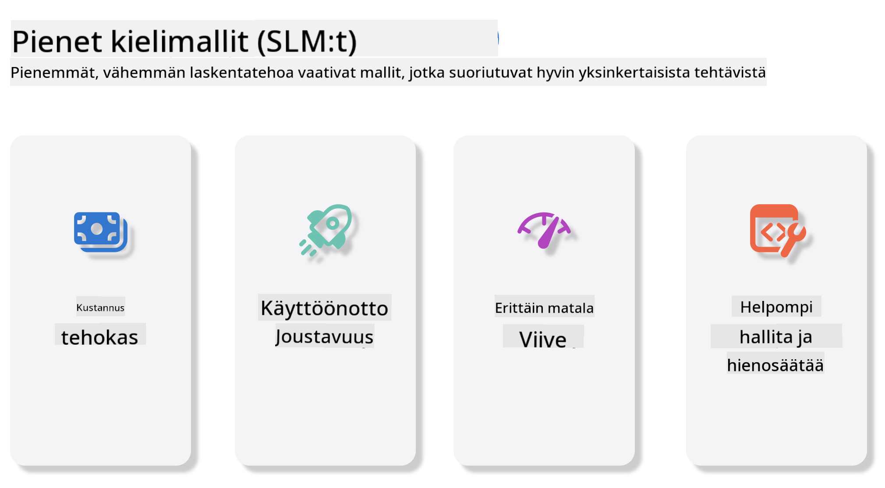
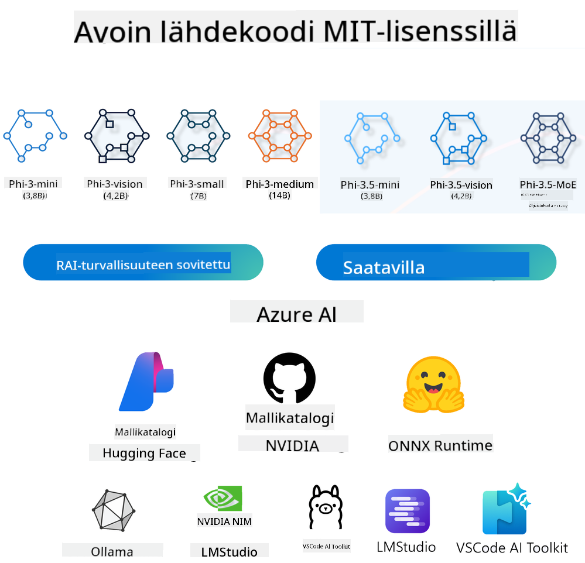
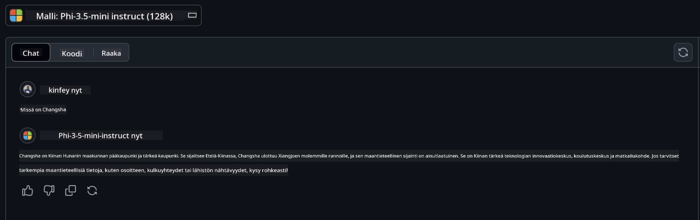

<!--
CO_OP_TRANSLATOR_METADATA:
{
  "original_hash": "124ad36cfe96f74038811b6e2bb93e9d",
  "translation_date": "2025-07-09T18:38:37+00:00",
  "source_file": "19-slm/README.md",
  "language_code": "fi"
}
-->
# Johdanto pieniin kielimalleihin generatiivisessa tekoälyssä aloittelijoille  
Generatiivinen tekoäly on kiehtova tekoälyn osa-alue, joka keskittyy järjestelmien luomiseen, jotka pystyvät tuottamaan uutta sisältöä. Tämä sisältö voi olla tekstiä, kuvia, musiikkia tai jopa kokonaisia virtuaaliympäristöjä. Yksi generatiivisen tekoälyn jännittävimmistä sovelluksista liittyy kielimalleihin.

## Mitä ovat pienet kielimallit?  

Pieni kielimalli (SLM) on pienennetty versio suuresta kielimallista (LLM), joka hyödyntää monia LLM:ien arkkitehtuurisia periaatteita ja tekniikoita, mutta jolla on huomattavasti pienempi laskennallinen jalanjälki.  

SLM:t ovat kielimalleja, jotka on suunniteltu tuottamaan ihmismäistä tekstiä. Toisin kuin suuremmat mallit, kuten GPT-4, SLM:t ovat kompakteja ja tehokkaita, mikä tekee niistä ihanteellisia sovelluksiin, joissa laskentaresurssit ovat rajalliset. Pienestä koosta huolimatta ne pystyvät suorittamaan monenlaisia tehtäviä. Tyypillisesti SLM:t rakennetaan puristamalla tai tiivistämällä LLM:iä, pyrkien säilyttämään suuri osa alkuperäisen mallin toiminnallisuudesta ja kielitaidoista. Mallin koon pienentäminen vähentää kokonaiskompleksisuutta, mikä tekee SLM:istä tehokkaampia sekä muistin käytön että laskentavaatimusten osalta. Näistä optimoinneista huolimatta SLM:t pystyvät suorittamaan laajan kirjon luonnollisen kielen käsittelyn (NLP) tehtäviä:  

- Tekstin generointi: Yhtenäisten ja kontekstuaalisesti sopivien lauseiden tai kappaleiden luominen.  
- Tekstin täydentäminen: Lauseiden ennustaminen ja täydentäminen annetun kehotteen perusteella.  
- Kääntäminen: Tekstin muuntaminen kielestä toiseen.  
- Tiivistäminen: Pitkien tekstien tiivistäminen lyhyemmiksi ja helpommin omaksuttaviksi yhteenvetoiksi.  

Vaikka suorituskyvyssä tai ymmärryksen syvyydessä voi olla joitakin kompromisseja verrattuna suurempiin malleihin.  

## Miten pienet kielimallit toimivat?  
SLM:t koulutetaan valtavilla tekstiaineistoilla. Koulutuksen aikana ne oppivat kielen rakenteita ja malleja, mikä mahdollistaa kieliopillisesti oikean ja kontekstuaalisesti sopivan tekstin tuottamisen. Koulutusprosessi sisältää:  

- Datan kerääminen: Suurten tekstiaineistojen kerääminen eri lähteistä.  
- Esikäsittely: Datan puhdistaminen ja järjestäminen koulutusta varten sopivaksi.  
- Koulutus: Koneoppimisalgoritmien käyttäminen mallin opettamiseksi ymmärtämään ja tuottamaan tekstiä.  
- Hienosäätö: Mallin säätäminen parantamaan sen suorituskykyä tietyissä tehtävissä.  

SLM:ien kehitys vastaa kasvavaa tarvetta malleille, joita voidaan käyttää resurssirajoitetuissa ympäristöissä, kuten mobiililaitteissa tai reunalaskennassa, joissa täysimittaiset LLM:t voivat olla liian raskaita. Tehokkuuteen keskittyen SLM:t tasapainottavat suorituskyvyn ja saavutettavuuden, mahdollistaen laajemman soveltamisen eri aloilla.



## Oppimistavoitteet  

Tässä oppitunnissa pyrimme esittelemään SLM:n perusteet ja yhdistämään ne Microsoft Phi-3 -malliin oppiaksemme erilaisista tekstisisällön, näön ja MoE:n (Agent) käyttötapauksista.  

Oppitunnin lopussa sinun tulisi pystyä vastaamaan seuraaviin kysymyksiin:  

- Mikä on SLM  
- Mikä on ero SLM:n ja LLM:n välillä  
- Mikä on Microsoft Phi-3/3.5 -perhe  
- Miten tehdä päättely Microsoft Phi-3/3.5 -perheellä  

Valmiina? Aloitetaan.  

## Suuret kielimallit (LLM) ja pienet kielimallit (SLM) – erot  

Sekä LLM:t että SLM:t perustuvat todennäköisyyspohjaiseen koneoppimiseen ja noudattavat samankaltaisia arkkitehtuurisia suunnitteluperiaatteita, koulutusmenetelmiä, datan generointiprosesseja ja mallin arviointitekniikoita. Kuitenkin useat keskeiset tekijät erottavat nämä kaksi mallityyppiä toisistaan.  

## Pienten kielimallien sovellukset  

SLM:illä on laaja kirjo sovelluksia, kuten:  

- Chatbotit: Asiakastuen tarjoaminen ja käyttäjien kanssa keskusteleminen.  
- Sisällöntuotanto: Kirjoittajien avustaminen ideoiden luomisessa tai jopa kokonaan artikkeleiden luonnostelussa.  
- Koulutus: Opiskelijoiden auttaminen kirjoitustehtävissä tai uusien kielten oppimisessa.  
- Saavutettavuus: Työkalujen luominen vammaisille, kuten tekstistä puheeksi -järjestelmät.  

**Koko**  

Keskeinen ero LLM:ien ja SLM:ien välillä on mallien koko. LLM:t, kuten ChatGPT (GPT-4), voivat sisältää arviolta 1,76 biljoonaa parametria, kun taas avoimen lähdekoodin SLM:t, kuten Mistral 7B, on suunniteltu huomattavasti pienemmällä parametrimäärällä – noin 7 miljardia. Tämä ero johtuu pääasiassa mallin arkkitehtuurista ja koulutusprosesseista. Esimerkiksi ChatGPT käyttää itsehuomiomekanismia enkooderi-dekooderi-rakenteessa, kun taas Mistral 7B hyödyntää liukuvan ikkunan huomiota, mikä mahdollistaa tehokkaamman koulutuksen pelkästään dekooderipohjaisessa mallissa. Tämä arkkitehtuurinen ero vaikuttaa merkittävästi mallien monimutkaisuuteen ja suorituskykyyn.  

**Ymmärrys**  

SLM:t on tyypillisesti optimoitu toimimaan hyvin tietyillä erikoistuneilla alueilla, mikä tekee niistä hyvin erikoistuneita, mutta mahdollisesti rajoittaa niiden kykyä tarjota laajaa kontekstuaalista ymmärrystä eri tieteenaloilla. Sen sijaan LLM:t pyrkivät simuloimaan ihmismäistä älykkyyttä laajemmalla tasolla. Koulutettuina valtavilla ja monipuolisilla aineistoilla, LLM:t on suunniteltu toimimaan hyvin monilla eri aloilla, tarjoten suurempaa monipuolisuutta ja sopeutumiskykyä. Tämän vuoksi LLM:t soveltuvat paremmin laajempaan kirjoon jälkikäsittelytehtäviä, kuten luonnollisen kielen käsittelyyn ja ohjelmointiin.  

**Laskenta**  

LLM:ien koulutus ja käyttöönotto vaativat paljon resursseja, usein suuria laskentainfrastruktuureja, kuten laajoja GPU-klustereita. Esimerkiksi ChatGPT:n kaltaisen mallin kouluttaminen alusta alkaen voi vaatia tuhansia GPU:ita pitkän ajan. SLM:t, pienemmän parametrimäärän ansiosta, ovat laskentaresurssien osalta helpommin saavutettavissa. Esimerkiksi Mistral 7B:tä voidaan kouluttaa ja käyttää paikallisilla koneilla, joissa on kohtuulliset GPU-ominaisuudet, vaikka koulutus vaatiikin useiden tuntien ajan useilla GPU:illa.  

**Vinouma**  

Vinouma on tunnettu ongelma LLM:issä, joka johtuu pääasiassa koulutusdatan luonteesta. Nämä mallit käyttävät usein raakaa, julkisesti saatavilla olevaa internetdataa, joka voi aliedustaa tai vääristää tiettyjä ryhmiä, sisältää virheellisiä merkintöjä tai heijastaa kielellisiä vinoumia, jotka johtuvat murteista, maantieteellisistä eroista ja kielioppisäännöistä. Lisäksi LLM:ien monimutkainen arkkitehtuuri voi tahattomasti pahentaa vinoumaa, joka voi jäädä huomaamatta ilman huolellista hienosäätöä. Toisaalta SLM:t, jotka on koulutettu rajatummilla, alakohtaisilla aineistoilla, ovat luonnostaan vähemmän alttiita tällaisille vinoumille, vaikka eivät täysin immuuneja niille.  

**Päättely**  

SLM:ien pienempi koko antaa niille merkittävän edun päättelynopeudessa, mahdollistaen tehokkaan tulosten tuottamisen paikallisella laitteistolla ilman laajaa rinnakkaislaskentaa. LLM:t puolestaan vaativat suuren koon ja monimutkaisuuden vuoksi usein merkittäviä rinnakkaisia laskentaresursseja hyväksyttävien päättelyaikojen saavuttamiseksi. Useiden samanaikaisten käyttäjien läsnäolo hidastaa LLM:ien vasteaikoja erityisesti laajamittaisessa käytössä.  

Yhteenvetona, vaikka LLM:t ja SLM:t perustuvat molemmat koneoppimisen periaatteisiin, ne eroavat merkittävästi mallin koon, resurssivaatimusten, kontekstuaalisen ymmärryksen, vinouman alttiuden ja päättelynopeuden osalta. Nämä erot heijastavat niiden soveltuvuutta eri käyttötarkoituksiin: LLM:t ovat monipuolisempia mutta resurssisyöppöjä, kun taas SLM:t tarjoavat alakohtaista tehokkuutta pienemmillä laskentavaatimuksilla.  

***Note：Tässä luvussa esittelemme SLM:n Microsoft Phi-3 / 3.5 -mallien avulla esimerkkinä.***  

## Phi-3 / Phi-3.5 -perheen esittely  

Phi-3 / 3.5 -perhe on suunnattu pääasiassa tekstin, näön ja Agent (MoE) -sovellusympäristöihin:  

### Phi-3 / 3.5 Instruct  

Pääasiassa tekstin generointiin, keskustelun täydentämiseen ja sisällön tiedon poimintaan jne.  

**Phi-3-mini**  

3,8 miljardin parametrin kielimalli on saatavilla Microsoft Azure AI Studiosta, Hugging Facesta ja Ollamasta. Phi-3 -mallit päihittävät merkittävästi saman- ja suurempikokoiset kielimallit keskeisissä vertailuissa (katso alla benchmark-luvut, suurempi on parempi). Phi-3-mini päihittää kaksinkertaisen kokoluokan mallit, kun taas Phi-3-small ja Phi-3-medium päihittävät suurempia malleja, mukaan lukien GPT-3.5.  

**Phi-3-small & medium**  

Vain 7 miljardilla parametrilla Phi-3-small voittaa GPT-3.5T:n monissa kieli-, päättely-, koodaus- ja matematiikkatestissä.  

Phi-3-medium, jossa on 14 miljardia parametria, jatkaa tätä trendiä ja päihittää Gemini 1.0 Pro:n.  

**Phi-3.5-mini**  

Voidaan ajatella Phi-3-mini:n päivityksenä. Parametrit pysyvät samoina, mutta se parantaa monikielistä tukea (tukee yli 20 kieltä: arabia, kiina, tšekki, tanska, hollanti, englanti, suomi, ranska, saksa, heprea, unkari, italia, japani, korea, norja, puola, portugali, venäjä, espanja, ruotsi, thai, turkki, ukraina) ja lisää vahvempaa tukea pitkälle kontekstille.  

Phi-3.5-mini, jossa on 3,8 miljardia parametria, päihittää saman kokoiset kielimallit ja on tasavertainen kaksinkertaisen kokoluokan mallien kanssa.  

### Phi-3 / 3.5 Vision  

Voimme ajatella Phi-3/3.5 Instruct -mallia Phin kyvyksi ymmärtää, ja Vision antaa Phille silmät ymmärtää maailmaa.  

**Phi-3-Vision**  

Phi-3-vision, jossa on vain 4,2 miljardia parametria, jatkaa tätä kehitystä ja päihittää suurempia malleja, kuten Claude-3 Haiku ja Gemini 1.0 Pro V, yleisissä visuaalisen päättelyn tehtävissä, OCR:ssa sekä taulukko- ja kaaviotulkinnassa.  

**Phi-3.5-Vision**  

Phi-3.5-Vision on myös päivitys Phi-3-Visionille, lisäten tuen useille kuville. Voit ajatella sitä näön parannuksena: se ei näe pelkästään kuvia, vaan myös videoita.  

Phi-3.5-vision päihittää suurempia malleja, kuten Claude-3.5 Sonnet ja Gemini 1.5 Flash, OCR:ssa, taulukkojen ja kaavioiden ymmärryksessä ja on tasavertainen yleisessä visuaalisessa tiedon päättelyssä. Tukee monikehyksistä syötettä eli pystyy päättelyyn useiden kuvien perusteella.  

### Phi-3.5-MoE  

***Mixture of Experts (MoE)*** mahdollistaa mallien esikoulutuksen huomattavasti pienemmällä laskentateholla, mikä tarkoittaa, että mallin tai aineiston kokoa voidaan kasvattaa dramaattisesti samalla laskentabudjetilla kuin tiheässä mallissa. Erityisesti MoE-mallin tulisi saavuttaa sama laatu kuin tiheän mallin vastaava paljon nopeammin esikoulutuksen aikana.  

Phi-3.5-MoE koostuu 16x3,8 miljardin parametrin asiantuntijamoduulista. Phi-3.5-MoE, jossa on vain 6,6 miljardia aktiivista parametria, saavuttaa saman tason päättelyssä, kielten ymmärryksessä ja matematiikassa kuin paljon suuremmat mallit.  

Voimme käyttää Phi-3/3.5 -perheen malleja eri käyttötarkoituksissa. Toisin kuin LLM, Phi-3/3.5-mini tai Phi-3/3.5-Vision voidaan ottaa käyttöön reunalaitteissa.  

## Miten käyttää Phi-3/3.5 -perheen malleja  

Toivomme käyttävämme Phi-3/3.5 -malleja eri tilanteissa. Seuraavaksi käytämme Phi-3/3.5 -malleja eri käyttötarkoitusten mukaan.  



### Päättelyn erot pilvipalvelun API:n kautta  

**GitHub Models**  

GitHub Models on suorin tapa. Voit nopeasti käyttää Phi-3/3.5-Instruct -mallia GitHub Modelsin kautta. Yhdistettynä Azure AI Inference SDK:han tai OpenAI SDK:han, voit käyttää API:a koodin kautta suorittaaksesi Phi-3/3.5-Instruct -kutsun. Voit myös testata eri toimintoja Playgroundin kautta.  

- Demo: Vertailu Phi-3-mini:n ja Phi-3.5-mini:n vaikutuksista kiinankielisissä tilanteissa  

  

  

**Azure AI Studio**  

Jos haluamme käyttää näkö- ja MoE-malleja, voimme käyttää Azure AI Studiota kutsujen tekemiseen. Jos olet kiinnostunut, voit lukea Phi-3 Cookbookin oppiaksesi, miten kutsua Phi-3/3.5 Instruct-, Vision- ja MoE-malleja Azure AI Studion kautta [Klikkaa tästä linkistä](https://github.com/microsoft/Phi-3CookBook/blob/main/md/02.QuickStart/AzureAIStudio_QuickStart.md?WT.mc_id=academic-105485-koreyst)  

**NVIDIA NIM**  

Azure- ja GitHub-pohjaisten pilvipalveluratkaisujen lisäksi voit käyttää myös [NVIDIA NIM](https://developer.nvidia.com/nim?WT.mc_id=academic-105485-koreyst) -palvelua liittyvien kutsujen tekemiseen. Voit vierailla NVIDIA NIM:ssä suorittaaksesi Phi-3/3.5 -perheen API-kutsut. NVIDIA NIM (NVIDIA Inference Microservices) on joukko kiihdytettyjä päättelymikropalveluita, jotka auttavat kehittäjiä ottamaan tekoälymalleja käyttöön tehokkaasti eri ympäristöissä, mukaan lukien pilvet, datakeskukset ja työasemat.  

Tässä muutamia NVIDIA NIM:n keskeisiä ominaisuuksia:  

- **Helppo käyttöönotto:** NIM mahdollistaa tekoälymallien käyttöönoton yhdellä komennolla, mikä tekee sen integroinnista olemassa oleviin työnkulkuihin vaivatonta.  
- **Optimoitu suorituskyky:** Se hyödyntää NVIDIAn valmiiksi optimoituja päätt
- **Turvallisuus ja hallinta:** Organisaatiot voivat säilyttää hallinnan omiin tietoihinsa ja sovelluksiinsa itse isännöimällä NIM-mikropalveluita omassa hallitussa infrastruktuurissaan.
- **Standardoidut API:t:** NIM tarjoaa alan standardien mukaiset API:t, mikä helpottaa tekoälysovellusten, kuten chatbotien, tekoälyavustajien ja muiden, rakentamista ja integrointia.

NIM on osa NVIDIA AI Enterprisea, jonka tavoitteena on yksinkertaistaa tekoälymallien käyttöönottoa ja operatiivista hallintaa, varmistaen niiden tehokkaan toiminnan NVIDIA:n GPU:illa.

- Demo: Nividia NIM:n käyttö Phi-3.5-Vision-API:n kutsumiseen [[Klikkaa tästä](../../../19-slm/python/Phi-3-Vision-Nividia-NIM.ipynb)]


### Phi-3/3.5-päätelmät paikallisessa ympäristössä
Päätelmät Phi-3:n tai minkä tahansa kielimallin, kuten GPT-3:n, yhteydessä tarkoittavat prosessia, jossa mallin antamien syötteiden perusteella luodaan vastauksia tai ennusteita. Kun annat Phi-3:lle kehotteen tai kysymyksen, se käyttää koulutettua neuroverkkoaan päättääkseen todennäköisimmän ja relevantimman vastauksen analysoimalla koulutusdatassa esiintyviä kuvioita ja yhteyksiä.

**Hugging Face Transformer**  
Hugging Face Transformers on tehokas kirjasto, joka on suunniteltu luonnollisen kielen käsittelyyn (NLP) ja muihin koneoppimistehtäviin. Tässä muutamia keskeisiä seikkoja:

1. **Esikoulutetut mallit:** Tarjolla on tuhansia esikoulutettuja malleja, joita voi käyttää erilaisiin tehtäviin, kuten tekstiluokitteluun, nimettyjen entiteettien tunnistukseen, kysymysten vastaamiseen, tiivistämiseen, kääntämiseen ja tekstin generointiin.

2. **Kehysyhteensopivuus:** Kirjasto tukee useita syväoppimiskehyksiä, kuten PyTorchia, TensorFlow’ta ja JAXia. Tämä mahdollistaa mallin kouluttamisen yhdessä kehyksessä ja käytön toisessa.

3. **Monimodaaliset ominaisuudet:** NLP:n lisäksi Hugging Face Transformers tukee myös tietokonenäkötehtäviä (esim. kuvien luokittelu, kohteiden tunnistus) ja äänenkäsittelyä (esim. puheentunnistus, äänen luokittelu).

4. **Helppokäyttöisyys:** Kirjasto tarjoaa API:t ja työkalut mallien lataamiseen ja hienosäätöön, mikä tekee siitä helposti lähestyttävän sekä aloittelijoille että asiantuntijoille.

5. **Yhteisö ja resurssit:** Hugging Facella on aktiivinen yhteisö sekä laaja dokumentaatio, opetusohjelmat ja oppaat, jotka auttavat käyttäjiä pääsemään alkuun ja hyödyntämään kirjastoa parhaalla mahdollisella tavalla. [virallinen dokumentaatio](https://huggingface.co/docs/transformers/index?WT.mc_id=academic-105485-koreyst) tai heidän [GitHub-repositoriosa](https://github.com/huggingface/transformers?WT.mc_id=academic-105485-koreyst).

Tämä on yleisimmin käytetty menetelmä, mutta se vaatii myös GPU-kiihdytyksen. Esimerkiksi Vision- ja MoE-tehtävät vaativat paljon laskentatehoa, mikä on CPU:lla hyvin rajoitettua, ellei malleja kvantisoida.

- Demo: Transformerilla Phi-3.5-Instuctin kutsuminen [Klikkaa tästä](../../../19-slm/python/phi35-instruct-demo.ipynb)

- Demo: Transformerilla Phi-3.5-Visionin kutsuminen [Klikkaa tästä](../../../19-slm/python/phi35-vision-demo.ipynb)

- Demo: Transformerilla Phi-3.5-MoEn kutsuminen [Klikkaa tästä](../../../19-slm/python/phi35_moe_demo.ipynb)

**Ollama**  
[Ollama](https://ollama.com/?WT.mc_id=academic-105485-koreyst) on alusta, joka helpottaa suurten kielimallien (LLM) ajamista paikallisesti omalla koneellasi. Se tukee useita malleja, kuten Llama 3.1, Phi 3, Mistral ja Gemma 2. Alusta yksinkertaistaa prosessia paketoimalla mallipainot, konfiguraation ja datan yhdeksi kokonaisuudeksi, mikä tekee mallien räätälöinnistä ja luomisesta helpompaa käyttäjille. Ollama toimii macOS-, Linux- ja Windows-käyttöjärjestelmissä. Se on erinomainen työkalu, jos haluat kokeilla tai ottaa käyttöön LLM-malleja ilman pilvipalveluihin tukeutumista. Ollama on suorin tapa, sinun tarvitsee vain suorittaa seuraava lauseke.


```bash

ollama run phi3.5

```


**ONNX Runtime for GenAI**

[ONNX Runtime](https://github.com/microsoft/onnxruntime-genai?WT.mc_id=academic-105485-koreyst) on monialustainen koneoppimisen päätelmä- ja koulutuskiihdytin. ONNX Runtime for Generative AI (GENAI) on tehokas työkalu, joka auttaa suorittamaan generatiivisia tekoälymalleja tehokkaasti eri alustoilla.

## Mikä on ONNX Runtime?  
ONNX Runtime on avoimen lähdekoodin projekti, joka mahdollistaa koneoppimismallien suorituskykyisen päätelmän. Se tukee Open Neural Network Exchange (ONNX) -muodossa olevia malleja, joka on standardi koneoppimismallien esittämiseen. ONNX Runtime -päätelmä voi nopeuttaa asiakaskokemuksia ja alentaa kustannuksia tukemalla malleja syväoppimiskehyksistä kuten PyTorch ja TensorFlow/Keras sekä perinteisemmistä koneoppimiskirjastoista kuten scikit-learn, LightGBM, XGBoost jne. ONNX Runtime on yhteensopiva eri laitteistojen, ajureiden ja käyttöjärjestelmien kanssa, ja tarjoaa optimaalisen suorituskyvyn hyödyntämällä laitteistokiihdyttimiä sekä graafien optimointeja ja muunnoksia.

## Mikä on generatiivinen tekoäly?  
Generatiivinen tekoäly viittaa tekoälyjärjestelmiin, jotka pystyvät luomaan uutta sisältöä, kuten tekstiä, kuvia tai musiikkia, koulutusdatansa pohjalta. Esimerkkejä ovat kielimallit kuten GPT-3 ja kuvageneraatiomallit kuten Stable Diffusion. ONNX Runtime for GenAI -kirjasto tarjoaa generatiivisen tekoälyn silmukan ONNX-malleille, mukaan lukien päätelmän ONNX Runtime -ympäristössä, logitien käsittelyn, haun ja otannan sekä KV-välimuistin hallinnan.

## ONNX Runtime for GENAI  
ONNX Runtime for GENAI laajentaa ONNX Runtimen ominaisuuksia tukemaan generatiivisia tekoälymalleja. Tässä joitakin keskeisiä ominaisuuksia:

- **Laaja alustatuki:** Toimii monilla alustoilla, kuten Windows, Linux, macOS, Android ja iOS.
- **Mallien tuki:** Tukee monia suosittuja generatiivisia malleja, kuten LLaMA, GPT-Neo, BLOOM ja muita.
- **Suorituskyvyn optimointi:** Sisältää optimointeja eri laitteistokiihdyttimille, kuten NVIDIA GPU:t, AMD GPU:t ja muut.
- **Helppokäyttöisyys:** Tarjoaa API:t helppoon integrointiin sovelluksiin, jolloin voit generoida tekstiä, kuvia ja muuta sisältöä vähällä koodilla.
- Käyttäjät voivat kutsua korkean tason generate()-metodia tai ajaa mallin jokaisen iteraation silmukassa, generoiden yhden tokenin kerrallaan ja tarvittaessa päivittäen generointiparametreja silmukan sisällä.
- ONNX Runtime tukee myös ahne-/sädehakua sekä TopP- ja TopK-otantaa token-jonojen generointiin sekä sisäänrakennettua logitien käsittelyä, kuten toistuvuusrangaistuksia. Voit myös helposti lisätä omia pisteytyksiä.

## Aloittaminen  
Aloittaaksesi ONNX Runtime for GENAI:n kanssa, voit seurata näitä vaiheita:

### Asenna ONNX Runtime:  
```Python
pip install onnxruntime
```  
### Asenna Generative AI -laajennukset:  
```Python
pip install onnxruntime-genai
```

### Aja malli: Tässä yksinkertainen esimerkki Pythonilla:  
```Python
import onnxruntime_genai as og

model = og.Model('path_to_your_model.onnx')

tokenizer = og.Tokenizer(model)

input_text = "Hello, how are you?"

input_tokens = tokenizer.encode(input_text)

output_tokens = model.generate(input_tokens)

output_text = tokenizer.decode(output_tokens)

print(output_text) 
```  
### Demo: ONNX Runtime GenAI:n käyttö Phi-3.5-Visionin kutsumiseen


```python

import onnxruntime_genai as og

model_path = './Your Phi-3.5-vision-instruct ONNX Path'

img_path = './Your Image Path'

model = og.Model(model_path)

processor = model.create_multimodal_processor()

tokenizer_stream = processor.create_stream()

text = "Your Prompt"

prompt = "<|user|>\n"

prompt += "<|image_1|>\n"

prompt += f"{text}<|end|>\n"

prompt += "<|assistant|>\n"

image = og.Images.open(img_path)

inputs = processor(prompt, images=image)

params = og.GeneratorParams(model)

params.set_inputs(inputs)

params.set_search_options(max_length=3072)

generator = og.Generator(model, params)

while not generator.is_done():

    generator.compute_logits()
    
    generator.generate_next_token()

    new_token = generator.get_next_tokens()[0]
    
    code += tokenizer_stream.decode(new_token)
    
    print(tokenizer_stream.decode(new_token), end='', flush=True)

```


**Muut**

ONNX Runtime- ja Ollama-viitemenetelmien lisäksi voimme täydentää kvantitatiivisten mallien viitteitä eri valmistajien tarjoamien malliviitemenetelmien pohjalta. Esimerkiksi Apple MLX -kehys Apple Metalilla, Qualcomm QNN NPU:lla, Intel OpenVINO CPU/GPU:lla jne. Lisäsisältöä löytyy myös [Phi-3 Cookbookista](https://github.com/microsoft/phi-3cookbook?WT.mc_id=academic-105485-koreyst).


## Lisää

Olemme oppineet Phi-3/3.5-perheen perusteet, mutta oppiaksemme lisää SLM:stä tarvitsemme lisää tietoa. Vastaukset löydät Phi-3 Cookbookista. Jos haluat oppia lisää, käythän tutustumassa [Phi-3 Cookbookiin](https://github.com/microsoft/phi-3cookbook?WT.mc_id=academic-105485-koreyst).

**Vastuuvapauslauseke**:  
Tämä asiakirja on käännetty käyttämällä tekoälypohjaista käännöspalvelua [Co-op Translator](https://github.com/Azure/co-op-translator). Vaikka pyrimme tarkkuuteen, huomioithan, että automaattikäännöksissä saattaa esiintyä virheitä tai epätarkkuuksia. Alkuperäistä asiakirjaa sen alkuperäiskielellä tulee pitää virallisena lähteenä. Tärkeissä asioissa suositellaan ammattimaista ihmiskäännöstä. Emme ole vastuussa tämän käännöksen käytöstä aiheutuvista väärinymmärryksistä tai tulkinnoista.